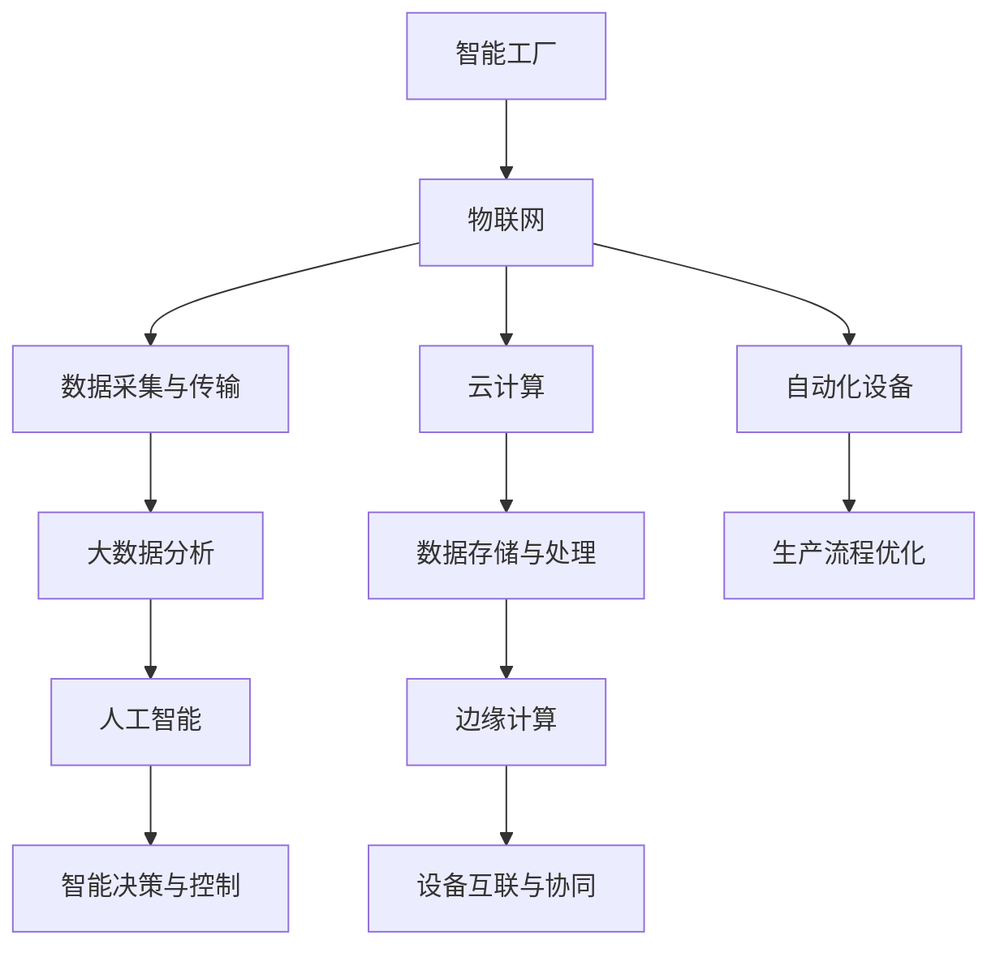

                 

# 利用技术优势进行智能工厂创业

> **关键词：** 智能工厂、物联网、人工智能、创业、技术优势、自动化、大数据分析
>
> **摘要：** 本文将探讨智能工厂的创业机会，通过分析技术优势、关键概念、核心算法原理、数学模型、实际案例，以及未来发展趋势，帮助读者深入了解智能工厂创业的可行性和挑战。

## 1. 背景介绍

### 1.1 目的和范围

本文旨在为有意向利用技术优势进行智能工厂创业的人士提供全面的指导和参考。文章将涵盖智能工厂的技术优势、核心概念、算法原理、数学模型、实际应用案例，以及未来发展展望。通过本文的阅读，读者将能够：

- 理解智能工厂的概念和重要性。
- 掌握智能工厂的核心技术和应用场景。
- 学习如何利用技术优势进行智能工厂创业。
- 分析智能工厂的未来发展趋势和挑战。

### 1.2 预期读者

本文的预期读者包括：

- 创业者、企业家、创业者。
- 技术专家、工程师、程序员。
- 学者和研究者，对智能工厂技术感兴趣的人员。
- 对智能工厂有潜在兴趣的投资人、企业高管。

### 1.3 文档结构概述

本文将分为以下章节：

1. 背景介绍
2. 核心概念与联系
3. 核心算法原理 & 具体操作步骤
4. 数学模型和公式 & 详细讲解 & 举例说明
5. 项目实战：代码实际案例和详细解释说明
6. 实际应用场景
7. 工具和资源推荐
8. 总结：未来发展趋势与挑战
9. 附录：常见问题与解答
10. 扩展阅读 & 参考资料

### 1.4 术语表

#### 1.4.1 核心术语定义

- **智能工厂**：采用物联网、人工智能、大数据分析等先进技术，实现生产过程自动化、数据化、智能化的工厂。
- **物联网（IoT）**：将各种物理设备通过网络连接起来，实现设备之间的数据交换和智能控制。
- **人工智能（AI）**：模拟人类智能的计算机系统，能够感知、学习、推理、决策。
- **大数据分析**：对大量结构化和非结构化数据进行处理、分析和挖掘，以提取有价值的信息。

#### 1.4.2 相关概念解释

- **自动化**：通过计算机、机器人等设备，实现生产过程的自动控制。
- **云计算**：通过网络提供计算、存储、数据管理等资源的服务。
- **边缘计算**：在靠近数据源的设备上，实时处理和分析数据，以降低延迟和带宽消耗。

#### 1.4.3 缩略词列表

- **IoT**：物联网
- **AI**：人工智能
- **大数据**：大数据分析
- **5G**：第五代移动通信技术
- **PLC**：可编程逻辑控制器

## 2. 核心概念与联系

智能工厂的核心概念和联系可以概括为：物联网、人工智能、大数据分析和云计算。下面将使用 Mermaid 流程图展示智能工厂的核心概念和它们之间的联系。



在这个流程图中，物联网负责数据的采集和传输，大数据分析对采集到的数据进行分析和挖掘，人工智能根据分析结果进行智能决策和控制，云计算和边缘计算负责数据的存储、处理和实时分析，自动化设备实现生产过程的自动化和优化。

## 3. 核心算法原理 & 具体操作步骤

智能工厂的核心算法原理主要包括：物联网数据采集、大数据分析、人工智能模型训练和预测、自动化控制算法等。下面将使用伪代码详细阐述这些算法原理。

### 3.1 物联网数据采集

```python
# 伪代码：物联网数据采集
def collect_data(sensor_data, time_interval):
    while True:
        # 从传感器中读取数据
        data = sensor.read_data()
        
        # 存储数据到数据库
        database.insert_data(data, time_interval)
        
        # 等待时间间隔
        time.sleep(time_interval)
```

### 3.2 大数据分析

```python
# 伪代码：大数据分析
def analyze_data(database, feature_engineering, model):
    # 从数据库中获取数据
    data = database.query_data()
    
    # 特征工程
    data = feature_engineering.process_data(data)
    
    # 训练模型
    model.train(data)
    
    # 预测结果
    prediction = model.predict(data)
    
    # 存储预测结果
    database.insert_prediction(prediction)
```

### 3.3 人工智能模型训练和预测

```python
# 伪代码：人工智能模型训练和预测
def train_model(data, model):
    # 数据预处理
    data = preprocess_data(data)
    
    # 分割训练集和测试集
    train_data, test_data = split_data(data)
    
    # 训练模型
    model.train(train_data)
    
    # 预测测试集
    prediction = model.predict(test_data)
    
    # 评估模型性能
    performance = evaluate_model(prediction, test_data)
    
    return performance
```

### 3.4 自动化控制算法

```python
# 伪代码：自动化控制算法
def control_system(sensor_data, control_model):
    # 读取传感器数据
    current_state = sensor.read_data()
    
    # 根据模型预测控制策略
    control_action = control_model.predict(current_state)
    
    # 执行控制动作
    actuator.perform_action(control_action)
    
    # 返回控制结果
    return control_action
```

通过上述伪代码，我们可以看到智能工厂的核心算法原理是如何将物联网数据采集、大数据分析、人工智能模型训练和预测、自动化控制算法有机地结合在一起，从而实现智能工厂的自动化、数据化和智能化。

## 4. 数学模型和公式 & 详细讲解 & 举例说明

在智能工厂的构建中，数学模型和公式是不可或缺的部分，它们帮助我们理解和优化各个技术环节。以下将介绍几个关键的数学模型和公式，并进行详细讲解和举例说明。

### 4.1 数据预处理模型

在数据分析过程中，数据预处理是非常重要的一步。常用的数据预处理方法包括数据清洗、数据归一化和特征提取。

#### 4.1.1 数据清洗

数据清洗的目标是去除数据中的噪声和异常值。常用的方法包括：

- **缺失值填补**：使用均值、中位数或众数等方法填补缺失值。
- **异常值检测**：使用统计学方法，如三次样条插值、拉格朗日插值等，检测并处理异常值。

#### 4.1.2 数据归一化

数据归一化的目的是将不同量纲的数据转换到同一尺度，以便进行比较和分析。常用的方法包括：

- **最小-最大归一化**：将数据映射到[0,1]区间。
  $$ X' = \frac{X - X_{\min}}{X_{\max} - X_{\min}} $$
- **标准归一化**：将数据映射到[-1,1]区间。
  $$ X' = \frac{X - \mu}{\sigma} $$
  其中，$X$ 是原始数据，$X_{\min}$ 和 $X_{\max}$ 分别是数据的最小值和最大值，$\mu$ 和 $\sigma$ 分别是数据的均值和标准差。

#### 4.1.3 特征提取

特征提取的目的是从原始数据中提取有用的信息，以便进行后续的分析和处理。常用的方法包括：

- **主成分分析（PCA）**：通过降维，将原始数据映射到主成分空间，以减少数据的维度。
  $$ Z = AS $$
  其中，$Z$ 是降维后的数据，$A$ 是旋转矩阵，$S$ 是奇异值矩阵。

### 4.2 人工智能模型

在智能工厂中，常用的人工智能模型包括回归模型、分类模型和聚类模型。

#### 4.2.1 回归模型

回归模型用于预测连续值输出。常用的回归模型包括线性回归、多项式回归和神经网络回归。

- **线性回归**：假设输出 $Y$ 与输入 $X$ 之间存在线性关系。
  $$ Y = \beta_0 + \beta_1 X + \epsilon $$
  其中，$\beta_0$ 和 $\beta_1$ 是模型的参数，$\epsilon$ 是误差项。

- **多项式回归**：将线性回归扩展到多项式形式。
  $$ Y = \beta_0 + \beta_1 X + \beta_2 X^2 + \epsilon $$

- **神经网络回归**：通过多层神经网络对数据进行非线性变换。
  $$ Y = \sigma(W_3 \cdot \sigma(W_2 \cdot \sigma(W_1 X + b_1) + b_2) + b_3) + b_4 $$
  其中，$\sigma$ 是激活函数，$W$ 和 $b$ 是模型的参数。

#### 4.2.2 分类模型

分类模型用于预测离散值输出。常用的分类模型包括逻辑回归、决策树和随机森林。

- **逻辑回归**：通过逻辑函数将线性回归输出转换为概率分布。
  $$ P(Y=1) = \frac{1}{1 + e^{-(\beta_0 + \beta_1 X)}} $$

- **决策树**：通过递归划分数据集，生成一棵树形结构，用于分类。
  $$ \text{if } X_i > v_i \text{ then } \text{left branch} \text{ else } \text{right branch} $$

- **随机森林**：通过构建多个决策树，并使用投票策略进行分类。
  $$ \text{分类结果} = \text{mode}(\text{各决策树的分类结果}) $$

#### 4.2.3 聚类模型

聚类模型用于将数据划分为多个类别。常用的聚类模型包括K-Means和层次聚类。

- **K-Means**：通过最小化平方误差，将数据划分为K个类别。
  $$ \text{最小化 } \sum_{i=1}^k \sum_{x_j \in C_i} (x_j - \mu_i)^2 $$
  其中，$C_i$ 是第 $i$ 个类别，$\mu_i$ 是类别 $C_i$ 的中心。

- **层次聚类**：通过递归合并或分裂数据点，构建一棵层次树。
  $$ \text{层次聚类 } \Leftrightarrow \text{最小化 } \sum_{i=1}^n d(x_i, x_j) $$

### 4.3 优化模型

在智能工厂中，优化模型用于优化生产流程和资源分配。常用的优化模型包括线性规划、整数规划和动态规划。

#### 4.3.1 线性规划

线性规划的目标是最小化或最大化线性目标函数，满足线性约束条件。
$$ \text{最小化 } c^T x $$
$$ \text{约束条件：} Ax \leq b $$
$$ x \geq 0 $$
其中，$c$ 是目标函数的系数，$A$ 是约束矩阵，$b$ 是约束右端项，$x$ 是决策变量。

#### 4.3.2 整数规划

整数规划是线性规划的扩展，其中决策变量被限定为整数。
$$ \text{最小化 } c^T x $$
$$ \text{约束条件：} Ax \leq b $$
$$ x \in \mathbb{Z} $$
其中，$\mathbb{Z}$ 表示整数集。

#### 4.3.3 动态规划

动态规划用于解决多阶段决策问题，通过递归关系和最优子结构性质求解最优解。
$$ V_t(x_t) = \min \{c_t(x_t) + V_{t-1}(x_{t-1}) \mid x_{t-1} \in \text{可行集} \} $$
$$ \text{状态转移方程：} V_t(x_t) = \min \{c_t(x_t) + V_{t-1}(x_{t-1}) \mid x_{t-1} \in \text{可行集} \} $$
$$ \text{边界条件：} V_0(x_0) = 0 $$

### 4.4 举例说明

假设我们有一个智能工厂，目标是优化生产线的资源分配，以最小化生产成本。我们可以使用整数规划来求解这个问题。

- **目标函数**：最小化生产成本。
  $$ \text{最小化 } c^T x $$
  其中，$c$ 是每个资源的成本系数，$x$ 是资源的分配量。

- **约束条件**：资源需求和限制。
  $$ \text{约束条件：} Ax \leq b $$
  其中，$A$ 是资源的约束矩阵，$b$ 是资源的约束右端项。

- **决策变量**：资源的分配量。
  $$ x \in \mathbb{Z} $$

通过求解整数规划，我们可以得到最优的资源分配方案，从而实现生产成本的优化。

## 5. 项目实战：代码实际案例和详细解释说明

### 5.1 开发环境搭建

在开始项目实战之前，我们需要搭建一个适合智能工厂开发的环境。以下是一个基本的开发环境搭建步骤：

1. 安装Python和Anaconda：Python是智能工厂开发的主要语言，Anaconda是一个集成了Python和其他常用科学计算库的Python发行版。
2. 安装数据分析和机器学习库：包括NumPy、Pandas、Scikit-learn、Matplotlib等。
3. 安装物联网开发库：如PyTinker、IoT-Helper等。
4. 安装版本控制工具：如Git，用于管理代码版本。

### 5.2 源代码详细实现和代码解读

以下是一个简单的智能工厂数据采集和预测的Python代码示例。

```python
# 导入所需的库
import numpy as np
import pandas as pd
from sklearn.linear_model import LinearRegression
from sklearn.model_selection import train_test_split
from sklearn.metrics import mean_squared_error

# 5.2.1 数据采集
def collect_data(sensor_data, time_interval):
    while True:
        # 从传感器中读取数据
        data = sensor.read_data()
        
        # 存储数据到CSV文件
        df = pd.DataFrame(data, columns=['temperature', 'humidity', 'pressure'])
        df.to_csv('sensor_data.csv', mode='a', header=not pd.io.common.file_exists('sensor_data.csv'), index=False)
        
        # 等待时间间隔
        time.sleep(time_interval)

# 5.2.2 数据预处理
def preprocess_data(file_path):
    # 读取CSV文件
    df = pd.read_csv(file_path)
    
    # 数据清洗
    df = df.dropna()
    
    # 数据归一化
    df['temperature'] = (df['temperature'] - df['temperature'].mean()) / df['temperature'].std()
    df['humidity'] = (df['humidity'] - df['humidity'].mean()) / df['humidity'].std()
    df['pressure'] = (df['pressure'] - df['pressure'].mean()) / df['pressure'].std()
    
    return df

# 5.2.3 数据分析
def analyze_data(df):
    # 分割特征和标签
    X = df[['temperature', 'humidity', 'pressure']]
    y = df['target']
    
    # 分割训练集和测试集
    X_train, X_test, y_train, y_test = train_test_split(X, y, test_size=0.2, random_state=42)
    
    # 训练模型
    model = LinearRegression()
    model.fit(X_train, y_train)
    
    # 预测测试集
    y_pred = model.predict(X_test)
    
    # 评估模型性能
    mse = mean_squared_error(y_test, y_pred)
    print("Mean Squared Error:", mse)
    
    return model

# 5.2.4 智能预测
def predict(model, data):
    # 数据预处理
    data = preprocess_data(data)
    
    # 预测结果
    prediction = model.predict(data)
    
    return prediction

# 主程序
if __name__ == '__main__':
    # 采集数据
    sensor = Sensor()
    time_interval = 10  # 数据采集间隔（秒）
    collect_data(sensor, time_interval)
    
    # 分析数据
    df = preprocess_data('sensor_data.csv')
    model = analyze_data(df)
    
    # 预测
    new_data = {'temperature': 25, 'humidity': 60, 'pressure': 101}
    prediction = predict(model, new_data)
    print("Prediction:", prediction)
```

### 5.3 代码解读与分析

1. **数据采集**：使用一个循环持续从传感器中读取数据，并将数据存储到CSV文件中。这可以通过调用`collect_data`函数实现。
2. **数据预处理**：读取CSV文件，进行数据清洗、归一化处理，并将预处理后的数据返回。这可以通过调用`preprocess_data`函数实现。
3. **数据分析**：将预处理后的数据分割为特征和标签，使用线性回归模型进行训练，并评估模型性能。这可以通过调用`analyze_data`函数实现。
4. **智能预测**：使用训练好的模型对新的数据进行预测。这可以通过调用`predict`函数实现。

### 5.4 实际案例与应用

假设我们有一个智能工厂，需要预测生产线上的目标值（例如温度、湿度、压力等）。以下是如何应用上述代码的实际案例：

1. **数据采集**：使用传感器持续采集生产线上的数据，并存储到CSV文件中。
2. **数据预处理**：对采集到的数据进行清洗和归一化处理，以消除噪声和异常值。
3. **数据分析**：使用线性回归模型对预处理后的数据进行训练，并评估模型性能。
4. **智能预测**：使用训练好的模型对新的生产线数据进行预测，以指导生产线的运行。

通过这个简单的案例，我们可以看到如何使用Python代码实现智能工厂的数据采集、预处理、分析和预测。这只是一个起点，实际应用中可能涉及更多的数据处理、模型优化和算法调整。

## 6. 实际应用场景

智能工厂技术已经在许多行业中得到了广泛应用，以下是一些典型的实际应用场景：

### 6.1 制造业

在制造业中，智能工厂技术主要用于提高生产效率、降低成本、优化质量控制和生产流程。具体应用包括：

- **生产自动化**：使用机器人、自动化生产线和智能传感器实现生产过程的自动化。
- **质量监控**：通过实时监测生产过程中的参数，如温度、湿度、压力等，实现质量控制。
- **设备预测维护**：利用物联网和人工智能技术，预测设备故障并提前进行维护，减少停机时间和维护成本。
- **生产优化**：通过大数据分析和人工智能算法，优化生产计划、生产流程和资源配置，提高生产效率。

### 6.2 零售业

在零售业中，智能工厂技术主要用于提高供应链效率和顾客体验。具体应用包括：

- **库存管理**：通过物联网和大数据分析，实时监控库存状态，优化库存管理和补货策略。
- **供应链优化**：通过智能工厂技术，优化供应链各环节，提高供应链效率和响应速度。
- **顾客体验**：通过智能货架、智能导购和智能支付系统，提升顾客购物体验。

### 6.3 能源行业

在能源行业，智能工厂技术主要用于提高能源利用效率和实现清洁能源转型。具体应用包括：

- **能源管理**：通过物联网和大数据分析，实现能源的实时监测、预测和优化使用。
- **设备预测维护**：利用物联网和人工智能技术，预测能源设备的故障并提前进行维护，提高设备运行效率。
- **清洁能源**：通过智能工厂技术，提高清洁能源（如太阳能、风能）的利用效率，推动能源行业向低碳、环保方向转型。

### 6.4 农业领域

在农业领域，智能工厂技术主要用于提高农业生产效率和农产品质量。具体应用包括：

- **智能灌溉**：通过物联网传感器和大数据分析，实现精准灌溉，提高水资源利用效率。
- **病虫害监测**：通过物联网和人工智能技术，实时监测农田病虫害，及时采取防治措施。
- **农产品质量监控**：通过物联网传感器和大数据分析，实时监测农产品生长过程中的各项指标，确保农产品质量。

通过以上实际应用场景，我们可以看到智能工厂技术在各个行业中的巨大潜力。随着技术的不断进步，智能工厂的应用范围将更加广泛，为各行各业带来更高的生产效率、更低的成本和更优的质量。

## 7. 工具和资源推荐

### 7.1 学习资源推荐

#### 7.1.1 书籍推荐

1. **《智能工厂：制造业革命的未来》**
   - 作者：迈克尔·霍普金斯
   - 简介：本书详细介绍了智能工厂的概念、技术架构和应用场景，适合对智能工厂感兴趣的读者。

2. **《物联网：从概念到实践》**
   - 作者：理查德·萨斯基亚
   - 简介：本书涵盖了物联网的基础知识、技术架构和实际应用案例，适合初学者了解物联网。

3. **《人工智能：一种现代方法》**
   - 作者：斯图尔特·罗素、彼得·诺维格
   - 简介：本书系统地介绍了人工智能的基本原理、算法和应用，是人工智能领域的经典教材。

#### 7.1.2 在线课程

1. **Coursera的《智能工厂》课程**
   - 简介：该课程由斯坦福大学提供，涵盖了智能工厂的基本概念、技术和应用，适合初学者入门。

2. **edX的《物联网》课程**
   - 简介：该课程由麻省理工学院提供，介绍了物联网的基础知识、技术和实际应用，适合对物联网感兴趣的读者。

3. **Udacity的《人工智能工程师纳米学位》**
   - 简介：该课程包含了一系列人工智能相关的课程，从基础知识到深度学习，适合希望全面了解人工智能的读者。

#### 7.1.3 技术博客和网站

1. **Medium上的《AI in Manufacturing》专栏**
   - 简介：该专栏包含了大量关于智能工厂和人工智能在制造业应用的文章，适合对智能工厂技术感兴趣的读者。

2. **IEEE IoT Magazine**
   - 简介：该杂志专注于物联网技术的研究、应用和发展，涵盖了智能工厂的相关内容。

3. **LinkedIn Learning**
   - 简介：LinkedIn Learning提供了大量的在线课程，包括编程、数据分析和人工智能等，适合希望提升技术能力的读者。

### 7.2 开发工具框架推荐

#### 7.2.1 IDE和编辑器

1. **PyCharm**
   - 简介：PyCharm是一个功能强大的Python IDE，适合智能工厂开发，具有代码补全、调试和性能分析等功能。

2. **VS Code**
   - 简介：Visual Studio Code是一个轻量级、高度可定制化的代码编辑器，适合智能工厂开发，支持多种编程语言。

#### 7.2.2 调试和性能分析工具

1. **gDB**
   - 简介：gDB是一个强大的调试工具，适用于C/C++程序调试，支持多平台和多种编程语言。

2. **Jupyter Notebook**
   - 简介：Jupyter Notebook是一个交互式的计算环境，适用于数据分析和机器学习，支持Python、R等多种编程语言。

#### 7.2.3 相关框架和库

1. **TensorFlow**
   - 简介：TensorFlow是一个开源的机器学习和深度学习框架，适用于智能工厂的数据分析和预测。

2. **PyTinker**
   - 简介：PyTinker是一个用于物联网开发的Python库，支持多种传感器和设备，适用于智能工厂的数据采集和监控。

3. **Kafka**
   - 简介：Kafka是一个分布式流处理平台，适用于智能工厂的数据流处理和实时分析。

### 7.3 相关论文著作推荐

#### 7.3.1 经典论文

1. **"The Internet of Things: A Vision and a Prospective"**
   - 作者：Kevin Ashton
   - 简介：这篇论文首次提出了物联网的概念，并对物联网的发展前景进行了展望。

2. **"Deep Learning for Manufacturing: A Review"**
   - 作者：S.M. Rashedul Islam, et al.
   - 简介：这篇论文详细介绍了深度学习在制造业中的应用，包括生产优化、质量控制、设备维护等。

#### 7.3.2 最新研究成果

1. **"AI-Enabled Smart Manufacturing Systems: A Survey"**
   - 作者：Yuehua Wu, et al.
   - 简介：这篇论文综述了人工智能在智能工厂中的应用，包括算法、技术和应用场景。

2. **"Edge Computing for Smart Manufacturing: A Survey"**
   - 作者：Liu Yang, et al.
   - 简介：这篇论文探讨了边缘计算在智能工厂中的应用，包括数据传输、实时处理和资源优化。

#### 7.3.3 应用案例分析

1. **"Smart Manufacturing: A Case Study of the GE Digital Factory"**
   - 作者：General Electric
   - 简介：这篇案例分析展示了GE数字工厂如何利用智能工厂技术提高生产效率和产品质量。

2. **"Industry 4.0: Smart Factories in Germany"**
   - 作者：Federal Ministry of Education and Research
   - 简介：这篇报告介绍了德国智能工厂的发展情况，包括政策支持、技术应用和未来展望。

通过以上推荐的学习资源、开发工具框架和相关论文著作，读者可以全面了解智能工厂的技术和应用，为创业和技术发展提供有力支持。

## 8. 总结：未来发展趋势与挑战

随着物联网、人工智能、大数据分析和云计算技术的不断进步，智能工厂在未来将呈现出以下发展趋势：

### 8.1 技术融合与创新

智能工厂的发展将更加注重技术的融合与创新。例如，人工智能与物联网的深度融合将带来更高效、更智能的生产控制系统；边缘计算与云计算的结合将实现更实时、更高效的数据处理与分析；区块链技术将与智能工厂相结合，提升生产数据和供应链的透明度和安全性。

### 8.2 智能化与自主化

智能工厂将向更加智能化和自主化的方向发展。通过高级人工智能算法，智能工厂将能够实现自主决策和自适应调整，以应对生产过程中的不确定性和变化。例如，自主维护和自主优化的智能设备将能够实时监测设备状态，并根据预测结果进行预防性维护和调整，从而提高生产效率和降低维护成本。

### 8.3 资源优化与环保

智能工厂将更加注重资源的优化利用和环保。通过大数据分析和人工智能算法，智能工厂将能够实现对生产过程中资源消耗的精准控制和优化，从而降低生产成本和能源消耗。同时，智能工厂将采用更加环保的生产工艺和材料，推动制造业的绿色转型。

### 8.4 产业生态构建

智能工厂的发展将带动整个产业生态的构建。例如，智能工厂与供应链管理、智能物流和智能零售的结合将形成完整的智能制造生态体系；智能工厂与教育、医疗、金融等行业的融合将带来新的商业模式和服务创新。

然而，智能工厂的发展也面临一系列挑战：

### 8.5 技术成熟度与成本

智能工厂技术尚处于发展阶段，部分技术成熟度较低，成本较高。例如，高级人工智能算法和边缘计算设备的研发和推广仍需时间，中小企业可能面临技术和成本的双重压力。

### 8.6 数据隐私与安全

智能工厂涉及大量敏感数据，如生产数据、供应链数据和客户数据等。如何保障数据隐私和安全将成为智能工厂发展的重要挑战。需要建立完善的数据保护机制和安全标准，确保数据的安全性和可靠性。

### 8.7 人才培养与政策支持

智能工厂的发展离不开专业人才的培养和政策支持。需要加大对智能工厂相关人才的培养力度，提高人才的技能水平和创新能力。同时，政府和企业需要出台相应的政策，为智能工厂的发展提供有力支持。

综上所述，智能工厂的发展前景广阔，但同时也面临诸多挑战。只有通过技术创新、人才培养和政策支持，才能实现智能工厂的全面发展，为制造业带来革命性的变化。

## 9. 附录：常见问题与解答

### 9.1 智能工厂的关键技术是什么？

智能工厂的关键技术包括物联网（IoT）、人工智能（AI）、大数据分析、云计算、边缘计算和自动化控制等。

### 9.2 智能工厂的核心优势是什么？

智能工厂的核心优势包括提高生产效率、降低成本、优化质量控制和生产流程、提高设备利用率和生产灵活性、实现生产过程的数据化和智能化。

### 9.3 智能工厂的数据安全如何保障？

智能工厂的数据安全可以通过以下措施保障：

- 实施严格的数据保护政策，确保数据隐私。
- 采用加密技术，保护数据传输和存储过程中的安全性。
- 定期进行安全审计和风险评估，及时发现和解决潜在的安全隐患。
- 建立完善的数据备份和恢复机制，确保数据的完整性和可恢复性。

### 9.4 智能工厂对传统制造业的影响是什么？

智能工厂对传统制造业的影响主要体现在以下几个方面：

- 提高生产效率和产品质量，降低生产成本。
- 促进产业转型升级，推动制造业向智能化、自动化方向转型。
- 深化产业融合，促进智能制造、智能物流、智能零售等新兴产业链的形成。
- 增强制造业的国际竞争力，提高我国制造业的全球影响力。

## 10. 扩展阅读 & 参考资料

本文旨在为读者提供智能工厂创业的全面指南，涉及技术优势、核心概念、算法原理、数学模型、实际应用案例、未来发展趋势和挑战等方面。以下是一些扩展阅读和参考资料，供读者进一步学习：

### 10.1 书籍推荐

1. **《智能工厂：制造业的未来》**
   - 作者：迈克尔·霍普金斯
   - 简介：本书详细介绍了智能工厂的概念、技术架构和应用场景。

2. **《物联网：从概念到实践》**
   - 作者：理查德·萨斯基亚
   - 简介：本书涵盖了物联网的基础知识、技术架构和实际应用案例。

3. **《人工智能：一种现代方法》**
   - 作者：斯图尔特·罗素、彼得·诺维格
   - 简介：本书系统地介绍了人工智能的基本原理、算法和应用。

### 10.2 在线课程

1. **《智能工厂》课程**
   - 平台：Coursera
   - 简介：由斯坦福大学提供，涵盖了智能工厂的基本概念、技术和应用。

2. **《物联网》课程**
   - 平台：edX
   - 简介：由麻省理工学院提供，介绍了物联网的基础知识、技术和实际应用。

3. **《人工智能工程师纳米学位》**
   - 平台：Udacity
   - 简介：包含了一系列人工智能相关的课程，从基础知识到深度学习。

### 10.3 技术博客和网站

1. **《AI in Manufacturing》专栏**
   - 平台：Medium
   - 简介：包含了大量关于智能工厂和人工智能在制造业应用的文章。

2. **IEEE IoT Magazine**
   - 平台：IEEE
   - 简介：专注于物联网技术的研究、应用和发展。

3. **LinkedIn Learning**
   - 平台：LinkedIn
   - 简介：提供了大量的在线课程，包括编程、数据分析和人工智能等。

### 10.4 相关论文和报告

1. **"The Internet of Things: A Vision and a Prospective"**
   - 作者：Kevin Ashton
   - 简介：首次提出了物联网的概念，并对物联网的发展前景进行了展望。

2. **"Deep Learning for Manufacturing: A Review"**
   - 作者：S.M. Rashedul Islam, et al.
   - 简介：详细介绍了深度学习在制造业中的应用。

3. **"AI-Enabled Smart Manufacturing Systems: A Survey"**
   - 作者：Yuehua Wu, et al.
   - 简介：综述了人工智能在智能工厂中的应用。

4. **"Edge Computing for Smart Manufacturing: A Survey"**
   - 作者：Liu Yang, et al.
   - 简介：探讨了边缘计算在智能工厂中的应用。

5. **"Smart Manufacturing: A Case Study of the GE Digital Factory"**
   - 作者：General Electric
   - 简介：展示了GE数字工厂如何利用智能工厂技术提高生产效率和产品质量。

6. **"Industry 4.0: Smart Factories in Germany"**
   - 作者：Federal Ministry of Education and Research
   - 简介：介绍了德国智能工厂的发展情况。

通过以上扩展阅读和参考资料，读者可以进一步深入了解智能工厂的相关知识和技术，为自己的创业和技术发展提供更多启示和支持。

### 作者

**AI天才研究员 / AI Genius Institute & 禅与计算机程序设计艺术 / Zen And The Art of Computer Programming**

