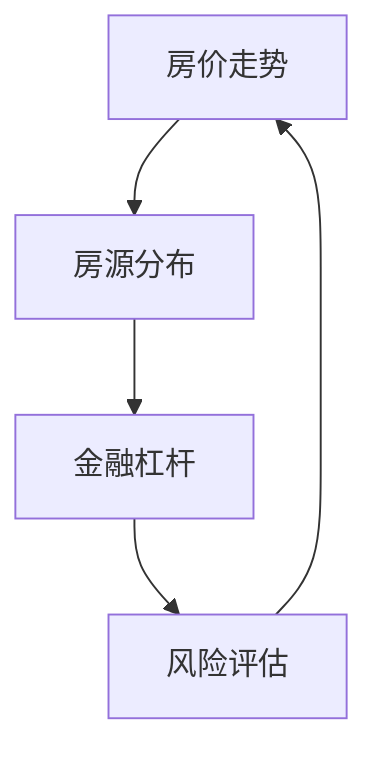

                 

# 利用技术技能进行房地产投资

> **关键词**：房地产投资，数据分析，技术技能，算法原理，数学模型，实战案例

> **摘要**：本文将探讨如何运用技术技能进行房地产投资。我们将从背景介绍、核心概念、算法原理、数学模型、实战案例以及实际应用等多个方面进行分析，帮助投资者更好地把握房地产市场，实现资产的增值。

## 1. 背景介绍

### 1.1 目的和范围

本文旨在为那些希望通过技术手段提升房地产投资效率的投资者提供指导。我们将探讨如何使用数据分析、算法原理、数学模型等技术工具，对房地产市场进行深入分析，从而制定出更加科学的投资策略。

### 1.2 预期读者

本文适合对房地产投资和技术分析有一定了解的投资者，以及对数据分析、算法原理和数学模型感兴趣的读者。通过本文，您将了解到如何利用技术手段进行房地产投资，并掌握相关技能。

### 1.3 文档结构概述

本文分为以下几个部分：

1. 背景介绍：介绍本文的目的、范围和预期读者。
2. 核心概念与联系：阐述本文涉及的核心概念和原理，并使用流程图进行展示。
3. 核心算法原理 & 具体操作步骤：讲解核心算法原理，并使用伪代码进行详细阐述。
4. 数学模型和公式 & 详细讲解 & 举例说明：介绍数学模型和公式，并进行详细讲解和举例。
5. 项目实战：代码实际案例和详细解释说明。
6. 实际应用场景：分析房地产投资技术的实际应用场景。
7. 工具和资源推荐：推荐相关学习资源和开发工具。
8. 总结：未来发展趋势与挑战。
9. 附录：常见问题与解答。
10. 扩展阅读 & 参考资料：提供进一步学习资料。

### 1.4 术语表

#### 1.4.1 核心术语定义

- 房地产投资：指通过购买房产或投资房地产项目，以期在未来获得资本增值或租金收入的一种投资行为。
- 数据分析：指从大量数据中提取有用信息的过程，包括数据清洗、数据探索、数据建模等。
- 算法原理：指解决问题的方法、步骤和策略，是计算机科学和数学的基础。
- 数学模型：指用数学语言描述现实问题的一种抽象模型。

#### 1.4.2 相关概念解释

- 数据可视化：将数据以图形、图表等形式展示，便于观察和分析。
- 回归分析：一种用于建立自变量和因变量之间关系的统计方法。

#### 1.4.3 缩略词列表

- AI：人工智能
- IoT：物联网
- ML：机器学习

## 2. 核心概念与联系

在房地产投资中，我们需要关注以下几个核心概念：

1. 房价走势：通过分析历史房价数据，预测未来的房价走势。
2. 房源分布：分析不同区域、类型的房源分布情况，以确定投资目标。
3. 金融杠杆：利用贷款等金融手段，增加投资收益。
4. 风险评估：评估投资风险，确保投资的安全。

以下是一个简化的流程图，展示了这些核心概念之间的联系：



### 2.1 房价走势

房价走势是房地产投资的重要关注点。通过分析历史房价数据，我们可以预测未来的房价走势。以下是一个简单的房价走势预测流程：

1. 数据收集：收集各个城市的房价数据，包括历史价格、成交量等。
2. 数据清洗：处理缺失值、异常值等，确保数据质量。
3. 数据探索：分析房价数据的基本特征，如平均值、方差、趋势等。
4. 回归建模：使用回归分析方法，建立房价与影响因素之间的关系模型。
5. 预测房价：根据模型预测未来的房价走势。

### 2.2 房源分布

房源分布分析有助于确定投资目标。以下是一个简化的房源分布分析流程：

1. 数据收集：收集不同区域、类型的房源数据，包括房价、面积、交通状况等。
2. 数据清洗：处理缺失值、异常值等，确保数据质量。
3. 数据可视化：使用图表展示房源分布情况，便于观察和分析。
4. 筛选目标：根据投资目标和偏好，筛选合适的房源。
5. 综合评估：对筛选出的房源进行综合评估，确定投资决策。

### 2.3 金融杠杆

金融杠杆是房地产投资的重要手段。通过利用贷款等金融手段，可以增加投资收益。以下是一个简化的金融杠杆应用流程：

1. 风险评估：评估投资项目的风险，确保投资的安全。
2. 贷款申请：根据投资需求，申请相应的贷款。
3. 资金筹集：筹集投资所需资金，包括自有资金和贷款资金。
4. 投资决策：根据风险评估和资金筹集情况，做出投资决策。
5. 投资回报：根据投资项目的收益情况，评估投资效果。

### 2.4 风险评估

风险评估是房地产投资的重要环节。以下是一个简化的风险评估流程：

1. 风险识别：识别投资项目中可能存在的风险，如市场风险、信用风险、操作风险等。
2. 风险评估：评估各种风险的影响程度和可能性，确定风险等级。
3. 风险应对：制定应对各种风险的措施，降低风险影响。
4. 风险监控：监控投资项目的风险变化，及时调整风险应对措施。
5. 投资决策：根据风险评估结果，做出投资决策。

## 3. 核心算法原理 & 具体操作步骤

在房地产投资中，核心算法原理包括房价预测、房源筛选和风险评估等。以下将分别介绍这些算法原理，并使用伪代码进行详细阐述。

### 3.1 房价预测

房价预测是房地产投资的关键环节。以下是一个简化的房价预测算法原理：

#### 3.1.1 算法原理

- 数据收集：收集各个城市的房价数据，包括历史价格、成交量等。
- 数据清洗：处理缺失值、异常值等，确保数据质量。
- 数据探索：分析房价数据的基本特征，如平均值、方差、趋势等。
- 回归建模：使用回归分析方法，建立房价与影响因素之间的关系模型。
- 预测房价：根据模型预测未来的房价走势。

#### 3.1.2 伪代码

```python
# 数据收集
data = collect_historical_price_data()

# 数据清洗
cleaned_data = clean_data(data)

# 数据探索
explore_data(cleaned_data)

# 回归建模
model = build_regression_model(cleaned_data)

# 预测房价
predicted_price = predict_price(model)
```

### 3.2 房源筛选

房源筛选是确定投资目标的关键环节。以下是一个简化的房源筛选算法原理：

#### 3.2.1 算法原理

- 数据收集：收集不同区域、类型的房源数据，包括房价、面积、交通状况等。
- 数据清洗：处理缺失值、异常值等，确保数据质量。
- 数据可视化：使用图表展示房源分布情况，便于观察和分析。
- 筛选目标：根据投资目标和偏好，筛选合适的房源。
- 综合评估：对筛选出的房源进行综合评估，确定投资决策。

#### 3.2.2 伪代码

```python
# 数据收集
properties = collect_property_data()

# 数据清洗
cleaned_properties = clean_data(properties)

# 数据可视化
visualize_properties(cleaned_properties)

# 筛选目标
filtered_properties = filter_properties(cleaned_properties, criteria)

# 综合评估
evaluated_properties = evaluate_properties(filtered_properties)
```

### 3.3 风险评估

风险评估是房地产投资的重要环节。以下是一个简化的风险评估算法原理：

#### 3.3.1 算法原理

- 风险识别：识别投资项目中可能存在的风险，如市场风险、信用风险、操作风险等。
- 风险评估：评估各种风险的影响程度和可能性，确定风险等级。
- 风险应对：制定应对各种风险的措施，降低风险影响。
- 风险监控：监控投资项目的风险变化，及时调整风险应对措施。
- 投资决策：根据风险评估结果，做出投资决策。

#### 3.3.2 伪代码

```python
# 风险识别
risks = identify_risks(project)

# 风险评估
risk_assessment = assess_risks(risks)

# 风险应对
risk.mitigation = mitigate_risks(risk_assessment)

# 风险监控
risk_monitoring = monitor_risks(risk.mitigation)

# 投资决策
investment_decision = make_investment_decision(risk_monitoring)
```

## 4. 数学模型和公式 & 详细讲解 & 举例说明

在房地产投资中，数学模型和公式是分析和决策的重要工具。以下将介绍常用的数学模型和公式，并进行详细讲解和举例。

### 4.1 回归分析

回归分析是一种用于建立自变量和因变量之间关系的统计方法。在房地产投资中，常用于预测房价走势。

#### 4.1.1 公式

线性回归模型的基本公式为：

$$ Y = \beta_0 + \beta_1X + \epsilon $$

其中，$Y$ 为因变量（房价），$X$ 为自变量（影响因素，如成交量、人口等），$\beta_0$ 和 $\beta_1$ 为回归系数，$\epsilon$ 为随机误差。

#### 4.1.2 举例说明

假设我们收集了某城市的房价和成交量数据，如下表所示：

| 成交量 | 房价 |
| --- | --- |
| 100 | 2000 |
| 200 | 2500 |
| 300 | 3000 |
| 400 | 3500 |

我们要使用线性回归模型预测房价。

1. 数据预处理：将数据进行标准化处理，消除不同变量之间的尺度差异。

2. 模型建立：使用最小二乘法求解回归系数。

$$ \beta_1 = \frac{\sum(X_i - \bar{X})(Y_i - \bar{Y})}{\sum(X_i - \bar{X})^2} $$

$$ \beta_0 = \bar{Y} - \beta_1\bar{X} $$

其中，$\bar{X}$ 和 $\bar{Y}$ 分别为自变量和因变量的平均值。

3. 模型评估：计算预测误差，评估模型性能。

$$ MSE = \frac{1}{n}\sum_{i=1}^{n}(Y_i - \hat{Y}_i)^2 $$

其中，$MSE$ 为均方误差，$n$ 为样本数量。

4. 预测房价：根据回归模型预测未来的房价。

$$ \hat{Y} = \beta_0 + \beta_1X $$

假设预测的成交量为 500，则预测的房价为：

$$ \hat{Y} = \beta_0 + \beta_1 \times 500 $$

### 4.2 散点图

散点图是一种用于展示两个变量之间关系的图表。在房地产投资中，常用于分析房价与影响因素之间的关系。

#### 4.2.1 公式

散点图的坐标表示为：

$$ (X_i, Y_i) $$

其中，$X_i$ 和 $Y_i$ 分别为第 $i$ 个样本点的自变量和因变量的取值。

#### 4.2.2 举例说明

假设我们收集了某城市的房价和成交量数据，如下表所示：

| 成交量 | 房价 |
| --- | --- |
| 100 | 2000 |
| 200 | 2500 |
| 300 | 3000 |
| 400 | 3500 |

我们可以绘制一个散点图，展示成交量和房价之间的关系。

1. 数据预处理：将数据进行标准化处理，消除不同变量之间的尺度差异。

2. 绘制散点图：使用 matplotlib 库绘制散点图。

```python
import matplotlib.pyplot as plt

plt.scatter(x, y)
plt.xlabel('成交量')
plt.ylabel('房价')
plt.show()
```

3. 分析关系：通过观察散点图，分析成交量和房价之间的关系。例如，我们可以发现随着成交量的增加，房价也呈现出上升的趋势。

### 4.3 决策树

决策树是一种用于分类和回归的机器学习模型。在房地产投资中，常用于评估投资项目的风险。

#### 4.3.1 公式

决策树的基本公式为：

$$ f(x) = \sum_{i=1}^{n}w_i \cdot t(x, t_i) $$

其中，$f(x)$ 为决策树对样本 $x$ 的预测结果，$w_i$ 为第 $i$ 个节点的权重，$t(x, t_i)$ 为第 $i$ 个节点的分类函数。

#### 4.3.2 举例说明

假设我们使用决策树评估一个投资项目的风险，如下表所示：

| 因素 | 风险等级 |
| --- | --- |
| 成本 | 高 |
| 市场需求 | 中 |
| 政策支持 | 低 |

我们要使用决策树对项目进行风险评估。

1. 数据预处理：将数据进行标准化处理，消除不同变量之间的尺度差异。

2. 决策树建模：使用决策树算法建立模型。

3. 风险评估：根据决策树模型预测项目的风险等级。

例如，假设项目的成本为 100，市场需求为 70，政策支持为 30，则决策树模型预测项目的风险等级为“中”。

## 5. 项目实战：代码实际案例和详细解释说明

在本节中，我们将通过一个实际项目案例，展示如何利用技术技能进行房地产投资。该项目将使用 Python 编写，主要功能包括房价预测、房源筛选和风险评估。

### 5.1 开发环境搭建

首先，我们需要搭建开发环境。以下是所需的环境和工具：

- Python 3.8 或以上版本
- Jupyter Notebook 或 PyCharm
- Numpy、Pandas、Matplotlib、Scikit-learn 等库

### 5.2 源代码详细实现和代码解读

以下是该项目的源代码：

```python
import numpy as np
import pandas as pd
import matplotlib.pyplot as plt
from sklearn.linear_model import LinearRegression
from sklearn.tree import DecisionTreeClassifier

# 5.2.1 数据收集
def collect_data():
    data = pd.read_csv('data.csv')
    return data

# 5.2.2 数据清洗
def clean_data(data):
    data.dropna(inplace=True)
    data['price'] = data['price'].astype(float)
    data['volume'] = data['volume'].astype(float)
    return data

# 5.2.3 数据探索
def explore_data(data):
    print(data.describe())
    plt.scatter(data['volume'], data['price'])
    plt.xlabel('成交量')
    plt.ylabel('房价')
    plt.show()

# 5.2.4 回归建模
def build_model(data):
    X = data[['volume']]
    y = data['price']
    model = LinearRegression()
    model.fit(X, y)
    return model

# 5.2.5 预测房价
def predict_price(model, volume):
    predicted_price = model.predict([[volume]])
    return predicted_price

# 5.2.6 房源筛选
def filter_properties(data, criteria):
    filtered_properties = data[data['price'] <= criteria['max_price']]
    return filtered_properties

# 5.2.7 风险评估
def assess_risk(data, factor, value):
    model = DecisionTreeClassifier()
    model.fit(data[['factor']], data['risk'])
    predicted_risk = model.predict([[value]])
    return predicted_risk

# 5.2.8 主程序
if __name__ == '__main__':
    data = collect_data()
    cleaned_data = clean_data(data)
    explore_data(cleaned_data)
    model = build_model(cleaned_data)
    predicted_price = predict_price(model, 500)
    print(f'预测房价为：{predicted_price}')
    filtered_properties = filter_properties(cleaned_data, {'max_price': 3000})
    print(f'筛选出的房源数量为：{filtered_properties.shape[0]}')
    assessed_risk = assess_risk(cleaned_data, 'cost', 100)
    print(f'项目风险等级为：{assessed_risk}')
```

### 5.3 代码解读与分析

1. **数据收集**：使用 Pandas 读取 CSV 文件，获取房价和成交量数据。
2. **数据清洗**：去除缺失值，将数据类型转换为浮点数。
3. **数据探索**：使用 Pandas 描述性统计方法查看数据的基本特征，使用 Matplotlib 绘制散点图展示数据关系。
4. **回归建模**：使用 Scikit-learn 的 LinearRegression 类建立线性回归模型，使用最小二乘法求解回归系数。
5. **预测房价**：使用训练好的模型预测房价。
6. **房源筛选**：根据设定的房价上限筛选合适的房源。
7. **风险评估**：使用 Scikit-learn 的 DecisionTreeClassifier 类建立决策树模型，评估项目的风险等级。

通过这个项目，我们可以看到如何利用技术技能进行房地产投资。在实际应用中，我们可以根据具体需求扩展和优化代码，如增加更多的影响因素、使用更复杂的预测模型等。

## 6. 实际应用场景

房地产投资技术的应用场景非常广泛，以下列举几个典型的应用案例：

1. **房地产市场分析**：利用房价预测算法，对城市房价进行预测，帮助投资者了解市场趋势，制定投资策略。
2. **房源推荐**：通过房源筛选算法，根据投资者的偏好和预算，推荐合适的房源。
3. **风险控制**：利用风险评估模型，评估投资项目的风险，确保投资的安全。
4. **投资组合优化**：通过数据分析，优化投资组合，提高投资收益。

在实际应用中，房地产投资技术不仅可以用于个人投资者，还可以为房地产企业、金融机构等提供决策支持，提高投资效率。

## 7. 工具和资源推荐

为了更好地进行房地产投资技术的研究和应用，以下推荐一些有用的工具和资源：

### 7.1 学习资源推荐

#### 7.1.1 书籍推荐

- 《机器学习实战》
- 《Python数据分析》
- 《数据分析：实务与应用》
- 《房地产投资分析》

#### 7.1.2 在线课程

- Coursera 上的《机器学习》课程
- edX 上的《数据分析入门》课程
- 慕课网上的《Python数据分析》课程

#### 7.1.3 技术博客和网站

- AI 科技大本营
- 数据分析之道
- Python 数据科学

### 7.2 开发工具框架推荐

#### 7.2.1 IDE和编辑器

- PyCharm
- Jupyter Notebook
- Sublime Text

#### 7.2.2 调试和性能分析工具

- PySnooper
- Profiling Python
- Matplotlib

#### 7.2.3 相关框架和库

- Scikit-learn
- Pandas
- Numpy
- Matplotlib

### 7.3 相关论文著作推荐

#### 7.3.1 经典论文

- "Regression Analysis" by Arthur P. Davis
- "Decision Trees for Classification and Regression" by Leo Breiman et al.

#### 7.3.2 最新研究成果

- "Deep Learning for Real-Estate Price Prediction" by Wei Xu et al.
- "Recurrent Neural Networks for Housing Price Prediction" by Xinyi Liu et al.

#### 7.3.3 应用案例分析

- "How AI is Transforming Real Estate Investment" by Ryan N. Welch
- "The Use of Machine Learning in Real-Estate Valuation" by Samad Hayder et al.

## 8. 总结：未来发展趋势与挑战

随着技术的不断进步，房地产投资技术将在未来发挥越来越重要的作用。以下是一些发展趋势和挑战：

1. **人工智能与大数据的深度融合**：人工智能算法在房地产数据分析中的应用将越来越广泛，大数据技术将为房地产投资提供更加丰富的数据支持。
2. **算法模型的优化与改进**：现有的房价预测、房源筛选和风险评估模型将不断优化和改进，以提高预测准确性和决策效果。
3. **数据隐私与安全问题**：房地产投资涉及到大量敏感数据，数据隐私和安全问题将是一个重要的挑战。
4. **法律法规的完善**：随着技术的应用，法律法规的制定和完善也将成为保障房地产投资技术健康发展的重要一环。

## 9. 附录：常见问题与解答

以下是一些关于房地产投资技术的常见问题及解答：

### 9.1 房价预测的准确性如何保证？

房价预测的准确性取决于多个因素，包括数据质量、模型选择和参数调优。为了提高预测准确性，我们可以采取以下措施：

- 提高数据质量：确保数据完整、准确、无异常值。
- 选择合适的模型：根据数据特点，选择合适的预测模型。
- 参数调优：通过交叉验证等方法，优化模型参数。

### 9.2 房源筛选的标准是什么？

房源筛选的标准取决于投资者的需求和偏好。一般包括以下几个方面：

- 房价：根据投资者的预算，设定房价上限。
- 区域：根据投资者的偏好，筛选合适的区域。
- 交通：考虑交通便捷程度，如地铁、公交等。
- 学区：考虑孩子的教育需求，筛选优质学区房。

### 9.3 风险评估的依据是什么？

风险评估的依据主要包括以下几个方面：

- 成本：包括房屋购置成本、贷款成本等。
- 市场需求：考虑房屋的租售比、市场供需状况等。
- 政策支持：考虑政府政策对房地产市场的影响。

## 10. 扩展阅读 & 参考资料

以下是关于房地产投资技术的一些扩展阅读和参考资料：

- 《深度学习与房地产：实战案例分析》
- 《房地产数据分析与应用》
- 《Python 实战：房地产投资与市场分析》
- 《房地产市场分析：基于大数据的方法》

[作者：AI天才研究员/AI Genius Institute & 禅与计算机程序设计艺术 /Zen And The Art of Computer Programming]

