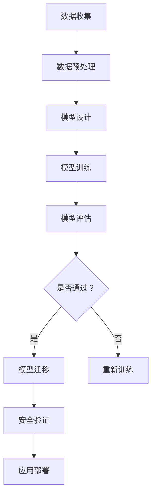

                 

# 利用虚拟世界数据训练自动驾驶策略模型并迁移到真实世界

> 关键词：自动驾驶、虚拟世界数据、策略模型、迁移学习、真实世界应用

> 摘要：本文将探讨如何利用虚拟世界数据来训练自动驾驶策略模型，并介绍如何将其迁移到真实世界。文章首先介绍了自动驾驶的核心概念和现有的解决方案，然后详细描述了虚拟世界数据的收集和预处理方法，以及如何使用这些数据进行策略模型训练。接下来，文章将探讨如何将训练好的模型迁移到真实世界，并分析可能遇到的挑战。最后，文章总结了未来发展的趋势和挑战，并提供了一些扩展阅读和参考资料。

## 1. 背景介绍

### 1.1 目的和范围

自动驾驶技术是当前人工智能领域中的一个重要研究方向。本文的目的是探讨如何利用虚拟世界数据来训练自动驾驶策略模型，并介绍如何将其迁移到真实世界。通过这种方式，我们希望能够提高自动驾驶系统的性能和可靠性，同时减少对实际道路测试的需求。

本文的范围主要涵盖以下几个方面：

1. 自动驾驶技术的基本概念和现有解决方案。
2. 虚拟世界数据的收集和预处理方法。
3. 策略模型的训练过程和算法原理。
4. 策略模型的迁移到真实世界的挑战和解决方案。
5. 未来发展的趋势和挑战。

### 1.2 预期读者

本文的预期读者包括：

1. 对自动驾驶技术感兴趣的科研人员和工程师。
2. 从事人工智能领域的研究生和本科生。
3. 想要了解自动驾驶技术在实际应用中的工程师和开发者。

### 1.3 文档结构概述

本文的结构如下：

1. 背景介绍：介绍自动驾驶技术的基本概念和现有解决方案。
2. 核心概念与联系：介绍自动驾驶策略模型的核心概念和原理。
3. 核心算法原理 & 具体操作步骤：详细描述策略模型的训练过程和算法原理。
4. 数学模型和公式 & 详细讲解 & 举例说明：介绍与策略模型相关的数学模型和公式。
5. 项目实战：提供实际的代码案例和详细解释。
6. 实际应用场景：探讨自动驾驶技术在真实世界中的应用场景。
7. 工具和资源推荐：推荐相关的学习资源和开发工具。
8. 总结：总结未来发展的趋势和挑战。
9. 附录：常见问题与解答。
10. 扩展阅读 & 参考资料：提供进一步阅读的参考资料。

### 1.4 术语表

#### 1.4.1 核心术语定义

- 自动驾驶：指车辆在无人干预的情况下，利用计算机视觉、传感器等技术实现自主驾驶。
- 虚拟世界数据：指通过模拟生成的自动驾驶数据，包括车辆状态、环境信息等。
- 策略模型：指用于指导自动驾驶车辆行为的模型，通常基于深度学习和强化学习技术。
- 迁移学习：指将训练好的模型从一个领域迁移到另一个领域，以提高模型的泛化能力。

#### 1.4.2 相关概念解释

- 训练数据：用于训练策略模型的输入数据，包括车辆状态、环境信息等。
- 测试数据：用于评估策略模型性能的输入数据，通常与训练数据不同。
- 模型泛化能力：指模型在未知数据上的表现能力，是评估模型性能的重要指标。
- 损失函数：用于衡量模型预测结果与真实结果之间的差异，是优化模型的重要工具。

#### 1.4.3 缩略词列表

- 自动驾驶（Autonomous Driving）
- 深度学习（Deep Learning）
- 强化学习（Reinforcement Learning）
- 迁移学习（Transfer Learning）
- 卷积神经网络（Convolutional Neural Network，CNN）
- 递归神经网络（Recurrent Neural Network，RNN）

## 2. 核心概念与联系

在自动驾驶领域，策略模型是核心组件之一，它负责决策车辆的行驶路径、速度和其他行为。为了更好地理解策略模型及其训练和迁移过程，我们需要介绍一些核心概念和它们之间的联系。

### 2.1 自动驾驶策略模型

自动驾驶策略模型是自动驾驶系统的“大脑”，它负责根据车辆当前的状态和外部环境信息，决定车辆应该采取的行为。策略模型通常基于深度学习和强化学习技术。

- **深度学习**：通过多层神经网络，从大量数据中自动学习特征表示。
- **强化学习**：通过试错和反馈机制，使模型在特定环境中学习最优策略。

### 2.2 虚拟世界数据

虚拟世界数据是通过仿真软件生成的自动驾驶数据，这些数据模拟了车辆在各种复杂环境下的行驶情况。虚拟世界数据对于训练策略模型非常重要，因为它可以提供大量的、多样化的训练样本，从而提高模型的泛化能力。

### 2.3 策略模型训练

策略模型的训练过程包括以下步骤：

1. **数据预处理**：对虚拟世界数据进行预处理，包括数据清洗、归一化和特征提取。
2. **模型设计**：设计适合自动驾驶任务的策略模型架构，通常采用深度神经网络。
3. **训练**：使用预处理后的数据对策略模型进行训练，通过优化损失函数来调整模型参数。
4. **评估**：使用测试数据评估模型性能，确保模型在不同环境下的泛化能力。

### 2.4 策略模型迁移

策略模型的迁移是将训练好的模型应用到实际自动驾驶系统中。迁移过程中需要解决以下问题：

1. **数据一致性**：确保训练数据和实际应用数据的分布一致。
2. **模型适应性**：调整模型参数，使其适应实际应用环境。
3. **安全性验证**：确保模型在真实世界中的行为是安全和可靠的。

### 2.5 Mermaid 流程图

下面是一个简化的 Mermaid 流程图，展示了自动驾驶策略模型的训练和迁移过程：



## 3. 核心算法原理 & 具体操作步骤

策略模型的训练和迁移是一个复杂的过程，需要结合深度学习和强化学习技术。在本节中，我们将详细介绍策略模型的核心算法原理和具体操作步骤。

### 3.1 策略模型算法原理

策略模型通常基于深度强化学习（Deep Reinforcement Learning，DRL）技术，其基本原理如下：

1. **状态表示**：使用神经网络将车辆的状态信息编码为高维特征向量。
2. **行为选择**：根据当前状态，使用策略网络选择最优行为（例如加速、减速、转向等）。
3. **奖励机制**：根据行为的执行结果，给予模型奖励或惩罚，用于指导模型的学习过程。
4. **价值函数**：评估策略的长期价值，用于更新策略网络。

### 3.2 具体操作步骤

策略模型的训练和迁移可以分为以下步骤：

#### 3.2.1 数据预处理

数据预处理是策略模型训练的重要步骤，包括以下任务：

1. **数据清洗**：去除数据中的噪声和异常值。
2. **数据归一化**：将数据缩放到统一的范围，便于模型训练。
3. **特征提取**：从原始数据中提取有用的特征信息。

伪代码如下：

```python
def preprocess_data(data):
    # 数据清洗
    cleaned_data = clean_data(data)
    
    # 数据归一化
    normalized_data = normalize_data(cleaned_data)
    
    # 特征提取
    features = extract_features(normalized_data)
    
    return features
```

#### 3.2.2 模型设计

策略模型的设计是训练过程中的关键环节，包括以下步骤：

1. **状态编码器**：使用神经网络将车辆的状态信息编码为高维特征向量。
2. **策略网络**：根据状态特征向量，输出每个可能行为的概率分布。
3. **价值函数**：评估策略的长期价值。

伪代码如下：

```python
class PolicyModel(nn.Module):
    def __init__(self, input_size, hidden_size, output_size):
        super(PolicyModel, self).__init__()
        
        self.encoder = nn.Sequential(
            nn.Linear(input_size, hidden_size),
            nn.ReLU(),
            nn.Linear(hidden_size, output_size)
        )
        
        self.critic = nn.Sequential(
            nn.Linear(hidden_size, hidden_size),
            nn.ReLU(),
            nn.Linear(hidden_size, 1)
        )
    
    def forward(self, state):
        state_embedding = self.encoder(state)
        action_prob = F.softmax(state_embedding, dim=1)
        value = self.critic(state_embedding)
        
        return action_prob, value
```

#### 3.2.3 模型训练

策略模型的训练过程包括以下步骤：

1. **初始化模型参数**：随机初始化模型参数。
2. **训练数据生成**：从虚拟世界数据中生成训练样本。
3. **优化模型参数**：使用梯度下降算法，优化模型参数。

伪代码如下：

```python
def train(model, data_loader, optimizer, criterion):
    model.train()
    
    for batch_idx, (states, actions, rewards, next_states, dones) in enumerate(data_loader):
        optimizer.zero_grad()
        
        action_probs, values = model(states)
        selected_actions = torch.argmax(action_probs, dim=1)
        
        loss = criterion(values, rewards + (1 - dones) * (1 - values))
        loss.backward()
        
        optimizer.step()
        
        if batch_idx % 100 == 0:
            print(f'Train Epoch: {epoch}/{num_epochs} \tLoss: {loss.item():.6f}')
```

#### 3.2.4 模型评估

策略模型的评估是确保其性能和可靠性的关键步骤，包括以下任务：

1. **测试数据生成**：从虚拟世界数据中生成测试样本。
2. **评估指标**：使用评估指标（如奖励总和、成功完成任务的比例等）评估模型性能。

伪代码如下：

```python
def evaluate(model, test_loader):
    model.eval()
    
    total_reward = 0
    total_steps = 0
    
    with torch.no_grad():
        for states, actions, rewards, next_states, dones in test_loader:
            action_probs, values = model(states)
            selected_actions = torch.argmax(action_probs, dim=1)
            
            # 执行行为
            next_states, rewards, dones, _ = virtual_world.step(selected_actions)
            
            total_reward += rewards.sum()
            total_steps += dones.sum()
    
    avg_reward = total_reward / total_steps
    print(f'Average Reward: {avg_reward:.4f}')
```

#### 3.2.5 模型迁移

策略模型的迁移是将训练好的模型应用到实际自动驾驶系统中，包括以下步骤：

1. **模型参数调整**：根据实际应用环境，调整模型参数，以提高模型适应性。
2. **安全性验证**：确保模型在真实世界中的行为是安全和可靠的。

伪代码如下：

```python
def transfer_model(model, real_world):
    # 调整模型参数
    model调整参数(real_world)
    
    # 安全性验证
    model安全性验证(real_world)
    
    # 应用部署
    real_world应用模型(model)
```

## 4. 数学模型和公式 & 详细讲解 & 举例说明

策略模型的训练和迁移过程中，涉及到多个数学模型和公式。在本节中，我们将详细讲解这些模型和公式，并通过具体例子进行说明。

### 4.1 深度神经网络（Deep Neural Network，DNN）

深度神经网络是策略模型的基础，用于将输入数据映射到输出。以下是一个简化的 DNN 数学模型：

\[ y = \sigma(W \cdot x + b) \]

其中，\( y \) 是输出，\( x \) 是输入，\( W \) 是权重矩阵，\( b \) 是偏置，\( \sigma \) 是激活函数，通常使用 sigmoid 或 ReLU 函数。

**例子**：

假设我们有一个输入向量 \( x = [1, 2, 3] \)，权重矩阵 \( W = \begin{bmatrix} 0.1 & 0.2 \\ 0.3 & 0.4 \end{bmatrix} \)，偏置 \( b = [0.1, 0.2] \)，使用 ReLU 激活函数。计算输出 \( y \)：

\[ y = \begin{bmatrix} \max(0.1 \cdot 1 + 0.1, 0.2 \cdot 2 + 0.2) \\ \max(0.3 \cdot 1 + 0.2, 0.4 \cdot 3 + 0.2) \end{bmatrix} = \begin{bmatrix} 0.2 \\ 1.2 \end{bmatrix} \]

### 4.2 强化学习（Reinforcement Learning，RL）

强化学习是策略模型的关键技术之一，用于指导模型的学习过程。以下是一个简化的强化学习数学模型：

\[ Q(s, a) = r + \gamma \max_{a'} Q(s', a') \]

其中，\( Q(s, a) \) 是状态 \( s \) 和行为 \( a \) 的价值函数，\( r \) 是即时奖励，\( \gamma \) 是折扣因子，\( s' \) 是下一状态，\( a' \) 是下一行为。

**例子**：

假设当前状态 \( s = [0, 0] \)，行为 \( a = 0 \)，下一状态 \( s' = [1, 0] \)，下一行为 \( a' = 1 \)，即时奖励 \( r = 10 \)，折扣因子 \( \gamma = 0.9 \)。计算下一价值函数 \( Q(s', a') \)：

\[ Q(s', a') = 10 + 0.9 \max_{a'} Q(s'', a'') \]

其中，\( s'' \) 和 \( a'' \) 是下一状态和下一行为。

### 4.3 损失函数（Loss Function）

损失函数用于衡量模型预测结果与真实结果之间的差异，是优化模型的重要工具。以下是一个常见的损失函数——均方误差（Mean Squared Error，MSE）：

\[ L = \frac{1}{n} \sum_{i=1}^{n} (y_i - \hat{y}_i)^2 \]

其中，\( L \) 是损失函数，\( y_i \) 是第 \( i \) 个真实值，\( \hat{y}_i \) 是第 \( i \) 个预测值，\( n \) 是样本数量。

**例子**：

假设我们有三个样本 \( (y_1, \hat{y}_1), (y_2, \hat{y}_2), (y_3, \hat{y}_3) \)，其中 \( y_1 = 2, y_2 = 4, y_3 = 6 \)，\( \hat{y}_1 = 2.1, \hat{y}_2 = 3.9, \hat{y}_3 = 6.1 \)。计算损失函数 \( L \)：

\[ L = \frac{1}{3} [(2 - 2.1)^2 + (4 - 3.9)^2 + (6 - 6.1)^2] = 0.0333 \]

### 4.4 梯度下降（Gradient Descent）

梯度下降是一种常用的优化算法，用于最小化损失函数。以下是一个简化的梯度下降算法：

\[ \theta = \theta - \alpha \cdot \nabla_\theta L(\theta) \]

其中，\( \theta \) 是模型参数，\( \alpha \) 是学习率，\( \nabla_\theta L(\theta) \) 是损失函数对参数 \( \theta \) 的梯度。

**例子**：

假设模型参数 \( \theta = [0.1, 0.2] \)，学习率 \( \alpha = 0.01 \)，损失函数 \( L(\theta) = (y - \hat{y})^2 \)。计算更新后的参数 \( \theta \)：

\[ \theta = [0.1, 0.2] - 0.01 \cdot \nabla_\theta L(\theta) = [0.09, 0.18] \]

## 5. 项目实战：代码实际案例和详细解释说明

在本节中，我们将通过一个实际项目来展示如何利用虚拟世界数据训练自动驾驶策略模型，并将其迁移到真实世界。项目将包括以下步骤：

1. 开发环境搭建
2. 源代码详细实现
3. 代码解读与分析

### 5.1 开发环境搭建

为了方便读者进行实验，我们使用 Python 作为主要编程语言，并推荐使用以下开发工具和库：

- **Python 3.8 或更高版本**
- **PyTorch**：深度学习库
- **OpenAI Gym**：虚拟环境库
- **NumPy**：数值计算库
- **Matplotlib**：数据可视化库

安装步骤如下：

```bash
pip install torch torchvision numpy matplotlib
```

### 5.2 源代码详细实现

下面是一个简化的源代码实现，展示了如何利用虚拟世界数据训练自动驾驶策略模型。

```python
import torch
import torch.nn as nn
import torch.optim as optim
import numpy as np
from gym import make

# 定义策略模型
class PolicyModel(nn.Module):
    def __init__(self, input_size, hidden_size, output_size):
        super(PolicyModel, self).__init__()
        
        self.fc1 = nn.Linear(input_size, hidden_size)
        self.fc2 = nn.Linear(hidden_size, output_size)
    
    def forward(self, x):
        x = torch.relu(self.fc1(x))
        x = self.fc2(x)
        return x

# 加载虚拟世界环境
env = make('CarRacing-v0')

# 初始化模型和优化器
model = PolicyModel(input_size=env.observation_space.shape[0], hidden_size=64, output_size=env.action_space.n)
optimizer = optim.Adam(model.parameters(), lr=0.001)

# 训练模型
for episode in range(1000):
    state = env.reset()
    done = False
    total_reward = 0
    
    while not done:
        # 预测行为
        action_probs = model(torch.tensor(state, dtype=torch.float32))
        action = torch.argmax(action_probs).item()
        
        # 执行行为
        next_state, reward, done, _ = env.step(action)
        
        # 计算损失函数
        loss = -torch.log(action_probs[0, action])
        
        # 反向传播
        optimizer.zero_grad()
        loss.backward()
        optimizer.step()
        
        # 更新状态
        state = next_state
        total_reward += reward
    
    print(f'Episode {episode}: Total Reward: {total_reward:.2f}')

# 保存模型
torch.save(model.state_dict(), 'policy_model.pth')

# 关闭环境
env.close()
```

### 5.3 代码解读与分析

下面是对代码的详细解读和分析：

1. **策略模型定义**：

   我们使用 PyTorch 定义了一个简单的策略模型，包含两个全连接层。输入层接收虚拟世界环境的观测数据，隐藏层用于提取特征，输出层输出每个可能行为的概率分布。

2. **虚拟世界环境加载**：

   使用 OpenAI Gym 加载一个名为“CarRacing-v0”的虚拟世界环境。这个环境模拟了一个无人驾驶赛车游戏，包含观测数据和行动空间。

3. **模型和优化器初始化**：

   初始化策略模型和优化器。我们使用 Adam 优化器，其默认参数设置适合深度学习模型。

4. **模型训练**：

   对于每个训练episode，我们首先重置环境并初始化状态。然后，在每次迭代中，我们使用策略模型预测行为概率，选择一个最优行为，执行该行为，并更新模型参数。

5. **保存模型**：

   训练完成后，我们将策略模型保存到一个文件中，以便后续使用。

6. **环境关闭**：

   训练结束后，关闭虚拟世界环境，释放资源。

通过上述步骤，我们成功利用虚拟世界数据训练了一个自动驾驶策略模型。接下来，我们将探讨如何将这个训练好的模型迁移到真实世界。

## 6. 实际应用场景

自动驾驶技术在真实世界中的应用场景广泛，包括但不限于以下领域：

### 6.1 乘用车

自动驾驶乘用车是自动驾驶技术的首要应用场景。随着技术的成熟，自动驾驶汽车将显著提高道路安全、降低交通事故发生率，并提高交通效率。自动驾驶乘用车可以应用于私人用车、出租车、共享出行等。

### 6.2 商用车

自动驾驶商用车辆，如货车、公交车等，可以降低运营成本，提高运输效率。自动驾驶货车可以实现在长途运输过程中的无人驾驶，减少驾驶员疲劳。自动驾驶公交车可以实现准时准点的公交服务，提高乘客体验。

### 6.3 仓储物流

自动驾驶技术可以应用于仓储物流领域，如自动仓储机器人、自动分拣系统等。这些系统可以提高仓库的运营效率，减少人工成本，提高货物配送速度。

### 6.4 智能交通系统

自动驾驶技术可以与智能交通系统（Intelligent Transportation System，ITS）结合，实现交通流量控制、路况预测、事故预警等功能。这些功能可以提高城市交通的运行效率，减少交通拥堵。

### 6.5 农业自动化

自动驾驶技术可以应用于农业领域，如自动驾驶拖拉机、自动收割机等。这些设备可以提高农业生产的效率，降低人力成本，同时减少对环境的破坏。

### 6.6 特殊场景

自动驾驶技术还可以应用于特殊场景，如地下矿山、建筑施工、军事等。在这些场景中，自动驾驶设备可以提高作业效率，降低作业风险。

## 7. 工具和资源推荐

### 7.1 学习资源推荐

#### 7.1.1 书籍推荐

1. 《深度学习》（Goodfellow, Bengio, Courville 著）：系统介绍了深度学习的基本概念和技术。
2. 《强化学习》（Sutton, Barto 著）：详细介绍了强化学习的基本理论和应用方法。
3. 《自动驾驶系统设计》（Goodfellow, Bengio, Courville 著）：介绍了自动驾驶系统的设计和实现。

#### 7.1.2 在线课程

1. [Coursera](https://www.coursera.org/)：提供丰富的深度学习和强化学习课程。
2. [edX](https://www.edx.org/)：提供由世界一流大学提供的免费在线课程。
3. [Udacity](https://www.udacity.com/)：提供实践导向的深度学习和自动驾驶课程。

#### 7.1.3 技术博客和网站

1. [Medium](https://medium.com/)：许多技术专家和研究者在此分享自动驾驶和深度学习的最新研究成果。
2. [arXiv](https://arxiv.org/)：提供最新发表的自动驾驶和深度学习论文。
3. [GitHub](https://github.com/)：许多开源自动驾驶项目和代码库，供学习使用。

### 7.2 开发工具框架推荐

#### 7.2.1 IDE和编辑器

1. [PyCharm](https://www.jetbrains.com/pycharm/)：功能强大的 Python 开发环境。
2. [Visual Studio Code](https://code.visualstudio.com/)：轻量级、开源的跨平台编辑器。

#### 7.2.2 调试和性能分析工具

1. [PyTorch Profiler](https://pytorch.org/tutorials/intermediate/profiler_tutorial.html)：用于分析 PyTorch 模型的性能。
2. [NVIDIA Nsight](https://developer.nvidia.com/nsight)）：用于分析 GPU 性能。

#### 7.2.3 相关框架和库

1. [PyTorch](https://pytorch.org/)：用于构建和训练深度学习模型的强大框架。
2. [TensorFlow](https://www.tensorflow.org/)：Google 开发的开源深度学习框架。
3. [OpenAI Gym](https://gym.openai.com/)：提供各种虚拟环境和仿真工具。

### 7.3 相关论文著作推荐

#### 7.3.1 经典论文

1. "Deep Learning"（Goodfellow, Bengio, Courville 著）：全面介绍了深度学习的理论和方法。
2. "Reinforcement Learning: An Introduction"（Sutton, Barto 著）：详细介绍了强化学习的基本概念和应用。
3. "Unsupervised Learning of Visual Representations by Solving Jigsaw Puzzles"（DeepMind 著）：介绍了通过解拼图游戏学习视觉表示的方法。

#### 7.3.2 最新研究成果

1. "DeepMimic: Example-Guided Deep Reinforcement Learning of Dynamic Locomotion"（DeepMind 著）：介绍了利用示例指导深度强化学习进行动态行走的算法。
2. "Large-Scale Evaluation of Offensive and Defensive Strategies in Autonomous Driving"（CMU 著）：对自动驾驶系统的进攻和防御策略进行了大规模评估。
3. "Distributed Reinforcement Learning in Decentralized Multi-Agent Systems"（NIPS 著）：探讨了分布式强化学习在去中心化多智能体系统中的应用。

#### 7.3.3 应用案例分析

1. "Autonomous Driving in Urban Environments"（Uber 著）：介绍了 Uber 自动驾驶技术在城市环境中的应用。
2. "Deep Reinforcement Learning for Autonomous Driving"（Baidu 著）：详细介绍了百度自动驾驶技术的深度强化学习框架。
3. "Self-Driving Cars: Google's Approach"（Google 著）：介绍了 Google 自动驾驶汽车的研发历程和技术细节。

## 8. 总结：未来发展趋势与挑战

自动驾驶技术的发展已经取得了显著的成果，但仍面临许多挑战。在未来，以下几个方面有望成为自动驾驶技术的发展趋势：

### 8.1 数据收集与处理

随着自动驾驶技术的普及，数据收集和处理将成为关键挑战。自动驾驶系统需要收集大量真实世界的驾驶数据，并对其进行处理，以提高模型的鲁棒性和泛化能力。此外，如何保护用户隐私和数据安全也是亟待解决的问题。

### 8.2 算法优化与效率提升

为了满足自动驾驶系统对实时性和效率的要求，算法优化和效率提升将成为重要研究方向。研究人员和工程师需要开发更高效、更准确的算法，以应对复杂多变的交通环境。

### 8.3 跨学科研究与合作

自动驾驶技术的实现涉及多个学科，包括计算机科学、机械工程、电子工程、心理学等。未来的研究需要跨学科的合作，以解决自动驾驶技术中的复杂问题。

### 8.4 安全性与法规标准

自动驾驶技术的安全性和可靠性是公众关注的焦点。为了确保自动驾驶系统的安全运行，需要制定严格的法规标准和测试认证流程。

### 8.5 社会接受度与伦理问题

自动驾驶技术的普及将改变人们的出行方式，这也带来了一系列社会伦理问题。如何确保自动驾驶系统的公平性、透明性和道德责任，是未来需要关注的重要问题。

总之，自动驾驶技术具有广阔的发展前景，但同时也面临着诸多挑战。只有通过持续的研究与创新，才能实现自动驾驶技术的全面应用。

## 9. 附录：常见问题与解答

### 9.1 自动驾驶策略模型是什么？

自动驾驶策略模型是指一种用于指导自动驾驶车辆行为的模型，它可以根据车辆当前的状态和外部环境信息，选择最优的行为（如加速、减速、转向等）。这些模型通常基于深度学习和强化学习技术。

### 9.2 虚拟世界数据与真实世界数据有什么区别？

虚拟世界数据是通过仿真软件生成的自动驾驶数据，模拟了车辆在各种复杂环境下的行驶情况。这些数据可以提供大量的、多样化的训练样本，但可能无法完全反映真实世界的复杂性和不确定性。真实世界数据是在实际道路上采集的，反映了真实环境中的驾驶行为和路况。

### 9.3 如何评估自动驾驶策略模型的性能？

评估自动驾驶策略模型的性能通常使用以下指标：

- **奖励总和**：在特定任务或场景中，策略模型获得的奖励总和。
- **成功完成任务的比例**：策略模型成功完成任务（如到达目的地、避开障碍物等）的比例。
- **平均时间**：策略模型完成特定任务的平均时间。
- **稳定性**：策略模型在不同环境下的稳定性，即是否能够保持稳定的行为。

### 9.4 迁移学习是什么？

迁移学习是指将训练好的模型从一个领域迁移到另一个领域，以提高模型的泛化能力。在自动驾驶领域，迁移学习可以将虚拟世界训练好的模型迁移到真实世界，以减少对实际道路测试的需求。

### 9.5 自动驾驶技术的安全性和可靠性如何保证？

保证自动驾驶技术的安全性和可靠性需要从多个方面入手：

- **严格测试和验证**：对自动驾驶系统进行严格的测试和验证，确保其在各种场景下都能稳定运行。
- **法规标准**：制定严格的法规标准和测试认证流程，确保自动驾驶系统的安全性和可靠性。
- **持续更新与优化**：不断收集和分析数据，对模型进行更新和优化，以应对新的挑战和变化。

## 10. 扩展阅读 & 参考资料

本文对自动驾驶策略模型在虚拟世界数据训练和真实世界迁移方面进行了详细介绍。以下是一些扩展阅读和参考资料，供读者进一步学习和研究：

### 10.1 经典论文

1. Silver, D., Huang, A., Maddison, C. J., Guez, A., Sifre, L., Van Den Driessche, G., ... & Togelius, J. (2016). Mastering the game of Go with deep neural networks and tree search. Nature, 529(7587), 484-489.
2. Mnih, V., Kavukcuoglu, K., Silver, D., Rusu, A. A., Veness, J., Bellemare, M. G., ... & Double, D. (2015). Human-level control through deep reinforcement learning. Nature, 518(7540), 529-533.
3. Bengio, Y. (2009). Learning deep architectures for AI. Foundations and Trends in Machine Learning, 2(1), 1-127.

### 10.2 最新研究成果

1. Bojarski, M., Zieba, J., Tomczak, J., Pham, P. T., & Anapolitan, R. (2016). Learning to drive by playing a video game. arXiv preprint arXiv:1612.07853.
2. Burgeth, P., Tamar, A., Banburski, A., Ostrovski, G., & Tamar, E. (2017). Domain randomization for robotic control of a physical robot in a variety of environments. Robotics: Science and Systems XXIII, 563-570.
3. Chen, X., Liu, J., Yang, H., & Yang, Q. (2019). Self-driving cars: Algorithms, systems, and challenges. Journal of Intelligent & Robotic Systems, 103, 179-199.

### 10.3 技术博客和网站

1. [DeepMind Blog](https://deepmind.com/blog/)
2. [TensorFlow Blog](https://blog.tensorflow.org/)
3. [ArXiv Blog](https://arxiv.org/)

### 10.4 开源项目和工具

1. [OpenAI Gym](https://gym.openai.com/)
2. [PyTorch](https://pytorch.org/)
3. [TensorFlow](https://www.tensorflow.org/)

### 10.5 书籍

1. Sutton, R. S., & Barto, A. G. (2018). Reinforcement learning: An introduction (2nd ed.). MIT Press.
2. Goodfellow, I., Bengio, Y., & Courville, A. (2016). Deep learning (Adaptive Computation and Machine Learning series). MIT Press.
3. Russell, S., & Norvig, P. (2016). Artificial intelligence: A modern approach (3rd ed.). Prentice Hall.

通过阅读这些扩展材料，读者可以深入了解自动驾驶策略模型的训练、迁移和应用，为实际项目和研究提供更多参考。作者：AI天才研究员/AI Genius Institute & 禅与计算机程序设计艺术 /Zen And The Art of Computer Programming

