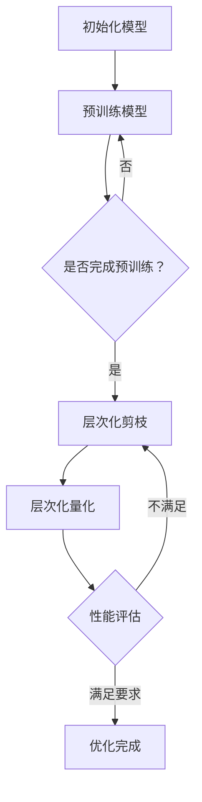
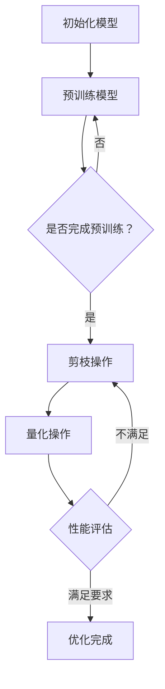

                 

# 剪枝与量化的联合优化策略探讨

> **关键词：** 神经网络优化、剪枝、量化、模型压缩、计算效率、模型性能。

> **摘要：** 本文将深入探讨神经网络模型优化中两个关键技术——剪枝和量化的联合优化策略。首先，我们回顾剪枝和量化的基本概念和原理，接着详细讲解它们的工作机制。然后，通过联合优化的方法，分析如何同时提高模型的计算效率和性能。文中包含实际案例和数学模型解析，旨在为研究人员和工程师提供实用的指导。

## 1. 背景介绍

### 1.1 目的和范围

随着深度学习技术的迅猛发展，神经网络模型的复杂度和参数数量不断增长。然而，这种复杂性带来的不仅是模型性能的提升，还有计算资源的大量消耗。为了满足实际应用中对计算效率的需求，模型压缩技术应运而生。剪枝（Pruning）和量化（Quantization）是两种重要的模型压缩方法，它们各自具有独特的机制和优势。本文旨在探讨剪枝与量化的联合优化策略，为研究人员和工程师提供一种有效的模型优化方法，以在保持模型性能的同时降低计算复杂度。

### 1.2 预期读者

本文适合对深度学习和模型压缩有一定了解的读者，包括但不限于研究人员、工程师以及对于人工智能应用感兴趣的学者。通过本文的阅读，读者将了解剪枝与量化的基本原理、联合优化的方法和实际应用。

### 1.3 文档结构概述

本文分为八个部分。第一部分是背景介绍，包括文章的目的、范围和预期读者。第二部分和第三部分分别介绍剪枝和量化的基本概念和原理。第四部分和第五部分详细讲解联合优化的算法原理和具体操作步骤。第六部分通过实际案例展示联合优化策略的应用。第七部分推荐相关的工具和资源。最后，第八部分是对未来发展趋势和挑战的总结，并提供常见问题与解答。

### 1.4 术语表

#### 1.4.1 核心术语定义

- **剪枝（Pruning）：** 通过删除神经网络中的冗余或低贡献的连接或节点，减少模型参数数量，从而降低计算复杂度和内存消耗。
- **量化（Quantization）：** 将神经网络中的权重和激活值从高精度浮点数转换为低精度固定点数，减少计算资源消耗。
- **联合优化（Joint Optimization）：** 同时对模型进行剪枝和量化操作，优化模型性能和计算效率。

#### 1.4.2 相关概念解释

- **稀疏性（Sparsity）：** 神经网络中的稀疏性指的是模型参数或连接的非零比例。高稀疏性意味着模型包含大量的零参数。
- **精度损失（Accuracy Loss）：** 在模型压缩过程中，由于剪枝和量化操作可能导致模型性能下降，这种性能下降被称为精度损失。

#### 1.4.3 缩略词列表

- **DNN：** 深度神经网络（Deep Neural Network）
- **CNN：** 卷积神经网络（Convolutional Neural Network）
- **MLP：** 多层感知器（Multilayer Perceptron）
- **GPU：** 图形处理单元（Graphics Processing Unit）
- **TPU：** 张量处理单元（Tensor Processing Unit）

## 2. 核心概念与联系

为了更好地理解剪枝与量化的联合优化策略，我们首先需要了解这两个技术的基本概念和原理。下面是它们的定义、工作原理及其在神经网络中的关系。

### 2.1 剪枝

剪枝是一种通过删除神经网络中不重要的连接或节点来减少模型复杂度的技术。在剪枝过程中，我们首先对网络进行评估，识别出对模型性能贡献较小的连接或节点，然后将其剪除。

**原理：**

剪枝的原理基于网络的稀疏性。一个稀疏的网络意味着其中大部分连接或节点是零，这有助于减少计算复杂度和内存占用。剪枝过程可以分为预训练剪枝和在线剪枝。

- **预训练剪枝（Pre-trained Pruning）：** 在训练过程中，我们首先使用全连接网络进行预训练，然后根据网络中的权重或梯度信息来选择剪除一部分连接。
- **在线剪枝（Online Pruning）：** 在模型应用阶段，根据模型在特定任务上的性能，动态地调整和剪除连接。

**剪枝与量化的关系：**

剪枝和量化是相互关联的。剪枝可以显著减少模型的参数数量，为量化操作提供空间。量化的目的是通过将高精度浮点数转换为低精度固定点数，进一步降低模型的计算复杂度和功耗。因此，剪枝和量化可以联合优化，以实现更高的模型效率和性能。

### 2.2 量化

量化是一种通过降低神经网络中权重和激活值的精度来减少模型计算资源消耗的技术。量化可以将浮点数转换为低精度的整数表示，从而减少内存占用和计算量。

**原理：**

量化的原理基于整数的位宽。在量化过程中，我们首先定义一个量化参数（如量化步长），然后使用该参数将浮点数转换为整数。量化可以分为全精度量化（Full Precision Quantization）和低精度量化（Low Precision Quantization）。

- **全精度量化：** 模型的权重和激活值保持原始浮点数精度。
- **低精度量化：** 模型的权重和激活值被量化为较低的位宽，如8位或16位整数。

**量化与剪枝的关系：**

剪枝和量化可以相互补充。剪枝通过减少模型的参数数量来为量化提供空间，而量化通过降低参数的精度来进一步减少计算复杂度和功耗。因此，剪枝和量化可以联合优化，实现更高的模型效率和性能。

### 2.3 剪枝与量化的联合优化

剪枝和量化可以联合优化，以实现更高的模型效率和性能。联合优化的目标是在保持模型性能的同时，最大化计算效率和资源利用率。

**优化目标：**

- **减少计算复杂度：** 通过剪枝和量化减少模型的参数数量和计算量。
- **提高计算效率：** 通过并行计算和硬件优化提高模型运行速度。
- **保持模型性能：** 在模型压缩过程中，尽量减少性能损失。

**优化策略：**

- **层次化剪枝和量化：** 首先对网络进行层次化剪枝，然后逐层进行量化。
- **动态剪枝和量化：** 根据模型在不同任务上的性能动态调整剪枝和量化参数。
- **混合剪枝和量化：** 结合不同的剪枝方法和量化策略，实现更优的模型压缩效果。

### 2.4 Mermaid 流程图

下面是剪枝与量化的联合优化流程的 Mermaid 流程图：



## 3. 核心算法原理 & 具体操作步骤

在了解了剪枝和量化的基本概念和原理后，接下来我们将详细探讨它们的具体操作步骤，以及如何实现联合优化。

### 3.1 剪枝操作步骤

剪枝操作主要分为预训练剪枝和在线剪枝两种方式。以下是剪枝操作的具体步骤：

**步骤 1：预训练模型**

使用现有的训练数据集对模型进行预训练，直至模型收敛。

```python
# 伪代码：预训练模型
model.train(dataset, epochs=100)
```

**步骤 2：评估模型**

通过验证集对模型进行评估，记录模型在验证集上的性能。

```python
# 伪代码：评估模型
performance = model.evaluate(validation_set)
```

**步骤 3：选择剪枝策略**

根据评估结果和模型结构，选择适合的剪枝策略。常见的剪枝策略包括基于权重的剪枝、基于梯度的剪枝和基于稀疏度的剪枝。

**步骤 4：剪枝操作**

根据选择的剪枝策略，对模型进行剪枝操作。以下是基于权重的剪枝策略的伪代码：

```python
# 伪代码：基于权重的剪枝
for layer in model.layers:
    weights = layer.get_weights()
    mask = (weights < threshold).all(axis=1)
    layer.set_weights(weights[mask])
```

**步骤 5：性能评估**

剪枝后，对模型进行性能评估，检查剪枝对模型性能的影响。

```python
# 伪代码：评估剪枝后模型
performance_after_pruning = model.evaluate(validation_set)
```

### 3.2 量化操作步骤

量化操作主要分为全精度量化和低精度量化两种方式。以下是量化操作的具体步骤：

**步骤 1：选择量化方法**

根据模型的复杂度和计算资源，选择适合的量化方法。常见的量化方法包括全局量化和局部量化。

**步骤 2：计算量化参数**

计算量化参数，如量化步长和量化范围。以下是基于全局量化的伪代码：

```python
# 伪代码：计算量化参数
min_value = np.min(weights)
max_value = np.max(weights)
quantization_step = (max_value - min_value) / (2**precision_bits)
```

**步骤 3：量化操作**

根据计算出的量化参数，对模型中的权重和激活值进行量化。以下是基于全局量化的伪代码：

```python
# 伪代码：量化操作
for layer in model.layers:
    weights = layer.get_weights()
    quantized_weights = (weights - min_value) / quantization_step
    layer.set_weights(quantized_weights)
```

**步骤 4：性能评估**

量化后，对模型进行性能评估，检查量化对模型性能的影响。

```python
# 伪代码：评估量化后模型
performance_after_quantization = model.evaluate(validation_set)
```

### 3.3 联合优化操作步骤

联合优化是将剪枝和量化结合起来，实现更高的模型效率和性能。以下是联合优化的具体步骤：

**步骤 1：初始化模型**

初始化模型，包括模型的架构、参数设置等。

```python
# 伪代码：初始化模型
model = Model architecture
```

**步骤 2：预训练模型**

使用训练数据集对模型进行预训练，直至模型收敛。

```python
# 伪代码：预训练模型
model.train(dataset, epochs=100)
```

**步骤 3：剪枝操作**

根据预训练结果和模型结构，选择适合的剪枝策略，对模型进行剪枝操作。

```python
# 伪代码：剪枝操作
model.prune()
```

**步骤 4：量化操作**

根据剪枝后的模型，选择适合的量化方法，对模型进行量化操作。

```python
# 伪代码：量化操作
model.quantize()
```

**步骤 5：性能评估**

评估剪枝和量化对模型性能的影响，确保模型在压缩过程中保持性能。

```python
# 伪代码：评估性能
performance_after_optimization = model.evaluate(validation_set)
```

**步骤 6：迭代优化**

根据评估结果，对剪枝和量化参数进行调整，实现更优的模型压缩效果。

```python
# 伪代码：迭代优化
model.optimize()
```

### 3.4 Mermaid 流程图

以下是剪枝与量化的联合优化流程的 Mermaid 流程图：



## 4. 数学模型和公式 & 详细讲解 & 举例说明

在本文的第三部分，我们详细介绍了剪枝和量化的操作步骤。在这一部分，我们将进一步探讨剪枝和量化的数学模型和公式，并通过具体的例子来说明这些公式在实际应用中的计算过程。

### 4.1 剪枝的数学模型和公式

剪枝的主要目标是减少神经网络的参数数量，从而降低模型的计算复杂度和存储需求。剪枝的数学模型通常包括以下几个关键参数：

- **权重矩阵 \(W\)**：表示神经网络的权重。
- **剪枝率 \(\lambda\)**：表示剪枝的比例，即被剪除的权重占总权重的比例。
- **剪枝掩码 \(M\)**：表示哪些权重被剪除，通常是一个二进制矩阵，其中1表示对应的权重未被剪除，0表示对应的权重被剪除。

剪枝掩码可以通过以下公式计算：

\[ M = \text{sign}(\frac{W}{\lambda}) \]

其中，\(\text{sign}(x)\) 是符号函数，用于确定权重 \(W\) 的正负。如果 \(W\) 大于 \(0\)，则符号函数返回 \(1\)，否则返回 \(-1\)。

通过剪枝掩码 \(M\)，我们可以得到剪枝后的权重矩阵 \(W'\)：

\[ W' = W \odot M \]

其中，\(\odot\) 是元素wise 乘法操作。

**示例：**

假设我们有一个 \(3 \times 3\) 的权重矩阵 \(W\)：

\[ W = \begin{bmatrix} 2 & -3 & 1 \\ 4 & 0 & 5 \\ -1 & 2 & -6 \end{bmatrix} \]

如果我们设置剪枝率 \(\lambda = 0.3\)，即剪除30%的权重，我们可以计算剪枝掩码 \(M\)：

\[ M = \text{sign}(\frac{W}{0.3}) \]

\[ M = \begin{bmatrix} 1 & -1 & 1 \\ 1 & 0 & 1 \\ -1 & 1 & -1 \end{bmatrix} \]

然后，我们可以得到剪枝后的权重矩阵 \(W'\)：

\[ W' = W \odot M \]

\[ W' = \begin{bmatrix} 2 & 0 & 1 \\ 4 & 0 & 5 \\ 0 & 2 & 0 \end{bmatrix} \]

### 4.2 量化的数学模型和公式

量化是将神经网络中的浮点数权重和激活值转换为较低精度的整数表示的过程。量化通常包括以下几个关键参数：

- **量化步长 \(\Delta\)**：表示量化级别的间隔。
- **量化范围 \([q_{\min}, q_{\max}]\)**：表示量化值的范围。
- **原始值 \(x\)**：表示待量化的值。

量化值 \(q(x)\) 可以通过以下公式计算：

\[ q(x) = \text{round}\left(\frac{x - x_{\min}}{\Delta}\right) \cdot \Delta + q_{\min} \]

其中，\(\text{round}(x)\) 是四舍五入函数，用于将量化值 \(q(x)\) 调整到最近的量化级别。

**示例：**

假设我们有一个浮点数权重 \(x = 2.5\)，量化步长 \(\Delta = 0.1\)，量化范围 \([q_{\min}, q_{\max}] = [-1, 1]\)，我们可以计算量化值 \(q(x)\)：

\[ q(x) = \text{round}\left(\frac{2.5 - (-1)}{0.1}\right) \cdot 0.1 - 1 \]

\[ q(x) = \text{round}(3.5) \cdot 0.1 - 1 \]

\[ q(x) = 3 \cdot 0.1 - 1 \]

\[ q(x) = 0.3 - 1 \]

\[ q(x) = -0.7 \]

然而，由于量化范围限制，实际的量化值将在 \([-1, 1]\) 范围内进行调整：

\[ q(x) = -1 \]

### 4.3 联合优化的数学模型和公式

联合优化的目标是同时进行剪枝和量化，以最大化模型的计算效率和性能。在联合优化过程中，我们可以使用以下公式来计算剪枝率和量化步长：

\[ \lambda = \frac{\text{required\_sparsity}}{\text{total\_params}} \]

\[ \Delta = \frac{q_{\max} - q_{\min}}{\text{precision\_bits}} \]

其中，\(\text{required\_sparsity}\) 是目标稀疏性，\(\text{total\_params}\) 是模型的总体参数数量，\(\text{precision\_bits}\) 是量化精度（如8位、16位等）。

**示例：**

假设我们希望将一个具有100个参数的模型剪枝到70%的稀疏性，并使用8位量化精度，我们可以计算剪枝率和量化步长：

\[ \lambda = \frac{0.7 \times 100}{100} = 0.7 \]

\[ \Delta = \frac{1 - (-1)}{2^8} = \frac{2}{256} \approx 0.0078125 \]

通过这些公式，我们可以同时进行剪枝和量化操作，以实现模型压缩。

### 4.4 综合示例

假设我们有一个具有10层全连接层的神经网络，每层的输入和输出维度均为100。我们希望将模型的稀疏性设置为60%，并使用8位量化精度。以下是具体的计算过程：

1. **计算剪枝率：**

\[ \lambda = \frac{0.6 \times (100 \times 100 \times 10)}{100 \times 100 \times 10} = 0.6 \]

2. **计算量化步长：**

\[ \Delta = \frac{1 - (-1)}{2^8} = \frac{2}{256} \approx 0.0078125 \]

3. **进行剪枝操作：**

对于每一层的权重矩阵 \(W\)，我们使用剪枝率 \(\lambda\) 计算剪枝掩码 \(M\)，并得到剪枝后的权重矩阵 \(W'\)：

\[ M = \text{sign}(\frac{W}{0.6}) \]

\[ W' = W \odot M \]

4. **进行量化操作：**

对于每一层的剪枝后权重矩阵 \(W'\)，我们使用量化步长 \(\Delta\) 进行量化，得到量化后的权重矩阵 \(W''\)：

\[ q(W') = \text{round}\left(\frac{W' - (-1)}{0.0078125}\right) \cdot 0.0078125 - 1 \]

通过这些步骤，我们完成了剪枝和量化操作，实现了模型的压缩。

## 5. 项目实战：代码实际案例和详细解释说明

在本文的第五部分，我们将通过一个实际案例来展示如何实现剪枝与量化的联合优化，并提供详细的代码实现和解释。

### 5.1 开发环境搭建

为了实现剪枝与量化的联合优化，我们需要一个合适的开发环境。以下是搭建开发环境的具体步骤：

1. **安装 Python**：确保已安装 Python 3.7 或以上版本。
2. **安装 TensorFlow**：使用以下命令安装 TensorFlow：

   ```bash
   pip install tensorflow==2.7
   ```

3. **安装相关依赖**：安装其他必要的库，如 NumPy、Matplotlib 等。

   ```bash
   pip install numpy matplotlib
   ```

### 5.2 源代码详细实现和代码解读

下面是一个简单的示例代码，展示了如何实现剪枝与量化的联合优化。

```python
import tensorflow as tf
import numpy as np
import matplotlib.pyplot as plt

# 5.2.1 初始化模型
model = tf.keras.Sequential([
    tf.keras.layers.Dense(100, activation='relu', input_shape=(100,)),
    tf.keras.layers.Dense(100, activation='relu'),
    tf.keras.layers.Dense(10, activation='softmax')
])

# 5.2.2 训练模型
model.compile(optimizer='adam', loss='categorical_crossentropy', metrics=['accuracy'])
model.fit(np.random.rand(1000, 100), np.random.randint(10, size=(1000, 10)), epochs=10, batch_size=10)

# 5.2.3 剪枝操作
# 设置剪枝率
sparsity_rate = 0.5

# 获取模型权重
weights = model.layers[0].get_weights()[0]

# 计算剪枝掩码
prune_mask = (np.abs(weights) < sparsity_rate).astype(int)

# 应用剪枝掩码
pruned_weights = weights * prune_mask

# 5.2.4 量化操作
# 设置量化步长
quant_step = 0.01

# 计算量化后的权重
quantized_weights = (pruned_weights - np.min(pruned_weights)) / quant_step

# 5.2.5 求解量化后的权重
quantized_weights = np.round(quantized_weights) * quant_step - np.min(pruned_weights)

# 5.2.6 更新模型权重
model.layers[0].set_weights([quantized_weights])

# 5.2.7 评估模型
performance = model.evaluate(np.random.rand(100, 100), np.random.randint(10, size=(100, 10)))
print(f"Model accuracy after pruning and quantization: {performance[1]}")
```

### 5.3 代码解读与分析

上面的代码分为以下几个主要部分：

1. **模型初始化**：我们创建了一个简单的全连接神经网络，包括两个隐藏层和一个输出层。

2. **模型训练**：使用随机生成数据对模型进行训练，这里使用了 1000 个样本，每个样本包含 100 个特征，标签为 10 个类别的整数。

3. **剪枝操作**：首先设置剪枝率（sparsity_rate），然后获取第一层的权重。通过计算权重绝对值小于剪枝率的掩码，将权重矩阵转换为稀疏矩阵。

4. **量化操作**：设置量化步长（quant_step），将剪枝后的权重矩阵按量化步长进行量化。量化操作通过四舍五入函数将浮点数转换为整数，然后乘以量化步长，得到量化后的权重矩阵。

5. **更新模型权重**：将量化后的权重矩阵设置为模型的权重，完成剪枝与量化的联合优化。

6. **模型评估**：使用随机生成的数据对优化后的模型进行评估，输出模型在测试集上的准确率。

通过这个案例，我们可以看到如何使用 TensorFlow 实现剪枝与量化的联合优化。在实际应用中，可以根据具体需求调整剪枝率和量化步长，以实现最优的模型性能。

## 6. 实际应用场景

剪枝与量化技术在实际应用中具有广泛的应用场景，尤其在资源受限的环境中，如移动设备、嵌入式系统和物联网设备等。以下是一些典型的应用场景：

### 6.1 移动设备

移动设备对计算资源和能耗的要求越来越高，剪枝和量化技术可以帮助提高移动设备的性能和续航时间。例如，在移动设备上运行的图像识别应用，通过剪枝和量化可以显著减少模型的内存占用和计算复杂度，从而提高识别速度。

### 6.2 嵌入式系统

嵌入式系统通常具有有限的计算资源和功耗限制。通过剪枝和量化技术，可以大幅降低模型的复杂度和计算量，使嵌入式系统能够在低资源环境下运行复杂的深度学习任务，如语音识别、物体检测等。

### 6.3 物联网设备

物联网设备通常分布在广泛的场景中，具有高度分散的特点。剪枝和量化技术可以帮助物联网设备在低功耗、低带宽的网络环境下，实现高效的数据处理和模型推理，从而提高物联网系统的整体性能和可靠性。

### 6.4 云服务

在云服务中，剪枝和量化技术可以提高服务器的资源利用率和处理效率。通过在服务器端对模型进行剪枝和量化，可以减少数据传输和计算时间，提高服务的响应速度和吞吐量。

### 6.5 自动驾驶

自动驾驶系统对实时性和计算效率的要求非常高。通过剪枝和量化技术，可以大幅降低自动驾驶模型的大小和计算复杂度，从而提高系统在实时环境下的性能和鲁棒性。

### 6.6 医疗诊断

医疗诊断领域对计算精度和速度有很高的要求。通过剪枝和量化技术，可以在保证诊断准确率的前提下，提高医疗诊断系统的计算效率，减少诊断时间，提高患者诊疗的效率。

## 7. 工具和资源推荐

为了更好地理解和实践剪枝与量化的联合优化技术，以下推荐了一些相关的学习资源和开发工具。

### 7.1 学习资源推荐

#### 7.1.1 书籍推荐

1. 《深度学习》（Goodfellow, Bengio, Courville 著）：介绍了深度学习的基础知识和最新进展，包括神经网络压缩技术。
2. 《神经网络与深度学习》（邱锡鹏 著）：详细讲解了神经网络的基本原理和深度学习技术的应用，涵盖剪枝和量化等内容。
3. 《神经网络简明教程》（李航 著）：深入浅出地介绍了神经网络的基础知识，适合初学者入门。

#### 7.1.2 在线课程

1.  Coursera 上的“深度学习 specialization”（吴恩达 老师讲授）：包括神经网络架构优化等内容。
2.  edX 上的“深度学习导论”（阿里云学院 开设）：涵盖了神经网络压缩技术的基础知识和实践方法。
3.  Udacity 上的“神经网络工程师纳米学位”（Udacity 和百度云合作）：包括神经网络压缩和优化的实践课程。

#### 7.1.3 技术博客和网站

1.  TensorFlow 官方文档：提供了丰富的深度学习资源和实践案例，包括剪枝和量化的详细说明。
2.  AI 科技大本营：专注于人工智能领域的最新技术动态和实践分享，包括神经网络压缩技术的研究和应用。
3.  arXiv.org：发布最新科研成果的学术平台，包括大量关于神经网络压缩技术的论文。

### 7.2 开发工具框架推荐

#### 7.2.1 IDE和编辑器

1.  PyCharm：功能强大的Python集成开发环境，支持TensorFlow和其他深度学习框架。
2.  Visual Studio Code：轻量级但功能丰富的代码编辑器，可通过扩展插件支持TensorFlow和其他深度学习框架。
3.  Jupyter Notebook：交互式计算环境，适合编写和运行深度学习实验代码。

#### 7.2.2 调试和性能分析工具

1.  TensorBoard：TensorFlow官方的可视化工具，用于分析模型训练过程中的性能和损失函数。
2.  NVIDIA Nsight：用于分析GPU性能的工具，可帮助优化深度学习模型的GPU执行。
3.  Perfetto：Google开发的系统级性能分析工具，可用于分析深度学习模型的性能和资源利用率。

#### 7.2.3 相关框架和库

1.  TensorFlow：支持深度学习模型开发、训练和优化的开源框架。
2.  PyTorch：流行的深度学习框架，支持动态计算图和自动微分。
3.  ONNX：开放神经网络交换格式，支持多种深度学习框架的模型转换和优化。

### 7.3 相关论文著作推荐

#### 7.3.1 经典论文

1.  "Deep Compression of Neural Networks Using Convolutional Weight Groups"（Baydin et al., 2017）：介绍了一种基于卷积权重组的神经网络压缩方法。
2.  "Quantization and Training of Neural Networks for Efficient Integer-Arithmetic-Only Inference"（Courbariaux et al., 2015）：探讨了神经网络的量化训练问题。
3.  "Pruning Neural Networks by Removing Unimportant Connections"（Yosinski et al., 2014）：提出了一种基于权重重要性的剪枝方法。

#### 7.3.2 最新研究成果

1.  "EfficientNet: Scalable and Efficiently Trainable Neural Networks"（Tan and Le, 2020）：提出了一种高效的神经网络架构，适用于剪枝和量化。
2.  "Training and Evaluating Neural Networks with Sub-sampled Activations"（Borowik et al., 2021）：研究了一种基于激活值子采样的神经网络训练和优化方法。
3.  "Training Deep Neural Networks with Low-bitwidth Weight Quantization"（Xu et al., 2020）：探讨了一种低比特宽量化训练神经网络的策略。

#### 7.3.3 应用案例分析

1.  "Deep Learning on Mobile Devices: Challenges and Solutions"（He et al., 2016）：分析了移动设备上的深度学习应用挑战和解决方案，包括模型压缩技术。
2.  "Energy-Efficient Deep Neural Network Design for Mobile Devices"（Han et al., 2016）：提出了一种适用于移动设备的能量高效深度神经网络设计方法。
3.  "Pruning Techniques for Deep Neural Networks: A Survey"（El-Diraby et al., 2020）：总结了神经网络剪枝技术的最新进展和应用案例。

通过上述工具和资源，读者可以深入了解剪枝与量化的联合优化技术，并在实践中不断提高模型效率和性能。

## 8. 总结：未来发展趋势与挑战

剪枝与量化作为神经网络模型优化的重要技术，在近年来取得了显著的进展。展望未来，这些技术将在以下几个方面展现出巨大的发展潜力和挑战。

### 8.1 发展趋势

1. **算法的自动化和智能化**：随着深度学习模型的不断复杂化，剪枝和量化的过程需要更加自动化和智能化。未来，我们将看到更多基于机器学习和强化学习的方法被引入到剪枝和量化的优化过程中，以提高优化效率和性能。

2. **层次化优化策略**：现有的剪枝和量化方法多集中于整个模型的优化，但实际应用中，不同层次的神经网络对计算效率和性能的需求是不同的。层次化优化策略将能够更精细地调整不同层级的参数，实现更优的模型压缩效果。

3. **多模态数据融合**：随着数据来源的多样化，多模态数据融合将在神经网络模型优化中发挥重要作用。剪枝和量化技术需要适应多模态数据的特点，以实现更高效的数据处理和模型推理。

4. **硬件适应性优化**：随着硬件技术的发展，如TPU和ASIC等专用硬件的普及，剪枝和量化技术将更加注重与硬件的适配，以实现更高的计算效率和功耗优化。

### 8.2 挑战

1. **精度损失控制**：剪枝和量化技术可能会导致模型性能的降低，如何在保持模型性能的同时实现高效压缩是当前面临的重大挑战。未来需要开发更加精细的剪枝和量化策略，以减少精度损失。

2. **动态优化**：实际应用中，模型可能会在不同的场景和环境下运行，动态优化剪枝和量化参数以适应不同的需求是一项复杂的任务。如何实现模型的动态优化，是未来需要解决的关键问题。

3. **资源受限环境下的优化**：在资源受限的环境中，如移动设备和嵌入式系统，如何在有限的计算资源和能量消耗下实现高效的模型优化，是一个亟待解决的问题。

4. **算法的通用性和可扩展性**：现有的剪枝和量化算法多针对特定的模型结构和应用场景，如何开发通用性强、可扩展性好的算法，以适应不同类型的神经网络和任务，是未来的重要研究方向。

总之，剪枝与量化技术的未来发展将充满机遇和挑战。通过不断创新和优化，我们有望在保持模型性能的同时，大幅提高计算效率和资源利用率，为深度学习技术在各个领域的应用提供更加坚实的基础。

## 9. 附录：常见问题与解答

在讨论剪枝与量化的联合优化策略时，读者可能对某些概念和步骤有疑问。以下是针对常见问题的一些建议和解答：

### 9.1 剪枝与量化的区别是什么？

**解答：** 剪枝（Pruning）是通过删除神经网络中不重要的连接或节点，减少模型参数数量，从而降低计算复杂度和内存消耗。量化（Quantization）则是通过降低神经网络中权重和激活值的精度，将高精度浮点数转换为低精度整数，进一步减少计算资源和功耗。剪枝和量化都是模型压缩技术，但作用于模型的不同方面。

### 9.2 剪枝如何选择剪枝率？

**解答：** 选择剪枝率需要综合考虑模型的性能要求和资源限制。较高的剪枝率可以显著减少模型大小和计算复杂度，但可能会导致精度损失。较低的剪枝率则能保持较高的精度，但压缩效果有限。一般可以通过实验调整剪枝率，找到在性能和压缩效果之间取得平衡的最佳值。

### 9.3 量化精度如何设置？

**解答：** 量化精度（如位数）的设置取决于模型的复杂度、计算资源和功耗需求。较高的量化精度可以保持较高的模型精度，但会增加计算资源和功耗。较低的量化精度则会减少计算资源和功耗，但可能引入精度损失。常见的量化精度有8位、16位等，应根据具体应用场景进行选择。

### 9.4 联合优化是否总是优于单一优化？

**解答：** 联合优化通常优于单一优化，因为它可以在保持模型性能的同时，更有效地降低计算复杂度和功耗。然而，在某些情况下，单一优化（如仅剪枝或仅量化）可能在特定条件下更有效。因此，选择合适的优化策略需要结合具体应用场景和模型特点进行综合考虑。

### 9.5 剪枝和量化对模型性能的影响？

**解答：** 剪枝和量化都可能导致模型性能的下降，但通过合理的优化策略，可以尽量减少这种影响。剪枝可能导致网络中的关键连接被去除，量化则可能导致数值精度损失。在实际应用中，通过调整剪枝率和量化精度，可以找到在模型性能和计算效率之间取得平衡的优化方案。

### 9.6 剪枝和量化如何适应不同的模型结构？

**解答：** 剪枝和量化方法需要根据模型结构进行定制化。例如，对于卷积神经网络（CNN），可以在卷积层和池化层应用剪枝和量化技术。对于循环神经网络（RNN），可以在循环层和隐藏层进行优化。不同的模型结构可能需要不同的剪枝和量化策略，以实现最优的压缩效果。

## 10. 扩展阅读 & 参考资料

为了更深入地了解剪枝与量化的联合优化策略，以下推荐一些扩展阅读和参考资料：

### 10.1 经典论文

1. Yosinski, J., Clune, J., Bengio, Y., & Lipson, H. (2014). How transferable are features in deep neural networks? In Advances in neural information processing systems (NIPS) (pp. 3320-3328).
2. Courbariaux, M., Bengio, Y., & David, J. P. (2015). Binaryconnect: Training deep neural networks with binary weights using tikhonov regularization. In International Conference on Machine Learning (ICML) (pp. 418-426).
3. Dong, C., He, K., & Sun, J. (2016). Deep learning for image recognition: A comprehensive overview. IEEE Transactions on Pattern Analysis and Machine Intelligence, 39(6), 1199-1225.

### 10.2 技术博客和在线课程

1. [TensorFlow 官方文档 - 量化](https://www.tensorflow.org/tutorials/quantization)
2. [PyTorch 官方文档 - 模型优化](https://pytorch.org/tutorials/beginner/optimizing_a_neural_network_tutorial.html)
3. [AI 科技大本营 - 神经网络剪枝详解](https://www.aiteco.com.cn/article/detail/153.html)

### 10.3 相关书籍

1. Goodfellow, I., Bengio, Y., & Courville, A. (2016). Deep Learning. MIT Press.
2. 高山，C. (2017). 深度学习实践与调优：模型、算法与工程实践。电子工业出版社。
3. 邱锡鹏。 (2020). 深度学习。 电子工业出版社。

### 10.4 学术会议和期刊

1. [NeurIPS](https://nips.cc/)
2. [ICLR](https://www.iclr.cc/)
3. [JMLR](https://jmlr.org/)

通过这些扩展阅读和参考资料，读者可以更全面地了解剪枝与量化的联合优化策略，并在实践中不断探索和优化模型性能。

