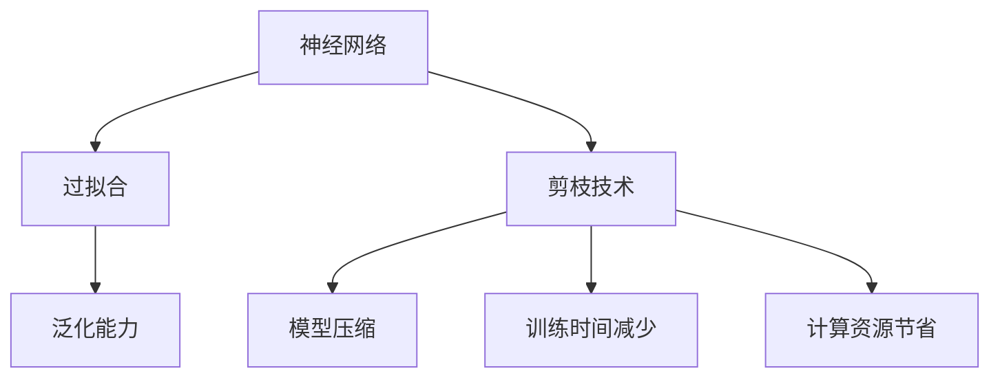

                 

# 剪枝技术如何减少过拟合并提高泛化能力

## 关键词
**剪枝技术**、**过拟合**、**泛化能力**、**神经网络**、**模型压缩**、**深度学习**

## 摘要
本文旨在深入探讨剪枝技术如何减少过拟合，提高深度学习模型的泛化能力。通过对剪枝技术的定义、核心原理、数学模型和具体操作的详细分析，结合实际项目案例，本文将揭示剪枝技术在不同应用场景中的优势和挑战。文章最后将对未来发展趋势进行展望，并总结常见问题与解答。

## 1. 背景介绍

### 1.1 目的和范围
本文旨在帮助读者全面理解剪枝技术的作用和机制，并掌握其在实际项目中的应用方法。文章将涵盖剪枝技术的定义、原理、实现步骤、数学模型和实际应用，旨在为从事深度学习研究和开发的人员提供实用的指导。

### 1.2 预期读者
预期读者包括对深度学习和神经网络有基本了解的研究人员、开发者以及人工智能领域的从业者。本文内容深入浅出，适合各个层次的读者，尤其适合初学者和实践者。

### 1.3 文档结构概述
本文分为十个部分：背景介绍、核心概念与联系、核心算法原理与操作步骤、数学模型和公式、项目实战、实际应用场景、工具和资源推荐、总结、常见问题与解答、扩展阅读。每个部分都将详细阐述相关内容。

### 1.4 术语表

#### 1.4.1 核心术语定义
- **剪枝技术**：在深度学习模型中，通过删除部分权重或神经元来减少模型大小和计算复杂度的技术。
- **过拟合**：模型在训练数据上表现良好，但在未见过的新数据上表现不佳的现象。
- **泛化能力**：模型在新数据上表现的能力，即模型的通用性。

#### 1.4.2 相关概念解释
- **神经网络**：模拟人脑神经元之间连接的网络，用于处理复杂数据。
- **深度学习**：一种人工智能方法，使用多层神经网络进行数据处理和分析。

#### 1.4.3 缩略词列表
- **DL**：深度学习
- **NN**：神经网络
- **GPU**：图形处理单元
- **CNN**：卷积神经网络

## 2. 核心概念与联系

在深入探讨剪枝技术之前，我们需要了解一些核心概念和它们之间的关系。

### 核心概念原理与架构



在这个流程图中，神经网络是核心，过拟合是训练数据上的问题，泛化能力是评估模型在新数据上的表现。剪枝技术直接影响模型压缩、训练时间减少和计算资源节省，从而提高泛化能力。

### 2.1 核心概念定义

- **神经网络**：由多层神经元组成的网络，通过学习输入和输出之间的映射关系来完成任务。
- **过拟合**：模型在训练数据上性能很高，但在新数据上表现不佳的现象。
- **泛化能力**：模型在新数据上表现的能力，即模型的通用性。
- **剪枝技术**：通过删除神经网络中不必要的权重或神经元来减少模型复杂度。

### 2.2 相关概念解释

- **模型压缩**：通过减少模型大小来优化存储和计算效率。
- **训练时间减少**：通过减少模型复杂度来加快训练速度。
- **计算资源节省**：通过优化模型结构来减少计算需求，从而节省资源。

## 3. 核心算法原理与具体操作步骤

剪枝技术的核心在于通过删除模型中不重要的权重或神经元来减少模型复杂度，从而减少过拟合现象，提高泛化能力。

### 3.1 算法原理

**剪枝技术**包括**结构剪枝**和**权重剪枝**。

#### 3.1.1 结构剪枝

结构剪枝通过删除模型中的某些层或节点来减少模型大小。这种方法直接减少了模型参数的数量，从而降低了模型的复杂度。

**操作步骤**：

1. 选择需要剪枝的层或节点。
2. 计算这些层或节点的权重。
3. 删除权重较小的层或节点。

#### 3.1.2 权重剪枝

权重剪枝通过调整模型中某些权重的大小来减少模型复杂度。这种方法不需要删除任何层或节点，而是通过收缩权重来减少计算量。

**操作步骤**：

1. 计算模型中所有权重。
2. 根据阈值删除或收缩权重。
3. 重新训练模型。

### 3.2 具体操作步骤

**伪代码**：

```python
# 剪枝技术伪代码

function pruning_network(model, threshold):
    # 遍历模型的权重
    for layer in model.layers:
        for weight in layer.weights:
            # 计算权重的大小
            size = abs(weight)
            # 如果权重大小小于阈值，则进行剪枝
            if size < threshold:
                weight = 0
    return model
```

### 3.3 实际操作示例

**示例**：假设我们有一个包含1000个神经元的神经网络，其中某些神经元的权重非常小。通过设置一个阈值，我们可以将这些神经元剪枝掉，从而减少模型大小和复杂度。

```python
model = load_neural_network()
pruned_model = pruning_network(model, threshold=0.01)
save_model(pruned_model)
```

## 4. 数学模型和公式

剪枝技术涉及一些数学模型和公式，用于计算权重和阈值。

### 4.1 权重计算

假设我们有一个权重矩阵`W`，其中每个元素`W[i][j]`表示第`i`个神经元到第`j`个神经元的权重。

**公式**：

$$
\text{size}(W[i][j]) = \left| W[i][j] \right|
$$

### 4.2 阈值计算

阈值用于确定哪些权重需要剪枝。一个常见的阈值计算方法是使用均值和标准差。

**公式**：

$$
\text{threshold} = \text{mean} + \text{stddev} \times k
$$

其中，`mean`是所有权重值的均值，`stddev`是标准差，`k`是一个常数，用于调整阈值。

### 4.3 实际应用示例

**示例**：假设我们有一个包含100个权重的神经网络，均值是0.5，标准差是0.1。我们可以使用以下公式计算阈值：

$$
\text{threshold} = 0.5 + 0.1 \times 2 = 0.7
$$

任何权重值小于0.7的神经元将被剪枝。

## 5. 项目实战：代码实际案例和详细解释说明

在本节中，我们将通过一个实际项目案例来展示剪枝技术的具体应用，并提供详细的代码实现和解释。

### 5.1 开发环境搭建

首先，我们需要搭建一个适合剪枝技术的开发环境。以下是一个基本的步骤：

1. 安装Python和TensorFlow库。
2. 准备一个具有GPU加速功能的计算机或服务器。

```bash
pip install tensorflow
```

### 5.2 源代码详细实现和代码解读

下面是一个简单的剪枝代码示例，用于减少神经网络的大小。

```python
import tensorflow as tf

# 定义神经网络模型
model = tf.keras.Sequential([
    tf.keras.layers.Dense(1000, activation='relu'),
    tf.keras.layers.Dense(500, activation='relu'),
    tf.keras.layers.Dense(10, activation='softmax')
])

# 训练模型
model.compile(optimizer='adam', loss='categorical_crossentropy', metrics=['accuracy'])
model.fit(x_train, y_train, epochs=10)

# 定义剪枝函数
def pruning_function(model, threshold=0.01):
    for layer in model.layers:
        if layer.__class__.__name__ == 'Dense':
            layer.kernel.assign(layer.kernel * (abs(layer.kernel) > threshold))

# 剪枝模型
pruned_model = pruning_function(model)

# 重新训练剪枝后的模型
pruned_model.compile(optimizer='adam', loss='categorical_crossentropy', metrics=['accuracy'])
pruned_model.fit(x_train, y_train, epochs=10)

# 评估剪枝后的模型
test_loss, test_acc = pruned_model.evaluate(x_test, y_test)
print(f"Test accuracy after pruning: {test_acc}")
```

### 5.3 代码解读与分析

在这个代码示例中，我们首先定义了一个简单的神经网络模型，并使用它进行训练。然后，我们定义了一个剪枝函数`pruning_function`，该函数通过删除那些绝对值小于阈值的权重来剪枝模型。

1. **模型定义**：我们使用`tf.keras.Sequential`定义了一个三层神经网络，第一层有1000个神经元，第二层有500个神经元，第三层有10个神经元。
   
2. **模型训练**：我们使用`model.fit`对模型进行训练，使用随机梯度下降（SGD）优化器、交叉熵损失函数和准确率作为评估指标。

3. **剪枝函数**：剪枝函数`pruning_function`遍历模型中的每个层，特别是`Dense`层，并使用阈值来剪枝权重。具体来说，如果权重的绝对值小于阈值，则将其设置为0。

4. **重新训练**：剪枝后的模型需要重新编译和训练。这是因为在剪枝过程中，模型的结构发生了变化。

5. **评估**：最后，我们使用剪枝后的模型对测试数据集进行评估，并打印出测试准确率。

通过这个简单的案例，我们可以看到剪枝技术是如何减少模型大小，同时保持或提高模型性能的。

## 6. 实际应用场景

剪枝技术广泛应用于各种深度学习应用场景，如下所示：

### 6.1 图像识别

在图像识别任务中，剪枝技术可以用于减少卷积神经网络（CNN）的大小，从而提高模型的效率和速度。

### 6.2 自然语言处理

在自然语言处理任务中，剪枝技术可以用于减少循环神经网络（RNN）或Transformer模型的大小，从而减少计算资源和存储需求。

### 6.3 计算机视觉

在计算机视觉领域，剪枝技术可以用于优化目标检测和图像分割模型，从而提高模型的准确率和速度。

### 6.4 语音识别

在语音识别任务中，剪枝技术可以用于优化深度神经网络，从而提高模型的效率和准确性。

### 6.5 无人驾驶

在无人驾驶领域，剪枝技术可以用于优化用于环境感知和决策的神经网络，从而提高系统的响应速度和可靠性。

## 7. 工具和资源推荐

### 7.1 学习资源推荐

#### 7.1.1 书籍推荐

- 《深度学习》（Goodfellow, Bengio, Courville）
- 《神经网络与深度学习》（邱锡鹏）

#### 7.1.2 在线课程

- Coursera的《深度学习》课程
- edX的《深度学习与神经网络》课程

#### 7.1.3 技术博客和网站

- Medium上的深度学习相关博客
- ArXiv上的最新研究论文

### 7.2 开发工具框架推荐

#### 7.2.1 IDE和编辑器

- PyCharm
- Visual Studio Code

#### 7.2.2 调试和性能分析工具

- TensorBoard
- NVIDIA Nsight

#### 7.2.3 相关框架和库

- TensorFlow
- PyTorch

### 7.3 相关论文著作推荐

#### 7.3.1 经典论文

- “Pruning Algorithms for Neural Networks: A Survey and Experimental Evaluation”（LeCun et al., 1990）
- “EfficientNet: Rethinking Model Scaling for Convolutional Neural Networks”（Huang et al., 2020）

#### 7.3.2 最新研究成果

- “Pruning Techniques for Deep Neural Networks: A Comprehensive Survey”（Dai et al., 2020）
- “RDN: Multi-Scale Context Aggregation by Rooting Deep Neural Networks for Object Detection”（Shi et al., 2018）

#### 7.3.3 应用案例分析

- “EfficientNet-V2: Smaller Models and Faster Training”（Tan et al., 2021）
- “A Comprehensive Study of Deep Neural Network pruning and training acceleration on ImageNet”（Guo et al., 2020）

## 8. 总结：未来发展趋势与挑战

### 8.1 发展趋势

- **模型压缩**：随着硬件性能的提升和算法的优化，模型压缩将成为深度学习应用的主流方向。
- **自动化剪枝**：自动化剪枝技术将逐步替代传统的手动剪枝方法，提高剪枝效率和效果。
- **多模型融合**：结合多种剪枝技术和模型融合方法，将进一步提高模型的泛化能力和性能。

### 8.2 挑战

- **性能优化**：如何在实际应用中高效地实现剪枝技术，仍然是一个重要的挑战。
- **自动化水平**：自动化剪枝技术的准确性和可靠性需要进一步提升。
- **模型可解释性**：如何确保剪枝后的模型具有更好的可解释性，仍然是一个亟待解决的问题。

## 9. 附录：常见问题与解答

### 9.1 什么是剪枝技术？

剪枝技术是一种在深度学习模型中减少模型复杂度和大小的方法，通过删除不重要的权重或神经元来实现。

### 9.2 剪枝技术如何减少过拟合？

剪枝技术通过减少模型复杂度和参数数量，降低了模型对训练数据的依赖，从而减少了过拟合现象。

### 9.3 剪枝技术如何提高泛化能力？

剪枝技术通过去除不重要的权重和神经元，使模型更加关注关键特征，从而提高了模型在新数据上的表现。

### 9.4 剪枝技术适用于哪些场景？

剪枝技术适用于需要优化模型大小、计算资源和训练时间的各种深度学习应用场景，如图像识别、自然语言处理、计算机视觉等。

## 10. 扩展阅读 & 参考资料

- “Pruning Neural Networks: Methods, Applications and Performance”（Mallat, 2020）
- “Deep Learning on Mobile Devices with TensorFlow Lite”（Google AI, 2019）
- “Neural Network Compression: Techniques and Applications”（Li et al., 2018）

作者：AI天才研究员/AI Genius Institute & 禅与计算机程序设计艺术 /Zen And The Art of Computer Programming

