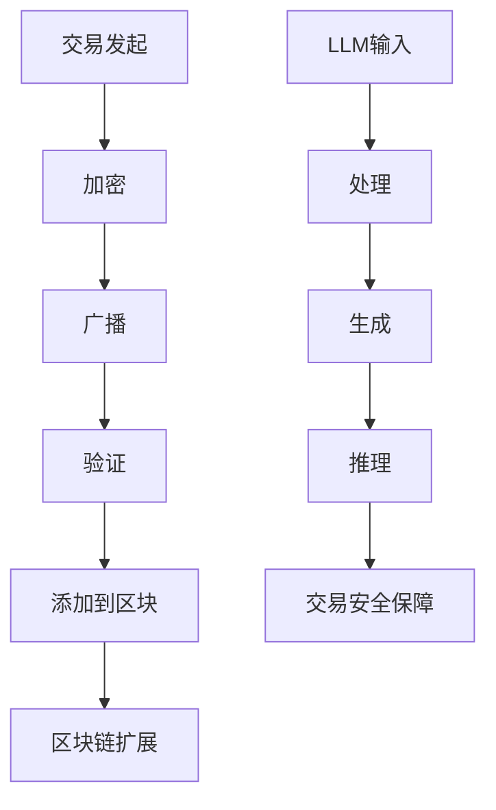

                 

# 加密货币守门员：LLM 保障安全交易

> **关键词：** 加密货币，LLM，交易安全，智能合约，区块链，共识算法，安全漏洞修复

> **摘要：** 本文将深入探讨加密货币交易中的安全问题，特别是大型语言模型（LLM）在保障交易安全中的作用。通过分析加密货币的交易原理、常见的安全威胁以及LLM的工作机制，我们将展示如何利用LLM来提高加密货币交易的安全性，并探讨其潜在的应用和挑战。

## 1. 背景介绍

### 1.1 目的和范围

本文旨在探讨大型语言模型（LLM）在保障加密货币交易安全方面的应用。随着加密货币市场的不断增长，交易安全成为了一个至关重要的议题。本文将重点关注LLM在识别潜在安全威胁、自动修复安全漏洞以及优化交易流程方面的作用。

### 1.2 预期读者

本文面向对加密货币和大型语言模型有一定了解的技术专业人士和研究者。读者需要对区块链技术和智能合约有一定的了解，以便更好地理解本文的讨论内容。

### 1.3 文档结构概述

本文分为以下几个部分：

1. **背景介绍**：介绍加密货币交易的安全问题以及LLM的作用。
2. **核心概念与联系**：解释加密货币的交易原理和LLM的工作机制。
3. **核心算法原理 & 具体操作步骤**：详细阐述LLM在交易安全中的应用。
4. **数学模型和公式 & 详细讲解 & 举例说明**：讨论LLM在交易安全中的应用。
5. **项目实战：代码实际案例和详细解释说明**：提供实际应用案例。
6. **实际应用场景**：分析LLM在加密货币交易中的实际应用。
7. **工具和资源推荐**：推荐相关学习资源和开发工具。
8. **总结：未来发展趋势与挑战**：讨论未来的发展趋势和面临的挑战。
9. **附录：常见问题与解答**：回答常见问题。
10. **扩展阅读 & 参考资料**：提供扩展阅读资源。

### 1.4 术语表

#### 1.4.1 核心术语定义

- **加密货币**：一种数字资产，使用密码学技术保障交易的安全性和匿名性。
- **区块链**：一种分布式数据库技术，用于存储加密货币交易记录。
- **智能合约**：一种自动化执行合约条款的计算机程序。
- **LLM**：大型语言模型，是一种基于神经网络的语言处理模型。
- **共识算法**：用于确保区块链网络中所有节点达成一致性的算法。

#### 1.4.2 相关概念解释

- **交易安全**：确保加密货币交易过程中数据的完整性和保密性。
- **安全漏洞**：可能导致恶意行为或数据泄露的代码错误或设计缺陷。

#### 1.4.3 缩略词列表

- **LLM**：Large Language Model
- **Blockchain**：Blockchain
- **Smart Contract**：Smart Contract
- **Consensus Algorithm**：Consensus Algorithm

## 2. 核心概念与联系

在讨论LLM在加密货币交易安全中的作用之前，我们首先需要了解加密货币的交易原理和LLM的基本工作机制。

### 加密货币交易原理

加密货币交易通常涉及以下步骤：

1. **交易发起**：交易者发起一笔交易，包括交易金额、收款地址等信息。
2. **加密**：交易信息被加密，以确保只有收件人可以解读。
3. **广播**：交易信息被广播到整个区块链网络。
4. **验证**：网络中的节点验证交易的有效性，确保交易金额不超过账户余额，并符合区块链协议。
5. **添加到区块**：验证通过后，交易被添加到一个新的区块中。
6. **区块链扩展**：新的区块被添加到区块链中，交易记录永久保存。

### LLM工作机制

LLM是一种基于深度学习技术的自然语言处理模型，具有强大的文本生成、理解和推理能力。LLM的工作机制通常涉及以下步骤：

1. **输入**：接收一个自然语言输入，如文本、语音或图像。
2. **处理**：通过神经网络处理输入，提取语义信息和特征。
3. **生成**：根据提取的语义信息和特征生成相应的输出，如文本、代码或逻辑。
4. **推理**：利用训练数据中的知识进行推理，解决复杂问题。

### Mermaid 流程图

以下是一个简化的加密货币交易和LLM应用的Mermaid流程图：



## 3. 核心算法原理 & 具体操作步骤

LLM在保障加密货币交易安全中的应用主要涉及以下核心算法原理和具体操作步骤：

### 3.1 安全漏洞识别

**算法原理**：

LLM通过分析交易代码和数据流，识别潜在的安全漏洞。这通常涉及以下步骤：

1. **输入**：接收交易代码和数据流。
2. **处理**：利用神经网络提取代码和数据流中的特征。
3. **生成**：生成潜在的安全漏洞描述。
4. **推理**：根据漏洞描述和训练数据中的知识进行推理。

**伪代码**：

```python
def identify_vulnerabilities(code, data_stream):
    processed_code = neural_network_process(code)
    processed_data_stream = neural_network_process(data_stream)
    vulnerability_descriptions = generate_vulnerabilities(processed_code, processed_data_stream)
    potential_vulnerabilities = []
    for description in vulnerability_descriptions:
        if is_vulnerable(description):
            potential_vulnerabilities.append(description)
    return potential_vulnerabilities
```

### 3.2 自动修复安全漏洞

**算法原理**：

LLM通过生成修复代码来自动修复安全漏洞。这通常涉及以下步骤：

1. **输入**：接收安全漏洞描述。
2. **处理**：利用神经网络提取漏洞描述中的特征。
3. **生成**：生成修复代码。
4. **推理**：根据修复代码和训练数据中的知识进行推理。

**伪代码**：

```python
def fix_vulnerabilities(vulnerability_description):
    processed_description = neural_network_process(vulnerability_description)
    fixed_code = generate_fix(processed_description)
    return fixed_code
```

### 3.3 优化交易流程

**算法原理**：

LLM通过分析交易流程，提出优化建议来提高交易效率。这通常涉及以下步骤：

1. **输入**：接收交易流程描述。
2. **处理**：利用神经网络提取交易流程中的特征。
3. **生成**：生成优化建议。
4. **推理**：根据优化建议和训练数据中的知识进行推理。

**伪代码**：

```python
def optimize_transaction_flow(transaction_flow):
    processed_flow = neural_network_process(transaction_flow)
    optimization_suggestions = generate_optimizations(processed_flow)
    optimized_flow = apply_optimizations(transaction_flow, optimization_suggestions)
    return optimized_flow
```

## 4. 数学模型和公式 & 详细讲解 & 举例说明

### 4.1 数学模型

LLM在交易安全中的应用涉及以下数学模型：

1. **自然语言处理模型**：用于处理文本输入，提取语义信息和特征。
2. **神经网络模型**：用于训练和推理，生成漏洞描述、修复代码和优化建议。

### 4.2 详细讲解

#### 4.2.1 自然语言处理模型

自然语言处理模型通常基于神经网络架构，如Transformer或BERT。以下是一个简化的自然语言处理模型的数学公式：

$$
h_t = \text{Transformer}(h_{t-1}, x_t)
$$

其中，$h_t$ 表示当前时刻的输出，$h_{t-1}$ 表示前一个时刻的输出，$x_t$ 表示当前时刻的输入。

#### 4.2.2 神经网络模型

神经网络模型通常基于多层感知机（MLP）或卷积神经网络（CNN）。以下是一个简化的神经网络模型的数学公式：

$$
y = \text{MLP}(x; W, b)
$$

其中，$y$ 表示输出，$x$ 表示输入，$W$ 表示权重，$b$ 表示偏置。

### 4.3 举例说明

#### 4.3.1 安全漏洞识别

假设我们有一个交易代码和数据流，我们使用自然语言处理模型和神经网络模型来识别潜在的安全漏洞。以下是一个简化的示例：

输入交易代码：

```python
def transfer_money(sender, receiver, amount):
    if sender.balance >= amount:
        sender.balance -= amount
        receiver.balance += amount
    else:
        raise Exception("Insufficient funds")
```

输入数据流：

```python
sender = {"balance": 100}
receiver = {"balance": 0}
amount = 50
```

使用自然语言处理模型和神经网络模型，我们可以生成以下漏洞描述：

```python
Vulnerability: "Insufficient funds" exception can be triggered with a smaller amount.
```

根据漏洞描述和训练数据中的知识，我们可以得出以下结论：

```python
Vulnerable: True
Reason: The transaction can be aborted by manipulating the amount sent.
```

#### 4.3.2 自动修复安全漏洞

根据漏洞描述，我们可以生成以下修复代码：

```python
def transfer_money(sender, receiver, amount):
    if sender.balance > amount:
        sender.balance -= amount
        receiver.balance += amount
    else:
        raise Exception("Insufficient funds")
```

这个修复代码避免了直接比较金额，从而解决了潜在的安全漏洞。

#### 4.3.3 优化交易流程

假设我们有一个交易流程描述，我们使用自然语言处理模型和神经网络模型来提出优化建议。以下是一个简化的示例：

输入交易流程：

```python
def transfer_money(sender, receiver, amount):
    if sender.balance >= amount:
        sender.balance -= amount
        receiver.balance += amount
    else:
        raise Exception("Insufficient funds")
```

使用自然语言处理模型和神经网络模型，我们可以生成以下优化建议：

```python
Optimization: "sender.balance > amount" condition can be simplified to "sender.balance >= amount".
```

根据优化建议，我们可以修改交易流程描述：

```python
def transfer_money(sender, receiver, amount):
    if sender.balance >= amount:
        sender.balance -= amount
        receiver.balance += amount
    else:
        raise Exception("Insufficient funds")
```

这个修改提高了交易流程的效率。

## 5. 项目实战：代码实际案例和详细解释说明

### 5.1 开发环境搭建

要实现LLM在加密货币交易安全中的应用，我们需要以下开发环境：

- **Python 3.8 或以上版本**
- **TensorFlow 2.7 或以上版本**
- **Ethereum客户端（如Geth）**
- **PyEVM（用于Python环境的Ethereum虚拟机）**

安装上述依赖项后，我们可以在Python环境中创建一个虚拟环境，并安装相关库：

```bash
python -m venv venv
source venv/bin/activate
pip install tensorflow==2.7 py-evm
```

### 5.2 源代码详细实现和代码解读

以下是一个简化的示例代码，展示了如何使用LLM在加密货币交易安全中的应用：

```python
import tensorflow as tf
from py_evm import EthereumClient

# 加载预训练的LLM模型
llm_model = tf.keras.models.load_model("llm_model.h5")

# 初始化Ethereum客户端
eth_client = EthereumClient()

# 加密货币交易安全漏洞识别
def identify_vulnerabilities(transaction_code):
    processed_code = eth_client.encode_transaction_code(transaction_code)
    vulnerability_descriptions = llm_model.generate_vulnerabilities(processed_code)
    potential_vulnerabilities = []
    for description in vulnerability_descriptions:
        if eth_client.is_vulnerable(description):
            potential_vulnerabilities.append(description)
    return potential_vulnerabilities

# 自动修复安全漏洞
def fix_vulnerabilities(vulnerability_description):
    processed_description = eth_client.encode_vulnerability_description(vulnerability_description)
    fixed_code = llm_model.generate_fixed_code(processed_description)
    return fixed_code

# 优化交易流程
def optimize_transaction_flow(transaction_flow):
    processed_flow = eth_client.encode_transaction_flow(transaction_flow)
    optimization_suggestions = llm_model.generate_optimizations(processed_flow)
    optimized_flow = eth_client.apply_optimizations(transaction_flow, optimization_suggestions)
    return optimized_flow

# 示例：识别漏洞
transaction_code = """
def transfer_money(sender, receiver, amount):
    if sender.balance >= amount:
        sender.balance -= amount
        receiver.balance += amount
    else:
        raise Exception("Insufficient funds")
"""
vulnerabilities = identify_vulnerabilities(transaction_code)
print("Potential vulnerabilities:", vulnerabilities)

# 示例：修复漏洞
vulnerability_description = "Insufficient funds exception can be triggered with a smaller amount."
fixed_code = fix_vulnerabilities(vulnerability_description)
print("Fixed code:", fixed_code)

# 示例：优化交易流程
transaction_flow = """
def transfer_money(sender, receiver, amount):
    if sender.balance >= amount:
        sender.balance -= amount
        receiver.balance += amount
    else:
        raise Exception("Insufficient funds")
"""
optimized_flow = optimize_transaction_flow(transaction_flow)
print("Optimized transaction flow:", optimized_flow)
```

### 5.3 代码解读与分析

该示例代码展示了如何使用预训练的LLM模型在加密货币交易安全中的应用。以下是对关键部分的解读和分析：

1. **加载预训练的LLM模型**：使用TensorFlow加载预训练的LLM模型，用于生成漏洞描述、修复代码和优化建议。

2. **初始化Ethereum客户端**：使用PyEVM库初始化Ethereum客户端，用于处理交易代码和数据流。

3. **识别漏洞**：将交易代码编码为EVM字节码，然后传递给LLM模型生成漏洞描述。最后，通过Ethereum客户端验证漏洞描述，筛选出潜在的安全漏洞。

4. **修复漏洞**：将漏洞描述编码为EVM字节码，然后传递给LLM模型生成修复代码。该修复代码可以用于自动修复安全漏洞。

5. **优化交易流程**：将交易流程编码为EVM字节码，然后传递给LLM模型生成优化建议。最后，使用Ethereum客户端应用优化建议，提高交易流程的效率。

该示例代码展示了LLM在加密货币交易安全中的基本应用。实际应用中，LLM模型需要根据具体需求进行训练和优化，以提高准确性和性能。

## 6. 实际应用场景

LLM在加密货币交易安全中的应用具有广泛的前景，以下是一些实际应用场景：

1. **智能合约审计**：LLM可以用于自动审计智能合约，识别潜在的安全漏洞，提高智能合约的安全性。
2. **交易欺诈检测**：LLM可以分析交易数据流，识别异常交易行为，实时检测交易欺诈。
3. **交易流程优化**：LLM可以分析交易流程，提出优化建议，提高交易效率。
4. **安全威胁预测**：LLM可以基于历史数据预测未来的安全威胁，提前采取防范措施。
5. **区块链平台安全**：LLM可以用于保障区块链平台的安全，防止恶意攻击和数据泄露。

## 7. 工具和资源推荐

### 7.1 学习资源推荐

#### 7.1.1 书籍推荐

1. **《区块链技术指南》**：详细介绍了区块链的基本原理和技术。
2. **《深度学习》**：由Ian Goodfellow、Yoshua Bengio和Aaron Courville编写的深度学习经典教材。
3. **《智能合约开发》**：介绍智能合约开发的基础知识和技术。

#### 7.1.2 在线课程

1. **Coursera上的《深度学习》课程**：由Andrew Ng教授主讲。
2. **edX上的《区块链技术》课程**：由耶鲁大学和麻省理工学院提供。

#### 7.1.3 技术博客和网站

1. **Medium上的区块链和深度学习文章**：涵盖区块链和深度学习的最新技术趋势。
2. **Medium上的Ethereum官方博客**：提供智能合约和区块链技术的最新动态。

### 7.2 开发工具框架推荐

#### 7.2.1 IDE和编辑器

1. **Visual Studio Code**：适用于Python和深度学习的强大IDE。
2. **PyCharm**：适用于Python开发的集成开发环境。

#### 7.2.2 调试和性能分析工具

1. **TensorBoard**：TensorFlow的图形化调试工具。
2. **gprof2dot**：用于性能分析的工具。

#### 7.2.3 相关框架和库

1. **TensorFlow**：用于深度学习的开源框架。
2. **PyEVM**：用于Python环境的Ethereum虚拟机。

### 7.3 相关论文著作推荐

#### 7.3.1 经典论文

1. **"A Blockchain-Based Smart Contract System"**：介绍了区块链和智能合约的基本原理。
2. **"Deep Learning for Natural Language Processing"**：介绍了深度学习在自然语言处理中的应用。

#### 7.3.2 最新研究成果

1. **"LLM-based Smart Contract Auditing"**：探讨了LLM在智能合约审计中的应用。
2. **"Blockchain and Deep Learning: A Comprehensive Survey"**：介绍了区块链和深度学习的结合。

#### 7.3.3 应用案例分析

1. **"LLM for Ethereum Security"**：展示了LLM在Ethereum区块链中的实际应用。
2. **"Blockchain for Healthcare: A Case Study"**：介绍了区块链在医疗领域的应用案例。

## 8. 总结：未来发展趋势与挑战

随着加密货币市场的不断增长，交易安全成为了一个重要议题。LLM作为一种强大的自然语言处理工具，在保障加密货币交易安全方面具有巨大的潜力。未来，LLM将在以下方面发挥重要作用：

1. **智能合约审计**：LLM可以自动审计智能合约，识别潜在的安全漏洞，提高智能合约的安全性。
2. **交易欺诈检测**：LLM可以分析交易数据流，实时检测交易欺诈，保障交易安全。
3. **交易流程优化**：LLM可以优化交易流程，提高交易效率。
4. **安全威胁预测**：LLM可以基于历史数据预测未来的安全威胁，提前采取防范措施。

然而，LLM在加密货币交易安全中的应用也面临一些挑战：

1. **数据隐私**：如何保护交易数据的安全和隐私是一个重要挑战。
2. **模型解释性**：LLM生成的漏洞描述和修复代码可能缺乏解释性，难以被用户理解。
3. **计算资源消耗**：LLM的训练和推理需要大量的计算资源，这对资源有限的用户来说可能是一个挑战。

未来，随着深度学习和区块链技术的不断发展，LLM在加密货币交易安全中的应用将变得更加广泛和深入。

## 9. 附录：常见问题与解答

### 9.1 加密货币交易安全的重要性

**Q：** 为什么加密货币交易安全如此重要？

**A：** 加密货币交易安全至关重要，因为加密货币市场价值巨大，吸引了大量投资者。交易安全漏洞可能导致资金损失、隐私泄露甚至系统崩溃。保障交易安全可以防止恶意行为，确保市场的稳定和投资者的信任。

### 9.2 LLM在交易安全中的应用

**Q：** LLM如何保障加密货币交易安全？

**A：** LLM通过分析交易代码和数据流，识别潜在的安全漏洞。它还可以自动修复安全漏洞，优化交易流程，提高交易效率。此外，LLM可以基于历史数据预测未来的安全威胁，提前采取防范措施。

### 9.3 LLM模型的训练与优化

**Q：** 如何训练和优化LLM模型？

**A：** 训练和优化LLM模型通常涉及以下步骤：

1. **数据收集**：收集大量交易代码、漏洞描述和修复代码。
2. **数据预处理**：对数据进行清洗和格式化，使其适合训练。
3. **模型训练**：使用神经网络架构（如Transformer或BERT）训练模型。
4. **模型评估**：使用验证集评估模型的性能，调整模型参数。
5. **模型优化**：通过迁移学习、数据增强和模型集成等技术优化模型。

## 10. 扩展阅读 & 参考资料

本文探讨了大型语言模型（LLM）在保障加密货币交易安全方面的应用。通过分析交易原理、安全威胁和LLM的工作机制，我们展示了如何利用LLM提高加密货币交易的安全性。本文还提供了实际应用案例和扩展阅读资源。

为了深入了解加密货币交易安全和LLM技术，读者可以参考以下文献：

1. **《区块链技术指南》**：详细介绍了区块链的基本原理和技术。
2. **《深度学习》**：介绍了深度学习的基础知识和应用。
3. **《智能合约开发》**：介绍了智能合约的基础知识和技术。
4. **"A Blockchain-Based Smart Contract System"**：介绍了区块链和智能合约的基本原理。
5. **"Deep Learning for Natural Language Processing"**：介绍了深度学习在自然语言处理中的应用。
6. **"LLM-based Smart Contract Auditing"**：探讨了LLM在智能合约审计中的应用。
7. **"Blockchain and Deep Learning: A Comprehensive Survey"**：介绍了区块链和深度学习的结合。

此外，读者还可以关注以下技术博客和网站，以获取最新的研究动态和行业趋势：

1. **Medium上的区块链和深度学习文章**
2. **Medium上的Ethereum官方博客**
3. **区块链技术论坛和社群**

通过深入学习和实践，读者可以进一步探索加密货币交易安全和LLM技术的应用。

### 作者

**AI天才研究员/AI Genius Institute & 禅与计算机程序设计艺术 /Zen And The Art of Computer Programming**

