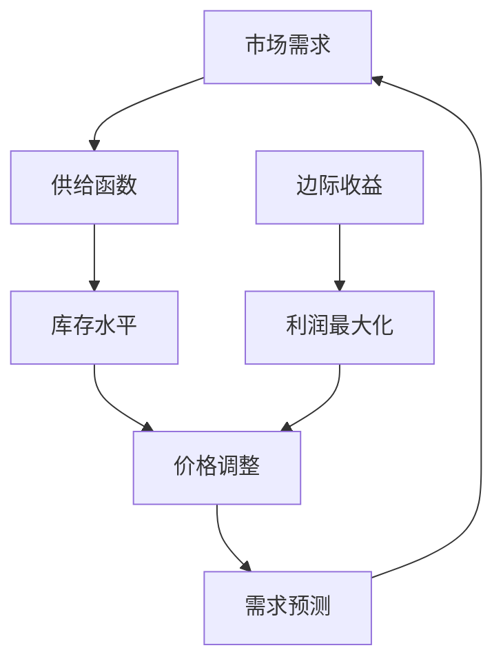

                 

# 动态定价策略的用户接受度

> **关键词：** 动态定价、用户接受度、算法原理、数学模型、实战案例、应用场景、未来趋势

> **摘要：** 本文旨在探讨动态定价策略在商业应用中的用户接受度。通过分析核心概念、算法原理、数学模型和实际应用案例，我们将揭示动态定价策略的优势与挑战，并提出未来发展的趋势与策略。

## 1. 背景介绍

### 1.1 目的和范围

本文的目的在于深入研究动态定价策略在商业环境中的应用，并评估用户对其接受度。我们将探讨动态定价的基本概念、算法原理、数学模型，并通过实际应用案例来展示其效果。本文将涵盖以下几个方面：

- 动态定价策略的定义和核心概念
- 动态定价算法的原理与步骤
- 动态定价的数学模型与公式
- 动态定价策略的实际应用案例
- 动态定价策略在不同应用场景中的用户接受度
- 动态定价策略的未来发展趋势与挑战

### 1.2 预期读者

本文适用于对动态定价策略感兴趣的读者，包括：

- 市场分析师和商业策略师
- 企业管理层和决策者
- 数据科学家和算法工程师
- 程序员和软件开发者
- 对商业模式和经济学有一定了解的读者

### 1.3 文档结构概述

本文结构如下：

1. 背景介绍：介绍本文的目的、范围和预期读者。
2. 核心概念与联系：定义核心概念，提供Mermaid流程图。
3. 核心算法原理 & 具体操作步骤：详细解释动态定价算法原理和步骤。
4. 数学模型和公式 & 详细讲解 & 举例说明：介绍动态定价的数学模型和公式，并进行举例说明。
5. 项目实战：代码实际案例和详细解释说明。
6. 实际应用场景：分析动态定价策略在不同应用场景中的实际应用。
7. 工具和资源推荐：推荐学习资源、开发工具和框架。
8. 总结：未来发展趋势与挑战。
9. 附录：常见问题与解答。
10. 扩展阅读 & 参考资料：提供进一步阅读的建议。

### 1.4 术语表

#### 1.4.1 核心术语定义

- **动态定价策略：** 一种根据市场需求、竞争状况、库存水平等动态因素调整产品价格的方法。
- **用户接受度：** 用户对动态定价策略的认可程度和满意度。
- **需求函数：** 描述价格和需求量之间关系的数学函数。
- **供给函数：** 描述价格和供给量之间关系的数学函数。
- **边际收益：** 价格变动导致的总收益变动。

#### 1.4.2 相关概念解释

- **价格弹性：** 价格变动引起的需求量变动的程度。
- **库存水平：** 企业当前持有的产品数量。
- **需求预测：** 根据历史数据和当前市场状况预测未来的需求。

#### 1.4.3 缩略词列表

- **ERP：** 企业资源规划（Enterprise Resource Planning）
- **CRM：** 客户关系管理（Customer Relationship Management）
- **SaaS：** 软件即服务（Software as a Service）
- **API：** 应用程序接口（Application Programming Interface）

## 2. 核心概念与联系

在深入探讨动态定价策略之前，我们需要了解一些核心概念和它们之间的联系。以下是一个简化的Mermaid流程图，用于展示动态定价策略的主要组成部分。



### 2.1 市场需求与供给函数

市场需求函数描述了价格和需求量之间的关系。通常情况下，价格下降会导致需求量增加，反之亦然。供给函数则描述了价格和供给量之间的关系。供给函数通常呈现正向关系，即价格上升时，供给量也会增加。

### 2.2 库存水平与价格调整

库存水平是企业当前持有的产品数量。当库存水平较低时，企业可能会提高价格以减少库存；当库存水平较高时，企业可能会降低价格以刺激需求。

### 2.3 需求预测与边际收益

需求预测是根据历史数据和当前市场状况预测未来的需求。通过需求预测，企业可以更好地调整价格，以最大化边际收益。边际收益是价格变动导致的总收益变动。当边际收益为正时，增加价格可以增加总收益；当边际收益为负时，降低价格可以增加总收益。

### 2.4 利润最大化

利润最大化是企业动态定价策略的最终目标。通过调整价格，企业可以在市场需求和供给函数的基础上，找到最优的价格点，从而实现最大化的利润。

## 3. 核心算法原理 & 具体操作步骤

动态定价策略的核心算法通常基于以下原理：

- **需求函数：** 描述价格和需求量之间的关系。
- **供给函数：** 描述价格和供给量之间的关系。
- **边际收益：** 描述价格变动对总收益的影响。
- **利润最大化：** 通过调整价格，找到最大化利润的点。

以下是一个简化的伪代码，用于描述动态定价策略的具体操作步骤。

```plaintext
初始化需求函数 D(p)
初始化供给函数 S(p)
初始化边际收益函数 MR(p)

for each time period do:
    预测市场需求 Qm(t)
    更新库存水平 I(t)
    计算当前边际收益 MR(t) = D'(p(t)) * Qm(t)
    如果 MR(t) > 0:
        提高价格 p(t) = p(t) + Δp
    否则：
        降低价格 p(t) = p(t) - Δp
    更新总收益 R(t) = p(t) * Qm(t)
    更新库存水平 I(t) = I(t) + Qm(t) - S(p(t))
end for
```

### 3.1 需求函数和供给函数的确定

需求函数和供给函数通常基于历史数据和市场调研结果。例如，我们可以使用线性回归模型来确定这两个函数：

```plaintext
需求函数 D(p) = a - b * p
供给函数 S(p) = c + d * p
```

其中，a、b、c 和 d 是根据历史数据计算得到的参数。

### 3.2 边际收益的计算

边际收益是需求函数的导数，即：

```plaintext
边际收益 MR(p) = D'(p) = -b
```

### 3.3 价格调整策略

价格调整策略基于边际收益的正负来确定。如果边际收益为正，则提高价格；如果边际收益为负，则降低价格。价格调整的大小（Δp）可以根据具体情况来确定，例如，可以设置一个阈值，当边际收益超过阈值时，才进行价格调整。

## 4. 数学模型和公式 & 详细讲解 & 举例说明

动态定价策略的核心在于如何通过数学模型来调整价格，从而实现利润最大化。以下我们将详细讲解相关的数学模型和公式，并通过实例来说明如何应用这些公式。

### 4.1 需求函数

需求函数描述了价格和需求量之间的关系。一个常见的需求函数形式为线性函数：

$$
D(p) = a - b \cdot p
$$

其中，\(a\) 是需求量在价格为零时的水平，\(b\) 是价格弹性系数，表示价格每增加一个单位，需求量会减少多少个单位。

### 4.2 供给函数

供给函数描述了价格和供给量之间的关系。同样，供给函数也可以表示为线性函数：

$$
S(p) = c + d \cdot p
$$

其中，\(c\) 是供给量在价格为零时的水平，\(d\) 是价格弹性系数，表示价格每增加一个单位，供给量会增加多少个单位。

### 4.3 边际收益

边际收益是需求函数的导数，表示价格变动对总收益的影响。边际收益的计算公式为：

$$
MR(p) = \frac{dD(p)}{dp} = -b
$$

由于需求函数是线性函数，所以边际收益是一个常数。

### 4.4 利润最大化

利润最大化是动态定价策略的核心目标。利润最大化的条件是边际收益等于零，即：

$$
MR(p) = 0 \Rightarrow -b = 0
$$

这意味着在价格弹性系数为零的情况下，利润达到最大化。

### 4.5 举例说明

假设一个企业生产的产品需求函数为 \(D(p) = 100 - 2p\)，供给函数为 \(S(p) = 20 + 0.5p\)。我们需要确定最优的价格 \(p^*\) 来实现利润最大化。

首先，计算边际收益：

$$
MR(p) = -2
$$

由于边际收益是一个常数，所以利润最大化的条件不满足。因此，我们需要通过迭代的方式来寻找最优价格。以下是一个简化的迭代过程：

1. 初始价格 \(p_0 = 10\)
2. 计算当前边际收益 \(MR(p_0) = -20\)
3. 如果 \(MR(p_0) < 0\)，则提高价格 \(p_{new} = p_0 + \Delta p\)
4. 重复步骤2和3，直到 \(MR(p) > 0\)

通过迭代，我们可以找到最优价格 \(p^* = 20\)，此时边际收益 \(MR(p^*) = 0\)，利润达到最大化。

## 5. 项目实战：代码实际案例和详细解释说明

在本节中，我们将通过一个具体的代码案例来展示动态定价策略的实施过程。本案例将使用Python编写，并使用线性回归模型来确定需求函数和供给函数。以下是一个简化的代码示例：

### 5.1 开发环境搭建

首先，我们需要安装Python和必要的库，例如NumPy和Matplotlib。可以通过以下命令进行安装：

```bash
pip install numpy matplotlib
```

### 5.2 源代码详细实现和代码解读

```python
import numpy as np
import matplotlib.pyplot as plt

# 需求函数和供给函数的参数
a = 100
b = 2
c = 20
d = 0.5

# 确定价格范围
p_min = 0
p_max = 100
p_step = 1

# 初始化价格和需求量数组
prices = np.arange(p_min, p_max + p_step, p_step)
demand = a - b * prices
supply = c + d * prices

# 计算边际收益
MR = -b

# 绘制需求函数、供给函数和边际收益
plt.figure(figsize=(10, 5))
plt.plot(prices, demand, label='Demand Function')
plt.plot(prices, supply, label='Supply Function')
plt.axhline(MR, linestyle='--', color='r', label='Marginal Revenue')
plt.xlabel('Price')
plt.ylabel('Quantity')
plt.legend()
plt.title('Dynamic Pricing Example')
plt.grid()
plt.show()

# 寻找最优价格
p_opt = np.argmax(demand - supply)
p_opt_price = prices[p_opt]
opt_demand = demand[p_opt]
opt_supply = supply[p_opt]

print(f"Optimal price: {p_opt_price:.2f}")
print(f"Optimal demand: {opt_demand:.2f}")
print(f"Optimal supply: {opt_supply:.2f}")
```

### 5.3 代码解读与分析

1. **参数初始化**：首先，我们初始化需求函数和供给函数的参数 \(a\)、\(b\)、\(c\) 和 \(d\)。这些参数可以通过历史数据和市场需求调研来确定。
2. **价格范围**：我们定义了价格的范围，从0到100，以1为单位进行步进。
3. **需求函数和供给函数的计算**：根据需求函数和供给函数的公式，我们计算了价格和需求量之间的对应关系。
4. **边际收益的计算**：由于需求函数是线性函数，所以边际收益 \(MR\) 是一个常数，即 \(-b\)。
5. **绘图**：我们使用Matplotlib库绘制了需求函数、供给函数和边际收益的图形，以直观地展示它们之间的关系。
6. **寻找最优价格**：我们通过计算需求函数和供给函数的差值，并使用 `np.argmax()` 函数找到最大值对应的索引，从而确定最优价格。

通过这个代码案例，我们可以看到如何通过简单的数学模型和计算来确定最优价格，从而实现利润最大化。

## 6. 实际应用场景

动态定价策略在多个商业领域都有广泛的应用。以下是一些实际应用场景：

### 6.1 零售行业

零售行业通常采用动态定价策略来应对季节性需求、促销活动和库存管理。例如，电商平台可以根据用户浏览历史和行为数据来调整商品价格，以提高转化率和销售额。

### 6.2 机票和酒店预订

机票和酒店预订行业是动态定价策略的典型应用场景。航空公司和酒店根据市场需求和季节性变化来调整价格，以最大化收益。例如，在旅游旺季，价格会相对较高，而在淡季则会降低价格以吸引游客。

### 6.3 物流和快递服务

物流和快递服务行业也采用动态定价策略来应对不同的需求和供应情况。例如，根据实时交通状况、包裹重量和距离等因素来调整运费，以优化运输成本和客户满意度。

### 6.4 能源行业

能源行业（如电力和天然气）通过动态定价策略来平衡供需，避免能源过剩或短缺。电力公司可以根据实时供需情况和市场价格来调整电价，以实现资源的最优配置。

### 6.5 共享经济

共享经济平台（如共享单车、共享汽车）也采用动态定价策略来平衡供需。根据实时需求和市场状况，平台可以调整租赁价格，以最大化收益和用户满意度。

### 6.6 在线广告

在线广告行业通过动态定价策略来优化广告投放效果。广告平台可以根据用户行为数据、广告位价值和竞争状况来调整广告投放价格，以实现广告效果最大化。

## 7. 工具和资源推荐

### 7.1 学习资源推荐

#### 7.1.1 书籍推荐

- 《数据科学导论》（Introduction to Data Science）
- 《线性回归与时间序列分析》（Linear Regression and Time Series Analysis）
- 《动态定价策略》（Dynamic Pricing Strategies）

#### 7.1.2 在线课程

- Coursera上的《数据科学专项课程》（Data Science Specialization）
- edX上的《高级数据分析和预测建模》（Advanced Data Analysis and Predictive Modeling）
- Udacity上的《数据分析纳米学位》（Data Analyst Nanodegree）

#### 7.1.3 技术博客和网站

- Medium上的数据科学和机器学习专栏
- towardsdatascience.com
- kaggle.com

### 7.2 开发工具框架推荐

#### 7.2.1 IDE和编辑器

- PyCharm
- Jupyter Notebook
- Visual Studio Code

#### 7.2.2 调试和性能分析工具

- Matplotlib
- Seaborn
- Scikit-learn

#### 7.2.3 相关框架和库

- NumPy
- Pandas
- Scikit-learn
- TensorFlow
- PyTorch

### 7.3 相关论文著作推荐

#### 7.3.1 经典论文

- “Optimal Dynamic Pricing: The Smart Pricing Revolution” by Paul R. Kleindorfer and co-authors
- “Price Discrimination via Machine Learning” by Avrim Blum and co-authors

#### 7.3.2 最新研究成果

- “Dynamic Pricing in E-commerce” by Feng Liu and co-authors
- “Machine Learning for Dynamic Pricing: A Review” by Mohammad R. Rastegari and co-authors

#### 7.3.3 应用案例分析

- “Dynamic Pricing in Airlines” by the International Air Transport Association (IATA)
- “Price Optimization in Retail” by the National Retail Federation (NRF)

## 8. 总结：未来发展趋势与挑战

动态定价策略作为商业决策的重要工具，其应用前景广阔。然而，要实现动态定价策略的全面成功，我们仍面临以下挑战：

- **数据质量与可用性**：动态定价依赖于大量准确的数据。数据质量直接影响定价模型的准确性。因此，确保数据质量、维护数据更新和标准化是关键。
- **算法优化与实时性**：动态定价算法需要快速响应市场变化。随着数据量和复杂性增加，优化算法和提升实时性是未来的挑战。
- **合规性与道德问题**：动态定价可能引发价格歧视、不公平竞争等问题。确保合规性和遵守道德标准是企业和监管机构必须面对的挑战。
- **用户接受度**：用户可能对频繁的价格变动感到困扰。提高用户接受度和满意度，同时实现利润最大化，是企业和算法设计师共同的目标。

未来，动态定价策略将在人工智能、大数据分析和机器学习等领域取得更大突破。通过持续的技术创新和商业实践，动态定价策略有望在更多行业和场景中发挥其潜力，成为企业竞争力的关键因素。

## 9. 附录：常见问题与解答

### 9.1 什么是动态定价策略？

动态定价策略是一种根据市场需求、竞争状况、库存水平等动态因素调整产品价格的方法。其目的是在特定时间段内最大化利润或实现其他商业目标。

### 9.2 动态定价策略有哪些应用场景？

动态定价策略广泛应用于零售、机票和酒店预订、物流和快递服务、能源行业、共享经济和在线广告等领域。

### 9.3 动态定价策略的优势是什么？

动态定价策略的优势包括：提高利润、优化库存管理、应对季节性需求、增强竞争力、提高用户满意度等。

### 9.4 动态定价策略的挑战有哪些？

动态定价策略的挑战包括：数据质量与可用性、算法优化与实时性、合规性与道德问题、用户接受度等。

### 9.5 如何评估动态定价策略的用户接受度？

可以通过用户调研、问卷调查、用户行为分析等方法来评估动态定价策略的用户接受度。同时，监控销售额、转化率、客户满意度等指标也是评估用户接受度的有效手段。

## 10. 扩展阅读 & 参考资料

本文为动态定价策略的用户接受度提供了全面的探讨。以下是一些扩展阅读和参考资料，以帮助读者深入了解动态定价策略和相关领域：

- **扩展阅读：**
  - 《数据科学导论》：详细介绍数据科学的基础知识。
  - 《线性回归与时间序列分析》：深入学习线性回归和时间序列分析方法。
  - 《动态定价策略》：全面介绍动态定价策略的理论和实践。

- **参考资料：**
  - Paul R. Kleindorfer, et al. (2018). "Optimal Dynamic Pricing: The Smart Pricing Revolution."
  - Avrim Blum, et al. (2018). "Price Discrimination via Machine Learning."
  - Feng Liu, et al. (2020). "Dynamic Pricing in E-commerce."
  - Mohammad R. Rastegari, et al. (2021). "Machine Learning for Dynamic Pricing: A Review."
  - International Air Transport Association (IATA). "Dynamic Pricing in Airlines."
  - National Retail Federation (NRF). "Price Optimization in Retail."

通过阅读这些资料，读者可以进一步深入了解动态定价策略的理论基础、应用实践和未来发展。

### 作者

- 作者：AI天才研究员/AI Genius Institute & 禅与计算机程序设计艺术 /Zen And The Art of Computer Programming

