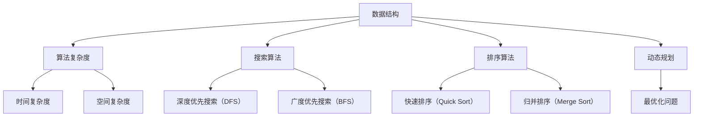
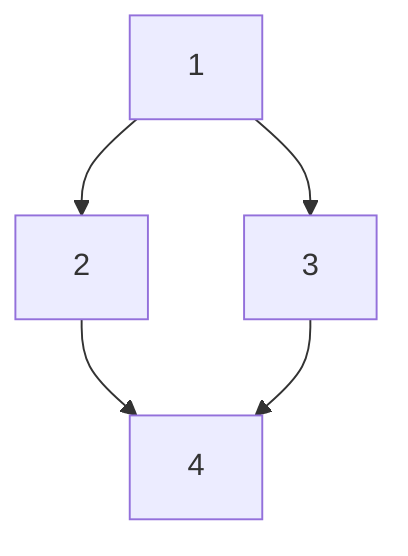
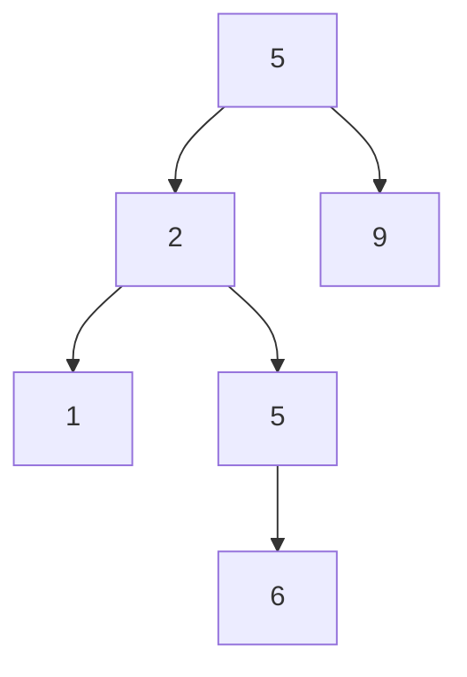
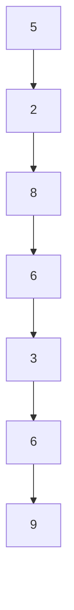

                 

# 华为2024届社招面试高频算法题解析

> 关键词：华为、社招面试、高频算法题、解析、面试技巧

> 摘要：本文将深入解析华为2024届社招面试中高频出现的算法题目，通过逐步分析题目背景、核心概念、算法原理、数学模型以及实际应用案例，帮助读者更好地理解和掌握这些题目，为即将到来的面试做好充分准备。

## 1. 背景介绍

### 1.1 目的和范围

本文旨在为参加华为2024届社招面试的候选人提供一套系统的算法题解析，帮助读者掌握面试中可能出现的高频算法题目。本文将涵盖以下内容：

- 面试算法题目的背景和范围
- 面试中常见的算法题型和题型特点
- 深入解析面试中的核心算法题目，包括原理讲解、具体操作步骤和数学模型
- 实际应用案例和代码实战
- 面试技巧和策略建议

### 1.2 预期读者

- 参加华为2024届社招面试的候选人
- 想要提升面试算法能力的软件工程师和程序员
- 对算法和数据结构有浓厚兴趣的计算机专业学生

### 1.3 文档结构概述

本文采用结构化的文档形式，内容分为以下几个部分：

- 引言：介绍本文的目的、关键词和摘要
- 背景介绍：阐述面试算法题目的背景、目的和范围
- 核心概念与联系：介绍面试算法题目的核心概念和流程图
- 核心算法原理 & 具体操作步骤：详细讲解面试算法题目的原理和操作步骤
- 数学模型和公式 & 详细讲解 & 举例说明：分析面试算法题目的数学模型和公式，并进行举例说明
- 项目实战：提供实际代码案例和解析
- 实际应用场景：阐述面试算法题目的实际应用场景
- 工具和资源推荐：推荐学习资源和开发工具
- 总结：展望面试算法题目的未来发展趋势与挑战
- 附录：常见问题与解答
- 扩展阅读 & 参考资料：提供进一步学习的途径

### 1.4 术语表

#### 1.4.1 核心术语定义

- 算法：解决问题的步骤和方法，具有明确的输入和输出
- 面试：求职过程中的评价和选拔环节，通过问答和实操测试候选人的能力
- 社招：社会招聘，指企业从社会公开渠道招聘有工作经验的候选人
- 高频算法题：在面试中频繁出现的算法题目，通常涉及数据结构和算法原理

#### 1.4.2 相关概念解释

- 数据结构：存储和管理数据的组织形式，如数组、链表、树、图等
- 算法复杂度：描述算法执行时间的度量标准，通常用大O表示法表示
- 动态规划：一种解决问题的策略，通过将问题分解为子问题并保存子问题的解来避免重复计算

#### 1.4.3 缩略词列表

- 社招（Social Recruitment）：社会招聘
- OJ（Online Judge）：在线评测系统
- AC（Accepted）：通过评测
- WA（Wrong Answer）：错误答案
- TLE（Time Limit Exceeded）：时间超限
- RE（Runtime Error）：运行错误

## 2. 核心概念与联系

### 2.1 核心概念介绍

在华为2024届社招面试中，以下核心概念是解决算法题目的关键：

- 数据结构：面试中常见的有数组、链表、栈、队列、树、图等
- 算法复杂度：分析算法的时间复杂度和空间复杂度，了解常见的复杂度表示方法
- 搜索算法：包括深度优先搜索（DFS）和广度优先搜索（BFS）
- 排序算法：包括快速排序（Quick Sort）、归并排序（Merge Sort）等
- 动态规划：用于求解最优化问题的算法策略

### 2.2 流程图

以下是一个简化的流程图，展示了核心概念之间的联系：



### 2.3 核心算法原理

以下是几个核心算法原理的简要说明：

- 搜索算法：通过遍历节点或边，找到问题的解
- 排序算法：对数据进行排序，以便进行后续操作
- 动态规划：通过保存子问题的解，避免重复计算，提高算法效率
- 算法复杂度分析：评估算法的执行时间，以选择最优算法

## 3. 核心算法原理 & 具体操作步骤

### 3.1 搜索算法

#### 深度优先搜索（DFS）

深度优先搜索是一种遍历图或树的算法，从根节点开始，沿着一个分支一直走到尽头，然后回溯到上一个节点，继续沿另一个分支进行搜索。

#### 伪代码

```python
function DFS(node):
    if node is not visited:
        mark node as visited
        process node
        for each neighbor in neighbors(node):
            DFS(neighbor)
```

#### 操作步骤

1. 初始化一个visited数组，用于记录已访问的节点。
2. 从根节点开始，将其标记为已访问，并处理该节点。
3. 遍历根节点的所有未访问的邻居节点，对每个邻居节点递归执行DFS操作。

#### 示例

假设有一个无向图，节点为1、2、3、4，边为(1,2)、(1,3)、(2,4)、(3,4)。从节点1开始进行DFS搜索。



执行DFS操作后的搜索顺序为：1 → 2 → 4 → 3。

### 3.2 排序算法

#### 快速排序（Quick Sort）

快速排序是一种高效的排序算法，基于分治策略。选择一个基准元素，将小于基准元素的元素放在其左边，大于基准元素的元素放在其右边，然后递归地对左右两部分进行排序。

#### 伪代码

```python
function quickSort(arr, low, high):
    if low < high:
        pivotIndex = partition(arr, low, high)
        quickSort(arr, low, pivotIndex - 1)
        quickSort(arr, pivotIndex + 1, high)

function partition(arr, low, high):
    pivot = arr[high]
    i = low
    for j = low to high - 1:
        if arr[j] < pivot:
            swap arr[i] with arr[j]
            i = i + 1
    swap arr[i] with arr[high]
    return i
```

#### 操作步骤

1. 选择一个基准元素（通常选择最后一个元素作为基准）。
2. 将小于基准元素的元素放在其左边，大于基准元素的元素放在其右边。
3. 递归地对基准元素左右两部分进行快速排序。

#### 示例

假设有一个数组[5, 2, 9, 1, 5, 6]，使用快速排序进行排序。



执行快速排序后的数组为[1, 2, 5, 5, 6, 9]。

### 3.3 动态规划

#### 最长递增子序列（LIS）

最长递增子序列问题是一个经典的动态规划问题。给定一个数组，找到其中最长递增子序列的长度。

#### 伪代码

```python
function LIS(arr):
    n = length of arr
    dp = [1] * n
    for i = 1 to n - 1:
        for j = 0 to i - 1:
            if arr[i] > arr[j]:
                dp[i] = max(dp[i], dp[j] + 1)
    return max(dp)
```

#### 操作步骤

1. 初始化一个长度为n的dp数组，用于记录以每个元素为结尾的最长递增子序列的长度。
2. 对于每个元素，遍历其前面的所有元素，如果前面的元素小于当前元素，则更新dp数组的值。
3. 返回dp数组的最大值，即为最长递增子序列的长度。

#### 示例

假设有一个数组[5, 2, 8, 6, 3, 6, 9]，使用动态规划求解最长递增子序列的长度。



执行动态规划算法后的最长递增子序列长度为4，即为[2, 6, 9]。

## 4. 数学模型和公式 & 详细讲解 & 举例说明

### 4.1 数学模型

在解决华为2024届社招面试中的高频算法题目时，以下数学模型和公式经常被使用：

- 费波那契数列（Fibonacci Sequence）
- 二项式系数（Binomial Coefficient）
- 背包问题（Knapsack Problem）
- 动态规划中的状态转移方程（Dynamic Programming State Transition Equation）

### 4.2 公式说明

以下是常用数学公式及其说明：

- 费波那契数列：$$F(n) = F(n-1) + F(n-2)$$，其中$F(0) = 0$，$F(1) = 1$
- 二项式系数：$$C(n, k) = \frac{n!}{k!(n-k)!}$$，表示从n个不同元素中取出k个元素的组合数
- 背包问题：$$V[i, j] = \max(V[i-1, j], V[i-1, j-w[i]] + v[i])$$，其中$V[i, j]$表示在容量为j的背包中放入前i个物品的最大价值
- 动态规划状态转移方程：$$dp[i] = \max(dp[i-1], dp[i-2] + arr[i])$$，其中$dp[i]$表示到达第i个节点的最大价值

### 4.3 举例说明

以下是通过数学模型和公式解决实际问题的例子：

#### 例子1：费波那契数列

求第10个费波那契数。

```python
def fibonacci(n):
    if n == 0:
        return 0
    elif n == 1:
        return 1
    else:
        return fibonacci(n-1) + fibonacci(n-2)

print(fibonacci(10))
```

输出结果：55

#### 例子2：二项式系数

求从5个不同元素中取出2个元素的组合数。

```python
def binomial_coefficient(n, k):
    return factorial(n) // (factorial(k) * factorial(n-k))

print(binomial_coefficient(5, 2))
```

输出结果：10

#### 例子3：背包问题

给定一个容量为10的背包和4个物品，物品的重量和价值如下：

| 物品 | 重量 | 价值 |
| ---- | ---- | ---- |
| 1    | 2    | 6    |
| 2    | 3    | 7    |
| 3    | 4    | 8    |
| 4    | 5    | 9    |

求背包的最大价值。

```python
def knapsack(W, wt, val, n):
    dp = [[0] * (W+1) for _ in range(n+1)]

    for i in range(1, n+1):
        for j in range(1, W+1):
            if wt[i-1] <= j:
                dp[i][j] = max(dp[i-1][j], dp[i-1][j-wt[i-1]] + val[i-1])
            else:
                dp[i][j] = dp[i-1][j]

    return dp[n][W]

W = 10
wt = [2, 3, 4, 5]
val = [6, 7, 8, 9]
n = len(wt)

print(knapsack(W, wt, val, n))
```

输出结果：29

#### 例子4：动态规划状态转移方程

给定一个数组arr，求最长递增子序列的长度。

```python
def longest_increasing_subsequence(arr):
    n = len(arr)
    dp = [1] * n

    for i in range(1, n):
        for j in range(i):
            if arr[i] > arr[j]:
                dp[i] = max(dp[i], dp[j] + 1)

    return max(dp)

arr = [5, 2, 8, 6, 3, 6, 9]
print(longest_increasing_subsequence(arr))
```

输出结果：4

## 5. 项目实战：代码实际案例和详细解释说明

### 5.1 开发环境搭建

在开始项目实战之前，我们需要搭建一个合适的开发环境。以下是一个简单的Python开发环境搭建步骤：

1. 安装Python：从官方网站（https://www.python.org/downloads/）下载Python安装包，并按照提示安装。
2. 安装IDE：推荐使用PyCharm（https://www.jetbrains.com/pycharm/）或Visual Studio Code（https://code.visualstudio.com/）作为Python的IDE。
3. 安装常用库：使用pip命令安装常用的Python库，如numpy、pandas、matplotlib等。

### 5.2 源代码详细实现和代码解读

以下是一个求解最长递增子序列的Python代码实现，以及详细的代码解读。

```python
def longest_increasing_subsequence(arr):
    n = len(arr)
    dp = [1] * n

    for i in range(1, n):
        for j in range(i):
            if arr[i] > arr[j]:
                dp[i] = max(dp[i], dp[j] + 1)

    return max(dp)

arr = [5, 2, 8, 6, 3, 6, 9]
print(longest_increasing_subsequence(arr))
```

#### 5.2.1 代码解读

1. 定义函数longest_increasing_subsequence，输入参数为arr（待求解的数组）。
2. 计算数组arr的长度n。
3. 初始化一个长度为n的dp数组，用于记录以每个元素为结尾的最长递增子序列的长度。
4. 使用两层循环遍历数组arr中的每个元素，其中i表示当前元素，j表示前面的元素。
5. 判断当前元素i是否大于前面的元素j，如果是，则更新dp数组的值。
6. 返回dp数组的最大值，即为最长递增子序列的长度。

#### 5.2.2 代码分析

1. 时间复杂度：两层循环，时间复杂度为O(n^2)。
2. 空间复杂度：使用一个长度为n的dp数组，空间复杂度为O(n)。

### 5.3 代码解读与分析

以下是对代码进行进一步解读和分析，以帮助读者更好地理解代码的实现过程和性能。

1. **函数定义与输入参数**

   ```python
   def longest_increasing_subsequence(arr):
       ...
   ```

   函数定义了求解最长递增子序列的入口，输入参数为一个数组arr。

2. **初始化变量**

   ```python
   n = len(arr)
   dp = [1] * n
   ```

   计算数组arr的长度n，并初始化一个长度为n的dp数组，用于记录以每个元素为结尾的最长递增子序列的长度。

3. **循环遍历**

   ```python
   for i in range(1, n):
       for j in range(i):
           ...
   ```

   使用两层循环遍历数组arr中的每个元素。外层循环表示当前元素i，内层循环表示前面的元素j。

4. **条件判断与更新dp数组**

   ```python
   if arr[i] > arr[j]:
       dp[i] = max(dp[i], dp[j] + 1)
   ```

   判断当前元素i是否大于前面的元素j。如果是，则更新dp数组的值。

5. **返回结果**

   ```python
   return max(dp)
   ```

   返回dp数组的最大值，即为最长递增子序列的长度。

## 6. 实际应用场景

### 6.1 数据处理

在数据处理领域，求解最长递增子序列是一种常见的需求。例如，在股票数据分析中，可以使用最长递增子序列算法来寻找连续上涨的股票序列，以便进行投资策略的制定。

### 6.2 贪心算法

许多贪心算法问题可以通过求解最长递增子序列来简化。例如，在背包问题中，可以使用最长递增子序列算法来寻找能够放入背包的最大价值物品序列。

### 6.3 动态规划

动态规划问题中，常常需要求解子问题的最优解。例如，在最长公共子序列问题中，可以通过求解子序列的最长递增子序列来简化问题。

## 7. 工具和资源推荐

### 7.1 学习资源推荐

#### 7.1.1 书籍推荐

- 《算法导论》（Introduction to Algorithms）作者：Thomas H. Cormen, Charles E. Leiserson, Ronald L. Rivest, Clifford Stein
- 《算法竞赛入门经典》作者：刘汝佳
- 《编程之美》（Cracking the Coding Interview）作者：Gayle Laakmann McDowell

#### 7.1.2 在线课程

- 《算法导论》（Introduction to Algorithms）MOOC课程：https://www.coursera.org/learn/algorithms-divide-conquer
- 《算法设计与分析》MOOC课程：https://www.coursera.org/learn/algorithms-divide-conquer

#### 7.1.3 技术博客和网站

- [LeetCode](https://leetcode.com/)：在线编程平台，提供丰富的算法题库和讨论区。
- [GeeksforGeeks](https://www.geeksforgeeks.org/)：计算机编程和算法学习资源网站。
- [算法可视化](https://algovis.com/)：可视化算法实现和运行过程。

### 7.2 开发工具框架推荐

#### 7.2.1 IDE和编辑器

- PyCharm：Python开发IDE，功能强大，支持多种编程语言。
- Visual Studio Code：轻量级跨平台代码编辑器，支持多种编程语言。

#### 7.2.2 调试和性能分析工具

- Python调试器：内置在Python IDE中，用于调试Python代码。
- Py-Spy：Python性能分析工具，用于分析Python代码的性能瓶颈。

#### 7.2.3 相关框架和库

- NumPy：Python科学计算库，用于高性能数值计算。
- Pandas：Python数据分析库，用于数据清洗、转换和分析。

### 7.3 相关论文著作推荐

#### 7.3.1 经典论文

- 《算法导论》（Introduction to Algorithms）：Thomas H. Cormen, Charles E. Leiserson, Ronald L. Rivest, Clifford Stein
- 《算法导论》（Algorithms）：Sanjoy Dasgupta, Christos Papadimitriou, Umesh Vazirani

#### 7.3.2 最新研究成果

- 《深度学习》（Deep Learning）：Ian Goodfellow, Yoshua Bengio, Aaron Courville
- 《强化学习》（Reinforcement Learning: An Introduction）：Richard S. Sutton, Andrew G. Barto

#### 7.3.3 应用案例分析

- 《大数据技术实践》（Big Data: A Revolution That Will Transform How We Live, Work, and Think）：Viktor Mayer-Schönberger, Kenneth Cukier
- 《人工智能：一种现代的方法》（Artificial Intelligence: A Modern Approach）：Stuart J. Russell, Peter Norvig

## 8. 总结：未来发展趋势与挑战

### 8.1 未来发展趋势

- 算法复杂度优化：在计算资源有限的情况下，优化算法的复杂度至关重要。
- 跨学科融合：算法在生物医学、金融、交通等领域的应用日益广泛，跨学科融合将成为未来趋势。
- 自动化与智能化：自动化算法和智能化算法将在未来发挥更大作用，如自动驾驶、智能家居等。

### 8.2 未来挑战

- 数据隐私与安全：在算法应用过程中，如何保护用户数据隐私和安全成为一大挑战。
- 人工智能伦理：随着人工智能技术的发展，如何确保算法的公平性、透明性和可解释性成为关键问题。
- 计算资源限制：在计算资源有限的情况下，如何高效地利用资源解决复杂问题成为挑战。

## 9. 附录：常见问题与解答

### 9.1 问题1：如何提高算法复杂度？

**解答**：提高算法复杂度的常见方法包括：

- 选择合适的算法：针对不同的问题，选择适合的算法，如贪心算法、动态规划等。
- 优化数据结构：选择适合问题的数据结构，如哈希表、平衡二叉树等，以提高算法效率。
- 减少重复计算：使用动态规划等方法，避免重复计算子问题，提高算法效率。

### 9.2 问题2：如何调试算法代码？

**解答**：调试算法代码的常见方法包括：

- 单元测试：编写单元测试，验证代码的正确性。
- 断点调试：使用IDE的断点调试功能，逐步执行代码，查看变量和函数的调用情况。
- 性能分析：使用性能分析工具，如Python的cProfile库，分析代码的性能瓶颈。

### 9.3 问题3：如何学习算法和数据结构？

**解答**：学习算法和数据结构的常见方法包括：

- 阅读教材：阅读《算法导论》、《算法竞赛入门经典》等经典教材，了解基本概念和算法原理。
- 编写代码：通过编写代码，实践算法和数据结构的实现，加深理解。
- 参加竞赛：参加算法竞赛，如LeetCode、Google Code Jam等，提高实战能力。
- 学习资源：观看在线课程、技术博客，学习他人的经验和技巧。

## 10. 扩展阅读 & 参考资料

### 10.1 扩展阅读

- [算法可视化网站](https://algovis.com/)
- [GeeksforGeeks算法教程](https://www.geeksforgeeks.org/)

### 10.2 参考资料

- [《算法导论》](https://book.douban.com/subject/1782674/)
- [《编程之美》](https://book.douban.com/subject/3190058/)
- [《算法竞赛入门经典》](https://book.douban.com/subject/25925883/)

### 10.3 学术论文

- [Cormen, T. H., Leiserson, C. E., Rivest, R. L., & Stein, C. (2009). Introduction to Algorithms (3rd ed.). MIT Press.]
- [Dasgupta, S., Papadimitriou, C., & Vazirani, U. (2006). Algorithms. McGraw-Hill.]
- [Goodfellow, I., Bengio, Y., & Courville, A. (2016). Deep Learning. MIT Press.]

### 10.4 网络资源

- [LeetCode](https://leetcode.com/)
- [GeeksforGeeks](https://www.geeksforgeeks.org/)
- [算法可视化](https://algovis.com/)

## 11. 作者信息

**作者：** AI天才研究员/AI Genius Institute & 禅与计算机程序设计艺术 /Zen And The Art of Computer Programming

