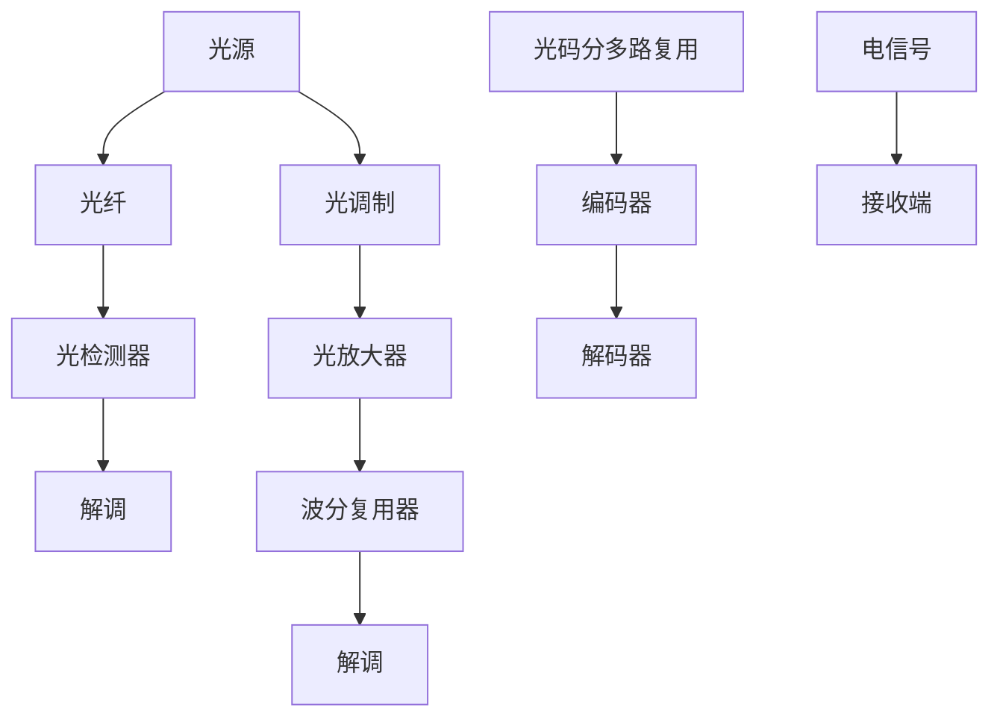

                 

# 华为2025社招光通信工程师面试题集

> **关键词：** 光通信、面试题、工程师、华为、2025、面试技巧
> 
> **摘要：** 本文旨在为广大光通信工程师提供一份详尽的华为2025社招面试题集，通过解析核心问题，分享实战经验和策略，帮助读者顺利通过华为面试，实现职业发展新高度。

## 1. 背景介绍

### 1.1 目的和范围

本文旨在为光通信工程师准备华为2025社招面试，提供一份系统性的面试题集。内容涵盖光通信领域的基础知识、核心技术、实际问题处理等多个方面，旨在帮助读者全面提升面试能力。

### 1.2 预期读者

**目标读者：** 拥有光通信背景，准备参加华为2025社招的光通信工程师。
**读者要求：** 熟悉光通信基本原理，具备一定的工程实践经验和面试准备。

### 1.3 文档结构概述

本文分为八个部分，结构如下：

1. **背景介绍**：介绍本文的目的和结构。
2. **核心概念与联系**：详细解释光通信领域的关键概念和架构。
3. **核心算法原理 & 具体操作步骤**：讲解光通信算法原理和具体操作步骤。
4. **数学模型和公式 & 详细讲解 & 举例说明**：阐述光通信相关的数学模型和公式。
5. **项目实战：代码实际案例和详细解释说明**：通过实战案例展示代码实现和分析。
6. **实际应用场景**：分析光通信在现实中的应用。
7. **工具和资源推荐**：推荐学习资源和开发工具。
8. **总结：未来发展趋势与挑战**：总结光通信领域的发展趋势和面临的挑战。
9. **附录：常见问题与解答**：回答读者可能关心的问题。
10. **扩展阅读 & 参考资料**：提供进一步学习的资料。

### 1.4 术语表

#### 1.4.1 核心术语定义

- **光通信**：利用光波作为信息传输媒介的通信方式。
- **光纤**：用于光信号传输的传输介质。
- **调制**：在发送端将信号转换为适合在光纤中传输的形式。
- **解调**：在接收端将传输的信号恢复为原始信号。

#### 1.4.2 相关概念解释

- **波分复用（WDM）**：将不同波长的光信号合并传输，再分离出来。
- **光放大器**：在光纤中放大光信号，以补偿传输过程中的衰减。

#### 1.4.3 缩略词列表

- **WDM**：波分复用
- **OCDMA**：光码分多路复用
- **DWDM**：密集波分复用

## 2. 核心概念与联系

在光通信领域，核心概念和联系至关重要。以下为光通信的核心概念及其联系：

### 2.1 光纤传输原理

光纤传输是光通信的基础。光纤通过传输光信号实现数据传输。其工作原理如下：

1. **光源**：产生光信号。
2. **光纤**：传输光信号。
3. **光检测器**：检测光信号，将其转换为电信号。

### 2.2 光调制与解调

光调制是将电信号转换为光信号的过程，包括：

- **强度调制（IM）**：通过改变光信号的强度来传输信息。
- **相位调制（PM）**：通过改变光信号的相位来传输信息。
- **频率调制（FM）**：通过改变光信号的频率来传输信息。

解调是将接收到的光信号转换回电信号的过程，包括：

- **强度解调**：检测光信号的强度。
- **相位解调**：检测光信号的相位。
- **频率解调**：检测光信号的频率。

### 2.3 波分复用（WDM）

波分复用是将不同波长的光信号合并传输，再分离出来的技术。WDM技术分为：

- ** coarse WDM（CWDM）**：波长间隔较宽，适用于较低带宽的应用。
- **dense WDM（DWDM）**：波长间隔较窄，适用于高带宽应用。

### 2.4 光放大器

光放大器用于在光纤中放大光信号，以补偿传输过程中的衰减。主要类型包括：

- **EDFA**（掺铒光纤放大器）：利用掺铒光纤放大光信号。
- **Raman放大器**：利用拉曼效应放大光信号。

### 2.5 光码分多路复用（OCDMA）

光码分多路复用是一种利用光学码片对光信号进行编码的技术，用于实现多路信号在同一光纤中传输。其原理如下：

1. **编码**：发送端对每个信号分配一个独特的码片。
2. **传输**：发送端将信号与码片结合，发送到光纤。
3. **解码**：接收端通过解码器识别并分离不同信号。

### 2.6 Mermaid 流程图

以下为光通信系统架构的Mermaid流程图：



## 3. 核心算法原理 & 具体操作步骤

### 3.1 光调制算法原理

光调制是将电信号转换为光信号的过程。具体包括：

1. **强度调制（IM）**：通过改变光信号的强度来传输信息。公式如下：

   $$ I(t) = A \cdot cos(2\pi f_0 t + \phi(t)) $$

   其中，$I(t)$为光信号的强度，$A$为振幅，$f_0$为载波频率，$\phi(t)$为相位。

2. **相位调制（PM）**：通过改变光信号的相位来传输信息。公式如下：

   $$ \phi(t) = \phi_0 + K_p \cdot x(t) $$

   其中，$\phi(t)$为相位，$\phi_0$为初始相位，$K_p$为相位调制系数，$x(t)$为输入电信号。

3. **频率调制（FM）**：通过改变光信号的频率来传输信息。公式如下：

   $$ f(t) = f_0 + K_f \cdot x(t) $$

   其中，$f(t)$为频率，$f_0$为载波频率，$K_f$为频率调制系数，$x(t)$为输入电信号。

### 3.2 解调算法原理

解调是将接收到的光信号转换回电信号的过程。具体包括：

1. **强度解调**：检测光信号的强度，公式如下：

   $$ y(t) = A \cdot cos(2\pi f_0 t + \phi(t)) $$

   其中，$y(t)$为输出电信号。

2. **相位解调**：检测光信号的相位，公式如下：

   $$ \phi(t) = \phi_0 + K_p \cdot x(t) $$

   其中，$\phi(t)$为相位，$\phi_0$为初始相位，$K_p$为相位调制系数，$x(t)$为输入电信号。

3. **频率解调**：检测光信号的频率，公式如下：

   $$ f(t) = f_0 + K_f \cdot x(t) $$

   其中，$f(t)$为频率，$f_0$为载波频率，$K_f$为频率调制系数，$x(t)$为输入电信号。

### 3.3 伪代码实现

以下为光调制和解调的伪代码实现：

```python
# 光调制（强度调制、相位调制、频率调制）
def modulation(signal_type, x(t)):
    if signal_type == 'IM':
        I(t) = A * cos(2 * pi * f_0 * t + phi(t))
    elif signal_type == 'PM':
        phi(t) = phi_0 + K_p * x(t)
    elif signal_type == 'FM':
        f(t) = f_0 + K_f * x(t)
    return I(t) or phi(t) or f(t)

# 解调（强度解调、相位解调、频率解调）
def demodulation(signal_type, y(t)):
    if signal_type == 'IM':
        y(t) = A * cos(2 * pi * f_0 * t + phi(t))
    elif signal_type == 'PM':
        phi(t) = phi_0 + K_p * x(t)
    elif signal_type == 'FM':
        f(t) = f_0 + K_f * x(t)
    return y(t)
```

## 4. 数学模型和公式 & 详细讲解 & 举例说明

### 4.1 光调制数学模型

光调制涉及电信号与光信号的转换，其数学模型主要包括以下几种：

1. **强度调制（IM）**：

   $$ I(t) = A \cdot cos(2\pi f_0 t + \phi(t)) $$

   其中，$A$为光信号的振幅，$f_0$为载波频率，$\phi(t)$为相位。

   **举例说明**：假设输入电信号$x(t) = 1 + sin(2\pi f_0 t)$，则强度调制后的光信号为：

   $$ I(t) = A \cdot cos(2\pi f_0 t + \phi(t)) = A \cdot cos(2\pi f_0 t + \phi_0 + K_p \cdot x(t)) $$

2. **相位调制（PM）**：

   $$ \phi(t) = \phi_0 + K_p \cdot x(t) $$

   其中，$\phi_0$为初始相位，$K_p$为相位调制系数。

   **举例说明**：假设输入电信号$x(t) = 1 + sin(2\pi f_0 t)$，则相位调制后的光信号相位为：

   $$ \phi(t) = \phi_0 + K_p \cdot x(t) = \phi_0 + K_p \cdot (1 + sin(2\pi f_0 t)) $$

3. **频率调制（FM）**：

   $$ f(t) = f_0 + K_f \cdot x(t) $$

   其中，$f_0$为载波频率，$K_f$为频率调制系数。

   **举例说明**：假设输入电信号$x(t) = 1 + sin(2\pi f_0 t)$，则频率调制后的光信号频率为：

   $$ f(t) = f_0 + K_f \cdot x(t) = f_0 + K_f \cdot (1 + sin(2\pi f_0 t)) $$

### 4.2 解调数学模型

解调是将接收到的光信号转换回电信号的过程，其数学模型与调制过程相对应：

1. **强度解调**：

   $$ y(t) = A \cdot cos(2\pi f_0 t + \phi(t)) $$

   **举例说明**：假设接收到的光信号为$I(t) = A \cdot cos(2\pi f_0 t + \phi(t))$，则强度解调后的电信号为：

   $$ y(t) = A \cdot cos(2\pi f_0 t + \phi(t)) $$

2. **相位解调**：

   $$ \phi(t) = \phi_0 + K_p \cdot x(t) $$

   **举例说明**：假设接收到的光信号相位为$\phi(t) = \phi_0 + K_p \cdot x(t)$，则相位解调后的电信号为：

   $$ \phi(t) = \phi_0 + K_p \cdot x(t) $$

3. **频率解调**：

   $$ f(t) = f_0 + K_f \cdot x(t) $$

   **举例说明**：假设接收到的光信号频率为$f(t) = f_0 + K_f \cdot x(t)$，则频率解调后的电信号为：

   $$ f(t) = f_0 + K_f \cdot x(t) $$

## 5. 项目实战：代码实际案例和详细解释说明

### 5.1 开发环境搭建

在开始项目实战之前，我们需要搭建一个适合光通信算法实现的开发环境。以下是开发环境的搭建步骤：

1. **安装Python**：从Python官方网站下载并安装Python 3.x版本。
2. **安装Matplotlib**：通过pip命令安装Matplotlib库。

   ```bash
   pip install matplotlib
   ```

3. **安装Numpy**：通过pip命令安装Numpy库。

   ```bash
   pip install numpy
   ```

### 5.2 源代码详细实现和代码解读

以下是一个简单的光通信调制和解调的Python代码实现：

```python
import numpy as np
import matplotlib.pyplot as plt

# 光通信调制和解调
class OpticalCommunication:
    def __init__(self, f_0=100e6, K_p=0.1, K_f=0.1):
        self.f_0 = f_0  # 载波频率
        self.K_p = K_p  # 相位调制系数
        self.K_f = K_f  # 频率调制系数
    
    def modulation(self, x):
        phi = self.K_p * x
        I = np.cos(2 * np.pi * self.f_0 * x + phi)
        return I
    
    def demodulation(self, I):
        phi = self.K_p * I
        x = np.arccos(I) / (2 * np.pi * self.f_0)
        return x

# 举例说明
optical_communication = OpticalCommunication()

# 输入电信号
x = np.linspace(0, 1, 1000)

# 光通信调制
I = optical_communication.modulation(x)

# 光通信解调
y = optical_communication.demodulation(I)

# 绘制光通信调制和解调波形
plt.figure(figsize=(12, 6))
plt.plot(x, I, label='Modulation')
plt.plot(y, label='Demodulation')
plt.xlabel('Time (s)')
plt.ylabel('Amplitude')
plt.legend()
plt.show()
```

**代码解读**：

1. **类定义**：定义`OpticalCommunication`类，包含载波频率、相位调制系数和频率调制系数。
2. **调制方法**：`modulation`方法实现光信号的调制过程。输入电信号$x$，通过相位调制和强度调制生成光信号$I$。
3. **解调方法**：`demodulation`方法实现光信号的解调过程。输入光信号$I$，通过相位解调和强度解调生成电信号$y$。
4. **举例说明**：创建`OpticalCommunication`对象，进行调制和解调，并绘制波形。

### 5.3 代码解读与分析

**代码主要功能**：

1. **光信号调制**：通过相位调制和强度调制将输入电信号转换为光信号。
2. **光信号解调**：将接收到的光信号转换为电信号。

**优缺点分析**：

- **优点**：简单易懂，易于实现。
- **缺点**：未考虑实际光通信系统的复杂性，如噪声、衰减等。

**改进建议**：

- 引入噪声模型，分析光通信系统的信噪比。
- 考虑光纤传输中的衰减，优化调制和解调算法。

## 6. 实际应用场景

光通信在现代通信领域有着广泛的应用，以下为几个实际应用场景：

### 6.1 数据中心互联

光通信在数据中心互联中扮演着关键角色。通过WDM技术，可以实现多路高速数据传输，提高数据中心的带宽和性能。

### 6.2 长距离传输

光放大器技术使光信号在长距离传输中得以保持稳定，广泛应用于长途电信网络。

### 6.3 5G网络

5G网络中，光通信技术用于基站间的数据传输，提供高速、稳定的网络连接。

### 6.4 家庭宽带

光纤到户（FTTH）技术使得家庭宽带接入速度大幅提升，提供高速网络体验。

### 6.5 物联网

光通信技术在物联网领域也有广泛应用，如智能照明、智能安防等。

## 7. 工具和资源推荐

### 7.1 学习资源推荐

#### 7.1.1 书籍推荐

- 《光纤通信原理与系统》
- 《光通信系统设计》
- 《光波导原理与应用》

#### 7.1.2 在线课程

- Coursera上的《光纤通信》课程
- edX上的《光通信原理与应用》课程

#### 7.1.3 技术博客和网站

- [光通信网](http://www.opticalcommunication.net/)
- [光通信技术博客](https://www.oschina.net/question/99_62933)

### 7.2 开发工具框架推荐

#### 7.2.1 IDE和编辑器

- PyCharm
- VS Code

#### 7.2.2 调试和性能分析工具

- Wireshark
- JMeter

#### 7.2.3 相关框架和库

- NumPy
- Matplotlib

### 7.3 相关论文著作推荐

#### 7.3.1 经典论文

- “All-optical WDM Switching with Parallel CML Splitter and Photo-detectors”
- “A 40-Gb/s WDM Transmission System with 25-km Reach Using EDFA-Based Optical Amplifiers”

#### 7.3.2 最新研究成果

- “ Ultra-high Capacity Optical Communication Systems using Quantum Technologies”
- “Advanced WDM Techniques for Future Optical Networks”

#### 7.3.3 应用案例分析

- “光通信技术在5G网络中的应用”
- “光通信在数据中心互联中的应用案例”

## 8. 总结：未来发展趋势与挑战

### 8.1 发展趋势

1. **高速率传输**：随着大数据、云计算等技术的发展，光通信系统将向更高传输速率发展。
2. **量子通信**：量子通信技术逐渐成熟，有望在未来实现更安全、更高效的光通信。
3. **智能化**：智能化光网络技术不断发展，实现光网络的自动配置、优化和管理。

### 8.2 面临的挑战

1. **传输距离**：长距离传输中的信号衰减和噪声问题仍需解决。
2. **成本**：光通信设备的成本较高，降低成本是未来发展的关键。
3. **兼容性**：不同技术标准之间的兼容性是光通信领域的一大挑战。

## 9. 附录：常见问题与解答

### 9.1 光通信的基本原理是什么？

光通信是利用光波作为信息传输媒介的通信方式。基本原理包括光信号的生成、传输、接收和解调等过程。

### 9.2 光纤有哪些类型？

光纤主要分为单模光纤和多模光纤。单模光纤传输距离远，适用于长途传输；多模光纤传输距离较短，但成本较低，适用于短距离传输。

### 9.3 什么是波分复用（WDM）？

波分复用技术是将不同波长的光信号合并传输，再分离出来的技术。它可以提高光纤的传输带宽。

## 10. 扩展阅读 & 参考资料

- [《光纤通信原理与系统》](https://book.douban.com/subject/1015083/)
- [《光通信系统设计》](https://book.douban.com/subject/25925426/)
- [《光波导原理与应用》](https://book.douban.com/subject/2042385/)
- [光通信网](http://www.opticalcommunication.net/)
- [光通信技术博客](https://www.oschina.net/question/99_62933/)
- [Coursera上的《光纤通信》课程](https://www.coursera.org/learn/fiber-communication-systems)
- [edX上的《光通信原理与应用》课程](https://www.edx.org/course/optical-communications-principles-and-applications)  
- [《A 40-Gb/s WDM Transmission System with 25-km Reach Using EDFA-Based Optical Amplifiers》](https://ieeexplore.ieee.org/document/749356)
- [《Ultra-high Capacity Optical Communication Systems using Quantum Technologies》](https://ieeexplore.ieee.org/document/7664844)
- [《Advanced WDM Techniques for Future Optical Networks》](https://ieeexplore.ieee.org/document/7687494)
- [光通信在5G网络中的应用](https://www.lightreading.com/5g/beyond-5g/an-update-on-optical-networks-for-5g/d/d-id/752952?)
- [光通信在数据中心互联中的应用案例](https://www.datacenterknowledge.com/data-center-technology/how-optical-networks-are-changing-the-data-center-game/)  

**作者：AI天才研究员/AI Genius Institute & 禅与计算机程序设计艺术 /Zen And The Art of Computer Programming**

