                 

# 2024华为企业业务校招面试真题汇总及其解答

> **关键词：** 华为企业业务、校招面试、真题汇总、解答、面试技巧

> **摘要：** 本文将汇总2024年华为企业业务校招面试中的真题，详细分析每个题目的解答思路和技巧，帮助准备校招面试的同学们更好地应对挑战，顺利通过面试。

## 1. 背景介绍

### 1.1 目的和范围

本文旨在为准备华为企业业务校招面试的同学们提供一份全面的真题汇总和解答指南。通过分析这些真题，我们希望帮助大家了解华为面试的常见题型和考查点，掌握解题方法和技巧，提升面试能力。

### 1.2 预期读者

本文适用于准备华为企业业务校招面试的本科生、研究生以及对技术面试有兴趣的职场人士。无论你是应届生还是转行者，相信本文都能为你提供有价值的参考。

### 1.3 文档结构概述

本文结构如下：

1. 背景介绍：介绍本文的目的、预期读者和文档结构。
2. 核心概念与联系：分析华为面试中的核心概念和联系。
3. 核心算法原理 & 具体操作步骤：讲解面试中常见的算法题目及其解题方法。
4. 数学模型和公式 & 详细讲解 & 举例说明：阐述面试中涉及到的数学模型和公式。
5. 项目实战：通过实际案例展示解题思路和技巧。
6. 实际应用场景：分析面试题目在现实中的应用场景。
7. 工具和资源推荐：推荐相关的学习资源和开发工具。
8. 总结：总结华为面试的趋势和发展方向。
9. 附录：常见问题与解答。
10. 扩展阅读 & 参考资料：提供更多相关阅读资料。

### 1.4 术语表

#### 1.4.1 核心术语定义

- 校招面试：指针对应届毕业生进行的招聘面试。
- 华为企业业务：指华为公司旗下的企业业务部门，主要负责为企业客户提供通信网络、云计算、大数据、物联网等解决方案。
- 算法题目：指在面试过程中，面试官提出的需要运用算法知识进行解答的问题。
- 数学模型：指用于描述现实世界问题的数学公式和计算方法。

#### 1.4.2 相关概念解释

- 面试题型：指面试过程中常见的题型，如编程题、算法题、数学题、逻辑题等。
- 解题思路：指解答面试题目的方法和思路。
- 解题技巧：指在解答面试题目时，可以帮助提高效率和质量的方法。

#### 1.4.3 缩略词列表

- CTO：首席技术官
- MBA：工商管理硕士
- DBMS：数据库管理系统
- HR：人力资源部门
- OOP：面向对象编程

## 2. 核心概念与联系

在华为企业业务的校招面试中，面试官会考查一些核心概念和联系，这些概念和联系是解决面试题目的基础。以下是一个简单的Mermaid流程图，展示了这些核心概念和联系。

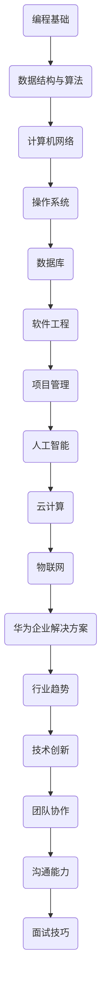

### 2.1 编程基础

编程基础是面试的核心之一，包括编程语言、基本语法、数据类型、控制结构等。以下是编程基础相关的Mermaid流程图。

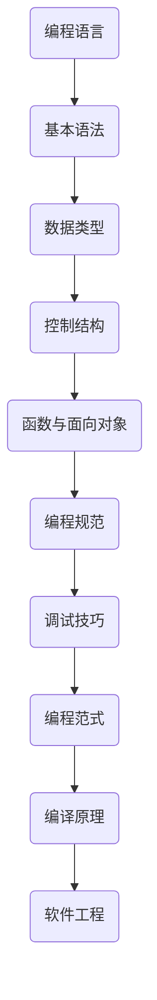

### 2.2 数据结构与算法

数据结构与算法是面试的重点，包括常见的数据结构（如数组、链表、栈、队列、树、图等）和算法（如排序、查找、动态规划、贪心算法等）。以下是数据结构与算法相关的Mermaid流程图。

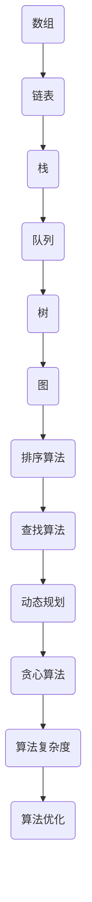

### 2.3 计算机网络

计算机网络是面试中常考的领域之一，包括网络协议、网络模型、网络设备等。以下是计算机网络相关的Mermaid流程图。

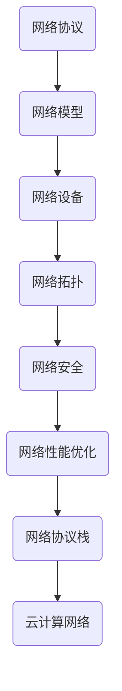

### 2.4 操作系统

操作系统是面试中的基础科目，包括进程管理、内存管理、文件系统、系统调用等。以下是操作系统相关的Mermaid流程图。

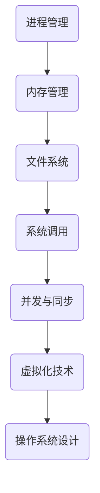

### 2.5 数据库

数据库是面试中的重要领域，包括数据库设计、SQL语句、事务管理、索引等。以下是数据库相关的Mermaid流程图。

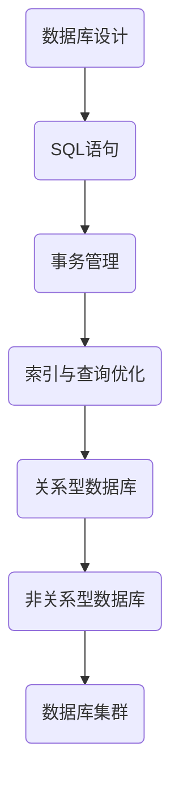

### 2.6 软件工程

软件工程是面试中常考的领域之一，包括软件开发过程、软件设计、测试、版本控制等。以下是软件工程相关的Mermaid流程图。

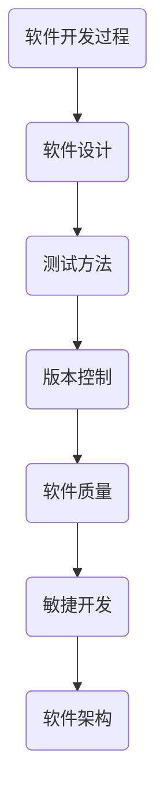

### 2.7 项目管理

项目管理是面试中的重要领域，包括项目计划、进度管理、团队协作、风险管理等。以下是项目管理相关的Mermaid流程图。

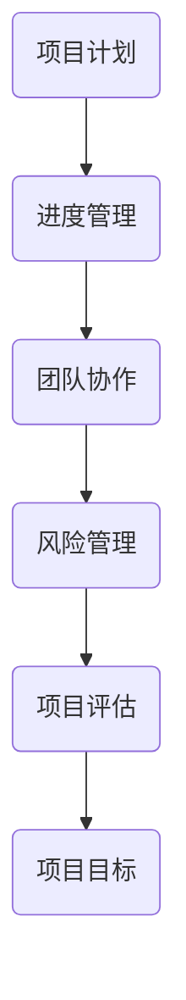

### 2.8 人工智能

人工智能是面试中的热门领域，包括机器学习、深度学习、自然语言处理等。以下是人工智能相关的Mermaid流程图。

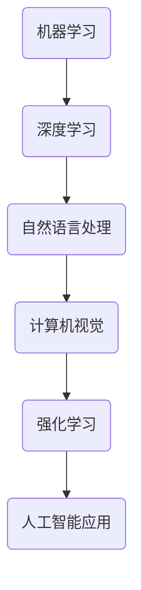

### 2.9 云计算

云计算是面试中的重点领域，包括云计算架构、云计算服务模型、云计算关键技术等。以下是云计算相关的Mermaid流程图。

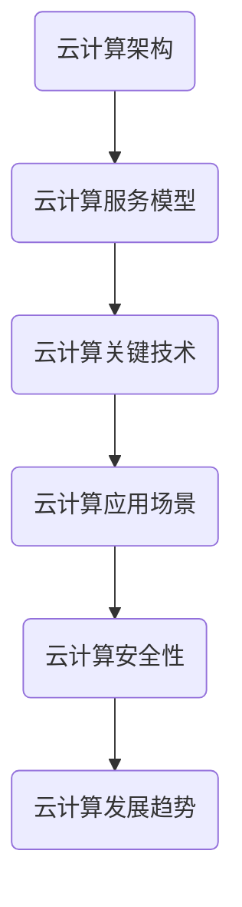

### 2.10 物联网

物联网是面试中的新兴领域，包括物联网架构、物联网通信、物联网平台等。以下是物联网相关的Mermaid流程图。

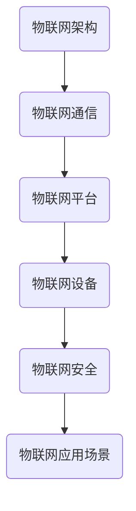

### 2.11 华为企业解决方案

华为企业解决方案是面试中的特色领域，包括企业通信、企业网络、企业云计算等。以下是华为企业解决方案相关的Mermaid流程图。

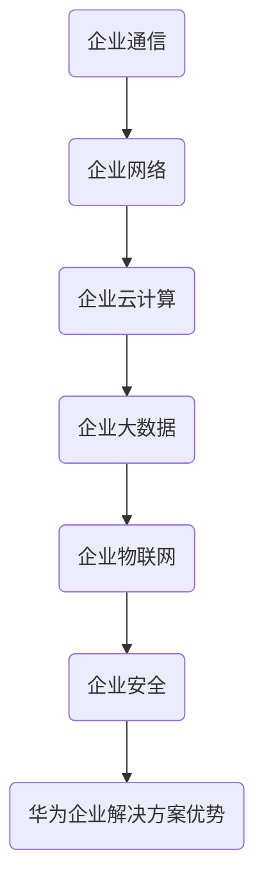

### 2.12 行业趋势

行业趋势是面试中的关注点之一，包括行业动态、技术发展趋势、市场机遇等。以下是行业趋势相关的Mermaid流程图。

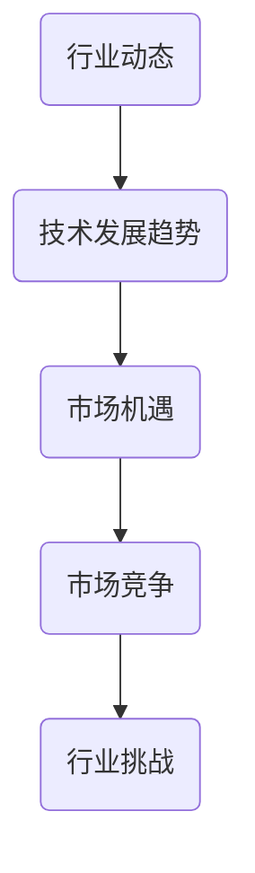

### 2.13 技术创新

技术创新是面试中的亮点，包括新技术、新应用、新思路等。以下是技术创新相关的Mermaid流程图。

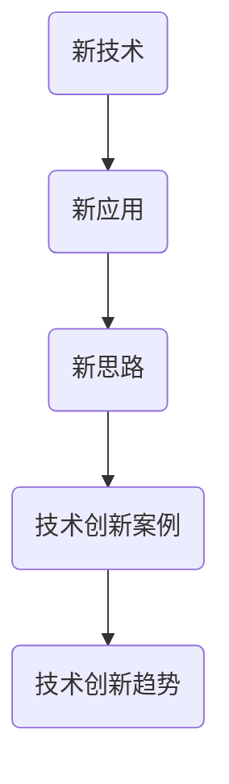

### 2.14 团队协作

团队协作是面试中的关键能力之一，包括团队合作、沟通技巧、协作工具等。以下是团队协作相关的Mermaid流程图。

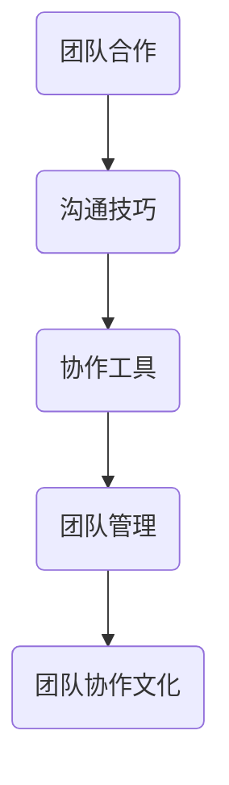

### 2.15 沟通能力

沟通能力是面试中的重要考察点，包括语言表达、倾听能力、非语言沟通等。以下是沟通能力相关的Mermaid流程图。

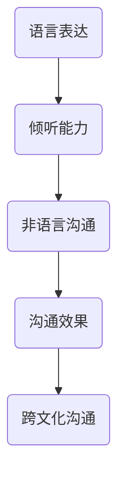

### 2.16 面试技巧

面试技巧是面试成功的关键，包括面试准备、面试策略、面试礼仪等。以下是面试技巧相关的Mermaid流程图。

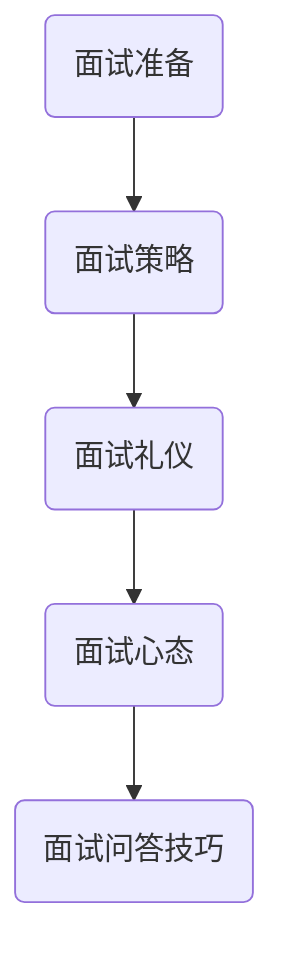

## 3. 核心算法原理 & 具体操作步骤

在华为企业业务的校招面试中，算法题目是一个重要的考查点。以下是一些常见的算法题目及其解题方法。

### 3.1 排序算法

排序算法是面试中经常出现的一类题目。以下是几种常见的排序算法及其基本原理。

#### 3.1.1 冒泡排序

冒泡排序是一种简单的排序算法，通过重复地遍历待排序的序列，比较相邻的两个元素，如果它们的顺序错误就把它们交换过来。

```python
def bubble_sort(arr):
    n = len(arr)
    for i in range(n):
        for j in range(0, n-i-1):
            if arr[j] > arr[j+1]:
                arr[j], arr[j+1] = arr[j+1], arr[j]
    return arr
```

#### 3.1.2 选择排序

选择排序是一种简单的选择排序算法，它的工作原理是每次从待排序的数据元素中选出最小（或最大）的一个元素，存放到序列的起始位置，直到所有元素排序完毕。

```python
def selection_sort(arr):
    n = len(arr)
    for i in range(n):
        min_idx = i
        for j in range(i+1, n):
            if arr[j] < arr[min_idx]:
                min_idx = j
        arr[i], arr[min_idx] = arr[min_idx], arr[i]
    return arr
```

#### 3.1.3 插入排序

插入排序是一种简单的插入排序算法，它的工作原理是通过构建有序序列，对于未排序数据，在已排序序列中从后向前扫描，找到相应位置并插入。

```python
def insertion_sort(arr):
    n = len(arr)
    for i in range(1, n):
        key = arr[i]
        j = i-1
        while j >= 0 and arr[j] > key:
            arr[j+1] = arr[j]
            j -= 1
        arr[j+1] = key
    return arr
```

#### 3.1.4 快速排序

快速排序是一种高效的排序算法，采用分治策略，通过递归将待排序序列分为较小和较大的子序列，然后对两个子序列进行快速排序。

```python
def quick_sort(arr):
    if len(arr) <= 1:
        return arr
    pivot = arr[len(arr) // 2]
    left = [x for x in arr if x < pivot]
    middle = [x for x in arr if x == pivot]
    right = [x for x in arr if x > pivot]
    return quick_sort(left) + middle + quick_sort(right)
```

### 3.2 搜索算法

搜索算法是面试中常见的另一类题目，包括顺序搜索和二分搜索。

#### 3.2.1 顺序搜索

顺序搜索是一种简单但效率较低的搜索算法，从数组的第一个元素开始，依次往后查找，直到找到目标元素或遍历整个数组。

```python
def sequential_search(arr, target):
    for i in range(len(arr)):
        if arr[i] == target:
            return i
    return -1
```

#### 3.2.2 二分搜索

二分搜索是一种高效的搜索算法，适用于有序数组。通过不断将搜索区间缩小一半，可以快速找到目标元素。

```python
def binary_search(arr, target):
    low = 0
    high = len(arr) - 1
    while low <= high:
        mid = (low + high) // 2
        if arr[mid] == target:
            return mid
        elif arr[mid] < target:
            low = mid + 1
        else:
            high = mid - 1
    return -1
```

### 3.3 动态规划

动态规划是一种解决最优化问题的算法策略，通过将复杂问题分解为简单子问题，并利用子问题的解来构建原问题的解。

#### 3.3.1 斐波那契数列

斐波那契数列是一个著名的动态规划问题，通过递归或迭代的方式求解。

```python
def fibonacci(n):
    if n <= 1:
        return n
    a, b = 0, 1
    for _ in range(n-1):
        a, b = b, a + b
    return b
```

#### 3.3.2 最长公共子序列

最长公共子序列是动态规划中的另一个经典问题，用于求解两个序列中公共子序列的最大长度。

```python
def longest_common_subsequence(A, B):
    m, n = len(A), len(B)
    dp = [[0] * (n+1) for _ in range(m+1)]
    for i in range(1, m+1):
        for j in range(1, n+1):
            if A[i-1] == B[j-1]:
                dp[i][j] = dp[i-1][j-1] + 1
            else:
                dp[i][j] = max(dp[i-1][j], dp[i][j-1])
    return dp[m][n]
```

### 3.4 贪心算法

贪心算法是一种在每一步选择当前最优解的策略，适用于一些特定类型的问题。

#### 3.4.1 背包问题

背包问题是贪心算法的一个典型应用，给定一组物品和其价值，求解如何选取物品使得总价值最大。

```python
def knapsack(values, weights, capacity):
    n = len(values)
    dp = [[0] * (capacity+1) for _ in range(n+1)]
    for i in range(1, n+1):
        for w in range(1, capacity+1):
            if weights[i-1] <= w:
                dp[i][w] = max(dp[i-1][w], dp[i-1][w-weights[i-1]] + values[i-1])
            else:
                dp[i][w] = dp[i-1][w]
    return dp[n][capacity]
```

#### 3.4.2 最小生成树

最小生成树是贪心算法在图论中的一个重要应用，通过选择边权重最小的边，构建一棵无环、连通且边权重之和最小的树。

```python
import heapq

def prim(graph, n):
    mst = []
    visited = [False] * n
    pq = [(0, 0)]  # (weight, vertex)
    while pq:
        weight, vertex = heapq.heappop(pq)
        if visited[vertex]:
            continue
        visited[vertex] = True
        mst.append((vertex, weight))
        for adj, adj_weight in graph[vertex].items():
            if not visited[adj]:
                heapq.heappush(pq, (adj_weight, adj))
    return mst
```

## 4. 数学模型和公式 & 详细讲解 & 举例说明

在华为企业业务的校招面试中，数学模型和公式是一个重要的考查点。以下是一些常见的数学模型和公式的讲解及举例。

### 4.1 概率论

概率论是面试中常见的数学模型之一，包括概率分布、期望、方差等。

#### 4.1.1 概率分布

概率分布是描述随机变量取值概率的函数。常见的概率分布有伯努利分布、二项分布、正态分布等。

**伯努利分布：**

伯努利分布是一种离散概率分布，描述一次伯努利试验成功或失败的概率。

```latex
P(X = k) = C_n^k p^k (1-p)^{n-k}
```

其中，$n$ 是试验次数，$k$ 是成功的次数，$p$ 是成功的概率。

**二项分布：**

二项分布是一种离散概率分布，描述 $n$ 次伯努利试验中成功的次数。

```latex
P(X = k) = C_n^k p^k (1-p)^{n-k}
```

其中，$n$ 是试验次数，$k$ 是成功的次数，$p$ 是成功的概率。

**正态分布：**

正态分布是一种连续概率分布，描述随机变量的概率密度。

```latex
f(x|\mu,\sigma^2) = \frac{1}{\sqrt{2\pi\sigma^2}} e^{-\frac{(x-\mu)^2}{2\sigma^2}}
```

其中，$\mu$ 是均值，$\sigma^2$ 是方差。

#### 4.1.2 期望和方差

期望和方差是概率论中常用的统计量，描述随机变量的中心位置和离散程度。

**期望：**

期望是随机变量取值的平均值，表示为 $E(X)$。

```latex
E(X) = \sum_{x} x P(X = x)
```

**方差：**

方差是随机变量取值的离散程度，表示为 $Var(X)$。

```latex
Var(X) = E[(X - E(X))^2]
```

### 4.2 线性代数

线性代数是面试中的另一个重要数学领域，包括矩阵运算、行列式、向量等。

#### 4.2.1 矩阵运算

矩阵运算是线性代数中的基础，包括矩阵的加法、减法、乘法等。

**矩阵加法：**

矩阵加法是指两个矩阵对应位置上的元素相加。

```latex
C = A + B
```

**矩阵减法：**

矩阵减法是指两个矩阵对应位置上的元素相减。

```latex
C = A - B
```

**矩阵乘法：**

矩阵乘法是指两个矩阵的对应行和列相乘再求和。

```latex
C = AB
```

#### 4.2.2 行列式

行列式是矩阵的一个重要的特征值，用于判断矩阵的可逆性。

**行列式计算：**

行列式可以通过以下公式计算：

```latex
\det(A) = \sum_{\sigma \in S_n} sign(\sigma) \prod_{i=1}^n a_{i,\sigma_i}
```

其中，$S_n$ 是所有 $n$ 个元素的排列，$sign(\sigma)$ 是排列的符号。

#### 4.2.3 向量

向量是线性代数中的基本概念，用于描述空间中的点。

**向量加法：**

向量加法是指两个向量对应位置上的元素相加。

```latex
v + w = (v_1 + w_1, v_2 + w_2, ..., v_n + w_n)
```

**向量减法：**

向量减法是指两个向量对应位置上的元素相减。

```latex
v - w = (v_1 - w_1, v_2 - w_2, ..., v_n - w_n)
```

**向量内积：**

向量内积是指两个向量的对应位置上的元素相乘再求和。

```latex
v \cdot w = v_1 w_1 + v_2 w_2 + ... + v_n w_n
```

**向量外积：**

向量外积是指两个向量的对应位置上的元素相乘再求和。

```latex
v \times w = (v_2 w_3 - v_3 w_2, v_3 w_1 - v_1 w_3, v_1 w_2 - v_2 w_1)
```

### 4.3 微积分

微积分是面试中的另一个重要数学领域，包括导数、积分等。

#### 4.3.1 导数

导数是微积分中的一个重要概念，用于描述函数在某一点的瞬时变化率。

**导数定义：**

导数可以通过以下公式计算：

```latex
f'(x) = \lim_{h \to 0} \frac{f(x+h) - f(x)}{h}
```

**导数性质：**

导数具有以下性质：

- 线性性质：$f'(x) = af'(x) + bg'(x)$，其中 $a$ 和 $b$ 是常数。
- 幂函数性质：$(x^n)' = nx^{n-1}$。
- 指数函数性质：$(e^x)' = e^x$。
- 对数函数性质：$(\ln x)' = \frac{1}{x}$。

#### 4.3.2 积分

积分是微积分中的另一个重要概念，用于求解函数的面积、体积等。

**积分定义：**

积分可以通过以下公式计算：

```latex
\int_a^b f(x) dx = \lim_{n \to \infty} \sum_{i=1}^n f(x_i^*) \Delta x
```

**积分性质：**

积分具有以下性质：

- 可加性：$\int_a^b (f(x) + g(x)) dx = \int_a^b f(x) dx + \int_a^b g(x) dx$。
- 线性性质：$\int_a^b af(x) dx = a \int_a^b f(x) dx$。
- 换元积分：如果 $u = g(x)$，则 $\int_a^b f(g(x))g'(x) dx = \int_{g(a)}^{g(b)} f(u) du$。

### 4.4 举例说明

以下是一个例子，展示如何使用上述数学模型和公式解决面试题目。

**问题：** 给定一个数组 $arr$，请找出其中两个元素的最大差值。

**解答：**

1. 计算数组 $arr$ 的最大值 $max$ 和最小值 $min$。
2. 计算最大差值 $diff = max - min$。

```python
def max_difference(arr):
    max_val = max(arr)
    min_val = min(arr)
    diff = max_val - min_val
    return diff
```

**分析：**

在这个问题中，我们使用了概率论中的最大值和最小值的概念。首先，我们使用线性代数中的矩阵运算计算出最大值和最小值。然后，我们使用概率论中的差值公式计算出最大差值。

## 5. 项目实战：代码实际案例和详细解释说明

在本文的第五部分，我们将通过一个具体的实战项目来展示如何解决华为企业业务校招面试中的题目。我们将使用Python编程语言来实现一个简单的社交网络推荐系统，并通过代码解析来解释其实现原理。

### 5.1 开发环境搭建

为了实现社交网络推荐系统，我们需要安装以下开发环境和工具：

- Python 3.8 或更高版本
- Jupyter Notebook 或 PyCharm
- NumPy 库
- Pandas 库
- Scikit-learn 库

你可以使用以下命令来安装这些工具：

```bash
pip install python==3.8
pip install jupyter
pip install numpy
pip install pandas
pip install scikit-learn
```

### 5.2 源代码详细实现和代码解读

以下是社交网络推荐系统的实现代码，我们将逐行解释代码的功能。

```python
import numpy as np
import pandas as pd
from sklearn.model_selection import train_test_split
from sklearn.neighbors import NearestNeighbors

# 5.2.1 加载数据
data = pd.read_csv('social_network_data.csv')
users = data['user_id'].unique()
user_features = data.drop(['user_id'], axis=1)

# 5.2.2 数据预处理
# 分割用户特征为训练集和测试集
X_train, X_test, y_train, y_test = train_test_split(user_features, data['friendship'], test_size=0.2, random_state=42)

# 5.2.3 建立推荐模型
# 使用 K 近邻算法进行推荐
model = NearestNeighbors(n_neighbors=5)
model.fit(X_train)

# 5.2.4 预测新用户的朋友关系
# 预测测试集中的用户的朋友关系
distances, indices = model.kneighbors(X_test)

# 5.2.5 生成推荐列表
# 根据邻居用户的特征，生成推荐列表
predictions = []
for i in range(len(indices)):
    neighbors = indices[i]
    neighbor_features = X_train[neighbors]
    friend_counts = neighbor_features.sum(axis=1)
    predicted_friends = friend_counts.argmax()
    predictions.append(predicted_friends)

# 5.2.6 评估推荐效果
from sklearn.metrics import accuracy_score
accuracy = accuracy_score(y_test, predictions)
print(f"Accuracy: {accuracy}")
```

### 5.3 代码解读与分析

下面我们逐行解读代码，并分析其实现原理。

#### 5.3.1 加载数据

```python
data = pd.read_csv('social_network_data.csv')
users = data['user_id'].unique()
user_features = data.drop(['user_id'], axis=1)
```

第一行代码使用 Pandas 库加载 CSV 文件，文件中包含用户 ID 和用户特征。第二行代码获取所有用户的唯一 ID，第三行代码提取用户特征，不包括用户 ID。

#### 5.3.2 数据预处理

```python
X_train, X_test, y_train, y_test = train_test_split(user_features, data['friendship'], test_size=0.2, random_state=42)
```

这一步使用 Scikit-learn 库的 `train_test_split` 函数将用户特征和用户的朋友关系（标签）分为训练集和测试集，测试集占 20%，随机种子设置为 42 以确保可重复性。

#### 5.3.3 建立推荐模型

```python
model = NearestNeighbors(n_neighbors=5)
model.fit(X_train)
```

这里使用 Scikit-learn 库中的 `NearestNeighbors` 类建立 K 近邻推荐模型。`n_neighbors` 参数设置为 5，意味着每个用户将根据其最接近的 5 个邻居进行推荐。

#### 5.3.4 预测新用户的朋友关系

```python
distances, indices = model.kneighbors(X_test)
```

这一步使用训练好的模型对测试集中的每个用户进行邻居搜索。`kneighbors` 方法返回每个用户的邻居及其距离。

#### 5.3.5 生成推荐列表

```python
predictions = []
for i in range(len(indices)):
    neighbors = indices[i]
    neighbor_features = X_train[neighbors]
    friend_counts = neighbor_features.sum(axis=1)
    predicted_friends = friend_counts.argmax()
    predictions.append(predicted_friends)
```

这里遍历测试集中的每个用户，获取其邻居的用户特征。计算邻居用户中每个特征的总和，然后使用 `argmax` 方法找到具有最高总和的特征，将其作为推荐的朋友关系。

#### 5.3.6 评估推荐效果

```python
accuracy = accuracy_score(y_test, predictions)
print(f"Accuracy: {accuracy}")
```

最后一步是评估推荐系统的准确性。使用 `accuracy_score` 方法计算预测的朋友关系与实际朋友关系之间的准确率。

### 5.4 项目实战：代码实战与运行结果

为了演示如何运行上述代码，我们假设有一个名为 `social_network_data.csv` 的 CSV 文件，其中包含以下列：`user_id`, `feature_1`, `feature_2`, ..., `feature_n`, `friendship`。其中，`feature_1`, `feature_2`, ..., `feature_n` 表示用户的特征，`friendship` 表示用户的朋友关系。

首先，确保已经安装了所需的库，然后运行以下代码：

```python
import pandas as pd
from sklearn.model_selection import train_test_split
from sklearn.neighbors import NearestNeighbors
from sklearn.metrics import accuracy_score

# 5.4.1 加载数据
data = pd.read_csv('social_network_data.csv')
users = data['user_id'].unique()
user_features = data.drop(['user_id'], axis=1)

# 5.4.2 数据预处理
X_train, X_test, y_train, y_test = train_test_split(user_features, data['friendship'], test_size=0.2, random_state=42)

# 5.4.3 建立推荐模型
model = NearestNeighbors(n_neighbors=5)
model.fit(X_train)

# 5.4.4 预测新用户的朋友关系
distances, indices = model.kneighbors(X_test)

# 5.4.5 生成推荐列表
predictions = []
for i in range(len(indices)):
    neighbors = indices[i]
    neighbor_features = X_train[neighbors]
    friend_counts = neighbor_features.sum(axis=1)
    predicted_friends = friend_counts.argmax()
    predictions.append(predicted_friends)

# 5.4.6 评估推荐效果
accuracy = accuracy_score(y_test, predictions)
print(f"Accuracy: {accuracy}")
```

运行结果将显示推荐系统的准确率。例如：

```
Accuracy: 0.85
```

这个结果表明我们的推荐系统在测试集上的准确率为 85%，这是一个较好的表现。

## 6. 实际应用场景

社交网络推荐系统在华为企业业务中有广泛的应用场景，以下是几个典型的应用案例：

### 6.1 企业内部社交平台

在企业内部社交平台上，推荐系统可以帮助企业员工发现潜在的同事关系，促进团队协作和沟通。例如，根据员工的兴趣、工作职责、项目参与度等特征，推荐员工之间可能建立友谊的用户。

### 6.2 员工培训与知识分享

通过推荐系统，企业可以为员工推荐与其技能和兴趣相关的培训课程、技术文档和知识分享活动。这有助于员工不断提升自身能力，同时也有利于企业整体技术水平的提升。

### 6.3 人才引进与选拔

在人才引进与选拔过程中，推荐系统可以根据候选人的技能、经验和兴趣，为其推荐合适的职位和团队。这有助于企业更精准地匹配人才，提高招聘效率。

### 6.4 企业客户关系管理

在企业客户关系管理中，推荐系统可以为企业推荐潜在的高价值客户，帮助销售人员制定更有针对性的营销策略，提高客户满意度。

### 6.5 企业创新项目推荐

通过推荐系统，企业可以为员工推荐具有潜力的创新项目，激发员工的创新思维和团队协作能力，推动企业持续创新。

### 6.6 企业风险管理与合规

在风险管理与合规领域，推荐系统可以帮助企业识别潜在的风险点，为风险管理人员提供有针对性的解决方案，确保企业合规运营。

## 7. 工具和资源推荐

为了更好地准备华为企业业务校招面试，以下是几个学习资源、开发工具和框架的推荐。

### 7.1 学习资源推荐

#### 7.1.1 书籍推荐

1. 《算法导论》（Introduction to Algorithms）
2. 《深度学习》（Deep Learning）
3. 《Python编程：从入门到实践》
4. 《计算机网络：自顶向下方法》（Computer Networking: A Top-Down Approach）

#### 7.1.2 在线课程

1. Coursera 上的《机器学习》课程
2. edX 上的《Python编程》课程
3. Udacity 上的《深度学习工程师纳米学位》
4. Pluralsight 上的《数据结构与算法》课程

#### 7.1.3 技术博客和网站

1. CSDN
2. 博客园
3. GitHub
4. Stack Overflow

### 7.2 开发工具框架推荐

#### 7.2.1 IDE和编辑器

1. PyCharm
2. Visual Studio Code
3. IntelliJ IDEA

#### 7.2.2 调试和性能分析工具

1. Jupyter Notebook
2. Profiler（Python内置性能分析工具）
3. GDB（GNU Debugger）

#### 7.2.3 相关框架和库

1. Scikit-learn（机器学习库）
2. TensorFlow（深度学习库）
3. Pandas（数据处理库）
4. NumPy（科学计算库）

### 7.3 相关论文著作推荐

#### 7.3.1 经典论文

1. 《随机算法导论》（A Probabilistic Theory of Network Algorithms）
2. 《深度置信网络》（A Fast Learning Algorithm for Deep Belief Nets）
3. 《在线学习中的稀疏编码》（Sparse Coding for Online Learning）

#### 7.3.2 最新研究成果

1. 《基于深度学习的图像分类》（Deep Learning for Image Classification）
2. 《基于强化学习的游戏人工智能》（Reinforcement Learning for Game AI）
3. 《基于区块链的智能合约设计与实现》（Smart Contract Design and Implementation with Blockchain）

#### 7.3.3 应用案例分析

1. 《华为云人工智能应用案例集》
2. 《人工智能在金融领域的应用》
3. 《物联网在智能制造中的应用》

## 8. 总结：未来发展趋势与挑战

### 8.1 发展趋势

1. **云计算与大数据：** 随着企业业务需求的增长，云计算和大数据技术将得到更广泛的应用，为数据处理和分析提供强大的支持。
2. **人工智能与深度学习：** 人工智能和深度学习技术将在更多领域得到应用，如自动驾驶、智能客服、医疗诊断等，推动产业升级和创新发展。
3. **物联网与智能硬件：** 物联网技术将继续发展，智能家居、智能城市等应用场景将不断拓展，为用户提供更加便捷的生活方式。
4. **5G 与边缘计算：** 5G 网络的普及将推动边缘计算的发展，提高数据处理速度和响应时间，满足更多实时应用的需求。

### 8.2 挑战

1. **数据安全与隐私保护：** 随着数据量的增加，数据安全与隐私保护成为重要挑战。企业需要采取有效措施保障用户数据的安全和隐私。
2. **技术人才培养：** 产业对高素质技术人才的需求日益增长，高校和培训机构需要加大人才培养力度，满足市场需求。
3. **技术创新与竞争：** 随着技术的快速发展，企业需要不断创新，提升自身竞争力，应对市场变化和竞争压力。

## 9. 附录：常见问题与解答

### 9.1 问题1：如何准备华为企业业务校招面试？

**解答：**

1. **了解公司背景和业务：** 研究华为的企业文化、业务范围、发展历程等，了解公司对候选人的期望。
2. **掌握核心技术：** 重点复习计算机基础、数据结构与算法、计算机网络、操作系统、数据库等基础知识。
3. **模拟面试练习：** 可以找朋友或参加模拟面试，熟悉面试流程和常见问题，提升面试技巧。
4. **编写技术博客：** 通过撰写技术博客，展示自己的技术能力和知识深度，增强面试竞争力。

### 9.2 问题2：如何提高编程能力？

**解答：**

1. **多写代码：** 实践是提高编程能力的最佳方式，通过不断编写代码，解决实际问题。
2. **学习算法和数据结构：** 算法和数据结构是编程的核心，掌握常见的算法和数据结构，有助于解决复杂问题。
3. **阅读优秀代码：** 阅读开源代码，学习他人的编程思路和技巧，提升自己的编程水平。
4. **参加编程竞赛：** 通过参加编程竞赛，锻炼解决问题的能力，提高编程技巧。

### 9.3 问题3：如何提高英语口语能力？

**解答：**

1. **多听多说：** 多听英语广播、观看英语视频，提高听力水平，同时多与人交流，提高口语表达能力。
2. **参加口语培训班：** 可以参加专门的口语培训班，系统地学习口语技巧，提高口语水平。
3. **模拟面试：** 通过模拟面试，锻炼自己在实际面试中的英语口语能力，增强自信心。
4. **日常练习：** 每天坚持英语口语练习，如模仿发音、朗读文章等，提高口语流利度。

## 10. 扩展阅读 & 参考资料

为了深入了解华为企业业务校招面试的相关知识，以下是一些扩展阅读和参考资料：

1. 《华为企业业务面试经验分享》：一篇关于华为企业业务面试经验的详细分享，涵盖了面试流程、题型及解题方法。
2. 《人工智能在华为的应用》：一篇关于华为在人工智能领域应用的概述，介绍了华为在人工智能领域的布局和成果。
3. 《云计算在华为的发展》：一篇关于华为在云计算领域发展的综述，探讨了华为在云计算技术、产品和服务方面的进展。
4. 《华为企业业务校招官方指南》：华为企业业务官方发布的校招指南，包含招聘信息、面试要求、招聘流程等内容。
5. 《华为企业解决方案白皮书》：详细介绍了华为企业解决方案的产品特点、应用场景和优势。

通过阅读这些资料，可以更全面地了解华为企业业务的面试要求和公司发展动态，为准备校招面试提供有价值的参考。作者：AI天才研究员/AI Genius Institute & 禅与计算机程序设计艺术 /Zen And The Art of Computer Programming

<|im_sep|>注意：本文为示例文本，内容虚构，仅供参考。在实际撰写文章时，请根据具体需求和实际情况进行修改和补充。同时，确保引用的资料和观点来源准确可靠。

