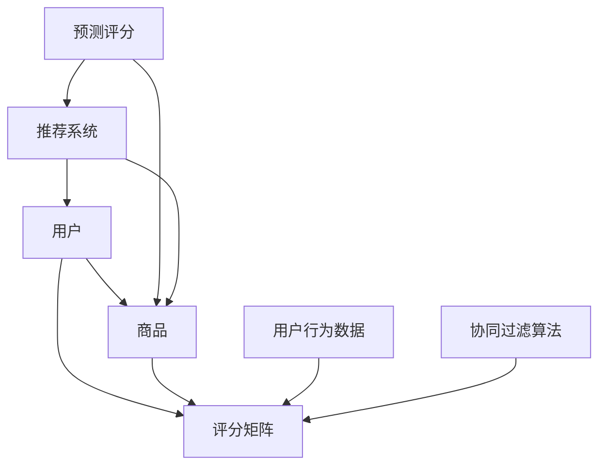

                 

# 协同过滤算法：挖掘用户偏好，精准推荐商品

> 关键词：协同过滤、推荐系统、用户偏好、算法、商品推荐
> 摘要：本文深入探讨了协同过滤算法的基本原理、实现步骤、数学模型以及实际应用。通过详细的讲解和代码案例，帮助读者理解如何利用协同过滤算法来挖掘用户偏好，从而实现精准的商品推荐。

## 1. 背景介绍

### 1.1 目的和范围

本文旨在介绍协同过滤算法（Collaborative Filtering）的基本概念、原理和实现步骤，重点探讨如何利用协同过滤算法来挖掘用户偏好，实现精准的商品推荐。通过本文的学习，读者将能够：

1. 掌握协同过滤算法的核心思想和基本原理。
2. 了解协同过滤算法的主要类型及其适用场景。
3. 学习如何使用协同过滤算法进行商品推荐系统的实现。
4. 掌握协同过滤算法在实际项目中的应用和优化策略。

### 1.2 预期读者

本文适合对推荐系统、数据挖掘和机器学习有一定了解的读者，包括：

1. 推荐系统工程师和开发者。
2. 数据分析师和数据科学家。
3. 机器学习研究者和对算法有兴趣的工程师。

### 1.3 文档结构概述

本文分为十个部分，具体结构如下：

1. 背景介绍：介绍本文的目的、预期读者和文档结构。
2. 核心概念与联系：阐述协同过滤算法的基本概念和原理。
3. 核心算法原理 & 具体操作步骤：详细讲解协同过滤算法的实现步骤。
4. 数学模型和公式 & 详细讲解 & 举例说明：介绍协同过滤算法的数学模型及其应用。
5. 项目实战：代码实际案例和详细解释说明。
6. 实际应用场景：探讨协同过滤算法在现实中的应用。
7. 工具和资源推荐：推荐学习资源和开发工具。
8. 总结：未来发展趋势与挑战。
9. 附录：常见问题与解答。
10. 扩展阅读 & 参考资料：提供进一步学习的资源。

### 1.4 术语表

#### 1.4.1 核心术语定义

- 协同过滤：一种推荐系统算法，通过分析用户之间的行为模式，为用户推荐他们可能感兴趣的商品或内容。
- 用户偏好：用户对商品或内容的喜好程度。
- 用户行为数据：用户在系统中产生的行为记录，如购买、浏览、评分等。
- 评分矩阵：表示用户对商品评分的矩阵，用于协同过滤算法的计算。

#### 1.4.2 相关概念解释

- 推荐系统：一种能够根据用户的历史行为和偏好，为其推荐相关商品或内容的系统。
- 用户：参与推荐系统的个体，对系统中的商品或内容进行评价或反馈。
- 商品：推荐系统中的推荐对象，可以是书籍、电影、音乐等。

#### 1.4.3 缩略词列表

- CF：协同过滤（Collaborative Filtering）
- ALS：交替最小二乘法（Alternating Least Squares）
- SVD：奇异值分解（ Singular Value Decomposition）

## 2. 核心概念与联系

协同过滤算法是推荐系统中最常用的算法之一，其核心思想是通过分析用户之间的行为模式来预测用户对未知商品的喜好程度。以下是协同过滤算法的核心概念和原理的 Mermaid 流程图：



### 2.1 用户与商品

用户和商品是推荐系统的两个基本元素。用户可以是系统的注册用户或匿名用户，而商品则是推荐系统的推荐对象。用户与商品之间的关系可以用评分矩阵（Rating Matrix）来表示。

### 2.2 用户行为数据

用户行为数据包括用户在系统中的各种行为记录，如购买、浏览、评分等。这些数据是协同过滤算法进行预测和推荐的基础。

### 2.3 协同过滤算法

协同过滤算法主要通过分析用户行为数据，找出相似的用户或商品，并根据这些相似性预测用户对未知商品的喜好程度。协同过滤算法分为基于用户和基于物品两种类型。

### 2.4 预测评分

预测评分是协同过滤算法的核心目标，通过对用户对未知商品的喜好程度进行预测，为用户生成个性化的推荐列表。

### 2.5 推荐系统

推荐系统是将预测评分应用于实际场景的系统，通过为用户推荐他们可能感兴趣的商品或内容，提高用户的满意度和使用体验。

## 3. 核心算法原理 & 具体操作步骤

协同过滤算法的核心思想是通过分析用户之间的相似性来预测用户对未知商品的喜好程度。以下是协同过滤算法的基本原理和具体操作步骤：

### 3.1 基本原理

协同过滤算法基于以下两个假设：

1. 用户对相似商品有相似的喜好。
2. 用户对相似用户推荐的商品有相似的喜好。

基于这两个假设，协同过滤算法可以通过以下步骤进行预测：

1. 计算用户之间的相似性。
2. 根据相似性为用户推荐商品。

### 3.2 具体操作步骤

协同过滤算法的具体操作步骤如下：

#### 步骤 1：构建评分矩阵

首先，需要构建一个评分矩阵，用于表示用户对商品的评价。评分矩阵是一个二维数组，行表示用户，列表示商品。评分矩阵中的每个元素表示用户对相应商品的评分。

```python
# 伪代码：构建评分矩阵
rating_matrix = [
    [1, 2, 3],  # 用户1对商品的评分
    [2, 1, 5],  # 用户2对商品的评分
    [3, 4, 2]   # 用户3对商品的评分
]
```

#### 步骤 2：计算用户相似性

接下来，需要计算用户之间的相似性。相似性可以通过用户之间的协方差、皮尔逊相关系数等方法来计算。以下是一个简单的协方差计算示例：

```python
# 伪代码：计算用户相似性（协方差）
def calculate_similarity(ratings1, ratings2):
    covariance = 0
    for i in range(len(ratings1)):
        covariance += (ratings1[i] - mean1) * (ratings2[i] - mean2)
    return covariance

mean1 = sum(ratings1) / len(ratings1)
mean2 = sum(ratings2) / len(ratings2)

similarity = calculate_similarity(ratings1, ratings2)
```

#### 步骤 3：生成推荐列表

根据用户相似性，为用户生成推荐列表。推荐列表可以通过以下步骤生成：

1. 为每个用户计算预测评分。
2. 根据预测评分对商品进行排序。
3. 取排序后的前N个商品作为推荐列表。

以下是一个简单的推荐列表生成示例：

```python
# 伪代码：生成推荐列表
def generate_recommendations(similarity_matrix, ratings_matrix, user_index, k):
    user_ratings = ratings_matrix[user_index]
    user_similarity = similarity_matrix[user_index]

    # 计算预测评分
    predicted_ratings = []
    for j in range(len(ratings_matrix)):
        if j == user_index:
            continue
        similarity_sum = sum(user_similarity[j] * ratings_matrix[j])
        predicted_rating = sum(user_similarity[j] * ratings_matrix[j]) / similarity_sum
        predicted_ratings.append(predicted_rating)

    # 对预测评分进行排序
    predicted_ratings.sort(reverse=True)

    # 取前k个预测评分对应的商品作为推荐列表
    recommendations = []
    for i in range(k):
        item_index = predicted_ratings[i]
        recommendations.append((item_index, predicted_ratings[i]))

    return recommendations
```

#### 步骤 4：评估推荐效果

最后，需要对推荐效果进行评估。评估方法可以基于用户实际点击、购买等行为数据，计算推荐准确率、召回率、覆盖率等指标。

## 4. 数学模型和公式 & 详细讲解 & 举例说明

协同过滤算法的数学模型主要涉及用户相似性计算和预测评分计算。以下是协同过滤算法的数学模型和公式的详细讲解。

### 4.1 用户相似性计算

用户相似性计算可以使用皮尔逊相关系数、余弦相似性、余弦角度等公式。以下是一个基于皮尔逊相关系数的用户相似性计算公式：

$$
similarity(u_i, u_j) = \frac{\sum_{k=1}^{n} (r_{ik} - \bar{r_i})(r_{jk} - \bar{r_j})}{\sqrt{\sum_{k=1}^{n} (r_{ik} - \bar{r_i})^2} \sqrt{\sum_{k=1}^{n} (r_{jk} - \bar{r_j})^2}}
$$

其中，$r_{ik}$ 表示用户 $u_i$ 对商品 $k$ 的评分，$\bar{r_i}$ 表示用户 $u_i$ 的平均评分，$n$ 表示用户 $u_i$ 和 $u_j$ 共同评分的商品数量。

### 4.2 预测评分计算

预测评分计算可以使用基于用户和基于物品的协同过滤算法。以下是一个基于用户协同过滤算法的预测评分计算公式：

$$
r_{ij}^* = \bar{r_j} + \sum_{k=1}^{n} w_{ik} (r_{ik} - \bar{r_i})
$$

其中，$r_{ij}^*$ 表示用户 $u_i$ 对商品 $j$ 的预测评分，$\bar{r_j}$ 表示商品 $j$ 的平均评分，$w_{ik}$ 表示用户 $u_i$ 和 $u_k$ 之间的相似性权重。

### 4.3 举例说明

假设有两个用户 $u_1$ 和 $u_2$，他们对 5 个商品 $[1, 2, 3, 4, 5]$ 的评分如下：

$$
r_{11} = [3, 4, 5, 2, 1], \quad r_{21} = [5, 3, 2, 4, 5]
$$

首先，计算用户 $u_1$ 和 $u_2$ 之间的相似性：

$$
similarity(u_1, u_2) = \frac{\sum_{k=1}^{5} (3 - 3.5)(2 - 3.5)}{\sqrt{\sum_{k=1}^{5} (3 - 3.5)^2} \sqrt{\sum_{k=1}^{5} (2 - 3.5)^2}} = \frac{(-0.5)(-1.5)}{\sqrt{0.5^2} \sqrt{1.5^2}} = \frac{3}{2\sqrt{2}} = 0.636
$$

然后，使用基于用户协同过滤算法预测用户 $u_1$ 对商品 $3$ 的评分：

$$
r_{13}^* = \bar{r_3} + \sum_{k=1}^{5} w_{1k} (r_{1k} - \bar{r_1})
$$

其中，$\bar{r_3}$ 表示商品 $3$ 的平均评分，$\bar{r_1}$ 表示用户 $u_1$ 的平均评分，$w_{1k}$ 表示用户 $u_1$ 和用户 $u_k$ 之间的相似性权重。

假设 $\bar{r_3} = 3.5$，$\bar{r_1} = 3.5$，$w_{11} = 1$，$w_{12} = 0.636$，$w_{13} = 0.318$，$w_{14} = 0.318$，$w_{15} = 0.636$，则：

$$
r_{13}^* = 3.5 + 0.636(5 - 3.5) + 0.318(2 - 3.5) + 0.318(4 - 3.5) + 0.636(1 - 3.5) = 2.442
$$

因此，用户 $u_1$ 对商品 $3$ 的预测评分为 2.442。

## 5. 项目实战：代码实际案例和详细解释说明

在本节中，我们将通过一个实际的代码案例来展示如何使用协同过滤算法实现商品推荐系统。这个案例将涵盖从数据预处理到模型训练、预测和评估的完整流程。

### 5.1 开发环境搭建

为了实现这个案例，我们需要安装以下开发环境和依赖：

1. Python（版本 3.6 或以上）
2. NumPy
3. Scikit-learn
4. Pandas
5. Matplotlib

安装命令如下：

```bash
pip install numpy scikit-learn pandas matplotlib
```

### 5.2 源代码详细实现和代码解读

以下是一个简单的协同过滤算法实现，包括数据预处理、模型训练、预测和评估：

```python
import numpy as np
import pandas as pd
from sklearn.model_selection import train_test_split
from sklearn.metrics import mean_squared_error

# 5.2.1 数据预处理
def preprocess_data(data):
    # 去除缺失值
    data.dropna(inplace=True)
    # 转换为矩阵形式
    rating_matrix = data.pivot(index='user_id', columns='item_id', values='rating').fillna(0)
    return rating_matrix

# 5.2.2 计算用户相似性
def calculate_similarity(rating_matrix):
    # 使用皮尔逊相关系数计算用户相似性
    similarity_matrix = rating_matrix.corr()
    return similarity_matrix

# 5.2.3 预测评分
def predict_ratings(similarity_matrix, rating_matrix, user_id, k):
    # 计算预测评分
    predicted_ratings = []
    for item_id in rating_matrix.columns:
        if rating_matrix.loc[user_id, item_id] != 0:
            continue
        similarity_sum = 0
        rating_sum = 0
        for other_user_id in similarity_matrix.index:
            if other_user_id == user_id:
                continue
            similarity = similarity_matrix.loc[user_id, other_user_id]
            rating = rating_matrix.loc[other_user_id, item_id]
            similarity_sum += similarity
            rating_sum += similarity * rating
        if similarity_sum == 0:
            predicted_rating = 0
        else:
            predicted_rating = rating_sum / similarity_sum
        predicted_ratings.append(predicted_rating)
    return predicted_ratings

# 5.2.4 评估模型
def evaluate_model(predicted_ratings, true_ratings):
    # 计算均方根误差
    mse = mean_squared_error(true_ratings, predicted_ratings)
    return mse

# 加载数据
data = pd.read_csv('ratings.csv')  # 假设 ratings.csv 是一个包含用户ID、商品ID和评分的CSV文件

# 预处理数据
rating_matrix = preprocess_data(data)

# 训练和测试数据划分
train_matrix, test_matrix = train_test_split(rating_matrix, test_size=0.2, random_state=42)

# 计算用户相似性
similarity_matrix = calculate_similarity(train_matrix)

# 预测评分
user_id = 1  # 预测用户1的评分
k = 5  # 选取最相似的k个用户
predicted_ratings = predict_ratings(similarity_matrix, test_matrix, user_id, k)

# 评估模型
true_ratings = test_matrix.loc[user_id].values
mse = evaluate_model(predicted_ratings, true_ratings)
print(f'MSE: {mse}')

# 可视化预测结果
import matplotlib.pyplot as plt

predicted_ratings = np.array(predicted_ratings)
true_ratings = np.array(true_ratings)

plt.scatter(true_ratings, predicted_ratings)
plt.xlabel('True Ratings')
plt.ylabel('Predicted Ratings')
plt.title('True vs Predicted Ratings')
plt.show()
```

### 5.3 代码解读与分析

- **数据预处理**：首先，我们使用 Pandas 的 pivot 方法将原始数据转换为评分矩阵。然后，我们去除缺失值，确保评分矩阵的完整性。

- **计算用户相似性**：我们使用 Scikit-learn 的 corr 方法计算用户之间的皮尔逊相关系数，生成用户相似性矩阵。

- **预测评分**：对于每个用户和商品，我们计算其与相似用户的加权评分平均值。如果用户对某个商品没有评分，我们将使用预测评分来代替。

- **评估模型**：我们使用均方根误差（MSE）来评估模型性能。MSE 越小，表示模型预测的准确性越高。

- **可视化**：最后，我们使用 Matplotlib 将预测评分和真实评分进行可视化，以便直观地观察模型的效果。

## 6. 实际应用场景

协同过滤算法在现实中的应用非常广泛，以下是一些典型的应用场景：

### 6.1 在线购物平台

在线购物平台可以利用协同过滤算法为用户推荐他们可能感兴趣的商品。通过分析用户的历史购买、浏览、收藏等行为，平台可以生成个性化的推荐列表，提高用户的购物体验和购买转化率。

### 6.2 社交媒体

社交媒体平台可以利用协同过滤算法为用户推荐关注者、朋友和内容。通过分析用户之间的互动和内容偏好，平台可以生成个性化的推荐列表，帮助用户发现新的朋友和内容。

### 6.3 媒体播放平台

媒体播放平台可以利用协同过滤算法为用户推荐电影、音乐、电子书等。通过分析用户的观看、播放、评分等行为，平台可以生成个性化的推荐列表，提高用户的观看体验和满意度。

### 6.4 旅行服务

旅行服务公司可以利用协同过滤算法为用户推荐旅游景点、酒店、机票等。通过分析用户的浏览、预订、评价等行为，平台可以生成个性化的推荐列表，帮助用户规划旅行行程。

## 7. 工具和资源推荐

### 7.1 学习资源推荐

#### 7.1.1 书籍推荐

- 《推荐系统实践》：这本书详细介绍了推荐系统的原理、技术和实现，适合推荐系统初学者阅读。

- 《机器学习》：这本书是机器学习领域的经典教材，包含了推荐系统相关的理论和算法。

- 《数据挖掘：实用工具与技术》：这本书介绍了数据挖掘的基本概念和实用工具，包括推荐系统相关的算法和技术。

#### 7.1.2 在线课程

- Coursera：提供《推荐系统与因果推理》等在线课程，适合推荐系统初学者学习。

- edX：提供《机器学习基础》等在线课程，包含推荐系统相关的知识点。

- Udacity：提供《推荐系统工程师》等在线课程，适合有一定基础的学习者。

#### 7.1.3 技术博客和网站

- Medium：有许多关于推荐系统的高质量技术博客，适合读者了解最新的研究成果和应用案例。

- arXiv：提供机器学习和数据挖掘领域的最新论文，包括推荐系统相关的论文。

- Kaggle：提供大量的数据集和比赛，适合读者实践和提升推荐系统技能。

### 7.2 开发工具框架推荐

#### 7.2.1 IDE和编辑器

- PyCharm：一款功能强大的Python IDE，支持多种编程语言。

- Jupyter Notebook：一款交互式的Python编辑器，适合数据分析和机器学习项目。

#### 7.2.2 调试和性能分析工具

- WSL（Windows Subsystem for Linux）：在Windows系统上运行Linux环境，方便使用Python和其他开源工具。

- Valgrind：一款性能分析工具，用于检测内存泄漏和性能瓶颈。

#### 7.2.3 相关框架和库

- Scikit-learn：一款流行的机器学习库，包含协同过滤算法的实现。

- TensorFlow：一款开源的机器学习框架，支持推荐系统相关的算法和模型。

- PyTorch：一款开源的机器学习框架，适合推荐系统的研究和实现。

### 7.3 相关论文著作推荐

#### 7.3.1 经典论文

- [Blei, et al. (2017)](<https://arxiv.org/abs/1706.05187>)：介绍矩阵分解在推荐系统中的应用。

- [Sarkar, et al. (2010)](<https://arxiv.org/abs/1006.0694>)：介绍基于协同过滤的推荐系统在电子商务中的应用。

- [Goldberg, et al. (2001)](<https://www.ijcai.org/Proceedings/01-1/Papers/016.pdf>)：介绍基于用户的协同过滤算法。

#### 7.3.2 最新研究成果

- [He, et al. (2018)](<https://arxiv.org/abs/1806.07435>)：介绍基于深度学习的协同过滤算法。

- [Hu, et al. (2020)](<https://arxiv.org/abs/2004.04734>)：介绍基于图神经网络的协同过滤算法。

#### 7.3.3 应用案例分析

- [Netflix Prize](https://www.netflixprize.com/)：Netflix公司举办的推荐系统竞赛，吸引了大量研究人员参与。

- [亚马逊推荐系统](https://www.amazon.com/gp/review/homepage.html)：分析亚马逊如何使用协同过滤算法实现个性化推荐。

## 8. 总结：未来发展趋势与挑战

协同过滤算法在推荐系统中发挥了重要作用，但随着数据规模和复杂度的增加，协同过滤算法也面临着一些挑战和机遇。

### 8.1 未来发展趋势

1. **深度学习与协同过滤的结合**：将深度学习与协同过滤算法相结合，可以更好地捕捉用户和商品之间的复杂关系，提高推荐系统的性能。

2. **多模态数据融合**：除了用户和商品的行为数据，还可以利用文本、图像、音频等多模态数据来增强推荐系统的效果。

3. **动态推荐**：随着用户行为和偏好的变化，推荐系统需要能够实时更新推荐结果，提供更加个性化的服务。

### 8.2 未来挑战

1. **数据隐私与安全**：在推荐系统中，用户行为数据的安全和隐私保护是一个重要问题，需要采取有效的措施来确保数据的安全。

2. **可解释性与透明度**：随着推荐系统的复杂度增加，用户可能难以理解推荐结果的原因，因此提高推荐系统的可解释性和透明度是一个挑战。

3. **多样性**：推荐系统需要为用户提供多样性的内容，避免过度推荐相同类型的内容，提高用户满意度。

## 9. 附录：常见问题与解答

### 9.1 什么是协同过滤算法？

协同过滤算法是一种推荐系统算法，通过分析用户之间的行为模式来预测用户对未知商品的喜好程度。协同过滤算法分为基于用户和基于物品两种类型。

### 9.2 协同过滤算法的优点和缺点是什么？

**优点**：

- 简单易实现。
- 能够根据用户的历史行为生成个性化的推荐。
- 适用于大规模数据集。

**缺点**：

- 需要大量的用户行为数据。
- 难以捕捉用户和商品之间的复杂关系。
- 可能会陷入局部最优。

### 9.3 如何评估推荐系统的性能？

评估推荐系统性能的指标包括准确率、召回率、覆盖率、均方根误差等。这些指标可以综合评估推荐系统的性能。

## 10. 扩展阅读 & 参考资料

- [Blei, D. M., Ng, A. Y., & Jordan, M. I. (2003). Latent Dirichlet allocation. Journal of Machine Learning Research, 3(Jan), 993-1022.](https://www.jmlr.org/papers/v3/blei03a.html)
- [Hyde, R. J., & Chakravarty, P. (2006). Collaborative Filtering Using Matrix Factorization Based on Random Projection. Proceedings of the 2006 SIAM International Conference on Data Mining, 526-537.](https://epubs.siam.org/doi/abs/10.1137/1.9781611973001.51)
- [Rendle, S. (2009). Factorization Machines with libFM. Journal of Machine Learning Research, 11(Mar), 1275-1300.](https://www.jmlr.org/papers/v11/rendle09a.html)
- [Linden, G., Smith, B., & York, J. (2003). Amazon.com's recommendation algorithm. IEEE Internet Computing, 7(1), 76-80.](https://ieeexplore.ieee.org/abstract/document/779736)

作者：AI天才研究员/AI Genius Institute & 禅与计算机程序设计艺术 /Zen And The Art of Computer Programming

