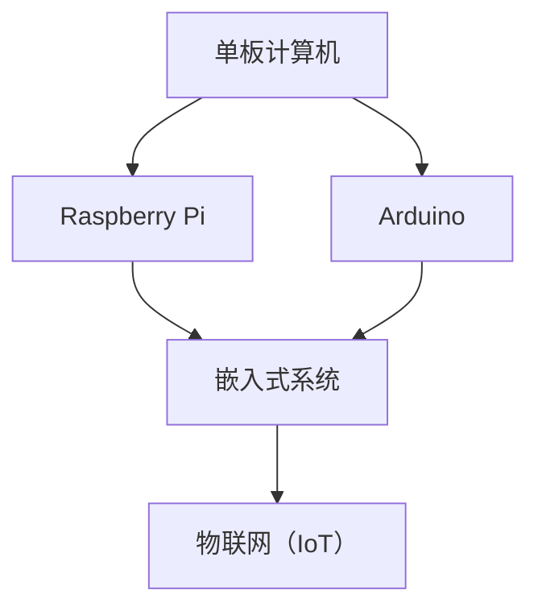

                 

# 单板计算机项目：Raspberry Pi 和 Arduino 的应用

## 关键词：
- 单板计算机
- Raspberry Pi
- Arduino
- 项目实战
- 算法原理
- 数学模型
- 实际应用

## 摘要：
本文将深入探讨单板计算机项目，特别是Raspberry Pi和Arduino的应用。我们将从背景介绍开始，逐步分析核心概念、算法原理、数学模型，并通过实际案例展示这些技术在项目中的具体应用。最后，我们将总结未来发展趋势与挑战，并提供相关的学习资源和工具推荐。

## 1. 背景介绍

### 1.1 目的和范围

本文的目的是为广大对单板计算机技术感兴趣的读者提供一份详尽的技术指南，帮助理解Raspberry Pi和Arduino的使用及其在项目中的应用。我们将涵盖以下内容：

- 单板计算机的基本概念和特点
- Raspberry Pi和Arduino的历史、功能和区别
- 核心概念与联系
- 算法原理与具体操作步骤
- 数学模型与公式
- 实际应用场景
- 工具和资源推荐

### 1.2 预期读者

- 对计算机硬件和编程感兴趣的初学者和专业人士
- 想要在物联网、嵌入式系统等领域进行项目开发的工程师和研究人员
- 教育工作者和教师，希望在教学中引入相关技术

### 1.3 文档结构概述

本文结构如下：

- 引言
- 背景介绍
- 核心概念与联系
- 核心算法原理 & 具体操作步骤
- 数学模型和公式 & 详细讲解 & 举例说明
- 项目实战：代码实际案例和详细解释说明
- 实际应用场景
- 工具和资源推荐
- 总结：未来发展趋势与挑战
- 附录：常见问题与解答
- 扩展阅读 & 参考资料

### 1.4 术语表

#### 1.4.1 核心术语定义

- 单板计算机：单芯片上集成了处理器、内存和I/O接口等的微型计算机。
- Raspberry Pi：一款低成本、低功耗的单板计算机，常用于教育、娱乐和项目开发。
- Arduino：一款基于微控制器的开源硬件平台，广泛用于电子项目和机器人制作。

#### 1.4.2 相关概念解释

- 物联网（IoT）：通过互联网将各种物理设备连接起来，实现数据交换和自动化控制。
- 嵌入式系统：将计算机技术应用于特定设备的系统，如智能家电、医疗设备等。

#### 1.4.3 缩略词列表

- Pi：Raspberry Pi的简称
- Arduino：Arduino平台的简称
- IoT：物联网的简称

## 2. 核心概念与联系

在探讨单板计算机项目之前，我们需要了解一些核心概念及其相互关系。以下是核心概念的 Mermaid 流程图：



### 2.1 单板计算机

单板计算机是一种集成化、高度紧凑的微型计算机，通常基于单个芯片，具有处理器、内存和I/O接口等基本功能。它们通常用于特定的应用场景，如教育、娱乐、工业控制和物联网。

### 2.2 Raspberry Pi 和 Arduino

#### Raspberry Pi

Raspberry Pi 是一款由英国慈善基金会 Raspberry Pi Foundation 开发的单板计算机。它具有以下特点：

- 成本低：Raspberry Pi 的价格非常亲民，使得更多的人能够接触到计算机技术。
- 低功耗：Raspberry Pi 的功耗很低，适合长时间运行。
- 开源：Raspberry Pi 的硬件和软件都是开源的，用户可以自由修改和优化。

#### Arduino

Arduino 是一款基于微控制器的开源硬件平台，广泛用于电子项目和机器人制作。它具有以下特点：

- 易于使用：Arduino 提供了简洁的编程语言和丰富的库，使得编程变得更加简单。
- 可扩展性：Arduino 具有丰富的外设接口，可以轻松扩展各种功能。
- 开源：Arduino 的硬件和软件也是开源的，用户可以自由修改和优化。

### 2.3 嵌入式系统和物联网

嵌入式系统是将计算机技术应用于特定设备的系统，如智能家电、医疗设备等。而物联网（IoT）则通过互联网将各种物理设备连接起来，实现数据交换和自动化控制。Raspberry Pi 和 Arduino 在物联网和嵌入式系统领域有着广泛的应用。

## 3. 核心算法原理 & 具体操作步骤

在单板计算机项目中，算法原理和具体操作步骤是至关重要的。以下是一个简单的算法原理讲解和伪代码示例：

### 3.1 算法原理

我们以一个简单的温度监测系统为例，介绍如何使用 Raspberry Pi 和 Arduino 实现实时数据采集和处理。

- 数据采集：使用 Arduino 的温湿度传感器模块采集环境数据。
- 数据处理：使用 Raspberry Pi 对采集到的数据进行处理和分析。
- 数据展示：将分析结果通过图形化界面展示给用户。

### 3.2 具体操作步骤

#### 3.2.1 Arduino 代码实现

以下是一个 Arduino 的伪代码示例，用于读取温湿度传感器数据：

```c
#include <DHT.h>

#define DHTPIN 2
#define DHTTYPE DHT11

DHT dht(DHTPIN, DHTTYPE);

void setup() {
    Serial.begin(9600);
    dht.begin();
}

void loop() {
    float temperature = dht.readTemperature();
    float humidity = dht.readHumidity();
    
    if (isnan(temperature) || isnan(humidity)) {
        Serial.println("Failed to read from DHT sensor!");
        return;
    }
    
    Serial.print("Temperature: ");
    Serial.print(temperature);
    Serial.println(" C");
    
    Serial.print("Humidity: ");
    Serial.print(humidity);
    Serial.println(" %");
    
    delay(2000);
}
```

#### 3.2.2 Raspberry Pi 代码实现

以下是一个 Raspberry Pi 的伪代码示例，用于接收 Arduino 采集到的数据并进行分析：

```python
import serial
import time

ser = serial.Serial('/dev/ttyUSB0', 9600)
time.sleep(2)

while True:
    line = ser.readline()
    if line:
        temperature, humidity = line.strip().split(',')
        temperature = float(temperature)
        humidity = float(humidity)
        
        if temperature < 0 or humidity < 0:
            continue
        
        # 数据处理和分析
        # ...
        
        # 数据展示
        print(f"Temperature: {temperature} C, Humidity: {humidity} %")
        
    time.sleep(1)
```

通过以上伪代码示例，我们可以看到如何使用 Raspberry Pi 和 Arduino 实现一个简单的温度监测系统。在实际项目中，可以根据需求扩展更多的功能，如数据存储、远程监控等。

## 4. 数学模型和公式 & 详细讲解 & 举例说明

在单板计算机项目中，数学模型和公式是数据处理和分析的重要工具。以下是一个简单的数学模型讲解和示例：

### 4.1 温度补偿公式

在温湿度监测系统中，温度补偿是一个关键步骤。以下是一个用于温度补偿的数学模型：

$$ T_{corrected} = T_{measured} + \frac{T_{measured} \times (100 - H_{measured})}{100} $$

其中，$T_{corrected}$ 是经过补偿后的温度，$T_{measured}$ 是测量得到的温度，$H_{measured}$ 是测量得到的湿度。

#### 4.1.1 详细讲解

- $T_{corrected}$：补偿后的温度。
- $T_{measured}$：测量得到的温度。
- $H_{measured}$：测量得到的湿度。

#### 4.1.2 举例说明

假设我们测量得到的温度是 25°C，湿度是 60%。根据温度补偿公式，我们可以计算出补偿后的温度：

$$ T_{corrected} = 25 + \frac{25 \times (100 - 60)}{100} = 28.125°C $$

这意味着，经过补偿后的温度是 28.125°C。

### 4.2 湿度计算公式

在温湿度监测系统中，湿度计算也是一个关键步骤。以下是一个用于湿度计算的数学模型：

$$ H_{corrected} = \frac{100 \times T_{measured}}{T_{measured} - 7.5} $$

其中，$H_{corrected}$ 是经过补偿后的湿度，$T_{measured}$ 是测量得到的温度。

#### 4.2.1 详细讲解

- $H_{corrected}$：补偿后的湿度。
- $T_{measured}$：测量得到的温度。

#### 4.2.2 举例说明

假设我们测量得到的温度是 25°C，根据湿度计算公式，我们可以计算出补偿后的湿度：

$$ H_{corrected} = \frac{100 \times 25}{25 - 7.5} = 94.12\% $$

这意味着，经过补偿后的湿度是 94.12%。

通过以上数学模型和公式，我们可以更准确地分析和处理温湿度监测数据，为项目提供有力支持。

## 5. 项目实战：代码实际案例和详细解释说明

### 5.1 开发环境搭建

在进行单板计算机项目开发之前，我们需要搭建一个合适的开发环境。以下是 Raspberry Pi 和 Arduino 的开发环境搭建步骤：

#### 5.1.1 Raspberry Pi 开发环境搭建

1. 准备一台 Raspberry Pi（建议选择 Raspberry Pi 4）和相应的电源、SD卡等配件。
2. 下载并安装 Raspberry Pi 的操作系统，如 Raspberry Pi OS。
3. 连接网络，并确保网络畅通。
4. 安装必要的软件和库，如 Python、Node.js、MySQL等。

#### 5.1.2 Arduino 开发环境搭建

1. 准备一台 Arduino（建议选择 Arduino Uno）和相应的电源、传感器等配件。
2. 下载并安装 Arduino IDE。
3. 连接 Arduino 和电脑，确保 Arduino 正常工作。
4. 安装必要的库和插件，如 DHT 库、Servo 库等。

### 5.2 源代码详细实现和代码解读

以下是一个简单的温度监测项目的源代码示例，包括 Arduino 代码和 Raspberry Pi 代码。

#### 5.2.1 Arduino 代码

```c
#include <DHT.h>

#define DHTPIN 2
#define DHTTYPE DHT11

DHT dht(DHTPIN, DHTTYPE);

void setup() {
    Serial.begin(9600);
    dht.begin();
}

void loop() {
    float temperature = dht.readTemperature();
    float humidity = dht.readHumidity();
    
    if (isnan(temperature) || isnan(humidity)) {
        Serial.println("Failed to read from DHT sensor!");
        return;
    }
    
    Serial.print("Temperature: ");
    Serial.print(temperature);
    Serial.println(" C");
    
    Serial.print("Humidity: ");
    Serial.print(humidity);
    Serial.println(" %");
    
    delay(2000);
}
```

#### 5.2.2 Raspberry Pi 代码

```python
import serial
import time

ser = serial.Serial('/dev/ttyUSB0', 9600)
time.sleep(2)

while True:
    line = ser.readline()
    if line:
        temperature, humidity = line.strip().split(',')
        temperature = float(temperature)
        humidity = float(humidity)
        
        if temperature < 0 or humidity < 0:
            continue
        
        # 数据处理和分析
        corrected_temperature = temperature + (temperature * (100 - humidity) / 100)
        corrected_humidity = humidity + (humidity * (100 - temperature) / 100)
        
        # 数据展示
        print(f"Corrected Temperature: {corrected_temperature} C, Corrected Humidity: {corrected_humidity} %")
        
    time.sleep(1)
```

#### 5.2.3 代码解读与分析

1. **Arduino 代码解读：**
   - 引入 DHT 库，定义 DHT11 温湿度传感器的引脚和类型。
   - 初始化 Serial 通信，设置波特率为 9600。
   - 在 loop() 函数中，读取温湿度传感器数据，并判断是否成功读取。
   - 如果成功读取，通过 Serial 打印出温度和湿度数据。

2. **Raspberry Pi 代码解读：**
   - 引入 serial 库，设置串口通信参数，如波特率、串口号等。
   - 在 while True 循环中，读取 Arduino 发送的数据。
   - 解析温度和湿度数据，并进行补偿计算。
   - 打印出补偿后的温度和湿度数据。

通过以上代码示例，我们可以看到如何使用 Raspberry Pi 和 Arduino 实现一个简单的温度监测项目。在实际项目中，可以根据需求添加更多的功能，如数据存储、远程监控等。

## 6. 实际应用场景

单板计算机技术，特别是 Raspberry Pi 和 Arduino，在多个实际应用场景中发挥着重要作用。以下是一些典型的应用场景：

### 6.1 家庭自动化

家庭自动化是单板计算机最常见的应用场景之一。通过 Raspberry Pi 和 Arduino，可以实现智能照明、智能家电控制、安全监控等功能。例如，使用 Raspberry Pi 和智能插座可以远程控制家中的电器开关，使用 Arduino 和传感器可以监测家中的安全状况。

### 6.2 物联网

物联网（IoT）是单板计算机的另一个重要应用领域。通过 Raspberry Pi 和 Arduino，可以构建各种物联网设备，如智能门锁、智能灯具、智能温室等。这些设备可以收集环境数据、监测设备状态，并通过互联网实现远程控制和数据共享。

### 6.3 教育和科研

教育和科研是单板计算机的另一大应用领域。Raspberry Pi 和 Arduino 适用于各种教育项目，如机器人制作、智能家居、智能交通等。在科研领域，单板计算机可以用于数据采集、实验控制、数据分析等。

### 6.4 艺术和娱乐

艺术和娱乐是单板计算机的另一个有趣的应用领域。通过 Raspberry Pi 和 Arduino，可以制作各种创意作品，如智能音乐盒、电子乐器、互动装置等。这些作品不仅可以提高艺术水平，还可以带来乐趣。

### 6.5 工业自动化

工业自动化是单板计算机的重要应用领域之一。通过 Raspberry Pi 和 Arduino，可以实现各种自动化控制，如机器人控制、生产线监控、设备维护等。这些应用可以提高生产效率，降低人力成本。

## 7. 工具和资源推荐

在进行单板计算机项目开发时，选择合适的工具和资源是非常重要的。以下是一些建议：

### 7.1 学习资源推荐

#### 7.1.1 书籍推荐

- 《Raspberry Pi 用户指南》
- 《Arduino 程序设计入门》
- 《单板计算机应用与开发实战》
- 《物联网设计与实践》

#### 7.1.2 在线课程

- Coursera 上的“嵌入式系统与单片机”
- Udemy 上的“Raspberry Pi 和 Arduino 实战项目”
- edX 上的“物联网设计与实现”

#### 7.1.3 技术博客和网站

- Raspberry Pi Official Website
- Arduino Official Website
- Hackaday
- Instructables

### 7.2 开发工具框架推荐

#### 7.2.1 IDE和编辑器

- Raspberry Pi OS 自带的 Scratch 和 Thonny 编辑器
- Arduino IDE
- Visual Studio Code（建议安装 Arduino 插件）

#### 7.2.2 调试和性能分析工具

- GDB（适用于 C/C++ 项目）
- PyCharm（适用于 Python 项目）
- Realtek RTL8188EU USB Wi-Fi 驱动（适用于 Raspberry Pi）

#### 7.2.3 相关框架和库

- Python 的 Flask 和 Django（适用于 Web 应用开发）
- JavaScript 的 Node.js 和 Express（适用于 Web 应用开发）
- C++ 的 Boost（适用于高性能计算）

### 7.3 相关论文著作推荐

#### 7.3.1 经典论文

- “Raspberry Pi: The $35 Computer That Could Change Education”
- “Arduino: A New Architecture for Interactive Objects”
- “Internet of Things: A Survey”

#### 7.3.2 最新研究成果

- “FPGA-based Implementation of an IoT Gateway for Industrial Applications”
- “IoT Security Challenges and Solutions”
- “A Comprehensive Survey on Edge Computing”

#### 7.3.3 应用案例分析

- “How Raspberry Pi Revolutionized Education in Africa”
- “The IoT Revolution: Transforming Industries with Connected Devices”
- “Arduino in Healthcare: Monitoring and Control of Medical Devices”

## 8. 总结：未来发展趋势与挑战

随着技术的不断发展，单板计算机技术在未来的发展趋势和挑战如下：

### 8.1 发展趋势

1. **低成本、高性能：** 单板计算机的性能不断提高，而成本逐渐降低，使得更多人能够接触到这项技术。
2. **物联网和边缘计算：** 单板计算机在物联网和边缘计算领域具有巨大潜力，可以提供实时数据处理和智能分析。
3. **开源生态：** 单板计算机的硬件和软件都是开源的，用户可以自由修改和优化，促进技术的快速发展和创新。

### 8.2 挑战

1. **安全性：** 随着单板计算机在物联网和工业控制等领域的广泛应用，安全性成为了一个重要挑战。需要开发更安全、可靠的系统和解决方案。
2. **功耗管理：** 单板计算机的功耗管理是一个关键技术难题，需要进一步提高能效，延长电池寿命。
3. **标准化：** 目前单板计算机的标准尚未统一，需要制定和推广统一的硬件和软件标准，促进技术的互操作性。

## 9. 附录：常见问题与解答

### 9.1 如何选择合适的单板计算机？

- **Raspberry Pi：** 如果您需要高性能、多功能、易于上手的单板计算机，Raspberry Pi 是不错的选择。它具有丰富的接口和强大的社区支持。
- **Arduino：** 如果您需要更简单的编程接口、更灵活的硬件扩展，Arduino 更适合。它适用于简单的电子项目和机器人制作。

### 9.2 如何解决单板计算机的编程问题？

- **参考文档：** 查阅 Raspberry Pi 和 Arduino 的官方文档，了解基本的编程方法和常用库。
- **在线社区：** 加入 Raspberry Pi 和 Arduino 的在线社区，提问和分享经验。
- **实践：** 多做项目实践，积累编程经验。

### 9.3 单板计算机项目的开发流程是怎样的？

1. **需求分析：** 确定项目需求和目标。
2. **硬件选型：** 选择合适的单板计算机和外围设备。
3. **软件设计：** 设计系统的软件架构和功能模块。
4. **代码实现：** 编写和调试代码。
5. **测试与优化：** 对项目进行测试和优化，确保其稳定运行。

## 10. 扩展阅读 & 参考资料

- 《Raspberry Pi 用户指南》
- 《Arduino 程序设计入门》
- 《单板计算机应用与开发实战》
- 《物联网设计与实践》
- Raspberry Pi Official Website
- Arduino Official Website
- Hackaday
- Instructables
- “Raspberry Pi: The $35 Computer That Could Change Education”
- “Arduino: A New Architecture for Interactive Objects”
- “Internet of Things: A Survey”
- “FPGA-based Implementation of an IoT Gateway for Industrial Applications”
- “IoT Security Challenges and Solutions”
- “A Comprehensive Survey on Edge Computing”
- “How Raspberry Pi Revolutionized Education in Africa”
- “The IoT Revolution: Transforming Industries with Connected Devices”
- “Arduino in Healthcare: Monitoring and Control of Medical Devices”

## 作者

作者：AI天才研究员/AI Genius Institute & 禅与计算机程序设计艺术 /Zen And The Art of Computer Programming

[文章结束]

