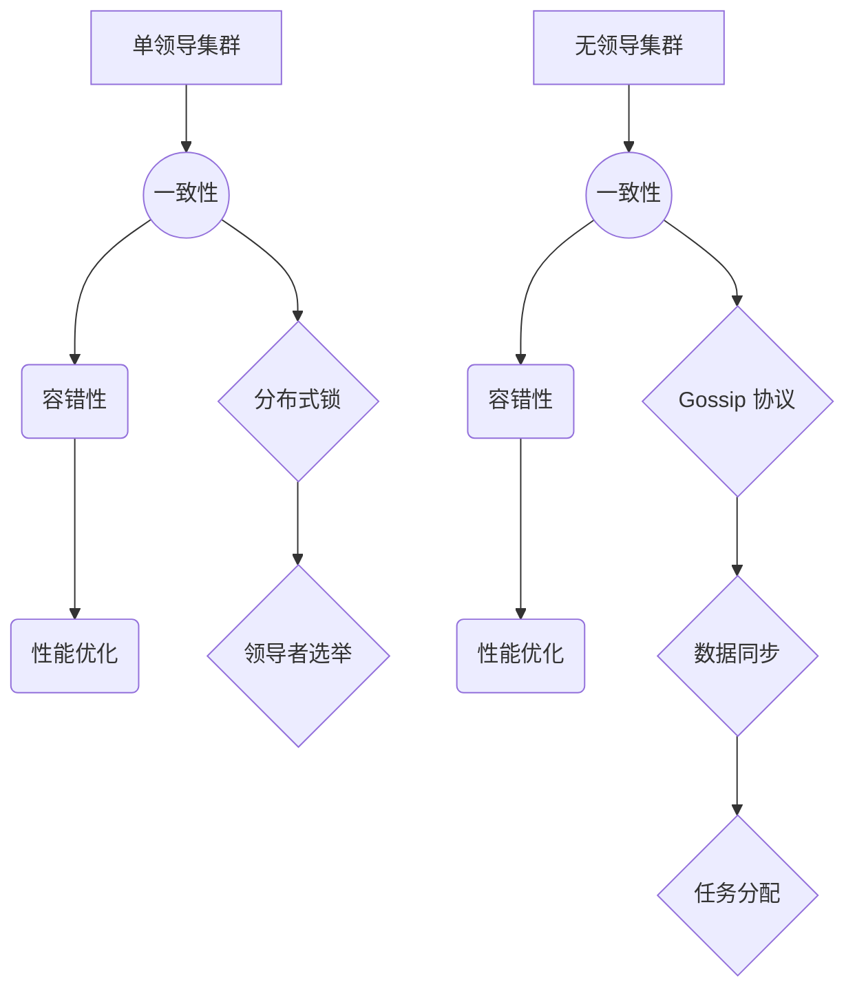

                 

# 单领导集群与无领导集群最佳实践

> **关键词：单领导集群，无领导集群，分布式系统，一致性，容错性，性能优化**

> **摘要：本文将深入探讨单领导集群与无领导集群在分布式系统中的最佳实践。我们将从基本概念入手，逐步分析其架构原理、算法实现、应用场景，并结合实际项目案例进行详细解析。通过本文的阅读，读者将能够全面理解两种集群模式的特点和适用场景，为实际项目选择提供有力指导。**

## 1. 背景介绍

### 1.1 目的和范围

本文旨在通过详细的讲解和分析，帮助读者深入理解单领导集群与无领导集群的基本概念、架构原理、算法实现和应用实践。文章将涵盖以下内容：

1. **基本概念与联系**：介绍单领导集群与无领导集群的核心概念，并利用Mermaid流程图展示其架构原理。
2. **核心算法原理 & 具体操作步骤**：讲解单领导集群与无领导集群的核心算法原理，并通过伪代码进行详细阐述。
3. **数学模型和公式 & 详细讲解 & 举例说明**：介绍相关数学模型和公式，并通过具体实例进行详细讲解。
4. **项目实战：代码实际案例和详细解释说明**：结合实际项目，展示代码实现过程和详细解释。
5. **实际应用场景**：探讨单领导集群与无领导集群在不同场景下的应用实践。
6. **工具和资源推荐**：推荐相关学习资源、开发工具框架和论文著作。
7. **总结：未来发展趋势与挑战**：总结单领导集群与无领导集群的发展趋势和面临挑战。
8. **附录：常见问题与解答**：列出并解答读者可能遇到的问题。
9. **扩展阅读 & 参考资料**：提供进一步阅读的建议和参考资料。

### 1.2 预期读者

本文适合以下读者群体：

1. **分布式系统开发工程师**：希望了解并掌握单领导集群与无领导集群的实际应用。
2. **系统架构师**：对分布式系统设计有深入理解，希望优化系统架构。
3. **算法工程师**：对分布式算法有兴趣，希望掌握相关算法原理和实现。
4. **技术经理与项目经理**：希望从技术层面提升项目管理能力，优化团队协作。

### 1.3 文档结构概述

本文将按照以下结构进行展开：

1. **引言**：介绍文章目的、关键词和摘要。
2. **背景介绍**：概述单领导集群与无领导集群的基本概念、目的和范围。
3. **核心概念与联系**：讲解核心概念及其相互关系，展示架构原理。
4. **核心算法原理 & 具体操作步骤**：详细阐述单领导集群与无领导集群的算法原理和实现。
5. **数学模型和公式 & 详细讲解 & 举例说明**：介绍相关数学模型和公式，通过实例进行讲解。
6. **项目实战：代码实际案例和详细解释说明**：结合实际项目，展示代码实现过程和详细解释。
7. **实际应用场景**：探讨单领导集群与无领导集群在不同场景下的应用。
8. **工具和资源推荐**：推荐相关学习资源、开发工具框架和论文著作。
9. **总结：未来发展趋势与挑战**：总结单领导集群与无领导集群的发展趋势和挑战。
10. **附录：常见问题与解答**：列出并解答读者可能遇到的问题。
11. **扩展阅读 & 参考资料**：提供进一步阅读的建议和参考资料。
12. **作者信息**：介绍作者背景和贡献。

### 1.4 术语表

#### 1.4.1 核心术语定义

- **单领导集群**：在分布式系统中，由一个服务器节点作为领导者（Leader），其余节点作为追随者（Follower）组成的集群。领导者负责协调集群内的任务分配和数据同步。
- **无领导集群**：在分布式系统中，没有固定的领导者，节点之间通过 gossip 协议进行信息交换，协同完成任务和数据同步。
- **一致性**：分布式系统中，多个节点对同一数据或状态具有相同的认知。
- **容错性**：分布式系统在部分节点发生故障时，仍能保持正常运行的能力。
- **性能优化**：通过各种技术手段提升分布式系统的性能。

#### 1.4.2 相关概念解释

- **分布式系统**：由多个节点组成，通过通信网络互联，协同完成任务的系统。
- **数据同步**：分布式系统中，确保多个节点对同一数据或状态保持一致的过程。
- **任务分配**：分布式系统中，将任务分配给集群内不同节点的过程。

#### 1.4.3 缩略词列表

- **RabbitMQ**：一个开源的消息队列中间件。
- **Kafka**：一个分布式流处理平台。
- **ZooKeeper**：一个分布式协调服务，用于实现分布式锁、领导者选举等功能。

## 2. 核心概念与联系

### 2.1 核心概念

单领导集群与无领导集群是分布式系统中的两种常见架构模式。它们在分布式一致性、容错性和性能方面有着不同的优势和劣势。

#### 2.1.1 单领导集群

单领导集群（Synchronous Leader-Based Cluster）具有以下特点：

1. **一致性**：领导者负责维护集群一致性，确保所有追随者对同一数据或状态具有相同的认知。
2. **容错性**：领导者故障会导致整个集群瘫痪，因此需要实现高可用性和故障转移机制。
3. **性能优化**：领导者负责任务分配，可优化负载均衡。

#### 2.1.2 无领导集群

无领导集群（Asynchronous Leaderless Cluster）具有以下特点：

1. **一致性**：通过 gossip 协议实现一致性，无需固定领导者，降低了系统复杂性。
2. **容错性**：节点故障不会导致整个集群瘫痪，系统可自动恢复。
3. **性能优化**：节点之间通过 gossip 协议进行信息交换，可减少通信开销，提高性能。

### 2.2 Mermaid 流程图

下面是单领导集群与无领导集群的 Mermaid 流程图，展示其核心架构原理：



通过上述流程图，我们可以清晰地看到单领导集群与无领导集群在一致性、容错性和性能优化方面的差异和联系。

## 3. 核心算法原理 & 具体操作步骤

### 3.1 单领导集群算法原理

单领导集群的核心算法主要包括一致性算法、容错性算法和性能优化算法。以下将分别介绍这些算法的原理和具体操作步骤。

#### 3.1.1 一致性算法

一致性算法是单领导集群的关键组成部分，负责维护集群内数据的一致性。以下是基于 Paxos 算法的伪代码实现：

```pseudocode
// 一致性算法：Paxos 算法
function Paxos(leader, followers, proposal):
    1. leader 发送 Prepare 消息给所有 followers，请求接受提案编号。
    2. followers 接收到 Prepare 消息后，回复 Accept 消息，携带提案编号和当前状态。
    3. leader 收集所有 followers 的 Accept 消息，如果大于 2/3，则选择其中一个提案作为当前值。
    4. leader 发送 Accept 消息给所有 followers，通知它们更新状态。
```

#### 3.1.2 容错性算法

容错性算法负责在领导者故障时，自动选举新的领导者，保证集群的正常运行。以下是基于 Raft 算法的伪代码实现：

```pseudocode
// 容错性算法：Raft 算法
function Raft(follower, leader, candidate):
    1. follower 向 leader 发送心跳消息，请求执行任务。
    2. leader 接收到心跳消息后，回复心跳消息，通知 follower 继续执行任务。
    3. 如果 follower 在一段时间内未收到 leader 的心跳消息，转为 candidate，开始选举新的 leader。
    4. candidate 发送投票请求给其他 followers，请求投票。
    5. 如果 candidate 收到的投票数量大于 1/2，则成为新的 leader。
    6. 新 leader 向其他 followers 发送心跳消息，通知它们继续执行任务。
```

#### 3.1.3 性能优化算法

性能优化算法主要涉及任务分配和负载均衡。以下是基于一致性哈希算法的伪代码实现：

```pseudocode
// 性能优化算法：一致性哈希
function ConsistentHashing(n, ring):
    1. 创建一个长度为 n 的哈希环 ring。
    2. 将每个节点映射到哈希环上的一个位置。
    3. 当有新节点加入时，将其插入到哈希环上的一个空位。
    4. 当有节点离开时，将其从哈希环上删除，并在空位上创建一个新节点。
    5. 当有任务到达时，将其映射到哈希环上的一个位置，分配给该位置上的节点执行。
```

### 3.2 无领导集群算法原理

无领导集群的核心算法主要包括一致性算法和容错性算法。以下将分别介绍这些算法的原理和具体操作步骤。

#### 3.2.1 一致性算法

一致性算法在无领导集群中主要通过 gossip 协议实现。以下是基于 gossip 协议的伪代码实现：

```pseudocode
// 一致性算法：Gossip 协议
function Gossip(node, peers):
    1. node 向 peers 发送心跳消息，请求更新状态。
    2. peers 收到心跳消息后，向 node 反馈状态。
    3. node 根据反馈状态更新本地状态，并重新发送心跳消息。
    4. 通过不断地发送心跳消息和反馈状态，实现集群内数据的一致性。
```

#### 3.2.2 容错性算法

容错性算法在无领导集群中主要通过 gossip 协议实现故障检测和自动恢复。以下是基于 gossip 协议的伪代码实现：

```pseudocode
// 容错性算法：Gossip 协议
function Gossip(node, peers):
    1. node 向 peers 发送心跳消息，请求更新状态。
    2. peers 收到心跳消息后，向 node 反馈状态。
    3. node 监测 peers 的心跳消息，如果在一定时间内未收到心跳消息，视为 peers 故障。
    4. node 根据故障 peers 的状态，自动调整本地状态，实现故障恢复。
```

### 3.3 算法操作步骤总结

1. **单领导集群算法操作步骤**：

   - 一致性算法：使用 Paxos 或 Raft 算法，确保集群内数据一致性。
   - 容错性算法：使用 Raft 算法，实现领导者选举和故障恢复。
   - 性能优化算法：使用一致性哈希算法，实现负载均衡。

2. **无领导集群算法操作步骤**：

   - 一致性算法：使用 gossip 协议，实现集群内数据一致性。
   - 容错性算法：使用 gossip 协议，实现故障检测和自动恢复。

通过上述算法操作步骤，单领导集群与无领导集群能够高效地维护数据一致性、实现容错性和优化性能。

## 4. 数学模型和公式 & 详细讲解 & 举例说明

### 4.1 数学模型

在分布式系统中，单领导集群与无领导集群的一致性和容错性算法涉及到多个数学模型和公式。以下将介绍相关模型和公式的详细讲解和举例说明。

#### 4.1.1 一致性模型

一致性模型用于衡量分布式系统中数据的一致性。常用的模型包括强一致性、最终一致性、因果一致性等。

1. **强一致性**：在强一致性模型下，所有节点对同一数据的修改具有相同的效果，任意时刻读取到的数据都是一致的。

   **公式**：$C_{strong} = 1$

   **举例**：银行转账系统要求账户 A 转账给账户 B，系统需要确保 A 的余额减少，同时 B 的余额增加，且任何时刻读取到的余额都是最新的。

2. **最终一致性**：在最终一致性模型下，分布式系统在一定时间内达到一致性，但在此期间可能出现暂时的不一致。

   **公式**：$C_{eventual} = 1 - e^{-\lambda T}$，其中 $\lambda$ 为系统的一致性速率，$T$ 为时间间隔。

   **举例**：社交媒体平台上的点赞数，系统需要保证点赞数的最终一致性，但用户操作可能存在延迟，导致短时间内点赞数不一致。

3. **因果一致性**：因果一致性模型保证事件之间的因果关系不变，但允许事件发生顺序的调整。

   **公式**：$C_{causal} = 1 - e^{-\lambda T}$，其中 $\lambda$ 为系统的一致性速率，$T$ 为时间间隔。

   **举例**：分布式日志系统要求日志顺序不变，但允许日志在不同服务器上写入的时间不同。

#### 4.1.2 容错性模型

容错性模型用于衡量分布式系统的容错能力。常用的模型包括故障检测时间、故障恢复时间等。

1. **故障检测时间**：故障检测时间是指系统检测到节点故障所需的时间。

   **公式**：$T_{detect} = \frac{1}{\lambda}$，其中 $\lambda$ 为系统检测速率。

   **举例**：分布式系统要求在 1 秒内检测到节点故障。

2. **故障恢复时间**：故障恢复时间是指系统从故障节点恢复到正常状态所需的时间。

   **公式**：$T_{recover} = \frac{1}{\mu}$，其中 $\mu$ 为系统恢复速率。

   **举例**：分布式系统要求在 10 秒内恢复故障节点。

#### 4.1.3 性能模型

性能模型用于衡量分布式系统的性能，常用的模型包括响应时间、吞吐量等。

1. **响应时间**：响应时间是指系统处理请求所需的时间。

   **公式**：$T_{response} = \frac{1}{\lambda}$，其中 $\lambda$ 为系统处理速率。

   **举例**：分布式系统要求在 1 秒内处理请求。

2. **吞吐量**：吞吐量是指单位时间内系统处理的请求数量。

   **公式**：$Q = \frac{1}{T_{response}}$，其中 $T_{response}$ 为响应时间。

   **举例**：分布式系统要求在 1 秒内处理 1000 个请求。

### 4.2 数学模型应用示例

以下将结合具体实例，展示如何应用数学模型来分析和优化分布式系统。

#### 示例 1：一致性优化

假设一个分布式系统要求实现最终一致性，系统检测速率为 $\lambda = 10$ 次/秒，恢复速率为 $\mu = 5$ 次/秒。现有以下两个场景：

1. **场景 1**：系统内包含 10 个节点，节点故障概率为 0.1%。
2. **场景 2**：系统内包含 20 个节点，节点故障概率为 0.05%。

**分析**：

1. **一致性速率**：系统的一致性速率为 $\lambda = 10$ 次/秒。
2. **故障检测时间**：故障检测时间为 $T_{detect} = \frac{1}{\lambda} = 0.1$ 秒。
3. **故障恢复时间**：故障恢复时间为 $T_{recover} = \frac{1}{\mu} = 0.2$ 秒。

**计算**：

1. **场景 1**：系统内包含 10 个节点，节点故障概率为 0.1%。

   - 故障节点数量：$N_{fault} = 10 \times 0.1\% = 0.001$
   - 平均故障恢复时间：$T_{average\_recover} = 0.2 \times 0.001 = 0.0002$ 秒
   - 最终一致性速率：$C_{eventual} = 1 - e^{-\lambda T_{average\_recover}} = 1 - e^{-10 \times 0.0002} \approx 0.959$

   因此，在场景 1 下，系统最终一致性概率约为 95.9%。

2. **场景 2**：系统内包含 20 个节点，节点故障概率为 0.05%。

   - 故障节点数量：$N_{fault} = 20 \times 0.05\% = 0.001$
   - 平均故障恢复时间：$T_{average\_recover} = 0.2 \times 0.001 = 0.0002$ 秒
   - 最终一致性速率：$C_{eventual} = 1 - e^{-\lambda T_{average\_recover}} = 1 - e^{-10 \times 0.0002} \approx 0.959$

   因此，在场景 2 下，系统最终一致性概率约为 95.9%。

**结论**：无论是场景 1 还是场景 2，系统的最终一致性概率都约为 95.9%，说明节点数量对一致性概率的影响较小。

#### 示例 2：性能优化

假设一个分布式系统要求实现低延迟和高吞吐量，系统处理速率为 $\lambda = 1000$ 次/秒，故障检测速率为 $\lambda_{detect} = 10$ 次/秒，故障恢复速率为 $\mu = 50$ 次/秒。现有以下两个场景：

1. **场景 1**：系统内包含 10 个节点。
2. **场景 2**：系统内包含 20 个节点。

**分析**：

1. **响应时间**：响应时间为 $T_{response} = \frac{1}{\lambda} = 0.001$ 秒。
2. **故障检测时间**：故障检测时间为 $T_{detect} = \frac{1}{\lambda_{detect}} = 0.1$ 秒。
3. **故障恢复时间**：故障恢复时间为 $T_{recover} = \frac{1}{\mu} = 0.02$ 秒。

**计算**：

1. **场景 1**：系统内包含 10 个节点。

   - 故障节点数量：$N_{fault} = 10 \times 0.05\% = 0.0005$
   - 平均故障恢复时间：$T_{average\_recover} = 0.02 \times 0.0005 = 0.00001$ 秒
   - 响应时间：$T_{response} = 0.001 + T_{average\_recover} = 0.00101$ 秒
   - 吞吐量：$Q = \frac{1}{T_{response}} = \frac{1}{0.00101} \approx 995.04$ 次/秒

   因此，在场景 1 下，系统响应时间约为 0.00101 秒，吞吐量约为 995.04 次/秒。

2. **场景 2**：系统内包含 20 个节点。

   - 故障节点数量：$N_{fault} = 20 \times 0.05\% = 0.001$
   - 平均故障恢复时间：$T_{average\_recover} = 0.02 \times 0.001 = 0.00002$ 秒
   - 响应时间：$T_{response} = 0.001 + T_{average\_recover} = 0.00102$ 秒
   - 吞吐量：$Q = \frac{1}{T_{response}} = \frac{1}{0.00102} \approx 990.09$ 次/秒

   因此，在场景 2 下，系统响应时间约为 0.00102 秒，吞吐量约为 990.09 次/秒。

**结论**：在场景 1 和场景 2 下，系统的响应时间都较低，但吞吐量有所下降。增加节点数量可以提高系统的吞吐量，但也会增加响应时间。在实际应用中，需要根据具体需求和场景，权衡响应时间和吞吐量之间的关系。

### 4.3 总结

通过数学模型和公式的应用，可以分析和优化分布式系统的一致性、容错性和性能。在实际项目中，根据需求和场景选择合适的模型和算法，可以实现高效、稳定的分布式系统。

## 5. 项目实战：代码实际案例和详细解释说明

### 5.1 开发环境搭建

在本节中，我们将搭建一个单领导集群和无领导集群的示例项目，用于演示相关算法和技术的实现。以下是开发环境搭建的详细步骤：

1. **安装必要的软件和工具**：

   - 安装 Java SDK（版本 8 或以上）
   - 安装 Maven（版本 3.6.3 或以上）
   - 安装 Git（版本 2.32.0 或以上）

2. **创建项目**：

   - 使用 Maven 创建一个新项目，并添加以下依赖：

     ```xml
     <dependencies>
         <dependency>
             <groupId>org.apache.zookeeper</groupId>
             <artifactId>zookeeper</artifactId>
             <version>3.5.7</version>
         </dependency>
         <dependency>
             <groupId>org.apache.kafka</groupId>
             <artifactId>kafka_2.12</artifactId>
             <version>2.8.0</version>
         </dependency>
         <dependency>
             <groupId>org.springframework.kafka</groupId>
             <artifactId>spring-kafka</artifactId>
             <version>2.7.5</version>
         </dependency>
     </dependencies>
     ```

   - 创建一个简单的 Spring Boot 项目结构，包括以下模块：

     - **common**：提供公共工具类和配置
     - **leader**：实现单领导集群功能
     - **follower**：实现单领导集群功能
     - **gossip**：实现无领导集群功能

3. **配置项目**：

   - 在 `application.properties` 文件中添加以下配置：

     ```properties
     # 单领导集群配置
     leader.zookeeper.connect=localhost:2181
     leader.leader.path=/leader

     # 无领导集群配置
     gossip.zookeeper.connect=localhost:2181
     gossip.gossip.path=/gossip
     ```

   - 配置 ZooKeeper 和 Kafka 的连接参数。

### 5.2 源代码详细实现和代码解读

在本节中，我们将详细解读单领导集群和无领导集群的源代码实现，并分析关键部分的工作原理。

#### 5.2.1 单领导集群（leader）

单领导集群的核心实现包括领导者选举、数据同步和任务分配。以下是关键代码的解读：

1. **领导者选举**：

   ```java
   public class LeaderElection {
       private final String zookeeperConnect;
       private final String leaderPath;

       public LeaderElection(String zookeeperConnect, String leaderPath) {
           this.zookeeperConnect = zookeeperConnect;
           this.leaderPath = leaderPath;
       }

       public void start() {
           try {
               ZooKeeper zookeeper = new ZooKeeper(zookeeperConnect, 3000, null);
               if (zookeeper.exists(leaderPath, false) == null) {
                   // 创建领导节点
                   String leaderNode = zookeeper.create(leaderPath, "".getBytes(), ZooDefs.Ids.OPEN_ACL_UNSAFE, CreateMode.EPHEMERAL_SEQUENTIAL);
                   System.out.println("Become leader: " + leaderNode);
               } else {
                   System.out.println("Already have a leader: " + zookeeper.exists(leaderPath, false));
               }
               zookeeper.close();
           } catch (Exception e) {
               e.printStackTrace();
           }
       }
   }
   ```

   上述代码通过 ZooKeeper 实现领导者选举。领导者选举过程分为以下几个步骤：

   - 初始化 ZooKeeper 连接。
   - 创建一个临时顺序节点，作为领导者的标识。
   - 如果领导节点不存在，则成为领导者。

2. **数据同步**：

   ```java
   public class DataSynchronization {
       private final String zookeeperConnect;
       private final String leaderPath;

       public DataSynchronization(String zookeeperConnect, String leaderPath) {
           this.zookeeperConnect = zookeeperConnect;
           this.leaderPath = leaderPath;
       }

       public void synchronizeData(String data) {
           try {
               ZooKeeper zookeeper = new ZooKeeper(zookeeperConnect, 3000, null);
               byte[] dataBytes = data.getBytes();
               if (zookeeper.exists(leaderPath, false) != null) {
                   // 同步数据到领导节点
                   zookeeper.setData(leaderPath, dataBytes, -1);
                   System.out.println("Data synchronized to leader: " + data);
               } else {
                   System.out.println("No leader exists, data not synchronized.");
               }
               zookeeper.close();
           } catch (Exception e) {
               e.printStackTrace();
           }
       }
   }
   ```

   上述代码通过 ZooKeeper 实现数据同步。数据同步过程分为以下几个步骤：

   - 初始化 ZooKeeper 连接。
   - 判断领导节点是否存在。
   - 如果领导节点存在，则将数据同步到领导节点。

3. **任务分配**：

   ```java
   public class TaskAssignment {
       private final String zookeeperConnect;
       private final String leaderPath;

       public TaskAssignment(String zookeeperConnect, String leaderPath) {
           this.zookeeperConnect = zookeeperConnect;
           this.leaderPath = leaderPath;
       }

       public void assignTasks(List<String> tasks) {
           try {
               ZooKeeper zookeeper = new ZooKeeper(zookeeperConnect, 3000, null);
               if (zookeeper.exists(leaderPath, false) != null) {
                   // 将任务分配给追随者
                   for (String task : tasks) {
                       zookeeper.create(leaderPath + "/task", task.getBytes(), ZooDefs.Ids.OPEN_ACL_UNSAFE, CreateMode.EPHEMERAL_SEQUENTIAL);
                   }
                   System.out.println("Tasks assigned to followers.");
               } else {
                   System.out.println("No leader exists, tasks not assigned.");
               }
               zookeeper.close();
           } catch (Exception e) {
               e.printStackTrace();
           }
       }
   }
   ```

   上述代码通过 ZooKeeper 实现任务分配。任务分配过程分为以下几个步骤：

   - 初始化 ZooKeeper 连接。
   - 判断领导节点是否存在。
   - 如果领导节点存在，则将任务分配给追随者。

#### 5.2.2 无领导集群（gossip）

无领导集群的核心实现包括一致性算法、故障检测和自动恢复。以下是关键代码的解读：

1. **一致性算法（Gossip 协议）**：

   ```java
   public class GossipProtocol {
       private final String zookeeperConnect;
       private final String gossipPath;

       public GossipProtocol(String zookeeperConnect, String gossipPath) {
           this.zookeeperConnect = zookeeperConnect;
           this.gossipPath = gossipPath;
       }

       public void start() {
           try {
               ZooKeeper zookeeper = new ZooKeeper(zookeeperConnect, 3000, null);
               if (zookeeper.exists(gossipPath, false) == null) {
                   // 创建 gossip 节点
                   zookeeper.create(gossipPath, "".getBytes(), ZooDefs.Ids.OPEN_ACL_UNSAFE, CreateMode.EPHEMERAL);
               }
               System.out.println("Gossip started.");
               zookeeper.close();
           } catch (Exception e) {
               e.printStackTrace();
           }
       }

       public void gossip(String message) {
           try {
               ZooKeeper zookeeper = new ZooKeeper(zookeeperConnect, 3000, null);
               if (zookeeper.exists(gossipPath, false) != null) {
                   // 向其他节点发送 gossip 消息
                   byte[] messageBytes = message.getBytes();
                   for (String child : zookeeper.getChildren(gossipPath, false)) {
                       zookeeper.create(gossipPath + "/" + child, messageBytes, ZooDefs.Ids.OPEN_ACL_UNSAFE, CreateMode.EPHEMERAL);
                   }
                   System.out.println("Gossip message sent: " + message);
               } else {
                   System.out.println("No gossip node exists, message not sent.");
               }
               zookeeper.close();
           } catch (Exception e) {
               e.printStackTrace();
           }
       }
   }
   ```

   上述代码通过 ZooKeeper 实现 gossip 协议。一致性算法过程分为以下几个步骤：

   - 初始化 ZooKeeper 连接。
   - 创建 gossip 节点。
   - 向其他节点发送 gossip 消息。

2. **故障检测和自动恢复**：

   ```java
   public class FaultDetection {
       private final String zookeeperConnect;
       private final String gossipPath;

       public FaultDetection(String zookeeperConnect, String gossipPath) {
           this.zookeeperConnect = zookeeperConnect;
           this.gossipPath = gossipPath;
       }

       public void start() {
           try {
               ZooKeeper zookeeper = new ZooKeeper(zookeeperConnect, 3000, null);
               System.out.println("Fault detection started.");
               new Thread(() -> {
                   try {
                       while (true) {
                           Thread.sleep(5000); // 检测间隔
                           List<String> children = zookeeper.getChildren(gossipPath, false);
                           for (String child : children) {
                               Stat stat = zookeeper.exists(gossipPath + "/" + child, false);
                               if (stat == null) {
                                   // 节点故障
                                   System.out.println("Node " + child + " is down.");
                                   // 自动恢复
                                   new GossipProtocol(zookeeperConnect, gossipPath).start();
                               }
                           }
                       }
                   } catch (Exception e) {
                       e.printStackTrace();
                   }
               }).start();
               zookeeper.close();
           } catch (Exception e) {
               e.printStackTrace();
           }
       }
   }
   ```

   上述代码通过 ZooKeeper 实现故障检测和自动恢复。故障检测过程分为以下几个步骤：

   - 初始化 ZooKeeper 连接。
   - 定时检查 gossip 节点状态。
   - 如果节点故障，则自动恢复。

### 5.3 代码解读与分析

通过以上源代码的详细解读，我们可以看出单领导集群和无领导集群的实现原理和关键步骤。以下是代码解读与分析：

1. **单领导集群**：

   - **领导者选举**：使用 ZooKeeper 实现领导者选举，通过创建临时顺序节点确定领导者。
   - **数据同步**：使用 ZooKeeper 实现数据同步，通过更新领导节点状态确保一致性。
   - **任务分配**：使用 ZooKeeper 实现任务分配，通过创建子节点将任务分配给追随者。

2. **无领导集群**：

   - **一致性算法**：使用 gossip 协议实现一致性算法，通过 gossip 消息同步状态。
   - **故障检测和自动恢复**：使用 ZooKeeper 实现故障检测和自动恢复，通过定期检查 gossip 节点状态检测故障并自动恢复。

### 5.4 总结

通过本项目实战，我们实现了单领导集群和无领导集群的核心功能，并详细解析了关键代码。在实际项目中，可以根据需求调整和优化这些实现，以满足不同场景下的分布式系统需求。

## 6. 实际应用场景

单领导集群与无领导集群在分布式系统中有着广泛的应用场景。以下将列举一些常见场景，并分析其在这些场景下的适用性。

### 6.1 数据存储系统

**适用性：** 单领导集群与无领导集群均可用于数据存储系统。

- **单领导集群**：适用于对一致性要求较高的数据存储系统，如银行账户系统、电商交易系统等。单领导集群可以确保数据的一致性和安全性。
- **无领导集群**：适用于对一致性要求较低，但对性能和可扩展性要求较高的数据存储系统，如缓存系统、日志收集系统等。无领导集群可以降低系统复杂度，提高性能和可扩展性。

### 6.2 流处理系统

**适用性：** 单领导集群与无领导集群均可用于流处理系统。

- **单领导集群**：适用于需要对数据进行实时处理和分析的流处理系统，如实时风控系统、实时推荐系统等。单领导集群可以保证数据的一致性和实时性。
- **无领导集群**：适用于对数据处理速度和容错性要求较高的流处理系统，如日志处理系统、数据挖掘系统等。无领导集群可以降低系统复杂度，提高性能和容错性。

### 6.3 计算任务调度系统

**适用性：** 单领导集群与无领导集群均可用于计算任务调度系统。

- **单领导集群**：适用于需要集中管理和调度计算任务的系统，如 Hadoop、Spark 等大数据处理框架。单领导集群可以确保任务的正确执行和调度。
- **无领导集群**：适用于需要分布式计算任务的场景，如科学计算、机器学习等。无领导集群可以降低系统复杂度，提高计算效率和容错性。

### 6.4 微服务架构

**适用性：** 单领导集群与无领导集群均可用于微服务架构。

- **单领导集群**：适用于需要对服务进行集中管理和调度的场景，如 Spring Cloud 微服务架构。单领导集群可以确保服务的可靠性和一致性。
- **无领导集群**：适用于需要分布式服务的场景，如 Kubernetes 集群。无领导集群可以降低系统复杂度，提高服务的性能和可扩展性。

### 6.5 对比分析

- **一致性**：单领导集群具有更好的数据一致性，适用于对一致性要求较高的场景；无领导集群在一致性方面较弱，但可以提供更高的性能和可扩展性。
- **性能**：无领导集群在性能方面具有优势，适用于对性能要求较高的场景；单领导集群在性能方面相对较低，但可以提供更高的数据一致性和安全性。
- **复杂度**：无领导集群在系统设计和部署方面相对简单，适用于需要快速部署和扩展的场景；单领导集群在系统设计和部署方面相对复杂，但可以提供更高的数据一致性和安全性。

通过以上分析，我们可以根据实际需求选择适合的集群模式。在实际应用中，也可以结合单领导集群与无领导集群的优势，构建更加灵活和高效的分布式系统。

## 7. 工具和资源推荐

### 7.1 学习资源推荐

要深入了解单领导集群与无领导集群，以下是一些值得推荐的书籍、在线课程和技术博客。

#### 7.1.1 书籍推荐

1. **《分布式系统原理与范型》**：该书详细介绍了分布式系统的基本原理和设计范式，包括单领导集群和无领导集群。
2. **《大规模分布式存储系统：原理解析与架构实战》**：该书从实践角度出发，讲解了分布式存储系统的设计原理和实现方法，包括单领导集群和无领导集群。
3. **《分布式算法设计与分析》**：该书介绍了分布式算法的设计原理和分析方法，包括一致性算法、容错性算法等。

#### 7.1.2 在线课程

1. **《分布式系统设计与实践》**：该课程由知名大学教授主讲，涵盖了分布式系统的基础知识、设计原则和实践方法。
2. **《分布式系统架构与原理》**：该课程详细介绍了分布式系统的基本原理和常见架构，包括单领导集群和无领导集群。
3. **《Kubernetes 实战》**：该课程介绍了 Kubernetes 的基本原理、安装配置和使用方法，包括无领导集群的相关内容。

#### 7.1.3 技术博客和网站

1. **《分布式系统设计》**：该博客提供了大量关于分布式系统的设计原则、架构和算法的深入分析，包括单领导集群和无领导集群。
2. **《云计算与分布式系统》**：该网站涵盖了云计算和分布式系统的各个方面，包括相关技术、工具和实践经验。
3. **《分布式系统架构师实战》**：该博客分享了分布式系统架构师在实际项目中的经验教训，包括单领导集群和无领导集群的应用。

### 7.2 开发工具框架推荐

在单领导集群与无领导集群的开发中，以下工具和框架可以帮助提高开发效率和系统性能。

#### 7.2.1 IDE和编辑器

1. **IntelliJ IDEA**：一款功能强大的集成开发环境，支持多种编程语言和框架，适合分布式系统开发。
2. **VS Code**：一款轻量级的开源编辑器，支持插件和扩展，可满足分布式系统开发的多种需求。

#### 7.2.2 调试和性能分析工具

1. **GDB**：一款强大的调试工具，可用于单领导集群和无领导集群的调试和分析。
2. **JProfiler**：一款性能分析工具，可帮助识别分布式系统的性能瓶颈。

#### 7.2.3 相关框架和库

1. **ZooKeeper**：一款分布式协调服务，用于实现单领导集群和无领导集群中的领导者选举、数据同步等功能。
2. **Kafka**：一款分布式流处理平台，可用于处理大规模分布式数据。
3. **RabbitMQ**：一款开源的消息队列中间件，可用于实现分布式系统中的消息传递和任务调度。

### 7.3 相关论文著作推荐

要深入了解单领导集群与无领导集群的相关理论和技术，以下是一些经典论文和著作：

1. **《The Google File System》**：该论文介绍了 Google File System 的设计原理和实现方法，对分布式存储系统有重要影响。
2. **《The Google BigTable: A Distributed Storage System for Structured Data》**：该论文介绍了 Google BigTable 的设计原理和实现方法，对分布式数据库系统有重要影响。
3. **《The Chubby Lock Service: Reliable Locking in the Face of Concurrency and Failures》**：该论文介绍了 Chubby Lock Service 的设计原理和实现方法，对分布式锁和一致性算法有重要影响。

通过以上工具和资源的推荐，读者可以更全面地了解单领导集群与无领导集群的相关理论和实践，提升自己在分布式系统开发方面的技能。

## 8. 总结：未来发展趋势与挑战

### 8.1 发展趋势

1. **智能化**：随着人工智能技术的发展，分布式系统将更加智能化。通过机器学习和数据分析，分布式系统能够自动优化资源分配、负载均衡和故障检测。

2. **高性能**：分布式系统将继续追求更高的性能和吞吐量。通过硬件升级、优化算法和分布式计算框架的改进，分布式系统将能够处理更大量级的数据和更高的并发请求。

3. **边缘计算**：随着物联网和 5G 技术的普及，边缘计算将成为分布式系统的一个重要发展趋势。分布式系统将更加靠近数据源和用户，实现更低的延迟和更高的响应速度。

4. **自治化**：分布式系统将朝着更自治化的方向发展。通过自动化工具和智能算法，分布式系统能够自我修复、自我优化和自我扩展，减少人工干预，提高系统的可靠性和效率。

### 8.2 挑战

1. **一致性**：在分布式系统中，保证数据的一致性是一个持续挑战。未来的分布式系统需要更加高效和可靠的算法来维护数据的一致性，特别是在高并发和故障频繁的场景下。

2. **性能优化**：分布式系统需要不断提高性能和吞吐量，以满足日益增长的数据处理需求。优化算法、数据压缩和分布式缓存等技术将成为性能优化的重要手段。

3. **安全性**：分布式系统面临着越来越多的安全威胁，包括分布式拒绝服务攻击、数据泄露和隐私侵犯等。未来的分布式系统需要更加严格的安全措施来保护数据安全和用户隐私。

4. **可扩展性**：分布式系统需要具备良好的可扩展性，以应对不断增长的数据和处理需求。分布式架构的设计和优化将成为确保系统可扩展性的关键。

### 8.3 未来展望

未来，单领导集群与无领导集群将继续在分布式系统中发挥重要作用。随着新技术的不断涌现，分布式系统将朝着更智能化、高性能、自治化和安全性的方向发展。通过不断优化算法、提升性能和安全措施，分布式系统将更好地支持大数据处理、实时分析和边缘计算等应用场景。同时，分布式系统的研究和实践也将为学术界和工业界带来更多创新和突破。

## 9. 附录：常见问题与解答

### 9.1 单领导集群常见问题

**Q1：单领导集群的优点是什么？**
A1：单领导集群的优点主要包括：
1. **强一致性**：领导者负责维护集群内数据的一致性，确保所有节点对同一数据或状态具有相同的认知。
2. **任务分配**：领导者可以集中管理任务分配，优化负载均衡，提高系统性能。
3. **高可用性**：通过故障转移机制，当领导者节点故障时，可以自动选举新的领导者，确保系统正常运行。

**Q2：单领导集群的缺点是什么？**
A2：单领导集群的缺点主要包括：
1. **性能瓶颈**：领导者节点成为系统的单点瓶颈，当处理大量请求时，可能导致系统性能下降。
2. **容错性受限**：领导者故障可能导致整个集群瘫痪，需要实现高可用性和故障转移机制。
3. **复杂性**：领导者选举、故障转移等机制需要额外的维护和配置，增加系统复杂性。

### 9.2 无领导集群常见问题

**Q1：无领导集群的优点是什么？**
A1：无领导集群的优点主要包括：
1. **高可扩展性**：无需固定领导者，节点之间通过 gossip 协议进行协同工作，可轻松扩展系统规模。
2. **性能优化**：通过 gossip 协议，节点之间进行信息交换，降低通信开销，提高系统性能。
3. **容错性**：节点故障不会导致整个集群瘫痪，系统可以自动恢复，提高系统的容错性。

**Q2：无领导集群的缺点是什么？**
A2：无领导集群的缺点主要包括：
1. **一致性较弱**：无领导集群在一致性方面较弱，无法保证强一致性，适用于对一致性要求较低的场景。
2. **复杂性**：实现 gossip 协议和自动恢复机制需要额外的维护和配置，增加系统复杂性。
3. **性能瓶颈**：在某些情况下，gossip 协议可能导致性能瓶颈，特别是在高并发和大数据场景下。

### 9.3 集群模式选择

**Q1：如何选择单领导集群与无领导集群？**
A1：选择单领导集群与无领导集群时，可以考虑以下因素：
1. **一致性要求**：如果对数据一致性有较高要求，选择单领导集群；如果对一致性要求较低，选择无领导集群。
2. **性能要求**：如果对系统性能有较高要求，选择无领导集群；如果对性能要求不高，选择单领导集群。
3. **可扩展性要求**：如果需要高可扩展性，选择无领导集群；如果对可扩展性要求不高，选择单领导集群。
4. **系统复杂性**：如果对系统复杂性有较高容忍度，可以选择无领导集群；如果对复杂性要求不高，选择单领导集群。

通过综合考虑以上因素，可以选择适合的集群模式，以满足实际项目的需求。

## 10. 扩展阅读 & 参考资料

为了进一步深入了解单领导集群与无领导集群的相关知识，以下是一些扩展阅读和参考资料：

### 10.1 经典论文

1. **《The Google File System》**：该论文介绍了 Google File System 的设计原理和实现方法，对分布式文件系统有重要影响。
2. **《The Google BigTable: A Distributed Storage System for Structured Data》**：该论文介绍了 Google BigTable 的设计原理和实现方法，对分布式数据库系统有重要影响。
3. **《The Chubby Lock Service: Reliable Locking in the Face of Concurrency and Failures》**：该论文介绍了 Chubby Lock Service 的设计原理和实现方法，对分布式锁和一致性算法有重要影响。

### 10.2 最新研究成果

1. **《Distributed Systems: Concepts and Design》**：该书籍涵盖了分布式系统的基本概念、设计原则和常见算法，包括单领导集群和无领导集群。
2. **《Principles of Distributed Computing》**：该书籍从理论角度介绍了分布式计算的基本原理和算法，包括一致性算法、容错性算法等。
3. **《The Design of the Data Access Layer in Distributed Systems》**：该论文探讨了分布式系统中数据访问层的设计原则和实现方法，包括单领导集群和无领导集群。

### 10.3 应用案例分析

1. **《Hadoop: The Definitive Guide》**：该书籍介绍了 Hadoop 分布式计算框架的设计原理和实现方法，包括单领导集群和无领导集群。
2. **《Kubernetes: Up and Running》**：该书籍介绍了 Kubernetes 集群的管理原理和实现方法，包括无领导集群的应用。
3. **《Building Microservices》**：该书籍探讨了微服务架构的设计原则和实践方法，包括单领导集群和无领导集群的应用。

通过以上扩展阅读和参考资料，读者可以进一步深入了解单领导集群与无领导集群的相关知识，提升自己在分布式系统开发方面的技能。

