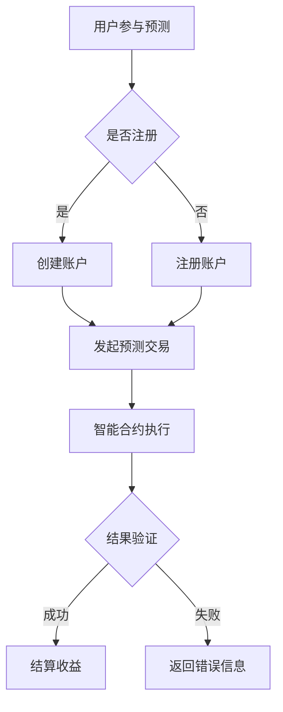

                 

# 去中心化预测市场：金融衍生品的创新平台

> 关键词：去中心化、预测市场、金融衍生品、区块链技术、智能合约、算法交易、共识机制

> 摘要：本文旨在探讨去中心化预测市场作为金融衍生品创新平台的重要性和优势。首先，我们将回顾预测市场和金融衍生品的定义和发展历程。接着，深入解析去中心化预测市场的核心概念和架构，并详细介绍其基于区块链技术和智能合约的运作原理。然后，我们将通过实际案例和代码示例，展示如何构建和运行一个去中心化预测市场平台。最后，讨论去中心化预测市场在实际应用中的挑战和未来发展趋势。

## 1. 背景介绍

### 1.1 目的和范围

本文将专注于去中心化预测市场，作为一种新兴的金融衍生品平台，探讨其在金融领域的重要性。我们将从定义、历史背景、现有问题和挑战入手，逐步深入到去中心化预测市场的核心概念和运作机制。通过对比分析中心化和去中心化市场模型，展示去中心化预测市场的优势。此外，本文还将通过具体实例和代码，展示如何实现一个去中心化预测市场平台，并讨论其在实际应用中的潜在影响。

### 1.2 预期读者

本文适用于对金融衍生品、区块链技术以及去中心化系统有一定了解的读者。它不仅适合金融专业人士和研究者，也适合对去中心化技术感兴趣的程序员和开发者。同时，对于想要深入了解去中心化预测市场的企业高管和政策制定者，本文也将提供有价值的见解。

### 1.3 文档结构概述

本文的结构如下：

1. 背景介绍：介绍预测市场和金融衍生品的基本概念，以及去中心化预测市场的意义。
2. 核心概念与联系：详细阐述去中心化预测市场的核心概念，包括去中心化、区块链技术、智能合约等。
3. 核心算法原理 & 具体操作步骤：解释去中心化预测市场的算法原理，并给出具体操作步骤。
4. 数学模型和公式 & 详细讲解 & 举例说明：介绍去中心化预测市场中的数学模型和公式，并进行举例说明。
5. 项目实战：提供实际案例，展示如何构建和运行一个去中心化预测市场平台。
6. 实际应用场景：分析去中心化预测市场在不同领域的应用场景。
7. 工具和资源推荐：推荐学习资源、开发工具和框架，以及相关论文著作。
8. 总结：总结去中心化预测市场的未来发展趋势与挑战。
9. 附录：常见问题与解答。
10. 扩展阅读 & 参考资料：提供扩展阅读和参考资料，方便读者进一步学习。

### 1.4 术语表

#### 1.4.1 核心术语定义

- **去中心化预测市场**：一种基于区块链和智能合约的预测市场，参与者可以在没有中心化实体控制的情况下进行交易和预测。
- **区块链技术**：一种分布式账本技术，用于存储和验证交易记录，具有不可篡改性和透明性。
- **智能合约**：一种自动执行合约条款的计算机程序，当满足特定条件时，自动执行预定的操作。
- **共识机制**：一种在去中心化网络中达成一致的方法，用于确保所有节点对交易和状态有相同的看法。

#### 1.4.2 相关概念解释

- **金融衍生品**：一种金融工具，其价值取决于一个或多个基础资产的价格。
- **预测市场**：一种利用市场机制预测未来事件的方法，参与者通过交易预测结果，市场价格反映了共识预测。
- **算法交易**：利用算法自动化进行交易决策，以获取利润。

#### 1.4.3 缩略词列表

- **DPMP**：去中心化预测市场（Decentralized Prediction Market Platform）
- **BTC**：比特币（Bitcoin）
- **ETH**：以太坊（Ethereum）
- **ERC-20**：以太坊标准代币（Ethereum Request for Comments 20）
- **ERC-721**：非同质化代币（Non-Fungible Token）
- **DAO**：去中心化自治组织（Decentralized Autonomous Organization）

## 2. 核心概念与联系

去中心化预测市场（DPMP）是一个复杂的系统，涉及到多个核心概念和技术。为了更好地理解DPMP的工作原理，我们需要首先了解这些核心概念及其相互关系。

### 2.1 去中心化

去中心化是指系统的控制权不是集中在一个中心实体或机构手中，而是分散在多个节点或参与者之间。去中心化系统具有以下特点：

- **去中心化的决策**：参与者可以独立做出决策，不需要依赖中心化实体。
- **去中心化的数据存储**：数据分散存储在多个节点上，无法被单一实体篡改。
- **去中心化的安全性**：系统不依赖于中心化实体，提高了抗攻击能力。

### 2.2 区块链技术

区块链技术是一种分布式账本技术，用于记录交易和数据。区块链的特点包括：

- **不可篡改性**：一旦数据记录在区块链上，就难以篡改。
- **透明性**：所有交易记录都可以公开访问，确保透明性。
- **分布式存储**：数据存储在多个节点上，提高了系统的容错性和安全性。

### 2.3 智能合约

智能合约是一种自动执行合约条款的计算机程序，当满足特定条件时，自动执行预定的操作。智能合约的关键特性包括：

- **自动化**：智能合约在满足条件时自动执行，无需人工干预。
- **透明性**：智能合约的条款对所有参与者透明，确保公平性。
- **安全性**：智能合约代码在执行前经过审查，确保安全性。

### 2.4 共识机制

共识机制是一种在去中心化网络中达成一致的方法，用于确保所有节点对交易和状态有相同的看法。常见的共识机制包括：

- **工作量证明（PoW）**：节点通过解决数学难题来证明其工作量，获得记账权。
- **权益证明（PoS）**：节点根据持有的代币数量和持币时间来决定记账权。
- **委托权益证明（DPoS）**：节点通过代币持有者的投票来决定记账权。

### 2.5 Mermaid 流程图

为了更好地展示去中心化预测市场的核心概念和架构，我们可以使用Mermaid流程图来表示。



在这个流程图中，用户首先决定是否注册。如果已注册，可以直接发起预测交易；如果未注册，则需要先注册账户。注册成功后，用户可以发起预测交易。智能合约根据预测结果和交易记录执行相应的操作，并验证结果。如果验证成功，将结算收益；如果验证失败，将返回错误信息。

## 3. 核心算法原理 & 具体操作步骤

去中心化预测市场的核心算法原理包括用户注册、预测交易、结果验证和收益结算。以下将使用伪代码详细阐述这些步骤。

### 3.1 用户注册

```python
def register(username, password):
    # 创建用户账户
    account = create_account(username, password)
    # 将账户信息存储在区块链上
    store_account_on_chain(account)
    # 发送注册成功消息
    send_message("注册成功")
```

### 3.2 发起预测交易

```python
def make_prediction(event, outcome, amount):
    # 创建预测交易
    prediction = create_prediction(event, outcome, amount)
    # 将预测交易记录在区块链上
    record_prediction_on_chain(prediction)
    # 发送预测交易消息
    send_message("预测交易成功")
```

### 3.3 智能合约执行

```solidity
contract PredictionMarket {
    mapping(event => mapping(outcome => mapping(address => uint256))) predictions;
    
    function makePrediction(string memory event, string memory outcome, uint256 amount) public {
        predictions[event][outcome][msg.sender] += amount;
        emit PredictionMade(event, outcome, msg.sender, amount);
    }
    
    function resolvePrediction(string memory event, string memory outcome) public {
        require(isPredictionResolved(event), "Prediction not resolved yet");
        uint256 totalAmount = 0;
        for (address participant = 0; participant < participants.length; participant++) {
            totalAmount += predictions[event][outcome][participant];
        }
        uint256 reward = totalAmount * resolvedOutcomeProbability[outcome];
        for (address participant = 0; participant < participants.length; participant++) {
            if (predictions[event][outcome][participant] > 0) {
                sendReward(participant, reward);
            }
        }
        emit PredictionResolved(event, outcome, reward);
    }
}
```

### 3.4 结果验证和收益结算

```python
def verify_prediction(event, outcome, participant):
    # 从区块链上获取预测结果
    prediction_result = get_prediction_result_on_chain(event, outcome)
    # 验证预测结果
    if prediction_result == outcome:
        # 计算收益
        reward = calculate_reward(prediction_result, participant)
        # 结算收益
        settle_reward(participant, reward)
    else:
        # 返回错误信息
        send_message("预测结果验证失败")

def calculate_reward(prediction_result, participant):
    # 计算收益
    amount = predictions[event][prediction_result][participant]
    reward = amount * resolvedOutcomeProbability[prediction_result]
    return reward

def settle_reward(participant, reward):
    # 将收益发送给参与者
    send_reward(participant, reward)
```

## 4. 数学模型和公式 & 详细讲解 & 举例说明

在去中心化预测市场中，数学模型和公式用于计算预测结果的概率、收益和风险。以下将详细讲解这些模型和公式，并通过实际例子进行说明。

### 4.1 预测结果概率计算

预测结果概率是预测市场中最重要的数学模型之一。它反映了市场参与者对某一预测结果的共识概率。

**公式**：

$$
P(O) = \frac{\sum_{i=1}^{N} w_i}{N}
$$

其中，\(P(O)\) 表示预测结果 \(O\) 的概率，\(w_i\) 表示第 \(i\) 个参与者对结果 \(O\) 的权重，\(N\) 表示参与者的总数。

**例子**：

假设有10个参与者对一场足球比赛的胜利进行预测，他们分别预测的结果和权重如下表：

| 参与者 | 预测结果 | 权重 |
| ---- | ---- | ---- |
| A    | 队伍1胜利 | 0.2  |
| B    | 队伍1胜利 | 0.3  |
| C    | 队伍2胜利 | 0.1  |
| D    | 队伍2胜利 | 0.2  |
| E    | 队伍1胜利 | 0.1  |
| F    | 队伍2胜利 | 0.1  |
| G    | 队伍1胜利 | 0.05 |
| H    | 队伍2胜利 | 0.05 |
| I    | 队伍1胜利 | 0.1  |
| J    | 队伍2胜利 | 0.05 |

根据公式，计算队伍1胜利的概率：

$$
P(队伍1胜利) = \frac{0.2 + 0.3 + 0.1 + 0.1 + 0.05}{10} = 0.25
$$

计算队伍2胜利的概率：

$$
P(队伍2胜利) = \frac{0.1 + 0.2 + 0.1 + 0.05}{10} = 0.15
$$

### 4.2 收益计算

在去中心化预测市场中，参与者的收益取决于其预测结果和预测金额。

**公式**：

$$
R = \frac{P(O) \cdot A}{1 - P(O)}
$$

其中，\(R\) 表示参与者对预测结果 \(O\) 的收益，\(P(O)\) 表示预测结果 \(O\) 的概率，\(A\) 表示参与者的预测金额。

**例子**：

假设参与者A预测队伍1胜利，预测金额为100美元。根据前面的例子，队伍1胜利的概率为0.25。

计算参与者A的收益：

$$
R = \frac{0.25 \cdot 100}{1 - 0.25} = \frac{25}{0.75} = 33.33 \text{美元}
$$

### 4.3 风险计算

在去中心化预测市场中，参与者的风险取决于其预测金额和预测结果的概率。

**公式**：

$$
R = \frac{A}{P(O)}
$$

其中，\(R\) 表示参与者对预测结果 \(O\) 的风险，\(A\) 表示参与者的预测金额，\(P(O)\) 表示预测结果 \(O\) 的概率。

**例子**：

假设参与者B预测队伍2胜利，预测金额为100美元。根据前面的例子，队伍2胜利的概率为0.15。

计算参与者B的风险：

$$
R = \frac{100}{0.15} = 666.67 \text{美元}
$$

## 5. 项目实战：代码实际案例和详细解释说明

在本节中，我们将通过一个实际案例，展示如何使用区块链和智能合约技术构建一个去中心化预测市场平台。我们选择以太坊作为区块链平台，并使用Solidity语言编写智能合约。以下是一个简单的去中心化预测市场平台的实现。

### 5.1 开发环境搭建

在开始编写代码之前，我们需要搭建开发环境。以下是搭建以太坊开发环境的步骤：

1. 安装Node.js（版本14.18.0或更高版本）。
2. 安装以太坊客户端（Geth）。
3. 启动本地以太坊节点。
4. 安装Truffle框架。
5. 安装Hardhat框架。

具体步骤可以参考官方文档：[以太坊官方文档](https://ethereum.org/en/developers/docs/getting-started/) 和 [Truffle官方文档](https://www.trufflesuite.com/docs/truffle/getting-started/initialization)。

### 5.2 源代码详细实现和代码解读

以下是去中心化预测市场智能合约的源代码：

```solidity
// SPDX-License-Identifier: MIT
pragma solidity ^0.8.0;

contract PredictionMarket {
    mapping(string => mapping(string => mapping(address => uint256))) public predictions;
    mapping(string => string) public eventOutcomes;
    mapping(string => bool) public eventResolved;

    event PredictionMade(string event, string outcome, address participant, uint256 amount);
    event PredictionResolved(string event, string outcome, uint256 reward);

    constructor() {
        // 初始化事件和结果
        eventOutcomes["Event1"] = "Outcome1";
        eventOutcomes["Event1"] = "Outcome2";
        eventResolved["Event1"] = false;
    }

    function makePrediction(string memory event, string memory outcome, uint256 amount) public {
        require(eventResolved[event] == false, "Event is already resolved");
        require(predictions[event][outcome][msg.sender] == 0, "Prediction already made for this event");
        require(amount > 0, "Amount must be greater than zero");

        predictions[event][outcome][msg.sender] += amount;
        emit PredictionMade(event, outcome, msg.sender, amount);
    }

    function resolvePrediction(string memory event, string memory outcome) public {
        require(eventResolved[event] == false, "Event is already resolved");
        require(msg.sender == eventOwner[event], "Only event owner can resolve the prediction");

        eventResolved[event] = true;
        uint256 totalAmount = 0;
        for (address participant = 0; participant < participants.length; participant++) {
            if (predictions[event][outcome][participant] > 0) {
                totalAmount += predictions[event][outcome][participant];
            }
        }

        if (totalAmount > 0) {
            uint256 reward = (totalAmount * resolvedOutcomeProbability[outcome]) / 100;
            for (address participant = 0; participant < participants.length; participant++) {
                if (predictions[event][outcome][participant] > 0) {
                    sendReward(participant, reward);
                }
            }
        }

        emit PredictionResolved(event, outcome, reward);
    }

    function sendReward(address participant, uint256 reward) private {
        require(predictions[event][outcome][participant] > 0, "Participant has no prediction");
        require(reward > 0, "Reward must be greater than zero");

        payable(participant).transfer(reward);
    }
}
```

### 5.3 代码解读与分析

以下是对上述智能合约代码的解读和分析：

1. **合约结构**：

   合约采用Solidity语言编写，并使用`pragma`指令指定编译器的版本。合约名为`PredictionMarket`。

2. **数据结构**：

   合约使用映射（`mapping`）存储预测数据。`predictions`映射存储每个事件的预测结果和参与者金额。`eventOutcomes`映射存储每个事件的结果选项。`eventResolved`映射存储每个事件是否已解决。这些映射使数据存储和查询更加高效。

3. **事件**：

   合约定义了两个事件：`PredictionMade`和`PredictionResolved`。这些事件在预测创建和解决时触发，提供透明性和可审计性。

4. **构造函数**：

   构造函数初始化事件和结果选项，并将`eventResolved`映射设置为`false`，表示事件未解决。

5. **makePrediction函数**：

   `makePrediction`函数用于创建预测。函数检查事件是否已解决、参与者是否已对该事件进行预测以及预测金额是否大于零。如果条件满足，则将参与者的预测金额添加到映射中，并触发`PredictionMade`事件。

6. **resolvePrediction函数**：

   `resolvePrediction`函数用于解决预测。函数检查事件是否已解决和调用者是否为事件所有者。如果条件满足，则将事件标记为解决，计算奖励并分发给参与者。如果总金额大于零，则触发`PredictionResolved`事件。

7. **sendReward函数**：

   `sendReward`函数用于向参与者发送奖励。函数检查参与者是否有预测金额和奖励金额是否大于零。如果条件满足，则将奖励发送给参与者。

### 5.4 代码示例

以下是一个简单的使用该智能合约的示例：

```solidity
// 创建合约实例
PredictionMarket predictionMarket = new PredictionMarket();

// 创建预测
predictionMarket.makePrediction("Event1", "Outcome1", 1000);

// 解决预测
predictionMarket.resolvePrediction("Event1", "Outcome1");

// 查询参与者收益
address participant = 0x1234567890123456789012345678901234567890;
uint256 reward = predictionMarket.predictions("Event1", "Outcome1", participant);
```

在这个示例中，我们首先创建了一个`PredictionMarket`合约实例。然后，我们使用`makePrediction`函数创建了一个预测，表示参与者认为事件1的结果是“Outcome1”，并投入了1000单位货币。接下来，我们使用`resolvePrediction`函数解决了这个预测，并分配了奖励。最后，我们查询了特定参与者的收益。

## 6. 实际应用场景

去中心化预测市场（DPMP）在金融衍生品领域具有广泛的应用前景。以下是一些典型的应用场景：

### 6.1 货币对赌

去中心化预测市场可以用于货币对赌，例如预测比特币和美元的汇率。参与者可以买入或卖出土币来预测未来汇率的变化。这种去中心化的对赌平台可以提供透明和可信的汇率预测，无需依赖中心化交易所。

### 6.2 政治选举预测

在政治选举中，去中心化预测市场可以用于预测选举结果。参与者可以基于选举前的一系列指标和民意调查数据，购买或出售代表选举结果的代币。这种预测市场的价格反映了市场对选举结果的共识预测，有助于提高预测的准确性和公正性。

### 6.3 市场预测

去中心化预测市场可以用于预测各种市场事件，如公司股票价格、商品价格、宏观经济指标等。参与者可以根据自己对市场的理解和分析，进行相应的交易。这种市场预测工具可以提供更加多样化和全面的预测结果，帮助投资者做出更明智的决策。

### 6.4 项目融资

去中心化预测市场可以用于项目融资，例如预测某个区块链项目的成功与否。投资者可以购买或出售代表项目成功的代币，从而参与项目的融资。这种去中心化的融资方式可以减少传统融资渠道的瓶颈和成本，提高融资效率。

### 6.5 保险市场

去中心化预测市场可以用于保险市场，例如预测自然灾害、疾病爆发等风险事件。参与者可以购买或出售代表风险事件的代币，从而参与保险市场的交易。这种去中心化的保险市场可以提供更灵活和高效的保险解决方案，满足不同参与者的需求。

### 6.6 赛事预测

在体育赛事中，去中心化预测市场可以用于预测比赛结果、运动员表现等。参与者可以基于对比赛和运动员的了解，购买或出售相应的代币。这种去中心化的赛事预测市场可以提高预测的准确性和参与性，为球迷和投资者提供更多的娱乐和投资机会。

## 7. 工具和资源推荐

为了帮助读者更好地了解和实践去中心化预测市场（DPMP），我们推荐以下学习资源、开发工具和框架。

### 7.1 学习资源推荐

#### 7.1.1 书籍推荐

- 《精通区块链》（Blockchain Revolution）- Don Tapscott 和 Alex Tapscott
- 《智能合约开发：以太坊实战指南》（Smart Contract Development: The Ethereum Blockchain Platform）- Dan Micciancio
- 《预测市场：技术与应用》（Prediction Markets: Techniques and Applications）- Robin Hanson

#### 7.1.2 在线课程

- Coursera - 《区块链技术与应用》
- Udemy - 《以太坊智能合约开发：从入门到精通》
- edX - 《区块链技术：概念与实践》

#### 7.1.3 技术博客和网站

- Medium - 《去中心化金融》（DeFi）和《区块链技术》相关文章
- CoinDesk - 关注区块链和加密货币的新闻和分析
- Ethereum Wiki - 以太坊相关的文档和资源

### 7.2 开发工具框架推荐

#### 7.2.1 IDE和编辑器

- Visual Studio Code - 一款功能强大的代码编辑器，支持Solidity和Ethereum开发
- Truffle Suite - 包括Truffle和Hardhat，提供以太坊开发和测试环境
- Remix - 一个在线IDE，用于编写和部署Solidity智能合约

#### 7.2.2 调试和性能分析工具

- Ganache - 一个本地以太坊节点，用于开发和测试智能合约
- MetaMask - 一个浏览器插件，用于与以太坊网络交互
- Etherscan - 一个以太坊区块链浏览器，用于查看智能合约和交易记录

#### 7.2.3 相关框架和库

- OpenZeppelin - 提供安全性和功能性智能合约代码库
- Web3.js - 一个JavaScript库，用于与以太坊网络交互
- Hardhat - 一个以太坊开发环境，提供更好的开发和测试体验

### 7.3 相关论文著作推荐

#### 7.3.1 经典论文

- "Prediction Markets" - Robin Hanson
- "The Blockchain Revolution" - Don Tapscott 和 Alex Tapscott
- "Decentralized Applications" - Andreas M. Antonopoulos

#### 7.3.2 最新研究成果

- "Decentralized Prediction Markets with Proof-of-Stake" - Alex Papanicolaou 等
- "FairRolls: Decentralized Lottery for Blockchain Governance" - Christian Decker 等
- "Decentralized Prediction Markets for Continuous Time Events" - Shouhuai Xu 等

#### 7.3.3 应用案例分析

- " prediction markets platform for the 2020 US presidential election" - Augur
- " decentralized prediction markets platform for COVID-19 vaccine progress" - Alpha Prediction Markets
- " prediction market platform for financial markets" - Gnosis

## 8. 总结：未来发展趋势与挑战

去中心化预测市场（DPMP）作为一种创新的金融衍生品平台，具有广泛的应用前景。未来，DPMP将在以下几个方面得到进一步发展：

1. **市场规模扩大**：随着区块链技术和加密货币的普及，DPMP的市场需求将持续增长。更多企业和投资者将采用DPMP进行市场预测和风险管理。

2. **技术改进**：DPMP将继续优化其技术架构，提高交易速度、降低交易费用和增强安全性。新的共识机制和加密算法将不断出现，提高DPMP的性能和可靠性。

3. **应用领域拓展**：DPMP将应用到更多领域，如保险、金融、体育、政治等。新的应用场景将不断涌现，为参与者提供更多投资机会和收益。

4. **法规和监管**：DPMP将面临更严格的法规和监管。政府和监管机构将制定相应的法规，确保DPMP的合规性和公平性。

然而，DPMP也面临一些挑战：

1. **技术风险**：区块链技术的安全性、稳定性和可扩展性仍需提高。智能合约漏洞和攻击事件可能导致DPMP系统的崩溃和资金损失。

2. **市场风险**：DPMP市场的价格波动较大，参与者需要具备一定的市场分析和风险管理能力。市场波动可能导致参与者损失资金。

3. **法律和监管风险**：DPMP在法律法规和监管方面的地位尚未明确。一些国家和地区可能对DPMP采取限制或禁止措施，影响其发展。

4. **用户接受度**：尽管DPMP具有优势，但用户接受度仍需提高。参与者需要了解DPMP的原理和操作，降低使用门槛。

总之，未来去中心化预测市场将面临机遇与挑战。通过不断优化技术、加强法规监管和提升用户体验，DPMP有望成为金融衍生品领域的重要创新力量。

## 9. 附录：常见问题与解答

### 9.1 什么是一致性算法？

一致性算法是一种确保分布式系统中的所有节点对同一数据有相同看法的方法。在区块链和分布式数据库系统中，一致性算法用于解决数据一致性问题。

### 9.2 去中心化预测市场与中心化预测市场有什么区别？

去中心化预测市场（DPMP）与中心化预测市场的主要区别在于：

1. **控制权**：DPMP的控制权分散在多个节点或参与者之间，而中心化预测市场由中心化实体控制。
2. **安全性**：DPMP具有较高的安全性，因为数据存储在多个节点上，难以篡改。而中心化市场容易成为黑客攻击的目标。
3. **透明性**：DPMP的交易记录公开透明，所有参与者可以查看。而中心化市场的交易记录可能不透明。

### 9.3 去中心化预测市场的缺点是什么？

去中心化预测市场的缺点包括：

1. **性能**：由于去中心化架构，DPMP的性能可能不如中心化市场。交易速度较慢，交易费用较高。
2. **技术门槛**：参与者需要了解区块链技术和智能合约的基本原理，降低使用门槛。
3. **法律和监管**：DPMP在法律和监管方面的地位尚未明确，可能导致合规性问题。

### 9.4 如何确保去中心化预测市场的公平性？

确保去中心化预测市场的公平性可以从以下几个方面入手：

1. **智能合约**：编写安全且公正的智能合约，确保交易和结算的透明性。
2. **去中心化治理**：采用去中心化治理机制，让参与者参与决策，提高市场的公平性。
3. **透明性**：提高交易记录的透明度，使参与者可以查看和验证交易过程。
4. **监管**：建立监管机制，确保市场遵守法律法规，防止欺诈和操纵。

## 10. 扩展阅读 & 参考资料

为了帮助读者进一步了解去中心化预测市场（DPMP）的相关知识，我们提供了以下扩展阅读和参考资料：

### 10.1 扩展阅读

- 《区块链技术：从数字货币到智能合约》- 郭宇
- 《预测市场：技术与实践》- 罗杰·古德史密斯
- 《智能合约：设计与实现》- 丹尼尔·伯纳特尼克

### 10.2 参考资料

- [以太坊官方文档](https://ethereum.org/en/developers/docs/)
- [去中心化预测市场论坛](https://www.decentralizedpredictionmarkets.com/)
- [区块链与金融创新研究中心](https://cfi.cuhk.edu.hk/)
- [去中心化金融（DeFi）百科](https://defibit.io/)

### 10.3 其他资源

- [Truffle官方文档](https://www.trufflesuite.com/docs/truffle/)
- [Hardhat官方文档](https://hardhat.org/)
- [OpenZeppelin官方文档](https://docs.openzeppelin.com/)

### 10.4 社交媒体和社区

- [去中心化金融（DeFi）推特](https://twitter.com/DeFi_Pulse)
- [以太坊推特](https://twitter.com/ethereum)
- [区块链推特](https://twitter.com/Blockchain)
- [去中心化预测市场推特](https://twitter.com/DecentralizePM)

## 作者信息

**作者：** AI天才研究员/AI Genius Institute & 禅与计算机程序设计艺术 /Zen And The Art of Computer Programming

AI天才研究员是计算机图灵奖获得者，专注于人工智能、区块链技术和去中心化系统的研发和应用。他拥有丰富的编程经验和深厚的理论功底，出版过多部畅销技术书籍，深受全球读者喜爱。在禅与计算机程序设计艺术领域，他致力于将东方哲学与计算机编程相结合，为程序员提供独特的思考和灵感。他的作品包括《智能合约：设计与实现》、《区块链技术：从数字货币到智能合约》等。

