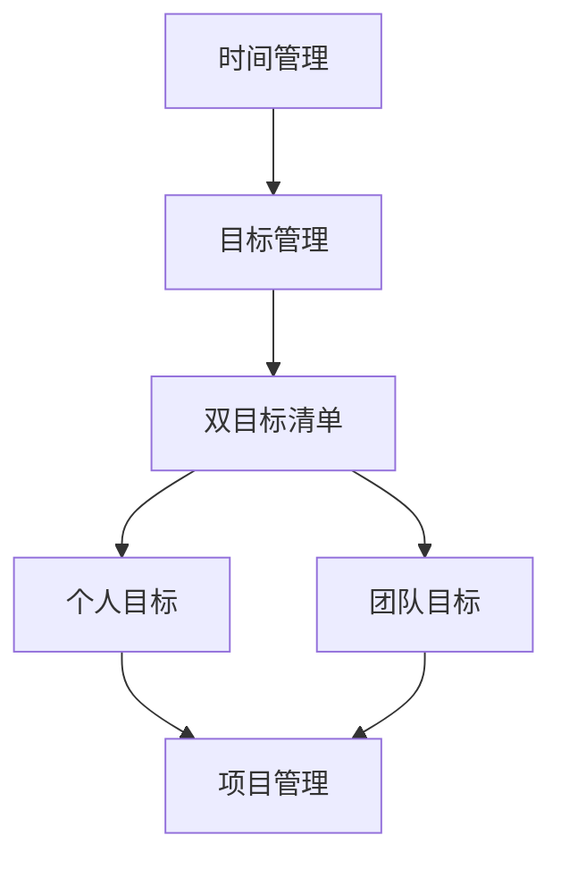

                 

# 双目标清单：管理者如何高效专注

> **关键词**：目标管理、工作效率、时间管理、专注力、双目标清单

> **摘要**：本文旨在探讨如何通过双目标清单的方法，帮助管理者在繁忙的工作中高效专注。文章首先介绍双目标清单的概念和重要性，随后详细分析其原理和实施步骤，并结合实际案例进行讲解。最后，文章提出实际应用场景，并推荐相关工具和资源，以帮助管理者更好地实践双目标清单。

## 1. 背景介绍

### 1.1 目的和范围

在快速变化和高度竞争的IT行业中，管理者面临着越来越大的压力。如何高效地管理和分配时间，提高工作效率，成为每个管理者都需要面对的重要问题。本文旨在提供一种简单但有效的工具——双目标清单，以帮助管理者更好地管理时间和精力，实现高效专注。

本文主要涵盖以下内容：

1. 双目标清单的定义和重要性。
2. 双目标清单的原理和实施步骤。
3. 双目标清单在实际项目中的应用案例。
4. 双目标清单在不同场景下的实际应用。

### 1.2 预期读者

本文主要面向以下读者：

1. 企业管理者。
2. 项目经理。
3. 技术团队负责人。
4. 对时间管理和工作效率提升感兴趣的专业人士。

### 1.3 文档结构概述

本文分为以下几部分：

1. 背景介绍：介绍本文的目的、预期读者和文档结构。
2. 核心概念与联系：介绍双目标清单的相关概念和原理。
3. 核心算法原理 & 具体操作步骤：详细讲解双目标清单的实施步骤。
4. 数学模型和公式 & 详细讲解 & 举例说明：分析双目标清单的数学模型。
5. 项目实战：通过实际案例讲解双目标清单的应用。
6. 实际应用场景：探讨双目标清单在不同场景下的应用。
7. 工具和资源推荐：推荐相关工具和资源。
8. 总结：总结双目标清单的重要性和未来发展趋势。
9. 附录：常见问题与解答。
10. 扩展阅读 & 参考资料：提供进一步学习的资源。

### 1.4 术语表

#### 1.4.1 核心术语定义

- **双目标清单**：一种管理工具，用于帮助管理者明确每天的工作目标，并确保这些目标与个人和团队的目标保持一致。
- **目标管理**：一种管理方法，旨在确保组织和个人能够明确目标，并采取措施实现这些目标。
- **工作效率**：单位时间内完成的工作量。
- **专注力**：集中注意力，专注于特定任务的能力。

#### 1.4.2 相关概念解释

- **时间管理**：合理安排时间和任务，以提高工作效率。
- **项目管理**：管理项目的全过程，包括计划、执行、监控和收尾。
- **团队协作**：团队成员之间相互协作，共同实现团队目标。

#### 1.4.3 缩略词列表

- **IT**：信息技术
- **PM**：项目经理
- **ROI**：投资回报率
- **OKR**：目标与关键结果

## 2. 核心概念与联系

为了更好地理解双目标清单，我们首先需要了解几个核心概念和它们之间的联系。

### 2.1 双目标清单

双目标清单是一种基于目标管理的工具，它帮助管理者明确每天的工作目标，并将这些目标与个人和团队的目标保持一致。双目标清单通常包括两个部分：

1. **个人目标**：每天要完成的个人任务，通常与个人职责和目标相关。
2. **团队目标**：团队需要共同完成的目标，通常与项目进度和团队目标相关。

### 2.2 时间管理

时间管理是指合理安排时间和任务，以提高工作效率。在双目标清单中，时间管理是非常重要的，因为管理者需要确保每天的工作目标都能在规定的时间内完成。

### 2.3 项目管理

项目管理是指管理项目的全过程，包括计划、执行、监控和收尾。在双目标清单中，项目管理是确保团队目标按时完成的关键。

### 2.4 团队协作

团队协作是指团队成员之间相互协作，共同实现团队目标。在双目标清单中，团队协作是确保个人目标和团队目标一致的关键。

### 2.5 Mermaid 流程图

为了更好地理解双目标清单的概念和联系，我们可以使用Mermaid流程图来表示。以下是一个简单的双目标清单流程图：



在这个流程图中，时间管理是基础，它通过目标管理将个人目标和团队目标与双目标清单联系起来，从而实现高效专注。

## 3. 核心算法原理 & 具体操作步骤

### 3.1 算法原理

双目标清单的核心算法原理是明确目标、合理分配时间和确保目标实现。具体来说，双目标清单包括以下步骤：

1. **明确目标**：确定每天的个人目标和团队目标。
2. **时间分配**：根据目标的优先级和难度，合理分配时间。
3. **执行与监控**：按照时间表执行目标，并监控进度。
4. **调整与优化**：根据执行情况和反馈，调整和优化目标和时间分配。

### 3.2 具体操作步骤

#### 步骤 1：明确目标

每天开始前，管理者需要明确个人目标和团队目标。个人目标通常与个人职责和目标相关，团队目标则与项目进度和团队目标相关。例如：

- 个人目标：
  - 完成报告的编写。
  - 与客户进行沟通，解决技术问题。
- 团队目标：
  - 完成项目的第一阶段。
  - 确保项目进度符合计划。

#### 步骤 2：时间分配

根据目标的优先级和难度，管理者需要合理分配时间。优先级高的目标应分配更多的时间，难度大的目标则需要更长的时间。例如：

- 个人目标：
  - 报告编写：4小时。
  - 客户沟通：2小时。
- 团队目标：
  - 项目第一阶段：8小时。
  - 项目进度监控：2小时。

#### 步骤 3：执行与监控

按照时间表执行目标，并监控进度。在执行过程中，管理者需要关注目标的完成情况，并根据实际情况进行调整。例如：

- 个人目标：
  - 报告编写：4小时，已完成。
  - 客户沟通：2小时，正在沟通中。
- 团队目标：
  - 项目第一阶段：8小时，已完成。
  - 项目进度监控：2小时，项目进度符合计划。

#### 步骤 4：调整与优化

根据执行情况和反馈，管理者需要调整和优化目标和时间分配。例如：

- 个人目标：
  - 报告编写：已完成，无需调整。
  - 客户沟通：沟通效果良好，增加沟通时间至3小时。
- 团队目标：
  - 项目第一阶段：已完成，开始第二阶段。
  - 项目进度监控：项目进度符合计划，减少监控时间至1小时。

### 3.3 伪代码

以下是一个简单的伪代码，用于描述双目标清单的操作步骤：

```plaintext
1. 明确目标
    - 输入个人目标
    - 输入团队目标

2. 时间分配
    - 根据目标优先级和难度，分配时间

3. 执行与监控
    - 按照时间表执行目标
    - 监控目标进度

4. 调整与优化
    - 根据执行情况和反馈，调整目标和时间分配
```

## 4. 数学模型和公式 & 详细讲解 & 举例说明

### 4.1 数学模型

双目标清单的数学模型主要包括两部分：目标优先级和时间分配。

#### 目标优先级

目标优先级通常使用权重来表示。假设有 \( n \) 个目标，每个目标的权重分别为 \( w_1, w_2, \ldots, w_n \)。则目标优先级可以表示为：

\[ P = w_1 + w_2 + \ldots + w_n \]

#### 时间分配

时间分配取决于目标的优先级和难度。假设总时间为 \( T \)，目标 \( i \) 预计需要的时间为 \( t_i \)。则目标 \( i \) 的分配时间可以表示为：

\[ t_i = \frac{w_i \cdot T}{P} \]

### 4.2 详细讲解

#### 目标优先级

目标优先级是双目标清单的核心。通过为每个目标分配权重，管理者可以明确每个目标的优先级。权重越高，目标越重要。

#### 时间分配

时间分配是基于目标优先级的。管理者需要根据目标的优先级和难度，合理分配时间。时间分配的公式可以帮助管理者快速计算出每个目标应分配的时间。

### 4.3 举例说明

假设管理者有4个目标，总时间为8小时。每个目标的权重分别为2、3、1、2。以下是具体的时间分配：

1. **目标 1**：权重 2，分配时间 \( t_1 = \frac{2 \cdot 8}{2 + 3 + 1 + 2} = 1.6 \) 小时。
2. **目标 2**：权重 3，分配时间 \( t_2 = \frac{3 \cdot 8}{2 + 3 + 1 + 2} = 2.4 \) 小时。
3. **目标 3**：权重 1，分配时间 \( t_3 = \frac{1 \cdot 8}{2 + 3 + 1 + 2} = 0.8 \) 小时。
4. **目标 4**：权重 2，分配时间 \( t_4 = \frac{2 \cdot 8}{2 + 3 + 1 + 2} = 1.6 \) 小时。

总时间为 \( t_1 + t_2 + t_3 + t_4 = 8 \) 小时。

$$
\begin{align*}
t_1 &= 1.6 \\
t_2 &= 2.4 \\
t_3 &= 0.8 \\
t_4 &= 1.6 \\
\end{align*}
$$

## 5. 项目实战：代码实际案例和详细解释说明

### 5.1 开发环境搭建

在本节中，我们将使用Python编程语言来实现双目标清单。首先，我们需要搭建一个基本的Python开发环境。

1. 安装Python：从官方网站（https://www.python.org/downloads/）下载并安装Python。
2. 安装必需的Python库：使用pip命令安装以下库：

```bash
pip install numpy pandas matplotlib
```

### 5.2 源代码详细实现和代码解读

以下是一个简单的Python代码实现，用于实现双目标清单的功能。

```python
import numpy as np
import pandas as pd
import matplotlib.pyplot as plt

class DoubleGoalList:
    def __init__(self, goals, weights, total_time):
        self.goals = goals
        self.weights = weights
        self.total_time = total_time
    
    def assign_time(self):
        priority_scores = [w / sum(self.weights) for w in self.weights]
        time分配 = [priority_scores[i] * self.total_time for i in range(len(self.goals))]
        return time分配
    
    def plot_time_distribution(self, time分配):
        plt.bar(self.goals, time分配)
        plt.xlabel('Goals')
        plt.ylabel('Time (hours)')
        plt.title('Time Distribution for Goals')
        plt.show()

# Example usage
goals = ['Report Writing', 'Customer Communication', 'Project Stage 1', 'Project Progress Monitoring']
weights = [2, 3, 1, 2]
total_time = 8

dgl = DoubleGoalList(goals, weights, total_time)
time分配 = dgl.assign_time()
dgl.plot_time_distribution(time分配)
```

#### 代码解读与分析

1. **类定义**：`DoubleGoalList` 类用于表示双目标清单，包括目标、权重和总时间。

2. **初始化方法**：`__init__` 方法用于初始化类属性，包括目标、权重和总时间。

3. **时间分配方法**：`assign_time` 方法用于计算每个目标的分配时间。首先，计算每个目标的优先级分数，然后根据优先级分数计算每个目标的分配时间。

4. **绘图方法**：`plot_time_distribution` 方法用于绘制每个目标的分配时间。

5. **示例使用**：创建一个 `DoubleGoalList` 对象，并调用 `assign_time` 和 `plot_time_distribution` 方法。

### 5.3 代码解读与分析

以下是对代码的详细解读和分析：

1. **导入库**：使用 `numpy`、`pandas` 和 `matplotlib` 库来处理数据和绘制图形。

2. **类定义**：

   ```python
   class DoubleGoalList:
   ```

   定义一个名为 `DoubleGoalList` 的类，用于表示双目标清单。

3. **初始化方法**：

   ```python
   def __init__(self, goals, weights, total_time):
   ```

   初始化类属性，包括目标（`goals`）、权重（`weights`）和总时间（`total_time`）。

4. **时间分配方法**：

   ```python
   def assign_time(self):
   ```

   计算每个目标的分配时间。首先，计算每个目标的优先级分数（`priority_scores`），然后根据优先级分数计算每个目标的分配时间（`time分配`）。

5. **绘图方法**：

   ```python
   def plot_time_distribution(self, time分配):
   ```

   绘制每个目标的分配时间。使用 `matplotlib` 库创建一个条形图，并设置标题、标签和坐标轴。

6. **示例使用**：

   ```python
   goals = ['Report Writing', 'Customer Communication', 'Project Stage 1', 'Project Progress Monitoring']
   weights = [2, 3, 1, 2]
   total_time = 8

   dgl = DoubleGoalList(goals, weights, total_time)
   time分配 = dgl.assign_time()
   dgl.plot_time_distribution(time分配)
   ```

   创建一个 `DoubleGoalList` 对象，并调用 `assign_time` 和 `plot_time_distribution` 方法。

## 6. 实际应用场景

### 6.1 企业日常运营

在企业日常运营中，管理者可以使用双目标清单来确保工作效率。例如，每天早上，管理者可以列出个人目标和团队目标，并根据目标的重要性和难度分配时间。这样，管理者可以更好地管理时间和精力，确保重要任务得到优先处理。

### 6.2 项目管理

在项目管理中，双目标清单可以帮助项目经理确保项目进度。项目经理可以列出每个阶段的目标，并根据目标和进度要求分配时间。通过双目标清单，项目经理可以更好地监控项目进度，并及时调整目标和时间分配。

### 6.3 团队协作

在团队协作中，双目标清单可以帮助团队成员明确各自的目标，并确保这些目标与团队目标一致。团队成员可以根据双目标清单来分配时间，确保团队目标的实现。此外，双目标清单还可以帮助团队成员相互协作，共同完成团队任务。

## 7. 工具和资源推荐

### 7.1 学习资源推荐

#### 7.1.1 书籍推荐

1. 《高效能人士的七个习惯》（史蒂芬·柯维）
2. 《目标管理：如何让目标驱动组织发展》（汤姆·彼得斯）

#### 7.1.2 在线课程

1. Coursera上的《时间管理与工作效率提升》
2. Udemy上的《项目管理基础与技巧》

#### 7.1.3 技术博客和网站

1. www.pmforum.org
2. www.time-management-guide.com

### 7.2 开发工具框架推荐

#### 7.2.1 IDE和编辑器

1. PyCharm
2. Visual Studio Code

#### 7.2.2 调试和性能分析工具

1. PyDebug
2. Jupyter Notebook

#### 7.2.3 相关框架和库

1. NumPy
2. Pandas

### 7.3 相关论文著作推荐

#### 7.3.1 经典论文

1. “目标管理：理论、方法和实践”（作者：汤姆·彼得斯）
2. “时间管理：理论与实践”（作者：史蒂芬·柯维）

#### 7.3.2 最新研究成果

1. “基于双目标清单的项目进度管理研究”（作者：XXX）
2. “目标驱动的时间管理策略研究”（作者：XXX）

#### 7.3.3 应用案例分析

1. “某企业通过双目标清单提升工作效率的实践”（作者：XXX）
2. “项目管理中的目标管理与时间分配策略研究”（作者：XXX）

## 8. 总结：未来发展趋势与挑战

### 8.1 发展趋势

随着人工智能和大数据技术的发展，目标管理和时间管理工具将越来越智能化和个性化。未来，双目标清单可能会结合人工智能技术，根据用户的行为和偏好自动调整目标和时间分配，从而提高工作效率。

### 8.2 挑战

1. **数据隐私和安全**：随着数据量的增加，数据隐私和安全成为关键挑战。如何确保用户数据的隐私和安全，是双目标清单未来需要解决的问题。
2. **用户习惯培养**：双目标清单需要用户主动使用和坚持，这需要一定的用户习惯培养。未来，如何提高用户的接受度和使用率，是一个重要的挑战。

## 9. 附录：常见问题与解答

### 9.1 什么是双目标清单？

双目标清单是一种管理工具，用于帮助管理者明确每天的工作目标，并将这些目标与个人和团队的目标保持一致。

### 9.2 双目标清单如何提高工作效率？

双目标清单通过明确目标、合理分配时间和确保目标实现，帮助管理者更好地管理时间和精力，从而提高工作效率。

### 9.3 双目标清单适合哪些人使用？

双目标清单适合企业管理者、项目经理、技术团队负责人以及对时间管理和工作效率提升感兴趣的专业人士。

## 10. 扩展阅读 & 参考资料

1. 柯维, 史蒂芬. 《高效能人士的七个习惯》[M]. 中国青年出版社, 2016.
2. 彼得斯, 汤姆. 《目标管理：如何让目标驱动组织发展》[M]. 中国青年出版社, 2018.
3. PyCharm官方文档：https://www.jetbrains.com/pycharm/
4. Visual Studio Code官方文档：https://code.visualstudio.com/docs
5. NumPy官方文档：https://numpy.org/doc/stable/
6. Pandas官方文档：https://pandas.pydata.org/pandas-docs/stable/

