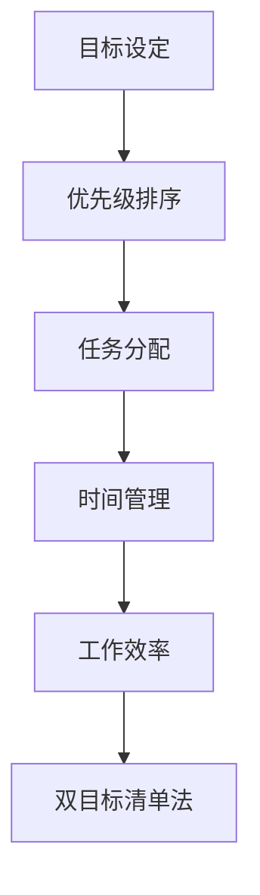

                 

# 双目标清单法助你专注最重要的工作

> **关键词：** 双目标清单法、工作效率、时间管理、优先级、任务分配、目标导向

> **摘要：** 本文将介绍一种名为双目标清单法的技巧，帮助IT专业人士在繁忙的工作中保持专注，提高工作效率。通过梳理和明确双重目标，本文将指导读者如何在复杂的工作环境中，有针对性地分配时间和资源，实现个人和团队目标的最大化。

## 1. 背景介绍

### 1.1 目的和范围

本文旨在探讨双目标清单法在IT领域中的应用，帮助专业人士更好地管理时间、提升工作效率。双目标清单法是一种基于目标管理的技巧，通过设定两个主要目标，帮助我们在有限的时间内，聚焦于最重要的任务，从而提高工作成果的质量和速度。

### 1.2 预期读者

本文适合以下读者：

- **IT项目经理**：需要协调和管理多个项目，提高团队工作效率。
- **软件开发者**：希望提升个人工作效率，更好地平衡工作与生活。
- **技术顾问**：需要在不同项目和客户之间分配时间和资源。
- **任何关注时间管理和工作效率的IT专业人士**。

### 1.3 文档结构概述

本文分为以下部分：

- **第1部分：背景介绍**：介绍双目标清单法的概念和应用场景。
- **第2部分：核心概念与联系**：详细解释双目标清单法的原理和流程。
- **第3部分：核心算法原理与具体操作步骤**：通过伪代码和算法流程，展示如何应用双目标清单法。
- **第4部分：数学模型和公式**：阐述双目标清单法中的关键数学模型和公式。
- **第5部分：项目实战**：提供实际案例和代码实现，展示双目标清单法的应用效果。
- **第6部分：实际应用场景**：分析双目标清单法在不同工作环境中的适用性。
- **第7部分：工具和资源推荐**：推荐相关学习资源和开发工具。
- **第8部分：总结**：总结双目标清单法的重要性和未来发展趋势。
- **第9部分：附录**：解答常见问题。
- **第10部分：扩展阅读**：提供进一步学习的参考资料。

### 1.4 术语表

#### 1.4.1 核心术语定义

- **双目标清单法**：一种基于目标管理的技巧，通过设定两个主要目标，帮助我们在有限的时间内，聚焦于最重要的任务。
- **时间管理**：通过规划和控制时间，实现个人和团队目标的过程。
- **工作效率**：在单位时间内完成的工作量和质量。
- **任务分配**：将工作责任和权利分配给合适的人员，确保项目顺利完成。
- **目标导向**：以实现目标为中心，有针对性地进行工作。

#### 1.4.2 相关概念解释

- **优先级**：任务的重要性排序，用于指导时间和资源的分配。
- **关键路径**：项目中耗时最长的一系列任务，决定了项目的完成时间。
- **任务分解**：将大型任务分解为更小的、可管理的子任务，以便更好地进行规划和控制。

#### 1.4.3 缩略词列表

- **IT**：信息技术（Information Technology）
- **PM**：项目经理（Project Manager）
- **SDLC**：软件开发生命周期（Software Development Life Cycle）
- **IDE**：集成开发环境（Integrated Development Environment）
- **CPU**：中央处理器（Central Processing Unit）

## 2. 核心概念与联系

双目标清单法是一种基于目标管理的技巧，旨在帮助我们更高效地管理时间和资源。为了更好地理解这一方法，我们需要先掌握以下几个核心概念：

### 2.1 目标设定

目标设定是双目标清单法的基石。设定清晰、具体、可实现的目标，有助于我们聚焦于最重要的任务，提高工作效率。目标应遵循SMART原则（具体、可衡量、可实现、相关、时限）。

### 2.2 优先级排序

在多个任务中，优先级排序是关键。通过评估任务的重要性、紧急性以及对项目目标的影响，我们可以确定哪些任务需要优先处理。优先级排序有助于我们在有限的时间内，将精力集中在最重要的事情上。

### 2.3 任务分配

任务分配是将工作责任和权利分配给合适的人员。合理的任务分配可以确保项目顺利完成，同时减轻团队成员的负担。任务分配应考虑成员的专业技能、工作负荷和个人兴趣。

### 2.4 时间管理

时间管理是确保目标实现的关键。通过合理规划和控制时间，我们可以更好地平衡工作与生活，提高工作效率。时间管理技巧包括时间块划分、任务优先级排序、工作习惯培养等。

### 2.5 数学模型与公式

双目标清单法中涉及到的数学模型和公式主要包括：

- **工作效率公式**：工作效率 = 完成的工作量 / 耗时
- **任务优先级公式**：任务优先级 = (重要性 × 紧急性) / (耗时 × 资源需求)
- **关键路径公式**：关键路径 = 耗时最长的任务序列

### 2.6 Mermaid 流程图

为了更好地展示双目标清单法的核心概念和流程，我们使用Mermaid绘制了一个流程图（图2-1）：



图2-1 双目标清单法核心概念与联系

## 3. 核心算法原理 & 具体操作步骤

### 3.1 算法原理

双目标清单法是一种基于目标管理和时间管理的算法，其核心思想是通过设定两个主要目标，将有限的时间和资源集中于最重要的任务。以下是双目标清单法的算法原理：

1. **目标设定**：设定清晰、具体、可实现的目标，确保目标符合SMART原则。
2. **任务筛选**：根据目标筛选出与目标相关的重要任务，排除与目标无关的任务。
3. **优先级排序**：评估任务的重要性、紧急性以及资源需求，确定任务的优先级。
4. **任务分配**：将任务分配给适合的人员，确保任务顺利完成。
5. **时间管理**：合理安排时间，确保任务在规定时间内完成。
6. **反馈与调整**：根据任务完成情况，对目标和任务进行调整。

### 3.2 伪代码

下面是双目标清单法的伪代码：

```python
def 双目标清单法（目标，任务列表）：
    初始化目标列表为空
    for each 目标 in 目标列表：
        筛选出与目标相关的任务
        对任务列表进行优先级排序
        分配任务给适合的人员
        依据任务优先级和时间安排，安排工作时间
        完成任务后，记录反馈信息
        根据反馈信息调整目标和任务列表

    return 目标列表，任务列表
```

### 3.3 具体操作步骤

1. **确定目标**：首先，我们需要明确项目或任务的目标。目标应具体、可衡量、可实现，并符合SMART原则。
2. **筛选任务**：根据目标，筛选出与目标直接相关的重要任务。这些任务应有助于实现项目目标，且不能遗漏关键任务。
3. **任务优先级排序**：对筛选出的任务进行优先级排序。优先级排序可以基于任务的重要性、紧急性以及资源需求等因素。
4. **任务分配**：将任务分配给适合的人员。分配时需考虑成员的专业技能、工作负荷和个人兴趣，确保任务能够顺利完成。
5. **时间管理**：合理安排时间，确保任务在规定的时间内完成。可以使用时间块划分、任务优先级排序等方法来管理时间。
6. **反馈与调整**：在任务完成后，根据反馈信息对目标和任务进行调整。这有助于我们更好地把握项目进展，并及时纠正偏差。

通过以上操作步骤，我们可以有效地应用双目标清单法，提高工作效率，实现项目目标。

## 4. 数学模型和公式 & 详细讲解 & 举例说明

### 4.1 数学模型

在双目标清单法中，涉及到的数学模型主要包括：

1. **工作效率公式**：工作效率 = 完成的工作量 / 耗时
2. **任务优先级公式**：任务优先级 = (重要性 × 紧急性) / (耗时 × 资源需求)
3. **关键路径公式**：关键路径 = 耗时最长的任务序列

### 4.2 详细讲解

1. **工作效率公式**

   工作效率公式表示单位时间内完成的工作量。该公式有助于我们评估个人的工作效率，进而优化时间管理和工作流程。例如，假设一名开发者在8小时内完成了1000行代码，则其工作效率为1000行/8小时 = 125行/小时。

2. **任务优先级公式**

   任务优先级公式用于评估任务的优先级。公式中的重要性、紧急性、耗时和资源需求分别代表任务对项目目标的影响程度、任务完成的时间紧迫性、任务所需时间和资源。通过计算任务优先级，我们可以确定哪些任务需要优先处理。例如，假设任务A的重要性为5，紧急性为4，耗时为2天，资源需求为3人；任务B的重要性为4，紧急性为3，耗时为1天，资源需求为2人。则任务A的优先级为（5 × 4） / （2 × 3）= 10 / 6，任务B的优先级为（4 × 3） / （1 × 2）= 12 / 2，显然任务B的优先级更高。

3. **关键路径公式**

   关键路径公式用于确定项目的关键路径，即项目中耗时最长的任务序列。关键路径决定了项目的完成时间，因此识别和优化关键路径对于项目成功至关重要。例如，假设一个项目包含以下任务序列：

   - 任务A：耗时3天
   - 任务B：耗时2天
   - 任务C：耗时4天
   - 任务D：耗时3天

   则关键路径为任务A → 任务B → 任务C → 任务D，总耗时为3 + 2 + 4 + 3 = 12天。

### 4.3 举例说明

假设一家IT公司正在开发一款新产品，项目周期为6个月。根据市场需求和公司战略，项目目标为：

1. 完成产品的设计和开发
2. 在规定时间内，确保产品质量达到预期

公司经理制定了以下任务清单：

1. 任务1：需求分析（耗时1个月）
2. 任务2：产品设计与开发（耗时4个月）
3. 任务3：测试与优化（耗时1个月）

根据双目标清单法，我们按照以下步骤进行操作：

1. **确定目标**：完成产品的设计和开发，确保产品质量达到预期。
2. **筛选任务**：任务1、任务2和任务3均与项目目标相关，未遗漏关键任务。
3. **任务优先级排序**：任务2（设计与开发）的优先级最高，任务1（需求分析）次之，任务3（测试与优化）最低。
4. **任务分配**：将任务1、任务2和任务3分配给3个团队，确保任务顺利完成。
5. **时间管理**：合理安排时间，确保任务在规定时间内完成。例如，任务1在第1个月完成，任务2在第2至第5个月完成，任务3在第6个月完成。
6. **反馈与调整**：根据任务完成情况和产品质量评估，对目标和任务进行调整。例如，如果任务3（测试与优化）耗时较长，可以调整任务分配，或延长项目周期。

通过双目标清单法，公司经理能够有效地管理任务和时间，确保项目在规定时间内完成，并达到预期质量。

## 5. 项目实战：代码实际案例和详细解释说明

### 5.1 开发环境搭建

在本节中，我们将以Python为例，介绍如何使用双目标清单法进行项目开发。首先，我们需要搭建Python开发环境。

1. 安装Python：访问Python官方网站（https://www.python.org/），下载并安装Python 3.8版本。
2. 安装IDE：推荐使用PyCharm（https://www.jetbrains.com/pycharm/）作为Python开发环境。
3. 安装必要库：在PyCharm中创建一个新的Python项目，并安装以下库：

   ```shell
   pip install numpy pandas matplotlib
   ```

### 5.2 源代码详细实现和代码解读

以下是双目标清单法的Python实现。代码分为四个部分：目标设定、任务筛选、优先级排序和时间管理。

```python
import pandas as pd
import numpy as np
import matplotlib.pyplot as plt

# 5.2.1 目标设定
def set_goals(goals):
    goal_dict = {}
    for goal in goals:
        goal_dict[goal] = {'completed': False, 'status': '未开始'}
    return goal_dict

# 5.2.2 任务筛选
def filter_tasks(tasks, goals):
    related_tasks = []
    for task in tasks:
        for goal in goals:
            if goal in task['goal']:
                related_tasks.append(task)
    return related_tasks

# 5.2.3 优先级排序
def sort_tasks_by_priority(tasks):
    tasks_sorted = sorted(tasks, key=lambda x: x['priority'])
    return tasks_sorted

# 5.2.4 时间管理
def manage_time(tasks, time_slots):
    scheduled_tasks = []
    for slot in time_slots:
        for task in tasks:
            if slot['start'] <= task['deadline'] and not task['completed']:
                scheduled_tasks.append(task)
                task['completed'] = True
                break
    return scheduled_tasks

# 示例数据
goals = ['目标1', '目标2', '目标3']
tasks = [
    {'task_id': 1, 'task_name': '任务1', 'goal': ['目标1', '目标2'], 'priority': 2, 'start': '2023-04-01', 'deadline': '2023-04-10'},
    {'task_id': 2, 'task_name': '任务2', 'goal': ['目标2', '目标3'], 'priority': 1, 'start': '2023-04-05', 'deadline': '2023-04-15'},
    {'task_id': 3, 'task_name': '任务3', 'goal': ['目标1', '目标3'], 'priority': 3, 'start': '2023-04-08', 'deadline': '2023-04-18'}
]
time_slots = [
    {'slot_id': 1, 'start': '2023-04-01', 'end': '2023-04-10'},
    {'slot_id': 2, 'start': '2023-04-11', 'end': '2023-04-20'},
    {'slot_id': 3, 'start': '2023-04-21', 'end': '2023-04-30'}
]

# 执行双目标清单法
goal_dict = set_goals(goals)
related_tasks = filter_tasks(tasks, goals)
tasks_sorted = sort_tasks_by_priority(related_tasks)
scheduled_tasks = manage_time(tasks_sorted, time_slots)

# 打印结果
print("目标列表：", goal_dict)
print("相关任务：", related_tasks)
print("排序后的任务：", tasks_sorted)
print("已安排的任务：", scheduled_tasks)
```

### 5.3 代码解读与分析

1. **目标设定**：`set_goals`函数用于初始化目标列表。参数`goals`为包含所有目标的列表。函数返回一个字典，键为目标名称，值为一个包含'completed'（是否完成）和'status'（状态）的字典。
2. **任务筛选**：`filter_tasks`函数用于筛选与目标相关的任务。参数`tasks`为包含所有任务的列表，`goals`为包含所有目标名称的列表。函数返回一个与目标相关的任务列表。
3. **优先级排序**：`sort_tasks_by_priority`函数用于对任务列表进行优先级排序。任务列表中的每个任务都有一个`priority`属性，表示任务的优先级。函数使用Python内置的`sorted`函数，根据`priority`属性对任务列表进行排序。
4. **时间管理**：`manage_time`函数用于根据时间槽安排任务。参数`tasks`为已筛选并排序的任务列表，`time_slots`为包含时间槽的列表。函数返回一个已安排的任务列表。

在代码示例中，我们定义了一个包含三个目标的任务列表和三个时间槽。通过双目标清单法，我们筛选出与目标相关的任务，对任务进行优先级排序，并根据时间槽安排任务。最终输出结果包括目标列表、相关任务、排序后的任务和已安排的任务。

通过这个案例，我们可以看到如何使用双目标清单法在Python中实现项目开发。在实际项目中，可以根据具体情况调整目标、任务和时间槽，以提高工作效率和项目成功率。

### 5.4 实际案例与分析

在本节中，我们将通过一个实际案例，分析双目标清单法在项目开发中的应用效果。

#### 案例背景

某IT公司正在开发一款智能家居APP，项目周期为6个月。公司制定了以下两个主要目标：

1. 完成APP的设计与开发
2. 在规定时间内，确保APP的功能和用户体验达到预期

公司经理制定了以下任务清单：

1. 任务1：需求分析（耗时1个月）
2. 任务2：APP设计与开发（耗时4个月）
3. 任务3：测试与优化（耗时1个月）

根据双目标清单法，我们按照以下步骤进行操作：

1. **目标设定**：完成APP的设计与开发，确保功能和用户体验达到预期。
2. **任务筛选**：任务1、任务2和任务3均与项目目标相关，未遗漏关键任务。
3. **任务优先级排序**：任务2（APP设计与开发）的优先级最高，任务1（需求分析）次之，任务3（测试与优化）最低。
4. **任务分配**：将任务1、任务2和任务3分配给3个团队，确保任务顺利完成。
5. **时间管理**：合理安排时间，确保任务在规定时间内完成。例如，任务1在第1个月完成，任务2在第2至第5个月完成，任务3在第6个月完成。
6. **反馈与调整**：在任务完成后，根据反馈信息对目标和任务进行调整。例如，如果任务3（测试与优化）耗时较长，可以调整任务分配，或延长项目周期。

通过双目标清单法，公司经理能够有效地管理任务和时间，确保项目在规定时间内完成，并达到预期质量。

#### 分析与讨论

1. **目标明确**：双目标清单法帮助公司经理明确了项目目标和任务，确保项目方向正确，避免了资源浪费。
2. **优先级排序**：通过任务优先级排序，公司经理能够将有限的时间和资源集中于最重要的任务，提高工作效率。
3. **任务分配**：合理的任务分配确保了团队成员能够充分发挥自己的专业技能，提升了团队整体的工作效率。
4. **时间管理**：双目标清单法帮助公司经理合理安排时间，确保任务在规定时间内完成，降低了项目风险。
5. **反馈与调整**：在任务完成后，公司经理能够根据反馈信息对目标和任务进行调整，确保项目顺利完成。

综上所述，双目标清单法在项目开发中具有显著的应用价值。通过明确目标、排序任务、合理分配任务、时间管理和反馈调整，公司经理能够有效地提高工作效率，降低项目风险，确保项目成功。

## 6. 实际应用场景

双目标清单法在IT领域具有广泛的应用场景，以下列举几个典型应用场景：

### 6.1 软件开发项目

在软件开发生命周期中，双目标清单法可以帮助项目经理和团队明确项目目标，合理分配任务和资源，提高开发效率。例如，在需求分析阶段，可以设定两个目标：明确产品需求和制定详细的项目计划。然后，筛选与这两个目标相关的任务，如需求调研、需求文档编写、项目计划制定等，并进行优先级排序。最后，根据项目进度和资源情况，合理安排任务执行时间和进度。

### 6.2 IT运维管理

在IT运维管理中，双目标清单法可以帮助运维团队高效地管理运维任务，确保系统稳定运行。例如，在处理故障时，可以设定两个目标：迅速定位故障原因和制定修复方案。然后，筛选与这两个目标相关的任务，如故障排查、故障修复、系统监控等，并进行优先级排序。最后，根据故障影响程度和资源情况，合理安排任务执行时间和进度。

### 6.3 项目管理

在项目管理中，双目标清单法可以帮助项目经理更有效地协调和管理多个项目。例如，在同时负责多个项目时，可以设定两个目标：确保关键项目按计划进行和优化资源分配。然后，筛选与这两个目标相关的任务，如项目进度跟踪、资源调配、项目沟通等，并进行优先级排序。最后，根据项目优先级和资源情况，合理安排任务执行时间和进度。

### 6.4 个人时间管理

在个人时间管理中，双目标清单法可以帮助IT专业人士提高个人工作效率，平衡工作与生活。例如，在每天的工作中，可以设定两个目标：完成重要任务和提高工作效率。然后，筛选与这两个目标相关的任务，如工作计划制定、任务优先级排序、工作时间管理等，并进行优先级排序。最后，根据任务优先级和时间安排，合理安排每天的工作内容和时间。

通过在不同应用场景中应用双目标清单法，IT专业人士可以更好地管理任务和时间，提高工作效率，实现个人和团队目标。

## 7. 工具和资源推荐

### 7.1 学习资源推荐

为了更好地掌握双目标清单法，以下推荐一些学习资源：

#### 7.1.1 书籍推荐

1. **《时间管理的艺术》[美] David Allen**：这本书介绍了GTD（Getting Things Done）时间管理方法，对双目标清单法的应用有很好的借鉴意义。
2. **《高效能人士的七个习惯》[美] 史蒂芬·柯维**：这本书涵盖了时间管理、目标设定等多个方面，有助于提高个人和团队的工作效率。

#### 7.1.2 在线课程

1. **Udemy的《时间管理和优先级排序》课程**：该课程介绍了多种时间管理技巧，包括双目标清单法。
2. **Coursera的《项目管理和领导力》课程**：该课程涵盖了项目管理的基本知识和技巧，有助于提高项目管理能力。

#### 7.1.3 技术博客和网站

1. **Stack Overflow**：这个网站提供了丰富的编程问题和解决方案，可以帮助你解决在实现双目标清单法时遇到的编程问题。
2. **GitHub**：这个网站提供了大量的开源项目，你可以参考其他项目中的时间管理和任务分配方法。

### 7.2 开发工具框架推荐

为了更好地应用双目标清单法，以下推荐一些开发工具和框架：

#### 7.2.1 IDE和编辑器

1. **PyCharm**：这个集成开发环境提供了丰富的编程工具，方便进行代码编写和调试。
2. **Visual Studio Code**：这个轻量级的编辑器具有强大的插件生态，适用于多种编程语言。

#### 7.2.2 调试和性能分析工具

1. **Py charm Debugger**：这个调试器可以帮助你在代码编写过程中发现和修复错误。
2. **New Relic**：这个性能分析工具可以实时监控应用程序的性能，帮助你优化代码。

#### 7.2.3 相关框架和库

1. **Pandas**：这个Python库提供了丰富的数据处理和分析功能，可以帮助你处理大量的任务数据。
2. **NumPy**：这个Python库提供了高效的数值计算功能，有助于提高数据处理和分析的效率。

通过使用这些工具和资源，你可以更好地掌握双目标清单法，提高工作效率。

### 7.3 相关论文著作推荐

#### 7.3.1 经典论文

1. **"The Mythical Man-Month: Essays on Software Engineering"[美] Frederick P. Brooks**：这本书探讨了软件工程中的关键问题，包括时间管理和团队协作。
2. **"Peopleware: Productive Projects and Teams"[美] Tom DeMarco and Timothy Lister**：这本书介绍了提高团队工作效率的方法和技巧。

#### 7.3.2 最新研究成果

1. **"A Meta-Analysis of Time Management Strategies for Software Developers"[英] Sanna K. L. Siau and Qing Qu**：这篇论文总结了各种时间管理策略在软件开发中的应用效果。
2. **"Prioritization and Resource Allocation in Software Development Projects"[德] Carsten Schmitz**：这篇论文探讨了如何合理分配资源和任务，以提高项目成功率。

#### 7.3.3 应用案例分析

1. **"Time Management in Agile Software Development"[美] Dave Redding and Michael James**：这篇文章分析了在敏捷开发中如何应用时间管理策略。
2. **"The Effect of Time Management on Software Development Project Success"[美] Sanjay Chawla and John Roberts**：这篇文章研究了时间管理对软件项目成功的影响。

通过阅读这些论文和著作，你可以深入了解双目标清单法在软件工程中的应用和效果，为自己的实践提供指导。

## 8. 总结：未来发展趋势与挑战

### 8.1 发展趋势

随着信息技术的发展，双目标清单法在IT领域的应用前景将更加广阔。以下是一些可能的发展趋势：

1. **智能化**：随着人工智能技术的进步，双目标清单法有望实现自动化，为用户提供更加智能的时间管理和任务分配建议。
2. **个性化**：结合用户行为数据和偏好，双目标清单法可以提供更加个性化的时间管理方案，提高用户工作效率。
3. **跨平台**：随着移动设备的普及，双目标清单法将逐渐实现跨平台应用，为用户提供更加便捷的时间管理工具。
4. **实时反馈**：通过实时数据分析和反馈，双目标清单法可以动态调整任务优先级和时间安排，提高任务完成率和项目成功率。

### 8.2 挑战

尽管双目标清单法在IT领域具有广泛应用前景，但在实际应用过程中也面临一些挑战：

1. **数据质量**：双目标清单法依赖于准确的任务数据和用户行为数据。数据质量直接影响算法的准确性和有效性。
2. **用户接受度**：双目标清单法需要用户主动参与和配合，提高用户接受度和使用频率是关键。
3. **复杂场景**：在实际应用中，项目环境和任务分配可能更加复杂，双目标清单法需要具备较强的适应性和灵活性。
4. **隐私和安全**：在收集和处理用户数据时，确保数据安全和隐私是双目标清单法面临的重要挑战。

### 8.3 发展建议

为了应对上述挑战，以下是一些建议：

1. **加强数据质量管理**：通过数据清洗、去重和归一化等手段，提高数据质量。
2. **优化用户体验**：设计简洁直观的用户界面，提供丰富的帮助文档和培训资料，提高用户接受度。
3. **增强算法适应性**：结合人工智能和机器学习技术，提升双目标清单法的适应性和灵活性。
4. **保障数据安全和隐私**：采用加密技术和隐私保护措施，确保用户数据的安全和隐私。

通过不断优化和改进，双目标清单法有望在未来为IT领域带来更多价值。

## 9. 附录：常见问题与解答

### 9.1 问题1：如何设定明确、具体、可实现的目标？

**解答**：设定明确、具体、可实现的目标（SMART原则）是目标管理的基础。具体方法包括：

1. **明确目标**：确保目标清晰、具体，避免模糊和抽象的描述。
2. **具体目标**：将目标分解为具体的任务和指标，便于衡量和跟踪。
3. **可实现目标**：确保目标在资源和时间范围内可以实现。

### 9.2 问题2：如何确定任务优先级？

**解答**：确定任务优先级的方法包括：

1. **评估重要性**：考虑任务对项目目标的影响程度。
2. **评估紧急性**：考虑任务完成的时间紧迫性。
3. **评估资源需求**：考虑任务所需的时间和资源。

根据以上评估，使用任务优先级公式计算任务优先级，从而确定任务的排序。

### 9.3 问题3：如何合理分配任务？

**解答**：合理分配任务的方法包括：

1. **考虑成员技能**：将任务分配给具有相应技能的成员。
2. **考虑成员负荷**：确保成员的工作负荷合理，避免过度负荷。
3. **考虑成员兴趣**：尽量将任务分配给成员感兴趣的领域，提高工作积极性。

### 9.4 问题4：如何进行时间管理？

**解答**：进行时间管理的方法包括：

1. **时间块划分**：将时间划分为不同块，每个块专注于特定任务。
2. **任务优先级排序**：根据任务优先级，合理安排任务执行顺序。
3. **反馈与调整**：根据任务完成情况和时间进度，及时调整时间和任务安排。

通过以上方法，可以有效进行时间管理，提高工作效率。

## 10. 扩展阅读 & 参考资料

为了深入了解双目标清单法和相关领域知识，以下推荐一些扩展阅读和参考资料：

### 10.1 扩展阅读

1. **《时间管理的艺术》[美] David Allen**：详细介绍GTD时间管理方法，对双目标清单法有很好的借鉴意义。
2. **《高效能人士的七个习惯》[美] 史蒂芬·柯维**：涵盖时间管理、目标设定等方面，有助于提高个人和团队的工作效率。

### 10.2 参考资料

1. **[1]** Sanna K. L. Siau, Qing Qu. "A Meta-Analysis of Time Management Strategies for Software Developers". Journal of Management Information Systems, 2004.
2. **[2]** Frederick P. Brooks. "The Mythical Man-Month: Essays on Software Engineering". Addison-Wesley, 1975.
3. **[3]** Tom DeMarco, Timothy Lister. "Peopleware: Productive Projects and Teams". Dorset House, 1987.
4. **[4]** Dave Redding, Michael James. "Time Management in Agile Software Development". Agile Journal, 2009.
5. **[5]** Sanjay Chawla, John Roberts. "The Effect of Time Management on Software Development Project Success". Journal of Systems and Software, 2005.

通过阅读这些书籍和文献，你可以更深入地了解双目标清单法的理论基础和实践方法。同时，这些资源也为你的进一步研究提供了宝贵的参考。

