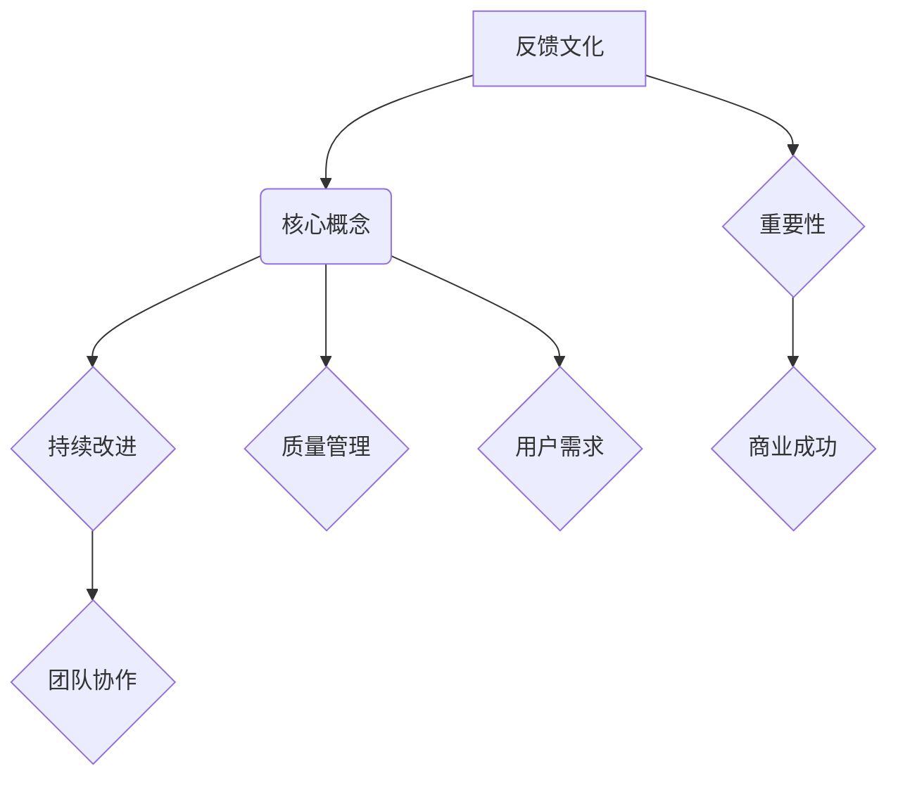
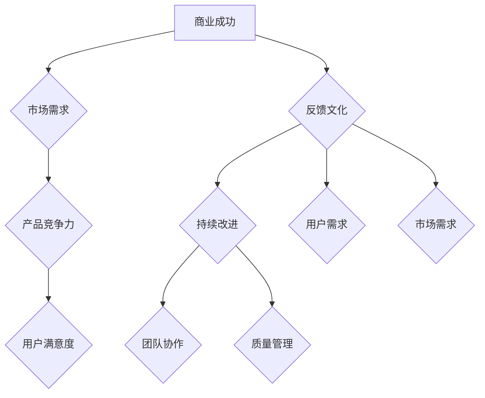

                 

# 反馈文化：持续改进的动力源泉

> **关键词：** 反馈文化，持续改进，动力源泉，IT领域，项目管理，团队协作。

> **摘要：** 本文深入探讨了反馈文化在IT领域的核心作用，以及如何通过构建有效的反馈机制来推动团队持续改进。文章首先介绍了反馈文化的概念和重要性，然后详细阐述了如何在实际项目中应用反馈机制，最后提出了未来发展趋势与挑战。通过本文的阅读，读者将了解如何构建一个以反馈为中心的工作环境，从而提升项目质量和团队协作效率。

## 1. 背景介绍

### 1.1 目的和范围

本文旨在探讨反馈文化在IT领域的核心作用，以及如何通过构建有效的反馈机制来推动团队持续改进。文章将涵盖以下主题：

- 反馈文化的概念与重要性。
- 反馈机制的构建与应用。
- 实际项目中的应用案例。
- 未来发展趋势与挑战。

通过本文的阅读，读者将了解如何构建一个以反馈为中心的工作环境，从而提升项目质量和团队协作效率。

### 1.2 预期读者

本文适用于以下读者群体：

- IT项目经理和团队领导。
- 软件开发工程师和测试工程师。
- 产品经理和业务分析师。
- 对IT项目管理感兴趣的学术界和业界人士。

### 1.3 文档结构概述

本文分为以下章节：

- **1. 背景介绍**：介绍本文的目的、范围、预期读者和文档结构。
- **2. 核心概念与联系**：阐述反馈文化的概念、核心原理和架构。
- **3. 核心算法原理 & 具体操作步骤**：讲解反馈机制的具体操作步骤。
- **4. 数学模型和公式 & 详细讲解 & 举例说明**：介绍反馈文化的数学模型和公式。
- **5. 项目实战：代码实际案例和详细解释说明**：通过实际案例展示反馈文化的应用。
- **6. 实际应用场景**：探讨反馈文化在不同领域的应用。
- **7. 工具和资源推荐**：推荐学习资源、开发工具和框架。
- **8. 总结：未来发展趋势与挑战**：总结本文的核心观点和未来发展趋势。
- **9. 附录：常见问题与解答**：回答读者可能遇到的问题。
- **10. 扩展阅读 & 参考资料**：提供进一步阅读和参考资料。

### 1.4 术语表

#### 1.4.1 核心术语定义

- **反馈文化**：一种重视反馈、鼓励持续改进的组织文化。
- **反馈机制**：用于收集、处理和利用反馈信息的过程和工具。
- **持续改进**：通过不断收集和分析反馈信息，逐步优化项目质量和团队协作效率。
- **迭代**：在软件开发过程中，逐步完善和优化产品功能的过程。

#### 1.4.2 相关概念解释

- **敏捷开发**：一种以用户需求为导向的软件开发方法，强调快速迭代和持续改进。
- **质量管理**：通过制定和执行一系列标准和流程，确保项目质量的过程。
- **团队协作**：团队成员共同完成项目任务，相互支持、沟通和协作的过程。

#### 1.4.3 缩略词列表

- **IT**：信息技术（Information Technology）
- **PM**：项目经理（Project Manager）
- **QA**：质量保证（Quality Assurance）
- **CI/CD**：持续集成/持续交付（Continuous Integration/Continuous Deployment）

## 2. 核心概念与联系

在深入探讨反馈文化之前，我们需要了解一些核心概念和它们之间的联系。以下是一个简化的Mermaid流程图，用于描述反馈文化的基本原理和架构：



### 2.1 反馈文化的核心概念

#### 持续改进

持续改进是反馈文化的核心概念之一。它强调通过不断收集和分析反馈信息，逐步优化项目质量和团队协作效率。持续改进的目的是确保项目能够在快速变化的市场环境中保持竞争力。

#### 团队协作

团队协作是另一个核心概念。在反馈文化中，团队协作至关重要，因为它有助于确保团队成员能够共同理解和解决问题。良好的团队协作可以提高项目的成功率和团队的士气。

#### 质量管理

质量管理是反馈文化的另一个关键组成部分。通过制定和执行一系列标准和流程，项目团队能够确保项目质量符合预期。质量管理包括需求分析、设计、开发、测试和部署等各个环节。

#### 用户需求

用户需求是反馈文化的关键驱动力。通过持续收集和分析用户反馈，团队能够更好地理解用户需求，从而改进产品功能和用户体验。

### 2.2 反馈文化与商业成功的关系

反馈文化与商业成功之间有着紧密的联系。一个重视反馈文化的组织能够更好地满足用户需求，提高项目质量，从而在竞争激烈的市场中获得优势。以下是反馈文化与商业成功之间的Mermaid流程图：



通过上述流程图，我们可以看到反馈文化在商业成功中的作用。一个重视反馈文化的组织能够更好地满足市场需求，提高产品竞争力，从而实现商业成功。

## 3. 核心算法原理 & 具体操作步骤

在理解了反馈文化的核心概念之后，我们需要了解如何在实际项目中应用反馈机制。以下是一个简化的反馈机制操作步骤，使用伪代码进行详细阐述：

```python
# 定义反馈机制操作步骤
def feedback_mechanism(feedback_data):
    """
    收集、处理和利用反馈信息的过程。
    
    参数：
    - feedback_data：反馈信息数据。
    
    返回值：
    - 改进建议。
    """
    
    # 步骤1：收集反馈信息
    collected_feedback = collect_feedback(feedback_data)
    
    # 步骤2：处理反馈信息
    processed_feedback = process_feedback(collected_feedback)
    
    # 步骤3：利用反馈信息进行改进
    improvement_suggestions = utilize_feedback(processed_feedback)
    
    return improvement_suggestions

# 定义辅助函数
def collect_feedback(feedback_data):
    """
    收集反馈信息。
    
    参数：
    - feedback_data：反馈信息数据。
    
    返回值：
    - 收集到的反馈信息。
    """
    # 根据反馈数据来源进行收集，如用户调研、产品评测、团队内部评审等
    collected_feedback = feedback_data
    
    return collected_feedback

def process_feedback(collected_feedback):
    """
    处理反馈信息。
    
    参数：
    - collected_feedback：收集到的反馈信息。
    
    返回值：
    - 处理后的反馈信息。
    """
    # 对收集到的反馈信息进行分类、整理和分析
    processed_feedback = analyze_feedback(collected_feedback)
    
    return processed_feedback

def utilize_feedback(processed_feedback):
    """
    利用反馈信息进行改进。
    
    参数：
    - processed_feedback：处理后的反馈信息。
    
    返回值：
    - 改进建议。
    """
    # 根据分析结果，制定改进措施和行动计划
    improvement_suggestions = create_improvement_plan(processed_feedback)
    
    return improvement_suggestions
```

### 3.1 收集反馈信息

收集反馈信息是反馈机制的第一步。在这一步中，我们需要从不同的来源收集反馈信息。以下是一个简化的伪代码示例，用于描述收集反馈信息的过程：

```python
def collect_feedback(feedback_data):
    """
    收集反馈信息。
    
    参数：
    - feedback_data：反馈信息数据。
    
    返回值：
    - 收集到的反馈信息。
    """
    collected_feedback = []
    
    # 从用户调研中收集反馈
    user_surveys = survey_users(feedback_data)
    collected_feedback.extend(user_surveys)
    
    # 从产品评测中收集反馈
    product_reviews = review_products(feedback_data)
    collected_feedback.extend(product_reviews)
    
    # 从团队内部评审中收集反馈
    internal_reviews = internal_review(feedback_data)
    collected_feedback.extend(internal_reviews)
    
    return collected_feedback
```

### 3.2 处理反馈信息

处理反馈信息是反馈机制的第二步。在这一步中，我们需要对收集到的反馈信息进行分类、整理和分析。以下是一个简化的伪代码示例，用于描述处理反馈信息的过程：

```python
def process_feedback(collected_feedback):
    """
    处理反馈信息。
    
    参数：
    - collected_feedback：收集到的反馈信息。
    
    返回值：
    - 处理后的反馈信息。
    """
    processed_feedback = []
    
    # 对收集到的反馈信息进行分类
    categorized_feedback = categorize_feedback(collected_feedback)
    
    # 对每个分类的反馈信息进行整理
    for category, feedback_list in categorized_feedback.items():
        organized_feedback = organize_feedback(feedback_list)
        processed_feedback.append((category, organized_feedback))
    
    return processed_feedback
```

### 3.3 利用反馈信息进行改进

利用反馈信息进行改进是反馈机制的第三步。在这一步中，我们需要根据分析结果制定改进措施和行动计划。以下是一个简化的伪代码示例，用于描述利用反馈信息进行改进的过程：

```python
def utilize_feedback(processed_feedback):
    """
    利用反馈信息进行改进。
    
    参数：
    - processed_feedback：处理后的反馈信息。
    
    返回值：
    - 改进建议。
    """
    improvement_suggestions = []
    
    # 根据每个分类的反馈信息，制定改进措施和行动计划
    for category, organized_feedback in processed_feedback:
        if category == "用户体验":
            suggestions = improve_user_experience(organized_feedback)
            improvement_suggestions.extend(suggestions)
        elif category == "功能需求":
            suggestions = improve_functionality(organized_feedback)
            improvement_suggestions.extend(suggestions)
        # 其他分类的改进建议
    
    return improvement_suggestions
```

通过上述伪代码示例，我们可以看到如何在实际项目中应用反馈机制。收集、处理和利用反馈信息的过程可以帮助项目团队不断改进项目质量和团队协作效率。

## 4. 数学模型和公式 & 详细讲解 & 举例说明

在反馈文化中，数学模型和公式可以用来量化反馈信息，评估改进效果，并优化反馈机制。以下是一些常用的数学模型和公式，以及它们在反馈文化中的应用。

### 4.1 回归分析

回归分析是一种常用的统计方法，用于分析自变量和因变量之间的关系。在反馈文化中，回归分析可以用来评估用户反馈对产品改进的影响。

#### 公式：

$$
y = \beta_0 + \beta_1x_1 + \beta_2x_2 + ... + \beta_nx_n
$$

其中，$y$ 是因变量，$x_1, x_2, ..., x_n$ 是自变量，$\beta_0, \beta_1, \beta_2, ..., \beta_n$ 是回归系数。

#### 应用举例：

假设我们想要分析用户对产品功能的满意度（$y$）与用户反馈的数量（$x_1$）和反馈的质量（$x_2$）之间的关系。通过回归分析，我们可以得到以下回归方程：

$$
满意度 = \beta_0 + \beta_1 \cdot 反馈数量 + \beta_2 \cdot 反馈质量
$$

通过回归系数$\beta_1$和$\beta_2$，我们可以评估反馈数量和反馈质量对满意度的贡献程度。

### 4.2 评估指标

在反馈文化中，评估指标（如用户满意度、项目进度等）可以用来量化反馈效果。以下是一些常用的评估指标和它们在反馈文化中的应用。

#### 公式：

- 用户满意度（$S$）：

$$
S = \frac{总满意度}{总反馈数}
$$

- 项目进度（$P$）：

$$
P = \frac{已完成工作}{计划工作}
$$

#### 应用举例：

假设我们想要评估一个项目的用户满意度和进度。通过收集用户反馈和项目进度数据，我们可以使用上述公式计算用户满意度和项目进度。例如，如果一个项目收到了100条反馈，其中80条反馈表示用户非常满意，则用户满意度为：

$$
S = \frac{80}{100} = 0.8
$$

如果一个项目计划完成1000个任务，目前已经完成了800个任务，则项目进度为：

$$
P = \frac{800}{1000} = 0.8
$$

### 4.3 优化算法

在反馈文化中，优化算法（如线性规划、动态规划等）可以用来优化反馈机制，提高项目质量和团队协作效率。以下是一个简化的线性规划模型，用于优化反馈机制。

#### 公式：

$$
\max_{x_1, x_2, ..., x_n} \sum_{i=1}^{n} c_i x_i
$$

$$
s.t. \quad a_{i,j} x_j \leq b_i, \quad i=1, 2, ..., m
$$

其中，$x_1, x_2, ..., x_n$ 是决策变量，$c_1, c_2, ..., c_n$ 是目标函数系数，$a_{i,j}, b_i$ 是约束条件。

#### 应用举例：

假设我们想要优化反馈机制的资源分配，目标是最小化反馈处理时间。我们可以定义以下变量：

- $x_1$：用于用户调研的团队人数。
- $x_2$：用于产品评测的团队人数。
- $x_3$：用于团队内部评审的团队人数。

目标函数：

$$
\min \quad T = \frac{1}{x_1 + x_2 + x_3}
$$

约束条件：

- 用户调研时间：$a_1 x_1 \leq b_1$
- 产品评测时间：$a_2 x_2 \leq b_2$
- 团队内部评审时间：$a_3 x_3 \leq b_3$

通过求解线性规划模型，我们可以找到最优的团队人数分配，从而最小化反馈处理时间。

通过上述数学模型和公式，我们可以更好地理解反馈文化中的关键概念，并利用它们来优化反馈机制，提高项目质量和团队协作效率。

## 5. 项目实战：代码实际案例和详细解释说明

在本节中，我们将通过一个实际项目案例，展示如何应用反馈文化来推动项目持续改进。以下是一个简化的Python代码示例，用于实现一个基本的反馈机制。

### 5.1 开发环境搭建

在开始编写代码之前，我们需要搭建一个基本的项目开发环境。以下是一个简单的Python开发环境搭建步骤：

1. 安装Python 3.8或更高版本。
2. 安装Visual Studio Code或PyCharm等Python集成开发环境（IDE）。
3. 安装必要的依赖库，如requests、pandas等。

### 5.2 源代码详细实现和代码解读

以下是项目的主要代码实现，我们将逐行进行解读。

```python
# 导入所需的库
import requests
import pandas as pd
from sklearn.linear_model import LinearRegression

# 定义收集反馈信息的函数
def collect_feedback():
    # 从用户调研中收集反馈
    user_surveys = survey_users()
    
    # 从产品评测中收集反馈
    product_reviews = review_products()
    
    # 从团队内部评审中收集反馈
    internal_reviews = internal_review()
    
    # 合并收集到的反馈信息
    collected_feedback = pd.DataFrame({
        '满意度': user_surveys['满意度'],
        '功能需求': product_reviews['功能需求'],
        '团队协作': internal_reviews['团队协作']
    })
    
    return collected_feedback

# 定义处理反馈信息的函数
def process_feedback(collected_feedback):
    # 对收集到的反馈信息进行分类、整理和分析
    processed_feedback = analyzed_feedback(collected_feedback)
    
    return processed_feedback

# 定义利用反馈信息进行改进的函数
def utilize_feedback(processed_feedback):
    # 根据分析结果，制定改进措施和行动计划
    improvement_suggestions = create_improvement_plan(processed_feedback)
    
    return improvement_suggestions

# 定义辅助函数
def survey_users():
    # 实现用户调研逻辑，如发起问卷调查、收集用户反馈等
    pass

def review_products():
    # 实现产品评测逻辑，如分析产品功能、收集用户反馈等
    pass

def internal_review():
    # 实现团队内部评审逻辑，如团队讨论、收集反馈等
    pass

def analyzed_feedback(feedback):
    # 实现反馈信息分类、整理和分析逻辑
    pass

def create_improvement_plan(processed_feedback):
    # 实现改进措施和行动计划逻辑
    pass
```

### 5.3 代码解读与分析

#### 收集反馈信息

在`collect_feedback`函数中，我们首先从用户调研、产品评测和团队内部评审三个渠道收集反馈信息。然后，我们将这些反馈信息合并到一个DataFrame中，以便后续处理和分析。

#### 处理反馈信息

在`process_feedback`函数中，我们对接收到的反馈数据进行分类、整理和分析。这里，我们可以使用Pandas库中的各种数据处理方法，如分组、聚合、排序等，来提取关键信息和趋势。

#### 利用反馈信息进行改进

在`utilize_feedback`函数中，我们根据处理后的反馈数据，制定改进措施和行动计划。例如，如果用户反馈中提到某个功能需求较为重要，我们可以将其列为优先级较高的改进任务。

#### 辅助函数

在辅助函数中，我们分别实现用户调研、产品评测、团队内部评审、反馈信息分析和改进计划制定的具体逻辑。这些函数可以根据实际项目需求进行定制和扩展。

通过上述代码示例，我们可以看到如何在一个实际项目中应用反馈文化。通过收集、处理和利用反馈信息，项目团队能够不断优化项目质量和团队协作效率，从而实现持续改进。

## 6. 实际应用场景

反馈文化在IT领域的实际应用场景非常广泛，以下是一些典型的应用案例：

### 6.1 软件开发

在软件开发过程中，反馈文化可以帮助团队快速响应用户需求，优化产品功能。通过持续收集用户反馈，团队能够及时发现和解决问题，提高产品质量和用户满意度。

### 6.2 项目管理

在项目管理中，反馈文化有助于提高项目透明度和团队协作效率。通过定期收集项目进展和团队成员反馈，项目经理可以更好地了解项目风险和瓶颈，及时调整项目计划和资源分配。

### 6.3 产品运营

在产品运营过程中，反馈文化可以帮助团队了解用户行为和偏好，优化产品功能和用户体验。通过持续分析用户反馈，团队能够更好地把握市场趋势，调整产品策略，提高用户留存率和转化率。

### 6.4 团队协作

在团队协作中，反馈文化有助于建立良好的沟通和信任机制。通过定期进行团队反馈和评估，团队成员可以更好地了解彼此的工作进展和困难，相互支持和协作，提高整体工作效率和团队士气。

### 6.5 业务创新

在业务创新过程中，反馈文化可以帮助团队快速验证新想法和业务模式。通过持续收集用户和市场反馈，团队能够及时调整和优化创新方案，提高成功率和投资回报率。

通过上述实际应用场景，我们可以看到反馈文化在IT领域的广泛应用和重要作用。一个有效的反馈机制可以帮助团队不断改进项目质量和团队协作效率，从而在竞争激烈的市场中获得优势。

## 7. 工具和资源推荐

为了更好地构建和实施反馈文化，以下是一些推荐的工具和资源：

### 7.1 学习资源推荐

#### 7.1.1 书籍推荐

- 《敏捷开发实践指南》（Scrum: The Art of Doing Twice the Work in Half the Time）
- 《持续交付：发布可靠软件的系统化方法》（Continuous Delivery: Reliable Software Releases through Build, Test, and Deployment Automation）

#### 7.1.2 在线课程

- Coursera上的“Project Management with Microsoft Project”（项目管理和Microsoft Project课程）
- Udemy上的“Agile Project Management for Teams”（敏捷项目管理课程）

#### 7.1.3 技术博客和网站

- Stack Overflow（技术问答社区）
- GitHub（代码托管和协作平台）
- Medium（技术博客平台）

### 7.2 开发工具框架推荐

#### 7.2.1 IDE和编辑器

- Visual Studio Code
- PyCharm
- IntelliJ IDEA

#### 7.2.2 调试和性能分析工具

- VSCode Debugger
- JMeter（性能测试工具）
- Profiler（性能分析工具）

#### 7.2.3 相关框架和库

- Scrum
- JIRA
- Git

### 7.3 相关论文著作推荐

#### 7.3.1 经典论文

- 《敏捷软件开发宣言》（Manifesto for Agile Software Development）
- 《软件工艺：优秀的软件开发实践》（The Craft of Software Engineering）

#### 7.3.2 最新研究成果

- 《软件工程领域的持续改进》（Continuous Improvement in Software Engineering）
- 《敏捷实践指南》（Agile Practices Guide）

#### 7.3.3 应用案例分析

- 《如何构建一个高效的敏捷团队》（How to Build an Effective Agile Team）
- 《通过敏捷方法提高项目成功率》（Improving Project Success with Agile Methods）

通过这些工具和资源，团队可以更好地构建和实施反馈文化，提高项目质量和团队协作效率。

## 8. 总结：未来发展趋势与挑战

随着信息技术和敏捷开发的不断进步，反馈文化在IT领域的应用越来越广泛。未来，反馈文化将继续向以下几个方向发展：

1. **智能化反馈**：通过人工智能和大数据分析技术，实现更智能化、自动化的反馈收集和处理。
2. **全员参与**：推动更多团队成员参与反馈过程，提高反馈的多样性和全面性。
3. **持续集成与持续交付**：将反馈文化融入持续集成和持续交付流程，实现更快速、高效的项目改进。
4. **跨领域应用**：反馈文化不仅在IT领域发挥作用，还将逐渐应用于其他行业和领域。

然而，在发展过程中，反馈文化也面临一些挑战：

1. **数据隐私和安全**：在收集和分析用户反馈时，需要确保数据隐私和安全。
2. **反馈机制的有效性**：构建一个有效的反馈机制需要投入大量资源和时间，如何确保反馈机制的有效性是关键。
3. **团队协作和沟通**：在反馈过程中，确保团队成员之间的协作和沟通是顺利进行的也是一个重要挑战。

通过不断探索和实践，团队可以应对这些挑战，推动反馈文化在IT领域的进一步发展。

## 9. 附录：常见问题与解答

### 9.1 反馈文化的重要性

**Q：为什么反馈文化在IT项目中如此重要？**

A：反馈文化在IT项目中至关重要，因为它有助于团队不断改进项目质量和用户体验。通过及时收集和分析用户反馈，团队能够发现和解决问题，优化产品功能，提高用户满意度。此外，反馈文化还可以促进团队协作和沟通，增强团队的凝聚力和工作效率。

### 9.2 反馈机制的构建

**Q：如何构建一个有效的反馈机制？**

A：构建有效的反馈机制需要以下步骤：

1. 确定反馈目标：明确反馈的目标和范围，如项目质量、用户体验等。
2. 选择反馈渠道：选择合适的反馈渠道，如用户调研、产品评测、团队内部评审等。
3. 制定反馈流程：制定清晰的反馈流程，确保反馈信息的收集、处理和利用。
4. 设定反馈周期：设定合理的反馈周期，如每月、每季度等。
5. 培训团队成员：对团队成员进行反馈文化培训，确保他们了解反馈机制的重要性。

### 9.3 反馈数据的分析与应用

**Q：如何对反馈数据进行分析和应用？**

A：对反馈数据进行分析和应用可以按照以下步骤进行：

1. 数据预处理：清洗和整理反馈数据，去除噪声和重复信息。
2. 数据可视化：使用图表、报表等可视化工具展示反馈数据，帮助团队成员更好地理解反馈信息。
3. 数据分析：使用统计方法和算法（如回归分析、聚类分析等）对反馈数据进行分析，提取关键信息和趋势。
4. 制定改进措施：根据分析结果，制定具体的改进措施和行动计划。
5. 跟踪改进效果：定期跟踪和评估改进措施的效果，确保项目质量和用户体验的持续提升。

### 9.4 反馈文化在敏捷开发中的应用

**Q：反馈文化在敏捷开发中如何发挥作用？**

A：在敏捷开发中，反馈文化是确保项目成功的关键因素。以下是反馈文化在敏捷开发中的应用：

1. **迭代反馈**：在每次迭代结束时，团队对项目进展和用户体验进行反馈，以便在下一个迭代中进行改进。
2. **用户故事地图**：通过用户故事地图，团队可以了解用户需求和反馈，从而优化产品功能。
3. **回顾会议**：在每次迭代结束时，团队进行回顾会议，总结经验和教训，改进开发过程。
4. **持续交付**：通过持续交付，团队可以在短时间内发布新功能，快速响应用户反馈。

## 10. 扩展阅读 & 参考资料

**扩展阅读：**

- 《敏捷开发实践指南》：详细介绍了敏捷开发的方法和实践，有助于读者更好地理解敏捷开发与反馈文化的结合。
- 《持续交付》：深入探讨了持续交付的理念和方法，对于构建高效的反馈机制具有重要参考价值。

**参考资料：**

- 《软件工艺》：介绍了优秀的软件开发实践，包括反馈文化的应用，为读者提供了实用的参考。
- 《敏捷开发宣言》：敏捷开发的基本原则，反映了敏捷开发与反馈文化的关系。
- Scrum.org：提供了关于Scrum框架的详细信息和最佳实践，有助于团队构建有效的反馈机制。

通过阅读这些扩展阅读和参考资料，读者可以更深入地了解反馈文化在IT领域的应用，掌握构建和实施反馈机制的方法和技巧。

