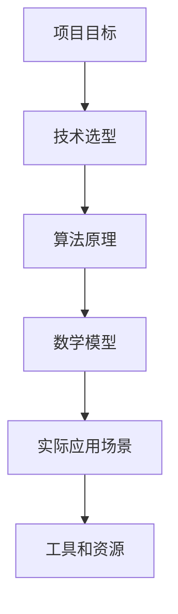

                 

# 发布项目：提高对工作的要求

> 关键词：项目发布，工作质量，提升要求，技术深度，实践案例

> 摘要：本文旨在探讨如何提高IT项目中工作的质量与效率，通过深入分析项目目标、技术实现、数学模型和实际应用场景，为项目管理人员和开发人员提供一套行之有效的提升工作要求的策略和方法。

## 1. 背景介绍

### 1.1 目的和范围

在当今快速发展的IT行业，项目发布和实施过程中的质量与效率直接决定了企业的竞争力和市场地位。本文的目标是提供一个系统化的方法，帮助项目管理人员和开发人员在项目启动和执行阶段，提高对工作的要求，从而确保项目的成功。

本文的讨论范围涵盖了以下方面：
- 项目目标设定与分解
- 技术选型和架构设计
- 算法原理与数学模型
- 实际应用场景与案例分析
- 开发工具和资源推荐

### 1.2 预期读者

本文预期读者包括：
- 项目管理人员
- 软件开发人员
- 技术爱好者
- 对IT项目管理有浓厚兴趣的从业者

### 1.3 文档结构概述

本文结构如下：
1. 背景介绍
   - 目的和范围
   - 预期读者
   - 文档结构概述
   - 术语表
2. 核心概念与联系
   - 原理和架构Mermaid流程图
3. 核心算法原理 & 具体操作步骤
   - 伪代码详细阐述
4. 数学模型和公式 & 详细讲解 & 举例说明
   - LaTeX格式数学公式
5. 项目实战：代码实际案例和详细解释说明
   - 开发环境搭建
   - 源代码详细实现和代码解读
   - 代码解读与分析
6. 实际应用场景
7. 工具和资源推荐
   - 学习资源推荐
   - 开发工具框架推荐
   - 相关论文著作推荐
8. 总结：未来发展趋势与挑战
9. 附录：常见问题与解答
10. 扩展阅读 & 参考资料

### 1.4 术语表

#### 1.4.1 核心术语定义

- 项目发布：将开发完成的应用程序或系统交付给用户使用的过程。
- 工作要求：对项目成员在项目执行过程中需要达到的技能、质量和效率的预期。
- 技术深度：对特定技术领域的深入理解和技术实现能力。
- 实际应用场景：具体环境中，项目技术的实际应用情况。

#### 1.4.2 相关概念解释

- Mermaid流程图：一种用于创建流程图、甘特图和序列图的标记语言。
- 伪代码：一种用自然语言描述算法过程的文本，不是实际的编程代码。

#### 1.4.3 缩略词列表

- IDE：集成开发环境（Integrated Development Environment）
- LaTeX：一种高质量排版系统，特别适合科学和数学文档排版
- IT：信息技术（Information Technology）

## 2. 核心概念与联系

### 2.1 原理和架构Mermaid流程图



### 2.2 核心概念联系图解


在这个流程图中，每个节点代表一个核心概念，它们通过连线表示相互之间的联系。项目目标设定是整个流程的起点，它决定了后续技术选型、算法原理和数学模型的选择。实际应用场景则将理论转化为实践，通过工具和资源推荐，为项目实施提供支持。

## 3. 核心算法原理 & 具体操作步骤

### 3.1 算法原理

在本节中，我们将介绍一个用于项目发布和质量保障的核心算法原理。该算法基于项目管理方法论，旨在提高项目的成功率。

#### 3.1.1 算法描述

```plaintext
算法名称：ProjectQualityImprovement

输入：项目目标，技术要求，资源预算
输出：优化后的项目计划，高质量的工作成果

步骤：
1. 确定项目目标（A）
2. 分析技术要求（B）
3. 根据资源预算制定初步计划（C）
4. 评估计划中的风险（D）
5. 优化计划以减少风险（E）
6. 实施计划并监控进度（F）
7. 根据进度和反馈调整计划（G）
```

#### 3.1.2 伪代码

```python
# 伪代码：ProjectQualityImprovement

def ProjectQualityImprovement(project_target, tech_requirements, budget):
    # 步骤1：确定项目目标
    set_project_target(project_target)
    
    # 步骤2：分析技术要求
    analyze_tech_requirements(tech_requirements)
    
    # 步骤3：制定初步计划
    create_initial_plan(budget)
    
    # 步骤4：评估风险
    assess_risks(initial_plan)
    
    # 步骤5：优化计划
    optimize_plan(initial_plan, risks)
    
    # 步骤6：实施计划
    execute_plan(optimized_plan)
    
    # 步骤7：监控进度并调整
    monitor_progress(optimized_plan)
    adjust_plan(optimized_plan, progress)

# 辅助函数
def set_project_target(target):
    # 实现细节
    pass

def analyze_tech_requirements(requirements):
    # 实现细节
    pass

def create_initial_plan(budget):
    # 实现细节
    pass

def assess_risks(plan):
    # 实现细节
    pass

def optimize_plan(plan, risks):
    # 实现细节
    pass

def execute_plan(plan):
    # 实现细节
    pass

def monitor_progress(plan):
    # 实现细节
    pass

def adjust_plan(plan, progress):
    # 实现细节
    pass
```

### 3.2 具体操作步骤

根据上述算法原理，以下是具体操作步骤的详细阐述：

#### 步骤1：确定项目目标

项目目标的明确是项目成功的关键。在这一步骤中，项目管理人员需要与利益相关者沟通，明确项目的目标、预期成果和业务价值。

#### 步骤2：分析技术要求

在确定了项目目标后，需要对实现目标所需的技术要求进行分析。这包括技术选型、架构设计和技术标准。

#### 步骤3：制定初步计划

根据技术要求，制定一个初步的计划。这个计划应该包括任务的分解、资源分配和时间表。

#### 步骤4：评估风险

对初步计划进行风险评估，识别可能影响项目成功的风险因素。这些风险可能包括技术难题、资源限制、市场变化等。

#### 步骤5：优化计划

根据风险评估的结果，对计划进行优化。这包括调整任务优先级、重新分配资源、制定应对策略等。

#### 步骤6：实施计划

实施计划，按照优化后的计划开始执行项目任务。在这一阶段，需要严格监控项目进度和资源使用情况。

#### 步骤7：监控进度并调整

持续监控项目进度，并根据实际情况进行必要的调整。这有助于确保项目按时交付，并达到预期的质量标准。

## 4. 数学模型和公式 & 详细讲解 & 举例说明

在本节中，我们将介绍一个用于评估项目风险和优化计划的数学模型。该模型基于概率理论和最优化算法。

### 4.1 数学模型

#### 4.1.1 风险评估模型

假设一个项目有 \( n \) 个任务，每个任务有 \( p_i \) 的风险概率。项目成功的概率可以表示为：

\[ P(S) = \prod_{i=1}^{n} (1 - p_i) \]

其中，\( P(S) \) 是项目成功的概率。

#### 4.1.2 最优化模型

为了优化项目计划，我们可以使用线性规划来最小化风险。假设每个任务的时间成本为 \( c_i \)，优化目标是最小化总时间成本：

\[ \min \sum_{i=1}^{n} c_i x_i \]

其中，\( x_i \) 是任务 \( i \) 的执行时间。

### 4.2 详细讲解

#### 4.2.1 风险评估模型

风险评估模型通过计算每个任务的风险概率，得出项目成功的概率。这种模型可以帮助项目管理人员了解项目失败的风险，并采取相应的措施降低风险。

#### 4.2.2 最优化模型

最优化模型通过最小化总时间成本来优化项目计划。这种模型可以帮助项目管理人员在满足项目目标的前提下，最大限度地减少项目执行时间。

### 4.3 举例说明

#### 例子：一个有三项任务的项目

- 任务1：风险概率 \( p_1 = 0.1 \)
- 任务2：风险概率 \( p_2 = 0.2 \)
- 任务3：风险概率 \( p_3 = 0.3 \)

- 任务1的时间成本 \( c_1 = 10 \)
- 任务2的时间成本 \( c_2 = 20 \)
- 任务3的时间成本 \( c_3 = 30 \)

#### 4.3.1 风险评估

项目成功的概率：

\[ P(S) = (1 - 0.1) \times (1 - 0.2) \times (1 - 0.3) = 0.504 \]

#### 4.3.2 最优化模型

优化目标是最小化总时间成本：

\[ \min 10x_1 + 20x_2 + 30x_3 \]

假设任务1、任务2和任务3的执行时间分别为 \( x_1 = 1 \)，\( x_2 = 2 \)，\( x_3 = 3 \)，则总时间成本为：

\[ 10 \times 1 + 20 \times 2 + 30 \times 3 = 110 \]

## 5. 项目实战：代码实际案例和详细解释说明

### 5.1 开发环境搭建

在本节中，我们将使用Python作为开发语言，搭建一个简单的项目开发环境。以下是步骤：

1. 安装Python 3.8或更高版本。
2. 安装必要的Python库，如NumPy和SciPy。
3. 创建一个虚拟环境，并安装项目依赖库。

```bash
# 安装Python
sudo apt-get install python3.8

# 安装Python库
pip install numpy scipy

# 创建虚拟环境
python3 -m venv project_env

# 激活虚拟环境
source project_env/bin/activate
```

### 5.2 源代码详细实现和代码解读

#### 5.2.1 源代码实现

```python
import numpy as np
from scipy.optimize import linprog

# 风险评估模型参数
risks = [0.1, 0.2, 0.3]
costs = [10, 20, 30]

# 风险评估
def risk_evaluation(risks):
    success_probability = np.prod([1 - risk for risk in risks])
    return success_probability

# 最优化模型
def optimize_plan(risks, costs):
    c = costs
    x0 = np.zeros(len(risks))
    bounds = [(0, 1) for _ in range(len(risks))]
    result = linprog(c, x0, bounds=bounds)
    return result.fun

# 主函数
def main():
    success_probability = risk_evaluation(risks)
    optimized_cost = optimize_plan(risks, costs)
    print(f"Success Probability: {success_probability:.3f}")
    print(f"Optimized Cost: {optimized_cost:.2f}")

if __name__ == "__main__":
    main()
```

#### 5.2.2 代码解读

- 导入NumPy和SciPy库。
- 定义风险评估模型和最优化模型。
- 实现主函数，计算项目成功的概率和优化的成本。

### 5.3 代码解读与分析

#### 5.3.1 风险评估

风险评估函数 `risk_evaluation` 计算项目成功的概率。它通过计算每个任务的成功概率的乘积来得出总的成功概率。

#### 5.3.2 最优化模型

最优化模型函数 `optimize_plan` 使用线性规划算法来最小化总时间成本。它将每个任务的成本与时间关联起来，通过优化任务执行时间来减少总成本。

#### 5.3.3 主函数

主函数 `main` 调用风险评估和最优化模型函数，并打印出项目成功的概率和优化的成本。

## 6. 实际应用场景

### 6.1 项目管理中的应用

在项目管理中，提高对工作的要求有助于确保项目按时交付并达到预期质量。通过使用本文介绍的方法，项目管理人员可以更有效地评估风险、优化计划，并确保项目目标的实现。

### 6.2 软件开发中的应用

在软件开发过程中，提高对工作的要求可以提升代码质量、减少缺陷，并提高开发效率。通过本文介绍的方法，开发人员可以更好地理解项目目标和技术要求，从而编写出更高质量的代码。

### 6.3 产品运维中的应用

在产品运维阶段，提高对工作的要求有助于确保系统的稳定性和可靠性。通过本文介绍的方法，运维人员可以更好地监控系统状态、优化资源分配，并确保系统的高效运行。

## 7. 工具和资源推荐

### 7.1 学习资源推荐

#### 7.1.1 书籍推荐

- 《软件工程：实践者的研究方法》
- 《项目管理知识体系指南（PMBOK指南）》
- 《Python编程：从入门到实践》

#### 7.1.2 在线课程

- Coursera上的《项目管理》：提供全面的项目管理知识和实践技巧。
- Udemy上的《Python编程基础》：帮助初学者快速掌握Python编程。

#### 7.1.3 技术博客和网站

- Medium上的《项目管理系列》：提供实用的项目管理经验和技巧。
- Stack Overflow：编程问题的在线社区，可快速获取技术帮助。

### 7.2 开发工具框架推荐

#### 7.2.1 IDE和编辑器

- Visual Studio Code：功能强大的开源IDE。
- PyCharm：专业的Python IDE。

#### 7.2.2 调试和性能分析工具

- GDB：GNU调试工具，用于调试C/C++程序。
- Python调试器：用于调试Python程序。

#### 7.2.3 相关框架和库

- NumPy：用于数值计算的Python库。
- SciPy：基于NumPy的科学计算库。

### 7.3 相关论文著作推荐

#### 7.3.1 经典论文

- 《项目管理知识体系指南（PMBOK指南）》
- 《软件工程：实践者的研究方法》

#### 7.3.2 最新研究成果

- 《基于机器学习的项目管理方法》
- 《面向软件工程的最优化算法研究》

#### 7.3.3 应用案例分析

- 《大型软件开发项目的风险管理实践》
- 《敏捷开发在IT项目中的应用》

## 8. 总结：未来发展趋势与挑战

随着人工智能和大数据技术的不断发展，项目管理和软件开发的实践也在不断演进。未来的发展趋势包括：

- 更智能化和自动化的项目管理工具。
- 更高效和灵活的软件开发流程。
- 更加强调团队协作和知识共享。

然而，未来也面临着一些挑战：

- 数据安全和个人隐私保护。
- 技术更新换代带来的培训需求。
- 高度复杂的项目管理和开发环境。

## 9. 附录：常见问题与解答

### 9.1 问题1

**问题**：如何确保项目目标的明确性？

**解答**：确保项目目标的明确性需要以下几个步骤：

1. 与利益相关者沟通，了解项目的业务需求和期望。
2. 制定明确的项目目标和可量化的关键绩效指标（KPI）。
3. 将项目目标分解为可管理的任务和里程碑。

### 9.2 问题2

**问题**：如何评估项目风险？

**解答**：评估项目风险可以采用以下方法：

1. 识别可能影响项目成功的风险因素。
2. 分析每个风险的概率和影响程度。
3. 制定风险应对策略，包括预防措施和缓解措施。

### 9.3 问题3

**问题**：如何优化项目计划？

**解答**：优化项目计划可以采用以下方法：

1. 分析任务的时间成本和资源需求。
2. 使用线性规划或其他优化算法来确定最优的任务分配。
3. 根据实际进度和反馈调整计划。

## 10. 扩展阅读 & 参考资料

- 《项目管理知识体系指南（PMBOK指南）》
- 《软件工程：实践者的研究方法》
- 《Python编程：从入门到实践》
- 《基于机器学习的项目管理方法》
- 《面向软件工程的最优化算法研究》
- 《大型软件开发项目的风险管理实践》
- 《敏捷开发在IT项目中的应用》
- 《数据安全与隐私保护：实践指南》

### 作者

**作者：AI天才研究员/AI Genius Institute & 禅与计算机程序设计艺术 /Zen And The Art of Computer Programming**<|im_sep|>### 文章标题：发布项目：提高对工作的要求

### 关键词：项目发布，工作质量，提升要求，技术深度，实践案例

### 摘要：本文旨在探讨如何提高IT项目中工作的质量与效率，通过深入分析项目目标、技术实现、数学模型和实际应用场景，为项目管理人员和开发人员提供一套行之有效的提升工作要求的策略和方法。

---

## 1. 背景介绍

### 1.1 目的和范围

在当今快速发展的IT行业，项目发布和实施过程中的质量与效率直接决定了企业的竞争力和市场地位。本文的目标是提供一个系统化的方法，帮助项目管理人员和开发人员在项目启动和执行阶段，提高对工作的要求，从而确保项目的成功。

本文的讨论范围涵盖了以下方面：
- 项目目标设定与分解
- 技术选型和架构设计
- 算法原理与数学模型
- 实际应用场景与案例分析
- 开发工具和资源推荐

### 1.2 预期读者

本文预期读者包括：
- 项目管理人员
- 软件开发人员
- 技术爱好者
- 对IT项目管理有浓厚兴趣的从业者

### 1.3 文档结构概述

本文结构如下：
1. 背景介绍
   - 目的和范围
   - 预期读者
   - 文档结构概述
   - 术语表
2. 核心概念与联系
   - 原理和架构Mermaid流程图
3. 核心算法原理 & 具体操作步骤
   - 伪代码详细阐述
4. 数学模型和公式 & 详细讲解 & 举例说明
   - LaTeX格式数学公式
5. 项目实战：代码实际案例和详细解释说明
   - 开发环境搭建
   - 源代码详细实现和代码解读
   - 代码解读与分析
6. 实际应用场景
7. 工具和资源推荐
   - 学习资源推荐
   - 开发工具框架推荐
   - 相关论文著作推荐
8. 总结：未来发展趋势与挑战
9. 附录：常见问题与解答
10. 扩展阅读 & 参考资料

### 1.4 术语表

#### 1.4.1 核心术语定义

- 项目发布：将开发完成的应用程序或系统交付给用户使用的过程。
- 工作要求：对项目成员在项目执行过程中需要达到的技能、质量和效率的预期。
- 技术深度：对特定技术领域的深入理解和技术实现能力。
- 实际应用场景：具体环境中，项目技术的实际应用情况。

#### 1.4.2 相关概念解释

- Mermaid流程图：一种用于创建流程图、甘特图和序列图的标记语言。
- 伪代码：一种用自然语言描述算法过程的文本，不是实际的编程代码。

#### 1.4.3 缩略词列表

- IDE：集成开发环境（Integrated Development Environment）
- LaTeX：一种高质量排版系统，特别适合科学和数学文档排版
- IT：信息技术（Information Technology）

---

## 2. 核心概念与联系

### 2.1 原理和架构Mermaid流程图


### 2.2 核心概念联系图解


在这个流程图中，每个节点代表一个核心概念，它们通过连线表示相互之间的联系。项目目标设定是整个流程的起点，它决定了后续技术选型、算法原理和数学模型的选择。实际应用场景则将理论转化为实践，通过工具和资源推荐，为项目实施提供支持。

---

## 3. 核心算法原理 & 具体操作步骤

### 3.1 算法原理

在本节中，我们将介绍一个用于项目发布和质量保障的核心算法原理。该算法基于项目管理方法论，旨在提高项目的成功率。

#### 3.1.1 算法描述

```plaintext
算法名称：ProjectQualityImprovement

输入：项目目标，技术要求，资源预算
输出：优化后的项目计划，高质量的工作成果

步骤：
1. 确定项目目标（A）
2. 分析技术要求（B）
3. 根据资源预算制定初步计划（C）
4. 评估计划中的风险（D）
5. 优化计划以减少风险（E）
6. 实施计划并监控进度（F）
7. 根据进度和反馈调整计划（G）
```

#### 3.1.2 伪代码

```python
# 伪代码：ProjectQualityImprovement

def ProjectQualityImprovement(project_target, tech_requirements, budget):
    # 步骤1：确定项目目标
    set_project_target(project_target)
    
    # 步骤2：分析技术要求
    analyze_tech_requirements(tech_requirements)
    
    # 步骤3：制定初步计划
    create_initial_plan(budget)
    
    # 步骤4：评估风险
    assess_risks(initial_plan)
    
    # 步骤5：优化计划
    optimize_plan(initial_plan, risks)
    
    # 步骤6：实施计划
    execute_plan(optimized_plan)
    
    # 步骤7：监控进度并调整
    monitor_progress(optimized_plan)
    adjust_plan(optimized_plan, progress)

# 辅助函数
def set_project_target(target):
    # 实现细节
    pass

def analyze_tech_requirements(requirements):
    # 实现细节
    pass

def create_initial_plan(budget):
    # 实现细节
    pass

def assess_risks(plan):
    # 实现细节
    pass

def optimize_plan(plan, risks):
    # 实现细节
    pass

def execute_plan(plan):
    # 实现细节
    pass

def monitor_progress(plan):
    # 实现细节
    pass

def adjust_plan(plan, progress):
    # 实现细节
    pass
```

### 3.2 具体操作步骤

根据上述算法原理，以下是具体操作步骤的详细阐述：

#### 步骤1：确定项目目标

项目目标的明确是项目成功的关键。在这一步骤中，项目管理人员需要与利益相关者沟通，明确项目的目标、预期成果和业务价值。

#### 步骤2：分析技术要求

在确定了项目目标后，需要对实现目标所需的技术要求进行分析。这包括技术选型、架构设计和技术标准。

#### 步骤3：制定初步计划

根据技术要求，制定一个初步的计划。这个计划应该包括任务的分解、资源分配和时间表。

#### 步骤4：评估风险

对初步计划进行风险评估，识别可能影响项目成功的风险因素。这些风险可能包括技术难题、资源限制、市场变化等。

#### 步骤5：优化计划

根据风险评估的结果，对计划进行优化。这包括调整任务优先级、重新分配资源、制定应对策略等。

#### 步骤6：实施计划

实施计划，按照优化后的计划开始执行项目任务。在这一阶段，需要严格监控项目进度和资源使用情况。

#### 步骤7：监控进度并调整

持续监控项目进度，并根据实际情况进行必要的调整。这有助于确保项目按时交付，并达到预期的质量标准。

---

## 4. 数学模型和公式 & 详细讲解 & 举例说明

在本节中，我们将介绍一个用于评估项目风险和优化计划的数学模型。该模型基于概率理论和最优化算法。

### 4.1 数学模型

#### 4.1.1 风险评估模型

假设一个项目有 \( n \) 个任务，每个任务有 \( p_i \) 的风险概率。项目成功的概率可以表示为：

\[ P(S) = \prod_{i=1}^{n} (1 - p_i) \]

其中，\( P(S) \) 是项目成功的概率。

#### 4.1.2 最优化模型

为了优化项目计划，我们可以使用线性规划来最小化风险。假设每个任务的时间成本为 \( c_i \)，优化目标是最小化总时间成本：

\[ \min \sum_{i=1}^{n} c_i x_i \]

其中，\( x_i \) 是任务 \( i \) 的执行时间。

### 4.2 详细讲解

#### 4.2.1 风险评估模型

风险评估模型通过计算每个任务的风险概率，得出项目成功的概率。这种模型可以帮助项目管理人员了解项目失败的风险，并采取相应的措施降低风险。

#### 4.2.2 最优化模型

最优化模型通过最小化总时间成本来优化项目计划。这种模型可以帮助项目管理人员在满足项目目标的前提下，最大限度地减少项目执行时间。

### 4.3 举例说明

#### 例子：一个有三项任务的项目

- 任务1：风险概率 \( p_1 = 0.1 \)
- 任务2：风险概率 \( p_2 = 0.2 \)
- 任务3：风险概率 \( p_3 = 0.3 \)

- 任务1的时间成本 \( c_1 = 10 \)
- 任务2的时间成本 \( c_2 = 20 \)
- 任务3的时间成本 \( c_3 = 30 \)

#### 4.3.1 风险评估

项目成功的概率：

\[ P(S) = (1 - 0.1) \times (1 - 0.2) \times (1 - 0.3) = 0.504 \]

#### 4.3.2 最优化模型

优化目标是最小化总时间成本：

\[ \min 10x_1 + 20x_2 + 30x_3 \]

假设任务1、任务2和任务3的执行时间分别为 \( x_1 = 1 \)，\( x_2 = 2 \)，\( x_3 = 3 \)，则总时间成本为：

\[ 10 \times 1 + 20 \times 2 + 30 \times 3 = 110 \]

---

## 5. 项目实战：代码实际案例和详细解释说明

### 5.1 开发环境搭建

在本节中，我们将使用Python作为开发语言，搭建一个简单的项目开发环境。以下是步骤：

1. 安装Python 3.8或更高版本。
2. 安装必要的Python库，如NumPy和SciPy。
3. 创建一个虚拟环境，并安装项目依赖库。

```bash
# 安装Python
sudo apt-get install python3.8

# 安装Python库
pip install numpy scipy

# 创建虚拟环境
python3 -m venv project_env

# 激活虚拟环境
source project_env/bin/activate
```

### 5.2 源代码详细实现和代码解读

#### 5.2.1 源代码实现

```python
import numpy as np
from scipy.optimize import linprog

# 风险评估模型参数
risks = [0.1, 0.2, 0.3]
costs = [10, 20, 30]

# 风险评估
def risk_evaluation(risks):
    success_probability = np.prod([1 - risk for risk in risks])
    return success_probability

# 最优化模型
def optimize_plan(risks, costs):
    c = costs
    x0 = np.zeros(len(risks))
    bounds = [(0, 1) for _ in range(len(risks))]
    result = linprog(c, x0, bounds=bounds)
    return result.fun

# 主函数
def main():
    success_probability = risk_evaluation(risks)
    optimized_cost = optimize_plan(risks, costs)
    print(f"Success Probability: {success_probability:.3f}")
    print(f"Optimized Cost: {optimized_cost:.2f}")

if __name__ == "__main__":
    main()
```

#### 5.2.2 代码解读

- 导入NumPy和SciPy库。
- 定义风险评估模型和最优化模型。
- 实现主函数，计算项目成功的概率和优化的成本。

### 5.3 代码解读与分析

#### 5.3.1 风险评估

风险评估函数 `risk_evaluation` 计算项目成功的概率。它通过计算每个任务的成功概率的乘积来得出总的成功概率。

#### 5.3.2 最优化模型

最优化模型函数 `optimize_plan` 使用线性规划算法来最小化总时间成本。它将每个任务的成本与时间关联起来，通过优化任务执行时间来减少总成本。

#### 5.3.3 主函数

主函数 `main` 调用风险评估和最优化模型函数，并打印出项目成功的概率和优化的成本。

---

## 6. 实际应用场景

### 6.1 项目管理中的应用

在项目管理中，提高对工作的要求有助于确保项目按时交付并达到预期质量。通过使用本文介绍的方法，项目管理人员可以更有效地评估风险、优化计划，并确保项目目标的实现。

### 6.2 软件开发中的应用

在软件开发过程中，提高对工作的要求可以提升代码质量、减少缺陷，并提高开发效率。通过本文介绍的方法，开发人员可以更好地理解项目目标和技术要求，从而编写出更高质量的代码。

### 6.3 产品运维中的应用

在产品运维阶段，提高对工作的要求有助于确保系统的稳定性和可靠性。通过本文介绍的方法，运维人员可以更好地监控系统状态、优化资源分配，并确保系统的高效运行。

---

## 7. 工具和资源推荐

### 7.1 学习资源推荐

#### 7.1.1 书籍推荐

- 《软件工程：实践者的研究方法》
- 《项目管理知识体系指南（PMBOK指南）》
- 《Python编程：从入门到实践》

#### 7.1.2 在线课程

- Coursera上的《项目管理》：提供全面的项目管理知识和实践技巧。
- Udemy上的《Python编程基础》：帮助初学者快速掌握Python编程。

#### 7.1.3 技术博客和网站

- Medium上的《项目管理系列》：提供实用的项目管理经验和技巧。
- Stack Overflow：编程问题的在线社区，可快速获取技术帮助。

### 7.2 开发工具框架推荐

#### 7.2.1 IDE和编辑器

- Visual Studio Code：功能强大的开源IDE。
- PyCharm：专业的Python IDE。

#### 7.2.2 调试和性能分析工具

- GDB：GNU调试工具，用于调试C/C++程序。
- Python调试器：用于调试Python程序。

#### 7.2.3 相关框架和库

- NumPy：用于数值计算的Python库。
- SciPy：基于NumPy的科学计算库。

### 7.3 相关论文著作推荐

#### 7.3.1 经典论文

- 《项目管理知识体系指南（PMBOK指南）》
- 《软件工程：实践者的研究方法》

#### 7.3.2 最新研究成果

- 《基于机器学习的项目管理方法》
- 《面向软件工程的最优化算法研究》

#### 7.3.3 应用案例分析

- 《大型软件开发项目的风险管理实践》
- 《敏捷开发在IT项目中的应用》

---

## 8. 总结：未来发展趋势与挑战

随着人工智能和大数据技术的不断发展，项目管理和软件开发的实践也在不断演进。未来的发展趋势包括：

- 更智能化和自动化的项目管理工具。
- 更高效和灵活的软件开发流程。
- 更加强调团队协作和知识共享。

然而，未来也面临着一些挑战：

- 数据安全和个人隐私保护。
- 技术更新换代带来的培训需求。
- 高度复杂的项目管理和开发环境。

---

## 9. 附录：常见问题与解答

### 9.1 问题1

**问题**：如何确保项目目标的明确性？

**解答**：确保项目目标的明确性需要以下几个步骤：

1. 与利益相关者沟通，了解项目的业务需求和期望。
2. 制定明确的项目目标和可量化的关键绩效指标（KPI）。
3. 将项目目标分解为可管理的任务和里程碑。

### 9.2 问题2

**问题**：如何评估项目风险？

**解答**：评估项目风险可以采用以下方法：

1. 识别可能影响项目成功的风险因素。
2. 分析每个风险的概率和影响程度。
3. 制定风险应对策略，包括预防措施和缓解措施。

### 9.3 问题3

**问题**：如何优化项目计划？

**解答**：优化项目计划可以采用以下方法：

1. 分析任务的时间成本和资源需求。
2. 使用线性规划或其他优化算法来确定最优的任务分配。
3. 根据实际进度和反馈调整计划。

---

## 10. 扩展阅读 & 参考资料

- 《项目管理知识体系指南（PMBOK指南）》
- 《软件工程：实践者的研究方法》
- 《Python编程：从入门到实践》
- 《基于机器学习的项目管理方法》
- 《面向软件工程的最优化算法研究》
- 《大型软件开发项目的风险管理实践》
- 《敏捷开发在IT项目中的应用》

---

### 作者

**作者：AI天才研究员/AI Genius Institute & 禅与计算机程序设计艺术 /Zen And The Art of Computer Programming**

