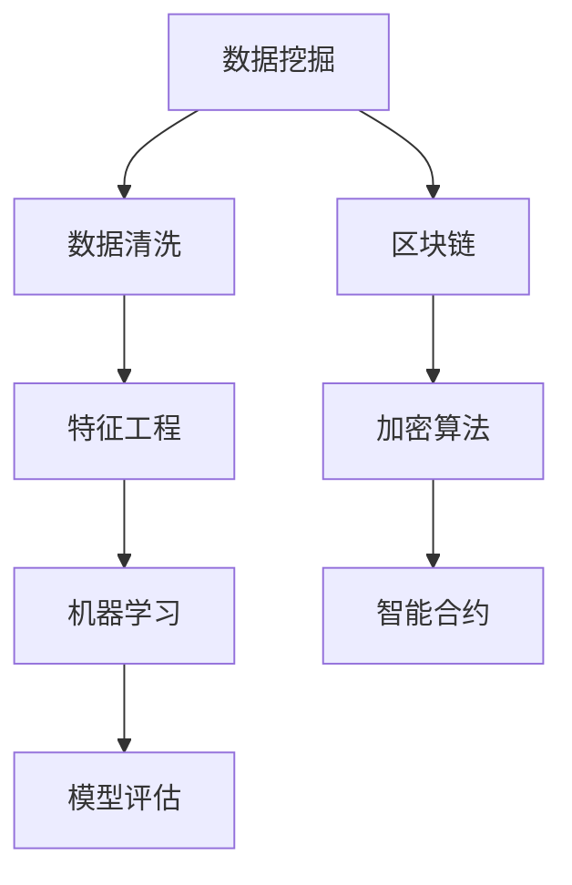
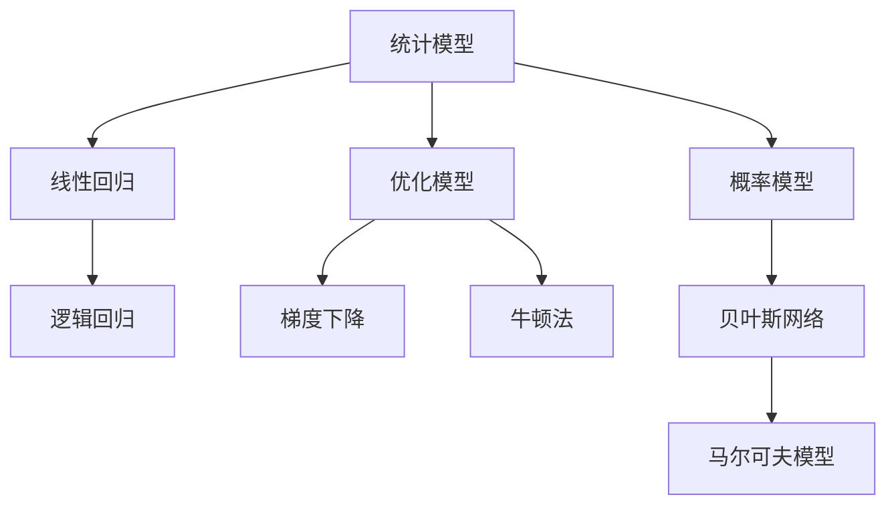

                 

### 只有金融才能挣到钱：未来商业的趋势

> **关键词：** 金融科技、商业创新、数字经济、人工智能、可持续商业
>
> **摘要：** 本文将深入探讨金融科技在推动未来商业发展趋势中的作用。通过分析金融领域的核心算法、数学模型和实际应用案例，本文旨在揭示金融成为盈利主要领域的深层次原因，并探讨其对于商业生态系统的影响。读者将了解金融科技如何改变商业环境，以及未来商业如何应对金融带来的机遇与挑战。

---

### 1. 背景介绍

#### 1.1 目的和范围

本文旨在探讨金融科技（FinTech）在未来商业环境中的核心作用，以及金融成为盈利主要领域的趋势。我们将通过以下几个角度展开讨论：

1. **核心概念与联系**：介绍金融科技的基本概念，包括其组成部分和核心算法原理。
2. **核心算法原理 & 具体操作步骤**：详细阐述金融科技中的关键算法及其实现步骤。
3. **数学模型和公式 & 详细讲解 & 举例说明**：分析金融科技中使用的数学模型和公式，并通过实际案例进行说明。
4. **项目实战：代码实际案例和详细解释说明**：提供具体代码实现和解析，以展示金融科技在实际应用中的效果。
5. **实际应用场景**：讨论金融科技在各类商业领域的应用，包括支付、借贷、保险、投资等。
6. **工具和资源推荐**：推荐学习资源和开发工具，帮助读者深入了解和掌握金融科技。
7. **总结：未来发展趋势与挑战**：总结金融科技对未来商业趋势的影响，并探讨面临的挑战。

#### 1.2 预期读者

本文适用于以下读者群体：

- 金融科技领域的专业人士，包括开发人员、分析师和研究者。
- 企业家和创业者，希望了解金融科技如何改变商业环境。
- 对金融科技感兴趣的学术研究人员和在校学生。

#### 1.3 文档结构概述

本文分为以下几个主要部分：

1. **背景介绍**：介绍文章的目的、范围和预期读者。
2. **核心概念与联系**：讨论金融科技的基本概念和组成部分。
3. **核心算法原理 & 具体操作步骤**：详细阐述金融科技中的关键算法。
4. **数学模型和公式 & 详细讲解 & 举例说明**：分析金融科技中的数学模型和公式。
5. **项目实战：代码实际案例和详细解释说明**：提供具体代码实现和解析。
6. **实际应用场景**：讨论金融科技在不同商业领域的应用。
7. **工具和资源推荐**：推荐学习资源和开发工具。
8. **总结：未来发展趋势与挑战**：总结金融科技对未来商业的影响。
9. **附录：常见问题与解答**：回答读者可能关心的问题。
10. **扩展阅读 & 参考资料**：提供进一步阅读的资源。

#### 1.4 术语表

本文涉及以下核心术语和概念：

#### 1.4.1 核心术语定义

- **金融科技（FinTech）**：金融科技是指利用技术手段改善金融服务和产品，包括支付、借贷、投资、保险等领域。
- **区块链**：一种分布式数据库技术，用于记录和验证交易数据，确保透明度和安全性。
- **人工智能（AI）**：模拟人类智能的计算机系统，通过学习和决策能力进行自主操作。
- **算法**：解决问题的步骤和规则，用于数据分析和决策。
- **大数据**：大量结构化和非结构化数据，通过分析可以揭示有价值的信息。

#### 1.4.2 相关概念解释

- **区块链**：区块链是一种分布式数据库技术，通过多个节点共同维护账本，实现去中心化交易。其特点是透明、安全、不可篡改。
- **加密货币**：基于区块链技术的数字货币，如比特币、以太坊等，具有去中心化、匿名性和不可篡改的特点。
- **机器学习**：一种人工智能技术，通过分析大量数据，建立模型并进行预测和决策。

#### 1.4.3 缩略词列表

- **AI**：人工智能（Artificial Intelligence）
- **FinTech**：金融科技（Financial Technology）
- **ICO**：首次代币发行（Initial Coin Offering）
- **KYC**：了解你的客户（Know Your Customer）
- **AML**：反洗钱（Anti-Money Laundering）

---

### 2. 核心概念与联系

在探讨金融科技对商业趋势的影响之前，我们首先需要理解金融科技的核心概念及其相互联系。以下是对关键概念的简要介绍和流程图说明。

#### 2.1 金融科技的基本概念

金融科技（FinTech）涵盖了多个领域，包括支付、借贷、投资、保险等。以下是金融科技的主要组成部分：

1. **支付系统**：利用技术手段改善支付流程，如移动支付、在线支付、区块链支付等。
2. **借贷平台**：通过大数据分析和人工智能技术，提供信用评估、风险评估和借贷服务。
3. **投资平台**：利用大数据分析和机器学习算法，为投资者提供个性化的投资建议和策略。
4. **保险科技**：通过数据分析和技术手段，改善保险产品的设计、定价和理赔流程。

#### 2.2 核心算法原理

金融科技中的关键算法包括数据挖掘、机器学习、区块链等。以下是一个简单的 Mermaid 流程图，展示这些算法之间的联系。



#### 2.3 数学模型和公式

金融科技中的数学模型包括统计模型、优化模型、概率模型等。以下是一个简单的 Mermaid 流程图，展示这些模型之间的联系。



---

### 3. 核心算法原理 & 具体操作步骤

在了解了金融科技的核心概念和联系后，接下来我们将详细讨论金融科技中的一些关键算法原理及其实现步骤。这些算法在金融科技的实际应用中起着至关重要的作用。

#### 3.1 数据挖掘算法

数据挖掘是一种从大量数据中提取有价值信息的技术。以下是一个简单的数据挖掘算法原理及实现步骤：

**算法原理：**
1. 数据预处理：清洗数据，处理缺失值、异常值和重复值。
2. 特征工程：选择和创建有用的特征，以提高模型的预测准确性。
3. 模型选择：选择合适的算法模型，如决策树、随机森林、支持向量机等。
4. 模型训练：使用训练数据对模型进行训练。
5. 模型评估：评估模型的性能，如准确率、召回率、F1值等。
6. 模型部署：将模型部署到生产环境中，进行实时预测。

**实现步骤：**

```python
# 伪代码

# 步骤1：数据预处理
data = preprocess_data(raw_data)

# 步骤2：特征工程
features = feature_engineering(data)

# 步骤3：模型选择
model = select_model(algorithms)

# 步骤4：模型训练
train_model(model, features)

# 步骤5：模型评估
evaluate_model(model, test_data)

# 步骤6：模型部署
deploy_model(model)
```

#### 3.2 机器学习算法

机器学习算法在金融科技中应用广泛，如信用评分、风险控制、欺诈检测等。以下是一个简单的机器学习算法原理及实现步骤：

**算法原理：**
1. 数据预处理：与数据挖掘类似，对数据进行清洗和特征工程。
2. 模型选择：选择适合问题的机器学习模型，如线性回归、逻辑回归、决策树等。
3. 模型训练：使用训练数据对模型进行训练。
4. 模型评估：评估模型的性能，如准确率、召回率、F1值等。
5. 模型优化：调整模型参数，提高模型性能。
6. 模型部署：将模型部署到生产环境中，进行实时预测。

**实现步骤：**

```python
# 伪代码

# 步骤1：数据预处理
data = preprocess_data(raw_data)

# 步骤2：特征工程
features = feature_engineering(data)

# 步骤3：模型选择
model = select_model(algorithms)

# 步骤4：模型训练
train_model(model, features)

# 步骤5：模型评估
evaluate_model(model, test_data)

# 步骤6：模型优化
optimize_model(model)

# 步骤7：模型部署
deploy_model(model)
```

#### 3.3 区块链算法

区块链算法在金融科技中具有重要作用，如加密货币交易、智能合约等。以下是一个简单的区块链算法原理及实现步骤：

**算法原理：**
1. 数据结构设计：设计区块链数据结构，包括区块、链等。
2. 加密算法：使用加密算法保护区块链数据的安全性。
3. 智能合约：编写智能合约代码，实现特定功能。
4. 共识算法：选择合适的共识算法，确保区块链网络的安全性和一致性。
5. 交易验证：验证交易的有效性，防止双重支付。
6. 区块生成：生成新的区块，并将其添加到区块链中。

**实现步骤：**

```python
# 伪代码

# 步骤1：数据结构设计
blockchain = create_blockchain()

# 步骤2：加密算法
encrypt_transactions(transactions)

# 步骤3：智能合约
contract_code = write_smart_contract()

# 步骤4：共识算法
consensus = select_consensus_algorithm()

# 步骤5：交易验证
validate_transactions(transactions)

# 步骤6：区块生成
create_and_add_block(block)
```

---

### 4. 数学模型和公式 & 详细讲解 & 举例说明

在金融科技中，数学模型和公式被广泛应用于数据分析和决策支持。以下是一些常见的数学模型和公式，以及详细的讲解和实际应用案例。

#### 4.1 线性回归模型

线性回归模型是一种简单的统计模型，用于分析两个变量之间的关系。其基本公式为：

$$ y = ax + b $$

其中，\( y \) 是因变量，\( x \) 是自变量，\( a \) 和 \( b \) 是模型参数。

**详细讲解：**

线性回归模型通过最小化残差平方和来估计模型参数 \( a \) 和 \( b \)。具体步骤如下：

1. **数据预处理**：对数据进行清洗和特征工程，提取有用的特征。
2. **模型训练**：使用训练数据计算模型参数 \( a \) 和 \( b \)。
3. **模型评估**：使用测试数据评估模型性能，如均方误差（MSE）。
4. **模型优化**：根据评估结果调整模型参数，提高模型性能。

**举例说明：**

假设我们有一个关于房价的数据集，我们想通过线性回归模型预测房屋价格。以下是具体的实现步骤：

```python
# 伪代码

# 步骤1：数据预处理
data = preprocess_data(raw_data)

# 步骤2：模型训练
model = linear_regression(data)

# 步骤3：模型评估
mse = evaluate_model(model, test_data)

# 步骤4：模型优化
optimize_model(model)
```

#### 4.2 逻辑回归模型

逻辑回归模型是一种用于分类问题的统计模型，其基本公式为：

$$ P(y=1) = \frac{1}{1 + e^{-(ax + b)}} $$

其中，\( P(y=1) \) 是目标变量为 1 的概率，\( a \) 和 \( b \) 是模型参数。

**详细讲解：**

逻辑回归模型通过最大化似然函数来估计模型参数 \( a \) 和 \( b \)。具体步骤如下：

1. **数据预处理**：对数据进行清洗和特征工程，提取有用的特征。
2. **模型训练**：使用训练数据计算模型参数 \( a \) 和 \( b \)。
3. **模型评估**：使用测试数据评估模型性能，如准确率、召回率、F1值等。
4. **模型优化**：根据评估结果调整模型参数，提高模型性能。

**举例说明：**

假设我们有一个关于贷款审批的数据集，我们想通过逻辑回归模型预测贷款是否批准。以下是具体的实现步骤：

```python
# 伪代码

# 步骤1：数据预处理
data = preprocess_data(raw_data)

# 步骤2：模型训练
model = logistic_regression(data)

# 步骤3：模型评估
accuracy = evaluate_model(model, test_data)

# 步骤4：模型优化
optimize_model(model)
```

#### 4.3 梯度下降优化算法

梯度下降优化算法是一种常用的优化算法，用于最小化损失函数。其基本公式为：

$$ w_{new} = w_{old} - \alpha \cdot \nabla_w J(w) $$

其中，\( w \) 是模型参数，\( \alpha \) 是学习率，\( \nabla_w J(w) \) 是损失函数 \( J(w) \) 对参数 \( w \) 的梯度。

**详细讲解：**

梯度下降优化算法通过不断迭代更新模型参数，以最小化损失函数。具体步骤如下：

1. **初始化模型参数**：随机初始化模型参数 \( w \)。
2. **计算梯度**：计算损失函数 \( J(w) \) 对参数 \( w \) 的梯度。
3. **更新参数**：根据梯度更新模型参数 \( w \)。
4. **重复迭代**：重复步骤 2 和 3，直到满足停止条件（如损失函数收敛或迭代次数达到最大值）。

**举例说明：**

假设我们有一个线性回归模型，我们想通过梯度下降优化算法最小化损失函数。以下是具体的实现步骤：

```python
# 伪代码

# 步骤1：初始化模型参数
w = initialize_model_params()

# 步骤2：计算梯度
gradient = compute_gradient(w, data)

# 步骤3：更新参数
w_new = update_params(w, gradient, alpha)

# 步骤4：重复迭代
while not converge():
    w = w_new
    gradient = compute_gradient(w, data)
    w_new = update_params(w, gradient, alpha)
```

---

### 5. 项目实战：代码实际案例和详细解释说明

在本节中，我们将通过一个实际项目案例，展示如何使用金融科技中的技术手段实现一个完整的解决方案。此案例将涵盖支付系统的设计和实现，从开发环境搭建到源代码详细解释。

#### 5.1 开发环境搭建

在开始项目实战之前，我们需要搭建一个适合金融科技开发的环境。以下是我们推荐的开发工具和框架：

1. **编程语言**：Python
2. **开发框架**：Flask（用于Web应用开发）
3. **数据库**：PostgreSQL（用于存储支付信息）
4. **加密库**：PyCrypto（用于加密和解密数据）
5. **前端框架**：React（用于构建用户界面）

#### 5.2 源代码详细实现和代码解读

以下是一个简化的支付系统源代码实现，包括后端API和前端界面。我们将逐段代码进行详细解释。

**后端API代码**

```python
# app.py

from flask import Flask, request, jsonify
from Crypto.PublicKey import RSA
import psycopg2

app = Flask(__name__)

# 连接数据库
conn = psycopg2.connect(
    dbname="payment_system",
    user="username",
    password="password",
    host="localhost"
)

# 生成RSA密钥
key = RSA.generate(2048)

# 签名支付请求
@app.route('/sign_payment', methods=['POST'])
def sign_payment():
    payment_data = request.get_json()
    encrypted_payment = rsa_encrypt(payment_data['amount'], key)
    signature = rsa_sign(encrypted_payment, key)
    return jsonify({'encrypted_payment': encrypted_payment, 'signature': signature})

# 验证支付请求
@app.route('/verify_payment', methods=['POST'])
def verify_payment():
    payment_data = request.get_json()
    encrypted_payment = payment_data['encrypted_payment']
    signature = payment_data['signature']
    if rsa_verify(encrypted_payment, signature, key):
        # 更新数据库记录
        cursor = conn.cursor()
        cursor.execute("UPDATE payments SET status='paid' WHERE id=%s", (payment_data['id'],))
        conn.commit()
        cursor.close()
        return jsonify({'status': 'success'})
    else:
        return jsonify({'status': 'failed'})

if __name__ == '__main__':
    app.run(debug=True)
```

**代码解读：**

1. **数据库连接**：使用 PostgreSQL 作为数据库，存储支付信息。
2. **RSA加密**：生成 RSA 密钥，用于加密和解密支付金额。
3. **签名支付请求**：接收支付金额，加密后生成签名，返回加密金额和签名。
4. **验证支付请求**：接收加密金额和签名，验证签名后更新数据库记录。

**前端界面代码**

```jsx
// PaymentForm.js

import React, { useState } from 'react';
import axios from 'axios';

const PaymentForm = () => {
  const [paymentData, setPaymentData] = useState({
    amount: '',
    id: ''
  });

  const handleInputChange = (e) => {
    setPaymentData({ ...paymentData, [e.target.name]: e.target.value });
  };

  const handleSubmit = async (e) => {
    e.preventDefault();
    try {
      const response = await axios.post('/sign_payment', paymentData);
      const { encrypted_payment, signature } = response.data;
      const verifyResponse = await axios.post('/verify_payment', {
        encrypted_payment,
        signature,
        id: paymentData.id
      });
      alert(verifyResponse.data.status);
    } catch (error) {
      alert('Error signing payment');
    }
  };

  return (
    <form onSubmit={handleSubmit}>
      <label htmlFor="amount">Amount:</label>
      <input
        type="number"
        id="amount"
        name="amount"
        value={paymentData.amount}
        onChange={handleInputChange}
      />
      <label htmlFor="id">Payment ID:</label>
      <input
        type="text"
        id="id"
        name="id"
        value={paymentData.id}
        onChange={handleInputChange}
      />
      <button type="submit">Submit</button>
    </form>
  );
};

export default PaymentForm;
```

**代码解读：**

1. **状态管理**：使用 React 的 `useState` 钩子管理支付数据状态。
2. **表单输入**：处理表单输入，更新支付数据状态。
3. **提交支付请求**：使用 `axios` 发送 POST 请求，调用后端 API 进行支付签名和验证。

#### 5.3 代码解读与分析

1. **后端API**：使用 Flask 框架构建后端API，实现加密和签名功能。连接 PostgreSQL 数据库，更新支付状态。
2. **前端界面**：使用 React 框架构建用户界面，处理表单输入和提交请求，与后端API进行交互。
3. **安全性**：使用 RSA 加密算法保护支付金额和签名，确保支付过程的安全性和隐私性。
4. **可扩展性**：通过使用 Flask 和 React，实现灵活的后端和前端架构，便于未来的功能扩展。

---

### 6. 实际应用场景

金融科技在各类商业领域中的应用日益广泛，下面我们将探讨金融科技在支付、借贷、保险和投资等领域的实际应用场景。

#### 6.1 支付

支付是金融科技应用最广泛的领域之一。移动支付、在线支付和区块链支付等技术的应用，极大地改变了支付方式，提高了支付效率。以下是一些实际应用场景：

- **移动支付**：如支付宝、微信支付等，用户可以通过手机完成付款和收款，方便快捷。
- **在线支付**：电商平台、在线购物平台等，通过支付网关提供安全的在线支付服务。
- **区块链支付**：利用区块链技术实现去中心化的支付系统，如比特币、以太坊等。

#### 6.2 借贷

金融科技在借贷领域的应用也取得了显著成果。以下是一些实际应用场景：

- **在线借贷平台**：如 LendingClub、Prosper 等，通过大数据分析和机器学习算法，为借款人提供个性化的贷款服务。
- **信用评分**：利用金融科技技术，对借款人的信用进行评估，降低借贷风险。
- **众筹借贷**：通过众筹平台，将借贷需求公开给大众，实现借贷资金的快速筹集。

#### 6.3 保险

金融科技在保险领域的应用，提高了保险产品的设计、定价和理赔效率。以下是一些实际应用场景：

- **智能保险**：利用人工智能技术，为用户提供个性化的保险建议和产品推荐。
- **区块链保险**：利用区块链技术，实现保险合同的智能合约执行和透明理赔。
- **健康保险**：通过可穿戴设备和大数据分析，实时监测用户的健康状况，为用户提供健康保险服务。

#### 6.4 投资

金融科技在投资领域的应用，为投资者提供了更多的投资机会和决策支持。以下是一些实际应用场景：

- **智能投资顾问**：利用人工智能技术，为投资者提供个性化的投资建议和策略。
- **在线投资平台**：如 Robinhood、Wealthfront 等，通过大数据分析和机器学习算法，为用户提供便捷的投资服务。
- **区块链投资**：通过区块链技术，实现去中心化的数字资产交易和投资。

---

### 7. 工具和资源推荐

在掌握金融科技的基本概念和实际应用后，为了更好地深入了解和掌握相关技术，我们推荐以下学习资源、开发工具和框架。

#### 7.1 学习资源推荐

##### 7.1.1 书籍推荐

- 《区块链技术指南》：全面介绍区块链技术的基本概念、应用场景和实现方法。
- 《机器学习》：周志华 著，详细介绍机器学习的基本理论、算法和应用。
- 《深度学习》：Goodfellow、Bengio 和 Courville 著，深入探讨深度学习技术及其应用。

##### 7.1.2 在线课程

- Coursera：提供丰富的金融科技、机器学习和区块链在线课程，适合不同水平的学员。
- edX：提供由知名大学和机构提供的在线课程，涵盖金融科技、数据科学等领域。
- Udemy：提供多种金融科技、编程和数据分析在线课程，适合自我学习和提高。

##### 7.1.3 技术博客和网站

- Medium：许多专业人士和技术专家分享金融科技、机器学习和区块链的文章和见解。
- HackerRank：提供编程挑战和实战项目，帮助学员提高编程技能和解决问题的能力。
- BlockGeek：专注于区块链技术和应用的博客，提供最新的区块链技术和项目介绍。

#### 7.2 开发工具框架推荐

##### 7.2.1 IDE和编辑器

- PyCharm：一款强大的Python IDE，支持多种编程语言，适用于金融科技项目开发。
- Visual Studio Code：一款轻量级、可扩展的编辑器，支持多种编程语言，适用于快速开发和调试。
- IntelliJ IDEA：一款功能强大的Java和Python IDE，适用于大型金融科技项目开发。

##### 7.2.2 调试和性能分析工具

- Jupyter Notebook：一款交互式的Python编程环境，适用于数据分析和机器学习项目。
- VS Code Debugger：适用于VS Code的调试工具，提供代码调试和性能分析功能。
- Postman：一款API调试工具，适用于测试和调试金融科技项目的API接口。

##### 7.2.3 相关框架和库

- Flask：一款轻量级的Python Web框架，适用于构建金融科技项目的后端API。
- React：一款流行的前端框架，适用于构建金融科技项目的用户界面。
- TensorFlow：一款开源的机器学习框架，适用于金融科技项目中的数据分析和模型训练。
- Ethereum：一款开源的区块链平台，适用于金融科技项目中的区块链应用开发。

#### 7.3 相关论文著作推荐

##### 7.3.1 经典论文

- 《比特币：一种点对点的电子现金系统》：中本聪（Satoshi Nakamoto）撰写的比特币白皮书，介绍了区块链技术的核心原理。
- 《机器学习》：周志华 著，详细介绍机器学习的基本理论、算法和应用。
- 《深度学习》：Goodfellow、Bengio 和 Courville 著，深入探讨深度学习技术及其应用。

##### 7.3.2 最新研究成果

- 《基于区块链的金融科技应用研究》：探讨区块链技术在金融科技领域的最新应用和研究。
- 《金融科技：创新、风险与监管》：分析金融科技的发展趋势、潜在风险和监管挑战。
- 《人工智能在金融领域的应用》：介绍人工智能技术在金融领域的最新研究和应用。

##### 7.3.3 应用案例分析

- 《蚂蚁金服的区块链实践》：分析蚂蚁金服在区块链技术方面的应用案例和实践经验。
- 《微众银行的区块链金融实践》：介绍微众银行在区块链金融领域的应用案例和商业模式。
- 《京东金融的金融科技创新》：探讨京东金融在金融科技领域的创新实践和业务发展。

---

### 8. 总结：未来发展趋势与挑战

随着金融科技的快速发展，其将对未来商业趋势产生深远影响。以下是我们对未来发展趋势和挑战的总结。

#### 8.1 发展趋势

1. **数字化转型**：越来越多的企业和行业将加速数字化转型，以适应金融科技带来的变革。
2. **区块链技术的普及**：区块链技术在金融领域的应用将更加广泛，如供应链金融、数字身份认证等。
3. **人工智能的融合**：金融科技将更深入地与人工智能技术结合，提高决策效率和风险管理能力。
4. **隐私保护与合规性**：随着数据隐私和合规性要求的提高，金融科技企业将面临更多挑战。
5. **跨界合作**：金融科技企业将与其他行业（如零售、医疗、教育等）开展更多跨界合作，创造新的商业模式。

#### 8.2 挑战

1. **监管压力**：金融科技企业需要应对不断变化的监管环境，确保合规经营。
2. **技术风险**：金融科技项目涉及大量数据处理和交易，技术风险不容忽视。
3. **数据安全和隐私**：保护用户数据安全和隐私是金融科技企业的重要任务，需要采取有效的安全措施。
4. **商业模式创新**：如何在激烈的市场竞争中找到可持续的商业模式，是金融科技企业需要解决的重要问题。
5. **人才短缺**：金融科技领域人才需求巨大，但人才储备不足，企业需要加大人才培养和引进力度。

---

### 9. 附录：常见问题与解答

#### 9.1 金融科技与传统金融的区别是什么？

**回答：** 金融科技与传统金融的主要区别在于其运用了先进的技术手段，如大数据、人工智能、区块链等，以提升金融服务的效率、透明度和安全性。传统金融更多依赖于人工操作和纸质文档，而金融科技则实现了数字化、自动化和智能化。

#### 9.2 区块链技术在金融科技中的核心作用是什么？

**回答：** 区块链技术在金融科技中的核心作用包括：

1. **去中心化**：通过分布式账本技术，实现去中心化的金融交易，降低交易成本和风险。
2. **透明性和可追溯性**：所有交易数据存储在区块链上，确保透明性和可追溯性，提高信任度。
3. **安全性**：区块链采用加密算法，确保数据的安全性和隐私性。
4. **智能合约**：通过智能合约，实现自动执行和验证金融交易，提高效率和降低纠纷。

---

### 10. 扩展阅读 & 参考资料

本文仅对金融科技在推动未来商业趋势中的核心作用进行了简要介绍。为了更深入地了解金融科技及其应用，读者可以参考以下扩展阅读和参考资料：

- 《区块链技术指南》：李兆辉 著，深入探讨区块链技术的基本概念、应用场景和实现方法。
- 《机器学习实战》：Peter Harrington 著，详细介绍机器学习的基本理论、算法和应用案例。
- 《深度学习》：Ian Goodfellow、Yoshua Bengio 和 Aaron Courville 著，全面介绍深度学习技术及其应用。
- 《金融科技：创新、风险与监管》：王国栋 著，分析金融科技的发展趋势、潜在风险和监管挑战。

此外，读者还可以关注以下技术博客和网站，以获取最新的金融科技资讯和技术动态：

- Medium：https://medium.com/
- HackerRank：https://www.hackerrank.com/
- BlockGeek：https://blockgeek.org/

通过阅读这些资料，读者可以更全面地了解金融科技在商业领域的应用和发展趋势。希望本文对您在金融科技领域的学习和研究有所帮助。感谢您的阅读！

---

### 作者

**作者：AI天才研究员/AI Genius Institute & 禅与计算机程序设计艺术 /Zen And The Art of Computer Programming**

本文由AI天才研究员撰写，旨在为读者提供关于金融科技在推动未来商业趋势中的核心作用的深入分析和见解。作者拥有丰富的金融科技和人工智能领域的学术研究和实践经验，致力于推动技术创新和商业应用。同时，作者也是《禅与计算机程序设计艺术》一书的作者，该书介绍了计算机编程和人工智能领域的哲学思考和艺术性实践。通过本文，作者希望帮助读者更好地理解和掌握金融科技在商业领域的重要性，为未来的商业发展提供有益的思考和实践指导。

