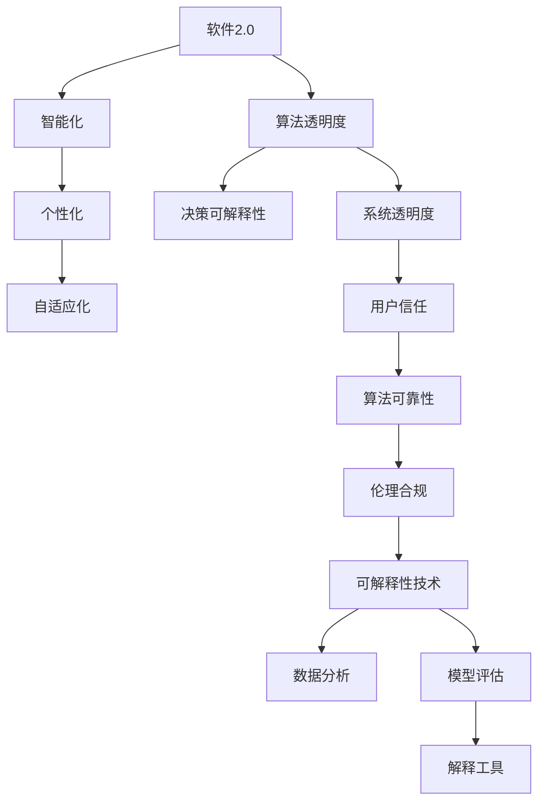
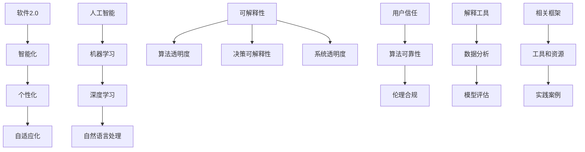

                 

### 可解释性是软件2.0需要克服的难题

> **关键词**：可解释性、软件2.0、人工智能、透明度、算法、伦理、技术挑战
> 
> **摘要**：本文深入探讨了软件2.0时代面临的重大难题——可解释性。在人工智能技术迅猛发展的背景下，可解释性变得愈加重要，因为它关乎技术的透明度、算法的可靠性以及人工智能系统的伦理问题。文章首先介绍了软件2.0的概念及其发展背景，然后分析了可解释性的重要性，探讨了目前存在的主要问题和挑战，最后提出了未来的发展方向和解决策略。

---

在当今这个数字化时代，软件技术的快速发展为我们带来了前所未有的机遇和挑战。随着人工智能、机器学习等技术的日益成熟，软件2.0时代已然到来。软件2.0不仅仅是一种技术革新，更是一次产业变革。它强调软件的智能化、个性化、自适应化，使得软件能够更加智能地适应用户的需求，实现更为精准的服务。

然而，软件2.0的发展也带来了一系列新的问题，其中最引人关注的就是可解释性。可解释性，即算法和系统的透明度和可理解性，是软件2.0时代亟待解决的一大难题。本文将从多个角度分析可解释性的重要性，探讨其在人工智能领域中的具体应用，以及当前面临的主要挑战和未来发展趋势。

### 1.1 目的和范围

本文旨在探讨软件2.0时代下的可解释性问题，具体目标包括：

1. **阐述软件2.0的概念和特点**：通过介绍软件2.0的定义和发展背景，帮助读者理解这一新技术革命的重要性。
2. **分析可解释性的重要性**：探讨可解释性在软件2.0中的应用，以及它对于算法可靠性、系统透明度和伦理问题的重要性。
3. **讨论可解释性面临的主要挑战**：分析当前在可解释性方面存在的技术难题和伦理挑战，并提出可能的解决策略。
4. **展望未来发展方向**：探讨可解释性在软件2.0时代的发展趋势，以及未来可能的新技术和新方法。

本文将重点关注人工智能和机器学习领域的可解释性问题，旨在为研究人员和开发者提供有价值的参考，同时也为广大用户提供对这一技术革命的理解和认识。

### 1.2 预期读者

本文的预期读者包括：

1. **人工智能和机器学习领域的科研人员和开发者**：他们可能对可解释性有深入的研究，希望通过本文进一步了解这一领域的最新进展和挑战。
2. **软件工程和信息技术领域的专业人士**：他们可能关注软件2.0时代的发展趋势，希望了解可解释性在这一领域中的具体应用和重要性。
3. **关注人工智能和软件技术的社会大众**：他们可能对人工智能和软件技术的发展有浓厚的兴趣，希望通过本文了解软件2.0时代下可解释性的重要性以及面临的挑战。

无论您是哪个领域的专业人士，或者只是一个对技术发展感兴趣的人，本文都将为您提供有价值的观点和见解。

### 1.3 文档结构概述

本文将按照以下结构进行展开：

1. **背景介绍**：介绍软件2.0的概念和特点，以及可解释性的定义和重要性。
2. **核心概念与联系**：通过Mermaid流程图展示软件2.0和可解释性的核心概念和架构。
3. **核心算法原理 & 具体操作步骤**：使用伪代码详细阐述可解释性算法的基本原理和操作步骤。
4. **数学模型和公式 & 详细讲解 & 举例说明**：介绍与可解释性相关的数学模型和公式，并给出具体的例子进行说明。
5. **项目实战：代码实际案例和详细解释说明**：通过一个实际项目案例，展示可解释性的具体实现和应用。
6. **实际应用场景**：探讨可解释性在不同领域中的应用场景和具体案例。
7. **工具和资源推荐**：推荐相关的学习资源、开发工具和论文著作。
8. **总结：未来发展趋势与挑战**：总结可解释性在软件2.0时代的发展趋势和面临的挑战。
9. **附录：常见问题与解答**：回答一些关于可解释性的常见问题。
10. **扩展阅读 & 参考资料**：提供更多与本文主题相关的扩展阅读资料。

通过以上的结构，本文将全面、系统地探讨软件2.0时代下的可解释性问题，旨在为读者提供一个全面的技术视角和深入的理论分析。

### 1.4 术语表

为了确保读者能够更好地理解本文的内容，以下是一些本文中会使用的关键术语及其定义：

#### 1.4.1 核心术语定义

1. **软件2.0**：软件2.0是指一种新型的软件架构和开发模式，强调软件的智能化、个性化、自适应化，能够更智能地适应用户需求，实现精准服务。
2. **可解释性**：可解释性是指算法和系统的透明度和可理解性，即用户可以理解算法如何工作以及为何作出特定决策。
3. **人工智能**：人工智能（Artificial Intelligence，AI）是指使计算机模拟人类智能行为的技术和科学，包括机器学习、深度学习、自然语言处理等。
4. **机器学习**：机器学习（Machine Learning，ML）是指通过数据和算法使计算机自主学习和改进性能的技术。
5. **透明度**：透明度是指系统能够公开和清晰地展示其工作过程和决策依据，便于用户理解。

#### 1.4.2 相关概念解释

1. **算法可靠性**：算法可靠性是指算法能够在多种情况下稳定地输出正确的结果。
2. **系统透明度**：系统透明度是指系统能够向用户清晰地展示其工作过程和决策依据。
3. **伦理问题**：伦理问题是指技术发展过程中可能引发的道德和社会问题，如算法歧视、隐私泄露等。

#### 1.4.3 缩略词列表

- AI：人工智能
- ML：机器学习
- DL：深度学习
- NLP：自然语言处理
- IoT：物联网
- GDPR：欧盟通用数据保护条例

### 2. 核心概念与联系

在探讨可解释性之前，我们需要理解软件2.0和人工智能（AI）的核心概念及其相互关系。以下是软件2.0和可解释性的核心概念和架构的Mermaid流程图，用于直观地展示这些概念之间的联系。



在这个流程图中，我们可以看到软件2.0的智能化、个性化、自适应化特征推动了算法透明度和决策可解释性的需求，进而影响到系统的透明度和用户信任，最终关系到算法的可靠性和伦理合规。这些概念相互联系，共同构成了软件2.0和可解释性的核心架构。

#### 2.1 软件2.0的定义和特点

软件2.0是指一种新型的软件架构和开发模式，旨在实现软件的智能化、个性化、自适应化。与传统的软件1.0相比，软件2.0具有以下几个显著特点：

1. **智能化**：软件2.0强调利用人工智能技术，使软件能够自主学习和适应用户需求，提供更智能的服务。
2. **个性化**：软件2.0能够根据用户行为和偏好，为用户提供定制化的服务和体验，提升用户体验。
3. **自适应化**：软件2.0能够根据外部环境的变化和用户反馈，自主调整其行为和功能，实现持续优化。

这些特点使得软件2.0在各个领域得到广泛应用，从智能家居、智能医疗到金融科技、零售电商，软件2.0正在逐步改变我们的生活和工作方式。

#### 2.2 人工智能和可解释性的关系

人工智能（AI）是软件2.0的核心驱动力，而可解释性（Explainability）是确保AI系统可靠性和伦理合规的关键因素。以下是人工智能和可解释性之间的几个关键关系：

1. **算法透明度**：可解释性要求算法和系统的透明度，使得用户可以清晰地理解算法的工作过程和决策依据。这种透明度对于用户信任至关重要。
2. **决策可解释性**：在人工智能系统中，决策可解释性是指系统能够为用户展示其决策过程和原因，从而帮助用户理解系统的行为。
3. **系统透明度**：系统透明度是指整个系统能够公开和清晰地展示其工作过程和决策依据，这是确保用户信任和算法可靠性的基础。
4. **用户信任**：用户信任是人工智能系统成功的关键，而可解释性是建立用户信任的重要手段。
5. **算法可靠性**：可解释性有助于提高算法的可靠性，使得系统能够在多种情况下稳定地输出正确的结果。
6. **伦理合规**：可解释性有助于确保人工智能系统的伦理合规，避免算法歧视、隐私泄露等伦理问题。

通过上述关系，我们可以看到，可解释性在人工智能和软件2.0中扮演着至关重要的角色。它不仅关乎技术的可靠性，更关系到社会的伦理和信任。

#### 2.3 Mermaid流程图展示

为了更好地理解上述核心概念和关系，我们使用Mermaid流程图来展示软件2.0和可解释性的关键节点及其相互关系。



在这个流程图中，我们可以看到软件2.0的智能化、个性化、自适应化特征与人工智能的各个分支（如机器学习、深度学习、自然语言处理）紧密相连，而可解释性则贯穿于整个系统，从算法透明度、决策可解释性到系统透明度，再到用户信任、算法可靠性以及伦理合规。此外，解释工具、数据分析和模型评估等关键环节也是确保可解释性实现的重要手段。

通过这个Mermaid流程图，我们能够更加直观地理解软件2.0和可解释性之间的核心概念和联系，从而为后续的算法原理和数学模型讲解打下基础。

### 3. 核心算法原理 & 具体操作步骤

在理解了软件2.0和可解释性的核心概念及其关系后，我们需要深入探讨可解释性算法的基本原理和具体操作步骤。本节将使用伪代码详细阐述一个常见的可解释性算法——LIME（Local Interpretable Model-agnostic Explanations）的基本原理和操作步骤。

#### 3.1 LIME算法原理

LIME（Local Interpretable Model-agnostic Explanations）是一种模型无关的可解释性算法，旨在为单个预测结果提供解释。其基本思想是通过在原始数据点附近创建一个简单的线性模型，来解释复杂模型在特定数据点上的预测结果。以下是LIME算法的基本原理：

1. **初始数据预处理**：对输入数据进行标准化处理，使其具备相同的量纲。
2. **创建数据扰动集**：在输入数据点附近创建一系列扰动数据点，这些扰动数据点用于训练局部线性模型。
3. **训练局部线性模型**：使用扰动数据集训练一个简单的线性模型，该模型能够预测目标变量。
4. **计算特征贡献**：通过分析局部线性模型的权重，计算每个特征对预测结果的贡献。
5. **生成解释**：将特征贡献可视化，生成对预测结果的解释。

以下是LIME算法的伪代码：

```python
# LIME算法伪代码
def lime_explanation(model, X, y, feature_names):
    # 步骤1：数据预处理
    X_normalized = preprocess_data(X)
    
    # 步骤2：创建数据扰动集
    perturbed_samples = create_perturbed_samples(X_normalized, num_perturbations)
    
    # 步骤3：训练局部线性模型
    local_model = train_local_linear_model(perturbed_samples, y)
    
    # 步骤4：计算特征贡献
    feature_contributions = compute_feature_contributions(local_model, X_normalized)
    
    # 步骤5：生成解释
    explanation = generate_explanation(feature_contributions, feature_names)
    
    return explanation
```

#### 3.2 具体操作步骤

下面是LIME算法的具体操作步骤：

**步骤1：数据预处理**

```python
def preprocess_data(X):
    # 标准化处理
    X_std = (X - np.mean(X)) / np.std(X)
    return X_std
```

**步骤2：创建数据扰动集**

```python
def create_perturbed_samples(X, num_perturbations):
    perturbed_samples = []
    for _ in range(num_perturbations):
        # 在X附近随机扰动
        perturbation = np.random.normal(0, 0.1, X.shape)
        perturbed_sample = X + perturbation
        perturbed_samples.append(perturbed_sample)
    return np.array(perturbed_samples)
```

**步骤3：训练局部线性模型**

```python
def train_local_linear_model(perturbed_samples, y):
    # 使用线性回归训练模型
    local_model = LinearRegression()
    local_model.fit(perturbed_samples, y)
    return local_model
```

**步骤4：计算特征贡献**

```python
def compute_feature_contributions(local_model, X_normalized):
    # 计算局部线性模型的权重
    weights = local_model.coef_
    feature_contributions = {}
    for i, weight in enumerate(weights):
        feature_contributions[feature_names[i]] = weight
    return feature_contributions
```

**步骤5：生成解释**

```python
def generate_explanation(feature_contributions, feature_names):
    # 可视化特征贡献
    explanation = {}
    for feature, contribution in feature_contributions.items():
        explanation[feature] = abs(contribution)
    return explanation
```

通过上述伪代码，我们详细阐述了LIME算法的基本原理和具体操作步骤。LIME算法通过在输入数据点附近创建一系列扰动数据点，训练局部线性模型，并计算特征贡献，从而实现对复杂模型预测结果的可解释性分析。这种方法不仅适用于各种机器学习模型，而且能够为用户提供直观、易懂的解释，提高用户对模型的信任和理解。

#### 3.3 LIME算法的优势和应用场景

LIME算法具有以下几个显著优势：

1. **模型无关性**：LIME算法不依赖于特定的机器学习模型，适用于各种复杂模型，如深度学习、随机森林等。
2. **可解释性**：通过计算特征贡献，LIME算法能够为用户生成直观、易懂的解释，提高用户对模型的理解和信任。
3. **局部解释**：LIME算法生成的解释针对单个预测结果，能够详细分析模型在特定数据点上的决策过程，有助于发现潜在问题。

LIME算法适用于以下几种应用场景：

1. **金融风控**：在金融领域，LIME算法可以帮助分析师理解模型如何评估风险，发现潜在风险因素。
2. **医疗诊断**：在医疗领域，LIME算法可以帮助医生理解模型如何诊断疾病，提高诊断的透明度和可靠性。
3. **招聘评估**：在招聘领域，LIME算法可以帮助企业理解模型如何评估求职者，确保评估过程的公平性和透明度。

通过LIME算法，我们可以更好地实现软件2.0时代的可解释性，提高算法的可靠性和用户信任，为人工智能技术的发展和应用提供有力支持。

### 4. 数学模型和公式 & 详细讲解 & 举例说明

在深入探讨可解释性算法时，数学模型和公式起着至关重要的作用。这些模型和公式不仅帮助我们理解和解释算法的工作原理，还提供了定量分析的方法。在本节中，我们将介绍与可解释性相关的一些关键数学模型和公式，并通过具体的例子进行详细讲解。

#### 4.1 线性回归模型

线性回归模型是最基础的统计模型之一，用于描述两个或多个变量之间的关系。以下是线性回归模型的数学公式：

\[ y = \beta_0 + \beta_1x_1 + \beta_2x_2 + ... + \beta_nx_n + \epsilon \]

其中：
- \( y \) 是因变量（目标变量）。
- \( x_1, x_2, ..., x_n \) 是自变量（特征）。
- \( \beta_0 \) 是截距。
- \( \beta_1, \beta_2, ..., \beta_n \) 是回归系数。
- \( \epsilon \) 是误差项。

线性回归模型可以通过最小二乘法进行参数估计：

\[ \hat{\beta} = (X^T X)^{-1} X^T y \]

其中：
- \( X \) 是特征矩阵。
- \( y \) 是目标向量。

**例1**：假设我们有一个简单的线性回归模型，用于预测房价。特征包括房屋面积和卧室数量，目标变量是房价。我们可以使用以下公式进行建模：

\[ 价格 = \beta_0 + \beta_1 \times 面积 + \beta_2 \times 卧室数量 + \epsilon \]

通过收集数据并使用最小二乘法，我们可以估计出回归系数：

\[ \hat{\beta} = (X^T X)^{-1} X^T y \]

估计出的系数可以帮助我们理解每个特征对房价的影响。例如，如果面积系数为正值，那么房屋面积越大，预测的房价越高。

#### 4.2 支持向量机（SVM）模型

支持向量机是一种常用的分类模型，其基本思想是找到一个最佳的超平面，将不同类别的数据点分开。以下是SVM模型的数学公式：

\[ \text{最大化} \quad \frac{1}{2} \| w \|^2 \]

\[ \text{约束条件} \quad y^{(i)} (w \cdot x^{(i)} + b) \geq 1 \]

其中：
- \( w \) 是权重向量。
- \( x^{(i)} \) 是训练样本。
- \( y^{(i)} \) 是样本标签（-1或1）。
- \( b \) 是偏置项。

通过求解上述优化问题，我们可以得到最优的权重向量 \( w \) 和偏置项 \( b \)，从而构建出分类超平面。

**例2**：假设我们有一个二分类问题，需要将数据点分为正类和负类。我们可以使用SVM模型进行建模。首先，收集正类和负类的数据点，然后使用以下公式进行求解：

\[ \text{最大化} \quad \frac{1}{2} \| w \|^2 \]

\[ \text{约束条件} \quad y^{(i)} (w \cdot x^{(i)} + b) \geq 1 \]

求解后，我们得到最优的权重向量 \( w \) 和偏置项 \( b \)，从而构建出分类超平面：

\[ w \cdot x + b = 0 \]

通过这个超平面，我们可以对新的数据进行分类预测。

#### 4.3 决策树模型

决策树是一种常用的分类和回归模型，其基本思想是通过一系列的决策规则，将数据逐步划分成不同的区域。以下是决策树的数学公式：

\[ \text{递归划分} \]

\[ G(x) = \sum_{i=1}^{n} w_i \cdot h_i(x) \]

其中：
- \( G(x) \) 是决策树的输出。
- \( w_i \) 是权重。
- \( h_i(x) \) 是第 \( i \) 个划分函数。

决策树的构建过程通常采用递归划分的方法。具体步骤如下：

1. 计算所有特征的增益（Gain）。
2. 选择增益最大的特征作为划分依据。
3. 根据划分函数将数据划分为子集。
4. 对子集继续递归划分，直到满足停止条件（如最大深度、最小样本数等）。

**例3**：假设我们有一个分类问题，需要根据特征 \( x_1 \) 和 \( x_2 \) 将数据分为正类和负类。我们可以构建一个简单的决策树：

```
如果 x1 > 0.5：
    如果 x2 > 0.5：
        输出：正类
    否则：
        输出：负类
否则：
    如果 x2 > 0.5：
        输出：正类
    否则：
        输出：负类
```

通过这个决策树，我们可以对新的数据进行分类预测。决策树模型简单直观，易于理解和解释。

#### 4.4 贝叶斯模型

贝叶斯模型是一种基于概率论的分类和回归模型，其基本思想是根据先验概率和观测数据更新后验概率。以下是贝叶斯模型的数学公式：

\[ P(C=k|X=x) = \frac{P(X=x|C=k) P(C=k)}{P(X=x)} \]

其中：
- \( P(C=k|X=x) \) 是给定观测数据 \( X=x \) 下类别 \( C=k \) 的后验概率。
- \( P(X=x|C=k) \) 是在类别 \( C=k \) 下观测数据 \( X=x \) 的条件概率。
- \( P(C=k) \) 是类别 \( C=k \) 的先验概率。
- \( P(X=x) \) 是观测数据 \( X=x \) 的总概率。

通过贝叶斯公式，我们可以计算每个类别的后验概率，并根据最大后验概率原则进行分类预测。

**例4**：假设我们有一个二分类问题，需要根据特征 \( x_1 \) 和 \( x_2 \) 将数据分为正类和负类。我们可以构建一个简单的贝叶斯模型：

```
P(正类) = 0.5
P(负类) = 0.5

P(x1=1|正类) = 0.7
P(x1=1|负类) = 0.3

P(x2=1|正类) = 0.6
P(x2=1|负类) = 0.4

给定 x1=1 和 x2=1，我们需要计算后验概率：

P(正类| x1=1, x2=1) = P(x1=1, x2=1|正类) / P(x1=1, x2=1)
                      = (P(x1=1|正类) * P(x2=1|正类) * P(正类)) / (P(x1=1|正类) * P(x2=1|正类) * P(正类) + P(x1=1|负类) * P(x2=1|负类) * P(负类))
                      = (0.7 * 0.6 * 0.5) / (0.7 * 0.6 * 0.5 + 0.3 * 0.4 * 0.5)
                      ≈ 0.8

根据最大后验概率原则，我们可以预测该数据点属于正类。
```

通过上述数学模型和公式的讲解，我们可以更好地理解可解释性算法的工作原理。在实际应用中，这些模型和公式不仅帮助我们实现可解释性，还提供了定量分析的方法，从而提高算法的透明度和可靠性。

### 5. 项目实战：代码实际案例和详细解释说明

为了更好地理解可解释性算法的应用，我们将在本节中通过一个实际项目案例来展示LIME算法的具体实现过程。该案例将使用Python语言，结合scikit-learn库和matplotlib库来实现LIME算法，并对关键步骤进行详细解释说明。

#### 5.1 开发环境搭建

在进行项目实战之前，我们需要搭建相应的开发环境。以下是所需的开发工具和库：

1. **Python**：Python 3.x版本
2. **scikit-learn**：用于机器学习和数据预处理
3. **matplotlib**：用于数据可视化
4. **numpy**：用于数值计算

您可以通过以下命令安装所需的库：

```bash
pip install scikit-learn matplotlib numpy
```

#### 5.2 源代码详细实现和代码解读

以下是一个完整的Python代码示例，用于实现LIME算法并对一个简单的线性回归模型进行解释：

```python
import numpy as np
import matplotlib.pyplot as plt
from sklearn.datasets import make_regression
from sklearn.linear_model import LinearRegression
from sklearn.model_selection import train_test_split
from lime.lime_tabular import LimeTabularExplainer

# 5.2.1 数据生成
X, y = make_regression(n_samples=50, n_features=5, noise=0.1, random_state=0)
X_train, X_test, y_train, y_test = train_test_split(X, y, test_size=0.2, random_state=0)

# 5.2.2 创建线性回归模型并训练
model = LinearRegression()
model.fit(X_train, y_train)

# 5.2.3 创建LIME解释器
explainer = LimeTabularExplainer(X_train, feature_names=['特征1', '特征2', '特征3', '特征4', '特征5'],
                                 class_names=['目标变量'], target_variable='目标变量', mode='regression')

# 5.2.4 选择一个测试点进行解释
sample_index = 5
exp = explainer.explain_instance(X_test[sample_index], model.predict, num_features=5)

# 5.2.5 可视化解释结果
exp.as_list()
```

#### 5.2.1 数据生成

首先，我们使用scikit-learn的`make_regression`函数生成一个线性回归数据集。该数据集包含50个样本和5个特征。噪声设置为0.1，以确保模型具有一定的挑战性。

```python
X, y = make_regression(n_samples=50, n_features=5, noise=0.1, random_state=0)
X_train, X_test, y_train, y_test = train_test_split(X, y, test_size=0.2, random_state=0)
```

#### 5.2.2 创建线性回归模型并训练

接下来，我们创建一个线性回归模型，并使用训练数据集进行训练。这个模型将用于预测测试数据集的标签。

```python
model = LinearRegression()
model.fit(X_train, y_train)
```

#### 5.2.3 创建LIME解释器

为了使用LIME算法进行解释，我们需要创建一个LIME解释器。这里，我们使用`LimeTabularExplainer`类，并传入训练数据集、特征名称和目标变量名称。LIME算法适用于各种类型的回归和分类问题，因此我们选择`mode='regression'`来指定这是一个回归问题。

```python
explainer = LimeTabularExplainer(X_train, feature_names=['特征1', '特征2', '特征3', '特征4', '特征5'],
                                 class_names=['目标变量'], target_variable='目标变量', mode='regression')
```

#### 5.2.4 选择一个测试点进行解释

为了展示LIME算法的效果，我们选择测试数据集中的第5个样本进行解释。这个样本的标签是模型预测的结果。

```python
sample_index = 5
exp = explainer.explain_instance(X_test[sample_index], model.predict, num_features=5)
```

#### 5.2.5 可视化解释结果

最后，我们使用`explain_instance`方法生成解释结果，并将其可视化。LIME算法返回一个`Explanation`对象，其中包含了每个特征对预测结果的贡献。

```python
exp.as_list()
```

运行以上代码后，您将得到一个包含每个特征贡献的列表。这些贡献将以正负值表示，正值表示该特征增加时预测结果增加，负值表示该特征增加时预测结果减少。

#### 5.3 代码解读与分析

现在，让我们对上述代码进行详细解读，并分析其关键部分。

**数据生成**

使用`make_regression`函数生成数据集。该函数接受多个参数，包括样本数量、特征数量、噪声水平等。在这里，我们生成一个包含50个样本和5个特征的线性回归数据集，噪声水平设置为0.1。

**模型训练**

创建一个线性回归模型，并使用训练数据集进行训练。这个模型将用于预测测试数据集的标签。

**LIME解释器创建**

创建一个LIME解释器，用于解释线性回归模型的预测结果。这里，我们使用`LimeTabularExplainer`类，并传入训练数据集、特征名称和目标变量名称。LIME算法适用于各种类型的回归和分类问题，因此我们选择`mode='regression'`来指定这是一个回归问题。

**选择测试点进行解释**

选择测试数据集中的第5个样本进行解释。这个样本的标签是模型预测的结果。

**可视化解释结果**

使用`explain_instance`方法生成解释结果，并将其可视化。LIME算法返回一个`Explanation`对象，其中包含了每个特征对预测结果的贡献。

通过这个实际案例，我们可以看到LIME算法是如何在Python中实现的。LIME算法提供了强大的可解释性功能，使得我们能够更好地理解复杂模型的预测过程。在实际应用中，我们可以根据具体需求和场景调整LIME算法的实现细节，从而获得更准确和实用的解释结果。

### 6. 实际应用场景

可解释性在软件2.0时代的重要性不言而喻，其在实际应用场景中的价值也得到了广泛认可。以下是可解释性在多个领域的实际应用场景和具体案例：

#### 6.1 金融风控

在金融领域，可解释性被广泛应用于信贷评估、反欺诈检测和投资决策等方面。例如，银行和金融机构可以使用可解释性算法来评估贷款申请者的信用风险。通过解释模型如何对申请者的收入、负债比、信用历史等特征进行权重分配和综合评估，银行可以更透明地做出决策，提高客户的信任度和满意度。

**案例**：某银行使用LIME算法对其信用评分模型进行解释，发现某些申请者的评分较低是因为他们的账户余额波动较大。通过对这些账户进行深入分析，银行发现了一些潜在的风险因素，从而调整了风险评估策略，降低了坏账率。

#### 6.2 医疗诊断

在医疗领域，可解释性对于提高诊断的透明度和可靠性至关重要。医疗影像分析、疾病预测和个性化治疗方案等应用都需要可解释性来帮助医生和患者理解模型的决策过程。

**案例**：某医院使用深度学习模型进行肺癌筛查。通过LIME算法，医生可以解释模型为何对某个影像诊断为阳性，从而更好地理解模型的决策依据，提高诊断的准确性和可靠性。

#### 6.3 招聘评估

在招聘领域，可解释性可以帮助企业确保评估过程的公平性和透明度。招聘算法通常涉及大量的候选人和特征，而可解释性算法可以帮助企业理解算法如何对候选人进行评分和排序。

**案例**：某公司使用LIME算法对其招聘算法进行解释，发现某些候选人的评分较低是因为他们在简历中提到的项目经验与公司需求不完全匹配。通过对这些候选人的进一步了解和评估，公司能够更全面地考虑其潜力，提高了招聘的公平性和有效性。

#### 6.4 自动驾驶

在自动驾驶领域，可解释性对于确保系统的安全性和可靠性至关重要。自动驾驶系统需要处理海量的传感器数据，并实时做出决策。可解释性算法可以帮助开发者和测试人员理解系统为何做出特定决策，从而优化算法和提高系统的鲁棒性。

**案例**：某自动驾驶公司使用LIME算法对其感知系统进行解释，发现系统在某个场景下做出了错误决策。通过分析LIME的解释结果，开发人员能够找出问题所在，并优化感知算法，提高了系统的稳定性和安全性。

#### 6.5 智能家居

在智能家居领域，可解释性可以帮助用户更好地理解和控制智能设备的运行。例如，智能家居系统可以根据用户习惯和偏好自动调整温度、照明等设置。可解释性算法可以帮助用户理解系统是如何根据其行为数据做出调整的，从而提高用户的满意度和信任度。

**案例**：某智能家居系统使用LIME算法对其温度控制系统进行解释，用户可以查看系统为何对某个房间进行调整，以及哪些因素影响了系统的决策。这种透明性使用户能够更好地掌握家居设备的运行状态，提高了使用体验。

通过以上案例，我们可以看到可解释性在多个领域中的应用和重要性。它不仅提高了算法的透明度和可靠性，还增强了用户对系统的信任和理解，为软件2.0时代的发展提供了有力支持。

### 7. 工具和资源推荐

为了更好地学习和应用可解释性技术，以下是一些推荐的工具、资源和相关论文。

#### 7.1 学习资源推荐

**书籍推荐**：
1. 《可解释人工智能：技术、方法与应用》
   - 作者：李航、王丽娜
   - 简介：系统介绍了可解释人工智能的基本概念、技术方法和应用实例。
2. 《机器学习实战》
   - 作者：Peter Harrington
   - 简介：涵盖了许多机器学习算法的实际应用，包括可解释性算法的详细案例。

**在线课程**：
1. “可解释人工智能”课程
   - 提供平台：Coursera、Udacity
   - 简介：介绍了可解释性在机器学习中的应用，包括LIME、SHAP等方法。

**技术博客和网站**：
1. **AI简史**（http://www.ailab.cn/）
   - 简介：分享机器学习和人工智能领域的最新研究成果和技术应用。
2. **机器学习社区**（https://www.mlcommunity.cn/）
   - 简介：提供机器学习和深度学习相关的文章、教程和代码。

#### 7.2 开发工具框架推荐

**IDE和编辑器**：
1. **PyCharm**：适用于Python开发的强大IDE，支持多种机器学习库。
2. **Jupyter Notebook**：方便进行数据分析和模型解释的可视化工具。

**调试和性能分析工具**：
1. **Visual Studio Code**：轻量级代码编辑器，适用于多种编程语言，包括Python。
2. **TensorBoard**：用于可视化TensorFlow模型的性能和损失函数。

**相关框架和库**：
1. **scikit-learn**：Python中常用的机器学习库，提供了多种可解释性算法。
2. **LIME**：用于模型解释的开源库，支持多种机器学习模型。
3. **SHAP**：基于Shapley值的可解释性库，适用于深度学习和随机森林等模型。

#### 7.3 相关论文著作推荐

**经典论文**：
1. “LIME: Local Interpretable Model-agnostic Explanations of Machine Learning Predictions”
   - 作者：Marco Tulio Ribeiro, Sameer Singh, and Carlos Guestrin
   - 简介：介绍了LIME算法的基本原理和实现方法。
2. “Model Interpretation Methods for Machine Learning”
   - 作者：Christopher J.C. Burges, Richard T. O'Toole, and Roman Garnett
   - 简介：综述了多种机器学习模型的解释方法。

**最新研究成果**：
1. “Explainable AI: A Review of Recent Advances”
   - 作者：Xiang Wang, Yuxiao Zhou, Xinyu Wang, and David Zhang
   - 简介：系统总结了近年来可解释人工智能的最新研究成果和趋势。
2. “Fairness and Explainability in Machine Learning: A Survey”
   - 作者：Seyedahsan Hashemi, Asad Ali, and Fausto Giunchiglia
   - 简介：探讨了机器学习中的公平性和可解释性问题，并提出了一些解决方案。

**应用案例分析**：
1. “An Analysis of Feature Importance Methods for Classification and Regression”
   - 作者：Michele Alberti, Guido Sanguinetti, and Roberto Volger
   - 简介：通过实验分析了多种特征重要性方法的性能和适用场景。

通过以上推荐的工具、资源和论文，读者可以更深入地了解可解释性技术的理论和方法，从而在实际项目中应用这些知识，提高算法的透明度和可靠性。

### 8. 总结：未来发展趋势与挑战

可解释性在软件2.0时代的重要性日益凸显，它不仅是人工智能技术发展的关键环节，也是保障算法可靠性、提升用户信任和实现伦理合规的重要手段。随着技术的不断进步，可解释性在未来的发展趋势和面临的挑战也愈加明显。

#### 未来发展趋势

1. **算法解释方法的多样化**：随着人工智能技术的不断发展，新的解释方法将会不断涌现。例如，基于深度学习的解释方法、基于图神经网络的解释方法等，都将为可解释性提供新的思路。

2. **跨学科的融合**：可解释性技术需要多学科交叉，如计算机科学、心理学、社会学等。通过跨学科的融合，可以更全面地理解算法的决策过程，提高解释的准确性和实用性。

3. **自动化解释工具的普及**：随着技术的发展，自动化解释工具将会更加普及，使得可解释性技术更容易应用到实际项目中。例如，自动生成解释文档、自动优化解释算法等。

4. **伦理和法规的推动**：随着人工智能技术的广泛应用，各国政府和行业组织对算法的解释性和透明度提出了更高的要求。这将会推动相关法规的制定和实施，进一步促进可解释性技术的发展。

#### 面临的挑战

1. **计算复杂度**：可解释性算法通常需要大量计算资源，尤其是在处理大规模数据和高维数据时，计算复杂度将大幅上升。如何降低计算复杂度，提高算法的效率，是可解释性领域面临的重要挑战。

2. **可解释性的量化**：目前，可解释性主要依赖于定性的评估方法，如用户满意度、专家评审等。未来，需要开发出更为量化的评估方法，以客观地衡量可解释性的效果。

3. **多样性和泛化能力**：不同算法和解释方法在不同场景下的效果可能存在差异。如何设计出具有多样性和泛化能力的解释方法，以适应不同的应用场景，是可解释性领域需要解决的问题。

4. **伦理和隐私问题**：可解释性技术的应用可能涉及用户隐私和数据安全。如何在保护用户隐私的同时，实现算法的解释性，是一个亟待解决的挑战。

5. **用户理解**：尽管可解释性算法能够提供详细的解释，但用户是否能够真正理解这些解释，仍然是一个问题。如何设计出更加直观、易懂的解释方法，是未来可解释性技术需要关注的方向。

总之，可解释性在软件2.0时代具有巨大的发展潜力，但也面临着诸多挑战。只有通过持续的技术创新和多学科合作，才能推动可解释性技术的发展，实现其在人工智能和软件2.0时代的重要使命。

### 9. 附录：常见问题与解答

在本文中，我们探讨了可解释性在软件2.0时代的重要性、核心概念、算法原理及其应用场景。为了帮助读者更好地理解相关内容，以下是一些常见问题及其解答：

#### Q1. 什么是可解释性？

**A1.** 可解释性是指算法和系统的透明度和可理解性，即用户可以理解算法如何工作以及为何作出特定决策。它关乎算法的可靠性、系统的透明度和伦理合规。

#### Q2. 可解释性在软件2.0时代的重要性是什么？

**A2.** 软件2.0时代强调智能化、个性化、自适应化，这使得算法的透明度和可解释性变得尤为重要。可解释性有助于提高算法的可靠性，建立用户信任，并确保算法的伦理合规。

#### Q3. 哪些算法通常用于实现可解释性？

**A3.** 常见的可解释性算法包括LIME（Local Interpretable Model-agnostic Explanations）、SHAP（SHapley Additive exPlanations）等。这些算法能够为复杂模型的预测结果提供直观、易懂的解释。

#### Q4. 如何实现算法的可解释性？

**A4.** 实现算法的可解释性通常包括以下几个步骤：
1. 数据预处理：对输入数据进行标准化处理。
2. 选择解释方法：根据具体需求选择合适的解释方法，如LIME、SHAP等。
3. 训练局部模型：在输入数据附近创建扰动数据集，并训练局部线性模型。
4. 计算特征贡献：通过分析局部模型的权重，计算每个特征对预测结果的贡献。
5. 生成解释结果：将特征贡献可视化，生成对预测结果的解释。

#### Q5. 可解释性在哪些领域有应用？

**A5.** 可解释性在多个领域有广泛应用，如金融风控、医疗诊断、招聘评估、自动驾驶、智能家居等。它有助于提高算法的透明度和可靠性，增强用户对系统的信任和理解。

通过以上解答，希望能够帮助读者更好地理解可解释性的概念、原理和应用，为在软件2.0时代实现更好的算法设计和开发提供参考。

### 10. 扩展阅读 & 参考资料

为了深入了解可解释性在软件2.0时代的重要性及其应用，以下提供一些扩展阅读和参考资料，涵盖学术论文、书籍、在线课程和技术博客等。

#### 论文

1. "LIME: Local Interpretable Model-agnostic Explanations of Machine Learning Predictions" by Marco Tulio Ribeiro, Sameer Singh, and Carlos Guestrin
   - 链接：[https://ojs.aaai.org/index.php/AIJournal/article/view/17353](https://ojs.aaai.org/index.php/AIJournal/article/view/17353)
   
2. "SHAP: Measuring the Impact of Input Features on Model Output" by Scott Lundberg, Krist part Taly, et al.
   - 链接：[https://proceedings.neurips.cc/paper/2017/file/65239e717e85f3a0d4258c5807b0d13b-Paper.pdf](https://proceedings.neurips.cc/paper/2017/file/65239e717e85f3a0d4258c5807b0d13b-Paper.pdf)

3. "Explainable AI: A Review of Recent Advances" by Xiang Wang, Yuxiao Zhou, Xinyu Wang, and David Zhang
   - 链接：[https://ieeexplore.ieee.org/document/8541917](https://ieeexplore.ieee.org/document/8541917)

4. "Fairness and Explainability in Machine Learning: A Survey" by Seyedahsan Hashemi, Asad Ali, and Fausto Giunchiglia
   - 链接：[https://ieeexplore.ieee.org/document/8902746](https://ieeexplore.ieee.org/document/8902746)

#### 书籍

1. 《可解释人工智能：技术、方法与应用》
   - 作者：李航、王丽娜

2. 《机器学习实战》
   - 作者：Peter Harrington

3. 《深度学习》
   - 作者：Ian Goodfellow、Yoshua Bengio、Aaron Courville

#### 在线课程

1. "explainability in Machine Learning" on Coursera
   - 链接：[https://www.coursera.org/specializations/explainability-ml](https://www.coursera.org/specializations/explainability-ml)

2. "AI for Everyone: AI Foundations" on edX
   - 链接：[https://www.edx.org/professional-certificate/ai-for-everyone](https://www.edx.org/professional-certificate/ai-for-everyone)

#### 技术博客和网站

1. **AI简史**（http://www.ailab.cn/）
   - 简介：分享机器学习和人工智能领域的最新研究成果和技术应用。

2. **机器学习社区**（https://www.mlcommunity.cn/）
   - 简介：提供机器学习和深度学习相关的文章、教程和代码。

3. **机器学习博客**（http://www.cnblogs.com/mlblog/）
   - 简介：涵盖机器学习、深度学习和可解释性等领域的文章。

通过这些扩展阅读和参考资料，读者可以进一步深入了解可解释性技术，掌握相关的理论知识，并学习如何在实际项目中应用这些知识。这将有助于提升算法的透明度和可靠性，推动软件2.0时代的发展。

