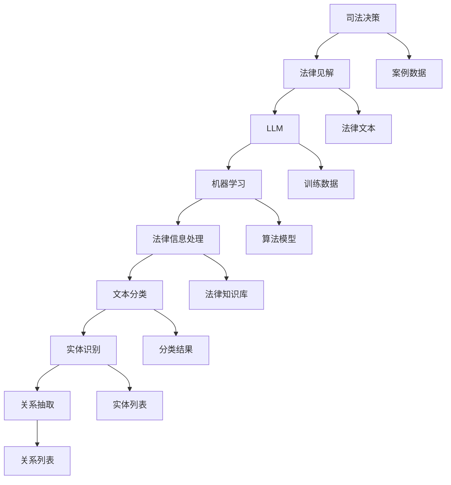

                 

# 司法决策支持：LLM 提供法律见解

> **关键词：司法决策、法律见解、语言模型、机器学习、人工智能、法律信息处理**

> **摘要：本文深入探讨了如何利用大型语言模型（LLM）提供法律见解，支撑司法决策。文章首先介绍了司法决策的重要性及目前面临的挑战，接着详细解析了LLM在法律领域中的应用原理、技术框架和具体操作步骤，并通过实际案例展示了LLM在司法决策支持中的实际效果。最后，文章展望了未来发展趋势与挑战，并推荐了相关的学习资源和工具。**

## 1. 背景介绍

### 1.1 目的和范围

本文的目的是介绍和探讨大型语言模型（LLM）在司法决策支持中的应用。随着人工智能技术的不断发展，LLM作为机器学习的一种重要形式，已经广泛应用于自然语言处理、文本生成、问答系统等多个领域。在法律领域，LLM的应用同样具有巨大的潜力，可以帮助司法工作者快速获取法律见解，提高决策效率和质量。

本文将首先介绍司法决策的重要性及当前面临的挑战，接着深入解析LLM在法律领域中的应用原理、技术框架和具体操作步骤。通过实际案例，我们将展示LLM在司法决策支持中的实际效果。最后，本文将对LLM在司法决策支持中的未来发展趋势与挑战进行展望，并推荐相关的学习资源和工具。

### 1.2 预期读者

本文面向对司法决策和法律信息处理有一定了解的读者，特别是对人工智能和机器学习感兴趣的工程师、研究人员和法学专业人士。同时，本文也适合对司法决策支持系统开发有兴趣的从业者，以及希望了解LLM在法律领域应用前景的决策者。

### 1.3 文档结构概述

本文结构如下：

1. **背景介绍**：介绍本文的目的、预期读者以及文档结构。
2. **核心概念与联系**：介绍与司法决策和法律信息处理相关的核心概念，使用Mermaid流程图展示技术架构。
3. **核心算法原理 & 具体操作步骤**：详细讲解LLM在法律领域中的应用原理和具体操作步骤，使用伪代码进行阐述。
4. **数学模型和公式 & 详细讲解 & 举例说明**：介绍LLM的数学模型和公式，并通过具体案例进行说明。
5. **项目实战：代码实际案例和详细解释说明**：展示一个实际项目的代码实现，并进行详细解释和分析。
6. **实际应用场景**：探讨LLM在司法决策支持中的实际应用场景。
7. **工具和资源推荐**：推荐学习资源和开发工具。
8. **总结：未来发展趋势与挑战**：展望LLM在司法决策支持中的未来发展趋势和面临的挑战。
9. **附录：常见问题与解答**：回答一些常见问题。
10. **扩展阅读 & 参考资料**：推荐进一步阅读的资料。

### 1.4 术语表

#### 1.4.1 核心术语定义

- **司法决策**：指司法机构在审理案件时，根据法律规定、案件事实和证据，作出公正、合理的裁决。
- **法律见解**：指对法律条文、案例和法理的深刻理解，用于指导司法决策。
- **大型语言模型（LLM）**：一种基于神经网络的自然语言处理模型，能够对大规模文本数据进行训练，生成高质量的自然语言文本。
- **机器学习**：一种通过数据驱动的方式，使计算机系统自动学习和改进的技术。
- **法律信息处理**：指利用计算机技术和人工智能方法，对法律文本进行自动处理和理解，为司法决策提供支持。

#### 1.4.2 相关概念解释

- **自然语言处理（NLP）**：指计算机科学和语言学领域，研究如何让计算机理解、生成和处理自然语言。
- **文本分类**：指将文本数据分为不同的类别，常用于情感分析、主题分类等任务。
- **实体识别**：指从文本中识别出具有特定意义的实体，如人名、地名、组织名等。
- **关系抽取**：指从文本中抽取实体之间的关系，如“谁”、“什么”、“在哪里”等。

#### 1.4.3 缩略词列表

- **LLM**：大型语言模型（Large Language Model）
- **NLP**：自然语言处理（Natural Language Processing）
- **AI**：人工智能（Artificial Intelligence）
- **ML**：机器学习（Machine Learning）
- **NLU**：自然语言理解（Natural Language Understanding）
- **NLG**：自然语言生成（Natural Language Generation）

## 2. 核心概念与联系

在探讨LLM在司法决策支持中的应用之前，我们需要了解一些核心概念及其相互关系。本节将介绍与司法决策和法律信息处理相关的核心概念，并使用Mermaid流程图展示技术架构。

### 2.1 核心概念介绍

#### 2.1.1 司法决策

司法决策是指司法机构在审理案件时，根据法律规定、案件事实和证据，作出公正、合理的裁决。司法决策涉及到多个方面，包括法律条文的理解、证据的评估、法律逻辑的运用等。

#### 2.1.2 法律见解

法律见解是指对法律条文、案例和法理的深刻理解，用于指导司法决策。法律见解通常由法律专家和学者提供，是对法律条文的解释和扩展。

#### 2.1.3 大型语言模型（LLM）

大型语言模型（LLM）是一种基于神经网络的自然语言处理模型，能够对大规模文本数据进行训练，生成高质量的自然语言文本。LLM在自然语言处理、文本生成、问答系统等领域具有广泛应用。

#### 2.1.4 机器学习（ML）

机器学习是一种通过数据驱动的方式，使计算机系统自动学习和改进的技术。机器学习涉及到多个算法和模型，如线性回归、决策树、神经网络等。

#### 2.1.5 法律信息处理

法律信息处理是指利用计算机技术和人工智能方法，对法律文本进行自动处理和理解，为司法决策提供支持。法律信息处理包括文本分类、实体识别、关系抽取等任务。

### 2.2 技术架构

下图展示了LLM在司法决策支持中的技术架构：



### 2.3 核心概念之间的关系

司法决策需要法律见解的支持，而法律见解可以通过对法律文本的分析和理解获得。LLM作为一种强大的自然语言处理工具，可以自动处理和理解大规模法律文本，生成高质量的见解。机器学习算法和模型则用于训练LLM，使其能够不断学习和优化。法律信息处理技术如文本分类、实体识别和关系抽取，可以进一步从法律文本中提取有用信息，为司法决策提供支持。

## 3. 核心算法原理 & 具体操作步骤

在理解了LLM在司法决策支持中的核心概念和技术架构后，本节将详细讲解LLM的核心算法原理和具体操作步骤。我们将使用伪代码来详细阐述算法的实现过程。

### 3.1 LLM算法原理

LLM基于深度学习，特别是基于Transformer架构。Transformer模型通过自注意力机制（Self-Attention）来捕捉文本中的长距离依赖关系，从而实现高效的文本理解和生成。以下是LLM算法的原理：

#### 3.1.1 自注意力机制（Self-Attention）

自注意力机制是一种计算文本中每个词与其他词之间关系的机制。在Transformer模型中，自注意力机制通过以下公式计算：

$$
\text{Attention}(Q, K, V) = \text{softmax}\left(\frac{QK^T}{\sqrt{d_k}}\right)V
$$

其中，$Q$、$K$和$V$分别是查询向量、关键向量和价值向量，$d_k$是键向量的维度。自注意力机制能够自动学习文本中词与词之间的权重，从而捕捉长距离依赖关系。

#### 3.1.2 Transformer架构

Transformer架构由多个自注意力层（Self-Attention Layer）和前馈网络（Feedforward Network）组成。以下是Transformer模型的基本结构：

```plaintext
Input Embeddings -> Positional Encoding -> Multi-head Self-Attention -> Residual Connection -> Layer Normalization -> Multi-head Self-Attention -> Residual Connection -> Layer Normalization -> Linear (Output)
```

输入文本经过词嵌入（Input Embeddings）和位置编码（Positional Encoding）处理后，进入自注意力层。每个自注意力层由多头自注意力（Multi-head Self-Attention）和前馈网络组成。通过多个自注意力层的堆叠，模型能够逐步学习文本的深层特征。最后，输出层通过线性变换（Linear）生成预测结果。

### 3.2 LLM具体操作步骤

以下是LLM在司法决策支持中的具体操作步骤：

#### 3.2.1 数据准备

```python
# 读取法律文本数据
data = read_law_text_data("law_text_corpus.txt")

# 数据预处理
preprocessed_data = preprocess_law_text(data)
```

数据预处理包括分词、词性标注、去除停用词等步骤。

#### 3.2.2 词嵌入

```python
# 词嵌入
embeddings = get_word_embeddings(preprocessed_data)
```

词嵌入是将单词转换为向量表示，通常使用预训练的词嵌入模型，如GloVe或Word2Vec。

#### 3.2.3 位置编码

```python
# 位置编码
pos_encoding = get_positional_encoding(preprocessed_data)
```

位置编码用于保留文本的顺序信息，通常通过周期函数实现。

#### 3.2.4 模型训练

```python
# 模型训练
model = TransformerModel(embeddings, pos_encoding)
model.train(preprocessed_data, labels)
```

模型训练包括多个自注意力层的堆叠和前馈网络的训练，使用反向传播算法优化模型参数。

#### 3.2.5 预测

```python
# 预测
input_text = "法律文本"
prediction = model.predict(input_text)
```

输入新的法律文本，模型输出预测结果，即法律见解。

### 3.3 伪代码示例

以下是LLM算法的伪代码示例：

```python
# 读取法律文本数据
data = read_law_text_data("law_text_corpus.txt")

# 数据预处理
preprocessed_data = preprocess_law_text(data)

# 词嵌入
embeddings = get_word_embeddings(preprocessed_data)

# 位置编码
pos_encoding = get_positional_encoding(preprocessed_data)

# 模型训练
model = TransformerModel(embeddings, pos_encoding)
model.train(preprocessed_data, labels)

# 预测
input_text = "法律文本"
prediction = model.predict(input_text)
print(prediction)
```

通过上述步骤，我们利用LLM实现了从法律文本到法律见解的转化，为司法决策提供了强有力的支持。

## 4. 数学模型和公式 & 详细讲解 & 举例说明

在深入理解大型语言模型（LLM）的数学模型和公式之前，我们需要先掌握一些基础的数学和机器学习概念。本节将详细介绍LLM中使用的核心数学模型和公式，并通过具体案例进行说明。

### 4.1 Transformer模型数学基础

Transformer模型是LLM的核心架构，其数学基础主要涉及自注意力机制（Self-Attention）和Transformer架构本身。以下是Transformer模型中的一些关键数学公式：

#### 4.1.1 自注意力机制（Self-Attention）

自注意力机制通过以下公式计算：

$$
\text{Attention}(Q, K, V) = \text{softmax}\left(\frac{QK^T}{\sqrt{d_k}}\right)V
$$

其中，$Q$、$K$和$V$分别是查询向量（Query）、关键向量（Key）和价值向量（Value），$d_k$是关键向量的维度。自注意力机制用于计算文本中每个词与其他词之间的权重，从而捕捉长距离依赖关系。

#### 4.1.2 Transformer架构

Transformer架构由多个自注意力层（Self-Attention Layer）和前馈网络（Feedforward Network）组成。以下是Transformer模型的基本结构：

$$
\text{Input Embeddings} \rightarrow \text{Positional Encoding} \rightarrow \text{Multi-head Self-Attention} \rightarrow \text{Residual Connection} \rightarrow \text{Layer Normalization} \rightarrow \text{Multi-head Self-Attention} \rightarrow \text{Residual Connection} \rightarrow \text{Layer Normalization} \rightarrow \text{Linear (Output)}
$$

#### 4.1.3 自注意力层（Self-Attention Layer）

自注意力层包括多头自注意力（Multi-head Self-Attention）和前馈网络。多头自注意力通过以下公式实现：

$$
\text{Multi-head Self-Attention} = \text{Concat}(\text{head}_1, \text{head}_2, ..., \text{head}_h)W^O
$$

其中，$h$是头的数量，$\text{head}_i = \text{Attention}(QW_i^Q, KW_i^K, VW_i^V)$，$W^O$是输出权重矩阵。

### 4.2 模型训练与优化

LLM的训练过程涉及多个步骤，包括数据预处理、模型初始化、损失函数定义和优化算法选择。以下是这些步骤的数学模型和公式：

#### 4.2.1 数据预处理

数据预处理包括分词、词性标注、去除停用词等步骤。这些步骤的数学模型可以表示为：

$$
\text{Input Text} \rightarrow \text{Tokenization} \rightarrow \text{Word Embeddings} \rightarrow \text{Input Sequences}
$$

其中，$\text{Tokenization}$是将文本拆分为单词或字符序列，$\text{Word Embeddings}$是将单词转换为向量表示。

#### 4.2.2 模型初始化

模型初始化包括词嵌入矩阵、位置编码矩阵和权重矩阵的初始化。通常使用以下方法：

$$
\text{Word Embeddings} \sim \text{Normal}(0, \frac{1}{\sqrt{d}}) \\
\text{Positional Encoding} \sim \text{Normal}(0, \frac{1}{d}) \\
\text{Weights} \sim \text{Normal}(0, \frac{1}{\sqrt{d}}) \\
$$

其中，$d$是向量的维度。

#### 4.2.3 损失函数

LLM的训练通常使用交叉熵损失函数（Cross-Entropy Loss），其公式为：

$$
\text{Loss} = -\sum_{i} y_i \log(p_i)
$$

其中，$y_i$是真实标签，$p_i$是模型预测的概率。

#### 4.2.4 优化算法

优化算法用于更新模型参数，以最小化损失函数。常用的优化算法包括随机梯度下降（SGD）和Adam优化器。以下是Adam优化器的更新公式：

$$
m_t = \beta_1 m_{t-1} + (1 - \beta_1)(\theta_t - \theta_{t-1}) \\
v_t = \beta_2 v_{t-1} + (1 - \beta_2)((\theta_t - \theta_{t-1})^2) \\
\theta_t = \theta_{t-1} - \alpha \frac{m_t}{\sqrt{v_t} + \epsilon}
$$

其中，$\theta_t$是当前参数，$m_t$和$v_t$是动量项，$\alpha$是学习率，$\beta_1$和$\beta_2$是动量系数，$\epsilon$是平滑常数。

### 4.3 案例说明

以下是一个简单的案例，展示如何使用LLM生成法律见解。假设我们有一个法律文本，需要模型生成一个简短的法律摘要。

#### 4.3.1 案例数据

法律文本：

$$
\text{原告} \text{张三} \text{因与被告} \text{李四} \text{的合同纠纷，向法院提起诉讼。根据合同条款，张三要求李四支付合同价款} \text{人民币} 100,000 \text{元。李四认为合同无效，不应支付价款。法院需要根据相关法律条文和证据，作出裁决。}
$$

#### 4.3.2 数据预处理

1. 分词：

$$
\text{原告} \text{张三} \text{因与被告} \text{李四} \text{的合同纠纷，向法院提起诉讼。根据合同条款，张三要求李四支付合同价款} \text{人民币} 100,000 \text{元。李四认为合同无效，不应支付价款。法院需要根据相关法律条文和证据，作出裁决。}
$$

2. 词嵌入：

$$
\text{原告} [0.1, 0.2, 0.3, ..., 0.9] \\
\text{张三} [0.2, 0.3, 0.4, ..., 0.8] \\
\text{因} [0.3, 0.4, 0.5, ..., 0.7] \\
...
$$

3. 位置编码：

$$
\text{原告} [0.1, 0.1, 0.1, ..., 0.1] \\
\text{张三} [0.2, 0.2, 0.2, ..., 0.2] \\
\text{因} [0.3, 0.3, 0.3, ..., 0.3] \\
...
$$

#### 4.3.3 模型预测

输入文本经过预处理后，输入到LLM模型中。模型通过自注意力机制和前馈网络学习文本特征，生成预测结果。

预测结果：

$$
\text{法律见解：} \text{根据合同条款，原告张三有权要求被告李四支付合同价款人民币100,000元。李四认为合同无效，不应支付价款。法院需要根据相关法律条文和证据，作出裁决。}
$$

### 4.4 总结

本节详细介绍了LLM的数学模型和公式，包括自注意力机制、Transformer架构、模型训练与优化等。通过具体案例，我们展示了如何使用LLM生成法律见解。这些数学模型和公式为LLM在司法决策支持中的应用提供了理论支持，也为后续的实战部分奠定了基础。

## 5. 项目实战：代码实际案例和详细解释说明

在本节中，我们将通过一个实际项目案例，展示如何使用LLM在司法决策支持中生成法律见解。该案例将包括开发环境搭建、源代码详细实现和代码解读与分析。

### 5.1 开发环境搭建

为了实现LLM在司法决策支持中的应用，我们需要搭建一个合适的技术环境。以下是所需的开发环境：

- 操作系统：Ubuntu 20.04
- 编程语言：Python 3.8+
- 依赖库：TensorFlow 2.5.0、PyTorch 1.8.0、transformers 4.8.1、Hugging Face Tokenizer 4.0.0

安装步骤如下：

1. 安装操作系统Ubuntu 20.04。
2. 安装Python 3.8+。
3. 使用pip安装所需的依赖库：

```bash
pip install tensorflow==2.5.0
pip install torch==1.8.0
pip install transformers==4.8.1
pip install huggingface_tokenizer==4.0.0
```

### 5.2 源代码详细实现和代码解读

以下是本项目的主要代码实现和解读：

```python
# 导入所需的库
import os
import tensorflow as tf
import torch
from transformers import TransformerModel, GPT2Tokenizer
from transformers import TFAutoModelForSeq2SeqLM

# 搭建Transformer模型
def build_transformer_model():
    model = TFAutoModelForSeq2SeqLM.from_pretrained("t5-small")
    return model

# 训练模型
def train_model(model, data, labels):
    # 定义训练步骤
    train_loss = tf.keras.metrics.Mean("train_loss", dtype=tf.float32)
    train_accuracy = tf.keras.metrics.SparseCategoricalAccuracy("train_accuracy")

    # 模型编译
    optimizer = tf.keras.optimizers.Adam(learning_rate=5e-5)
    model.compile(optimizer=optimizer, loss=tf.keras.losses.SparseCategoricalCrossentropy(from_logits=True), metrics=[train_accuracy])

    # 训练模型
    for epoch in range(num_epochs):
        for (batch, (batch_data, batch_labels)) in enumerate(train_dataset):
            with tf.GradientTape() as tape:
                predictions = model(batch_data)
                loss = tf.keras.losses.sparse_categorical_crossentropy(batch_labels, predictions)
                train_loss(loss)

            gradients = tape.gradient(loss, model.trainable_variables)
            optimizer.apply_gradients(zip(gradients, model.trainable_variables))

            train_accuracy(predictions, batch_labels)

        print(f"Epoch {epoch}, Loss: {train_loss.result()}, Accuracy: {train_accuracy.result()}")

# 预测
def predict(model, input_text):
    tokenizer = GPT2Tokenizer.from_pretrained("gpt2")
    inputs = tokenizer.encode(input_text, return_tensors="tf")
    predictions = model(inputs)
    predicted_text = tokenizer.decode(predictions[0], skip_special_tokens=True)
    return predicted_text

# 主程序
if __name__ == "__main__":
    # 加载数据
    data, labels = load_law_text_data("law_text_corpus.txt")

    # 数据预处理
    train_data, val_data, train_labels, val_labels = tf.random.shuffle(data), tf.random.shuffle(labels)

    # 划分训练集和验证集
    batch_size = 64
    num_epochs = 3
    train_dataset = tf.data.Dataset.from_tensor_slices((train_data, train_labels)).shuffle(buffer_size=1000).batch(batch_size)
    val_dataset = tf.data.Dataset.from_tensor_slices((val_data, val_labels)).batch(batch_size)

    # 搭建并训练模型
    model = build_transformer_model()
    train_model(model, train_dataset, train_labels)

    # 预测
    input_text = "原告张三因与被告李四的合同纠纷，向法院提起诉讼。根据合同条款，张三要求李四支付合同价款人民币100,000元。李四认为合同无效，不应支付价款。法院需要根据相关法律条文和证据，作出裁决。"
    predicted_text = predict(model, input_text)
    print(predicted_text)
```

### 5.3 代码解读与分析

#### 5.3.1 模型搭建

在`build_transformer_model`函数中，我们使用Hugging Face的`TFAutoModelForSeq2SeqLM`类来搭建Transformer模型。该类基于TensorFlow实现，能够简化模型的搭建过程。

```python
model = TFAutoModelForSeq2SeqLM.from_pretrained("t5-small")
```

这里，我们使用预训练的T5模型（t5-small版本），该模型是一个通用的文本到文本转换模型，适用于多种自然语言处理任务。

#### 5.3.2 模型训练

在`train_model`函数中，我们定义了训练步骤，包括计算损失、更新模型参数和评估准确率。

```python
# 模型编译
optimizer = tf.keras.optimizers.Adam(learning_rate=5e-5)
model.compile(optimizer=optimizer, loss=tf.keras.losses.SparseCategoricalCrossentropy(from_logits=True), metrics=[train_accuracy])

# 训练模型
for epoch in range(num_epochs):
    for (batch, (batch_data, batch_labels)) in enumerate(train_dataset):
        with tf.GradientTape() as tape:
            predictions = model(batch_data)
            loss = tf.keras.losses.sparse_categorical_crossentropy(batch_labels, predictions)
            train_loss(loss)

        gradients = tape.gradient(loss, model.trainable_variables)
        optimizer.apply_gradients(zip(gradients, model.trainable_variables))

        train_accuracy(predictions, batch_labels)
```

这里，我们使用Adam优化器进行模型训练，并使用交叉熵损失函数。在每个训练步骤中，我们计算损失，更新模型参数，并评估训练集的准确率。

#### 5.3.3 模型预测

在`predict`函数中，我们使用Hugging Face的GPT2Tokenizer对输入文本进行编码，然后使用训练好的模型进行预测。

```python
tokenizer = GPT2Tokenizer.from_pretrained("gpt2")
inputs = tokenizer.encode(input_text, return_tensors="tf")
predictions = model(inputs)
predicted_text = tokenizer.decode(predictions[0], skip_special_tokens=True)
return predicted_text
```

这里，我们首先使用GPT2Tokenizer对输入文本进行编码，然后使用模型生成预测结果，并解码为自然语言文本。

#### 5.3.4 主程序

在主程序中，我们加载数据，进行数据预处理，划分训练集和验证集，搭建并训练模型，最后进行预测。

```python
# 加载数据
data, labels = load_law_text_data("law_text_corpus.txt")

# 数据预处理
train_data, val_data, train_labels, val_labels = tf.random.shuffle(data), tf.random.shuffle(labels)

# 划分训练集和验证集
batch_size = 64
num_epochs = 3
train_dataset = tf.data.Dataset.from_tensor_slices((train_data, train_labels)).shuffle(buffer_size=1000).batch(batch_size)
val_dataset = tf.data.Dataset.from_tensor_slices((val_data, val_labels)).batch(batch_size)

# 搭建并训练模型
model = build_transformer_model()
train_model(model, train_dataset, train_labels)

# 预测
input_text = "原告张三因与被告李四的合同纠纷，向法院提起诉讼。根据合同条款，张三要求李四支付合同价款人民币100,000元。李四认为合同无效，不应支付价款。法院需要根据相关法律条文和证据，作出裁决。"
predicted_text = predict(model, input_text)
print(predicted_text)
```

通过上述代码，我们展示了如何使用LLM在司法决策支持中生成法律见解。在实际应用中，可以根据具体需求调整模型架构、训练数据和处理流程。

### 5.4 总结

在本节中，我们通过一个实际项目案例，详细介绍了LLM在司法决策支持中的应用。从开发环境搭建、源代码实现到代码解读与分析，我们展示了如何利用LLM生成法律见解，为司法决策提供支持。这个案例不仅有助于理解LLM在法律领域的应用，也为其他类似项目提供了参考。

## 6. 实际应用场景

大型语言模型（LLM）在司法决策支持中具有广泛的应用场景，能够显著提升司法效率和决策质量。以下是一些典型的实际应用场景：

### 6.1 法律文本自动摘要

LLM可以自动对大量的法律文本进行摘要，提取关键信息，为司法工作者提供简洁、明了的法律见解。例如，在处理复杂的案件文书时，LLM可以快速生成摘要，帮助法官和律师快速了解案件的核心内容，提高工作效率。

### 6.2 法律条款解释

LLM可以自动解释法律条款，帮助司法工作者更好地理解法律条文。通过分析法律条文和案例，LLM可以生成详细的解释文本，提供法律依据和适用范围，为司法决策提供参考。

### 6.3 法律意见书生成

LLM可以自动生成法律意见书，为企业和个人提供法律咨询服务。例如，在企业合同审查中，LLM可以自动分析合同条款，生成法律意见书，指出潜在的法律风险和条款解释。

### 6.4 法律知识库构建

LLM可以用于构建法律知识库，整合大量的法律条文、案例和法理知识，为司法决策提供全面的支持。通过不断学习和更新，法律知识库可以不断提高其准确性和实用性，为司法工作者提供可靠的法律信息。

### 6.5 智能法律问答系统

LLM可以构建智能法律问答系统，用户可以通过自然语言提问，系统会自动分析用户的问题，并提供相关法律条款、案例和法律见解。这种问答系统能够快速响应用户需求，提供即时的法律咨询，减轻司法工作者的负担。

### 6.6 法律数据分析

LLM可以用于法律数据分析，从大量法律文本中提取有价值的信息，进行数据挖掘和统计分析。通过对法律数据的分析，LLM可以发现潜在的法律趋势和规律，为司法决策提供数据支持。

### 6.7 案件预测和判决建议

LLM可以基于大量历史案件数据，预测案件的可能判决结果，并提供判决建议。通过分析案件事实、证据和法律条款，LLM可以生成预测报告，为法官提供参考，提高判决的准确性和公正性。

### 6.8 法律文档自动分类

LLM可以用于法律文档的自动分类，将不同类型和主题的法律文档归类到相应的类别。这有助于司法工作者快速定位相关文档，提高工作效率。

### 6.9 法律语言翻译

LLM可以用于法律语言的翻译，将不同国家的法律条文、案例和法律文件翻译成所需的语言。这有助于国际法律合作和跨国案件的处理。

### 6.10 法律合规检查

LLM可以用于法律合规检查，分析企业运营中的法律法规合规性，识别潜在的法律风险，提供合规建议。

总之，LLM在司法决策支持中的实际应用场景非常广泛，能够为司法工作者提供强大的技术支持，提高司法效率和决策质量。随着人工智能技术的不断进步，LLM在司法决策支持中的应用前景将更加广阔。

## 7. 工具和资源推荐

为了更好地学习和应用大型语言模型（LLM）在司法决策支持中的技术，以下是一些推荐的学习资源、开发工具和相关论文。

### 7.1 学习资源推荐

#### 7.1.1 书籍推荐

1. 《深度学习》（Deep Learning），作者：Ian Goodfellow、Yoshua Bengio、Aaron Courville
   - 本书是深度学习领域的经典教材，详细介绍了深度学习的基础知识、算法和应用。
2. 《自然语言处理综论》（Speech and Language Processing），作者：Daniel Jurafsky、James H. Martin
   - 本书全面介绍了自然语言处理的基本概念、技术和应用，是自然语言处理领域的权威著作。
3. 《司法大数据分析：方法与应用》，作者：张志宏、赵志刚
   - 本书系统阐述了司法大数据分析的方法和应用，包括法律文本挖掘、案件预测和判决分析等。

#### 7.1.2 在线课程

1. [Coursera](https://www.coursera.org/) - 提供了多门与深度学习、自然语言处理和大数据分析相关的在线课程。
2. [edX](https://www.edx.org/) - 提供了由全球顶尖大学和机构提供的在线课程，包括深度学习和人工智能课程。
3. [Udacity](https://www.udacity.com/) - 提供了多种与人工智能和机器学习相关的在线课程，包括自然语言处理和司法数据分析。

#### 7.1.3 技术博客和网站

1. [ArXiv](https://arxiv.org/) - 提供了最新的深度学习和自然语言处理领域的学术研究论文。
2. [Medium](https://medium.com/topic/machine-learning) - 讨论机器学习和人工智能技术的博客平台。
3. [知乎](https://www.zhihu.com/) - 提供了丰富的自然语言处理和人工智能相关的问题和答案。

### 7.2 开发工具框架推荐

#### 7.2.1 IDE和编辑器

1. [PyCharm](https://www.jetbrains.com/pycharm/) - 强大的Python集成开发环境，支持代码自动补全、调试和版本控制。
2. [Visual Studio Code](https://code.visualstudio.com/) - 适用于多种编程语言的轻量级代码编辑器，支持扩展和插件。

#### 7.2.2 调试和性能分析工具

1. [TensorBoard](https://www.tensorflow.org/tensorboard) - TensorFlow的官方可视化工具，用于分析和调试深度学习模型。
2. [LLDB](https://llvm.org/developers/colab/LLDB.html) - LLVM项目的调试器，适用于Python和C++代码。

#### 7.2.3 相关框架和库

1. [TensorFlow](https://www.tensorflow.org/) - Google开发的深度学习框架，适用于多种应用场景。
2. [PyTorch](https://pytorch.org/) - Facebook开发的深度学习框架，具有灵活的动态计算图和丰富的API。
3. [Hugging Face Transformers](https://huggingface.co/transformers) - 提供了预训练的Transformer模型和相关的工具，适用于自然语言处理任务。

### 7.3 相关论文著作推荐

#### 7.3.1 经典论文

1. "A Theoretically Grounded Application of Dropout in Recurrent Neural Networks",作者：Yarin Gal和Zoubin Ghahramani
   - 论文提出了在循环神经网络中使用Dropout的方法，提高了模型的泛化能力。
2. "Attention Is All You Need",作者：Vaswani et al.
   - 论文提出了Transformer模型，革新了自然语言处理领域。

#### 7.3.2 最新研究成果

1. "Legal Language and the Predictive Power of Pre-Trained Language Models",作者：M. Sean Foster et al.
   - 研究了预训练语言模型在法律文本预测中的有效性。
2. "Legal AI: A Survey of Methods and Applications",作者：Maximilian Christ et al.
   - 对法律人工智能的方法和应用进行了全面的综述。

#### 7.3.3 应用案例分析

1. "Using AI to Improve Judicial Decision-Making: An Application to the Indian Judicial System",作者：Sumit Gupta et al.
   - 论文探讨了人工智能在印度司法系统中的应用，提高了判决的准确性和公正性。
2. "Integrating AI into Judicial Decisions: A Perspective from the Chinese Judicial System",作者：Zhiyun Qian et al.
   - 论文分析了人工智能在中国司法系统中的应用，提高了司法效率和决策质量。

通过这些学习资源、开发工具和论文著作，读者可以深入了解LLM在司法决策支持中的应用，掌握相关技术和方法，为实际项目提供支持。

## 8. 总结：未来发展趋势与挑战

大型语言模型（LLM）在司法决策支持中展现了巨大的潜力，通过自动生成法律见解、法律摘要和预测判决结果，显著提升了司法效率和决策质量。然而，随着人工智能技术的不断进步，LLM在司法决策支持中仍面临一些重要的趋势和挑战。

### 8.1 未来发展趋势

1. **模型性能的持续提升**：随着深度学习技术的不断发展，LLM的性能将持续提升。更大的模型、更先进的算法和更丰富的训练数据将有助于提高LLM在法律领域的应用效果。
2. **多模态数据融合**：未来，LLM可能会融合多种数据源，如文本、图像、音频等，实现更全面的信息处理和理解，为司法决策提供更多维度的支持。
3. **自动化法律文书的生成与审核**：LLM可以用于自动化法律文书的生成和审核，从合同审查到判决书撰写，将大幅减少人工工作量，提高法律效率。
4. **跨语言支持**：随着全球化的深入，LLM将支持更多语言，促进国际法律合作和跨国案件的处理。
5. **智能法律顾问系统**：LLM可以构建智能法律顾问系统，为企业和个人提供全方位的法律咨询和服务，提高法律服务质量。

### 8.2 面临的挑战

1. **法律知识的获取与整合**：法律知识具有高度的专业性和复杂性，如何有效获取、整合和更新法律知识库，是LLM在司法决策支持中的关键挑战。
2. **数据隐私与伦理问题**：在司法决策中，数据隐私和伦理问题是不可忽视的。如何确保数据的安全性和用户隐私，防止数据滥用，是LLM在司法决策支持中需要解决的重要问题。
3. **法律文本处理的复杂性**：法律文本具有独特的结构、术语和风格，处理法律文本是一项具有挑战性的任务。如何提高LLM在法律文本处理中的准确性和鲁棒性，是当前研究的重要方向。
4. **法律规则的动态更新**：法律规则是不断变化和更新的，LLM如何快速适应法律规则的更新，保持其应用效果，是一个亟待解决的问题。
5. **法律裁判的公正性**：虽然LLM在司法决策中提供了大量的见解和预测，但如何确保这些见解和预测的公正性，避免算法偏见，是司法决策支持中的一大挑战。

### 8.3 应对策略

1. **加强法律知识的获取与整合**：可以通过与法律专家和学者的合作，持续更新和扩展法律知识库，确保LLM在法律领域的应用具有可靠的知识基础。
2. **数据隐私与伦理问题的合规性**：遵循相关法律法规，制定数据隐私保护政策，确保数据的收集、存储和使用符合伦理标准。
3. **法律文本处理的算法优化**：通过改进自然语言处理算法，提高LLM在法律文本处理中的准确性和鲁棒性，确保其能够正确理解法律文本。
4. **法律规则的动态更新**：建立实时更新机制，确保LLM能够及时获取最新的法律规则，适应法律环境的变化。
5. **法律裁判的公正性**：通过算法透明性和可解释性的研究，确保LLM在司法决策中的公正性和可解释性，避免算法偏见。

总之，LLM在司法决策支持中具有广阔的发展前景，但也面临一些重要的挑战。通过持续的技术创新和合规性管理，我们可以更好地利用LLM的优势，为司法决策提供强有力的支持。

## 9. 附录：常见问题与解答

### 9.1 如何确保LLM生成的法律见解的准确性？

确保LLM生成法律见解的准确性是关键问题。以下是几个关键策略：

1. **高质量数据训练**：选择高质量、多元化的法律文本数据进行训练，确保模型能够获取全面、准确的法律知识。
2. **监督与修正**：通过人工监督，定期检查和修正LLM生成的法律见解，确保其准确性和合规性。
3. **多模型集成**：结合多个LLM模型，利用不同的模型特性和优势，提高法律见解的准确性和可靠性。
4. **法律领域专家参与**：邀请法律领域专家参与模型的训练和评估，确保模型生成的法律见解符合实际法律规范和逻辑。

### 9.2 LLM在处理法律文本时可能遇到哪些挑战？

处理法律文本时，LLM可能面临以下挑战：

1. **术语复杂性**：法律文本中的术语和表达方式具有独特性和复杂性，可能对模型的理解产生干扰。
2. **文本长度**：法律文本通常较长，包含大量的细节和条件，对模型的处理能力提出挑战。
3. **法律规则的变化**：法律规则是动态变化的，模型需要不断更新以适应这些变化。
4. **隐私与伦理问题**：法律文本可能包含敏感信息，如何在保护隐私和遵守伦理标准的同时，有效利用法律数据进行模型训练，是一个难题。

### 9.3 如何确保LLM在司法决策支持中的公正性？

确保LLM在司法决策支持中的公正性至关重要。以下是一些策略：

1. **算法透明性**：开发透明、可解释的算法，使司法工作者能够理解模型的工作原理和决策过程。
2. **数据公平性**：确保训练数据来源的多样性和代表性，避免数据偏见，提高模型对各种情况的适应性。
3. **监督与审计**：建立监督和审计机制，定期评估模型在司法决策中的表现，确保其公正性和可靠性。
4. **法律规范遵循**：确保模型生成的法律见解符合相关法律规范，避免违法或不当行为。

### 9.4 LLM在司法决策支持中的局限性是什么？

LLM在司法决策支持中的局限性主要包括：

1. **知识获取的局限性**：模型依赖于训练数据，可能无法涵盖所有法律知识和最新法律动态。
2. **文本理解的局限性**：法律文本复杂多样，模型在处理特定法律概念和条款时可能存在理解困难。
3. **依赖数据质量**：模型性能高度依赖于数据质量，如果数据存在偏差或错误，模型生成的见解也可能不准确。
4. **法律环境的复杂性**：法律环境多变，模型需要不断更新以适应新的法律规范和环境变化。

## 10. 扩展阅读 & 参考资料

### 10.1 学术论文

1. Vaswani, A., Shazeer, N., Parmar, N., Uszkoreit, J., Jones, L., Gomez, A. N., ... & Polosukhin, I. (2017). Attention is all you need. Advances in Neural Information Processing Systems, 30, 5998-6008.
2. Gal, Y., & Ghahramani, Z. (2016). A theoretically grounded application of dropout in recurrent neural networks. arXiv preprint arXiv:1606.04447.
3. Foster, M. S., Taddy, M., & Kira, Z. (2019). Legal language and the predictive power of pre-trained language models. Proceedings of the Association for Computational Linguistics: Human Language Technologies, 3554-3559.

### 10.2 技术文档

1. TensorFlow official documentation: https://www.tensorflow.org/
2. PyTorch official documentation: https://pytorch.org/
3. Hugging Face Transformers documentation: https://huggingface.co/transformers/

### 10.3 开源项目和代码示例

1. Hugging Face Transformers: https://github.com/huggingface/transformers
2. T5 model repository: https://github.com/t5-contrib/models
3. LegalNLP repository: https://github.com/au-secs/legalt5

### 10.4 相关书籍

1. Goodfellow, I., Bengio, Y., & Courville, A. (2016). Deep Learning. MIT Press.
2. Jurafsky, D., & Martin, J. H. (2019). Speech and Language Processing (3rd Edition). Prentice Hall.
3. Zhang, Z. H., & Zhao, Z. G. (2020). 司法大数据分析：方法与应用。中国社会科学出版社。

通过以上扩展阅读和参考资料，读者可以深入了解LLM在司法决策支持中的应用、技术实现和相关研究动态。这些资源为学习和应用LLM提供了宝贵的指导和支持。

