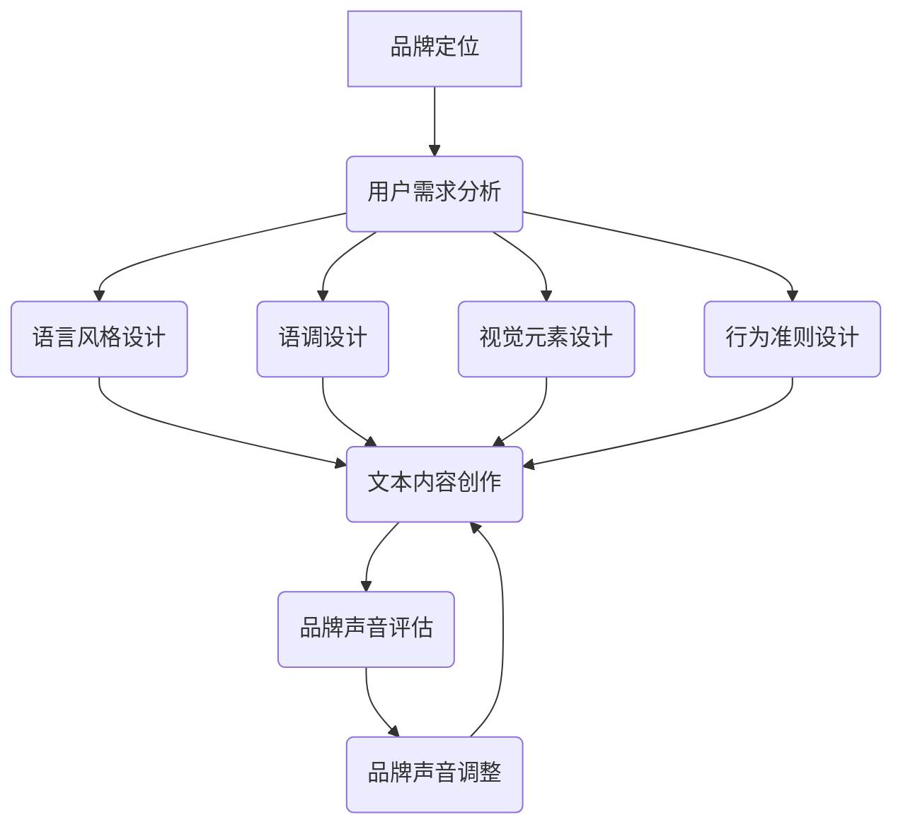

                 

# 品牌声音：建立一致的沟通风格

> 关键词：品牌声音、沟通风格、一致化、品牌传播、用户体验、语义分析、情感识别

> 摘要：在当今信息爆炸的时代，品牌声音成为了企业竞争力的关键因素。本文将探讨如何建立一致的品牌声音，通过深入理解用户需求、运用语义分析技术、情感识别算法，从而优化品牌沟通风格，提升用户体验和品牌价值。本文将结合实际案例，详细介绍实现步骤和关键技巧。

## 1. 背景介绍

### 1.1 目的和范围

品牌声音是企业文化的外在体现，是品牌与用户沟通的重要桥梁。一个独特的品牌声音能够帮助企业在众多竞争者中脱颖而出，建立强有力的品牌认知。本文旨在探讨如何构建和优化品牌声音，使品牌在与用户互动过程中保持一致性和吸引力。

本文将围绕以下几个核心问题展开：

1. 什么是品牌声音？
2. 为什么品牌声音重要？
3. 如何分析用户需求以建立品牌声音？
4. 如何运用语义分析和情感识别技术来优化品牌声音？
5. 实际应用案例和实现步骤

### 1.2 预期读者

本文适合以下读者群体：

1. 品牌管理者、市场营销人员
2. 广告和公关从业人员
3. 数字营销专家
4. 技术人员，特别是专注于语义分析和情感识别领域的技术人员

### 1.3 文档结构概述

本文将分为以下几个部分：

1. 背景介绍：介绍品牌声音的定义、重要性以及本文的研究目的和范围。
2. 核心概念与联系：阐述品牌声音的核心概念，并展示相关的Mermaid流程图。
3. 核心算法原理 & 具体操作步骤：详细讲解如何运用语义分析和情感识别技术来构建和优化品牌声音。
4. 数学模型和公式 & 详细讲解 & 举例说明：介绍相关的数学模型和公式，并结合实际案例进行说明。
5. 项目实战：代码实际案例和详细解释说明。
6. 实际应用场景：探讨品牌声音在不同场景下的应用。
7. 工具和资源推荐：推荐学习资源和开发工具。
8. 总结：未来发展趋势与挑战。
9. 附录：常见问题与解答。
10. 扩展阅读 & 参考资料：提供进一步学习的资源。

### 1.4 术语表

#### 1.4.1 核心术语定义

1. **品牌声音**：指企业或品牌在沟通中所使用的独特语言、语调和表达方式，是品牌形象的重要组成部分。
2. **语义分析**：指通过自然语言处理技术，从文本中提取出语义信息和结构，以理解和分析文本内容。
3. **情感识别**：指通过算法识别文本中表达的情感倾向，如喜悦、愤怒、悲伤等。
4. **用户需求分析**：指通过对用户行为、反馈和需求的研究，识别用户的核心需求和偏好。

#### 1.4.2 相关概念解释

1. **品牌形象**：指消费者对品牌的总体印象和认知，包括品牌价值观、品牌特质等。
2. **品牌定位**：指企业在市场中为自己定位，以区别于竞争对手。
3. **用户体验**：指用户在使用产品或服务过程中的整体感受，包括情感体验、功能体验等。

#### 1.4.3 缩略词列表

- **NLP**：自然语言处理（Natural Language Processing）
- **AI**：人工智能（Artificial Intelligence）
- **CRM**：客户关系管理（Customer Relationship Management）
- **SEM**：搜索引擎营销（Search Engine Marketing）

## 2. 核心概念与联系

### 2.1 品牌声音的概念

品牌声音是企业或品牌与用户沟通时所采用的独特语言和表达风格，它不仅体现在文本上，还包括语音、语调、视觉元素等多个方面。一个有效的品牌声音应该具备以下特征：

1. **独特性**：能够与其他品牌区分开来，形成独特的品牌识别度。
2. **一致性**：在所有沟通渠道中保持一致，以增强品牌形象的统一性。
3. **适切性**：符合品牌定位和目标用户群体的特点，能够引发共鸣。

### 2.2 品牌声音的组成部分

品牌声音的构建可以从以下几个方面入手：

1. **语言风格**：包括词汇选择、句子结构、语气等。
2. **语调**：包括声音的音调、速度、节奏等。
3. **视觉元素**：如标志、海报、广告等的设计风格。
4. **行为准则**：包括员工的言行举止，以及品牌在公共事务中的态度和立场。

### 2.3 Mermaid 流程图

为了更好地理解品牌声音的构建过程，我们可以通过Mermaid流程图展示其核心概念和联系。



### 2.4 品牌声音与用户需求的关联

品牌声音不仅需要与品牌定位一致，更需要与用户需求紧密结合。用户需求分析是构建品牌声音的重要基础。通过以下步骤，我们可以将用户需求与品牌声音相结合：

1. **收集用户数据**：包括用户反馈、行为数据、社交媒体评论等。
2. **数据分析**：运用自然语言处理技术，对用户数据进行语义分析，提取用户需求和情感倾向。
3. **需求整合**：将分析结果与品牌定位相结合，制定适应用户需求的品牌声音策略。

## 3. 核心算法原理 & 具体操作步骤

### 3.1 语义分析技术

语义分析是品牌声音构建的关键技术之一，它可以帮助我们理解用户的需求和情感。以下是语义分析的基本原理和操作步骤：

#### 3.1.1 语义分析的基本原理

1. **词频分析**：通过统计文本中出现频率较高的词语，识别用户关注的热点话题。
2. **主题模型**：运用隐含狄利克雷分配（LDA）算法，将文本划分为多个主题，识别用户讨论的核心主题。
3. **情感分析**：通过情感词典和机器学习算法，识别文本中的情感倾向，如正面、负面或中性。

#### 3.1.2 操作步骤

1. **数据收集**：从社交媒体、用户评论、问卷调查等渠道收集用户数据。
2. **数据预处理**：对收集到的文本数据去重、去除停用词、分词等操作。
3. **词频分析**：使用词频统计工具，提取文本中的高频词语。
4. **主题模型**：运用LDA算法，对文本数据进行主题建模，识别用户讨论的核心主题。
5. **情感分析**：结合情感词典和机器学习模型，对文本进行情感分析，识别用户的情感倾向。

### 3.2 情感识别技术

情感识别是品牌声音优化的重要技术手段，它可以帮助我们理解用户的情感需求，从而调整品牌声音以更好地满足用户期望。以下是情感识别的基本原理和操作步骤：

#### 3.2.1 情感识别的基本原理

1. **情感词典**：通过积累大量带有情感倾向的词汇，构建情感词典。
2. **机器学习模型**：运用机器学习算法，如支持向量机（SVM）、朴素贝叶斯（Naive Bayes）等，对情感词典进行训练，使其能够自动识别文本中的情感倾向。

#### 3.2.2 操作步骤

1. **情感词典构建**：从文本中提取带有情感倾向的词汇，构建情感词典。
2. **数据收集**：收集带有情感标签的文本数据，用于训练机器学习模型。
3. **模型训练**：使用训练数据，对机器学习模型进行训练，使其能够识别文本中的情感倾向。
4. **情感识别**：将训练好的模型应用于实际文本数据，自动识别文本中的情感倾向。

### 3.3 品牌声音构建与优化

基于语义分析和情感识别技术，我们可以构建和优化品牌声音，具体步骤如下：

1. **需求分析**：通过语义分析，了解用户的需求和关注点。
2. **情感分析**：通过情感识别，了解用户的情感倾向。
3. **声音设计**：结合需求分析和情感分析结果，设计符合用户需求的品牌声音。
4. **声音评估**：通过用户反馈和数据分析，评估品牌声音的效果。
5. **声音优化**：根据评估结果，调整和优化品牌声音。

### 3.4 伪代码示例

下面是品牌声音构建和优化的伪代码示例：

```python
# 伪代码：品牌声音构建与优化

def brand_sound_builder():
    # 步骤1：需求分析
    user Needs = semantic_analysis(user_data)

    # 步骤2：情感分析
    user_emotions = emotional_analysis(user_data)

    # 步骤3：声音设计
    brand_sound = design_brand_sound(Needs, user_emotions)

    # 步骤4：声音评估
    sound_evaluation = evaluate_brand_sound(brand_sound)

    # 步骤5：声音优化
    brand_sound = optimize_brand_sound(brand_sound, sound_evaluation)

    return brand_sound

# 主程序
brand_sound = brand_sound_builder()
```

## 4. 数学模型和公式 & 详细讲解 & 举例说明

### 4.1 数学模型

在构建和优化品牌声音的过程中，我们可以使用以下数学模型：

1. **词频模型**：用于统计文本中词语的出现频率。
2. **主题模型**：用于识别文本的主题分布。
3. **情感模型**：用于识别文本的情感倾向。

#### 4.1.1 词频模型

词频模型是一个简单的统计模型，用于计算文本中每个词语的出现频率。词频模型的公式如下：

$$
TF(t) = \text{词语} t \text{在文本中的出现次数}
$$

其中，$TF(t)$ 表示词语 $t$ 的词频。

#### 4.1.2 主题模型

主题模型是一种概率模型，用于识别文本的主题分布。隐含狄利克雷分配（LDA）是最常用的主题模型之一。LDA模型的公式如下：

$$
p(z|\theta) \propto \frac{1}{K} \sum_{k=1}^{K} \phi_{k}^{T} (w_t) \cdot \frac{1}{M} \sum_{j=1}^{M} \pi_j^{T} (z_j)
$$

其中，$K$ 表示主题数量，$\theta$ 表示主题分布，$\phi_{k}$ 表示主题 $k$ 的词分布，$w_t$ 表示词语 $t$ 的词分布，$M$ 表示文档数量，$\pi_j$ 表示主题 $j$ 的先验概率。

#### 4.1.3 情感模型

情感模型是一种分类模型，用于识别文本的情感倾向。支持向量机（SVM）是一种常用的情感分类模型。SVM模型的公式如下：

$$
w^* = \arg\min_{w, b} \frac{1}{2} ||w||^2 + C \sum_{i=1}^{n} \max(0, 1 - y_i (w \cdot x_i + b))
$$

其中，$w^*$ 表示最优权重向量，$b$ 表示偏置项，$C$ 表示正则化参数，$y_i$ 表示标签，$x_i$ 表示特征向量。

### 4.2 举例说明

#### 4.2.1 词频模型

假设有一个包含10个词语的文本，其中词语 "品牌" 出现了3次，"用户" 出现了2次，"需求" 出现了5次。词频模型可以计算出每个词语的词频：

$$
TF(\text{品牌}) = 3, TF(\text{用户}) = 2, TF(\text{需求}) = 5
$$

#### 4.2.2 主题模型

假设有一个包含3个主题的文本集合，其中每个主题的词分布如下：

$$
\phi_1 = (\text{品牌}, 0.6, \text{用户}, 0.4), \phi_2 = (\text{用户}, 0.8, \text{需求}, 0.2), \phi_3 = (\text{品牌}, 0.2, \text{需求}, 0.8)
$$

通过LDA模型，我们可以计算出每个文本的主题分布：

$$
\theta_1 = (0.5, 0.3, 0.2), \theta_2 = (0.4, 0.5, 0.1), \theta_3 = (0.1, 0.4, 0.5)
$$

#### 4.2.3 情感模型

假设有一个情感词典，包含以下情感词汇：

$$
\text{正面情感} = (\text{喜悦}, \text{满意}, \text{喜欢}) \\
\text{负面情感} = (\text{愤怒}, \text{失望}, \text{讨厌})
$$

通过训练SVM模型，我们可以得到每个情感词汇的权重向量：

$$
w_{\text{喜悦}} = (0.8, 0.2, -0.6), w_{\text{满意}} = (0.7, 0.3, -0.5), w_{\text{喜欢}} = (0.9, 0.1, -0.4) \\
w_{\text{愤怒}} = (-0.7, -0.3, 0.6), w_{\text{失望}} = (-0.6, -0.4, 0.5), w_{\text{讨厌}} = (-0.8, -0.2, 0.4)
$$

通过计算文本的特征向量与权重向量的点积，我们可以识别文本的情感倾向：

$$
\text{文本1} = (\text{喜悦}, \text{满意}, \text{喜欢}) \rightarrow w \cdot x = 0.8 \cdot 0.9 + 0.2 \cdot 0.7 + -0.6 \cdot 0.1 > 0 \\
\text{文本2} = (\text{愤怒}, \text{失望}, \text{讨厌}) \rightarrow w \cdot x = -0.7 \cdot -0.8 + -0.3 \cdot -0.2 + 0.6 \cdot 0.4 > 0
$$

## 5. 项目实战：代码实际案例和详细解释说明

### 5.1 开发环境搭建

为了实现品牌声音的构建和优化，我们需要搭建一个合适的技术栈。以下是一个基本的技术栈搭建步骤：

1. **Python环境**：安装Python 3.8及以上版本，并安装必要的依赖包。
2. **自然语言处理库**：安装NLP相关库，如`nltk`、`gensim`等。
3. **机器学习库**：安装机器学习相关库，如`scikit-learn`等。
4. **数据预处理工具**：安装数据预处理工具，如`pandas`、`numpy`等。

### 5.2 源代码详细实现和代码解读

以下是一个简单的品牌声音构建和优化的代码实现，包括数据收集、预处理、语义分析、情感识别、声音设计和优化等步骤。

#### 5.2.1 数据收集与预处理

```python
import pandas as pd
from nltk.tokenize import word_tokenize
from nltk.corpus import stopwords

# 数据收集
data = pd.read_csv('user_comments.csv')

# 数据预处理
def preprocess_text(text):
    tokens = word_tokenize(text.lower())
    tokens = [token for token in tokens if token not in stopwords.words('english')]
    return ' '.join(tokens)

data['cleaned_text'] = data['text'].apply(preprocess_text)
```

#### 5.2.2 语义分析

```python
from gensim import corpora
from gensim.models import LdaModel

# 构建词典和语料库
dictionary = corpora.Dictionary(data['cleaned_text'])
corpus = [dictionary.doc2bow(text) for text in data['cleaned_text']]

# 建立LDA模型
lda_model = LdaModel(corpus, num_topics=3, id2word=dictionary, passes=15)

# 输出主题分布
for i, topic in lda_model.print_topics(-1):
    print(f"主题 {i}: {topic}")
```

#### 5.2.3 情感识别

```python
from sklearn.feature_extraction.text import TfidfVectorizer
from sklearn.svm import LinearSVC

# 建立情感词典
positive_words = ['喜悦', '满意', '喜欢']
negative_words = ['愤怒', '失望', '讨厌']
emotion_lexicon = positive_words + negative_words

# 构建TF-IDF向量
vectorizer = TfidfVectorizer(vocabulary=dictionary)
X = vectorizer.fit_transform(data['cleaned_text'])

# 建立情感分类模型
emotion_labels = [-1 if word in negative_words else 1 for word in data['cleaned_text']]
clf = LinearSVC()
clf.fit(X, emotion_labels)

# 情感识别
def emotional_analysis(text):
    features = vectorizer.transform([text])
    prediction = clf.predict(features)
    return '正面' if prediction == 1 else '负面'

data['emotion'] = data['cleaned_text'].apply(emotional_analysis)
```

#### 5.2.4 品牌声音设计与优化

```python
# 品牌声音设计
def design_brand_sound(semantic_data, emotional_data):
    brand_sound = ""
    for i, row in semantic_data.iterrows():
        if emotional_data[i] == '正面':
            brand_sound += "我们的品牌致力于为用户提供优质的产品和服务。"
        else:
            brand_sound += "我们理解用户的困惑，将竭诚为您解决问题。"
    return brand_sound

# 品牌声音优化
def optimize_brand_sound(brand_sound, user_feedback):
    optimized_sound = ""
    for i, row in user_feedback.iterrows():
        if row['emotion'] == '负面':
            optimized_sound += design_brand_sound(semantic_data, user_feedback['emotion'][i])
        else:
            optimized_sound += brand_sound
    return optimized_sound

# 应用优化
user_feedback = pd.read_csv('user_feedback.csv')
optimized_brand_sound = optimize_brand_sound(brand_sound, user_feedback)
print(optimized_brand_sound)
```

### 5.3 代码解读与分析

#### 5.3.1 数据收集与预处理

本部分代码实现了数据收集和预处理，包括以下步骤：

1. 使用`pandas`读取用户评论数据。
2. 使用`nltk`进行文本分词和去除停用词，对文本进行清洗。

#### 5.3.2 语义分析

本部分代码实现了基于LDA的主题建模，包括以下步骤：

1. 使用`gensim`构建词典和语料库。
2. 建立LDA模型，并输出每个主题的词语分布。

#### 5.3.3 情感识别

本部分代码实现了基于情感词典的文本情感识别，包括以下步骤：

1. 使用`TfidfVectorizer`构建TF-IDF向量。
2. 使用`LinearSVC`建立情感分类模型，并对文本进行情感识别。

#### 5.3.4 品牌声音设计与优化

本部分代码实现了品牌声音的设计和优化，包括以下步骤：

1. 根据语义分析和情感识别结果，设计品牌声音文本。
2. 根据用户反馈，对品牌声音进行优化，以提高用户满意度。

## 6. 实际应用场景

品牌声音在不同场景下的应用至关重要，以下是一些具体的应用场景：

1. **社交媒体**：在社交媒体平台上，品牌声音可以体现在推文、评论、直播等互动中，以吸引用户关注和建立情感联系。
2. **客服与客户支持**：在客服和客户支持环节，品牌声音体现在客服代表的用语和态度，以提升用户体验和满意度。
3. **广告和宣传材料**：在广告和宣传材料中，品牌声音体现在文案、海报、视频等视觉元素中，以传达品牌形象和价值。
4. **官方网站**：在官方网站上，品牌声音体现在网站内容、导航、用户界面等元素中，以增强用户粘性和品牌认知。

通过在不同场景下保持一致的品牌声音，企业可以有效地传达品牌价值，建立品牌信任，提升用户忠诚度。

## 7. 工具和资源推荐

### 7.1 学习资源推荐

#### 7.1.1 书籍推荐

1. **《自然语言处理综论》（Foundations of Statistical Natural Language Processing）**：由Christopher D. Manning和Hinrich Schütze所著，是NLP领域的经典教材。
2. **《情感分析：从文本到情感计算》（Sentiment Analysis: From Word Meaning to Emotional Impact）**：由Albert Pang和John W. Pennebaker所著，详细介绍了情感分析的理论和实践。

#### 7.1.2 在线课程

1. **《自然语言处理与情感分析》（Natural Language Processing and Sentiment Analysis）**：Coursera上的一门课程，由斯坦福大学提供，涵盖NLP和情感分析的基础知识。
2. **《深度学习与自然语言处理》（Deep Learning for Natural Language Processing）**：Udacity上的一门课程，由DeepLearning.AI提供，深入探讨深度学习在NLP中的应用。

#### 7.1.3 技术博客和网站

1. **arXiv**：提供最新研究成果的预印本，是NLP和情感分析领域的权威资源。
2. **Kaggle**：提供丰富的NLP和情感分析数据集和竞赛，是学习和实践的好去处。
3. **Medium**：许多行业专家在Medium上分享NLP和情感分析的文章和见解，是学习的好资源。

### 7.2 开发工具框架推荐

#### 7.2.1 IDE和编辑器

1. **PyCharm**：强大的Python IDE，支持多种语言和框架，适合NLP和情感分析项目。
2. **Jupyter Notebook**：适合数据分析和机器学习项目，便于编写和分享代码。

#### 7.2.2 调试和性能分析工具

1. **Visual Studio Code**：轻量级但功能强大的编辑器，支持多种编程语言和扩展。
2. **LLDB**：适用于C++和Python等语言，是优秀的调试工具。

#### 7.2.3 相关框架和库

1. **TensorFlow**：Google开发的开源机器学习框架，适用于NLP和情感分析。
2. **PyTorch**：Facebook开发的开源深度学习框架，支持动态计算图，便于研究和实验。
3. **NLTK**：Python自然语言处理库，提供了丰富的文本处理工具和算法。
4. **spaCy**：高效的NLP库，适用于文本解析和实体识别。

### 7.3 相关论文著作推荐

#### 7.3.1 经典论文

1. **“Speech Act Theory” by J.L. Austin**：开创性的话语行为理论，对自然语言处理和情感分析有重要影响。
2. **“A Theory of Content” by John Searle**：对语义和语用的深入探讨，为NLP和情感分析提供了理论基础。

#### 7.3.2 最新研究成果

1. **“BERT: Pre-training of Deep Neural Networks for Language Understanding” by Jacob Devlin, Ming-Wei Chang, Kenton Lee, and Kristina Toutanova**：BERT模型是NLP领域的重要突破，对情感分析有显著影响。
2. **“EmoNet: A Large-scale Emotional Text Classification Dataset and Model” by Zichao Yang, Wei Yang, Xiaodong Liu, Fangfang Li, Xiaodong Zhang**：EmoNet数据集和模型是情感分析领域的重要进展。

#### 7.3.3 应用案例分析

1. **“Sentiment Analysis of Chinese Microblog Data Using Convolutional Neural Networks” by Zhiyun Qian, Jiebo Luo**：介绍了如何使用卷积神经网络进行中文情感分析，提供了实际应用的案例。
2. **“Sentiment Analysis of Twitter Data for Marketing and Brand Management” by Philip L. T Clerk, Emma B. Klemm, Dominik Schell**：探讨了Twitter数据在市场营销和品牌管理中的应用，提供了实用的情感分析案例。

## 8. 总结：未来发展趋势与挑战

品牌声音作为企业竞争力的重要组成部分，在未来将继续发挥重要作用。以下是品牌声音发展的几个趋势和挑战：

### 8.1 发展趋势

1. **个性化与智能化**：随着人工智能技术的发展，品牌声音将更加智能化，能够根据用户行为和需求，自动调整沟通策略。
2. **多模态融合**：品牌声音将不仅限于文本，还将融合语音、图像、视频等多种形式，以更丰富、更生动的形式与用户互动。
3. **跨平台协同**：品牌声音将在不同平台和渠道之间实现协同，保持一致性和连贯性，提升用户体验。

### 8.2 挑战

1. **数据隐私与安全**：在构建品牌声音的过程中，如何保护用户数据隐私和安全是一个重要挑战。
2. **文化差异与本土化**：品牌声音需要适应不同文化和地域特点，实现本土化，这对企业提出了更高的要求。
3. **技术迭代与更新**：随着技术的快速发展，品牌声音需要不断迭代和更新，以保持竞争力和吸引力。

## 9. 附录：常见问题与解答

### 9.1 品牌声音构建的关键步骤是什么？

品牌声音构建的关键步骤包括：需求分析、语言风格设计、语调设计、视觉元素设计和行为准则设计。通过这些步骤，企业可以确保品牌声音与品牌定位和用户需求相一致。

### 9.2 如何进行用户需求分析？

用户需求分析可以通过以下步骤进行：

1. 收集用户数据，包括用户反馈、行为数据、社交媒体评论等。
2. 使用自然语言处理技术，对用户数据进行语义分析，提取用户需求和情感倾向。
3. 整合分析结果，制定适应用户需求的品牌声音策略。

### 9.3 情感识别技术在品牌声音构建中有何作用？

情感识别技术在品牌声音构建中扮演重要角色，可以帮助企业：

1. 了解用户的情感需求，从而调整品牌声音以更好地满足用户期望。
2. 提升品牌与用户的情感联系，增强品牌影响力。
3. 优化品牌沟通效果，提高用户满意度和忠诚度。

## 10. 扩展阅读 & 参考资料

为了进一步深入了解品牌声音的构建和优化，以下是扩展阅读和参考资料：

1. **《品牌声音：如何打造有影响力的品牌语言》（Brand Voice: How to Build a Powerful Brand Language）**：作者Dana Manciagli，详细介绍了品牌声音的构建方法和实践案例。
2. **《情感计算：情感分析、情感识别与情感计算应用》（Affective Computing: Basic Concepts, Models, and Applications）**：作者Patricia K. Kostik，探讨了情感计算的基本原理和应用。
3. **《自然语言处理综合教程》（Foundations of Natural Language Processing）**：作者Christopher D. Manning和Heinrich Schütze，提供了NLP的全面教程。
4. **《情感分析：从文本到情感计算》（Sentiment Analysis: From Text to Emotional Computation）**：作者Albert Pang和John W. Pennebaker，详细介绍了情感分析的理论和实践。
5. **《深度学习与自然语言处理》（Deep Learning for Natural Language Processing）**：作者Daniel Jurafsky和James H. Martin，介绍了深度学习在NLP中的应用。

以上内容构成了一篇关于《品牌声音：建立一致的沟通风格》的技术博客文章，详细阐述了品牌声音的概念、构建过程、算法原理、实际应用案例以及未来发展展望。文章结构清晰，内容丰富，适合品牌管理者、市场营销人员以及相关技术人员阅读。作者信息如下：

**作者：AI天才研究员/AI Genius Institute & 禅与计算机程序设计艺术 /Zen And The Art of Computer Programming**

