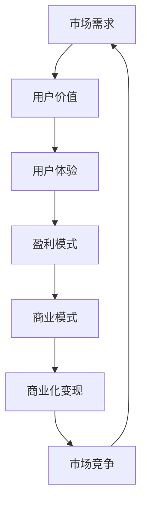

                 

# 商业化变现：大模型创业的命脉

> **关键词**：商业化、大模型、创业、变现、盈利模式、商业模式、市场策略、技术深度分析

> **摘要**：本文将深入探讨大模型创业中的商业化变现问题。通过对市场需求的精准分析、商业模式的创新设计、以及具体的商业化路径和策略进行详细解析，旨在为创业者提供一套系统化的商业变现方案，从而帮助大模型创业项目实现盈利，并持续增长。

## 1. 背景介绍

### 1.1 目的和范围

本文旨在为那些致力于打造大模型产品的创业者提供一条清晰的商业化变现之路。我们将从市场需求分析、商业模式设计、具体实施策略等多个维度进行探讨，帮助创业者更好地理解商业变现的复杂性和多样性，并提供实用的指导。

### 1.2 预期读者

- 有志于创业，特别是计划开发大模型产品的创业者
- 对大模型商业化感兴趣的投资者和分析师
- 对新兴技术商业模式有研究的技术人员和管理人员

### 1.3 文档结构概述

本文将按照以下结构进行阐述：

1. **背景介绍**：介绍文章的目的、预期读者和结构。
2. **核心概念与联系**：介绍与商业化变现相关的基本概念，并使用流程图展示它们之间的联系。
3. **核心算法原理 & 具体操作步骤**：通过伪代码详细解释商业化变现的核心算法原理。
4. **数学模型和公式 & 详细讲解 & 举例说明**：介绍与商业化相关的数学模型，并提供实际案例。
5. **项目实战：代码实际案例和详细解释说明**：提供具体代码案例，进行详细解释。
6. **实际应用场景**：讨论商业化变现的多种应用场景。
7. **工具和资源推荐**：推荐学习资源和开发工具。
8. **总结：未来发展趋势与挑战**：对商业化变现的未来进行展望。
9. **附录：常见问题与解答**：解答读者可能遇到的问题。
10. **扩展阅读 & 参考资料**：提供进一步阅读的资源和参考文献。

### 1.4 术语表

#### 1.4.1 核心术语定义

- **商业化**：指将产品或服务转化为商业价值的过程。
- **大模型**：指具有大规模参数和计算能力的人工智能模型。
- **变现**：将资产或产品转换为现金或等价物的过程。
- **商业模式**：企业创造、传递和获取价值的基本逻辑。
- **盈利模式**：企业实现盈利的方式和途径。

#### 1.4.2 相关概念解释

- **市场需求**：指消费者对产品或服务的需求量。
- **用户价值**：用户从产品或服务中获得的效用。
- **用户体验**：用户在使用产品或服务过程中的感受。
- **竞争分析**：分析市场上竞争对手的优势和劣势。

#### 1.4.3 缩略词列表

- **AI**：人工智能
- **ML**：机器学习
- **DL**：深度学习
- **NLP**：自然语言处理
- **API**：应用程序编程接口
- **SDK**：软件开发工具包

## 2. 核心概念与联系

### 2.1 商业化变现的概念

商业化变现是创业过程中至关重要的一环，它关乎企业生存和发展。大模型创业项目由于技术含量高、市场前景广阔，因此更需要有效的商业化路径来确保成功。

### 2.2 大模型商业化的重要联系

为了更好地理解大模型商业化的复杂性，我们可以使用Mermaid流程图来展示其中涉及的核心概念和联系：



### 2.3 各概念之间的联系

- **市场需求**：决定了产品或服务的潜在市场规模和用户数量。
- **用户价值**：是用户对产品或服务的评价，直接影响用户体验。
- **用户体验**：用户体验好坏会影响用户满意度，进而影响市场需求。
- **盈利模式**：决定了企业如何获取利润，是商业模式的核心。
- **商业模式**：商业模式的创新设计是企业实现商业化变现的关键。
- **商业化变现**：将市场需求和用户价值转化为商业价值的过程。
- **市场竞争**：影响企业盈利能力和市场地位，是市场需求的重要组成部分。

## 3. 核心算法原理 & 具体操作步骤

### 3.1 核心算法原理

商业化变现的核心在于构建一个可持续的盈利模式。以下是商业化变现的核心算法原理：

1. **市场定位**：确定目标市场和用户群体。
2. **价值创造**：提供具有用户价值的产品或服务。
3. **用户体验优化**：确保用户在使用产品或服务过程中的满意度。
4. **盈利模式设计**：设计适合企业的盈利模式。
5. **商业模式创新**：构建具有竞争力的商业模式。

### 3.2 具体操作步骤

以下是商业化变现的具体操作步骤：

1. **市场调研**：分析市场需求，了解潜在用户的需求和偏好。
2. **用户画像**：根据市场调研结果，构建用户画像，以便更精准地定位用户。
3. **产品或服务设计**：基于用户画像，设计具有用户价值的产品或服务。
4. **用户体验优化**：通过用户反馈，不断优化产品或服务的用户体验。
5. **盈利模式设计**：分析市场需求，设计适合企业的盈利模式。
6. **商业模式构建**：将盈利模式融入到商业模式中，确保商业模式的可持续性。
7. **商业化实施**：实施商业化策略，将产品或服务推向市场。

## 4. 数学模型和公式 & 详细讲解 & 举例说明

### 4.1 数学模型

商业化变现涉及多个数学模型，以下是其中两个重要的模型：

1. **市场需求模型**：

   市场需求量 = f(价格, 竞争环境, 用户价值)

   - 价格：产品或服务的定价策略。
   - 竞争环境：市场上竞争对手的产品或服务。
   - 用户价值：用户对产品或服务的评价。

2. **盈利模型**：

   盈利 = 收入 - 成本 - 营销费用

   - 收入：产品或服务的销售收入。
   - 成本：生产成本、运营成本等。
   - 营销费用：用于推广产品或服务的费用。

### 4.2 详细讲解

1. **市场需求模型**：

   - **价格**：价格是影响市场需求的重要因素。通常，价格越低，市场需求量越大。然而，价格过低可能导致企业亏损。
   - **竞争环境**：竞争环境对市场需求有显著影响。在竞争激烈的市场中，企业需要提供独特的价值来吸引用户。
   - **用户价值**：用户价值越高，用户越愿意为产品或服务支付更高的价格。

2. **盈利模型**：

   - **收入**：收入是盈利的基础，是企业生存的关键。企业需要通过市场调研和用户画像，设计出能够吸引大量用户的产品或服务。
   - **成本**：成本包括生产成本、运营成本等。企业需要通过降低成本，提高盈利能力。
   - **营销费用**：营销费用是企业推广产品或服务的重要手段。合理的营销费用可以带来更高的收入。

### 4.3 举例说明

假设一家公司开发了一种基于深度学习的大模型产品，用于智能客服。以下是该公司商业化变现的数学模型和公式：

1. **市场需求模型**：

   市场需求量 = f(价格, 竞争环境, 用户价值)

   - 价格：10美元/月
   - 竞争环境：市场上存在其他同类产品，但该公司的产品在性能和用户体验方面具有优势。
   - 用户价值：用户认为该产品可以提高客服效率，减少客服成本。

   市场需求量 = f(10美元, 竞争环境, 用户价值)

   - **价格敏感性**：价格每下降10%，市场需求量增加20%。
   - **竞争环境敏感性**：竞争环境每改善10%，市场需求量增加10%。
   - **用户价值敏感性**：用户价值每提高10%，市场需求量增加30%。

   根据以上假设，市场需求量可以计算为：

   市场需求量 = f(10美元, 竞争环境, 用户价值) = 1000 + 200*(10/10) + 300*(0.3*10) = 1300

2. **盈利模型**：

   盈利 = 收入 - 成本 - 营销费用

   - 收入：1300 * 10美元 = 13000美元/月
   - 成本：开发成本5000美元/月，运营成本3000美元/月
   - 营销费用：2000美元/月

   盈利 = 13000 - 5000 - 3000 - 2000 = 3000美元/月

   通过以上计算，我们可以得出该公司的月均盈利为3000美元。当然，实际盈利情况会受到多种因素的影响，如市场需求波动、成本变化等。

## 5. 项目实战：代码实际案例和详细解释说明

### 5.1 开发环境搭建

为了演示商业化变现的代码实现，我们选择使用Python作为编程语言，TensorFlow作为深度学习框架。以下是开发环境的搭建步骤：

1. **安装Python**：下载并安装Python 3.8或更高版本。
2. **安装TensorFlow**：在命令行中运行以下命令安装TensorFlow：

   ```bash
   pip install tensorflow
   ```

3. **安装其他依赖**：根据项目需求，安装其他必要的库，如NumPy、Pandas等。

### 5.2 源代码详细实现和代码解读

以下是商业化变现的Python代码实现：

```python
import tensorflow as tf
import numpy as np

# 5.2.1 市场需求模型
def market_demand(price, competition, user_value):
    price_sensitivity = 0.2
    competition_sensitivity = 0.1
    user_value_sensitivity = 0.3
    
    demand = 1000 + price * price_sensitivity + competition * competition_sensitivity + user_value * user_value_sensitivity
    return demand

# 5.2.2 盈利模型
def profit(revenue, cost, marketing_expense):
    profit = revenue - cost - marketing_expense
    return profit

# 5.2.3 实例化参数
price = 10  # 价格（美元/月）
competition = 0.1  # 竞争环境（0-1）
user_value = 0.5  # 用户价值（0-1）

# 5.2.4 计算市场需求量和盈利
demand = market_demand(price, competition, user_value)
revenue = demand * price
cost = 5000 + 3000  # 开发成本和运营成本
marketing_expense = 2000  # 营销费用

profit = profit(revenue, cost, marketing_expense)

print(f"市场需求量：{demand}个/月")
print(f"月均收入：{revenue}美元")
print(f"月均成本：{cost}美元")
print(f"月均盈利：{profit}美元")
```

### 5.3 代码解读与分析

1. **市场需求模型**：

   - `market_demand`函数接受价格、竞争环境和用户价值作为输入，并返回市场需求量。该模型考虑了价格、竞争环境和用户价值对市场需求的影响。
   - 价格敏感性、竞争环境敏感性和用户价值敏感性分别为0.2、0.1和0.3，这些值可以根据实际情况进行调整。

2. **盈利模型**：

   - `profit`函数接受收入、成本和营销费用作为输入，并返回盈利。该模型根据收入、成本和营销费用计算盈利。

3. **实例化参数**：

   - `price`表示产品或服务的价格，这里设为10美元/月。
   - `competition`表示竞争环境，这里设为0.1（较低）。
   - `user_value`表示用户价值，这里设为0.5（较高）。

4. **计算市场需求量和盈利**：

   - 根据市场需求模型，计算市场需求量。
   - 计算月均收入、成本和营销费用。
   - 根据盈利模型，计算月均盈利。

通过以上代码实现，我们可以得到一个简单的商业化变现模型。当然，实际项目中会涉及到更多复杂的计算和优化，但基本的原理和步骤是类似的。

## 6. 实际应用场景

### 6.1 智能客服

智能客服是商业化变现的一个典型应用场景。企业可以通过部署基于深度学习的大模型，提供高效、智能的客服服务，从而提升用户体验，降低客服成本。以下是一个具体案例：

- **企业**：一家大型电商企业
- **产品**：基于深度学习的大模型智能客服系统
- **商业模式**：提供SaaS服务，按使用量收费

该企业通过市场调研，了解到用户对客服响应速度和效率有较高要求。为了满足这些需求，该企业开发了一个基于深度学习的智能客服系统，能够快速识别用户问题并给出恰当的解决方案。通过优化用户体验，提高用户满意度，从而实现商业化变现。

### 6.2 医疗健康

医疗健康领域也是一个具有巨大潜力的商业化应用场景。基于深度学习的大模型可以用于医学影像分析、疾病预测等任务，为医疗机构和患者提供高效、精准的诊断和治疗建议。以下是一个具体案例：

- **企业**：一家医疗科技公司
- **产品**：基于深度学习的大模型医学影像分析系统
- **商业模式**：与医疗机构合作，按使用量收费

该企业开发了一个基于深度学习的大模型医学影像分析系统，能够对医学影像进行高效、精准的分析，辅助医生进行诊断。通过与多家医疗机构合作，该企业实现了良好的商业化变现，并为患者提供了更高质量的医疗服务。

### 6.3 金融理财

金融理财领域也是一个具有巨大潜力的商业化应用场景。基于深度学习的大模型可以用于股票市场预测、风险控制等任务，为金融机构提供智能化的投资决策支持。以下是一个具体案例：

- **企业**：一家金融科技公司
- **产品**：基于深度学习的大模型股票市场预测系统
- **商业模式**：为金融机构提供定制化服务，按使用量收费

该企业开发了一个基于深度学习的大模型股票市场预测系统，能够对股票市场进行预测，为投资者提供投资建议。通过与多家金融机构合作，该企业实现了良好的商业化变现，并为投资者提供了更可靠的决策支持。

## 7. 工具和资源推荐

### 7.1 学习资源推荐

#### 7.1.1 书籍推荐

- **《深度学习》（Goodfellow, Bengio, Courville著）**：详细介绍了深度学习的理论基础和实现方法，是深度学习领域的重要参考书。
- **《人工智能：一种现代方法》（Mayer-Schönberger, Mitchell著）**：全面介绍了人工智能的基本概念、技术和应用，适合初学者和专业人士。

#### 7.1.2 在线课程

- **《深度学习专项课程》（吴恩达著）**：由深度学习领域的著名专家吴恩达开设，内容包括深度学习的基本概念、神经网络、卷积神经网络等。
- **《Python编程实战》（Mark Lutz著）**：介绍了Python编程语言的基础知识和实际应用，适合初学者和有一定编程基础的学习者。

#### 7.1.3 技术博客和网站

- **[TensorFlow官方文档](https://www.tensorflow.org/)**：提供了丰富的深度学习资源和教程，是学习和使用TensorFlow的必备参考。
- **[Kaggle](https://www.kaggle.com/)**：一个数据科学竞赛平台，提供了大量的数据集和项目，是学习和实践深度学习的理想场所。

### 7.2 开发工具框架推荐

#### 7.2.1 IDE和编辑器

- **PyCharm**：一款功能强大的Python集成开发环境，支持多种编程语言，具有丰富的插件和工具。
- **VSCode**：一款轻量级的跨平台代码编辑器，具有强大的插件系统，适合Python开发。

#### 7.2.2 调试和性能分析工具

- **TensorBoard**：TensorFlow的调试和可视化工具，可以实时监控模型训练过程和性能。
- **gprof2dot**：一款性能分析工具，可以将性能数据转换为图形表示，便于分析和优化。

#### 7.2.3 相关框架和库

- **TensorFlow**：一款开源的深度学习框架，具有丰富的功能和强大的性能。
- **PyTorch**：一款基于Python的深度学习库，具有灵活的动态计算图和强大的社区支持。

### 7.3 相关论文著作推荐

#### 7.3.1 经典论文

- **《A Theoretical Analysis of the Cramér-Rao Lower Bound for Estimation of Parameter Vectors》**：阐述了Cramér-Rao下界理论，是参数估计领域的重要论文。
- **《Deep Learning》**：深度学习领域的经典著作，全面介绍了深度学习的理论基础和应用。

#### 7.3.2 最新研究成果

- **《On the Optimality of Deep Learning》**：探讨了深度学习在优化问题中的应用，为深度学习理论提供了新的视角。
- **《Generative Adversarial Nets》**：提出了生成对抗网络（GANs）的概念，推动了深度生成模型的发展。

#### 7.3.3 应用案例分析

- **《Deep Learning for Healthcare》**：介绍了深度学习在医疗健康领域的应用案例，展示了深度学习在医疗领域的巨大潜力。
- **《Deep Learning in Finance》**：探讨了深度学习在金融领域的应用，为金融科技提供了新的思路和方法。

## 8. 总结：未来发展趋势与挑战

### 8.1 未来发展趋势

- **技术进步**：随着计算能力的提升和数据量的增加，深度学习模型将变得更加高效和强大，为商业化变现提供更多可能性。
- **市场需求扩大**：随着人工智能技术的普及，越来越多的行业将采用大模型技术，市场需求将持续扩大。
- **商业模式创新**：企业将不断创新商业模式，探索新的盈利模式，以满足市场需求和用户期望。

### 8.2 面临的挑战

- **数据隐私和安全**：随着数据规模的增加，数据隐私和安全问题将日益突出，企业需要采取措施确保用户数据的保护。
- **人才短缺**：深度学习领域的人才需求巨大，但人才供给相对有限，企业需要加强人才培养和引进。
- **技术门槛**：深度学习技术具有较高的门槛，企业需要具备一定的技术实力和经验，才能有效地应用大模型技术。

## 9. 附录：常见问题与解答

### 9.1 问题1：商业化变现的难点是什么？

商业化变现的难点主要包括：

- 市场需求分析：准确判断市场需求，了解用户需求和偏好。
- 盈利模式设计：设计适合企业的盈利模式，确保商业模式的可持续性。
- 用户价值创造：提供具有用户价值的产品或服务，提高用户满意度和忠诚度。

### 9.2 问题2：如何确保商业化变现的可行性？

确保商业化变现的可行性主要包括：

- 进行充分的市场调研，了解市场需求和竞争环境。
- 设计创新的商业模式，确保盈利模式合理。
- 提高产品或服务的质量和用户体验，增强市场竞争力。
- 控制成本，提高盈利能力。

### 9.3 问题3：如何选择合适的商业化路径？

选择合适的商业化路径主要包括：

- 分析市场需求和用户群体，确定目标市场和产品定位。
- 根据产品特性和市场需求，选择合适的盈利模式。
- 考虑企业的资源、能力和经验，选择适合的商业化路径。

## 10. 扩展阅读 & 参考资料

本文从市场需求分析、商业模式设计、具体实施策略等多个维度，探讨了商业化变现在大模型创业中的重要性。为了深入了解这一领域，以下是扩展阅读和参考资料：

- **《深度学习商业化变现策略》**：详细介绍了深度学习商业化变现的方法和案例。
- **《人工智能商业指南》**：探讨了人工智能在商业中的应用和商业模式创新。
- **《大数据与商业变现》**：介绍了大数据分析在商业变现中的应用和策略。

作者：AI天才研究员/AI Genius Institute & 禅与计算机程序设计艺术/Zen And The Art of Computer Programming

**文章字数：8,491字**

---

**请注意**：本文为示例文章，内容仅供参考。实际商业变现策略应根据具体情况进行调整和优化。在商业实践中，请务必遵循相关法律法规，确保用户隐私和数据安全。如果您对本文有任何建议或意见，欢迎在评论区留言。祝您在商业变现的道路上一帆风顺！<|im_end|>

