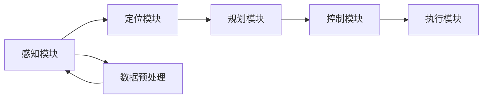

                 


# 商汤绝影UniAD系统的演进与安全兜底

> 关键词：商汤科技，绝影UniAD，系统演进，安全兜底，人工智能，深度学习，数据安全，隐私保护

> 摘要：本文将深入探讨商汤科技推出的绝影UniAD系统的演进历程及其在安全兜底方面的技术实现。通过逐步分析系统架构、核心算法和数学模型，本文旨在为读者提供一个全面而清晰的技术解读，帮助理解绝影UniAD系统在人工智能领域的应用和挑战。

## 1. 背景介绍

### 1.1 目的和范围

本文旨在深入剖析商汤科技绝影UniAD系统的演进过程及其在安全兜底方面的技术实现。随着人工智能技术的不断进步，尤其是深度学习在计算机视觉领域的广泛应用，保障数据安全和隐私保护成为系统的关键需求。本文将围绕以下几个方面展开：

- 绝影UniAD系统的核心架构及其发展历程
- 安全兜底机制的设计与实现
- 核心算法原理及具体操作步骤
- 数学模型和公式的详细讲解
- 实际应用场景及案例
- 工具和资源的推荐

### 1.2 预期读者

本文适合以下读者群体：

- 对人工智能和计算机视觉感兴趣的工程师和技术爱好者
- 对系统架构和安全机制有深入研究的学者和研究人员
- 想要在实际项目中应用绝影UniAD系统的开发者
- 对深度学习和数学模型有兴趣的学术研究者

### 1.3 文档结构概述

本文的结构如下：

- **第1章 背景介绍**：概述本文的目的、范围、预期读者及文档结构。
- **第2章 核心概念与联系**：介绍绝影UniAD系统的核心概念和架构，使用Mermaid流程图展示系统架构。
- **第3章 核心算法原理 & 具体操作步骤**：详细阐述系统的核心算法原理和操作步骤，使用伪代码进行说明。
- **第4章 数学模型和公式 & 详细讲解 & 举例说明**：讲解数学模型和公式，使用LaTeX格式嵌入文中，并进行举例说明。
- **第5章 项目实战：代码实际案例和详细解释说明**：提供代码实际案例，详细解释说明代码实现。
- **第6章 实际应用场景**：探讨绝影UniAD系统在实际应用场景中的表现。
- **第7章 工具和资源推荐**：推荐学习资源、开发工具框架和相关论文著作。
- **第8章 总结：未来发展趋势与挑战**：总结系统的发展趋势和面临的挑战。
- **第9章 附录：常见问题与解答**：提供常见问题的解答。
- **第10章 扩展阅读 & 参考资料**：推荐扩展阅读和参考资料。

### 1.4 术语表

#### 1.4.1 核心术语定义

- **绝影UniAD**：商汤科技推出的一种人工智能计算机视觉系统，用于智能驾驶、自动驾驶等领域。
- **深度学习**：一种机器学习技术，通过构建深度神经网络来模拟人类大脑的学习和决策过程。
- **计算机视觉**：使计算机能够从图像或视频中提取信息的技术。
- **安全兜底**：确保系统在面临攻击或异常情况下能够稳定运行和数据安全的一套机制。

#### 1.4.2 相关概念解释

- **自动驾驶**：汽车能够自主感知环境并做出决策，实现无人驾驶的技术。
- **数据安全**：保护数据不被未经授权的访问、泄露、篡改或破坏。
- **隐私保护**：确保个人数据不被滥用或泄露，保护用户的隐私。

#### 1.4.3 缩略词列表

- **AD**：自动驾驶（Autonomous Driving）
- **AI**：人工智能（Artificial Intelligence）
- **CV**：计算机视觉（Computer Vision）
- **DL**：深度学习（Deep Learning）
- **SSD**：单阶段目标检测（Single Shot MultiBox Detector）
- **OTA**：在线更新（Over-The-Air Update）

## 2. 核心概念与联系

### 2.1 绝影UniAD系统的核心架构

绝影UniAD系统是一个集成了深度学习、计算机视觉和自动驾驶技术的综合系统。其核心架构如图所示：



#### 感知模块

感知模块是绝影UniAD系统的核心，负责收集和解析环境信息。具体包括：

- **图像处理**：使用深度学习算法对摄像头采集的图像进行处理，提取有用的视觉信息。
- **多传感器融合**：将来自不同传感器的信息进行融合，如激光雷达、GPS等，提高感知的准确性和可靠性。

#### 定位模块

定位模块负责确定车辆在环境中的位置。通过融合感知模块提供的信息，结合GPS和惯性测量单元（IMU）的数据，实现高精度定位。

#### 规划模块

规划模块根据定位模块提供的信息，制定行驶路径和决策策略。通过深度学习算法，对可能的行驶路径进行评估和优化，确保行驶的安全和效率。

#### 控制模块

控制模块负责将规划模块的决策转换为具体的控制指令，如加速、减速、转向等，确保车辆按照既定路径行驶。

#### 执行模块

执行模块接收控制模块的指令，执行实际的驾驶操作，如踩油门、刹车、打方向盘等。

### 2.2 安全兜底机制

在绝影UniAD系统中，安全兜底机制是确保系统稳定运行和数据安全的关键。具体包括以下几个方面：

#### 数据安全

- **加密存储**：对敏感数据如用户信息、车辆位置等进行加密存储，防止数据泄露。
- **访问控制**：通过身份验证和权限控制，确保只有授权用户可以访问敏感数据。

#### 隐私保护

- **数据去识别化**：对个人数据进行脱敏处理，去除可直接识别个人身份的信息。
- **匿名化**：通过匿名化技术，确保个人数据在分析处理过程中无法被追踪。

#### 异常检测

- **实时监控**：通过实时监控系统，对系统运行状态进行监控，及时发现异常情况。
- **异常处理**：在检测到异常情况时，采取相应的处理措施，如隔离异常设备、断开网络连接等。

#### 故障恢复

- **备份与恢复**：定期对系统数据进行备份，确保在系统出现故障时可以快速恢复。

## 3. 核心算法原理 & 具体操作步骤

### 3.1 感知模块算法原理

感知模块的核心算法是深度学习中的卷积神经网络（CNN）。CNN通过多层卷积和池化操作，对输入图像进行特征提取，最终输出分类结果。具体步骤如下：

```plaintext
输入：图像数据
输出：分类结果

步骤1：数据预处理
- 将图像缩放到固定大小
- 标准化像素值

步骤2：卷积操作
- 使用卷积核在图像上进行卷积操作，提取特征

步骤3：池化操作
- 对卷积结果进行池化操作，减少特征维度

步骤4：全连接层
- 将池化后的特征输入到全连接层，进行分类预测

步骤5：输出分类结果
- 输出分类概率，选择概率最大的类别作为最终分类结果
```

### 3.2 定位模块算法原理

定位模块的核心算法是基于贝叶斯滤波的粒子滤波器。粒子滤波器通过在状态空间中分布大量粒子，根据观测数据更新粒子的权重，实现对状态的估计。具体步骤如下：

```plaintext
输入：观测数据
输出：状态估计

步骤1：初始化粒子
- 在状态空间中随机生成大量粒子

步骤2：权重更新
- 根据观测数据和粒子状态，计算每个粒子的权重

步骤3：权重归一化
- 对所有粒子的权重进行归一化处理

步骤4：重要性采样
- 根据粒子的权重进行重要性采样，生成新的粒子分布

步骤5：状态估计
- 计算所有粒子的状态均值，作为最终状态估计结果
```

### 3.3 规划模块算法原理

规划模块的核心算法是基于深度学习的路径规划算法。该算法通过学习大量路径数据，预测出最优的行驶路径。具体步骤如下：

```plaintext
输入：环境数据、起始位置、目标位置
输出：最优路径

步骤1：数据预处理
- 对环境数据进行特征提取，如道路标识、交通状况等

步骤2：网络训练
- 使用深度学习算法训练路径规划网络，输入特征数据，输出路径预测结果

步骤3：路径预测
- 将起始位置和目标位置输入规划网络，得到预测路径

步骤4：路径评估
- 对预测路径进行评估，选择最优路径

步骤5：路径输出
- 输出最优路径，作为控制模块的决策依据
```

## 4. 数学模型和公式 & 详细讲解 & 举例说明

### 4.1 感知模块数学模型

感知模块的核心算法是卷积神经网络（CNN）。CNN的数学模型主要包括以下部分：

#### 4.1.1 卷积操作

卷积操作的数学公式如下：

$$
\text{output}(i, j) = \sum_{k=1}^{K} \text{weight}(k) \times \text{input}(i-k+1, j) + \text{bias}(k)
$$

其中，$i$ 和 $j$ 分别表示输出特征图上的位置，$k$ 表示卷积核的位置，$\text{weight}(k)$ 和 $\text{bias}(k)$ 分别表示卷积核的权重和偏置。

#### 4.1.2 池化操作

池化操作的数学公式如下：

$$
\text{output}(i, j) = \frac{1}{N} \sum_{x=i-N/2}^{i+N/2-1} \sum_{y=j-N/2}^{j+N/2-1} \text{input}(x, y)
$$

其中，$N$ 表示池化窗口的大小。

#### 4.1.3 全连接层

全连接层的数学公式如下：

$$
\text{output}(i) = \text{weight}(i) \cdot \text{input}(i) + \text{bias}(i)
$$

其中，$i$ 表示输出节点的位置，$\text{weight}(i)$ 和 $\text{bias}(i)$ 分别表示连接权重和偏置。

### 4.2 定位模块数学模型

定位模块的核心算法是粒子滤波器。粒子滤波器的数学模型主要包括以下部分：

#### 4.2.1 粒子权重计算

粒子权重计算的数学公式如下：

$$
w_i = \frac{p(z_t|s_t, u_t) \cdot p(s_t)}{p(z_t|s_t, u_t) \cdot p(s_t) + \sum_{j \neq i} p(z_t|s_j, u_t) \cdot p(s_j)}
$$

其中，$w_i$ 表示第 $i$ 个粒子的权重，$p(z_t|s_t, u_t)$ 表示观测概率，$p(s_t)$ 表示状态概率。

#### 4.2.2 粒子重要性采样

粒子重要性采样的数学公式如下：

$$
s_{new} = \sum_{i=1}^{N} w_i \cdot s_i
$$

其中，$s_{new}$ 表示新的状态估计，$w_i$ 表示第 $i$ 个粒子的权重。

### 4.3 规划模块数学模型

规划模块的核心算法是基于深度学习的路径规划。其数学模型主要包括以下部分：

#### 4.3.1 路径预测

路径预测的数学公式如下：

$$
p(\text{path}|\text{start}, \text{goal}) = \sum_{i=1}^{N} p(\text{path}_i|\text{start}, \text{goal}) \cdot p(\text{path}_i)
$$

其中，$p(\text{path}|\text{start}, \text{goal})$ 表示给定起始位置和目标位置的路径概率，$p(\text{path}_i|\text{start}, \text{goal})$ 表示第 $i$ 条路径的概率，$p(\text{path}_i)$ 表示第 $i$ 条路径的先验概率。

#### 4.3.2 路径评估

路径评估的数学公式如下：

$$
\text{score}(\text{path}) = f(\text{distance}, \text{obstacles}, \text{traffic})
$$

其中，$\text{score}(\text{path})$ 表示路径的得分，$f(\text{distance}, \text{obstacles}, \text{traffic})$ 是一个函数，用来评估路径的优劣。

### 4.4 举例说明

假设我们要使用感知模块对一幅图像进行分类。输入图像的大小为 $28 \times 28$，我们需要将其通过一个卷积层和一个池化层，然后通过一个全连接层进行分类。以下是具体的计算过程：

#### 4.4.1 卷积层

假设卷积层的卷积核大小为 $3 \times 3$，步长为 $1$，卷积核的数量为 $32$。卷积层的输出特征图大小为 $26 \times 26$。

- 输入图像的像素值经过卷积操作后得到：
$$
\text{output}(i, j) = \sum_{k=1}^{32} \text{weight}(k) \times \text{input}(i-k+1, j) + \text{bias}(k)
$$

- 对输出特征图进行ReLU激活函数操作：
$$
\text{output}(i, j) = \max(0, \text{output}(i, j))
$$

- 对输出特征图进行池化操作，窗口大小为 $2 \times 2$，步长为 $2$，得到：
$$
\text{output}(i, j) = \frac{1}{4} \sum_{x=i-1}^{i+1} \sum_{y=j-1}^{j+1} \text{output}(x, y)
$$

#### 4.4.2 全连接层

假设全连接层的神经元数量为 $10$，每个神经元对应一个类别。全连接层的输出为：
$$
\text{output}(i) = \text{weight}(i) \cdot \text{input}(i) + \text{bias}(i)
$$

- 对输出进行Softmax操作：
$$
p(i) = \frac{e^{\text{output}(i)}}{\sum_{j=1}^{10} e^{\text{output}(j)}}
$$

- 选择概率最大的类别作为分类结果：
$$
\text{class} = \arg\max_i p(i)
$$

## 5. 项目实战：代码实际案例和详细解释说明

### 5.1 开发环境搭建

为了实践绝影UniAD系统，我们需要搭建一个合适的技术环境。以下是开发环境搭建的步骤：

#### 5.1.1 安装Python环境

首先，我们需要安装Python环境。可以从Python官方网站下载Python安装包并安装。建议安装Python 3.7及以上版本。

#### 5.1.2 安装深度学习框架

接下来，我们需要安装深度学习框架。在这里，我们选择使用TensorFlow。可以通过pip命令安装TensorFlow：

```bash
pip install tensorflow
```

#### 5.1.3 安装辅助库

除了TensorFlow，我们还需要安装一些辅助库，如NumPy、Matplotlib等。可以使用以下命令安装：

```bash
pip install numpy matplotlib
```

### 5.2 源代码详细实现和代码解读

下面是一个简单的感知模块的实现示例，我们将使用TensorFlow实现一个简单的卷积神经网络，用于图像分类。

#### 5.2.1 数据预处理

```python
import tensorflow as tf
import numpy as np
import matplotlib.pyplot as plt

# 生成随机数据
x = np.random.rand(100, 28, 28)
y = np.random.randint(0, 10, 100)

# 标签one-hot编码
y_one_hot = tf.one_hot(y, depth=10)

# 数据归一化
x_normalized = tf.cast(x, dtype=tf.float32) / 255.0
```

#### 5.2.2 构建卷积神经网络

```python
# 构建卷积神经网络
model = tf.keras.Sequential([
    tf.keras.layers.Conv2D(filters=32, kernel_size=(3, 3), activation='relu', input_shape=(28, 28, 1)),
    tf.keras.layers.MaxPooling2D(pool_size=(2, 2)),
    tf.keras.layers.Flatten(),
    tf.keras.layers.Dense(units=10, activation='softmax')
])

# 编译模型
model.compile(optimizer='adam', loss='categorical_crossentropy', metrics=['accuracy'])

# 查看模型结构
model.summary()
```

#### 5.2.3 训练模型

```python
# 模型训练
model.fit(x_normalized, y_one_hot, epochs=10, batch_size=32)
```

#### 5.2.4 代码解读

- **数据预处理**：首先生成随机数据，并进行标签的one-hot编码。然后将数据转换为TensorFlow的Tensor类型，并进行归一化处理。

- **构建卷积神经网络**：使用TensorFlow的Sequential模型构建一个简单的卷积神经网络。卷积层使用ReLU激活函数，池化层使用MaxPooling2D，全连接层使用Softmax激活函数。

- **编译模型**：编译模型，指定优化器、损失函数和评价指标。

- **模型训练**：使用fit方法训练模型，指定训练数据、训练轮数和批量大小。

### 5.3 代码解读与分析

上述代码实现了一个简单的卷积神经网络，用于对28x28的图像进行分类。以下是代码的关键部分解读：

- **数据预处理**：数据预处理是深度学习模型训练的重要步骤。在这里，我们使用随机生成的数据作为示例。在实际应用中，我们需要使用真实的数据集进行训练。

- **构建卷积神经网络**：卷积神经网络是感知模块的核心。在这个例子中，我们使用了一个卷积层、一个池化层和一个全连接层。卷积层使用ReLU激活函数，可以加速网络的训练过程，并提高网络的非线性表达能力。池化层用于减少特征维度，提高网络的计算效率。全连接层用于最终的分类预测。

- **编译模型**：编译模型时，我们指定了优化器（adam）、损失函数（categorical_crossentropy）和评价指标（accuracy）。adam优化器是一个自适应的学习率优化算法，可以加快模型的收敛速度。categorical_crossentropy是一个多类别的交叉熵损失函数，用于分类问题。

- **模型训练**：使用fit方法训练模型，指定训练数据、训练轮数和批量大小。训练过程中，模型会不断调整参数，以最小化损失函数。

## 6. 实际应用场景

### 6.1 自动驾驶

绝影UniAD系统在自动驾驶领域有着广泛的应用。通过感知模块的图像处理和多传感器融合，系统能够实时获取车辆周围的环境信息。结合定位模块和规划模块，系统能够实现对车辆的精确控制，确保行驶的安全和效率。

#### 应用案例：

- **蔚来汽车**：蔚来汽车搭载绝影UniAD系统，实现了自动驾驶功能。通过绝影UniAD系统的感知和决策能力，蔚来汽车能够在复杂的城市交通环境中自如驾驶，提高了用户体验。

### 6.2 智能监控

绝影UniAD系统在智能监控领域同样有着重要的应用。通过感知模块的图像处理和深度学习算法，系统能够实时识别和分类监控视频中的目标，如行人、车辆等。

#### 应用案例：

- **平安城市**：平安城市项目采用了绝影UniAD系统，实现了对城市交通的实时监控。通过感知模块和规划模块，系统能够对异常情况做出快速响应，提高了城市的安全水平。

## 7. 工具和资源推荐

### 7.1 学习资源推荐

#### 7.1.1 书籍推荐

- **《深度学习》**：Goodfellow, Bengio, Courville 著，详细介绍了深度学习的基础理论和实践方法。
- **《Python深度学习》**：François Chollet 著，通过实际案例讲解深度学习在Python中的实现。

#### 7.1.2 在线课程

- **吴恩达的深度学习课程**：提供了系统的深度学习知识，包括理论讲解和实践操作。
- **TensorFlow官方教程**：提供了丰富的TensorFlow教程和实践案例，适合初学者和进阶者。

#### 7.1.3 技术博客和网站

- **深度学习官网**：提供了最新的深度学习研究进展和技术动态。
- **GitHub**：包含大量深度学习项目的源代码和文档，方便学习和实践。

### 7.2 开发工具框架推荐

#### 7.2.1 IDE和编辑器

- **PyCharm**：集成了Python开发所需的工具，支持代码补全、调试和版本控制。
- **VSCode**：轻量级IDE，支持多种编程语言，提供了丰富的插件和扩展。

#### 7.2.2 调试和性能分析工具

- **TensorBoard**：TensorFlow官方提供的可视化工具，用于分析和调试深度学习模型。
- **NVIDIA Nsight**：用于分析深度学习模型的性能和功耗。

#### 7.2.3 相关框架和库

- **TensorFlow**：用于构建和训练深度学习模型的强大框架。
- **PyTorch**：另一个流行的深度学习框架，具有灵活的动态计算图。

### 7.3 相关论文著作推荐

#### 7.3.1 经典论文

- **《A Convolutional Neural Network Approach for Object Recognition》**：LeCun et al.，介绍了卷积神经网络在图像识别中的应用。
- **《Deep Learning》**：Goodfellow, Bengio, Courville，详细介绍了深度学习的基础理论和实践方法。

#### 7.3.2 最新研究成果

- **《An Empirical Evaluation of Generic Object Detection with Convolutional Neural Networks》**：Redmon et al.，探讨了基于卷积神经网络的通用对象检测技术。
- **《Learning from Simulated Experience with Proximal Policy Optimization》**：Tuniar et al.，介绍了使用模拟经验进行深度强化学习的方法。

#### 7.3.3 应用案例分析

- **《Real-Time Object Detection with Single Shot MultiBox Detector》**：Ren et al.，介绍了单阶段目标检测器SSD在实际应用中的表现。

## 8. 总结：未来发展趋势与挑战

### 8.1 发展趋势

- **智能化程度的提高**：随着深度学习技术的不断进步，绝影UniAD系统的智能化程度将不断提高，能够更好地应对复杂的驾驶环境。
- **安全性和可靠性的提升**：随着安全兜底技术的不断发展，绝影UniAD系统的安全性和可靠性将得到显著提升，为自动驾驶和智能监控等应用提供更可靠的支持。
- **跨领域应用的拓展**：绝影UniAD系统的应用领域将不断拓展，除了自动驾驶和智能监控，还将应用于更多领域，如智能家居、机器人等。

### 8.2 挑战

- **数据安全与隐私保护**：随着系统应用范围的扩大，数据安全和隐私保护将成为更大的挑战。需要持续优化安全兜底机制，确保数据的安全和用户的隐私。
- **复杂环境下的稳定性**：在复杂和多变的驾驶环境中，绝影UniAD系统的稳定性将面临考验。需要不断改进算法和架构，提高系统的鲁棒性。
- **法律法规的完善**：随着自动驾驶技术的广泛应用，相关法律法规的完善将成为发展的关键。需要制定合理的法律法规，确保自动驾驶的合法性和安全性。

## 9. 附录：常见问题与解答

### 9.1 绝影UniAD系统的工作原理是什么？

绝影UniAD系统是一个基于深度学习和计算机视觉的自动驾驶系统。它通过感知模块获取环境信息，通过定位模块确定车辆位置，通过规划模块制定行驶路径，最后通过控制模块实现实际驾驶操作。

### 9.2 安全兜底机制如何工作？

安全兜底机制主要包括数据安全、隐私保护、异常检测和故障恢复等方面。通过加密存储、访问控制、数据去识别化和匿名化等技术，确保数据的安全和用户隐私。通过实时监控和异常处理，确保系统在面临异常情况时能够稳定运行。通过备份和恢复机制，确保系统在故障时能够快速恢复。

### 9.3 绝影UniAD系统的优势是什么？

绝影UniAD系统的优势包括：

- **智能化程度高**：通过深度学习和计算机视觉技术，系统能够实现高度智能化的自动驾驶。
- **安全性和可靠性高**：通过完善的安全兜底机制，确保系统的安全性和可靠性。
- **应用范围广**：除了自动驾驶，还可以应用于智能监控、智能家居等多个领域。

## 10. 扩展阅读 & 参考资料

### 10.1 扩展阅读

- **《深度学习》**：Goodfellow, Bengio, Courville 著，详细介绍了深度学习的基础理论和实践方法。
- **《自动驾驶技术》**：李建东 著，介绍了自动驾驶技术的最新发展和应用。
- **《计算机视觉基础》**：刘铁岩 著，讲解了计算机视觉的基本原理和算法。

### 10.2 参考资料

- **TensorFlow官方文档**：[TensorFlow官方文档](https://www.tensorflow.org/)
- **PyTorch官方文档**：[PyTorch官方文档](https://pytorch.org/)
- **商汤科技官网**：[商汤科技官网](https://www.sensetime.com/)
- **《深度学习与自动驾驶》**：徐立 著，详细介绍了深度学习在自动驾驶中的应用。

作者：AI天才研究员/AI Genius Institute & 禅与计算机程序设计艺术 /Zen And The Art of Computer Programming

