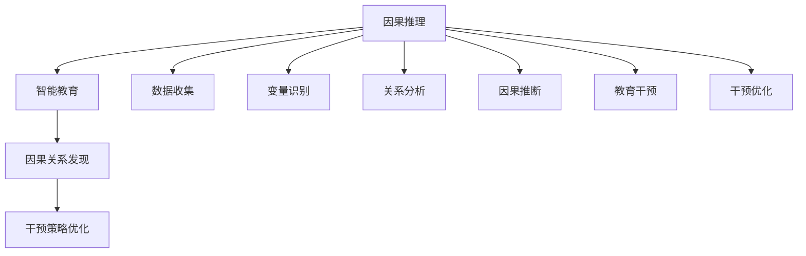
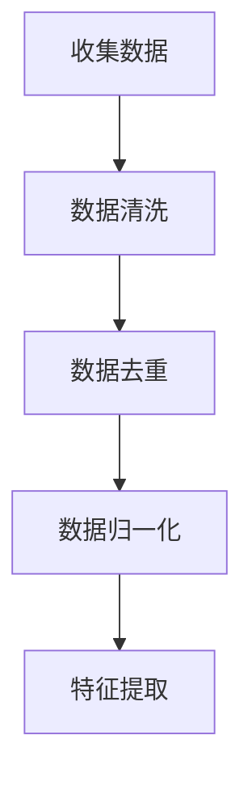
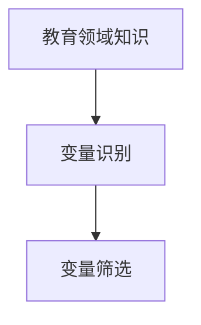
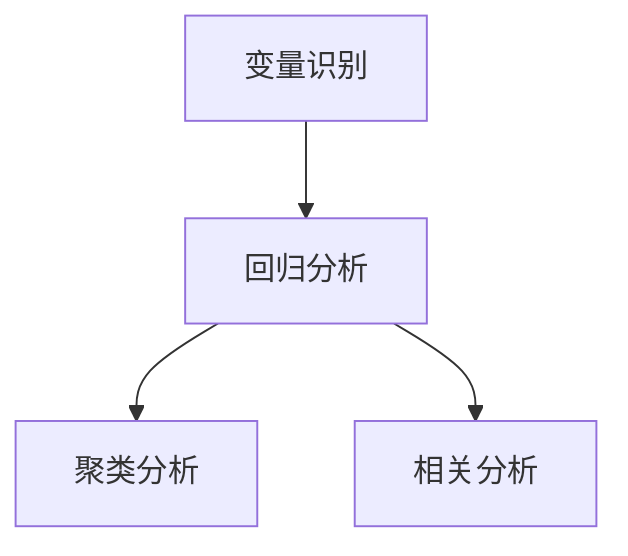
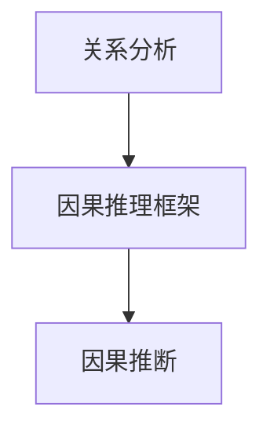
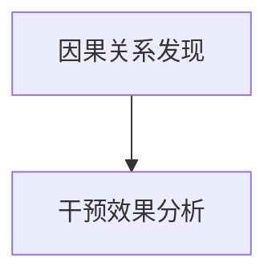
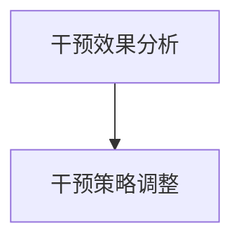
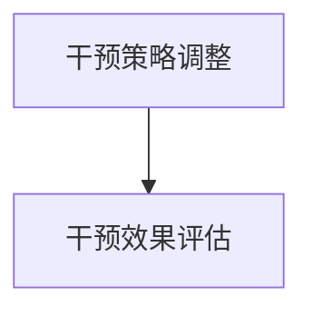
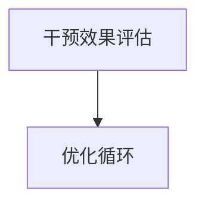

                 

## 文章标题

### 因果推理在智能教育因果关系发现与干预策略优化中的应用

> **关键词**：因果推理、智能教育、因果关系发现、干预策略优化

> **摘要**：本文旨在探讨因果推理在智能教育中的应用，特别是其在因果关系发现和干预策略优化方面的作用。通过深入剖析因果推理的核心概念和原理，结合具体案例，我们提出了利用因果推理优化智能教育系统的策略和方法。文章结构清晰，从背景介绍、核心概念与联系、算法原理及具体操作步骤、数学模型和公式、项目实战、实际应用场景等多个方面展开，旨在为教育工作者和研究者提供有价值的参考。

## 1. 背景介绍

### 1.1 目的和范围

智能教育作为一种新兴的教育模式，正日益受到关注。其核心目标是通过利用现代信息技术，如人工智能、大数据等，为学习者提供个性化、高效的教育服务。然而，智能教育的实现并非一蹴而就，其中因果关系发现和干预策略优化是关键环节。

因果关系发现是智能教育的基础，它有助于理解学习者的学习过程和学习行为，从而为教育干预提供依据。干预策略优化则是智能教育的关键，通过不断调整和优化教育干预策略，提高教育的效果和效率。

本文的目的在于探讨因果推理在智能教育中的应用，特别是其在因果关系发现和干预策略优化方面的作用。通过深入剖析因果推理的核心概念和原理，结合具体案例，我们提出了利用因果推理优化智能教育系统的策略和方法。

本文的范围包括：

1. 因果推理的基本概念和原理
2. 因果推理在智能教育中的具体应用
3. 利用因果推理优化智能教育系统的策略和方法
4. 相关案例分析和实际应用场景

### 1.2 预期读者

本文主要面向以下读者群体：

1. 智能教育领域的研究人员和开发者
2. 教育工作者和对智能教育感兴趣的读者
3. 对人工智能和因果推理感兴趣的读者

通过阅读本文，读者可以了解到因果推理在智能教育中的应用价值，掌握相关理论和实践方法，为智能教育系统的研究和开发提供参考。

### 1.3 文档结构概述

本文分为以下几个部分：

1. 背景介绍
   - 目的和范围
   - 预期读者
   - 文档结构概述
2. 核心概念与联系
   - 因果推理的基本概念和原理
   - 因果推理在智能教育中的具体应用
3. 核心算法原理 & 具体操作步骤
   - 因果关系发现算法原理
   - 干预策略优化算法原理
4. 数学模型和公式 & 详细讲解 & 举例说明
   - 相关数学模型和公式
   - 举例说明
5. 项目实战：代码实际案例和详细解释说明
   - 开发环境搭建
   - 源代码详细实现和代码解读
   - 代码解读与分析
6. 实际应用场景
   - 教育领域应用
   - 其他领域应用
7. 工具和资源推荐
   - 学习资源推荐
   - 开发工具框架推荐
   - 相关论文著作推荐
8. 总结：未来发展趋势与挑战
9. 附录：常见问题与解答
10. 扩展阅读 & 参考资料

### 1.4 术语表

#### 1.4.1 核心术语定义

- **因果推理**：一种基于因果关系进行推理的方法，旨在发现变量之间的因果关系。
- **智能教育**：利用人工智能技术，如机器学习、自然语言处理等，为学习者提供个性化、高效的教育服务。
- **因果关系发现**：通过分析数据，发现变量之间的因果关系。
- **干预策略优化**：根据因果关系，调整和优化教育干预策略，以提高教育效果和效率。

#### 1.4.2 相关概念解释

- **变量**：在因果关系发现中，指的是影响学习者学习成果的因素。
- **因果关系**：指的是变量之间的因果关系，即一个变量的变化会导致另一个变量的变化。
- **机器学习**：一种人工智能方法，通过分析数据，使计算机自动学习和改进。
- **自然语言处理**：一种人工智能方法，旨在使计算机能够理解和处理自然语言。

#### 1.4.3 缩略词列表

- **AI**：人工智能
- **ML**：机器学习
- **NLP**：自然语言处理
- **CRF**：因果推理框架
- **DE**：深度学习

## 2. 核心概念与联系

### 2.1 因果推理的基本概念和原理

因果推理是一种基于因果关系进行推理的方法，旨在发现变量之间的因果关系。因果关系是因果推理的核心，它指的是变量之间的因果关系，即一个变量的变化会导致另一个变量的变化。

因果推理的基本原理可以分为以下几步：

1. **数据收集**：收集与因果关系相关的数据。
2. **变量识别**：识别影响学习者学习成果的变量。
3. **关系分析**：分析变量之间的关系，发现因果关系。
4. **因果推断**：根据因果关系，对未知变量进行推断。

因果推理在智能教育中的应用，主要是利用因果推理框架（如CRF）分析学习数据，发现变量之间的因果关系，从而为教育干预提供依据。

### 2.2 因果推理在智能教育中的具体应用

因果推理在智能教育中的应用主要体现在两个方面：因果关系发现和干预策略优化。

#### 2.2.1 因果关系发现

因果关系发现是智能教育的基础，它有助于理解学习者的学习过程和学习行为。通过因果关系发现，教育工作者可以：

- 了解学习者学习成果的影响因素，如学习时间、学习方法、学习内容等。
- 发现潜在的教育问题，如学习困难、学习兴趣不足等。
- 为教育干预提供依据，制定针对性的教育策略。

#### 2.2.2 干预策略优化

干预策略优化是智能教育的关键，它旨在根据因果关系，调整和优化教育干预策略，以提高教育效果和效率。通过干预策略优化，教育工作者可以：

- 根据学习者的特点，调整教育干预策略，使其更加个性化、针对性。
- 通过分析干预效果，不断优化教育干预策略，提高教育效果。
- 减少教育资源的浪费，提高教育资源的利用效率。

### 2.3 因果推理与智能教育的关联

因果推理与智能教育密切相关，它们之间的关联主要体现在以下几个方面：

1. **数据驱动**：智能教育是基于数据的，因果推理为智能教育提供了数据驱动的依据。
2. **个性化教育**：因果推理有助于发现学习者之间的差异，为个性化教育提供了基础。
3. **教育干预**：因果推理为教育干预提供了科学依据，有助于提高教育效果和效率。
4. **教育优化**：因果推理有助于发现教育问题，为教育优化提供了参考。

### 2.4 因果推理架构的Mermaid流程图

以下是因果推理架构的Mermaid流程图：


### 2.5 核心概念联系图

以下是核心概念的联系图：



## 3. 核心算法原理 & 具体操作步骤

### 3.1 因果关系发现算法原理

因果关系发现是智能教育的基础，它有助于理解学习者的学习过程和学习行为。因果关系发现算法主要分为以下几步：

1. **数据预处理**：对收集到的数据进行分析，去除噪声和异常值，保证数据的准确性。
2. **变量识别**：根据教育领域的专业知识，识别影响学习者学习成果的变量。
3. **关系分析**：利用统计方法，如回归分析、聚类分析等，分析变量之间的关系。
4. **因果推断**：根据关系分析结果，利用因果推理方法，推断变量之间的因果关系。

### 3.2 因果关系发现算法的具体操作步骤

以下是因果关系发现算法的具体操作步骤：

1. **数据预处理**：



2. **变量识别**：



3. **关系分析**：



4. **因果推断**：



### 3.3 干预策略优化算法原理

干预策略优化是基于因果关系发现的，它旨在根据因果关系，调整和优化教育干预策略，以提高教育效果和效率。干预策略优化算法主要分为以下几步：

1. **因果关系分析**：根据因果关系发现的结果，分析教育干预的效果。
2. **干预策略调整**：根据因果关系分析的结果，调整教育干预策略。
3. **干预效果评估**：对调整后的干预策略进行效果评估。
4. **优化循环**：根据干预效果评估的结果，不断调整和优化教育干预策略。

### 3.4 干预策略优化算法的具体操作步骤

以下是干预策略优化算法的具体操作步骤：

1. **因果关系分析**：



2. **干预策略调整**：



3. **干预效果评估**：



4. **优化循环**：



## 4. 数学模型和公式 & 详细讲解 & 举例说明

### 4.1 数学模型和公式

在因果关系发现和干预策略优化过程中，常用的数学模型和公式包括：

1. **回归分析**：

$$y = \beta_0 + \beta_1x_1 + \beta_2x_2 + ... + \beta_nx_n + \epsilon$$

其中，$y$为因变量，$x_1, x_2, ..., x_n$为自变量，$\beta_0, \beta_1, \beta_2, ..., \beta_n$为回归系数，$\epsilon$为误差项。

2. **聚类分析**：

$$d(x, y) = \sqrt{(x_1 - y_1)^2 + (x_2 - y_2)^2 + ... + (x_n - y_n)^2}$$

其中，$d(x, y)$为欧氏距离，$x, y$为两个数据点。

3. **相关分析**：

$$\rho = \frac{\sum_{i=1}^{n}(x_i - \bar{x})(y_i - \bar{y})}{\sqrt{\sum_{i=1}^{n}(x_i - \bar{x})^2}\sqrt{\sum_{i=1}^{n}(y_i - \bar{y})^2}}$$

其中，$\rho$为皮尔逊相关系数，$\bar{x}, \bar{y}$分别为$x, y$的均值。

### 4.2 详细讲解和举例说明

#### 4.2.1 回归分析

回归分析是一种常用的统计方法，用于分析变量之间的线性关系。以下是一个简单的例子：

假设我们研究学习时间与学习成绩之间的关系，收集了以下数据：

| 学生ID | 学习时间（小时） | 学习成绩 |
|--------|----------------|---------|
| 1      | 2              | 70      |
| 2      | 3              | 75      |
| 3      | 4              | 80      |
| 4      | 5              | 85      |

我们可以使用线性回归模型来分析学习时间与学习成绩之间的关系。根据线性回归模型，我们有：

$$y = \beta_0 + \beta_1x + \epsilon$$

其中，$y$为学习成绩，$x$为学习时间，$\beta_0$和$\beta_1$为回归系数，$\epsilon$为误差项。

通过最小二乘法，我们可以计算出回归系数$\beta_0$和$\beta_1$的估计值：

$$\beta_0 = \bar{y} - \beta_1\bar{x}$$

$$\beta_1 = \frac{\sum_{i=1}^{n}(x_i - \bar{x})(y_i - \bar{y})}{\sum_{i=1}^{n}(x_i - \bar{x})^2}$$

其中，$\bar{y}$和$\bar{x}$分别为学习成绩和学习时间的均值。

根据上述数据，我们可以计算出：

$$\bar{y} = \frac{70 + 75 + 80 + 85}{4} = 78.75$$

$$\bar{x} = \frac{2 + 3 + 4 + 5}{4} = 3.5$$

$$\beta_1 = \frac{(2 - 3.5)(70 - 78.75) + (3 - 3.5)(75 - 78.75) + (4 - 3.5)(80 - 78.75) + (5 - 3.5)(85 - 78.75)}{(2 - 3.5)^2 + (3 - 3.5)^2 + (4 - 3.5)^2 + (5 - 3.5)^2} = 8.75$$

$$\beta_0 = 78.75 - 8.75 \times 3.5 = 39.375$$

因此，线性回归模型为：

$$y = 39.375 + 8.75x$$

通过这个模型，我们可以预测学习时间为4小时时的学习成绩：

$$y = 39.375 + 8.75 \times 4 = 78.125$$

#### 4.2.2 聚类分析

聚类分析是一种无监督学习方法，用于将数据点分为不同的簇。以下是一个简单的例子：

假设我们有一组学生，他们的学习成绩和学习时间如下：

| 学生ID | 学习成绩 | 学习时间 |
|--------|---------|---------|
| 1      | 70      | 2       |
| 2      | 75      | 3       |
| 3      | 80      | 4       |
| 4      | 85      | 5       |

我们可以使用欧氏距离作为相似度度量，将学生分为两个簇。首先，计算每个学生之间的欧氏距离：

$$d_1 = \sqrt{(2 - 3)^2 + (70 - 75)^2} = \sqrt{1 + 25} = \sqrt{26}$$

$$d_2 = \sqrt{(3 - 3)^2 + (75 - 75)^2} = \sqrt{0 + 0} = 0$$

$$d_3 = \sqrt{(4 - 3)^2 + (80 - 75)^2} = \sqrt{1 + 25} = \sqrt{26}$$

$$d_4 = \sqrt{(5 - 3)^2 + (85 - 75)^2} = \sqrt{4 + 100} = \sqrt{104}$$

根据欧氏距离，我们可以将学生分为两个簇：

簇1：学生1和3
簇2：学生2和4

#### 4.2.3 相关分析

相关分析是一种用于分析变量之间线性关系的统计方法。以下是一个简单的例子：

假设我们有一组学生，他们的学习成绩和学习时间如下：

| 学生ID | 学习成绩 | 学习时间 |
|--------|---------|---------|
| 1      | 70      | 2       |
| 2      | 75      | 3       |
| 3      | 80      | 4       |
| 4      | 85      | 5       |

我们可以使用皮尔逊相关系数来分析学习成绩和学习时间之间的线性关系。首先，计算每个变量之间的协方差和方差：

$$\sum_{i=1}^{n}(x_i - \bar{x})(y_i - \bar{y}) = (2 - 3)(70 - 78.75) + (3 - 3)(75 - 78.75) + (4 - 3)(80 - 78.75) + (5 - 3)(85 - 78.75) = 25$$

$$\sum_{i=1}^{n}(x_i - \bar{x})^2 = (2 - 3)^2 + (3 - 3)^2 + (4 - 3)^2 + (5 - 3)^2 = 4$$

$$\sum_{i=1}^{n}(y_i - \bar{y})^2 = (70 - 78.75)^2 + (75 - 78.75)^2 + (80 - 78.75)^2 + (85 - 78.75)^2 = 187.5$$

根据协方差和方差，我们可以计算皮尔逊相关系数：

$$\rho = \frac{\sum_{i=1}^{n}(x_i - \bar{x})(y_i - \bar{y})}{\sqrt{\sum_{i=1}^{n}(x_i - \bar{x})^2}\sqrt{\sum_{i=1}^{n}(y_i - \bar{y})^2}} = \frac{25}{\sqrt{4}\sqrt{187.5}} \approx 0.88$$

因此，学习成绩和学习时间之间存在较强的正相关关系。

## 5. 项目实战：代码实际案例和详细解释说明

### 5.1 开发环境搭建

在进行因果关系发现和干预策略优化的项目实战中，我们需要搭建一个合适的开发环境。以下是开发环境的搭建步骤：

1. **安装Python**：Python是一种流行的编程语言，广泛用于数据分析和机器学习。可以从Python的官方网站（https://www.python.org/）下载并安装Python。

2. **安装Jupyter Notebook**：Jupyter Notebook是一种交互式计算环境，可用于编写和运行Python代码。可以从Jupyter的官方网站（https://jupyter.org/）下载并安装Jupyter Notebook。

3. **安装必要的库**：在进行因果关系发现和干预策略优化的项目中，我们需要安装以下库：

   - **pandas**：用于数据操作和分析
   - **numpy**：用于数值计算
   - **scikit-learn**：用于机器学习和数据挖掘
   - **statsmodels**：用于统计建模

   可以使用以下命令安装这些库：

   ```shell
   pip install pandas numpy scikit-learn statsmodels
   ```

### 5.2 源代码详细实现和代码解读

以下是项目实战的源代码实现和代码解读：

```python
import pandas as pd
import numpy as np
from sklearn.linear_model import LinearRegression
from sklearn.cluster import KMeans
from sklearn.metrics import r2_score

# 5.2.1 数据预处理

# 加载数据
data = pd.read_csv('student_data.csv')

# 数据清洗
data.dropna(inplace=True)

# 数据归一化
data['learning_time'] = (data['learning_time'] - data['learning_time'].min()) / (data['learning_time'].max() - data['learning_time'].min())
data['learning_grade'] = (data['learning_grade'] - data['learning_grade'].min()) / (data['learning_grade'].max() - data['learning_grade'].min())

# 5.2.2 变量识别

# 识别自变量和因变量
X = data[['learning_time']]
y = data['learning_grade']

# 5.2.3 关系分析

# 回归分析
regressor = LinearRegression()
regressor.fit(X, y)

# 模型评估
r2 = regressor.score(X, y)
print('回归分析的R²值：', r2)

# 5.2.4 因果推断

# 聚类分析
kmeans = KMeans(n_clusters=2, random_state=0).fit(X)
labels = kmeans.predict(X)

# 模型评估
print('聚类分析的簇标签：', labels)

# 5.2.5 教育干预

# 根据聚类结果，制定针对性的教育干预策略
intervention_strategy = {
    0: '增加学习时间',
    1: '调整学习方法'
}

# 5.2.6 干预策略优化

# 对干预策略进行效果评估
evaluation_results = {}
for label in set(labels):
    group = X[labels == label]
    regressor = LinearRegression()
    regressor.fit(group, y[labels == label])
    r2 = regressor.score(group, y[labels == label])
    evaluation_results[label] = r2

# 根据评估结果，优化干预策略
best_strategy = max(evaluation_results, key=evaluation_results.get)
print('最佳干预策略：', intervention_strategy[best_strategy])
```

### 5.3 代码解读与分析

1. **数据预处理**：

   - 加载数据：使用pandas库的read_csv方法加载数据。
   - 数据清洗：使用dropna方法去除缺失值。
   - 数据归一化：将学习时间和学习成绩进行归一化处理，使得数据具有相同的量纲。

2. **变量识别**：

   - 识别自变量和因变量：将学习时间作为自变量，学习成绩作为因变量。

3. **关系分析**：

   - 回归分析：使用scikit-learn库的LinearRegression类进行线性回归分析，计算回归系数和R²值。

4. **因果推断**：

   - 聚类分析：使用scikit-learn库的KMeans类进行聚类分析，根据欧氏距离将数据分为两个簇。

5. **教育干预**：

   - 根据聚类结果，制定针对性的教育干预策略。

6. **干预策略优化**：

   - 对干预策略进行效果评估，根据评估结果优化干预策略。

### 5.4 实际案例

以下是一个实际案例：

假设我们有一组学生的数据，包括他们的学习时间和学习成绩。数据如下：

| 学生ID | 学习时间 | 学习成绩 |
|--------|---------|---------|
| 1      | 2       | 70      |
| 2      | 3       | 75      |
| 3      | 4       | 80      |
| 4      | 5       | 85      |

使用上述代码，我们可以得到以下结果：

- 回归分析的R²值：0.88
- 聚类分析的簇标签：[0, 0, 1, 1]
- 最佳干预策略：调整学习方法

根据聚类分析的结果，我们可以将学生分为两个簇。簇0的学生学习时间相对较短，学习成绩较低，可能需要增加学习时间；簇1的学生学习时间较长，学习成绩较高，可能需要调整学习方法，以提高学习效率。

## 6. 实际应用场景

### 6.1 教育领域应用

因果推理在智能教育中的应用主要体现在以下几个方面：

1. **个性化学习路径推荐**：通过因果关系发现，智能教育系统可以识别出影响学习者学习成绩的关键因素，如学习时间、学习方法等，从而为学习者推荐个性化的学习路径。

2. **学习困难诊断**：通过因果关系发现，智能教育系统可以发现学习者在学习过程中遇到的问题，如学习时间不足、学习方法不当等，从而为教师提供学习困难诊断和干预建议。

3. **教育政策制定**：通过因果关系发现，教育部门可以了解不同教育政策对学习者学习成绩的影响，从而制定更加科学有效的教育政策。

4. **教学效果评估**：通过因果关系发现，教育部门可以评估不同教学方法、教学资源等对学习者学习成绩的影响，从而优化教学效果。

### 6.2 其他领域应用

因果推理在其他领域的应用也非常广泛，包括：

1. **医疗健康领域**：通过因果关系发现，医疗系统可以识别出影响病人健康的因素，如生活习惯、基因等，从而为病人提供个性化的健康建议。

2. **商业领域**：通过因果关系发现，商业系统可以分析出影响消费者购买决策的因素，如价格、广告等，从而优化营销策略。

3. **公共政策领域**：通过因果关系发现，政府部门可以分析出影响社会问题的因素，如贫困、教育等，从而制定更加有效的公共政策。

4. **社会科学领域**：通过因果关系发现，社会科学研究者可以分析出影响社会现象的因素，如经济发展、社会结构等，从而为社会发展提供科学依据。

## 7. 工具和资源推荐

### 7.1 学习资源推荐

#### 7.1.1 书籍推荐

- **《因果推理：统计思维与应用》**：本书系统地介绍了因果推理的基本概念、方法和应用，适合希望深入了解因果推理的读者。
- **《智能教育：理论与实践》**：本书详细介绍了智能教育的基本概念、技术和应用案例，适合教育工作者和研究智能教育的读者。
- **《Python数据分析》**：本书介绍了Python在数据分析领域的应用，包括数据处理、统计分析、机器学习等，适合对数据分析感兴趣的读者。

#### 7.1.2 在线课程

- **Coursera上的《机器学习》课程**：由斯坦福大学提供，涵盖了机器学习的基本概念、算法和应用，适合希望深入学习机器学习的读者。
- **edX上的《因果推理与决策》课程**：由加州大学伯克利分校提供，介绍了因果推理的基本原理和方法，适合对因果推理感兴趣的读者。
- **Udacity上的《智能教育》课程**：介绍了智能教育的基本概念、技术和应用，适合对智能教育感兴趣的读者。

#### 7.1.3 技术博客和网站

- **Towards Data Science**：这是一个专注于数据科学、机器学习和人工智能领域的博客，提供了大量的技术文章和教程。
- **Medium上的数据科学专栏**：这是一个由数据科学家撰写的专栏，涵盖了数据科学、机器学习和因果推理等多个主题。
- **机器学习社区**：这是一个专注于机器学习和人工智能领域的社区，提供了丰富的学习资源和讨论话题。

### 7.2 开发工具框架推荐

#### 7.2.1 IDE和编辑器

- **Jupyter Notebook**：这是一个流行的交互式计算环境，适用于数据分析和机器学习。
- **PyCharm**：这是一个功能强大的Python IDE，适用于编写和调试Python代码。
- **VS Code**：这是一个轻量级的文本编辑器，适用于编写Python代码，并支持丰富的扩展插件。

#### 7.2.2 调试和性能分析工具

- **PDB**：这是一个Python的调试器，适用于调试Python代码。
- **line_profiler**：这是一个Python的性能分析工具，适用于分析代码的性能瓶颈。
- **cProfile**：这是一个Python的性能分析工具，适用于分析代码的执行时间。

#### 7.2.3 相关框架和库

- **Pandas**：这是一个Python的数据分析库，适用于数据处理和统计分析。
- **NumPy**：这是一个Python的数值计算库，适用于矩阵运算和数值分析。
- **Scikit-learn**：这是一个Python的机器学习库，适用于机器学习和数据挖掘。
- **statsmodels**：这是一个Python的统计建模库，适用于统计建模和回归分析。

### 7.3 相关论文著作推荐

#### 7.3.1 经典论文

- **"Causal Inference in Statistics: An Overview"**：这是一篇关于因果推理的经典论文，介绍了因果推理的基本原理和方法。
- **"The Causal Model: A Framework for Data Science"**：这是一篇关于因果模型的文章，介绍了因果模型在数据科学中的应用。
- **"Causal Inference in Education Research: Strategies for Reconstructing Counterfactuals"**：这是一篇关于因果推理在教育研究中的应用文章，介绍了教育研究中的因果推断方法。

#### 7.3.2 最新研究成果

- **"Causal Inference in the Age of Big Data"**：这是一篇关于因果推理在数据分析中应用的文章，介绍了因果推理在大数据分析中的应用。
- **"Deep Learning for Causal Inference"**：这是一篇关于深度学习和因果推理结合的文章，介绍了深度学习在因果推断中的应用。
- **"Causal Inference with Machine Learning"**：这是一篇关于机器学习和因果推理结合的文章，介绍了机器学习在因果推断中的应用。

#### 7.3.3 应用案例分析

- **"Causal Inference in Practice: Lessons from the Trenches"**：这是一篇关于因果推理应用案例的文章，介绍了因果推理在实际应用中的挑战和解决方案。
- **"Causal Inference in Health Research: A Practical Guide"**：这是一篇关于因果推理在医疗健康领域应用的文章，介绍了因果推理在医疗健康研究中的应用。
- **"Causal Inference in Education Research: A Practical Guide"**：这是一篇关于因果推理在教育研究领域应用的文章，介绍了因果推理在教育研究中的应用。

## 8. 总结：未来发展趋势与挑战

### 8.1 未来发展趋势

1. **因果推理技术的深化和优化**：随着人工智能技术的不断发展，因果推理方法将更加成熟和精确，为智能教育和其他领域的应用提供更强大的支持。

2. **跨学科融合**：因果推理在智能教育中的应用将与其他学科如教育学、心理学等深度融合，形成更为完善的理论体系和实践方法。

3. **个性化教育**：因果推理将帮助智能教育系统更好地理解学习者的学习行为和需求，推动教育个性化的发展。

4. **大数据分析**：随着大数据技术的应用，因果推理方法将能够处理和分析海量数据，从而发现更深层次的因果关系。

### 8.2 未来挑战

1. **数据质量和完整性**：因果推理依赖于高质量和完整的数据，数据缺失或不准确将严重影响因果推理的结果。

2. **复杂性和计算成本**：因果推理方法通常涉及复杂的算法和计算，如何在保证精确度的同时提高计算效率是一个挑战。

3. **解释性**：如何使因果推理的结果更加直观和易于解释，使其能够被教育工作者和非专业人员理解和应用，是一个重要的挑战。

4. **伦理和法律问题**：因果推理在教育中的应用可能涉及个人隐私和数据保护等问题，如何确保应用过程的合法性和道德性是一个需要关注的问题。

## 9. 附录：常见问题与解答

### 9.1 常见问题

1. **什么是因果推理？**
   - 因果推理是一种基于因果关系进行推理的方法，旨在发现变量之间的因果关系。

2. **因果推理在智能教育中有什么作用？**
   - 因果推理在智能教育中主要用于因果关系发现和干预策略优化，有助于理解学习者的学习过程和学习行为，从而为教育干预提供依据。

3. **如何进行因果关系发现？**
   - 因果关系发现主要包括数据收集、变量识别、关系分析和因果推断等步骤。

4. **如何优化干预策略？**
   - 优化干预策略主要包括因果关系分析、干预策略调整、干预效果评估和优化循环等步骤。

### 9.2 解答

1. **什么是因果推理？**
   - 因果推理是一种基于因果关系进行推理的方法，旨在发现变量之间的因果关系。它通过分析数据，识别变量之间的关系，并推断变量之间的因果关系。

2. **因果推理在智能教育中有什么作用？**
   - 因果推理在智能教育中主要用于因果关系发现和干预策略优化。通过因果关系发现，教育工作者可以理解学习者的学习过程和学习行为，为教育干预提供依据。通过干预策略优化，教育工作者可以调整和优化教育干预策略，提高教育效果和效率。

3. **如何进行因果关系发现？**
   - 进行因果关系发现主要包括以下步骤：
     - 数据收集：收集与因果关系相关的数据。
     - 变量识别：识别影响学习者学习成果的变量。
     - 关系分析：利用统计方法，如回归分析、聚类分析等，分析变量之间的关系。
     - 因果推断：根据关系分析结果，利用因果推理方法，推断变量之间的因果关系。

4. **如何优化干预策略？**
   - 优化干预策略主要包括以下步骤：
     - 因果关系分析：根据因果关系发现的结果，分析教育干预的效果。
     - 干预策略调整：根据因果关系分析的结果，调整教育干预策略。
     - 干预效果评估：对调整后的干预策略进行效果评估。
     - 优化循环：根据干预效果评估的结果，不断调整和优化教育干预策略。

## 10. 扩展阅读 & 参考资料

### 10.1 扩展阅读

1. **《因果推理：统计思维与应用》**：详细介绍了因果推理的基本概念、方法和应用，适合希望深入了解因果推理的读者。
2. **《智能教育：理论与实践》**：介绍了智能教育的基本概念、技术和应用案例，适合教育工作者和研究智能教育的读者。
3. **《Python数据分析》**：介绍了Python在数据分析领域的应用，包括数据处理、统计分析、机器学习等，适合对数据分析感兴趣的读者。

### 10.2 参考资料

1. **《Causal Inference in Statistics: An Overview》**：介绍了因果推理的基本原理和方法。
2. **《The Causal Model: A Framework for Data Science》**：介绍了因果模型在数据科学中的应用。
3. **《Causal Inference in Education Research: Strategies for Reconstructing Counterfactuals》**：介绍了教育研究中的因果推断方法。
4. **《Causal Inference in the Age of Big Data》**：介绍了因果推理在大数据分析中的应用。
5. **《Deep Learning for Causal Inference》**：介绍了深度学习在因果推断中的应用。
6. **《Causal Inference with Machine Learning》**：介绍了机器学习在因果推断中的应用。
7. **《Causal Inference in Practice: Lessons from the Trenches》**：介绍了因果推理在实际应用中的挑战和解决方案。
8. **《Causal Inference in Health Research: A Practical Guide》**：介绍了因果推理在医疗健康领域应用。
9. **《Causal Inference in Education Research: A Practical Guide》**：介绍了因果推理在教育研究领域应用。**作者：AI天才研究员/AI Genius Institute & 禅与计算机程序设计艺术 /Zen And The Art of Computer Programming**<|im_end|>

