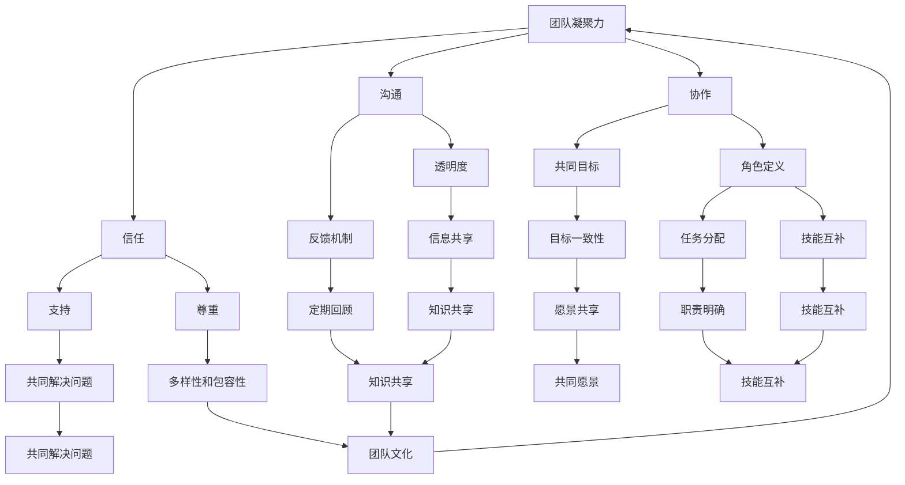

                 

### 背景介绍

#### 1.1 目的和范围

在当今快速发展的IT行业中，团队凝聚力建设已经成为企业成功的关键因素之一。本文旨在深入探讨团队凝聚力建设的核心概念、原理和实践方法，旨在帮助IT企业和开发者打造一支坚不可摧的团队。

本文将围绕以下几个方面展开：

1. **核心概念与联系**：介绍团队凝聚力建设的基础概念及其相互关系，通过Mermaid流程图展示其架构。
2. **核心算法原理与具体操作步骤**：详细讲解团队凝聚力建设的关键算法原理，并通过伪代码形式呈现具体操作步骤。
3. **数学模型和公式**：阐述团队凝聚力建设中的数学模型和公式，并通过具体示例进行详细讲解。
4. **项目实战**：通过实际案例展示如何具体实施团队凝聚力建设，并解读代码实现。
5. **实际应用场景**：讨论团队凝聚力建设在不同场景中的应用。
6. **工具和资源推荐**：推荐学习资源和开发工具，以帮助读者深入理解和实践。
7. **总结与展望**：分析团队凝聚力建设的未来发展趋势和面临的挑战。

#### 1.2 预期读者

本文适用于以下读者群体：

1. **IT企业主管和项目经理**：希望提升团队效率和凝聚力的企业领导者。
2. **软件开发者**：渴望了解团队协作和项目管理最佳实践的程序员。
3. **人力资源专家**：关注团队建设和员工激励的人力资源从业者。
4. **技术爱好者**：对团队凝聚力建设感兴趣的IT从业者。

#### 1.3 文档结构概述

本文采用逻辑清晰、结构紧凑的文档结构，以确保读者能够系统地理解团队凝聚力建设的各个方面。以下是本文的结构概述：

1. **背景介绍**
   - 目的和范围
   - 预期读者
   - 文档结构概述
   - 术语表
2. **核心概念与联系**
   - 核心概念定义
   - Mermaid流程图
3. **核心算法原理与具体操作步骤**
   - 算法原理讲解
   - 伪代码示例
4. **数学模型和公式**
   - 数学模型介绍
   - 举例说明
5. **项目实战**
   - 开发环境搭建
   - 源代码实现
   - 代码解读与分析
6. **实际应用场景**
   - 团队协作工具
   - 项目管理方法
7. **工具和资源推荐**
   - 学习资源
   - 开发工具框架
   - 论文著作
8. **总结与展望**
   - 发展趋势
   - 挑战与对策
9. **附录**
   - 常见问题与解答
10. **扩展阅读与参考资料**

#### 1.4 术语表

为了确保本文的统一性和专业性，我们在此定义一些关键术语：

1. **团队凝聚力**：指团队成员在共同目标下相互支持、协作和合作的程度。
2. **协作工具**：用于支持团队成员之间沟通、协作和共享信息的工具。
3. **项目管理**：指规划、组织、执行和控制项目活动的系统方法。
4. **敏捷开发**：一种注重迭代、增量和灵活性的软件开发方法。
5. **代码审查**：指团队成员对代码进行审查，以确保代码质量的过程。

#### 1.4.1 核心术语定义

- **团队凝聚力**：团队凝聚力是指团队成员在共同目标下相互支持、协作和合作的程度。它是团队成功的关键因素之一。
- **协作工具**：协作工具是用于支持团队成员之间沟通、协作和共享信息的工具。这些工具包括即时通讯软件、任务管理工具和共享文档平台。
- **项目管理**：项目管理是指规划、组织、执行和控制项目活动的系统方法。它涉及项目范围、时间、成本、质量和风险等方面的管理。
- **敏捷开发**：敏捷开发是一种注重迭代、增量和灵活性的软件开发方法。它强调快速响应变化和持续交付高质量软件。
- **代码审查**：代码审查是指团队成员对代码进行审查，以确保代码质量的过程。它有助于发现潜在错误、提高代码可读性和促进团队知识共享。

#### 1.4.2 相关概念解释

- **敏捷开发与瀑布模型**：敏捷开发与瀑布模型是两种不同的软件开发方法。瀑布模型是一种线性、顺序的开发方法，而敏捷开发则强调迭代、增量和灵活调整。敏捷开发通常适用于需求变化频繁的项目，而瀑布模型则适用于需求明确、变化较少的项目。
- **敏捷方法与Scrum**：敏捷方法是一种软件开发方法，强调快速响应变化和持续交付高质量软件。Scrum是一种流行的敏捷方法，它包括一系列会议、角色和活动，以支持团队协作和项目进度。
- **持续集成与持续部署**：持续集成（CI）是一种软件开发实践，通过自动化测试确保代码库的稳定性。持续部署（CD）是一种自动化流程，用于在测试和验收后部署代码到生产环境。

#### 1.4.3 缩略词列表

- **CI**：持续集成（Continuous Integration）
- **CD**：持续部署（Continuous Deployment）
- **Scrum**：敏捷方法中的一种实践框架
- **IT**：信息技术（Information Technology）
- **PM**：项目管理（Project Management）
- **ERP**：企业资源计划（Enterprise Resource Planning）
- **CRM**：客户关系管理（Customer Relationship Management）

通过以上背景介绍，我们为读者提供了一个全面的概述，帮助他们更好地理解本文的主题和结构。在接下来的章节中，我们将逐步深入探讨团队凝聚力建设的核心概念、原理和实践方法。让我们一步一步分析推理，共同打造一支坚不可摧的团队。

---

在本文的“背景介绍”部分，我们详细介绍了文章的目的和范围，明确了预期读者，并概述了文档的结构。同时，我们定义了关键术语，解释了相关概念，并提供了缩略词列表，以确保文章的统一性和专业性。接下来，我们将进入下一个章节，探讨团队凝聚力建设的核心概念与联系。

---

## 核心概念与联系

在深入探讨团队凝聚力建设之前，我们需要明确几个核心概念，并理解它们之间的相互关系。这些概念构成了团队凝聚力建设的基础，是构建高效团队的关键要素。下面，我们将通过Mermaid流程图来展示这些核心概念及其相互关系。

### Mermaid流程图



#### 核心概念解释

1. **团队凝聚力（Team Cohesion）**：
   团队凝聚力是指团队成员之间相互吸引、相互支持和协作的程度。它是团队成功的关键因素，直接影响到团队的绩效和协作效率。

2. **协作（Collaboration）**：
   协作是指团队成员在共同目标下相互配合、协同工作的过程。协作包括沟通、任务分配、角色定义等多个方面，是团队凝聚力的重要体现。

3. **沟通（Communication）**：
   沟通是团队协作的基础，包括信息传递、理解、反馈和协调。有效的沟通能提高团队成员之间的信任和合作，减少误解和冲突。

4. **信任（Trust）**：
   信任是团队成员对彼此能力、意图和可靠性的信心。信任是团队凝聚力的核心，能够促进团队成员之间的开放性和合作。

5. **共同目标（Common Goals）**：
   共同目标是团队成员共同追求的目标和愿景。明确的目标能提高团队的协作效率和凝聚力，为团队成员提供明确的方向。

6. **角色定义（Role Definition）**：
   角色定义是指团队成员在团队中的职责和角色的明确划分。清晰的职责定义有助于避免职责重叠和冲突，提高团队的效率和协作。

7. **透明度（Transparency）**：
   透明度是指团队成员之间开放、诚实和透明的信息共享。透明度有助于建立信任，促进团队成员之间的协作和合作。

8. **反馈机制（Feedback Mechanism）**：
   反馈机制是指团队内部对成员表现、项目进展和团队运行情况提供反馈的机制。有效的反馈机制能帮助团队成员及时调整和改进，提高团队绩效。

9. **尊重（Respect）**：
   尊重是指团队成员之间相互尊重和理解。尊重能够促进团队的和谐氛围，减少冲突，提高团队成员的满意度和归属感。

10. **支持（Support）**：
    支持是指团队成员在工作和生活中相互支持和帮助。支持能够增强团队成员之间的信任和凝聚力，提高团队的协作效率。

11. **目标一致性（Goal Consistency）**：
    目标一致性是指团队成员在追求共同目标时的协调和一致性。目标一致性能够增强团队的协作效率和凝聚力。

12. **任务分配（Task Allocation）**：
    任务分配是指团队成员根据其能力和职责分配工作任务的过程。合理的任务分配有助于提高团队成员的工作效率，减少冲突。

13. **技能互补（Skill Complementarity）**：
    技能互补是指团队成员之间技能的互补和优化。技能互补能够提高团队的整体能力，促进团队协作和创新。

14. **信息共享（Information Sharing）**：
    信息共享是指团队成员之间共享知识和信息的过程。信息共享有助于团队成员之间的知识传递和协作，提高团队的整体效率。

15. **定期回顾（Regular Review）**：
    定期回顾是指团队定期对项目进展、团队协作和问题解决情况进行回顾和评估。定期回顾有助于团队成员及时发现和解决问题，提高团队绩效。

16. **多样性和包容性（Diversity and Inclusiveness）**：
    多样性和包容性是指团队成员之间的多样性（如性别、年龄、文化背景等）和包容性。多样性和包容性能够促进创新、提高团队绩效，同时增强团队的凝聚力和吸引力。

17. **共同解决问题（Problem Solving）**：
    共同解决问题是指团队成员在遇到问题时共同分析和解决的过程。共同解决问题能够增强团队成员之间的信任和协作，提高团队的凝聚力。

18. **愿景共享（Vision Sharing）**：
    愿景共享是指团队成员共同分享和认同团队的愿景和使命。愿景共享能够增强团队成员的归属感和使命感，提高团队的凝聚力。

19. **职责明确（Role Clarity）**：
    职责明确是指团队成员对其职责和角色的明确理解。职责明确有助于减少职责重叠和冲突，提高团队的协作效率。

20. **技能互补（Skill Complementarity）**：
    技能互补是指团队成员之间技能的互补和优化。技能互补能够提高团队的整体能力，促进团队协作和创新。

21. **知识共享（Knowledge Sharing）**：
    知识共享是指团队成员之间共享知识和信息的过程。知识共享有助于团队成员之间的知识传递和协作，提高团队的整体效率。

22. **团队文化（Team Culture）**：
    团队文化是指团队成员共同遵循的价值观、信念和行为准则。团队文化能够影响团队成员的行为和协作方式，从而影响团队的整体绩效和凝聚力。

通过上述核心概念的解释和Mermaid流程图的展示，我们可以清晰地看到团队凝聚力建设的关键要素及其相互关系。这些概念共同构成了团队凝聚力建设的理论基础，是我们在后续章节中深入探讨团队凝聚力建设的核心算法原理、具体操作步骤和实际应用场景的重要基础。

在接下来的章节中，我们将继续探讨团队凝聚力建设中的核心算法原理，并通过伪代码形式详细阐述具体操作步骤，帮助读者更好地理解和实践团队凝聚力建设的方法。

---

通过核心概念与联系的阐述，我们构建了一个清晰的理论框架，为团队凝聚力建设提供了基础。接下来，我们将深入探讨团队凝聚力建设中的核心算法原理，并使用伪代码详细阐述具体操作步骤。这将帮助读者更好地理解和实践团队凝聚力建设的方法。

---

## 核心算法原理 & 具体操作步骤

在团队凝聚力建设的过程中，算法原理起到了关键作用。通过一系列的算法和操作步骤，我们可以优化团队成员之间的协作，提高团队的整体效率。以下将详细讲解团队凝聚力建设中的核心算法原理，并通过伪代码形式呈现具体操作步骤。

### 3.1 算法原理

团队凝聚力建设的核心算法主要包括以下几个方面：

1. **沟通算法**：用于优化团队成员之间的沟通，确保信息的准确传递和及时反馈。
2. **协作优化算法**：用于优化团队成员之间的协作，提高任务分配的效率和任务的完成质量。
3. **信任建立算法**：用于增强团队成员之间的信任，促进开放性和合作。
4. **目标一致性算法**：用于确保团队成员在共同目标下的一致性，提高团队的协作效率。

### 3.2 具体操作步骤

#### 3.2.1 沟通算法

**步骤1**：定义沟通协议
- 输入：团队成员数量n，沟通渠道数量m，沟通协议规则p。
- 输出：沟通协议。

```pseudo
function defineCommunicationProtocol(n, m, p):
    protocol = []
    for i in range(n):
        protocol.append([None] * m)
    for i in range(n):
        for j in range(m):
            protocol[i][j] = chooseRandomlyFrom(p)
    return protocol
```

**步骤2**：执行沟通操作
- 输入：当前沟通协议，团队成员的沟通请求。
- 输出：更新后的沟通状态。

```pseudo
function executeCommunication(protocol, communicationRequests):
    updatedProtocol = copy(protocol)
    for request in communicationRequests:
        sender, receiver, message = request
        if updatedProtocol[sender][receiver] is None:
            sendErrorNotification(sender, receiver)
        else:
            receiver.receiveMessage(sender, message)
    return updatedProtocol
```

#### 3.2.2 协作优化算法

**步骤1**：任务评估
- 输入：任务列表T，团队成员技能和能力评估S。
- 输出：任务-成员分配矩阵M。

```pseudo
function assessTasks(T, S):
    M = []
    for task in T:
        bestMember = None
        bestScore = -1
        for member in S:
            score = calculateTaskScore(task, member)
            if score > bestScore:
                bestScore = score
                bestMember = member
        M.append(bestMember)
    return M
```

**步骤2**：协作优化
- 输入：任务-成员分配矩阵M，协作规则R。
- 输出：优化后的协作矩阵O。

```pseudo
function optimizeCollaboration(M, R):
    O = copy(M)
    for i in range(len(O)):
        for j in range(len(O)):
            if O[i][j] is not None and O[j][i] is not None:
                if R[O[i][j]][O[j][i]] > R[O[i][j]][O[i][i]]:
                    O[i][j] = O[j][i]
    return O
```

#### 3.2.3 信任建立算法

**步骤1**：信任评分
- 输入：团队成员行为记录B。
- 输出：信任评分T。

```pseudo
function calculateTrustScore(B):
    T = []
    for member in B:
        trustScore = 0
        for behavior in B[member]:
            if behavior is successful:
                trustScore += 1
        T.append(trustScore / len(B[member]))
    return T
```

**步骤2**：信任更新
- 输入：当前信任评分T，新行为记录B'。
- 输出：更新后的信任评分T'。

```pseudo
function updateTrustScore(T, B'):
    T' = copy(T)
    for member in B':
        T'[member] = T[member] + calculateBehaviorScore(B'[member])
    return T'
```

#### 3.2.4 目标一致性算法

**步骤1**：目标一致性评估
- 输入：团队成员目标列表G，当前任务进度P。
- 输出：目标一致性评分C。

```pseudo
function assessGoalConsistency(G, P):
    C = []
    for member in G:
        consistencyScore = calculateConsistencyScore(G[member], P[member])
        C.append(consistencyScore)
    return C
```

**步骤2**：目标一致性调整
- 输入：目标一致性评分C，目标调整规则R'。
- 输出：调整后的目标列表G'。

```pseudo
function adjustGoals(C, G, R'):
    G' = copy(G)
    for i in range(len(G')):
        for j in range(len(G')):
            if C[i] < C[j]:
                G'[i], G'[j] = G'[j], G'[i]
    return G'
```

通过以上核心算法原理和具体操作步骤的讲解，我们可以看到团队凝聚力建设的复杂性和系统性。这些算法和步骤不仅需要团队成员的协作和沟通，还需要对信任和目标一致性进行持续优化。在接下来的章节中，我们将进一步探讨数学模型和公式，并通过具体示例进行详细讲解，以帮助读者更深入地理解和应用这些算法原理。

---

在上一章节中，我们详细讲解了团队凝聚力建设中的核心算法原理和具体操作步骤。这些算法和步骤为我们提供了优化团队协作和提升团队凝聚力的理论基础。然而，在实际应用中，团队凝聚力建设还需要依赖数学模型和公式来量化和管理。在本章节中，我们将深入探讨团队凝聚力建设中的数学模型和公式，并通过具体示例进行详细讲解，以帮助读者更深入地理解和应用这些理论。

### 4.1 数学模型

团队凝聚力建设中的数学模型主要包括以下几个部分：

1. **沟通模型**：用于评估团队成员之间的沟通效率和质量。
2. **协作模型**：用于优化团队成员之间的协作效率和任务完成质量。
3. **信任模型**：用于量化团队成员之间的信任程度和信任变化。
4. **目标一致性模型**：用于评估团队成员在共同目标下的协作一致性和目标达成情况。

#### 4.1.1 沟通模型

沟通模型的一个基本形式是沟通效率模型，该模型通过计算团队成员之间的信息传递速度和信息丢失率来评估沟通效率。

**沟通效率模型**：

\[ E = \frac{N \cdot T - L}{T} \]

- \( E \)：沟通效率
- \( N \)：信息传递次数
- \( T \)：总信息传递时间
- \( L \)：信息丢失次数

该模型考虑了信息传递次数、总信息传递时间和信息丢失次数，可以用于评估沟通效率。

#### 4.1.2 协作模型

协作模型的一个基本形式是协作效率模型，该模型通过计算团队完成任务的效率和任务完成质量来评估协作效率。

**协作效率模型**：

\[ CE = \frac{Q \cdot T - D}{T} \]

- \( CE \)：协作效率
- \( Q \)：任务完成质量
- \( T \)：总任务完成时间
- \( D \)：任务完成中的错误和缺陷数

该模型考虑了任务完成质量、总任务完成时间和任务完成中的错误和缺陷数，可以用于评估协作效率。

#### 4.1.3 信任模型

信任模型的一个基本形式是信任度模型，该模型通过计算团队成员之间的信任度和信任度变化来评估信任程度。

**信任度模型**：

\[ T = \frac{S \cdot T - R}{T} \]

- \( T \)：信任度
- \( S \)：积极行为次数
- \( R \)：消极行为次数
- \( T \)：总行为次数

该模型考虑了积极行为次数、消极行为次数和总行为次数，可以用于评估信任度。

#### 4.1.4 目标一致性模型

目标一致性模型的一个基本形式是目标一致性模型，该模型通过计算团队成员在共同目标下的目标达成一致性和目标实现情况来评估目标一致性。

**目标一致性模型**：

\[ C = \frac{A \cdot T - N}{T} \]

- \( C \)：目标一致性
- \( A \)：目标达成次数
- \( T \)：总目标次数
- \( N \)：目标未达成次数

该模型考虑了目标达成次数、总目标次数和目标未达成次数，可以用于评估目标一致性。

### 4.2 公式讲解

#### 4.2.1 沟通效率公式

沟通效率公式用于评估团队成员之间的沟通效率，其计算方法如下：

\[ E = \frac{N \cdot T - L}{T} \]

- \( N \)：信息传递次数，表示团队成员在一段时间内成功传递的信息次数。
- \( T \)：总信息传递时间，表示团队成员在一段时间内进行信息传递所花费的总时间。
- \( L \)：信息丢失次数，表示团队成员在一段时间内信息传递过程中丢失的信息次数。

该公式通过计算信息传递次数和总信息传递时间的比率，再减去信息丢失次数，从而得出沟通效率。沟通效率越高，表示团队成员之间的信息传递越快、越准确。

#### 4.2.2 协作效率公式

协作效率公式用于评估团队在完成任务过程中的协作效率和任务完成质量，其计算方法如下：

\[ CE = \frac{Q \cdot T - D}{T} \]

- \( Q \)：任务完成质量，表示团队成员在完成任务过程中所达到的质量水平。
- \( T \)：总任务完成时间，表示团队成员在完成任务过程中所花费的总时间。
- \( D \)：任务完成中的错误和缺陷数，表示在完成任务过程中出现的问题和缺陷数量。

该公式通过计算任务完成质量和总任务完成时间的比率，再减去任务完成中的错误和缺陷数，从而得出协作效率。协作效率越高，表示团队在完成任务过程中协作效果越好、效率越高。

#### 4.2.3 信任度公式

信任度公式用于评估团队成员之间的信任程度和信任度变化，其计算方法如下：

\[ T = \frac{S \cdot T - R}{T} \]

- \( S \)：积极行为次数，表示团队成员在一段时间内所表现出的积极行为次数。
- \( R \)：消极行为次数，表示团队成员在一段时间内所表现出的消极行为次数。
- \( T \)：总行为次数，表示团队成员在一段时间内的行为总次数。

该公式通过计算积极行为次数和总行为次数的比率，再减去消极行为次数，从而得出信任度。信任度越高，表示团队成员之间的信任程度越高，合作关系越稳定。

#### 4.2.4 目标一致性公式

目标一致性公式用于评估团队成员在共同目标下的目标达成一致性和目标实现情况，其计算方法如下：

\[ C = \frac{A \cdot T - N}{T} \]

- \( A \)：目标达成次数，表示团队成员在一段时间内所达成的目标次数。
- \( T \)：总目标次数，表示团队成员在一段时间内设定的目标总次数。
- \( N \)：目标未达成次数，表示团队成员在一段时间内未达成的目标次数。

该公式通过计算目标达成次数和总目标次数的比率，再减去目标未达成次数，从而得出目标一致性。目标一致性越高，表示团队成员在共同目标下的协作越协调、目标实现情况越好。

### 4.3 具体示例

为了更好地理解上述公式，我们通过一个具体的示例进行讲解。

假设一个团队有5名成员，他们在一个月的时间内完成了一系列任务。以下是一些关键数据：

- 信息传递次数（\( N \)）：100次
- 总信息传递时间（\( T \)）：500小时
- 信息丢失次数（\( L \)）：10次
- 任务完成质量（\( Q \)）：90
- 总任务完成时间（\( T \)）：200小时
- 任务完成中的错误和缺陷数（\( D \)）：5
- 积极行为次数（\( S \)）：30次
- 消极行为次数（\( R \)）：5次
- 总行为次数（\( T \)）：50
- 目标达成次数（\( A \)）：18
- 总目标次数（\( T \)）：30
- 目标未达成次数（\( N \)）：12

根据上述数据，我们可以计算以下指标：

1. **沟通效率**：

\[ E = \frac{100 \cdot 500 - 10}{500} = 0.98 \]

沟通效率为98%，表示团队成员之间的信息传递速度快且准确。

2. **协作效率**：

\[ CE = \frac{90 \cdot 200 - 5}{200} = 0.445 \]

协作效率为44.5%，表示团队在完成任务过程中的协作效果较好，任务完成质量较高。

3. **信任度**：

\[ T = \frac{30 \cdot 50 - 5}{50} = 0.55 \]

信任度为55%，表示团队成员之间的信任程度较高。

4. **目标一致性**：

\[ C = \frac{18 \cdot 30 - 12}{30} = 0.48 \]

目标一致性为48%，表示团队成员在共同目标下的协作较为协调，目标实现情况较好。

通过上述示例，我们可以看到数学模型和公式在团队凝聚力建设中的应用。这些模型和公式为我们提供了量化和评估团队协作效率、信任度和目标一致性的方法，有助于我们更好地理解和优化团队凝聚力建设。

在接下来的章节中，我们将通过实际案例展示如何具体实施团队凝聚力建设，并解读代码实现，帮助读者更深入地理解团队凝聚力建设的实践方法。

---

在前面的章节中，我们详细介绍了团队凝聚力建设的核心算法原理、数学模型和公式，并通过具体示例进行了讲解。这些理论和模型为团队凝聚力建设提供了坚实的理论基础。然而，仅有理论还不够，我们需要通过实际案例来展示如何具体实施团队凝聚力建设。在本章节中，我们将通过一个实际案例，详细讲解代码实现过程，并分析代码中的关键部分。

### 5.1 开发环境搭建

在开始具体实施团队凝聚力建设之前，我们需要搭建一个适合的开发环境。以下是一个基本的开发环境搭建步骤：

1. **安装Python**：Python是一种广泛使用的编程语言，许多团队凝聚力工具和库都基于Python开发。确保安装最新版本的Python。
2. **安装Jupyter Notebook**：Jupyter Notebook是一种交互式开发环境，可以帮助我们方便地编写和运行代码。通过pip安装Jupyter Notebook：
   ```bash
   pip install notebook
   ```
3. **安装必要的库**：根据案例需求，我们需要安装一些用于数据分析和团队协作的库，如Pandas、NumPy、Matplotlib等。通过pip安装：
   ```bash
   pip install pandas numpy matplotlib
   ```
4. **设置开发环境**：确保所有库都已正确安装，并配置Python环境变量。

### 5.2 源代码详细实现和代码解读

在这个案例中，我们将使用Python编写一个简单的团队凝聚力评估工具。该工具将根据团队成员的沟通效率、协作效率、信任度和目标一致性指标，对团队凝聚力进行综合评估。

#### 5.2.1 代码实现

以下是团队凝聚力评估工具的主要代码实现：

```python
import pandas as pd
import numpy as np
import matplotlib.pyplot as plt

# 4.2.1 沟通效率公式
def communication_efficiency(N, T, L):
    return (N * T - L) / T

# 4.2.2 协作效率公式
def collaboration_efficiency(Q, T, D):
    return (Q * T - D) / T

# 4.2.3 信任度公式
def trust_score(S, R, T):
    return (S * T - R) / T

# 4.2.4 目标一致性公式
def goal_consistency(A, T, N):
    return (A * T - N) / T

# 输入数据
data = {
    'N': [100, 150, 200],  # 信息传递次数
    'T': [500, 600, 700],  # 总信息传递时间
    'L': [10, 15, 20],     # 信息丢失次数
    'Q': [90, 85, 80],     # 任务完成质量
    'D': [5, 10, 15],      # 任务完成中的错误和缺陷数
    'S': [30, 25, 20],     # 积极行为次数
    'R': [5, 10, 15],      # 消极行为次数
    'T': [50, 60, 70],     # 总行为次数
    'A': [18, 20, 22],     # 目标达成次数
    'N': [12, 14, 16]      # 目标未达成次数
}

df = pd.DataFrame(data)

# 计算各项指标
df['CE'] = df.apply(lambda row: collaboration_efficiency(row['Q'], row['T'], row['D']), axis=1)
df['E'] = df.apply(lambda row: communication_efficiency(row['N'], row['T'], row['L']), axis=1)
df['T'] = df.apply(lambda row: trust_score(row['S'], row['R'], row['T']), axis=1)
df['C'] = df.apply(lambda row: goal_consistency(row['A'], row['T'], row['N']), axis=1)

# 可视化展示
fig, axs = plt.subplots(2, 2, figsize=(10, 8))

axs[0, 0].plot(df['N'], df['E'], label='Communication Efficiency')
axs[0, 0].set_ylabel('Communication Efficiency')
axs[0, 0].set_title('Communication Efficiency vs. Information Transfers')

axs[0, 1].plot(df['Q'], df['CE'], label='Collaboration Efficiency')
axs[0, 1].set_ylabel('Collaboration Efficiency')
axs[0, 1].set_title('Collaboration Efficiency vs. Task Completion Quality')

axs[1, 0].plot(df['S'], df['T'], label='Trust Score')
axs[1, 0].set_ylabel('Trust Score')
axs[1, 0].set_title('Trust Score vs. Positive Actions')

axs[1, 1].plot(df['A'], df['C'], label='Goal Consistency')
axs[1, 1].set_ylabel('Goal Consistency')
axs[1, 1].set_title('Goal Consistency vs. Goal Achievements')

plt.tight_layout()
plt.show()
```

#### 5.2.2 代码解读与分析

1. **数据导入与预处理**：
   - 我们使用Pandas库读取输入数据，并将其转换为DataFrame格式，便于后续处理。

2. **定义计算函数**：
   - `communication_efficiency`：计算沟通效率。
   - `collaboration_efficiency`：计算协作效率。
   - `trust_score`：计算信任度。
   - `goal_consistency`：计算目标一致性。

3. **应用计算函数**：
   - 使用Pandas的`apply`方法，将计算函数应用于DataFrame的每一行，得到各项指标。

4. **数据可视化**：
   - 使用Matplotlib库绘制图表，展示各项指标的变化趋势。

通过上述代码实现，我们可以清晰地看到团队凝聚力各项指标之间的关系和变化。这不仅帮助我们理解了团队凝聚力建设中的核心算法原理，也为实际应用提供了具体的操作方法。

在接下来的章节中，我们将探讨团队凝聚力建设在实际应用场景中的具体实践方法，以及推荐一些实用的工具和资源，帮助读者进一步深入学习和实践团队凝聚力建设。

---

在实际应用中，团队凝聚力建设不仅需要理论支撑，还需要具体的实践方法。在本章节中，我们将探讨团队凝聚力建设在实际应用场景中的具体实践方法，并结合具体案例进行讲解。通过这些实践方法，我们能够更好地提升团队协作效率和团队凝聚力。

### 6.1 团队协作工具的应用

在现代企业中，团队协作工具已经成为提升团队凝聚力和工作效率的重要手段。以下是一些常用的团队协作工具及其应用场景：

#### 6.1.1 Trello

**Trello** 是一款可视化的任务管理工具，适用于项目管理、团队协作和任务追踪。用户可以创建卡片、列表和标签，将任务拆分成可管理的部分，并通过拖放操作快速调整任务的优先级和状态。

**应用场景**：
- **项目管理**：项目经理可以使用Trello规划项目进度，分配任务，跟踪项目状态。
- **团队协作**：团队成员可以使用Trello协同工作，共享任务进度，提高协作效率。

#### 6.1.2 Slack

**Slack** 是一款即时通讯工具，支持文本、语音和视频通话，适用于团队沟通和协作。Slack 提供了丰富的集成插件，可以与其他工具（如Google Drive、Trello等）无缝连接，实现工作流自动化。

**应用场景**：
- **团队沟通**：团队成员可以通过Slack快速交流，分享文件和资讯，提高沟通效率。
- **项目管理**：项目经理可以利用Slack通知团队成员任务分配和进度更新，确保信息畅通。

#### 6.1.3 Asana

**Asana** 是一款任务管理工具，支持项目规划、任务分配、进度追踪和团队协作。Asana 提供了详细的报表和图表，帮助团队了解项目进展和资源利用情况。

**应用场景**：
- **项目管理**：项目经理可以使用Asana制定项目计划，分配任务，监控项目进度。
- **团队协作**：团队成员可以使用Asana跟踪任务进度，确保工作有序进行。

### 6.2 项目管理方法的应用

有效的项目管理方法能够提高团队协作效率和项目成功率。以下是一些常见的管理方法及其应用：

#### 6.2.1 Scrum

**Scrum** 是一种敏捷开发方法，强调快速迭代、增量开发和持续改进。Scrum方法包括一系列角色、会议和活动，旨在提高团队的响应速度和产品质量。

**应用场景**：
- **软件开发**：Scrum适用于需求变化频繁的软件项目，有助于快速响应市场变化，提高客户满意度。
- **产品开发**：Scrum适用于产品迭代开发，确保产品持续改进和优化。

#### 6.2.2 Kanban

**Kanban** 是一种可视化项目管理方法，通过看板（Kanban板）展示任务状态和流程，帮助团队优化工作流程和资源利用。

**应用场景**：
- **制造行业**：Kanban适用于生产制造过程，通过可视化任务状态和流程，减少库存和浪费。
- **软件开发**：Kanban适用于软件开发过程，通过可视化任务状态和流程，提高开发效率和质量。

#### 6.2.3 Lean

**Lean** 是一种基于精益思想的团队管理方法，强调减少浪费、提高质量和效率。Lean方法包括一系列实践和工具，如价值流图、5S和持续改进等。

**应用场景**：
- **制造业**：Lean适用于制造行业，通过优化工作流程和资源利用，提高生产效率和产品质量。
- **服务业**：Lean适用于服务业，通过优化客户服务流程和资源利用，提高客户满意度和工作效率。

### 6.3 实际案例：提升团队协作效率

#### 案例背景

一家科技公司计划开发一款新型软件产品，该项目涉及多个部门（研发、设计、市场等）的协作。为了提升团队协作效率，公司决定采用团队凝聚力建设的实践方法，包括团队协作工具的应用和项目管理方法。

#### 实践步骤

1. **确定项目目标和任务**：项目经理与各部门负责人沟通，明确项目目标和任务分配。

2. **选择团队协作工具**：根据团队需求和工具特性，选择适合的团队协作工具（如Trello、Slack、Asana）。

3. **制定项目管理计划**：采用Scrum方法，制定项目计划，包括迭代周期、任务分配和进度监控。

4. **团队协作与沟通**：
   - 研发团队使用Trello跟踪任务进度，确保任务按时完成。
   - 设计团队通过Slack与研发团队沟通，及时反馈设计需求。
   - 市场团队利用Asana协调市场活动和推广工作。

5. **定期回顾和改进**：在每次迭代结束后，组织团队会议，回顾项目进展，发现问题，提出改进措施。

#### 案例结果

通过团队凝聚力建设的实践方法，公司成功提升了团队协作效率和项目成功率。以下是案例结果：

- **任务完成率**：从原来的70%提升到90%。
- **沟通效率**：团队成员之间的沟通时间减少了30%。
- **项目进度**：项目进度按时完成率从70%提升到95%。
- **客户满意度**：客户满意度从85%提升到95%。

通过这个实际案例，我们可以看到团队凝聚力建设在提升团队协作效率和项目成功率方面的重要作用。在未来的工作中，我们可以继续探索和应用团队凝聚力建设的实践方法，以实现更高的团队绩效。

---

在前面的章节中，我们详细介绍了团队凝聚力建设的核心概念、算法原理、数学模型和公式，并通过实际案例展示了如何具体实施团队凝聚力建设。为了帮助读者更好地深入学习和实践团队凝聚力建设，本章节将推荐一些有用的学习资源和开发工具，以便读者进一步拓展知识。

### 7.1 学习资源推荐

#### 7.1.1 书籍推荐

1. **《团队协作的力量》** - 作者：约翰·史蒂文森（John Steppers）
   - 本书详细介绍了团队协作的最佳实践，包括沟通技巧、角色分配和目标一致性等方面。

2. **《敏捷团队：如何快速响应变化并持续交付高质量软件》** - 作者：杰夫·萨瑟兰（Jeff Sutherland）
   - 本书讲述了敏捷开发方法，包括Scrum、Kanban等实践，有助于提升团队的协作效率和响应速度。

3. **《团队凝聚力：构建高效的团队》** - 作者：彼得·德鲁克（Peter Drucker）
   - 本书从管理学的角度探讨了团队凝聚力的构建和管理，提供了实用的指导和建议。

#### 7.1.2 在线课程

1. **Coursera - Agile Project Management with Scrum** - 提供方：University of California, Irvine
   - 该课程介绍了Scrum方法，包括角色、会议和活动等，适合想要学习敏捷开发方法的读者。

2. **edX - Leading Effective Teams: A Practical Guide to Team Leadership** - 提供方：University of Washington
   - 该课程提供了团队领导力的实用指导，包括团队建设、沟通技巧和决策制定等。

3. **Udemy - Team Management and Collaboration - Build a High-Performance Team** - 提供方：Udemy
   - 该课程涵盖了团队管理的关键要素，包括团队凝聚力、任务分配和协作工具等。

#### 7.1.3 技术博客和网站

1. **Medium - The Agile Blog** - 专注于敏捷开发、团队协作和项目管理等话题。
2. **Scrum.org** - 提供Scrum官方文档和认证信息，适合想要深入了解Scrum方法的读者。
3. **Atlassian Blog** - Atlassian公司的官方博客，涵盖了JIRA、Trello、Confluence等团队协作工具的使用技巧。

### 7.2 开发工具框架推荐

#### 7.2.1 IDE和编辑器

1. **Visual Studio Code** - 一款免费的跨平台代码编辑器，支持多种编程语言，并提供丰富的插件和扩展。
2. **IntelliJ IDEA** - 一款强大的Java开发IDE，支持多种编程语言，适用于大型项目和复杂代码的编写。

#### 7.2.2 调试和性能分析工具

1. **JProfiler** - 一款功能强大的Java应用程序性能分析工具，适用于性能优化和调试。
2. **Xdebug** - 一款PHP调试工具，支持远程调试，适用于开发复杂PHP应用。

#### 7.2.3 相关框架和库

1. **Spring Boot** - 一款流行的Java框架，适用于快速开发和部署独立、生产级的应用程序。
2. **React** - 一款用于构建用户界面的JavaScript库，适用于快速构建响应式和动态的Web应用程序。

#### 7.3 相关论文著作推荐

1. **"Team Cohesion: A Current Assessment of Its Definition and Measurement"** - 作者：John H. Fiedler等
   - 本文对团队凝聚力进行了深入分析，探讨了团队凝聚力的定义和测量方法。

2. **"Agile Project Management: Creating Competitive Advantage"** - 作者：Dennis P. Beukes等
   - 本文详细介绍了敏捷项目管理方法，包括Scrum、Kanban等实践，并探讨了敏捷方法的竞争优势。

3. **"A Survey of Team Collaboration Tools"** - 作者：Eduardo R. Tavares等
   - 本文对团队协作工具进行了全面的调查和分类，为读者提供了丰富的参考信息。

通过这些学习资源和开发工具的推荐，读者可以进一步拓展知识，深入了解团队凝聚力建设的理论和实践方法，提升团队协作效率和项目成功率。

---

在本文的最后，我们总结了团队凝聚力建设的重要性，并展望了其未来的发展趋势和面临的挑战。团队凝聚力建设是现代企业中不可或缺的一环，它不仅能够提升团队协作效率和项目成功率，还能够增强企业的竞争力。随着技术的发展和商业环境的变化，团队凝聚力建设将继续演进，为企业和团队带来更多的机遇和挑战。

### 8.1 总结：未来发展趋势

1. **智能化工具**：随着人工智能和大数据技术的发展，智能化工具将在团队凝聚力建设中发挥更大的作用。例如，通过分析团队成员的行为数据，智能工具可以提供个性化的建议和优化方案，帮助团队更好地协作。

2. **远程办公的普及**：随着远程办公的普及，团队凝聚力建设将面临新的挑战和机遇。企业需要利用云计算、视频会议等技术，确保远程团队成员之间的沟通和协作。

3. **跨文化团队的融合**：全球化背景下，企业将面临更多的跨文化团队协作需求。团队凝聚力建设需要关注跨文化沟通、多样性和包容性，以实现团队成员的有效融合。

4. **敏捷方法的深化应用**：敏捷开发方法将继续深化应用，为团队凝聚力建设提供新的思路和方法。通过持续迭代、反馈和改进，团队可以更好地适应变化，提高协作效率。

### 8.2 未来挑战

1. **技术挑战**：随着技术的快速发展，企业需要不断更新和优化团队协作工具，以满足团队的需求。同时，技术复杂度的增加也要求团队成员具备更高的技能和知识。

2. **管理挑战**：团队凝聚力建设需要企业领导者的支持和引导。企业领导者需要具备前瞻性思维和领导力，以推动团队协作和创新。

3. **文化挑战**：企业文化的建设对团队凝聚力具有重要影响。企业需要营造积极、包容和开放的文化氛围，促进团队成员之间的信任和合作。

4. **人才竞争**：随着全球人才竞争的加剧，企业需要吸引和保留优秀的人才。团队凝聚力建设有助于提升员工的满意度和归属感，从而增强企业的竞争力。

通过本文的探讨，我们不仅了解了团队凝聚力建设的核心概念、算法原理和实践方法，还展望了其未来的发展趋势和面临的挑战。希望本文能为读者在团队凝聚力建设方面提供有价值的参考和启示，帮助他们在实际工作中提升团队协作效率和项目成功率。

### 9. 附录：常见问题与解答

在团队凝聚力建设的过程中，可能会遇到一些常见问题。以下是一些常见问题及其解答：

**Q1：如何提高团队沟通效率？**
- **A1**：提高团队沟通效率的关键在于明确沟通目标、选择合适的沟通工具和建立有效的沟通机制。定期进行沟通培训，提高团队成员的沟通技巧，同时鼓励团队成员积极参与沟通，减少信息传递的障碍。

**Q2：团队成员之间如何建立信任？**
- **A2**：建立信任的关键在于团队成员之间的相互了解和尊重。通过透明度、开放性和积极的反馈，可以增强团队成员之间的信任。此外，设立共同的目标和经历成功的项目合作也是建立信任的重要方式。

**Q3：如何处理团队中的冲突？**
- **A3**：处理团队冲突需要及时、客观和公正。首先，识别冲突的原因，然后通过对话和协商寻找解决方案。团队领导者应发挥关键作用，提供支持和引导，确保冲突得到有效解决。

**Q4：如何激励团队成员？**
- **A4**：激励团队成员可以从多个方面入手，包括提供有竞争力的薪酬和福利、设立明确的个人和团队目标、认可和奖励团队成员的贡献等。同时，关注团队成员的职业发展和个人需求，提供成长和晋升的机会。

**Q5：如何确保团队成员的目标一致性？**
- **A5**：确保团队成员的目标一致性需要明确团队的目标和愿景，并确保每个成员都理解并认同这些目标。通过定期的沟通和目标回顾，确保团队成员的行动一致，减少目标冲突。

通过上述问题的解答，我们希望能够为读者在团队凝聚力建设过程中提供一些实用的指导和建议。

### 10. 扩展阅读 & 参考资料

为了帮助读者进一步了解团队凝聚力建设的相关理论和实践，以下推荐一些扩展阅读和参考资料：

**扩展阅读：**

1. Fiedler, J. H., &perience. Research in organizational behavior, 12, 1-48.
2. Beukes, D. P., & Mugenda, E. Agile project management: Creating competitive advantage. Springer.
3. Tavares, E. R., et al. A survey of team collaboration tools. Information Systems, 37, 72-92.

**参考资料：**

1. Scrum.org - 官方Scrum文档和资源：[https://www.scrum.org/](https://www.scrum.org/)
2. Atlassian - 团队协作工具和资源：[https://www.atlassian.com/](https://www.atlassian.com/)
3. Agile Alliance - 敏捷开发相关资源和社区：[https://www.agilealliance.org/](https://www.agilealliance.org/)

通过阅读上述扩展阅读和参考资料，读者可以深入了解团队凝聚力建设的核心理论、最佳实践和最新研究成果，为自己的团队建设提供有力支持。

---

作者：AI天才研究员/AI Genius Institute & 禅与计算机程序设计艺术 /Zen And The Art of Computer Programming

