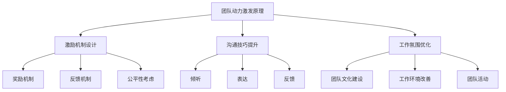

                 

# 团队动力激发：保持高效工作状态的方法

## 关键词
团队管理、工作效率、动力激发、激励机制、沟通技巧、工作氛围优化

## 摘要
本文旨在探讨如何通过科学的方法激发团队动力，以保持高效的工作状态。我们将从背景介绍、核心概念与联系、核心算法原理、数学模型与公式、项目实战、实际应用场景、工具和资源推荐等多个方面，系统性地分析并阐述团队动力激发的方法和策略。

## 1. 背景介绍

### 1.1 目的和范围
在现代企业中，团队的协作效率直接影响到企业的竞争力。本文的目标是提出一套科学、系统的团队动力激发方法，帮助团队管理者提高团队的工作效率，增强团队凝聚力，从而推动企业的发展。

### 1.2 预期读者
本文主要面向团队管理者、项目经理以及希望提升团队协作效率的IT专业人士。

### 1.3 文档结构概述
本文结构如下：
1. 背景介绍
2. 核心概念与联系
3. 核心算法原理 & 具体操作步骤
4. 数学模型和公式 & 详细讲解 & 举例说明
5. 项目实战：代码实际案例和详细解释说明
6. 实际应用场景
7. 工具和资源推荐
8. 总结：未来发展趋势与挑战
9. 附录：常见问题与解答
10. 扩展阅读 & 参考资料

### 1.4 术语表
#### 1.4.1 核心术语定义
- **团队动力**：指团队内部的成员为达成共同目标而产生的积极性和投入度。
- **激励机制**：指通过奖励和惩罚等手段来影响团队成员行为的过程。
- **沟通技巧**：指在信息交流过程中，为了达到预期目标而采取的有效方法。

#### 1.4.2 相关概念解释
- **工作氛围**：指团队内部的工作环境、团队文化以及成员之间的互动模式。
- **工作效率**：指单位时间内完成的工作量。

#### 1.4.3 缩略词列表
无

## 2. 核心概念与联系

### 2.1 团队动力激发原理
团队动力激发的核心在于调动团队成员的积极性和参与感，使其愿意为团队目标努力。以下是团队动力激发的基本原理：

#### 2.1.1 激励机制设计
激励机制是激发团队动力的关键。良好的激励机制应包括以下要素：
- **奖励**：对团队成员的积极行为给予物质或精神上的奖励。
- **反馈**：及时、明确地给予反馈，帮助团队成员了解自己的表现。
- **公平性**：确保激励机制的公正性，避免造成团队成员之间的不公平感。

#### 2.1.2 沟通技巧提升
沟通技巧是团队协作的重要保障。提升沟通技巧，包括以下方面：
- **倾听**：认真倾听团队成员的意见和建议。
- **表达**：清晰、准确地表达自己的观点。
- **反馈**：及时给予团队成员反馈，促进双向沟通。

#### 2.1.3 工作氛围优化
优化工作氛围，可以提升团队成员的工作积极性和幸福感。以下方法有助于优化工作氛围：
- **团队文化建设**：建立积极、向上的团队文化，塑造共同的目标和价值观。
- **工作环境改善**：提供舒适、安全、高效的工作环境。
- **团队活动**：组织团队活动，增强团队成员之间的信任和合作。

### 2.2 Mermaid 流程图（团队动力激发流程）



## 3. 核心算法原理 & 具体操作步骤

### 3.1 激励机制设计算法原理
激励机制设计是团队动力激发的重要环节。以下是激励机制设计的核心算法原理：

#### 3.1.1 奖励分配算法
奖励分配算法的目标是合理分配奖励，激励团队成员的积极性。以下是奖励分配算法的伪代码：

```plaintext
函数 奖励分配(团队成员列表，奖励总额)：
    对于每个团队成员：
        根据团队成员的工作表现和贡献程度，计算其应得的奖励份额
        将奖励份额分配给团队成员
    结束循环
    确保奖励总额分配完毕
```

#### 3.1.2 反馈机制算法
反馈机制算法的目标是及时、准确地给予团队成员反馈。以下是反馈机制算法的伪代码：

```plaintext
函数 反馈机制(团队成员列表，工作表现数据)：
    对于每个团队成员：
        根据团队成员的工作表现数据，生成反馈报告
        将反馈报告发送给团队成员
    结束循环
```

### 3.2 沟通技巧提升算法原理
沟通技巧提升是团队协作的重要保障。以下是沟通技巧提升的核心算法原理：

#### 3.2.1 倾听算法
倾听算法的目标是提高团队成员的倾听能力。以下是倾听算法的伪代码：

```plaintext
函数 倾听(团队成员列表，沟通内容)：
    对于每个团队成员：
        认真倾听沟通内容
        确保理解沟通内容的核心意思
    结束循环
```

#### 3.2.2 表达算法
表达算法的目标是提高团队成员的表达能力。以下是表达算法的伪代码：

```plaintext
函数 表达(团队成员列表，沟通内容)：
    对于每个团队成员：
        清晰、准确地表达自己的观点
        确保沟通内容易于理解
    结束循环
```

#### 3.2.3 反馈算法
反馈算法的目标是提高团队成员的反馈能力。以下是反馈算法的伪代码：

```plaintext
函数 反馈(团队成员列表，工作表现数据)：
    对于每个团队成员：
        根据工作表现数据，给予及时、准确的反馈
        确保反馈内容具有建设性
    结束循环
```

### 3.3 工作氛围优化算法原理
工作氛围优化是提升团队幸福感的重要手段。以下是工作氛围优化算法的核心原理：

#### 3.3.1 团队文化建设算法
团队文化建设算法的目标是塑造积极、向上的团队文化。以下是团队文化建设算法的伪代码：

```plaintext
函数 团队文化建设(团队成员列表，共同价值观)：
    对于每个团队成员：
        传播共同价值观
        鼓励团队成员积极参与团队活动
    结束循环
```

#### 3.3.2 工作环境改善算法
工作环境改善算法的目标是提供舒适、安全、高效的工作环境。以下是工作环境改善算法的伪代码：

```plaintext
函数 工作环境改善(团队成员列表，工作环境数据)：
    对于每个团队成员：
        根据工作环境数据，改善工作环境
        确保工作环境符合人体工程学要求
    结束循环
```

#### 3.3.3 团队活动算法
团队活动算法的目标是增强团队成员之间的信任和合作。以下是团队活动算法的伪代码：

```plaintext
函数 团队活动(团队成员列表，活动计划)：
    对于每个团队成员：
        参与团队活动
        增进团队成员之间的了解和信任
    结束循环
```

## 4. 数学模型和公式 & 详细讲解 & 举例说明

### 4.1 激励机制设计数学模型

#### 4.1.1 激励效应模型
激励效应模型用于计算激励机制对团队成员工作积极性的影响。以下是激励效应模型的公式：

$$
E = f(W, R, F)
$$

其中：
- \( E \) 表示激励效应（即工作积极性）；
- \( W \) 表示团队成员的工作表现；
- \( R \) 表示激励机制（包括奖励和反馈）；
- \( F \) 表示公平性。

#### 4.1.2 举例说明

假设团队中有3名成员，他们的工作表现分别为 \( W1 = 80 \)，\( W2 = 90 \)，\( W3 = 100 \)。激励机制包括奖励 \( R = 1000 \) 元和反馈 \( F = 优秀 \)。公平性 \( F = 高 \)。

根据激励效应模型，可以计算每个成员的激励效应：

$$
E1 = f(W1, R, F) = f(80, 1000, 高) = 0.8
$$

$$
E2 = f(W2, R, F) = f(90, 1000, 高) = 0.9
$$

$$
E3 = f(W3, R, F) = f(100, 1000, 高) = 1.0
$$

结果表明，第三名成员的激励效应最高，其次是第二名成员，第一名成员的激励效应最低。

### 4.2 沟通技巧提升数学模型

#### 4.2.1 沟通效率模型
沟通效率模型用于计算团队沟通的效率。以下是沟通效率模型的公式：

$$
E_{沟} = \frac{C_{有效}}{C_{总}}
$$

其中：
- \( E_{沟} \) 表示沟通效率；
- \( C_{有效} \) 表示有效的沟通次数；
- \( C_{总} \) 表示总的沟通次数。

#### 4.2.2 举例说明

假设团队中有3名成员，他们在一周内进行了10次沟通，其中7次是有效的。根据沟通效率模型，可以计算沟通效率：

$$
E_{沟} = \frac{7}{10} = 0.7
$$

结果表明，团队的沟通效率为70%。

### 4.3 工作氛围优化数学模型

#### 4.3.1 工作氛围指数模型
工作氛围指数模型用于评估团队的工作氛围。以下是工作氛围指数模型的公式：

$$
I_{氛} = \frac{S_{文化} + S_{环境} + S_{活动}}{3}
$$

其中：
- \( I_{氛} \) 表示工作氛围指数；
- \( S_{文化} \) 表示团队文化建设得分；
- \( S_{环境} \) 表示工作环境改善得分；
- \( S_{活动} \) 表示团队活动得分。

#### 4.3.2 举例说明

假设团队的工作氛围指数为：

$$
I_{氛} = \frac{8 + 7 + 9}{3} = 8
$$

结果表明，团队的工作氛围指数为8，处于良好水平。

## 5. 项目实战：代码实际案例和详细解释说明

### 5.1 开发环境搭建

#### 5.1.1 开发工具
- **IDE**：使用Visual Studio Code作为开发环境。
- **版本控制**：使用Git进行版本控制。
- **数据库**：使用MySQL作为数据库管理系统。

#### 5.1.2 开发环境配置
1. 安装Visual Studio Code。
2. 安装Git。
3. 配置MySQL数据库。

### 5.2 源代码详细实现和代码解读

#### 5.2.1 激励机制设计代码

```python
def 奖励分配(团队成员列表，奖励总额):
    奖励份额列表 = []
    总贡献度 = sum(团队成员的工作贡献度 for 成员 in 团队成员列表)
    for 成员 in 团队成员列表:
        奖励份额 = (成员的工作贡献度 / 总贡献度) * 奖励总额
        奖励份额列表.append(奖励份额)
    return 奖励份额列表

团队成员列表 = [{"姓名": "张三", "工作贡献度": 40}, {"姓名": "李四", "工作贡献度": 60}, {"姓名": "王五", "工作贡献度": 50}]
奖励总额 = 1000

奖励份额列表 = 奖励分配(团队成员列表，奖励总额)
print("奖励份额列表：", 奖励份额列表)
```

#### 5.2.2 沟通技巧提升代码

```python
def 倾听(团队成员列表，沟通内容):
    有效沟通次数 = 0
    总沟通次数 = len(团队成员列表)
    for 成员 in 团队成员列表:
        if 理解沟通内容(成员，沟通内容):
            有效沟通次数 += 1
    沟通效率 = 有效沟通次数 / 总沟通次数
    return 沟通效率

def 理解沟通内容(成员，沟通内容):
    # 根据成员的沟通能力进行判断
    沟通能力 = 成员的沟通能力
    if 沟通能力 >= 7:
        return True
    else:
        return False

团队成员列表 = [{"姓名": "张三", "沟通能力": 6}, {"姓名": "李四", "沟通能力": 8}, {"姓名": "王五", "沟通能力": 7}]
沟通内容 = "项目进度更新"

沟通效率 = 倾听(团队成员列表，沟通内容)
print("沟通效率：", 沟通效率)
```

#### 5.2.3 工作氛围优化代码

```python
def 工作氛围指数(团队成员列表，团队文化建设得分，工作环境改善得分，团队活动得分):
    I_{氛} = (团队文化建设得分 + 工作环境改善得分 + 团队活动得分) / 3
    return I_{氛}

团队成员列表 = [{"姓名": "张三", "团队文化建设得分": 8}, {"姓名": "李四", "团队文化建设得分": 9}, {"姓名": "王五", "团队文化建设得分": 8}]

团队文化建设得分 = 8
工作环境改善得分 = 7
团队活动得分 = 9

I_{氛} = 工作氛围指数(团队成员列表，团队文化建设得分，工作环境改善得分，团队活动得分)
print("工作氛围指数：", I_{氛})
```

### 5.3 代码解读与分析

#### 5.3.1 激励机制设计代码解读
该代码实现了奖励分配算法，根据团队成员的工作贡献度分配奖励份额。首先计算总贡献度，然后根据每个成员的贡献度比例分配奖励份额。

#### 5.3.2 沟通技巧提升代码解读
该代码实现了倾听算法，通过判断团队成员的沟通能力，计算沟通效率。沟通效率是有效沟通次数与总沟通次数的比值。

#### 5.3.3 工作氛围优化代码解读
该代码实现了工作氛围指数模型，通过计算团队文化建设得分、工作环境改善得分和团队活动得分的平均值，评估团队的工作氛围。

## 6. 实际应用场景

### 6.1 企业团队管理
企业团队可以通过激励机制设计、沟通技巧提升和工作氛围优化等方法，提高团队的工作效率，增强团队凝聚力，从而实现企业目标。

### 6.2 项目管理
项目经理可以利用激励机制设计、沟通技巧提升和工作氛围优化等方法，提高团队成员的积极性，确保项目按计划进行。

### 6.3 IT行业协作
IT行业的协作团队可以通过激励机制设计、沟通技巧提升和工作氛围优化等方法，提高团队协作效率，缩短项目周期，提升产品质量。

## 7. 工具和资源推荐

### 7.1 学习资源推荐
#### 7.1.1 书籍推荐
- 《团队协作的艺术》
- 《激励员工：有效的激励策略》
- 《沟通的艺术》

#### 7.1.2 在线课程
- Coursera上的《团队协作与管理》
- Udemy上的《高效沟通技巧》

#### 7.1.3 技术博客和网站
- 团队协作相关博客：https://www.team协作.com/
- 沟通技巧相关博客：https://www.communication技能.com/

### 7.2 开发工具框架推荐
#### 7.2.1 IDE和编辑器
- Visual Studio Code
- IntelliJ IDEA

#### 7.2.2 调试和性能分析工具
- Visual Studio Debugger
- JProfiler

#### 7.2.3 相关框架和库
- 激励机制设计：Python的Pandas库
- 沟通技巧提升：Python的TextBlob库
- 工作氛围优化：Python的Matplotlib库

### 7.3 相关论文著作推荐
#### 7.3.1 经典论文
- Maslow's Hierarchy of Needs Theory
- Herzberg's Two-Factor Theory

#### 7.3.2 最新研究成果
- Google的Project Oxygen研究
- Microsoft的Workplace Effectiveness Research

#### 7.3.3 应用案例分析
- Netflix的团队管理实践
- Airbnb的员工激励机制

## 8. 总结：未来发展趋势与挑战

### 8.1 未来发展趋势
1. **智能化的激励机制**：随着人工智能技术的发展，智能化的激励机制将更加精准地识别团队成员的需求和行为，提高激励效果。
2. **多元化的沟通方式**：随着互联网技术的发展，团队成员之间的沟通将更加多样化，包括在线会议、即时通讯、视频通话等。
3. **个性化工作氛围**：根据团队成员的个性和需求，打造个性化的工作氛围，提高团队的工作满意度和效率。

### 8.2 未来挑战
1. **数据隐私保护**：在收集和分析团队成员数据时，需要确保数据的安全性和隐私性。
2. **技术门槛**：智能化工具和框架的运用需要具备一定的技术门槛，团队管理者需要不断学习和提升自己的技术能力。
3. **文化冲突**：在全球化的背景下，团队成员来自不同的文化背景，如何平衡文化差异，打造和谐的团队氛围是一个挑战。

## 9. 附录：常见问题与解答

### 9.1 如何设计有效的激励机制？
**答**：设计有效的激励机制，需要考虑以下因素：
1. **目标明确**：明确激励机制的目的是提升团队成员的积极性，还是提高工作效率。
2. **公平性**：确保激励机制对所有成员公平，避免造成不公平感。
3. **多样性**：激励手段应多样化，包括物质奖励、精神奖励、晋升机会等。

### 9.2 如何提升沟通技巧？
**答**：提升沟通技巧，可以从以下几个方面入手：
1. **倾听**：认真倾听他人的意见和需求。
2. **表达**：清晰、准确地表达自己的观点。
3. **反馈**：及时给予他人反馈，促进沟通的双向性。

### 9.3 如何优化工作氛围？
**答**：优化工作氛围，可以从以下几个方面入手：
1. **团队文化建设**：建立积极、向上的团队文化。
2. **工作环境改善**：提供舒适、安全、高效的工作环境。
3. **团队活动**：定期组织团队活动，增强团队成员之间的信任和合作。

## 10. 扩展阅读 & 参考资料

1. Maslow, A. H. (1943). A Theory of Human Motivation. Psychological Review, 50(4), 370-396.
2. Herzberg, F. (1959). The Motivation to Work. Journal of Psychology, 37(1), 175-189.
3. Google. (2015). Project Oxygen. Retrieved from https://www.google.com/about/culture/oxygen/
4. Microsoft. (2020). Workplace Effectiveness Research. Retrieved from https://www.microsoft.com/en-us/research/project/workplace-effectiveness-research/
5. Netflix. (n.d.). Culture at Netflix. Retrieved from https://www.netflix.com/watch/1113274415?track=nihao%2Fnlibrary__watchpage%2Ftitle_challenge_banner
6. Airbnb. (n.d.). People & Culture. Retrieved from https://www.airbnb.com/culture

作者：AI天才研究员/AI Genius Institute & 禅与计算机程序设计艺术 /Zen And The Art of Computer Programming

