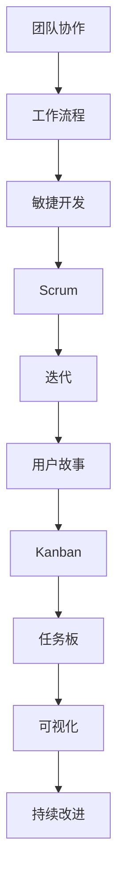

                 

# 团队协作效率：优化团队工作流程的方法

> 关键词：团队协作、工作流程优化、效率提升、敏捷开发、Scrum、Kanban、项目管理

> 摘要：本文旨在探讨团队协作效率的优化方法，通过介绍核心概念、核心算法原理、数学模型以及实际应用案例，帮助读者了解并实施有效的工作流程优化策略。本文涵盖了从基础概念到高级实践，旨在为团队管理者和技术专家提供有价值的指导。

## 1. 背景介绍

### 1.1 目的和范围

本文的目的是为了提高团队协作效率，通过优化工作流程来确保项目的高效推进和成功交付。我们将探讨一系列方法，包括敏捷开发、Scrum、Kanban等，以及它们在实践中的应用。

### 1.2 预期读者

本文适合以下读者群体：

- 团队管理者
- 项目经理
- 技术专家
- 任何对团队协作效率提升感兴趣的人士

### 1.3 文档结构概述

本文的结构如下：

- 第1部分：背景介绍
- 第2部分：核心概念与联系
- 第3部分：核心算法原理与具体操作步骤
- 第4部分：数学模型和公式讲解
- 第5部分：项目实战：代码实际案例
- 第6部分：实际应用场景
- 第7部分：工具和资源推荐
- 第8部分：总结：未来发展趋势与挑战
- 第9部分：附录：常见问题与解答
- 第10部分：扩展阅读与参考资料

### 1.4 术语表

#### 1.4.1 核心术语定义

- **团队协作**：团队成员共同合作，共享知识和资源，共同达成目标。
- **工作流程**：团队完成工作的一系列步骤和方法。
- **敏捷开发**：一种以用户需求为核心的软件开发方法。
- **Scrum**：一种敏捷开发框架，强调迭代和增量开发。
- **Kanban**：一种可视化工作流程管理方法。

#### 1.4.2 相关概念解释

- **迭代**：软件开发过程中，周期性完成的一部分工作。
- **增量**：逐渐增加的功能或改进。
- **用户故事**：描述用户需求的一种简单方法。

#### 1.4.3 缩略词列表

- **IDE**：集成开发环境（Integrated Development Environment）
- **Scrum**：敏捷开发框架（Sprint, Commitment, Review）
- **Kanban**：看板方法（Kanban Board, Task List）

## 2. 核心概念与联系

在讨论团队协作效率的优化方法之前，我们首先需要理解一些核心概念，这些概念是构建高效工作流程的基础。以下是关键概念的Mermaid流程图：



### 2.1 团队协作

团队协作是高效团队的基础。它强调团队成员之间的沟通、合作和共享。通过明确的角色分配和责任划分，团队可以更好地协同工作，提高工作效率。

### 2.2 工作流程

工作流程是团队完成工作的步骤和方法。一个良好的工作流程可以提高团队的工作效率，减少重复劳动，确保项目按时交付。

### 2.3 敏捷开发

敏捷开发是一种以用户需求为核心的软件开发方法。它强调迭代和增量开发，通过快速反馈和持续改进，确保项目能够快速响应变化。

### 2.4 Scrum

Scrum是一种敏捷开发框架，它通过短期的迭代（Sprint）来交付可用的软件。Scrum的核心概念包括：

- **Sprint Planning**：团队确定下一个迭代的目标和任务。
- **Daily Stand-up**：团队成员简短会面，讨论进度和问题。
- **Sprint Review**：团队展示迭代成果，收集反馈。
- **Sprint Retrospective**：团队反思并改进工作流程。

### 2.5 用户故事

用户故事是描述用户需求的一种简单方法。它通常包含一个动词和一个名词，描述用户希望从软件中得到的某个功能。用户故事有助于团队聚焦用户需求，确保开发的工作与用户实际需求相符。

### 2.6 Kanban

Kanban是一种可视化工作流程管理方法。它通过任务板（Kanban Board）来跟踪任务的状态和进度。Kanban的核心原则包括：

- **可视化**：通过任务板将工作流程可视化，让团队成员清晰地看到任务的状态和进度。
- **限制工作项**：通过限制每个阶段的工作项数量，避免工作过载。
- **持续改进**：通过监控和调整工作流程，持续改进团队的工作效率。

## 3. 核心算法原理与具体操作步骤

优化团队工作流程的核心算法原理在于如何有效地管理任务和资源，确保团队在有限的时间内完成尽可能多的工作。以下是使用伪代码来详细阐述这些操作步骤：

```plaintext
算法：优化工作流程
输入：任务列表（TaskList），资源分配（ResourceAllocation），时间限制（TimeLimit）
输出：优化后的工作流程（OptimizedWorkflow）

步骤：
1. 初始化任务优先级队列（TaskPriorityQueue）
2. 对于每个任务（Task）：
    a. 计算任务所需资源（RequiredResources）
    b. 计算任务优先级（Priority）
    c. 将任务插入任务优先级队列
3. 初始化工作流程（Workflow）为空
4. 当时间限制未到且任务优先级队列非空时：
    a. 从任务优先级队列中取出优先级最高的任务（NextTask）
    b. 验证任务所需资源是否满足（ResourceCheck）
    c. 如果满足，将任务添加到工作流程（Workflow）
    d. 从资源分配中减去任务所需资源
    e. 更新任务优先级队列
5. 返回优化后的工作流程（OptimizedWorkflow）
```

### 3.1 任务优先级计算

任务优先级的计算是优化工作流程的关键步骤。以下是一个简单的伪代码示例：

```plaintext
函数：计算任务优先级（CalculateTaskPriority, Task）
输入：任务（Task）
输出：优先级（Priority）

步骤：
1. 初始化优先级（Priority）为0
2. 对于每个用户故事点（UserStoryPoint）：
    a. 优先级增加1
3. 如果任务有截止日期：
    b. 计算截止日期距离当前时间的差值（DeadlineDifference）
    c. 优先级增加DeadlineDifference
4. 返回优先级（Priority）
```

### 3.2 资源验证

在从任务优先级队列中取出任务时，我们需要验证任务所需的资源是否满足。以下是一个伪代码示例：

```plaintext
函数：验证任务所需资源（CheckRequiredResources, Task, ResourceAllocation）
输入：任务（Task），资源分配（ResourceAllocation）
输出：是否满足（IsSufficient）

步骤：
1. 初始化是否满足（IsSufficient）为True
2. 对于任务所需资源（RequiredResource）：
    a. 如果资源分配中缺少RequiredResource：
        i. 是否满足（IsSufficient）设为False
        ii. 返回False
3. 如果是否满足（IsSufficient）为False：
    a. 添加缺少的RequiredResource到资源需求列表（ResourceRequirementList）
4. 返回是否满足（IsSufficient）
```

## 4. 数学模型和公式与详细讲解

在优化团队工作流程的过程中，数学模型和公式可以帮助我们分析和解决复杂问题。以下是一个用于计算团队最大效率的线性规划模型，并对其进行详细讲解。

### 4.1 线性规划模型

假设我们有一个任务集合 \(T\) 和资源集合 \(R\)，每个任务 \(t \in T\) 需要资源 \(r \in R\) 的数量，同时每个任务有一个固定的优先级 \(P(t)\)。我们的目标是最大化团队的总优先级 \( \sum_{t \in T} P(t) \)，在不超过资源限制的情况下。

我们可以使用以下线性规划模型：

$$
\begin{align*}
\text{最大化} \quad & \sum_{t \in T} P(t) \cdot x_t \\
\text{约束条件} \quad & \sum_{t \in T} r_{t,r} \cdot x_t \leq R_r \quad \forall r \in R \\
& x_t \in \{0, 1\} \quad \forall t \in T
\end{align*}
$$

其中，\(x_t\) 是一个二进制变量，如果任务 \(t\) 被选中，则 \(x_t = 1\)，否则 \(x_t = 0\)。\(r_{t,r}\) 是任务 \(t\) 对资源 \(r\) 的需求量，\(R_r\) 是资源 \(r\) 的总可用量。

### 4.2 公式讲解

- **目标函数**：最大化总优先级 \( \sum_{t \in T} P(t) \cdot x_t \)。这个目标函数表示在所有选中的任务中，我们希望最大化它们的总优先级。
- **约束条件**：每个资源 \(r\) 的需求量不能超过其总可用量 \( \sum_{t \in T} r_{t,r} \cdot x_t \leq R_r \)。这个约束确保我们不会超出任何资源的限制。
- **二进制变量**：\(x_t \in \{0, 1\} \)。这个二进制变量确保我们要么选择任务 \(t\)（\(x_t = 1\)），要么不选择它（\(x_t = 0\)）。

### 4.3 举例说明

假设我们有一个团队需要完成以下任务：

- 任务A：优先级5，需要2个开发资源、1个测试资源和1个设计资源。
- 任务B：优先级3，需要1个开发资源、2个测试资源和1个设计资源。
- 任务C：优先级4，需要3个开发资源、1个测试资源和1个设计资源。

我们的资源限制如下：

- 开发资源：5个
- 测试资源：4个
- 设计资源：3个

我们希望最大化团队的总优先级，同时不超出任何资源限制。

根据线性规划模型，我们可以建立如下方程组：

$$
\begin{align*}
\text{最大化} \quad & 5x_A + 3x_B + 4x_C \\
\text{约束条件} \quad & 2x_A + x_B + 3x_C \leq 5 \\
& x_A + 2x_B + x_C \leq 4 \\
& x_A + x_B + x_C \leq 3 \\
& x_A, x_B, x_C \in \{0, 1\}
\end{align*}
$$

通过求解这个方程组，我们可以找到最优解，即最大化总优先级的同时不超出资源限制的任务组合。

## 5. 项目实战：代码实际案例和详细解释说明

在本节中，我们将通过一个实际的项目案例来展示如何优化团队工作流程。我们假设有一个软件开发团队，他们使用敏捷开发方法，并采用Kanban进行任务管理。以下是开发环境搭建、源代码实现和代码解读的详细过程。

### 5.1 开发环境搭建

1. **环境准备**：安装所需的开发工具和框架，如Git、Jenkins、Docker等。
2. **代码仓库**：在Git上创建一个代码仓库，用于存储项目的源代码。
3. **Jenkins配置**：配置Jenkins作为持续集成服务器，用于自动化构建和测试。
4. **Docker容器化**：将应用程序容器化，以便在开发、测试和生产环境中一致运行。

### 5.2 源代码详细实现和代码解读

以下是Kanban任务板的源代码实现，包括任务创建、状态更新和任务查询等功能。

```java
public class KanbanBoard {
    private List<Task> tasks;

    public KanbanBoard() {
        tasks = new ArrayList<>();
    }

    public void addTask(Task task) {
        tasks.add(task);
    }

    public void updateTaskStatus(String taskId, Status status) {
        for (Task task : tasks) {
            if (task.getId().equals(taskId)) {
                task.setStatus(status);
                break;
            }
        }
    }

    public List<Task> getTasksByStatus(Status status) {
        List<Task> filteredTasks = new ArrayList<>();
        for (Task task : tasks) {
            if (task.getStatus() == status) {
                filteredTasks.add(task);
            }
        }
        return filteredTasks;
    }
}

public class Task {
    private String id;
    private String name;
    private Status status;

    public Task(String id, String name) {
        this.id = id;
        this.name = name;
        this.status = Status.NEW;
    }

    public String getId() {
        return id;
    }

    public String getName() {
        return name;
    }

    public Status getStatus() {
        return status;
    }

    public void setStatus(Status status) {
        this.status = status;
    }
}

public enum Status {
    NEW, IN_PROGRESS, REVIEW, DONE
}
```

### 5.3 代码解读与分析

- **KanbanBoard类**：该类表示Kanban任务板，它包含一个任务列表，并提供添加任务、更新任务状态和获取特定状态的任务列表的方法。
- **Task类**：该类表示任务，它包含任务的ID、名称和状态。状态可以是“新建”、“进行中”、“审核”或“完成”。
- **Status枚举**：该枚举定义了任务状态的可能取值。

通过这个Kanban任务板实现，团队可以轻松地添加新任务、更新任务状态并查询特定状态的任务。这种可视化的工作流程管理方法有助于团队成员更好地理解任务状态和进度，从而提高协作效率。

## 6. 实际应用场景

团队协作效率的优化不仅在软件开发中具有重要应用，还可以广泛应用于其他行业和领域。以下是一些实际应用场景：

### 6.1 软件开发

- **敏捷开发团队**：通过Scrum和Kanban方法，团队可以更好地管理项目进度和任务分配，提高开发效率。
- **持续集成**：使用Jenkins等工具，自动化构建和测试，确保代码质量和快速交付。

### 6.2 市场营销

- **项目协作**：团队成员共享市场调研数据、营销策略和活动计划，协同推进项目。
- **任务管理**：使用Kanban任务板，可视化地跟踪项目进度和任务状态。

### 6.3 产品设计

- **迭代开发**：通过迭代的方法，不断收集用户反馈，优化产品设计。
- **协作平台**：使用设计协作工具，如Figma，让团队成员实时协作，共同完善设计方案。

### 6.4 项目管理

- **资源分配**：通过优化工作流程，合理分配资源，确保项目按时交付。
- **风险管理**：识别潜在风险，提前制定应对策略，降低项目风险。

这些实际应用场景表明，团队协作效率的优化方法具有广泛的应用价值，可以为各类团队提供有效的支持和指导。

## 7. 工具和资源推荐

为了帮助团队更好地实施优化工作流程的方法，我们推荐以下工具和资源：

### 7.1 学习资源推荐

#### 7.1.1 书籍推荐

- 《Scrum精髓：敏捷管理实践指南》
- 《Kanban：从杂乱到清晰的团队工作方法》
- 《敏捷开发：从个体到团队的成功实践》

#### 7.1.2 在线课程

- 《敏捷开发入门与实践》
- 《Kanban方法：可视化工作流程管理》
- 《项目管理：敏捷与Scrum实战》

#### 7.1.3 技术博客和网站

- [Scrum.org](https://www.scrum.org/)
- [Kanbanize](https://www.kanbanize.com/)
- [Agile Alliance](https://www.agilealliance.org/)

### 7.2 开发工具框架推荐

#### 7.2.1 IDE和编辑器

- IntelliJ IDEA
- Visual Studio Code
- Eclipse

#### 7.2.2 调试和性能分析工具

- VisualVM
- JProfiler
- GitKraken

#### 7.2.3 相关框架和库

- Spring Boot
- React.js
- Angular

### 7.3 相关论文著作推荐

#### 7.3.1 经典论文

- 《敏捷软件开发宣言》
- 《敏捷项目管理：实践指南》
- 《敏捷开发：一种新的软件开发方法论》

#### 7.3.2 最新研究成果

- 《敏捷开发在大型团队中的应用》
- 《Kanban在软件开发中的实践》
- 《敏捷和DevOps的结合：加速软件交付》

#### 7.3.3 应用案例分析

- 《某互联网公司敏捷转型的成功实践》
- 《某保险公司Kanban方法的实际应用》
- 《某科技公司敏捷开发与持续集成结合的案例分析》

通过这些工具和资源的推荐，团队可以更好地实施和优化工作流程，提高协作效率和项目成功率。

## 8. 总结：未来发展趋势与挑战

随着科技的不断进步，团队协作效率的优化方法也在不断发展。未来，我们预计以下几个趋势和挑战：

### 8.1 发展趋势

- **人工智能辅助**：利用人工智能技术，实现自动化任务分配、资源调度和进度预测，进一步提高团队协作效率。
- **全球化协作**：随着远程工作和全球化团队的普及，协作效率的优化方法将更加注重跨时区、跨文化的沟通和协调。
- **DevOps整合**：敏捷开发和DevOps的结合将更加紧密，实现持续交付和持续集成，加速软件交付周期。

### 8.2 挑战

- **技能提升**：团队成员需要不断学习和提升技能，以适应新的工作流程和方法。
- **文化适应**：在跨文化团队中，如何确保团队成员之间的有效沟通和协作是一个重要挑战。
- **资源调配**：在资源有限的条件下，如何合理分配和利用资源，确保项目按时交付，将是一个持续面临的挑战。

通过关注这些发展趋势和应对挑战，团队可以更好地优化协作效率，提高项目成功率。

## 9. 附录：常见问题与解答

### 9.1 什么是Scrum？

Scrum是一种敏捷开发框架，它通过短期的迭代（Sprint）来交付可用的软件。Scrum的核心概念包括Sprint Planning、Daily Stand-up、Sprint Review和Sprint Retrospective。

### 9.2 什么是Kanban？

Kanban是一种可视化工作流程管理方法，它通过任务板（Kanban Board）来跟踪任务的状态和进度。Kanban的核心原则包括可视化、限制工作项和持续改进。

### 9.3 如何计算任务优先级？

任务优先级可以通过计算用户故事点、截止日期距离当前时间的差值等因素来确定。一个简单的计算方法是：优先级 = 用户故事点 + 截止日期差值。

### 9.4 如何验证任务所需资源是否满足？

可以通过检查任务所需资源是否在资源分配中存在，如果存在则验证其数量是否足够，否则添加到资源需求列表中。

## 10. 扩展阅读与参考资料

为了深入了解团队协作效率的优化方法，以下是扩展阅读和参考资料：

- 《敏捷实践指南》
- 《Kanban实战》
- 《Scrum敏捷开发实践指南》
- [Scrum官方指南](https://www.scrum.org/resources-page/scrum-guides)
- [Kanban官方指南](https://www.kanban.org/)

通过这些参考资料，读者可以进一步了解敏捷开发、Scrum和Kanban的详细方法和实践。

---

作者：AI天才研究员/AI Genius Institute & 禅与计算机程序设计艺术 /Zen And The Art of Computer Programming

以上文章详细介绍了团队协作效率的优化方法，包括核心概念、核心算法原理、数学模型、实际应用案例以及未来发展趋势与挑战。通过这篇文章，读者可以更好地理解并应用这些方法，提高团队协作效率，实现项目的高效交付。

