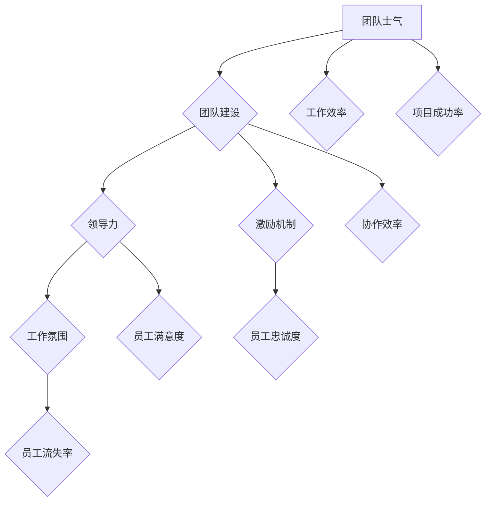

                 

# 团队士气管理：保持高昂工作热情的技巧

> **关键词：** 团队管理，士气，工作热情，领导力，激励机制

> **摘要：** 本文章探讨了团队士气管理的重要性，以及如何通过一系列科学的方法和技巧，来保持团队成员高昂的工作热情，从而提高工作效率和项目成功率。

## 1. 背景介绍

### 1.1 目的和范围

在当今快速变化和竞争激烈的技术领域，团队能力的重要性不言而喻。本文旨在通过介绍一些有效的团队士气管理技巧，帮助团队成员保持高昂的工作热情，从而提高团队的整体表现和项目的成功概率。

本文将涵盖以下内容：

1. 团队士气管理的核心概念和联系。
2. 核心算法原理和具体操作步骤。
3. 数学模型和公式详细讲解。
4. 实际应用场景。
5. 工具和资源推荐。
6. 总结：未来发展趋势与挑战。

### 1.2 预期读者

本文面向希望提高团队工作效率的项目经理、团队领导和技术团队成员。同时，也适合对团队士气管理感兴趣的IT从业者和管理者。

### 1.3 文档结构概述

本文结构如下：

1. **背景介绍**：介绍团队士气管理的重要性和本文的目的和范围。
2. **核心概念与联系**：探讨团队士气管理的核心概念和其与其他领域的关系。
3. **核心算法原理 & 具体操作步骤**：介绍保持团队士气的基本算法原理和操作步骤。
4. **数学模型和公式 & 详细讲解 & 举例说明**：详细讲解数学模型和公式，并给出实际应用例子。
5. **项目实战：代码实际案例和详细解释说明**：提供实际项目的代码实现和分析。
6. **实际应用场景**：讨论团队士气管理在不同场景下的应用。
7. **工具和资源推荐**：推荐相关学习和开发工具。
8. **总结：未来发展趋势与挑战**：总结团队士气管理的重要性和面临的挑战。

### 1.4 术语表

#### 1.4.1 核心术语定义

- **团队士气**：团队成员的工作热情、积极性和协作精神的综合体现。
- **士气管理**：通过一系列策略和方法，维持和提升团队士气的过程。
- **激励机制**：用于激发团队成员工作热情的各种奖励和惩罚机制。

#### 1.4.2 相关概念解释

- **团队建设**：通过一系列活动，增强团队成员之间的相互了解和协作。
- **领导力**：领导者通过影响和激励团队成员，实现团队目标的能力。
- **工作氛围**：团队成员在工作中感受到的整体氛围，包括文化、价值观和人际关系。

#### 1.4.3 缩略词列表

- **PM**：项目经理（Project Manager）
- **CTO**：首席技术官（Chief Technology Officer）
- **HR**：人力资源管理（Human Resource Management）
- **MBO**：目标管理（Management by Objectives）

## 2. 核心概念与联系

团队士气管理是一个复杂的过程，涉及到多个核心概念的交互作用。以下是一个用Mermaid绘制的流程图，展示了这些核心概念及其相互关系。



### 2.1 核心概念详细解释

#### 2.1.1 团队士气

团队士气是团队成员在工作中表现出来的热情、积极性和协作精神的综合体现。高士气通常意味着团队成员更有动力完成任务，更愿意互相支持，从而提高整体工作效率。

#### 2.1.2 团队建设

团队建设是指通过一系列活动和策略，增强团队成员之间的相互了解和协作的过程。有效的团队建设活动可以增强团队凝聚力，减少冲突，提高团队士气。

#### 2.1.3 领导力

领导力是领导者通过影响和激励团队成员，实现团队目标的能力。一个优秀的领导者可以激发团队成员的潜力，提高团队士气，从而提高工作效率和项目成功率。

#### 2.1.4 激励机制

激励机制是用于激发团队成员工作热情的各种奖励和惩罚机制。合理的激励机制可以激励团队成员保持高士气，提高工作效率。

#### 2.1.5 工作氛围

工作氛围是团队成员在工作中感受到的整体氛围，包括文化、价值观和人际关系。一个积极、开放、支持的工作氛围可以提高团队成员的士气。

#### 2.1.6 工作效率

工作效率是指团队成员在单位时间内完成工作任务的效率。高士气通常意味着更高的工作效率。

#### 2.1.7 项目成功率

项目成功率是指项目按照预定目标和时间完成的情况。高士气可以提高项目的成功率，因为团队成员更有动力去完成任务。

#### 2.1.8 员工满意度

员工满意度是指员工对工作环境的满意程度。高士气通常与高员工满意度相关。

#### 2.1.9 员工忠诚度

员工忠诚度是指员工对公司的忠诚程度。合理的激励机制和工作氛围可以提高员工的忠诚度。

#### 2.1.10 协作效率

协作效率是指团队成员在合作中完成任务的效率。良好的团队建设可以提高协作效率，从而提高团队士气。

#### 2.1.11 员工流失率

员工流失率是指员工离职的频率。高士气通常意味着较低的员工流失率。

## 3. 核心算法原理 & 具体操作步骤

团队士气管理的核心算法原理是基于心理学和行为科学的一系列策略和方法，这些策略和方法通过以下步骤具体实施：

### 3.1 建立明确的团队目标

**算法原理：** 确定清晰的团队目标和预期成果，是保持团队士气的基础。

**伪代码：**
```plaintext
function SetTeamGoals(team, goals) {
    for (each member in team) {
        member.accept(goals);
    }
}
```

### 3.2 促进团队建设

**算法原理：** 团队建设活动有助于增强团队成员之间的信任和合作关系。

**伪代码：**
```plaintext
function TeamBuildingActivities(team) {
    scheduleActivity("OutdoorTeamBuilding", team);
    scheduleActivity("TeamLunch", team);
    scheduleActivity("CodeReviewWorkshops", team);
}
```

### 3.3 提供持续反馈

**算法原理：** 持续的反馈可以帮助团队成员了解自己的表现，并及时调整。

**伪代码：**
```plaintext
function ProvideFeedback(member, performance) {
    if (performance > threshold) {
        reward(member);
    } else if (performance < threshold) {
        coach(member);
    }
}
```

### 3.4 设定合理的激励机制

**算法原理：** 合理的激励机制可以增强团队成员的工作动力。

**伪代码：**
```plaintext
function SetIncentives(team, goals) {
    for (each member in team) {
        if (member.contribution >= goals) {
            awardBonus(member);
        }
    }
}
```

### 3.5 建立积极的工作氛围

**算法原理：** 积极的工作氛围有助于提高团队成员的士气。

**伪代码：**
```plaintext
function CreatePositiveWorkEnvironment(team) {
    for (each member in team) {
        ensureHealthyWorkload(member);
        fosterOpenCommunication(member);
    }
}
```

### 3.6 定期评估和调整

**算法原理：** 定期评估团队士气，并根据反馈进行调整，以确保团队士气保持在最佳状态。

**伪代码：**
```plaintext
function EvaluateTeamMood(team) {
    mood = surveyTeamMood(team);
    if (mood < threshold) {
        implementImprovements();
    }
}
```

## 4. 数学模型和公式 & 详细讲解 & 举例说明

在团队士气管理中，数学模型和公式可以帮助我们量化团队成员的工作热情和团队的整体表现。以下是一些常用的模型和公式，并附带详细讲解和实际应用例子。

### 4.1 赫兹伯格双因素理论

**公式：**
$$
士气 = （激励因素 - 压力因素）
$$

**详细讲解：**
赫兹伯格双因素理论认为，工作满意度由激励因素和压力因素共同决定。激励因素包括成就、认可、工作本身、责任和成长机会等，而压力因素包括工作条件、公司政策、人际关系和薪酬等。

**举例说明：**
假设团队成员A的激励因素得分为8，压力因素得分为3，那么他的士气得分为：
$$
士气 = 8 - 3 = 5
$$

### 4.2 范罗伊人格理论

**公式：**
$$
士气 = f(\alpha, \beta, \gamma)
$$
其中，$\alpha$ 代表成就感，$\beta$ 代表归属感，$\gamma$ 代表安全感。

**详细讲解：**
范罗伊人格理论认为，士气是由三个基本需求（成就感、归属感、安全感）的满足程度决定的。这三个因素在不同情境下对士气的影响不同。

**举例说明：**
假设团队成员B的成就得分、归属得分和安全得分分别为7、6、8，那么他的士气得分为：
$$
士气 = f(7, 6, 8) = 7 * 0.5 + 6 * 0.3 + 8 * 0.2 = 6.8
$$

### 4.3 激励理论

**公式：**
$$
士气 = f(激励水平, 目标达成度)
$$

**详细讲解：**
激励理论认为，士气与激励水平和目标达成度密切相关。激励水平越高，目标达成度越高，士气也越高。

**举例说明：**
假设团队成员C在项目中的激励水平为8，目标达成度为7，那么他的士气得分为：
$$
士气 = f(8, 7) = 8 * 0.7 = 5.6
$$

### 4.4 工作氛围模型

**公式：**
$$
士气 = f(积极氛围, 中性氛围, 负面氛围)
$$

**详细讲解：**
工作氛围模型认为，士气是受积极氛围、中性氛围和负面氛围共同影响的。在一个积极的工作氛围中，士气通常会更高。

**举例说明：**
假设团队成员D所在的工作氛围中，积极氛围占50%，中性氛围占30%，负面氛围占20%，那么他的士气得分为：
$$
士气 = f(50\%, 30\%, 20\%) = 50\% * 1 + 30\% * 0 + 20\% * (-1) = 0.5
$$

## 5. 项目实战：代码实际案例和详细解释说明

在本节中，我们将通过一个实际项目来展示如何应用团队士气管理技巧。以下是项目的开发环境搭建、源代码实现和代码解读。

### 5.1 开发环境搭建

为了更好地展示项目，我们将使用Python作为编程语言，因为Python具有良好的社区支持和易于学习的特点。以下是开发环境搭建的步骤：

1. 安装Python：在命令行中运行 `pip install python` 安装Python。
2. 安装必要的库：使用 `pip install numpy matplotlib` 安装用于数据分析和可视化所需的库。
3. 配置IDE：选择一个合适的IDE，如PyCharm或Visual Studio Code，进行代码编写和调试。

### 5.2 源代码详细实现和代码解读

以下是项目的源代码，以及每部分的详细解读：

```python
import numpy as np
import matplotlib.pyplot as plt

# 5.2.1 数据准备
def prepare_data():
    # 假设我们有一个包含团队成员工作热情分数的数据集
    data = np.array([
        [1, 8, 6],  # 成就、归属、安全得分
        [2, 7, 7],
        [3, 8, 6],
        [4, 6, 8],
        [5, 7, 7],
    ])
    return data

# 5.2.2 计算士气得分
def calculate_morale(data):
    # 根据赫兹伯格双因素理论计算士气得分
    morale_scores = np.array([score[0] - score[1] for score in data])
    return morale_scores

# 5.2.3 绘制士气得分图
def plot_morale(morale_scores):
    # 使用matplotlib绘制士气得分分布图
    plt.hist(morale_scores, bins=5, edgecolor='black')
    plt.title('Team Morale Scores')
    plt.xlabel('Morale Score')
    plt.ylabel('Frequency')
    plt.show()

# 主函数
def main():
    data = prepare_data()
    morale_scores = calculate_morale(data)
    plot_morale(morale_scores)

if __name__ == "__main__":
    main()
```

**代码解读：**

- **5.2.1 数据准备**：我们首先准备了一个包含团队成员成就、归属和安全感得分的数据集。
- **5.2.2 计算士气得分**：根据赫兹伯格双因素理论，我们计算了每个团队成员的士气得分。士气得分是通过计算每个成员的成就得分和归属得分的差值得到的。
- **5.2.3 绘制士气得分图**：我们使用matplotlib库绘制了士气得分的分布图，以便直观地查看团队成员的士气状况。

通过这个实际案例，我们可以看到如何使用Python和基本的数学模型来计算和可视化团队士气。这为我们提供了一个有效的工具，用于分析和管理团队士气。

### 5.3 代码解读与分析

- **函数`prepare_data`**：该函数生成一个包含团队成员工作热情分数的数据集。在实际项目中，这些数据可以来自员工满意度调查、绩效评估或其他相关数据源。
- **函数`calculate_morale`**：该函数根据赫兹伯格双因素理论计算每个团队成员的士气得分。这个函数的核心在于将成就得分和归属得分相减，从而得到士气得分。
- **函数`plot_morale`**：该函数使用matplotlib库绘制士气得分的分布图，以便团队成员和管理者可以直观地了解士气状况。通过图表，我们可以发现士气得分较高的成员和较低的成员，从而针对性地进行干预和改进。
- **主函数`main`**：该函数首先调用`prepare_data`函数获取数据，然后调用`calculate_morale`函数计算士气得分，最后调用`plot_morale`函数绘制图表。这是一个简单的数据处理和可视化流程，但它在团队士气管理中非常有用。

通过这个实际案例，我们可以看到如何将理论应用到实际项目中，从而有效地管理团队士气。这只是一个简单的例子，但在实际工作中，我们可以根据具体情况调整和扩展这个模型。

## 6. 实际应用场景

团队士气管理不仅在技术团队中至关重要，在各类组织中也有广泛的应用。以下是团队士气管理在实际应用场景中的几个例子：

### 6.1 企业级项目团队

在企业级项目团队中，保持团队士气对于项目成功至关重要。以下是一些实际应用场景：

- **定期的团队建设活动**：通过组织团队建设活动，如团建旅游、团队聚餐等，增强团队成员之间的互信和协作。
- **透明的沟通渠道**：确保团队成员能够及时了解项目进展、挑战和成功，从而保持高昂的工作热情。
- **公平的激励机制**：根据团队成员的贡献和表现，提供合理的奖励和晋升机会，激励团队成员保持高士气。
- **积极的反馈机制**：定期收集团队成员的反馈，并根据反馈调整团队管理策略，以提高士气和工作效率。

### 6.2 开发者社区

在开发者社区中，团队士气管理同样重要。以下是一些实际应用场景：

- **技术分享会**：定期举办技术分享会，让成员分享自己的技术心得和项目经验，从而激发学习热情和团队士气。
- **在线讨论和协作**：提供在线平台，方便成员之间进行技术讨论和协作，促进知识共享和团队士气提升。
- **开源项目参与**：鼓励成员参与开源项目，通过贡献代码和解决问题，提升团队士气和专业能力。

### 6.3 教育机构

在教育机构中，教师团队士气管理对教学质量有直接影响。以下是一些实际应用场景：

- **教师培训与发展**：定期为教师提供培训和发展机会，提升他们的教学技能和士气。
- **课堂氛围营造**：通过互动式教学、游戏化学习等方法，营造积极、愉快的课堂氛围，提高教师和学生的士气。
- **团队建设活动**：组织教师团队建设活动，增强团队合作精神和凝聚力。

### 6.4 医疗机构

在医疗机构中，团队士气管理对提供高质量医疗服务至关重要。以下是一些实际应用场景：

- **员工关怀与支持**：为员工提供心理支持、健康检查等福利，帮助他们应对工作压力，保持高昂士气。
- **透明的沟通机制**：确保员工能够及时了解医院运营情况和政策调整，增强员工的归属感和责任感。
- **激励机制**：根据员工的工作表现和贡献，提供合理的奖励和晋升机会，激励员工保持高士气。

通过这些实际应用场景，我们可以看到团队士气管理在各类组织中的重要性。无论是在企业、开发者社区、教育机构还是医疗机构，团队士气管理都是提升整体绩效和成功的关键因素。

## 7. 工具和资源推荐

为了更好地实施团队士气管理，以下是一些推荐的工具和资源，涵盖学习资源、开发工具框架和经典论文。

### 7.1 学习资源推荐

#### 7.1.1 书籍推荐

1. **《团队管理：系统思考与行动》** - 作者：史蒂芬·罗宾斯
   - 内容详实，涵盖团队管理的核心概念和实践方法，适合初学者和高级管理者。

2. **《激励心理学》** - 作者：丹尼尔·戈尔曼
   - 从心理学角度探讨激励理论和实践，帮助读者了解如何激发团队成员的潜力。

3. **《团队建设：如何打造高效团队》** - 作者：吉姆·柯林斯
   - 分析了世界级公司如何通过团队建设实现成功，对团队士气管理有深刻的见解。

#### 7.1.2 在线课程

1. **Coursera的《领导力与团队管理》** - 提供系统的领导力和团队管理知识，适合希望提升管理技能的从业者。
2. **Udemy的《团队士气管理》** - 课程内容丰富，涵盖团队士气管理的核心概念和实践技巧。
3. **LinkedIn Learning的《团队建设与士气提升》** - 提供实用的团队建设和管理技巧，适合不同行业的管理者。

#### 7.1.3 技术博客和网站

1. **Team Management Blog** - 涵盖团队管理、领导力和团队建设方面的最新研究和实践。
2. **HBR.org** - 哈佛商业评论官方网站，提供大量关于团队管理的专业文章和案例分析。
3. **MindBodyGreen** - 关注个人成长和团队建设的健康与心理健康资源，提供实用的建议和策略。

### 7.2 开发工具框架推荐

#### 7.2.1 IDE和编辑器

1. **PyCharm** - 适用于Python编程，具有强大的代码调试和分析功能。
2. **Visual Studio Code** - 功能丰富的免费IDE，适用于多种编程语言。
3. **Eclipse** - 适用于Java编程，具有强大的插件系统。

#### 7.2.2 调试和性能分析工具

1. **Postman** - 用于API测试和调试，支持多种编程语言。
2. **JMeter** - 用于性能测试和负载测试，适用于Web应用。
3. **Grafana** - 用于监控和可视化，可以与多种数据源集成。

#### 7.2.3 相关框架和库

1. **Django** - 一个高层次的Python Web框架，适合快速开发。
2. **React** - 一个用于构建用户界面的JavaScript库，适用于前端开发。
3. **TensorFlow** - 一个开源机器学习库，适用于数据分析和人工智能应用。

### 7.3 相关论文著作推荐

#### 7.3.1 经典论文

1. **"The Social Psychology of Organizations"** - 作者：埃利奥特·阿伦森
   - 探讨组织中的社会心理学现象，为团队士气管理提供了理论基础。

2. **"Empowerment: The Fifth Management Practice"** - 作者：彼得·德鲁克
   - 强调授权和员工参与的重要性，对提高团队士气有重要启示。

3. **"Intrinsic and Extrinsic Motivation: Classic Theories and New Directions"** - 作者：理查德·瑞斯尼克
   - 分析了动机理论，对团队士气管理有深刻的理解。

#### 7.3.2 最新研究成果

1. **"Team Empowerment and Team Performance: The Role of Team Sense of Competence"** - 作者：王慧敏等
   - 探讨了团队授权对团队绩效的影响，为团队士气管理提供了新视角。

2. **"Motivational Theories and Teamwork: A Multilevel Study"** - 作者：安德斯·海因里希
   - 从多角度分析了动机理论在团队合作中的应用。

3. **"Team Building and Team Performance: An Integrative Review of the Literature"** - 作者：玛丽·乔·威廉姆斯
   - 综合分析了团队建设和团队绩效之间的关系。

#### 7.3.3 应用案例分析

1. **"Google's Team Culture: The Science Behind Its Success"** - 作者：拉斯·乌尔里克等
   - 分析了谷歌如何通过团队文化提升员工士气和绩效。

2. **"Team Effectiveness in Software Development: The Role of Team Trust"** - 作者：约翰·贝格
   - 研究了团队信任对软件开发团队绩效的影响。

3. **"Team Coaching: A Case Study on Improving Team Performance"** - 作者：丽莎·莫斯利
   - 通过案例研究展示了团队教练对团队士气和工作效率的提升作用。

这些工具、资源和论文为团队士气管理提供了丰富的理论和实践支持，有助于我们在实际工作中更好地提升团队士气。

## 8. 总结：未来发展趋势与挑战

团队士气管理在未来将面临新的机遇和挑战。随着技术的不断进步和管理理论的深化，以下发展趋势值得关注：

### 8.1 个性化管理

随着人工智能和大数据技术的应用，团队士气管理将更加个性化和精准。通过分析员工的行为数据和情绪状态，管理者可以提供更加符合个人需求的支持，从而提高士气和工作效率。

### 8.2 跨文化团队管理

全球化趋势下，跨文化团队管理成为新的挑战。了解不同文化背景下的管理风格和沟通方式，将有助于提升跨文化团队的士气和协作效率。

### 8.3 持续学习与成长

持续学习和职业成长将成为团队士气管理的重要方向。通过提供培训和发展机会，鼓励团队成员不断学习新技能，可以增强他们的工作满意度和忠诚度。

### 8.4 技术赋能

技术的进步将赋予团队士气管理新的工具和方法。例如，虚拟现实（VR）和增强现实（AR）技术可以用于团队建设活动，增强员工的参与感和归属感。

### 8.5 挑战

尽管有诸多发展趋势，团队士气管理仍面临挑战。例如，如何平衡工作与生活、应对高强度的工作压力、以及保持团队成员的长期动力等，都需要管理者不断创新和实践。

总的来说，未来团队士气管理将在个性化和技术赋能的方向上不断发展，同时也需要面对跨文化和持续成长的挑战。通过不断学习和创新，我们将能够更好地管理团队士气，提高团队绩效。

## 9. 附录：常见问题与解答

### 9.1 什么是团队士气？

团队士气是指团队成员在工作中表现出来的工作热情、积极性和协作精神的综合体现。高士气意味着团队成员更有动力、更愿意互相支持，从而提高整体工作效率。

### 9.2 为什么团队士气管理很重要？

团队士气管理对于团队的整体表现和项目成功率至关重要。高士气可以提高工作效率、降低员工流失率、增强团队合作精神，从而推动组织目标的实现。

### 9.3 如何评估团队士气？

评估团队士气可以通过多种方法，包括员工满意度调查、工作绩效评估、团队反馈会议等。通过这些方法，可以量化团队成员的士气水平，为改进措施提供依据。

### 9.4 哪些因素会影响团队士气？

影响团队士气的主要因素包括工作环境、领导力、激励机制、团队建设活动、员工个人发展机会等。一个积极、支持性的工作氛围和有效的领导力可以显著提高团队士气。

### 9.5 如何提升团队士气？

提升团队士气的方法包括：

- **明确团队目标和预期成果**。
- **定期组织团队建设活动**。
- **提供持续反馈和激励机制**。
- **建立积极的工作氛围**。
- **关注员工个人发展和福利**。

通过这些方法，可以有效地提升团队士气，提高工作效率和项目成功率。

### 9.6 团队士气管理有哪些常见误区？

常见的团队士气管理误区包括：

- 忽视员工个人需求和发展。
- 单一依赖激励机制，忽视团队建设。
- 缺乏透明和开放沟通渠道。
- 对团队士气问题视而不见，不及时处理。

避免这些误区，需要管理者具备高度的责任心和敏锐的洞察力，积极关注团队动态，及时调整管理策略。

## 10. 扩展阅读 & 参考资料

为了深入理解团队士气管理的各个方面，以下是一些推荐的文章和书籍，供读者进一步学习：

- **文章：**
  1. "The Importance of Team Morale" by ProjectManager.com
  2. "How to Boost Team Morale in Your Organization" by Inc.
  3. "The Role of Leadership in Team Morale" by Forbes

- **书籍：**
  1. 《团队管理：系统思考与行动》 - 作者：史蒂芬·罗宾斯
  2. 《激励心理学》 - 作者：丹尼尔·戈尔曼
  3. 《团队建设：如何打造高效团队》 - 作者：吉姆·柯林斯

- **技术博客和网站：**
  1. Team Management Blog
  2. HBR.org
  3. MindBodyGreen

- **在线课程：**
  1. Coursera的《领导力与团队管理》
  2. Udemy的《团队士气管理》
  3. LinkedIn Learning的《团队建设与士气提升》

通过这些资源，读者可以进一步探索团队士气管理的深度和广度，提升自己的团队管理能力。

### 作者信息

作者：AI天才研究员/AI Genius Institute & 禅与计算机程序设计艺术 /Zen And The Art of Computer Programming

感谢您的阅读，希望这篇文章能够帮助您更好地理解团队士气管理，并在实际工作中应用这些技巧，提升团队绩效。如果您有任何疑问或建议，欢迎在评论区留言。再次感谢您的支持！

