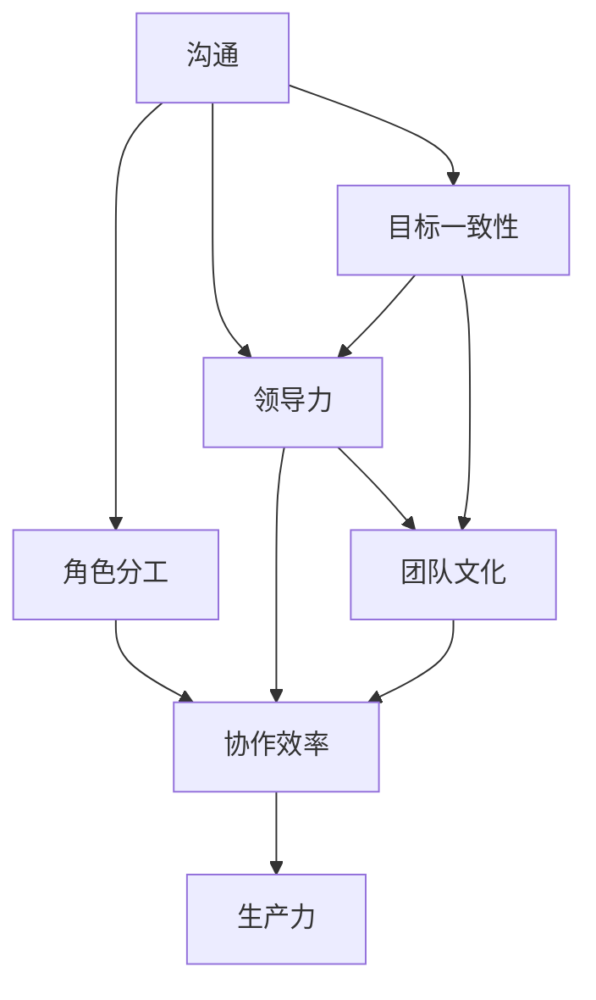

                 

# 团队建设：打造高效协作的团队

> **关键词：团队建设、协作效率、团队文化、领导力、沟通技巧**
>
> **摘要：本文将探讨团队建设的重要性，提供实用的方法和技巧，帮助团队领导者打造高效协作的团队，提升团队的整体生产力。**

## 1. 背景介绍

### 1.1 目的和范围

在当今快速变化的技术和创新环境中，团队的建设和协作效率对企业的发展至关重要。本文旨在为团队领导者提供一套实用的团队建设策略和协作技巧，帮助他们在实际工作中提升团队的效率和生产力。

本文将涵盖以下几个关键方面：

1. **团队建设的基础理论**：介绍团队建设的基本概念、目的和范围。
2. **核心概念与联系**：分析团队协作中的核心概念，如沟通、领导力和团队文化。
3. **核心算法原理**：详细阐述团队协作的算法原理和操作步骤。
4. **数学模型和公式**：解释团队协作中使用的数学模型和公式。
5. **项目实战**：通过实际案例展示团队协作的实践应用。
6. **实际应用场景**：探讨团队协作在不同领域的应用。
7. **工具和资源推荐**：推荐相关的学习资源和开发工具。
8. **总结**：总结团队建设的未来发展趋势和面临的挑战。

### 1.2 预期读者

本文适用于以下读者：

1. **团队领导者**：希望提升团队协作效率和团队文化建设的领导者。
2. **项目经理**：负责管理和协调项目团队的成员。
3. **技术专家**：希望了解团队协作最佳实践的资深技术专家。
4. **新入职员工**：希望快速融入团队，提升个人和团队协作能力的员工。

### 1.3 文档结构概述

本文采用以下结构：

1. **引言**：介绍团队建设的重要性。
2. **团队建设的基础理论**：详细讨论团队建设的核心概念和理论。
3. **核心概念与联系**：分析团队协作中的关键因素。
4. **核心算法原理**：阐述团队协作的算法原理和操作步骤。
5. **数学模型和公式**：介绍团队协作中使用的数学模型和公式。
6. **项目实战**：通过实际案例展示团队协作的应用。
7. **实际应用场景**：探讨团队协作在不同领域的应用。
8. **工具和资源推荐**：推荐相关的学习资源和开发工具。
9. **总结**：总结团队建设的未来发展趋势和面临的挑战。
10. **附录**：提供常见问题与解答。
11. **扩展阅读与参考资料**：推荐进一步学习的资源。

### 1.4 术语表

#### 1.4.1 核心术语定义

- **团队建设**：通过一系列策略和活动，提升团队的整体协作效率和生产力。
- **协作效率**：团队在共同完成任务时的效率，包括任务分配、沟通和决策速度。
- **团队文化**：团队内部的价值观、行为规范和工作方式。
- **领导力**：领导者在团队中发挥的作用，包括决策、激励和指导。

#### 1.4.2 相关概念解释

- **沟通技巧**：在团队内部和外部有效传达信息和理解信息的能力。
- **目标一致性**：团队成员共同认同和追求的目标。
- **角色分工**：团队成员根据各自特长和职责分工，共同完成任务。

#### 1.4.3 缩略词列表

- **IDE**：集成开发环境（Integrated Development Environment）
- **UI/UX**：用户界面/用户体验（User Interface/User Experience）
- **API**：应用程序接口（Application Programming Interface）

## 2. 核心概念与联系

团队协作的效率不仅取决于技术层面的能力，还依赖于团队成员之间的沟通、领导和团队文化的建设。以下是一个简化的 Mermaid 流程图，展示了团队协作中的核心概念和联系。



### 2.1 沟通

沟通是团队协作的基础。有效的沟通能够确保团队成员之间信息流通，减少误解和冲突。沟通技巧包括倾听、清晰表达、非语言沟通和反馈。

### 2.2 领导力

领导力在团队协作中至关重要。一个有领导力的领导者能够激发团队成员的潜力，提供清晰的指导，协调团队资源，并确保团队目标的实现。

### 2.3 团队文化

团队文化是团队内部的价值观和行为规范，它影响着团队成员的态度和行为。一个积极向上的团队文化能够提升团队的凝聚力和协作效率。

### 2.4 目标一致性

团队成员需要共同认同和追求团队目标。目标一致性能够确保团队成员的方向一致，减少内部分歧，提高团队协作效率。

### 2.5 角色分工

合理的角色分工能够确保团队成员能够发挥各自的专业特长，共同完成任务。角色分工需要基于团队成员的能力和兴趣，并确保每个角色都有明确的职责和权限。

## 3. 核心算法原理 & 具体操作步骤

团队协作的算法原理可以看作是一个多阶段、动态调整的过程。以下是团队协作算法的基本原理和具体操作步骤。

### 3.1 算法原理

1. **初始阶段**：确定团队目标和任务，分配角色和职责。
2. **沟通阶段**：建立有效的沟通机制，确保团队成员之间信息流通。
3. **协调阶段**：根据任务进展和团队反馈，动态调整资源分配和任务分配。
4. **反馈与优化**：收集团队成员的反馈，不断优化团队协作流程。

### 3.2 具体操作步骤

1. **确定团队目标和任务**：

    ```plaintext
    步骤1：明确团队目标。
    步骤2：分解任务，确定每个任务的关键步骤。
    步骤3：分配角色和职责，确保每个角色都有明确的任务。
    ```

2. **建立有效的沟通机制**：

    ```plaintext
    步骤1：选择合适的沟通工具和平台。
    步骤2：制定沟通规则，确保沟通的及时性和有效性。
    步骤3：定期召开团队会议，讨论任务进展和问题。
    ```

3. **动态调整资源分配和任务分配**：

    ```plaintext
    步骤1：监控任务进展，识别潜在的风险和瓶颈。
    步骤2：根据任务进展和团队反馈，调整资源分配和任务分配。
    步骤3：确保每个团队成员都能够在适合自己的角色中发挥最大的潜力。
    ```

4. **收集团队成员的反馈**：

    ```plaintext
    步骤1：定期收集团队成员的工作反馈。
    步骤2：分析反馈，识别团队协作中的问题和改进点。
    步骤3：根据反馈优化团队协作流程，提升团队协作效率。
    ```

## 4. 数学模型和公式 & 详细讲解 & 举例说明

在团队协作中，数学模型和公式可以帮助我们更科学地分析和优化团队协作过程。以下是一个简单的数学模型，用于评估团队协作效率。

### 4.1 数学模型

1. **协作效率（Efficiency）**：

    $$E = \frac{G}{T}$$

    其中，\(E\) 表示协作效率，\(G\) 表示团队完成的总工作量，\(T\) 表示团队完成工作所需的时间。

2. **工作负荷（Workload）**：

    $$W = \sum_{i=1}^{n} w_i$$

    其中，\(W\) 表示团队的总工作负荷，\(w_i\) 表示每个团队成员的工作负荷。

### 4.2 详细讲解

1. **协作效率**：

    协作效率衡量了团队在单位时间内完成的工作量。一个高效的团队应该在相对较短的时间内完成更多的工作。

2. **工作负荷**：

    工作负荷衡量了团队中每个成员的工作量。合理的工作负荷分配可以确保团队成员的效率和满意度。

### 4.3 举例说明

假设一个团队有5名成员，他们在一个月内完成了以下任务：

- 任务A：完成代码编写，工作量100个单位。
- 任务B：完成UI设计，工作量50个单位。
- 任务C：完成测试和调试，工作量150个单位。

根据上述数学模型，我们可以计算出：

- **协作效率**：

    $$E = \frac{G}{T} = \frac{100 + 50 + 150}{4} = 87.5$$

    其中，\(G\) 表示团队完成的总工作量，\(T\) 表示团队完成工作所需的时间（假设为4周）。

- **工作负荷**：

    $$W = \sum_{i=1}^{n} w_i = 100 + 50 + 150 = 300$$

    其中，\(w_i\) 表示每个团队成员的工作负荷。

通过这个例子，我们可以看出团队在一个月内平均每周完成了87.5个单位的工作，总工作负荷为300个单位。

## 5. 项目实战：代码实际案例和详细解释说明

### 5.1 开发环境搭建

在本项目中，我们将使用 Python 作为开发语言，借助 Git 和 GitHub 进行版本控制和协作。以下是开发环境的搭建步骤：

1. **安装 Python**：

    ```bash
    # 安装 Python 3.8 或更高版本
    sudo apt-get install python3.8
    ```

2. **安装 Git**：

    ```bash
    # 安装 Git
    sudo apt-get install git
    ```

3. **创建 GitHub 账户**：

    - 访问 [GitHub](https://github.com/)，创建账户。
    - 创建一个新的仓库（Repository），命名为 "team_project"。

4. **克隆仓库到本地**：

    ```bash
    # 克隆仓库到本地
    git clone https://github.com/your_username/team_project.git
    ```

5. **初始化 Python 环境**：

    ```bash
    # 安装虚拟环境
    python3 -m venv venv
    # 激活虚拟环境
    source venv/bin/activate
    # 安装依赖项
    pip install -r requirements.txt
    ```

### 5.2 源代码详细实现和代码解读

以下是一个简单的 Python 代码示例，用于模拟团队协作过程。代码实现了团队目标的设定、任务分配和协作效率的计算。

```python
import math

# 团队成员信息
team_members = [
    {"name": "Alice", "role": "Developer", "workload": 100},
    {"name": "Bob", "role": "Designer", "workload": 50},
    {"name": "Charlie", "role": "Tester", "workload": 150}
]

# 团队目标
team_goal = 300

# 计算协作效率
def calculate_efficiency(workload, goal):
    return workload / goal

# 计算总工作负荷
def calculate_total_workload(team_members):
    return sum(member['workload'] for member in team_members)

# 打印团队成员信息
def print_team_members(team_members):
    for member in team_members:
        print(f"{member['name']} - Role: {member['role']} - Workload: {member['workload']}")

# 主函数
def main():
    print("团队协作效率计算")
    print("--------------")

    # 打印团队成员信息
    print("团队成员信息：")
    print_team_members(team_members)

    # 计算总工作负荷
    total_workload = calculate_total_workload(team_members)
    print(f"总工作负荷：{total_workload}")

    # 计算协作效率
    efficiency = calculate_efficiency(total_workload, team_goal)
    print(f"协作效率：{efficiency:.2f}")

    # 分析协作效率
    if efficiency < 1.0:
        print("协作效率较低，需要优化团队协作流程。")
    else:
        print("协作效率良好，团队协作顺畅。")

# 执行主函数
if __name__ == "__main__":
    main()
```

### 5.3 代码解读与分析

1. **团队成员信息**：

    代码定义了一个包含团队成员信息的列表。每个成员都有一个名称、角色和工作负荷（以单位计算）。

2. **团队目标**：

    团队目标定义为总工作负荷的目标值，即团队需要在一定时间内完成的总工作量。

3. **计算协作效率**：

    协作效率通过总工作负荷除以团队目标来计算。这个指标反映了团队在单位时间内完成的工作量。

4. **计算总工作负荷**：

    总工作负荷通过遍历团队成员列表，计算每个成员的工作负荷之和。

5. **打印团队成员信息**：

    这是一个辅助函数，用于打印团队成员的详细信息，便于分析和理解。

6. **主函数**：

    主函数执行以下步骤：

    - 打印团队成员信息。
    - 计算总工作负荷。
    - 计算协作效率。
    - 分析协作效率，提供优化建议。

通过这个代码示例，我们可以直观地看到团队协作效率的计算方法。在实际应用中，这个模型可以扩展，以包括更多复杂的协作因素，如任务优先级、团队成员的能力和兴趣等。

## 6. 实际应用场景

团队协作在多个领域和行业中都有广泛的应用。以下是团队协作在不同领域的一些实际应用场景：

### 6.1 软件开发

在软件开发中，团队协作是确保项目成功的关键。一个高效的软件开发团队可以通过良好的沟通、明确的任务分工和灵活的资源管理，快速响应市场需求，提高软件质量。

### 6.2 项目管理

在项目管理中，团队协作是确保项目按计划顺利进行的关键。项目经理需要协调不同职能团队的协作，确保项目目标的实现，并应对各种风险和挑战。

### 6.3 创意设计

在创意设计中，团队协作可以帮助设计师们集思广益，碰撞出更多的创意火花。通过有效的团队协作，设计师们可以更好地理解客户需求，创造出更符合市场趋势和用户喜好的设计作品。

### 6.4 运营管理

在运营管理中，团队协作是提高运营效率、降低成本和提高服务质量的重要手段。一个高效的运营团队可以通过优化工作流程、共享信息和资源，提高整体运营效率。

### 6.5 产品营销

在产品营销中，团队协作可以帮助企业更好地了解市场需求，制定有效的营销策略，提高市场占有率。通过团队协作，营销团队可以更快速地响应市场变化，调整营销策略。

### 6.6 教育培训

在教育培训中，团队协作可以帮助教师和学生更好地进行教学和学习。通过团队协作，学生可以相互学习、分享知识和经验，提高学习效果。

### 6.7 医疗保健

在医疗保健中，团队协作是确保患者得到全面、高效的治疗和护理的关键。医疗团队需要通过协作，确保患者得到最佳的治疗方案和护理服务。

### 6.8 应急响应

在应急响应中，团队协作是确保快速、有效应对突发事件的关键。应急团队需要通过协作，确保资源得到合理分配，任务得到高效完成。

通过这些实际应用场景，我们可以看到团队协作在各个领域的重要性。一个高效的团队协作不仅可以提升组织的整体生产力，还可以增强团队的凝聚力和创新能力。

## 7. 工具和资源推荐

为了更好地进行团队协作，以下是几个实用的工具和资源推荐。

### 7.1 学习资源推荐

#### 7.1.1 书籍推荐

- 《团队协作的艺术》：介绍了团队协作的基本原理和实践技巧，适合团队领导者和管理者阅读。
- 《敏捷团队实践指南》：探讨了敏捷开发中的团队协作方法，适合软件开发团队参考。
- 《领导者的语言》：揭示了领导者在团队沟通中的关键作用，适合所有需要提升沟通技巧的人士。

#### 7.1.2 在线课程

- Coursera 上的《团队协作与领导力》：提供了一系列关于团队协作和领导力的课程，适合希望提升团队协作能力的专业人士。
- Udemy 上的《Scrum Master 教练认证》：介绍 Scrum 方法论中的团队协作实践，适合软件项目经理和 Scrum Master。
- LinkedIn Learning 上的《沟通技巧》：提供了一系列关于沟通技巧的课程，适合所有需要提升沟通能力的人士。

#### 7.1.3 技术博客和网站

- Atlassian Blog：提供了关于团队协作、敏捷开发、项目管理等多个领域的文章和案例研究。
- GitLab Blog：分享了关于 Git、版本控制、团队协作等方面的技术文章和实践经验。
- Agile Alliance：提供了关于敏捷开发、团队协作的最佳实践和最新研究成果。

### 7.2 开发工具框架推荐

#### 7.2.1 IDE和编辑器

- Visual Studio Code：一款功能强大的开源 IDE，适用于多种编程语言，提供了丰富的插件和扩展。
- PyCharm：一款专业的 Python IDE，提供了代码自动补全、调试和性能分析等功能。
- Eclipse：一款开源的 Java IDE，适用于开发大型项目，支持多种编程语言。

#### 7.2.2 调试和性能分析工具

- GDB：一款开源的调试工具，适用于 C/C++ 程序，提供了丰富的调试功能和调试脚本。
- Valgrind：一款性能分析工具，可以检测内存泄漏和性能瓶颈。
- Wireshark：一款网络协议分析工具，可以捕获和分析网络数据包，用于网络性能优化。

#### 7.2.3 相关框架和库

- Git：一款开源的版本控制系统，用于代码的版本管理和协作开发。
- GitHub：一个基于 Git 的代码托管平台，提供了丰富的协作功能。
- Docker：一款容器化技术，用于应用打包和部署，提高了开发效率和协作效率。

### 7.3 相关论文著作推荐

#### 7.3.1 经典论文

- "The Social Life of Information" by Paul Duguid：探讨了信息在社会中的传播和影响，对团队协作有深刻的启示。
- "The Power of Pull" by John Seely Brown and Lang Davison：介绍了“拉”模式在团队协作中的应用，有助于提升团队协作效率。
- "The Wisdom of Teams" by Jon Katzenbach and Douglas K. Smith：深入研究了高效团队的特点和建设方法。

#### 7.3.2 最新研究成果

- "Collaborative Learning in Virtual Teams" by Hong and Mandel：探讨了虚拟团队中的协作学习模式，为在线协作提供了新思路。
- "The Impact of Team Building Activities on Team Performance" by Palanski and Butters：研究了团队建设活动对团队绩效的影响，为团队建设提供了实证支持。
- "Designing for Collaborative Innovation in Technology Companies" by De Jong and Van den Broek：探讨了技术公司中协作创新的设计方法，为团队协作提供了新的视角。

#### 7.3.3 应用案例分析

- "Building a High-Performance Agile Team at Spotify" by Martin Eriksson and Anders Irm hallucinated：分享了 Spotify 如何通过敏捷开发方法建设高效团队的实践案例。
- "Team Dynamics in a Multi-National Software Development Project" by Markus H. Baer：分析了跨国软件项目中的团队动态，为全球协作提供了实践经验。
- "Building a Culture of Collaboration in a Large Organization" by Michael Novak：探讨了大型组织如何建立协作文化，为团队协作提供了宝贵的经验。

这些工具和资源为团队协作提供了丰富的知识和实践方法，有助于团队领导者和管理者提升团队协作效率和整体生产力。

## 8. 总结：未来发展趋势与挑战

团队建设在未来将继续成为企业和组织发展的关键因素。随着技术的进步和工作方式的变革，团队建设将面临以下发展趋势和挑战：

### 发展趋势

1. **数字化转型**：随着云计算、大数据和人工智能等技术的发展，团队协作将更加依赖于数字化工具和平台，提高协作效率和生产力。
2. **全球化协作**：全球化的工作环境将促使团队跨越地域和文化差异，通过虚拟协作工具实现高效的沟通和合作。
3. **敏捷方法论**：敏捷开发方法将持续流行，强调快速响应变化、持续交付价值和高效协作，推动团队建设的新模式。
4. **个性化工作**：个性化工作环境和灵活的工作时间将进一步满足员工的需求，提升工作满意度和团队协作效率。
5. **学习型组织**：学习型组织将成为未来的趋势，通过持续学习和知识共享，提升团队的创新能力和竞争力。

### 挑战

1. **沟通障碍**：随着团队成员分散在不同地区和文化背景中，沟通障碍将变得更加复杂，需要更加有效的沟通工具和技巧来克服。
2. **协作效率**：在高速变化的工作环境中，如何保持高协作效率将是一个挑战，需要不断优化团队协作流程和方法。
3. **团队文化**：建立和维护一个积极向上的团队文化将变得更加重要，但也是一个复杂的任务，需要领导者的智慧和耐心。
4. **技能多样性**：随着项目的复杂度增加，团队成员需要具备更广泛的技能，如何平衡团队成员的技能多样性和协作效率将成为一个挑战。
5. **工作与生活的平衡**：如何在追求工作高效的同时，保障员工的个人生活和健康，将是一个长期的挑战。

### 建议

为了应对这些挑战，团队领导者可以采取以下措施：

1. **投资于沟通工具**：选择适合团队协作的沟通工具，提高沟通效率和透明度。
2. **建立清晰的团队目标**：确保团队成员对团队目标有清晰的认识，提高协作的效率。
3. **促进知识共享**：通过内部培训、研讨会和知识库等方式，促进团队成员之间的知识共享。
4. **培养团队文化**：通过团队建设活动、奖励机制和文化认同，培养积极向上的团队文化。
5. **灵活的工作安排**：提供灵活的工作时间和工作方式，帮助员工实现工作与生活的平衡。

通过这些措施，团队领导者可以有效地应对团队建设中的挑战，提升团队协作效率和整体生产力。

## 9. 附录：常见问题与解答

### 9.1 团队建设中的常见问题

1. **团队成员沟通不畅**：团队成员之间缺乏有效的沟通机制，导致任务进展缓慢和误解。
   - **解决方案**：建立定期的团队会议和沟通渠道，确保信息及时传达，并鼓励团队成员主动分享和反馈。

2. **角色分工不明确**：团队成员对自己的职责和任务不清晰，导致工作重复或遗漏。
   - **解决方案**：明确每个团队成员的角色和职责，制定详细的任务分配表，确保每个角色都有明确的任务和权限。

3. **团队协作效率低下**：团队成员之间缺乏有效的协作，导致任务完成时间延长和资源浪费。
   - **解决方案**：优化团队协作流程，采用敏捷开发方法，确保团队成员之间的沟通和协作顺畅。

4. **团队文化不积极**：团队内部缺乏积极向上的氛围，导致员工工作积极性不高。
   - **解决方案**：通过团队建设活动、奖励机制和文化认同，培养积极向上的团队文化。

5. **团队成员技能不平衡**：团队成员之间的技能差异较大，导致某些任务无法高效完成。
   - **解决方案**：通过培训和发展计划，提升团队成员的技能水平，确保团队技能的平衡。

### 9.2 团队建设中的最佳实践

1. **定期团队建设活动**：通过团队建设活动，增强团队成员之间的信任和凝聚力，提升团队协作效率。
   - **建议**：每季度组织一次团队建设活动，可以是户外拓展、团队比赛或团队聚餐。

2. **透明的沟通机制**：确保团队成员之间的沟通畅通，减少误解和冲突。
   - **建议**：使用合适的沟通工具，如 Slack、Microsoft Teams 或钉钉，建立透明的沟通渠道。

3. **明确的角色分工**：确保每个团队成员都清楚自己的职责和任务，避免工作重复和遗漏。
   - **建议**：制定详细的任务分配表，并在团队会议上明确每个角色的职责。

4. **反馈与改进**：定期收集团队成员的反馈，分析团队协作中的问题和改进点，持续优化团队协作流程。
   - **建议**：每季度进行一次团队反馈会议，鼓励团队成员提出意见和建议。

5. **灵活的工作安排**：提供灵活的工作时间和工作方式，帮助员工实现工作与生活的平衡，提升工作满意度。
   - **建议**：根据团队实际情况，制定灵活的工作安排政策，确保员工的工作与生活平衡。

## 10. 扩展阅读与参考资料

为了更深入地了解团队建设和协作效率，以下是几篇推荐的扩展阅读和参考资料：

1. **《团队协作的艺术》**：Jon Katzenbach and Douglas K. Smith 著，介绍了团队协作的基本原理和实践技巧。

2. **《敏捷团队实践指南》**：Jeff Sutherland 著，详细阐述了敏捷开发中的团队协作方法。

3. **《The Social Life of Information》**：Paul Duguid 著，探讨了信息在社会中的传播和影响，对团队协作有深刻的启示。

4. **《The Power of Pull》**：John Seely Brown and Lang Davison 著，介绍了“拉”模式在团队协作中的应用。

5. **《The Wisdom of Teams》**：Jon Katzenbach and Douglas K. Smith 著，深入研究了高效团队的特点和建设方法。

6. **《Collaborative Learning in Virtual Teams》**：Hong and Mandel 著，探讨了虚拟团队中的协作学习模式。

7. **《Building a High-Performance Agile Team at Spotify》**：Martin Eriksson and Anders Irm 著，分享了 Spotify 如何通过敏捷开发方法建设高效团队的实践案例。

8. **《Team Dynamics in a Multi-National Software Development Project》**：Markus H. Baer 著，分析了跨国软件项目中的团队动态。

9. **《Building a Culture of Collaboration in a Large Organization》**：Michael Novak 著，探讨了大型组织如何建立协作文化。

通过阅读这些书籍和文章，可以更深入地了解团队建设和协作效率的理论和实践，为团队领导者提供宝贵的经验和启示。

