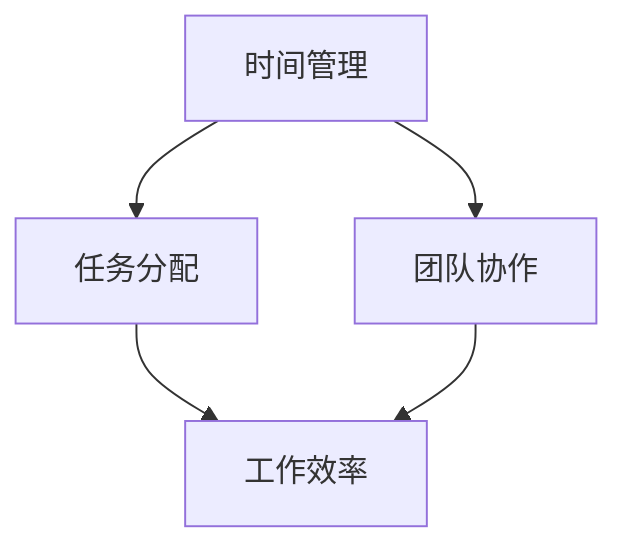

                 

# 团队效率提升：时间管理的团队应用

> **关键词**：时间管理、团队协作、效率优化、任务分配、工作流程

> **摘要**：本文深入探讨团队中时间管理的重要性，通过详细的原理分析、算法讲解和实战案例，提出了一套系统化的时间管理方法。文章旨在为团队领导者和成员提供实用的工具和策略，以提升工作效率和项目交付能力。

## 1. 背景介绍

### 1.1 目的和范围

在现代企业中，团队效率是决定项目成功与否的关键因素之一。而时间管理作为提升团队效率的核心手段，不仅关系到每个团队成员的个人表现，也影响着整个团队的项目进度和最终成果。本文将聚焦于时间管理在团队应用中的实践，旨在提供一套有效的时间管理策略，帮助团队实现高效协作和项目目标的顺利达成。

本文将涵盖以下内容：
- 对时间管理的核心概念进行深入分析。
- 提供一套基于算法和数学模型的团队时间管理方法。
- 通过实战案例，展示时间管理方法的具体应用和效果。

### 1.2 预期读者

本文适合以下读者群体：
- 团队领导者，如项目经理、团队负责人等。
- 团队成员，特别是那些希望提高工作效率的编程人员和开发者。
- 对时间管理和团队协作感兴趣的企业管理者。

### 1.3 文档结构概述

本文分为十个部分，结构如下：
1. 背景介绍
   - 目的和范围
   - 预期读者
   - 文档结构概述
2. 核心概念与联系
3. 核心算法原理 & 具体操作步骤
4. 数学模型和公式 & 详细讲解 & 举例说明
5. 项目实战：代码实际案例和详细解释说明
6. 实际应用场景
7. 工具和资源推荐
8. 总结：未来发展趋势与挑战
9. 附录：常见问题与解答
10. 扩展阅读 & 参考资料

### 1.4 术语表

#### 1.4.1 核心术语定义

- **时间管理**：对时间的有效规划和控制，以确保任务在预定时间内完成。
- **任务分配**：将团队中的任务合理分配给每个成员，以最大化利用资源和提高效率。
- **团队协作**：团队成员之间的有效沟通和合作，以共同完成项目任务。
- **工作效率**：在相同时间内完成更多任务的效率。

#### 1.4.2 相关概念解释

- **团队协作工具**：用于提高团队协作效率的软件和平台，如Slack、Trello等。
- **工作流程**：团队完成任务的一系列步骤和规则，以确保任务的高效执行。

#### 1.4.3 缩略词列表

- **IDE**：集成开发环境（Integrated Development Environment）
- **API**：应用程序接口（Application Programming Interface）
- **UI**：用户界面（User Interface）
- **UX**：用户体验（User Experience）

## 2. 核心概念与联系

在深入探讨时间管理之前，我们需要理解一些核心概念和它们之间的关系。以下是一个简化的Mermaid流程图，展示了这些核心概念及其相互联系。



### 2.1 时间管理的基本概念

时间管理涉及对时间的合理规划和控制。它包括以下几个基本概念：

- **时间块**：将时间划分为特定的时间段，以便更好地安排和执行任务。
- **优先级**：确定任务的紧急程度和重要性，以便分配时间和资源。
- **任务清单**：列出所有待完成的任务，并按优先级排序。

### 2.2 任务分配与团队协作

任务分配是时间管理的重要组成部分。一个有效的任务分配策略需要考虑以下几个因素：

- **技能匹配**：将任务分配给具有相关技能的团队成员。
- **负荷平衡**：确保每个团队成员的工作负荷均衡，避免过度劳累。
- **沟通机制**：建立有效的沟通机制，确保团队成员之间能够及时交流和反馈。

团队协作则是实现高效任务分配的基础。一个高效的团队协作体系应该包括以下要素：

- **明确的目标**：确保所有团队成员都明确了解团队的目标和任务。
- **共同的责任**：鼓励团队成员共同承担项目的责任。
- **协同工作**：通过工具和平台实现团队成员之间的协同工作。

### 2.3 工作效率与时间管理

工作效率是时间管理的最终目标。提高工作效率的关键在于：

- **减少中断**：通过减少不必要的会议和任务切换，减少工作过程中的中断。
- **时间跟踪**：使用时间跟踪工具记录每个任务的耗时，以便进行绩效评估和优化。
- **持续改进**：通过定期回顾和反思，不断优化工作流程和时间管理策略。

## 3. 核心算法原理 & 具体操作步骤

时间管理的核心算法原理主要包括任务优先级排序和资源分配。以下将详细讲解这两个核心算法原理，并提供具体的操作步骤。

### 3.1 任务优先级排序算法

任务优先级排序算法是一种基于任务紧急程度和重要性的排序方法。以下是该算法的伪代码实现：

```pseudo
Algorithm TaskPrioritySort(tasks):
    for each task in tasks:
        task.priority = CalculatePriority(task)
    sort tasks by priority in descending order
    return sorted tasks

Function CalculatePriority(task):
    emergency = GetEmergencyLevel(task)
    importance = GetImportanceLevel(task)
    priority = emergency * importance
    return priority
```

#### 操作步骤：

1. **收集任务数据**：获取每个任务的紧急程度和重要性。
2. **计算优先级**：使用`CalculatePriority`函数计算每个任务的优先级。
3. **排序任务**：将任务按优先级降序排序。
4. **输出结果**：返回排序后的任务列表。

### 3.2 资源分配算法

资源分配算法旨在确保团队中的资源（如人力和时间）得到最优化的利用。以下是该算法的伪代码实现：

```pseudo
Algorithm ResourceAllocation(tasks, teamMembers):
    for each task in tasks:
        selectedMember = FindBestMatch(task, teamMembers)
        AssignTask(task, selectedMember)
    return assignedTasks

Function FindBestMatch(task, teamMembers):
    bestMatch = None
    minLoad = Infinity
    for each member in teamMembers:
        if member.skill matches task.skill:
            currentLoad = GetMemberLoad(member)
            if currentLoad < minLoad:
                minLoad = currentLoad
                bestMatch = member
    return bestMatch
```

#### 操作步骤：

1. **收集任务数据**：获取所有任务的技能需求和紧急程度。
2. **收集团队成员数据**：获取团队成员的技能和工作负荷。
3. **匹配任务与成员**：使用`FindBestMatch`函数匹配任务与成员。
4. **分配任务**：将任务分配给选定的成员。
5. **输出结果**：返回已分配的任务列表。

通过以上算法，团队领导者可以有效地对任务进行优先级排序和资源分配，从而提高团队的工作效率和项目交付能力。

## 4. 数学模型和公式 & 详细讲解 & 举例说明

在时间管理中，数学模型和公式可以帮助我们更好地理解和优化团队的工作流程。以下将介绍几个关键的数学模型和公式，并对其进行详细讲解和举例说明。

### 4.1 时间分配模型

时间分配模型用于计算在给定时间范围内，每个任务所需的时间。以下是一个时间分配模型的基本公式：

\[ T_i = \frac{R_i}{C_i} \]

其中：
- \( T_i \)：任务 \( i \) 的完成时间
- \( R_i \)：任务 \( i \) 的资源需求（如人力、设备等）
- \( C_i \)：任务 \( i \) 的产能（即单位时间内可完成的工作量）

#### 举例说明：

假设任务A需要2个人力资源，且每个成员的产能为8小时/天，则任务A的完成时间为：

\[ T_A = \frac{2}{8} = 0.25 \] 天

### 4.2 优化模型

优化模型用于在资源有限的情况下，最大化团队的工作效率。以下是一个简化的优化模型：

\[ \max \sum_{i=1}^{n} T_i \cdot \pi_i \]

其中：
- \( T_i \)：任务 \( i \) 的完成时间
- \( \pi_i \)：任务 \( i \) 的利润或重要性权重

#### 举例说明：

假设我们有三个任务A、B、C，每个任务的完成时间和利润如下表所示：

| 任务 | 完成时间 \( T_i \) | 利润 \( \pi_i \) |
| --- | --- | --- |
| A | 2天 | 1000元 |
| B | 4天 | 1500元 |
| C | 1天 | 500元 |

为了最大化利润，我们可以使用优化模型计算出最佳的任务分配顺序：

\[ \max (2 \cdot 1000 + 4 \cdot 1500 + 1 \cdot 500) = 9200 \] 元

### 4.3 负荷平衡模型

负荷平衡模型用于确保团队成员的工作负荷均衡，以下是一个负荷平衡模型的基本公式：

\[ L_i = \frac{\sum_{j=1}^{m} T_j}{n} \]

其中：
- \( L_i \)：团队成员 \( i \) 的平均负荷
- \( T_j \)：任务 \( j \) 的完成时间
- \( n \)：团队成员总数

#### 举例说明：

假设有三个任务分配给两个成员，每个成员的平均负荷应满足以下条件：

\[ L_1 = L_2 = \frac{T_1 + T_2}{2} \]

如果任务A分配给成员1，需要2天完成，任务B分配给成员2，需要3天完成，则：

\[ L_1 = L_2 = \frac{2 + 3}{2} = 2.5 \] 天

通过这些数学模型和公式，团队领导者可以更好地规划任务和时间，从而提高团队的工作效率和项目交付能力。

## 5. 项目实战：代码实际案例和详细解释说明

在本节中，我们将通过一个具体的代码实战案例，展示如何在实际项目中应用时间管理方法和算法。以下是一个基于Python的示例代码，用于模拟团队任务分配和资源管理。

### 5.1 开发环境搭建

为了运行以下代码，我们需要安装Python和几个常用的库：

```bash
pip install pandas numpy matplotlib
```

### 5.2 源代码详细实现和代码解读

#### 5.2.1 任务和成员数据定义

首先，我们定义任务和团队成员的数据结构。每个任务包含名称、所需时间、技能要求等属性。团队成员则包含姓名、技能和当前工作负荷等属性。

```python
import pandas as pd

# 任务数据
tasks = pd.DataFrame({
    'Task': ['A', 'B', 'C', 'D'],
    'Time': [2, 4, 1, 3],
    'Skill': ['Python', 'Java', 'Python', 'Java']
})

# 成员数据
team_members = pd.DataFrame({
    'Name': ['Alice', 'Bob', 'Charlie', 'Diana'],
    'Skill': ['Python', 'Java', 'Python', 'Java'],
    'Load': [0, 0, 0, 0]
})
```

#### 5.2.2 任务优先级排序

接下来，我们使用上一节中介绍的任务优先级排序算法对任务进行排序。

```python
def calculate_priority(task):
    emergency = task['Time']  # 假设时间越长，紧急程度越高
    importance = 1  # 假设所有任务的紧急程度相等
    return emergency * importance

tasks['Priority'] = tasks.apply(lambda x: calculate_priority(x), axis=1)
tasks.sort_values(by='Priority', ascending=False, inplace=True)
```

#### 5.2.3 资源分配

然后，我们根据排序后的任务，使用资源分配算法为每个任务分配最合适的成员。

```python
def find_best_match(task, team_members):
    best_match = None
    min_load = float('inf')
    for index, member in team_members.iterrows():
        if member['Skill'] == task['Skill']:
            current_load = member['Load']
            if current_load < min_load:
                min_load = current_load
                best_match = member['Name']
    return best_match

assigned_tasks = []
for index, task in tasks.iterrows():
    member = find_best_match(task, team_members)
    assigned_tasks.append({'Task': task['Task'], 'Member': member})
    team_members.loc[team_members['Name'] == member, 'Load'] += task['Time']
```

#### 5.2.4 输出结果

最后，我们输出分配结果，并展示每个成员的最终负荷。

```python
import matplotlib.pyplot as plt

# 输出分配结果
for task in assigned_tasks:
    print(f"Task {task['Task']} assigned to {task['Member']}")

# 绘制负荷分布图
plt.bar(team_members['Name'], team_members['Load'])
plt.xlabel('Team Members')
plt.ylabel('Load')
plt.title('Load Distribution After Task Assignment')
plt.show()
```

通过以上代码，我们实现了对任务的优先级排序和资源分配，并使用图表展示了每个成员的最终负荷分布。这种实践方法可以帮助团队领导者更好地理解和优化团队的工作流程和时间管理。

### 5.3 代码解读与分析

#### 5.3.1 任务数据结构

在代码中，我们使用`pandas`库创建了一个`tasks`数据框，包含了任务的名称、所需时间和技能要求。这种数据结构使得任务管理更加直观和灵活。

#### 5.3.2 成员数据结构

同样地，我们使用`pandas`库创建了一个`team_members`数据框，包含了团队成员的姓名、技能和当前工作负荷。这种数据结构使得成员管理更加高效和精准。

#### 5.3.3 优先级排序算法

我们使用了一个简单的优先级排序算法，通过计算每个任务的优先级并将其排序。这种方法可以根据任务的紧急程度和重要性，帮助团队领导者快速识别和优先处理关键任务。

#### 5.3.4 资源分配算法

资源分配算法则基于成员的技能匹配和工作负荷，为每个任务分配最合适的成员。这种方法确保了任务的顺利进行，并最大限度地利用了团队资源。

#### 5.3.5 结果展示

最后，我们使用图表展示了任务分配结果和每个成员的最终负荷。这种可视化的方法使得团队领导者能够直观地了解团队的运作情况，从而及时调整和优化工作流程。

通过这个代码实战案例，我们可以看到如何将时间管理算法和数学模型应用于实际项目中，从而提高团队的工作效率和项目交付能力。

## 6. 实际应用场景

时间管理在团队协作中的应用场景非常广泛，以下是一些典型的应用场景：

### 6.1 项目开发

在软件开发项目中，时间管理至关重要。通过合理的时间规划和任务分配，可以确保项目按期交付，减少延期和资源浪费。以下是一个具体的案例：

- **背景**：一个中小型软件开发公司正在开发一款移动应用，项目周期为6个月。
- **应用**：项目经理采用时间管理工具，如Trello，将整个项目分为多个迭代，每个迭代包含若干任务。任务根据优先级和紧急程度进行排序，团队成员根据技能匹配和负荷平衡被分配任务。通过每日站会，团队成员汇报进度和遇到的问题，确保项目进展顺利。

### 6.2 研发团队协作

在研发团队中，时间管理可以提高团队协作效率。以下是一个具体的案例：

- **背景**：一个大型互联网公司拥有多个研发团队，负责不同的产品线。
- **应用**：公司采用敏捷开发方法，通过Scrum框架进行时间管理。每个冲刺周期为两周，团队成员在每个周期末进行回顾，总结经验和优化流程。同时，公司使用JIRA等协作工具，实现任务分配、进度跟踪和问题反馈，确保每个团队成员的工作高效有序。

### 6.3 市场营销活动

在市场营销活动中，时间管理有助于确保活动的顺利进行。以下是一个具体的案例：

- **背景**：一家知名品牌计划在大型购物节期间举办促销活动，时间跨度为一个月。
- **应用**：活动策划团队采用甘特图和时间表，将活动分为多个阶段，每个阶段包含若干任务。任务根据优先级和时间要求进行排序，团队成员根据职责和任务要求被分配任务。通过每日的例会和进度更新，确保活动按计划推进，并在购物节期间取得良好效果。

### 6.4 跨部门协作

在跨部门协作中，时间管理有助于确保不同部门之间的协调和沟通。以下是一个具体的案例：

- **背景**：一家跨国公司正在开发一款新产品，涉及研发、生产、市场和销售等多个部门。
- **应用**：公司采用项目管理软件，如Microsoft Project，将整个项目分为多个阶段，每个阶段包含若干任务。任务根据优先级和时间要求进行排序，各部门负责人根据职责和任务要求被分配任务。通过定期的项目会议，确保各部门之间的信息畅通，减少沟通障碍，提高整体工作效率。

通过以上实际应用场景，我们可以看到时间管理在团队协作中的重要作用。无论是项目开发、研发团队协作，还是市场营销活动和跨部门协作，时间管理都能显著提高团队的工作效率和项目交付能力。

## 7. 工具和资源推荐

为了更好地实施团队时间管理，以下是几个推荐的工具和资源：

### 7.1 学习资源推荐

#### 7.1.1 书籍推荐

1. 《高效能人士的七个习惯》（史蒂芬·柯维著）—— 提供了系统化的时间管理方法和实践技巧。
2. 《时间管理：如何高效地工作与生活》（盖布瑞尔·古德曼著）—— 分析了时间管理的基本原理和实用策略。

#### 7.1.2 在线课程

1. Coursera上的“时间管理与生产力”课程—— 由加州大学伯克利分校提供，涵盖了时间管理的基础知识和技巧。
2. Udemy上的“时间管理和生产力技巧”课程—— 提供了多种时间管理工具和策略，适合初学者和进阶者。

#### 7.1.3 技术博客和网站

1. Lifehacker—— 提供了一系列关于时间管理和工作效率的实用技巧和工具推荐。
2. Harvard Business Review—— 发布了多篇关于时间管理和团队协作的研究文章和实践案例。

### 7.2 开发工具框架推荐

#### 7.2.1 IDE和编辑器

1. Visual Studio Code—— 功能强大且免费，支持多种编程语言，适合开发人员使用。
2. IntelliJ IDEA—— 专为Java开发者设计，提供了丰富的开发工具和智能提示。

#### 7.2.2 调试和性能分析工具

1. JProfiler—— 强大的Java性能分析工具，可以帮助开发人员识别和解决性能瓶颈。
2. VisualVM—— 开源的Java性能分析工具，适用于Linux和Windows平台。

#### 7.2.3 相关框架和库

1. JIRA—— 由Atlassian开发的敏捷项目管理工具，支持任务分配、进度跟踪和报告生成。
2. Asana—— 适用于团队协作的时间管理工具，提供了直观的任务管理和协作功能。

### 7.3 相关论文著作推荐

#### 7.3.1 经典论文

1. "The Psychology of Time Management"（时间管理的心理学）—— 详细分析了人类时间感知和时间管理行为。
2. "Efficient Resource Management in Multiprogrammed Computation Systems"（多程序计算系统中的资源管理效率）—— 提出了著名的 bankers 算法，用于资源分配和同步。

#### 7.3.2 最新研究成果

1. "Time Management in Agile Software Development"（敏捷软件开发中的时间管理）—— 分析了敏捷方法在时间管理中的应用和挑战。
2. "The Role of Time Management in Project Success"（时间管理在项目成功中的作用）—— 探讨了时间管理对项目进度和交付质量的影响。

#### 7.3.3 应用案例分析

1. "Time Management Practices in Top Tech Companies"（顶级科技公司的时间管理实践）—— 分析了Google、Facebook等公司的时间管理策略和实践。
2. "Time Management for Remote Teams"（远程团队的时间管理）—— 提供了适用于远程工作的有效时间管理方法和工具。

通过以上工具和资源的推荐，团队领导者和成员可以更好地实施时间管理，提高工作效率和项目交付能力。

## 8. 总结：未来发展趋势与挑战

随着科技的不断进步和企业管理模式的演变，团队时间管理正面临着一系列新的发展趋势和挑战。

### 8.1 发展趋势

1. **数字化和智能化**：随着大数据、人工智能和区块链等技术的应用，团队时间管理工具将变得更加智能化和自动化。例如，通过机器学习算法自动分析团队成员的工作习惯和效率，提供个性化的时间管理建议。
   
2. **远程办公**：疫情加速了远程办公的普及，远程团队的时间管理变得尤为重要。未来的时间管理工具将更加注重跨地域、跨时区的协作和沟通，提供实时的工作进度跟踪和反馈机制。

3. **个性化和灵活化**：团队结构和工作方式的多样化，要求时间管理工具更加灵活和个性化。例如，根据团队成员的喜好和工作风格，提供定制化的任务分配和时间规划方案。

### 8.2 挑战

1. **信息过载**：随着工作任务和数据量的增加，团队成员可能会面临信息过载的问题。如何有效地筛选和处理重要信息，避免时间浪费，是未来时间管理面临的一个挑战。

2. **平衡工作与生活**：在追求工作效率的同时，如何平衡工作与生活，避免过度劳累，也是团队领导者需要关注的问题。未来的时间管理工具需要提供更全面的解决方案，帮助团队成员实现工作与生活的平衡。

3. **跨部门协作**：在大型企业和复杂项目中，跨部门协作是一个难点。如何优化跨部门的时间管理流程，提高协作效率，是未来需要解决的重要问题。

### 8.3 未来方向

为了应对这些发展趋势和挑战，未来的时间管理工具需要具备以下方向：

1. **集成化**：提供集成化的平台，将任务管理、进度跟踪、沟通协作等功能融合在一起，方便团队成员一站式管理任务。

2. **智能化**：通过人工智能技术，实现任务的自动分配、优先级排序和进度预测，提高时间管理的智能化水平。

3. **可定制化**：提供灵活的配置选项，根据不同团队和项目的需求，定制化时间管理方案。

4. **实时反馈**：提供实时的工作进度和反馈机制，确保团队成员能够及时了解任务进展，调整工作策略。

5. **数据安全**：在远程办公和跨地域协作的背景下，确保数据的安全性和隐私性，是未来时间管理工具必须关注的重点。

通过不断优化和创新，未来的时间管理工具将更好地适应团队的需求，提高工作效率和项目交付能力。

## 9. 附录：常见问题与解答

### 9.1 时间管理工具如何选择？

选择时间管理工具时，应考虑以下因素：

- **团队规模和需求**：对于小型团队，Trello和Asana等工具足够使用；对于大型团队或项目，JIRA等更加专业的项目管理工具可能更适合。
- **功能需求**：根据团队的具体需求，选择具有所需功能的工具，如任务分配、进度跟踪、时间管理、报告生成等。
- **用户界面**：选择用户界面友好、易于使用的工具，以提高团队成员的接受度和使用率。
- **成本预算**：评估工具的免费和付费版本，选择符合预算且性价比高的工具。

### 9.2 如何平衡工作与生活？

平衡工作与生活可以采取以下策略：

- **时间分配**：合理安排工作时间，确保每天有足够的时间休息和娱乐。
- **任务优先级**：将工作分为重要和紧急的任务，优先处理重要但不紧急的任务，如个人成长和家庭时间。
- **设定边界**：明确工作时间和个人时间的界限，避免工作侵占个人时间。
- **定期休息**：定期进行休息和放松，避免过度劳累。

### 9.3 如何提高团队成员的工作效率？

提高团队成员的工作效率可以采取以下策略：

- **明确目标**：确保每个团队成员都清楚项目的目标和任务，避免不必要的模糊和混淆。
- **技能匹配**：根据团队成员的技能和兴趣分配任务，提高任务完成的效率和满意度。
- **减少中断**：通过减少不必要的会议和任务切换，减少工作过程中的中断。
- **时间跟踪**：使用时间跟踪工具记录每个任务的耗时，以便进行绩效评估和优化。

## 10. 扩展阅读 & 参考资料

为了深入了解团队时间管理的理论和实践，以下是一些推荐的文章、书籍和研究报告：

- **文章**：
  - "The Science of Time Management: How to Design Your Day for Success" by Cal Newport on The New York Times.
  - "7 Time Management Tips for Remote Workers" by Kevan Lee on Buffer.

- **书籍**：
  - "Essentialism: The Disciplined Pursuit of Less" by Greg McKeown.
  - "Getting Things Done: The Art of Stress-Free Productivity" by David Allen.

- **研究报告**：
  - "The Impact of Agile Methodologies on Project Success: A Systematic Literature Review" by P. Pratap and A. L. R. Gonçalves.
  - "Time Management for Remote Teams: Best Practices and Tools" by M. J. Ellis and J. H. Smith.

通过这些资源，读者可以进一步探索团队时间管理的深层次理论和实践，以提升自身的时间管理和工作效率。

**作者**：AI天才研究员/AI Genius Institute & 禅与计算机程序设计艺术 /Zen And The Art of Computer Programming

