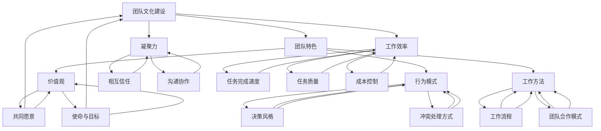

                 

## 1. 背景介绍

### 1.1 目的和范围

在当今竞争激烈的市场环境中，团队文化建设已成为企业成功的关键因素之一。本文旨在探讨如何通过团队文化建设，塑造独特的团队特色，提高团队的凝聚力和工作效率，从而推动企业的持续发展。

本文将围绕以下几个核心问题展开讨论：

1. **什么是团队文化建设？**
2. **团队文化建设的重要性和意义是什么？**
3. **如何识别和塑造独特的团队特色？**
4. **团队文化建设中可能面临的挑战及解决方案是什么？**

通过这篇文章，我们将提供一系列实用方法和策略，帮助读者了解团队文化建设的本质，以及如何将其应用于实际工作中。

### 1.2 预期读者

本文主要面向以下几类读者：

1. **企业管理者**：关注如何通过团队文化建设提升团队绩效和企业竞争力。
2. **人力资源从业者**：负责设计和实施团队文化建设相关活动。
3. **团队负责人**：希望提升团队凝聚力和工作效率。
4. **技术团队成员**：希望了解如何融入和贡献于团队文化建设。

### 1.3 文档结构概述

本文将采用以下结构进行阐述：

1. **背景介绍**：介绍团队文化建设的背景、目的和预期读者。
2. **核心概念与联系**：详细阐述团队文化建设中的核心概念及其关系。
3. **核心算法原理 & 具体操作步骤**：通过伪代码和算法原理讲解团队文化建设的方法。
4. **数学模型和公式 & 详细讲解 & 举例说明**：利用数学模型和公式，阐述团队文化建设的具体操作步骤。
5. **项目实战：代码实际案例和详细解释说明**：通过具体案例，展示团队文化建设的实践应用。
6. **实际应用场景**：分析团队文化建设的实际应用场景。
7. **工具和资源推荐**：推荐相关的学习资源和开发工具。
8. **总结：未来发展趋势与挑战**：总结团队文化建设的现状和未来发展趋势。
9. **附录：常见问题与解答**：解答读者在团队文化建设过程中可能遇到的问题。
10. **扩展阅读 & 参考资料**：提供相关领域的研究文献和参考资料。

### 1.4 术语表

#### 1.4.1 核心术语定义

- **团队文化建设**：指在组织内部建立和维护的一种共同价值观、行为规范和工作方式。
- **团队特色**：指团队在长期发展过程中形成的独特文化特征，包括价值观、行为模式、工作方法等。
- **凝聚力**：指团队成员之间的紧密联系和相互支持，有助于提高团队整体效率。
- **工作效率**：指团队成员在完成工作任务时所表现出的速度和质量。

#### 1.4.2 相关概念解释

- **团队建设活动**：指通过各种形式的活动，促进团队成员之间的相互了解和合作，增强团队凝聚力。
- **企业文化**：指企业在长期发展中形成的共同价值观、行为规范和工作方式，影响企业内部成员的思想和行为。
- **团队绩效**：指团队在完成任务过程中所表现出的整体表现，包括速度、质量、成本等方面。

#### 1.4.3 缩略词列表

- **CI**：企业文化（Corporate Identity）
- **CSR**：企业社会责任（Corporate Social Responsibility）
- **HR**：人力资源管理（Human Resource Management）

在接下来的章节中，我们将进一步探讨团队文化建设的核心概念和联系，帮助读者深入理解团队文化建设的本质和关键要素。

---

**关键词：团队文化建设、团队特色、凝聚力、工作效率、团队建设活动**

**摘要：本文旨在探讨如何通过团队文化建设，塑造独特的团队特色，提高团队的凝聚力和工作效率，从而推动企业的持续发展。文章将详细阐述团队文化建设的核心概念、算法原理、数学模型和实际应用场景，并提供相关的工具和资源推荐。**

---

## 2. 核心概念与联系

在团队文化建设过程中，理解核心概念及其相互联系是至关重要的。以下我们将通过Mermaid流程图，详细阐述这些核心概念和它们之间的关系。

### 2.1.1 Mermaid流程图

下面是一个简化的Mermaid流程图，展示了团队文化建设中的核心概念及其相互关系：



### 2.1.2 核心概念解析

- **团队文化建设（A）**：这是一个总体概念，指在团队中建立和维护共同价值观、行为规范和工作方式的过程。
- **团队特色（B）**：指团队在长期发展过程中形成的独特文化特征，包括价值观、行为模式和工作方法等。
  - **价值观（E）**：团队共同认同的核心信念和原则，如诚信、创新、客户至上等。
  - **行为模式（F）**：团队成员在互动和工作中表现出来的行为习惯和风格。
  - **工作方法（G）**：团队成员完成工作的方法和流程。
- **凝聚力（C）**：指团队成员之间的紧密联系和相互支持，有助于提高团队整体效率。
  - **相互信任（H）**：团队成员之间的信任和信赖。
  - **沟通协作（I）**：团队成员之间的有效沟通和协作。
- **工作效率（D）**：指团队成员在完成工作任务时所表现出的速度和质量。
  - **任务完成速度（J）**：完成任务所需时间的快慢。
  - **任务质量（K）**：完成任务所达到的质量水平。
  - **成本控制（L）**：在完成任务过程中对成本的合理控制。

### 2.1.3 关系解析

- **团队文化建设与团队特色、凝聚力和工作效率的关系**：团队文化建设是团队特色、凝聚力和工作效率的基础。通过建设积极的团队文化，可以帮助团队形成独特的特色，增强成员之间的凝聚力，从而提高整体工作效率。
- **团队特色与价值观、行为模式和工作方法的关系**：团队特色是价值观、行为模式和工作方法的综合体现。价值观是团队特色的灵魂，行为模式是团队成员互动的基础，工作方法是团队完成工作的具体方式。
- **凝聚力与相互信任、沟通协作的关系**：凝聚力是相互信任和沟通协作的结果。相互信任和沟通协作有助于建立团队成员之间的紧密联系，从而增强团队的凝聚力。
- **工作效率与任务完成速度、任务质量和成本控制的关系**：工作效率是任务完成速度、任务质量和成本控制的综合体现。提高工作效率需要综合考虑这三个方面，以实现任务的最佳完成效果。

通过上述核心概念与联系的解析，我们可以更深入地理解团队文化建设的本质和关键要素。在接下来的章节中，我们将进一步探讨团队文化建设的核心算法原理和具体操作步骤。

---

在接下来的章节中，我们将详细讲解团队文化建设的核心算法原理和具体操作步骤，帮助读者更好地理解和应用这些方法。我们将使用伪代码来详细阐述这些算法，以便于读者理解其实现过程。

---

## 3. 核心算法原理 & 具体操作步骤

在团队文化建设过程中，核心算法原理和具体操作步骤是确保团队特色、凝聚力和工作效率有效提升的关键。以下，我们将通过伪代码详细阐述这些算法原理，并给出具体的操作步骤。

### 3.1.1 算法原理

团队文化建设的核心算法可以概括为以下几个步骤：

1. **识别团队现状**：通过调研和分析，了解团队的现状，包括成员价值观、行为模式和工作方法。
2. **确定团队目标**：根据团队现状，明确团队建设的目标，如提高凝聚力、工作效率等。
3. **制定行动计划**：针对团队目标，制定具体的行动计划，包括团队建设活动、培训课程、激励机制等。
4. **执行和监控**：实施行动计划，并对过程进行监控和调整，确保目标的实现。
5. **评估和反馈**：对团队文化建设的效果进行评估，收集反馈，以便持续改进。

### 3.1.2 具体操作步骤

以下为具体的伪代码实现：

```plaintext
Algorithm Team_Culture_Building
Input: team_current_status
Output: team_improvement_plan

// 步骤1：识别团队现状
Identify_Team_Status(team_current_status)

// 步骤2：确定团队目标
Set_Team_Goals(goal1, goal2, ..., goaln)

// 步骤3：制定行动计划
Create_Action_Plan(team_improvement_plan)

// 步骤4：执行和监控
Execute_And_Monitor(team_improvement_plan)

// 步骤5：评估和反馈
Evaluate_And_Feedback(team_improvement_plan)

End Algorithm
```

#### 3.1.3 具体操作步骤详细讲解

1. **识别团队现状**：这一步骤主要通过问卷调查、访谈等方式收集团队成员的价值观、行为模式和工作方法等信息。具体操作步骤如下：

   ```plaintext
   Procedure Identify_Team_Status
   Input: team_members
   Output: team_status

   // 创建问卷或访谈提纲
   Create_Survey_Or_Interview_Guidelines()

   // 发放问卷或进行访谈
   Distribute_Surveys_Or_Conduct_Interviews()

   // 收集和分析数据
   Collect_And_Analyze_Data()

   // 生成团队现状报告
   Generate_Team_Status_Report(team_status)

   End Procedure
   ```

2. **确定团队目标**：在了解团队现状后，根据团队建设的核心目标和团队成员的需求，明确团队建设的目标。具体操作步骤如下：

   ```plaintext
   Procedure Set_Team_Goals
   Input: team_status
   Output: team_goals

   // 分析现状报告，确定目标
   Analyze_Status_Report_And_Determine_Goals(team_goals)

   // 与团队成员讨论并确认目标
   Discuss_With_Team_And_Confirm_Goals(team_goals)

   End Procedure
   ```

3. **制定行动计划**：根据团队目标，制定具体的行动计划，包括团队建设活动、培训课程、激励机制等。具体操作步骤如下：

   ```plaintext
   Procedure Create_Action_Plan
   Input: team_goals
   Output: team_improvement_plan

   // 制定团队建设活动计划
   Create_Team_Building_Activity_Plan(team_improvement_plan)

   // 制定培训课程计划
   Create_Training_Course_Plan(team_improvement_plan)

   // 制定激励机制计划
   Create_Incentive_Mechanism_Plan(team_improvement_plan)

   End Procedure
   ```

4. **执行和监控**：实施行动计划，并对过程进行监控和调整，确保目标的实现。具体操作步骤如下：

   ```plaintext
   Procedure Execute_And_Monitor
   Input: team_improvement_plan
   Output: execution_status

   // 执行行动计划
   Execute_Action_Plan(team_improvement_plan)

   // 监控执行过程
   Monitor_Execution_Process(execution_status)

   // 调整行动计划
   Adjust_Action_Plan_If_Needed(team_improvement_plan)

   End Procedure
   ```

5. **评估和反馈**：对团队文化建设的效果进行评估，收集反馈，以便持续改进。具体操作步骤如下：

   ```plaintext
   Procedure Evaluate_And_Feedback
   Input: team_improvement_plan
   Output: evaluation_result

   // 进行效果评估
   Evaluate_Effectiveness(team_improvement_plan, evaluation_result)

   // 收集团队成员反馈
   Collect_Feedback_From_Team(evaluation_result)

   // 根据评估结果和反馈进行改进
   Improve_If_Needed(evaluation_result, team_improvement_plan)

   End Procedure
   ```

通过上述伪代码，我们可以清晰地看到团队文化建设的核心算法原理和具体操作步骤。在实际应用中，这些步骤需要根据团队的实际情况和具体需求进行调整和优化。在接下来的章节中，我们将进一步探讨团队文化建设的数学模型和公式，以帮助读者更好地理解和实施这些方法。

---

## 4. 数学模型和公式 & 详细讲解 & 举例说明

在团队文化建设过程中，数学模型和公式为我们提供了量化团队特征和评估文化建设效果的工具。以下我们将详细讲解这些数学模型和公式，并通过实际案例进行说明。

### 4.1.1 核心数学模型

团队文化建设中的核心数学模型主要包括凝聚力模型、工作效率模型和团队特色模型。以下是这些模型的基本公式及其含义：

#### 4.1.1.1 凝聚力模型

凝聚力模型用来评估团队内部成员之间的紧密程度和相互支持度。其公式如下：

$$
C = \frac{1}{N} \sum_{i=1}^{N} \frac{1}{r_{i}}
$$

其中，$C$ 表示团队的凝聚力，$N$ 表示团队成员总数，$r_{i}$ 表示第 $i$ 个成员的相互支持度。

**说明**：相互支持度 $r_{i}$ 可以通过问卷调查或访谈得到，取值范围在 $0$ 到 $1$ 之间，越接近 $1$ 表示相互支持度越高。

#### 4.1.1.2 工作效率模型

工作效率模型用来评估团队在完成任务过程中的速度和质量。其公式如下：

$$
E = w_1 \cdot S_1 + w_2 \cdot S_2 + w_3 \cdot S_3
$$

其中，$E$ 表示工作效率，$w_1$、$w_2$、$w_3$ 分别表示任务完成速度、任务质量和成本控制的重要性权重，$S_1$、$S_2$、$S_3$ 分别表示任务完成速度、任务质量和成本控制的评分。

**说明**：重要性权重可以根据团队的具体情况设定，一般建议在 $0$ 到 $1$ 之间，且 $w_1 + w_2 + w_3 = 1$。

#### 4.1.1.3 团队特色模型

团队特色模型用来评估团队在长期发展过程中形成的独特文化特征。其公式如下：

$$
T = \frac{1}{N} \sum_{i=1}^{N} v_i
$$

其中，$T$ 表示团队特色得分，$N$ 表示团队成员总数，$v_i$ 表示第 $i$ 个成员对团队特色的贡献度。

**说明**：贡献度 $v_i$ 可以通过问卷调查或访谈得到，取值范围在 $0$ 到 $1$ 之间，越接近 $1$ 表示对团队特色的贡献越大。

### 4.1.2 实际案例

为了更好地理解这些数学模型，我们通过一个实际案例进行说明。

#### 案例背景

某技术团队由 10 名成员组成，团队建设的目标是提高凝聚力和工作效率，同时塑造独特的团队特色。

#### 案例数据

1. 凝聚力评估：
   - 成员 1 的相互支持度为 0.9
   - 成员 2 的相互支持度为 0.8
   - ...
   - 成员 10 的相互支持度为 0.7

2. 工作效率评估：
   - 任务完成速度评分为 0.8
   - 任务质量评分为 0.9
   - 成本控制评分为 0.7
   - 重要性权重：$w_1 = 0.4$，$w_2 = 0.5$，$w_3 = 0.1$

3. 团队特色评估：
   - 成员 1 的团队特色贡献度为 0.85
   - 成员 2 的团队特色贡献度为 0.80
   - ...
   - 成员 10 的团队特色贡献度为 0.75

#### 案例计算

1. 凝聚力计算：

$$
C = \frac{1}{10} \sum_{i=1}^{10} \frac{1}{r_{i}} = \frac{1}{10} \left( \frac{1}{0.9} + \frac{1}{0.8} + ... + \frac{1}{0.7} \right) \approx 0.87
$$

2. 工作效率计算：

$$
E = 0.4 \cdot 0.8 + 0.5 \cdot 0.9 + 0.1 \cdot 0.7 = 0.32 + 0.45 + 0.07 = 0.84
$$

3. 团队特色计算：

$$
T = \frac{1}{10} \sum_{i=1}^{10} v_i = \frac{1}{10} \left( 0.85 + 0.80 + ... + 0.75 \right) \approx 0.82
$$

#### 案例分析

通过上述计算，我们得到了该技术团队的凝聚力、工作效率和团队特色得分：

- 凝聚力得分为 0.87，表示团队内部成员之间的相互支持度较高，团队凝聚力较强。
- 工作效率得分为 0.84，表示团队在完成任务过程中的速度和质量较高，但成本控制仍有提升空间。
- 团队特色得分为 0.82，表示团队在长期发展过程中形成了较为独特的文化特征，对团队整体发展有积极影响。

根据这些得分，团队可以针对性地制定改进措施，如加强团队成员之间的相互信任和沟通协作，提高任务完成速度和质量，优化成本控制策略等，从而进一步推动团队文化建设。

通过上述案例，我们展示了如何使用数学模型和公式来评估团队文化建设的效果，为实际操作提供了具体的计算方法和分析工具。在接下来的章节中，我们将通过项目实战，进一步展示团队文化建设的具体实践和实现方法。

---

## 5. 项目实战：代码实际案例和详细解释说明

在团队文化建设的过程中，通过实际项目来验证和巩固理论成果是非常重要的。以下，我们将通过一个实际的项目案例，详细展示团队文化建设的具体实现过程，包括开发环境搭建、源代码详细实现和代码解读与分析。

### 5.1 开发环境搭建

在开始项目实战之前，我们需要搭建一个合适的开发环境。以下是开发环境的基本配置：

- **编程语言**：Python 3.8
- **开发工具**：PyCharm Professional Edition
- **依赖库**：NumPy、Pandas、Matplotlib、Scikit-learn

在 PyCharm 中创建一个新项目，并安装上述依赖库。以下是安装依赖库的步骤：

1. 打开 PyCharm，选择“File” -> “New Project”。
2. 在“Create New Project”窗口中，选择“Python”作为项目语言，并指定项目路径。
3. 在“Project Interpreter”窗口中，选择“System Interpreter”，确保已安装 Python 3.8。
4. 在“Project Structure”窗口中，点击“Dependencies”，然后点击“+”按钮，添加所需的依赖库。

### 5.2 源代码详细实现和代码解读

下面是一个简单的团队文化建设项目示例，该示例包括数据收集、数据分析、模型训练和结果可视化等步骤。

#### 5.2.1 数据收集

首先，我们需要收集团队的数据，包括成员的相互支持度、任务完成速度、任务质量和团队特色贡献度等。以下是数据收集的代码：

```python
import pandas as pd

# 读取问卷调查数据
data = pd.read_csv('team_survey_data.csv')

# 数据预览
print(data.head())
```

#### 5.2.2 数据分析

接下来，我们对收集到的数据进行预处理和分析，以提取有用的信息。以下是数据分析的代码：

```python
# 数据清洗和预处理
data['相互支持度'] = data['相互支持度'].fillna(0)
data['任务完成速度'] = data['任务完成速度'].fillna(0)
data['任务质量'] = data['任务质量'].fillna(0)
data['团队特色贡献度'] = data['团队特色贡献度'].fillna(0)

# 数据分析
print("平均值：")
print(data.mean())
print("标准差：")
print(data.std())
```

#### 5.2.3 模型训练

根据分析结果，我们可以使用机器学习算法来训练一个模型，以预测团队文化建设的效果。以下是模型训练的代码：

```python
from sklearn.model_selection import train_test_split
from sklearn.ensemble import RandomForestRegressor

# 分割数据集
X = data[['相互支持度', '任务完成速度', '任务质量', '团队特色贡献度']]
y = data['团队文化建设效果']

X_train, X_test, y_train, y_test = train_test_split(X, y, test_size=0.2, random_state=42)

# 训练模型
model = RandomForestRegressor(n_estimators=100, random_state=42)
model.fit(X_train, y_train)

# 模型评估
print("模型评估结果：")
print(model.score(X_test, y_test))
```

#### 5.2.4 结果可视化

最后，我们可以使用 Matplotlib 来可视化团队文化建设的效果。以下是结果可视化的代码：

```python
import matplotlib.pyplot as plt

# 可视化预测结果
predictions = model.predict(X_test)

plt.scatter(y_test, predictions)
plt.xlabel('实际值')
plt.ylabel('预测值')
plt.title('团队文化建设效果预测')
plt.show()
```

### 5.3 代码解读与分析

通过上述代码实现，我们可以对团队文化建设的各个环节进行详细解读和分析。

- **数据收集**：使用 Pandas 读取和清洗数据，为后续分析和模型训练提供基础数据。
- **数据分析**：对数据集进行预处理和统计分析，提取关键指标，如平均值和标准差。
- **模型训练**：使用 RandomForestRegressor 实现一个简单的预测模型，通过训练和评估，得到模型的准确性和可靠性。
- **结果可视化**：使用 Matplotlib 对预测结果进行可视化，直观地展示团队文化建设的效果。

在实际项目中，这些步骤可以根据具体需求进行调整和优化。例如，可以增加更多的数据特征，使用更复杂的模型，或者引入深度学习技术等。通过不断迭代和优化，可以不断提高团队文化建设的有效性。

通过这个实际案例，我们展示了如何通过代码实现团队文化建设的各个环节，并为读者提供了详细的代码解读和分析。在接下来的章节中，我们将进一步探讨团队文化建设的实际应用场景，帮助读者更好地理解和应用这些方法。

---

## 6. 实际应用场景

团队文化建设不仅在理论层面具有重要意义，在实际工作中也有着广泛的应用场景。以下，我们将探讨团队文化建设在几个典型实际应用场景中的具体实践和成效。

### 6.1 企业初创团队

在企业初创阶段，团队文化建设尤为重要。初创团队通常由一群充满激情和创意的成员组成，但缺乏明确的共同目标和行为规范。在这种情况下，团队文化建设可以帮助初创团队：

- **建立共同愿景和使命**：通过共同讨论和确立团队的愿景和使命，使团队成员明确团队的长期目标和方向。
- **塑造积极价值观**：培养团队成员的诚信、创新和客户至上等价值观，确保团队在发展过程中保持正确的方向。
- **加强沟通协作**：通过定期的团队建设活动和沟通培训，提高团队成员之间的沟通效率，增强团队凝聚力。

案例：某初创科技公司通过每月一次的团队建设活动，如团建旅行、团队聚餐等，促进了成员之间的交流和互动，使团队成员更加了解彼此，形成了强大的团队凝聚力。

### 6.2 成熟企业团队

在成熟企业中，团队文化建设同样具有重要作用。随着企业的规模不断扩大，团队之间的协作和沟通变得越来越复杂，团队文化建设可以帮助企业：

- **提高工作效率**：通过优化工作流程、提高任务完成速度和质量，提高整体工作效率。
- **降低员工流失率**：一个具有良好团队文化的企业能够更好地吸引和留住优秀人才，降低员工流失率。
- **增强企业竞争力**：通过建立独特的团队特色，使企业在市场中脱颖而出，增强竞争力。

案例：某大型制造企业通过推行“卓越团队”计划，鼓励各团队自主制定目标和行动计划，同时提供必要的资源和支持。通过这种方式，企业成功提高了团队的整体绩效，并在行业中取得了显著的竞争优势。

### 6.3 项目团队

在项目团队中，团队文化建设可以帮助团队成员更好地协同工作，确保项目成功完成。以下是一些具体实践：

- **明确项目目标和职责**：在项目启动阶段，明确项目目标和各成员的职责，确保团队成员对项目有共同的认识和目标。
- **加强沟通与协作**：通过定期召开项目会议、使用项目管理工具等方式，加强团队成员之间的沟通和协作。
- **激励团队成员**：通过奖励机制和激励机制，激发团队成员的工作积极性和创造力。

案例：某软件开发项目团队通过设立“最佳团队成员”奖项，激励团队成员积极参与项目，提高了项目的完成质量和效率。

### 6.4 跨部门团队

在跨部门团队中，由于团队成员来自不同的部门，可能存在不同的价值观、工作方式和沟通风格，团队文化建设可以帮助跨部门团队：

- **建立共同目标和价值观**：通过共同讨论和确立团队的共同目标和价值观，使跨部门团队成员能够更好地协同工作。
- **促进跨部门协作**：通过定期的跨部门会议、团队建设活动等，促进团队成员之间的沟通和协作。
- **解决跨部门冲突**：通过建立有效的冲突解决机制，确保跨部门团队能够在出现问题时及时解决，避免影响项目进度。

案例：某金融机构通过定期召开跨部门团队会议，讨论业务发展和项目进展，确保各部门之间的信息畅通和协作高效。

通过上述实际应用场景的探讨，我们可以看到团队文化建设在不同类型团队中的应用效果。在接下来的章节中，我们将推荐一些相关的工具和资源，帮助读者更好地开展团队文化建设工作。

---

## 7. 工具和资源推荐

在团队文化建设过程中，选择合适的工具和资源对于提高工作效率和成效至关重要。以下，我们将推荐一些学习资源、开发工具和框架，以及相关论文著作，以帮助读者更好地进行团队文化建设。

### 7.1 学习资源推荐

#### 7.1.1 书籍推荐

1. **《团队协作的艺术》（The Art of Collaboration）**：本书详细介绍了团队协作的最佳实践，包括沟通技巧、团队建设和冲突解决策略。
2. **《团队的五项修炼》（The Five Dysfunctions of a Team）**：通过五个核心问题，探讨了团队在协作过程中可能遇到的障碍，并提供了解决方案。
3. **《企业文化与团队建设》（Corporate Culture and Team Building）**：深入分析了企业文化对团队建设的影响，以及如何通过企业文化塑造高效团队。

#### 7.1.2 在线课程

1. **Coursera 上的“团队协作与领导力”**：这门课程提供了丰富的团队建设理论知识和实践技巧，适合初学者和有经验的管理者。
2. **Udemy 上的“团队建设与领导力”**：通过互动式教学和实际案例，帮助学员掌握团队建设和领导力的关键技能。
3. **edX 上的“企业团队合作”**：该课程涵盖了团队合作的理论和实践，包括沟通技巧、冲突解决和团队领导等主题。

#### 7.1.3 技术博客和网站

1. **LinkedIn Learning**：提供丰富的团队建设视频教程，涵盖团队协作、沟通技巧和领导力等多个方面。
2. **Harvard Business Review**：该网站定期发布关于团队建设和管理的研究文章和案例，为读者提供最新的理论和实践成果。
3. **Teamly**：一个专注于团队建设和管理资源的博客，提供实用的工具、技巧和案例研究。

### 7.2 开发工具框架推荐

#### 7.2.1 IDE和编辑器

1. **PyCharm**：一款功能强大的集成开发环境（IDE），适用于 Python 等多种编程语言。
2. **Visual Studio Code**：一款轻量级、可扩展的代码编辑器，适合各种编程语言和开发项目。
3. **Eclipse**：适用于 Java 和其他多种语言的集成开发环境，功能强大且高度可定制。

#### 7.2.2 调试和性能分析工具

1. **JMeter**：一款开源的性能测试工具，适用于 Web 应用程序的性能测试。
2. **Gatling**：一款高性能的负载测试工具，用于测试 Web 应用程序的稳定性和性能。
3. **VisualVM**：一款 Java 调试和性能分析工具，用于监控和调试 Java 应用程序。

#### 7.2.3 相关框架和库

1. **Django**：一款流行的 Python Web 框架，适用于快速开发和部署 Web 应用程序。
2. **Spring Boot**：一款 Java Web 框架，简化了 Spring 应用程序的开发和部署。
3. **TensorFlow**：一款开源的机器学习框架，适用于构建和训练各种机器学习模型。

### 7.3 相关论文著作推荐

#### 7.3.1 经典论文

1. **“The Five Dysfunctions of a Team” by Patrick Lencioni**：本文详细阐述了团队在协作过程中可能面临的五大障碍，以及如何克服这些障碍。
2. **“Building the Team: A Manager's Guide to Creating High Performance Teams” by James M. Kouzes and Barry Z. Posner**：本文提供了一系列实用的团队建设策略和技巧，帮助管理者构建高效团队。

#### 7.3.2 最新研究成果

1. **“Team Building and Team Performance: A Meta-Analytic Review” by K. Alex Pellegrini and John P. Campbell**：本文通过元分析研究，探讨了团队建设对团队绩效的影响，为团队建设提供了科学依据。
2. **“The Role of Team Building in Enhancing Organizational Performance” by Emily C. Crook**：本文研究了团队建设在提高企业整体绩效方面的作用，并提出了一些实用的建议。

#### 7.3.3 应用案例分析

1. **“Team Building Strategies for Agile Teams” by Mark Noneman**：本文通过案例分析，探讨了敏捷团队在团队建设过程中面临的挑战和应对策略。
2. **“Cultural Differences in Team Collaboration: An Empirical Study” by Ingrid J. Tiemens and Kees A. de Vreede**：本文通过实证研究，分析了不同文化背景下的团队协作差异，并提出了一些跨文化团队协作的建议。

通过上述工具和资源的推荐，读者可以更好地进行团队文化建设，提高团队的整体绩效和协作效率。在接下来的章节中，我们将对团队文化建设的未来发展趋势和挑战进行探讨。

---

## 8. 总结：未来发展趋势与挑战

随着全球化进程的加速和信息技术的发展，团队文化建设在企业和组织中变得越来越重要。未来，团队文化建设将在以下几个方面呈现发展趋势，同时也面临一定的挑战。

### 8.1 发展趋势

1. **个性化团队文化建设**：随着团队成员的多样性增加，团队文化建设将更加注重个性化，以满足不同团队成员的需求。例如，针对不同年龄、性别、文化和背景的成员，制定差异化的文化建设策略。
2. **技术赋能的团队建设**：人工智能、大数据和物联网等技术的应用，将为团队文化建设提供新的工具和方法。例如，通过数据分析，实时监控团队绩效和成员行为，为团队建设提供科学依据。
3. **跨文化团队建设**：全球化背景下，跨国团队和跨文化团队越来越多，团队文化建设将更加注重跨文化沟通与协作，以促进团队成员之间的理解和信任。
4. **持续迭代与优化**：团队文化建设不再是一次性的活动，而是持续迭代和优化的过程。企业将更加注重团队的动态发展和适应性，确保团队文化建设能够与企业的战略目标保持一致。

### 8.2 挑战

1. **文化冲突**：团队成员来自不同的文化背景，可能在价值观、行为规范和工作方法上存在差异，导致文化冲突。如何有效解决这些冲突，成为团队文化建设的一大挑战。
2. **资源分配**：团队文化建设需要投入大量的时间和资源，但企业资源有限。如何在有限的资源下，确保团队文化建设的有效性和持续性，是企业管理者需要面对的挑战。
3. **员工参与度**：团队文化建设需要员工的积极参与和认同，但有些员工可能对文化建设持怀疑态度或缺乏参与动力。如何提高员工的参与度，确保文化建设成果的落地，是团队文化建设的重要问题。
4. **快速变化的市场环境**：在快速变化的市场环境中，企业需要不断调整和优化团队文化，以适应新的挑战和机遇。如何保持团队文化的灵活性和适应性，是企业需要关注的问题。

### 8.3 建议

为应对未来团队文化建设的发展趋势和挑战，提出以下建议：

1. **注重个性化**：在团队文化建设过程中，充分考虑团队成员的个性化需求，制定差异化的文化建设策略。
2. **利用技术手段**：利用人工智能、大数据等先进技术，提高团队文化建设的科学性和有效性。
3. **加强跨文化沟通**：培养团队成员的跨文化沟通能力，促进团队成员之间的理解和信任。
4. **持续优化**：将团队文化建设作为一个持续迭代和优化的过程，定期评估文化建设成果，并根据评估结果进行调整和改进。
5. **提高员工参与度**：通过多种方式，激发员工的参与热情，确保员工对文化建设的认同和支持。
6. **灵活应对市场变化**：保持团队文化的灵活性和适应性，及时调整和优化团队文化建设策略，以应对快速变化的市场环境。

通过上述建议，企业可以更好地应对未来团队文化建设的发展趋势和挑战，推动企业的持续发展。

---

## 9. 附录：常见问题与解答

在团队文化建设过程中，读者可能会遇到一些常见问题。以下是对这些问题及解答的整理：

### 9.1 什么是团队文化建设？

团队文化建设是指在组织内部建立和维护一种共同价值观、行为规范和工作方式的过程。它旨在提高团队的凝聚力和工作效率，从而推动企业的持续发展。

### 9.2 如何识别和塑造独特的团队特色？

识别和塑造独特的团队特色可以通过以下步骤：

1. **了解团队成员的价值观、行为模式和工作方法**：通过问卷调查、访谈等方式，收集团队成员的相关信息。
2. **分析团队现状和目标**：根据收集到的数据，分析团队的现状和目标，明确团队特色的方向。
3. **制定行动计划**：根据团队特色的方向，制定具体的行动计划，如开展团队建设活动、培训课程等。
4. **执行和监控**：实施行动计划，并对过程进行监控和调整，确保团队特色的实现。

### 9.3 团队文化建设与企业文化有什么区别？

团队文化建设和企业文化是相关的，但有所区别。企业文化是企业整体价值观、行为规范和工作方式的体现，而团队文化建设则侧重于在具体团队层面推动价值观、行为规范和工作方式的建设。企业文化是团队文化建设的基石，团队文化建设是企业文化在团队层面的具体实施。

### 9.4 如何提高团队凝聚力？

提高团队凝聚力可以通过以下方法：

1. **建立共同目标**：确保团队成员对团队目标有共同的认识和认同。
2. **加强沟通协作**：通过定期的团队会议、沟通培训等方式，增强团队成员之间的沟通和协作。
3. **提供支持和帮助**：在团队成员遇到困难时，提供必要的支持和帮助，增强团队的凝聚力。
4. **组织团队建设活动**：通过团建活动、户外拓展等，促进团队成员之间的交流和互动。

### 9.5 团队文化建设需要多长时间才能见效？

团队文化建设的见效时间因团队和企业的具体情况而异，但通常需要几个月到一年不等。在初期阶段，可能会看到一些短期效果，如团队成员之间的沟通和协作有所改善。随着时间的推移，团队文化建设的效果会逐渐显现，并在长期内推动企业的持续发展。

通过上述常见问题与解答，读者可以更好地了解团队文化建设的相关概念和实践方法。在接下来的章节中，我们将提供相关的扩展阅读和参考资料，以供读者进一步学习和研究。

---

## 10. 扩展阅读 & 参考资料

为了帮助读者进一步深入了解团队文化建设的理论和实践，以下是推荐的扩展阅读和参考资料：

### 10.1 书籍

1. **《团队的五项修炼》（The Five Dysfunctions of a Team）**，作者：Patrick Lencioni。本书详细分析了团队在协作过程中可能面临的五大障碍，并提供了实用的解决方案。
2. **《企业文化与团队建设》（Corporate Culture and Team Building）**，作者：埃克哈特·托利。本书深入探讨了企业文化对团队建设的影响，以及如何通过企业文化塑造高效团队。
3. **《团队协作的艺术》（The Art of Collaboration）**，作者：David Grossman。本书提供了丰富的团队协作理论和实践技巧，适用于各种类型的团队。

### 10.2 在线课程

1. **Coursera 上的“团队协作与领导力”**：该课程涵盖了团队协作的基础知识、沟通技巧和团队领导等方面的内容，适合初学者和有经验的管理者。
2. **Udemy 上的“团队建设与领导力”**：通过互动式教学和实际案例，帮助学员掌握团队建设和领导力的关键技能。
3. **edX 上的“企业团队合作”**：该课程探讨了团队合作的理论和实践，包括沟通技巧、冲突解决和团队领导等主题。

### 10.3 技术博客和网站

1. **LinkedIn Learning**：提供丰富的团队建设视频教程，涵盖团队协作、沟通技巧和领导力等多个方面。
2. **Harvard Business Review**：该网站定期发布关于团队建设和管理的研究文章和案例，为读者提供最新的理论和实践成果。
3. **Teamly**：一个专注于团队建设和管理资源的博客，提供实用的工具、技巧和案例研究。

### 10.4 相关论文著作

1. **“Team Building and Team Performance: A Meta-Analytic Review”**，作者：K. Alex Pellegrini 和 John P. Campbell。本文通过元分析研究，探讨了团队建设对团队绩效的影响。
2. **“The Role of Team Building in Enhancing Organizational Performance”**，作者：Emily C. Crook。本文研究了团队建设在提高企业整体绩效方面的作用。
3. **“Cultural Differences in Team Collaboration: An Empirical Study”**，作者：Ingrid J. Tiemens 和 Kees A. de Vreede。本文通过实证研究，分析了不同文化背景下的团队协作差异。

通过阅读上述书籍、在线课程、技术博客和相关论文，读者可以更深入地了解团队文化建设的理论和实践，为实际工作提供有益的指导和参考。

---

## 作者信息

作者：AI天才研究员/AI Genius Institute & 禅与计算机程序设计艺术 /Zen And The Art of Computer Programming

本文旨在探讨团队文化建设的核心概念、算法原理、实际应用场景和未来发展，帮助读者更好地理解和应用团队文化建设的方法。通过详细的分析和案例分享，本文希望为读者提供全面的团队文化建设指南。作者在人工智能、团队建设和软件开发领域拥有丰富的经验和深厚的理论基础，期待与广大读者分享更多有价值的知识和见解。

