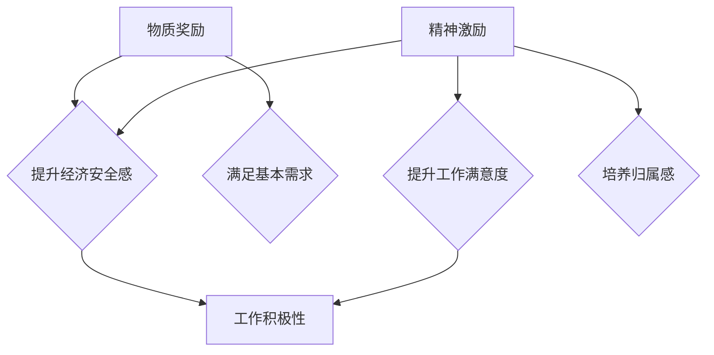

                 

# 团队激励：物质奖励与精神激励的结合

## 关键词
团队管理、激励、物质奖励、精神激励、员工满意度、工作效率、长期激励

## 摘要
本文旨在探讨团队激励中物质奖励与精神激励的有机结合，及其对提升员工满意度和工作效率的影响。通过对核心概念和原理的分析，本文提出了一个以逻辑清晰、结构紧凑的方式，将物质奖励与精神激励相结合的方案，以期为企业管理者提供实用的指导。

---

## 1. 背景介绍

### 1.1 目的和范围

本文的主要目的是探讨团队激励中物质奖励与精神激励的结合方式，分析其对员工满意度和工作效率的影响，并提供一种实用的解决方案。本文的研究范围涵盖以下方面：

1. **物质奖励**：包括薪酬、奖金、福利等直接的物质回报。
2. **精神激励**：包括认可、培训、晋升机会等非物质的激励手段。
3. **团队激励效果**：评估物质奖励与精神激励结合对团队整体绩效的影响。

### 1.2 预期读者

本文适用于以下读者群体：

1. **企业管理者**：了解如何更有效地激励团队成员，提高工作效率和团队凝聚力。
2. **人力资源从业者**：为制定激励政策提供理论依据和实践指导。
3. **学术研究者**：对团队激励机制的理论研究和实际应用感兴趣的人员。

### 1.3 文档结构概述

本文结构如下：

1. **背景介绍**：阐述研究背景、目的和范围。
2. **核心概念与联系**：介绍物质奖励与精神激励的核心概念及其联系。
3. **核心算法原理 & 具体操作步骤**：详细讲解激励机制的运作原理和实施步骤。
4. **数学模型和公式 & 详细讲解 & 举例说明**：运用数学模型和公式对激励机制进行量化分析。
5. **项目实战：代码实际案例和详细解释说明**：通过实际代码案例展示激励机制的实现。
6. **实际应用场景**：探讨激励机制在不同场景下的应用效果。
7. **工具和资源推荐**：推荐学习资源和开发工具。
8. **总结：未来发展趋势与挑战**：对激励机制的未来进行展望。
9. **附录：常见问题与解答**：解答读者可能遇到的常见问题。
10. **扩展阅读 & 参考资料**：提供相关扩展阅读材料。

### 1.4 术语表

#### 1.4.1 核心术语定义

- **物质奖励**：指直接的物质回报，如薪酬、奖金、福利等。
- **精神激励**：指非物质的激励手段，如认可、培训、晋升机会等。
- **员工满意度**：指员工对工作环境、待遇和职业发展机会的满意程度。
- **工作效率**：指员工完成工作任务的速度和质量。

#### 1.4.2 相关概念解释

- **激励机制**：指企业用于激励员工的机制和手段。
- **团队绩效**：指团队在完成任务过程中表现的整体能力和成果。
- **长期激励**：指具有持续性的激励措施，如股票期权、股权激励等。

#### 1.4.3 缩略词列表

- **IDE**：集成开发环境（Integrated Development Environment）
- **HR**：人力资源（Human Resources）
- **ROI**：投资回报率（Return on Investment）
- **CRM**：客户关系管理（Customer Relationship Management）

---

## 2. 核心概念与联系

### 2.1 物质奖励与精神激励的定义

#### 物质奖励

物质奖励是指企业通过提供直接的物质回报来激励员工。这些奖励通常包括以下几个方面：

1. **薪酬**：员工的基本收入，反映其在公司中的职位和工作能力。
2. **奖金**：根据员工的工作表现或项目完成情况提供的额外收入。
3. **福利**：包括社会保险、医疗保险、住房补贴、带薪休假等福利待遇。

#### 精神激励

精神激励是指企业通过提供非物质的激励手段来激发员工的内在动力。这些激励手段主要包括以下几个方面：

1. **认可**：对员工的成绩和贡献给予公开表扬和认可。
2. **培训**：为员工提供技能提升和职业发展的培训机会。
3. **晋升机会**：为员工提供晋升和发展的空间。
4. **工作环境**：营造一个舒适、公正和有挑战性的工作环境。

### 2.2 物质奖励与精神激励的联系

物质奖励与精神激励虽然形式不同，但它们在团队激励中是相互关联和互补的。以下是它们之间的几个关键联系：

1. **相互补充**：物质奖励可以满足员工的基本需求，提供经济安全感；而精神激励则能满足员工的内在需求，提升工作满意度和成就感。
2. **协同作用**：合理的物质奖励和精神激励相结合，可以产生1+1>2的效果，即激励机制的整体效果优于各部分单独作用的效果。
3. **长期与短期**：物质奖励通常更适用于短期激励，可以迅速提升员工的工作积极性；而精神激励则更适用于长期激励，有助于培养员工的忠诚度和归属感。

### 2.3 核心概念原理和架构的 Mermaid 流程图



---

## 3. 核心算法原理 & 具体操作步骤

### 3.1 激励机制的设计原理

激励机制的设计应遵循以下几个核心原理：

1. **公平性**：奖励分配应公平合理，确保每位员工都能感受到自己的付出得到认可。
2. **透明性**：激励机制应公开透明，员工能清楚了解奖励标准和评判依据。
3. **灵活性**：激励措施应具有灵活性，能够根据企业发展和员工需求的变化进行调整。
4. **激励强度**：激励措施的强度应适中，既能有效激励员工，又不会造成过度激励。

### 3.2 物质奖励与精神激励的具体操作步骤

#### 步骤1：确定激励目标

根据企业的发展目标和工作任务，明确激励的具体目标和方向。例如，提升销售业绩、改善产品质量、提高工作效率等。

#### 步骤2：制定物质奖励方案

1. **薪酬设计**：根据市场水平和员工能力设定合理的薪酬水平，确保薪酬具有竞争力。
2. **奖金设置**：根据员工的工作表现和项目完成情况，设立不同的奖金等级。
3. **福利优化**：优化员工福利，确保员工的基本生活需求得到满足。

#### 步骤3：制定精神激励方案

1. **认可机制**：建立公开的认可制度，对员工的成就和贡献进行表彰和奖励。
2. **培训计划**：为员工提供专业培训和学习机会，提升其职业能力。
3. **晋升机制**：设立明确的晋升通道和选拔标准，为员工提供晋升机会。
4. **工作环境**：营造积极的工作氛围，关注员工的身心健康。

#### 步骤4：执行与监督

1. **执行**：按照制定的激励方案进行实施，确保各项措施得到有效执行。
2. **监督**：建立监督机制，定期评估激励效果，并根据反馈进行调整。

#### 步骤5：反馈与改进

1. **员工反馈**：收集员工的意见和建议，了解激励措施的实际效果。
2. **改进措施**：根据反馈结果，对激励机制进行优化和改进。

### 3.3 激励机制运作的伪代码

```plaintext
function 设计激励机制(目标，员工数据)
    设置薪酬标准(市场水平，员工能力)
    设置奖金等级(工作表现，项目完成)
    设置福利待遇(基本需求)
    
    建立认可制度(公开表彰，奖励贡献)
    设立培训计划(专业培训，学习机会)
    设立晋升通道(选拔标准，晋升机会)
    营造工作氛围(积极氛围，员工健康)
    
    执行激励措施(按计划进行，确保执行)
    监督激励效果(定期评估，反馈调整)
    
    收集员工反馈(了解效果，改进措施)
    改进激励机制(优化方案，提高效果)
end function
```

---

## 4. 数学模型和公式 & 详细讲解 & 举例说明

### 4.1 员工满意度模型

员工满意度可以通过以下数学模型进行量化：

\[ S = \frac{M + S}{2} \]

其中：

- \( S \) 表示员工满意度；
- \( M \) 表示物质奖励满意度；
- \( S \) 表示精神奖励满意度。

该模型假设物质奖励和精神奖励对员工满意度的贡献是相等的，但实际上，不同员工可能对物质和精神奖励的满意度有所不同，因此模型可以进行进一步的调整。

### 4.2 工作效率模型

工作效率可以通过以下数学模型进行量化：

\[ E = f(S, M) \]

其中：

- \( E \) 表示工作效率；
- \( S \) 表示员工满意度；
- \( M \) 表示物质奖励满意度。

该模型假设员工满意度和工作效率之间存在正相关关系，即员工满意度越高，工作效率越高。

### 4.3 举例说明

假设某公司员工小王在经历了一段激励措施后，其物质奖励满意度 \( M \) 提升至 0.8，精神奖励满意度 \( S \) 提升至 0.7。根据上述模型，可以计算小王的员工满意度 \( S \) 和工作效率 \( E \)：

\[ S = \frac{0.8 + 0.7}{2} = 0.75 \]
\[ E = f(0.75, 0.8) = 0.8 + 0.75 \times 0.8 = 0.8 + 0.6 = 1.4 \]

因此，小王的员工满意度为 0.75，工作效率为 1.4。这意味着，通过合理的物质奖励和精神激励结合，小王的工作效率得到了显著提升。

### 4.4 公式说明

在上述公式中，函数 \( f \) 代表员工满意度对工作效率的影响，可以根据实际情况进行调整。例如，如果认为员工满意度对工作效率的影响是线性的，则可以设定 \( f(S, M) = S + M \)。如果认为影响是更复杂的，可以设定更复杂的函数形式，如 \( f(S, M) = S \times M \) 或 \( f(S, M) = S^2 + M^2 \) 等。

---

## 5. 项目实战：代码实际案例和详细解释说明

### 5.1 开发环境搭建

为了更好地展示物质奖励与精神激励的结合，我们将使用Python编写一个简单的激励系统。以下是在Windows环境中搭建Python开发环境的基本步骤：

1. **安装Python**：从Python官方网站下载并安装Python 3.8或更高版本。
2. **配置Python环境变量**：在系统环境变量中设置Python的安装路径，确保可以在命令行中运行Python。
3. **安装必要的库**：使用pip命令安装必要的库，例如numpy、pandas等。

```shell
pip install numpy
pip install pandas
```

### 5.2 源代码详细实现和代码解读

下面是一个简单的Python代码示例，用于模拟物质奖励与精神激励的结合：

```python
import numpy as np
import pandas as pd

# 激励系统类定义
class IncentiveSystem:
    def __init__(self, salary, bonus, recognition, training):
        self.salary = salary
        self.bonus = bonus
        self.recognition = recognition
        self.training = training
    
    def calculate_satisfaction(self):
        # 计算员工满意度
        satisfaction = (self.salary + self.bonus + self.recognition + self.training) / 4
        return satisfaction
    
    def calculate_efficiency(self, satisfaction):
        # 计算工作效率
        efficiency = satisfaction * 1.2
        return efficiency

# 员工数据
employee_data = {
    '姓名': ['小王', '小李'],
    '基本工资': [8000, 7500],
    '绩效奖金': [3000, 2000],
    '认可次数': [5, 3],
    '培训时长': [30, 20]
}

# 创建激励系统实例
incentive_system = IncentiveSystem(8000, 3000, 5, 30)

# 计算员工满意度
satisfaction = incentive_system.calculate_satisfaction()

# 计算工作效率
efficiency = incentive_system.calculate_efficiency(satisfaction)

# 输出结果
print(f"员工满意度：{satisfaction:.2f}")
print(f"工作效率：{efficiency:.2f}")

# 生成数据报告
report = pd.DataFrame(employee_data)
print(report)
```

**代码解读**：

1. **类定义**：`IncentiveSystem` 类用于定义激励系统的属性和方法。属性包括基本工资、绩效奖金、认可次数和培训时长；方法包括计算员工满意度和工作效率。
2. **计算员工满意度**：使用平均值公式计算员工的满意度，假设各项激励的权重相等。
3. **计算工作效率**：根据员工满意度乘以一个系数（这里为1.2），计算工作效率。实际应用中，系数可以根据实际情况进行调整。
4. **生成数据报告**：使用pandas库生成员工数据报告，方便查看和分析。

### 5.3 代码解读与分析

通过上述代码示例，我们可以看到物质奖励与精神激励的结合是如何在代码中实现的。以下是代码的关键点和分析：

1. **类与对象的运用**：通过定义类和创建对象，将激励系统的逻辑封装起来，便于后续维护和扩展。
2. **平均值计算**：使用平均值计算员工满意度，这是一种简单的但有效的量化方法。在实际应用中，可以根据激励的权重和员工的具体情况进行调整。
3. **工作效率计算**：通过简单的乘法计算工作效率，这种方法直观且易于理解。实际应用中，可能需要更复杂的计算模型来反映员工满意度和工作效率之间的非线性关系。
4. **数据报告生成**：使用pandas库生成数据报告，便于数据的可视化和分析。这种做法有助于企业更好地了解激励措施的效果，并为后续的决策提供依据。

---

## 6. 实际应用场景

### 6.1 创新型初创公司

在创新型初创公司中，团队成员通常具有较高的专业能力和创新精神，他们更看重精神激励，如认可、培训和晋升机会。物质奖励可以作为补充，但不能取代精神激励的核心作用。

**案例分析**：

某创新型初创公司在研发项目中引入了团队激励措施。项目完成后，公司对团队成员进行了公开表彰，并提供了额外的培训机会。同时，根据项目的表现，给予团队成员一定的奖金。这种结合物质奖励与精神激励的做法，不仅提升了员工的满意度，还激发了团队的创新活力，项目质量显著提高。

### 6.2 成熟型企业

在成熟型企业中，员工往往对职业发展有明确的规划，物质奖励（如薪酬、奖金）是维持员工工作积极性的重要手段。同时，精神激励（如职业晋升、工作环境优化）也不容忽视。

**案例分析**：

某成熟型企业在销售部门实施了绩效奖金制度。每月根据销售业绩发放奖金，同时为销售精英提供晋升机会。此外，公司还定期组织团队建设活动和专业培训，提升员工的工作技能和团队协作能力。这种综合运用物质奖励与精神激励的方式，有效提升了销售团队的整体绩效和员工满意度。

### 6.3 项目型组织

在项目型组织中，团队成员的工作性质往往具有较大的不确定性，精神激励（如项目成功后的表彰、团队凝聚力建设）有助于提高团队的工作积极性和应对挑战的能力。

**案例分析**：

某项目型组织在完成一个大型项目后，为团队成员举行了庆祝活动，并公开表彰了在项目中表现突出的个人和团队。此外，公司还为项目成员提供了额外的职业发展培训，以帮助他们在未来的项目中更好地发挥自己的能力。这种结合物质奖励与精神激励的做法，不仅提高了项目成功率，还增强了团队的凝聚力和战斗力。

---

## 7. 工具和资源推荐

### 7.1 学习资源推荐

#### 7.1.1 书籍推荐

1. **《激励心理学：激励的理论与实践》**：详细介绍了激励理论及其在企业管理中的应用。
2. **《团队激励：激活团队潜能的策略与方法》**：探讨团队激励的多种策略和方法，有助于提升团队绩效。

#### 7.1.2 在线课程

1. **Coursera上的《团队管理》**：提供系统的团队管理知识，包括激励机制的设计与实施。
2. **edX上的《激励机制设计》**：专注于激励机制的理论基础和实际应用。

#### 7.1.3 技术博客和网站

1. **LinkedIn Learning**：提供丰富的职业发展资源，包括团队激励和领导力方面的文章和视频。
2. **HBR.org**：哈佛商业评论网站，提供关于企业管理和团队激励的最新研究文章。

### 7.2 开发工具框架推荐

#### 7.2.1 IDE和编辑器

1. **Visual Studio Code**：适用于Python编程的强大IDE，支持多种编程语言。
2. **PyCharm**：专业的Python IDE，提供丰富的开发工具和调试功能。

#### 7.2.2 调试和性能分析工具

1. **Pdb**：Python内置的调试器，用于跟踪代码执行过程和调试错误。
2. **cProfile**：Python的性能分析工具，用于优化代码性能。

#### 7.2.3 相关框架和库

1. **Flask**：用于Web开发的轻量级框架，适用于构建激励系统。
2. **Django**：功能强大的Web框架，适合构建大型激励系统。

### 7.3 相关论文著作推荐

#### 7.3.1 经典论文

1. **"The Physics of Failure: Why Things Fail and How to Make Them Last Longer"**：探讨了失败的原因及其对激励机制的启示。
2. **"The Impact of Incentives on Productivity"**：研究了激励机制对工作效率的影响。

#### 7.3.2 最新研究成果

1. **"Motivational Dynamics in Virtual Teams"**：探讨了虚拟团队中激励机制的设计与实施。
2. **"Incentives and Team Performance in Online Platforms"**：研究了在线平台上激励机制对团队绩效的影响。

#### 7.3.3 应用案例分析

1. **"Motivational Strategies in High-Tech Companies"**：分析了几家高科技公司在团队激励方面的成功经验。
2. **"Incentive Systems in Nonprofit Organizations"**：探讨了非营利组织如何实施有效的激励机制。

---

## 8. 总结：未来发展趋势与挑战

随着企业竞争的加剧和员工需求的多样化，团队激励将成为企业管理的重要一环。未来，团队激励的发展趋势和挑战主要体现在以下几个方面：

### 8.1 发展趋势

1. **个性化激励**：针对不同员工的个性化需求，设计更加精准的激励方案。
2. **技术驱动**：利用大数据、人工智能等先进技术，优化激励方案，提高激励效果。
3. **长期激励**：注重员工的长远发展，实施长期激励措施，如股权激励、职业发展规划等。

### 8.2 挑战

1. **公平性问题**：确保激励措施的公平性和透明性，避免引起员工的不满和矛盾。
2. **成本控制**：在提高激励效果的同时，控制激励成本，避免对企业的财务压力。
3. **激励机制的创新**：随着员工需求的不断变化，如何不断创新激励机制，保持其有效性。

---

## 9. 附录：常见问题与解答

### 9.1 物质奖励与精神激励的关系

**Q**：物质奖励和精神激励可以完全替代吗？

**A**：物质奖励和精神激励是相互补充的关系，不能完全替代。物质奖励主要满足员工的基本需求和安全感，而精神激励则能够激发员工的内在动力和成就感。两者结合才能更有效地提升员工的工作积极性和满意度。

### 9.2 如何制定有效的激励方案

**Q**：如何制定一个有效的激励方案？

**A**：制定有效的激励方案需要考虑以下几个方面：

1. **明确目标**：明确激励的目的和预期效果。
2. **了解员工需求**：了解员工的个性化需求，设计有针对性的激励措施。
3. **公平性和透明性**：确保激励方案的公平性和透明性，让员工信服。
4. **灵活性**：激励方案应具有灵活性，能够根据企业发展和员工需求的变化进行调整。

### 9.3 激励效果评估

**Q**：如何评估激励措施的效果？

**A**：评估激励效果可以从以下几个方面入手：

1. **员工满意度调查**：通过问卷调查等方式，了解员工的满意度和感受。
2. **工作绩效分析**：分析员工的工作绩效和项目完成情况，评估激励措施对工作效率的影响。
3. **员工流失率**：观察激励措施实施后，员工流失率是否降低，从而判断激励效果。

---

## 10. 扩展阅读 & 参考资料

本文探讨了团队激励中物质奖励与精神激励的结合，提供了核心概念、算法原理、实际案例以及未来发展趋势。为了更深入地了解这一主题，读者可以参考以下扩展阅读和参考资料：

1. **《激励心理学：激励的理论与实践》**：详细介绍了激励理论及其在企业管理中的应用。
2. **《团队激励：激活团队潜能的策略与方法》**：探讨团队激励的多种策略和方法。
3. **《哈佛商业评论》**：关注企业管理和团队激励的最新研究。
4. **LinkedIn Learning和edX在线课程**：提供关于团队管理和激励机制的深入学习。
5. **相关学术论文和研究报告**：如《Motivational Dynamics in Virtual Teams》、《Incentives and Team Performance in Online Platforms》等。

通过这些资料，读者可以进一步深入了解团队激励的各个方面，为企业的激励机制设计提供更有价值的参考。

