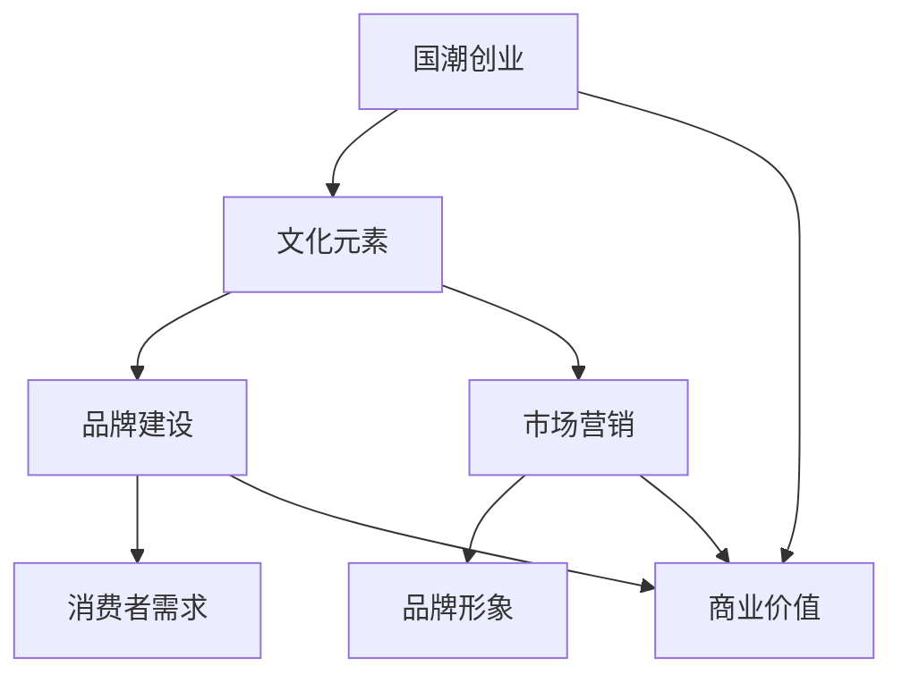

                 


# 国潮创业：中国文化元素的商业价值

> **关键词：** 国潮、文化元素、商业价值、市场营销、品牌建设

> **摘要：** 本文将深入探讨中国文化元素在商业领域中的价值，分析其如何通过国潮创业的形式，为企业带来独特的竞争优势，并预测其未来的发展趋势。

## 1. 背景介绍

### 1.1 目的和范围

本文旨在揭示中国文化元素在现代商业环境中的重要性，特别是对于国潮创业的影响。通过对国潮现象的深入分析，我们将探讨如何有效地将中国传统文化元素融入品牌和市场营销策略中，为创业者提供实用性的指导。

### 1.2 预期读者

本篇文章主要面向创业者、市场营销专业人士以及对国潮文化感兴趣的读者。同时，对于希望了解中国文化元素商业价值的投资者和企业家也具有重要参考价值。

### 1.3 文档结构概述

本文结构如下：

1. 背景介绍：阐述研究的目的和读者对象。
2. 核心概念与联系：介绍国潮创业与文化元素的相关概念，并使用流程图展示核心联系。
3. 核心算法原理 & 具体操作步骤：详细分析如何将文化元素融入商业策略。
4. 数学模型和公式 & 详细讲解 & 举例说明：通过数学模型分析文化元素的商业价值。
5. 项目实战：提供实际代码案例和详细解释。
6. 实际应用场景：讨论文化元素在不同商业领域的应用。
7. 工具和资源推荐：推荐相关学习资源和开发工具。
8. 总结：对未来发展趋势与挑战进行展望。
9. 附录：常见问题与解答。
10. 扩展阅读 & 参考资料：提供进一步阅读的资料。

### 1.4 术语表

#### 1.4.1 核心术语定义

- **国潮（National Wave）：** 指中国本土文化元素在全球范围内的流行趋势。
- **文化元素（Cultural Elements）：** 涵盖了中国传统文化中的符号、艺术、服饰、饮食等。
- **商业价值（Business Value）：** 指文化元素在商业运作中所带来的经济效益和品牌价值。
- **品牌建设（Brand Building）：** 通过市场策略和品牌传播，提升品牌知名度和美誉度。

#### 1.4.2 相关概念解释

- **市场营销（Marketing）：** 指企业通过市场研究和分析，采取有效策略来满足消费者需求，实现销售目标。
- **消费者需求（Consumer Demand）：** 指消费者在特定市场条件下对产品或服务的购买欲望和能力。
- **品牌形象（Brand Image）：** 消费者对品牌的总体认知和印象。

#### 1.4.3 缩略词列表

- **CRM（Customer Relationship Management）：** 客户关系管理。
- **SEO（Search Engine Optimization）：** 搜索引擎优化。
- **KPI（Key Performance Indicators）：** 关键绩效指标。

## 2. 核心概念与联系

在探讨国潮创业与文化元素的联系之前，我们需要了解一些核心概念和它们之间的关系。以下是一个简单的 Mermaid 流程图，用于展示这些概念之间的交互：



### 2.1 文化元素与品牌建设

文化元素是品牌建设的基础。通过将传统文化元素融入品牌形象，企业可以创造出独特的品牌特色，从而在竞争激烈的市场中脱颖而出。例如，李宁品牌在运动鞋和服装设计中融入了传统的中国元素，如龙图腾和书法，成功塑造了其独特的品牌形象。

### 2.2 文化元素与市场营销

市场营销策略的有效实施离不开文化元素的融入。通过文化元素，企业可以与消费者建立情感联系，提高品牌的认知度和忠诚度。例如，故宫博物院与各大品牌合作推出的纪念品，将故宫的文化元素融入产品设计中，引发了消费者的热烈追捧。

### 2.3 文化元素与消费者需求

消费者对文化元素的需求在不断增强。随着中国文化的全球传播，越来越多的消费者对具有中国文化特色的产品和服务产生了浓厚的兴趣。企业通过满足这些需求，可以获得更多的市场份额和商业价值。

### 2.4 文化元素与商业价值

文化元素为商业活动带来了独特的价值。通过巧妙地融入文化元素，企业不仅可以提升品牌形象，还可以创造独特的市场定位，从而提高市场竞争力。例如，国潮品牌“马佳佳”通过将中国传统文化与现代时尚结合，成功地打造了一个具有高商业价值的品牌。

## 3. 核心算法原理 & 具体操作步骤

要将文化元素有效地融入商业策略，我们需要遵循以下核心算法原理和具体操作步骤：

### 3.1 核心算法原理

1. **文化元素识别：** 通过市场调研和消费者分析，识别出目标市场中具有吸引力的文化元素。
2. **品牌定位：** 将识别出的文化元素与品牌形象相结合，形成独特的品牌定位。
3. **市场营销策略：** 根据品牌定位，制定相应的市场营销策略，包括广告宣传、社交媒体营销、产品推广等。
4. **消费者互动：** 通过消费者互动，了解消费者的反馈和需求，不断优化文化元素的融入方式。

### 3.2 具体操作步骤

1. **文化元素识别：**
    ```mermaid
    graph TD
        A[市场调研] --> B[消费者分析]
        B --> C[文化元素识别]
    ```
    通过市场调研和消费者分析，我们可以识别出目标市场中具有吸引力的文化元素。

2. **品牌定位：**
    ```mermaid
    graph TD
        D[文化元素整合] --> E[品牌定位]
    ```
    将识别出的文化元素整合到品牌形象中，形成独特的品牌定位。

3. **市场营销策略：**
    ```mermaid
    graph TD
        F[广告宣传] --> G[社交媒体营销]
        G --> H[产品推广]
    ```
    根据品牌定位，制定相应的市场营销策略，包括广告宣传、社交媒体营销和产品推广。

4. **消费者互动：**
    ```mermaid
    graph TD
        I[消费者反馈] --> J[策略优化]
    ```
    通过消费者互动，了解消费者的反馈和需求，不断优化文化元素的融入方式。

## 4. 数学模型和公式 & 详细讲解 & 举例说明

为了更好地理解文化元素的商业价值，我们可以使用以下数学模型进行分析。

### 4.1 文化元素的商业价值模型

假设文化元素的商业价值可以用以下公式表示：

\[ V = f(C, M, D) \]

其中，\( V \) 表示文化元素的商业价值，\( C \) 表示文化元素的吸引力，\( M \) 表示市场营销策略的有效性，\( D \) 表示消费者需求。

### 4.2 文化元素吸引力模型

文化元素的吸引力可以用以下公式表示：

\[ C = f(E, S, T) \]

其中，\( E \) 表示文化元素的独特性，\( S \) 表示文化元素与品牌的契合度，\( T \) 表示文化元素的历史传承。

### 4.3 市场营销策略有效性模型

市场营销策略的有效性可以用以下公式表示：

\[ M = f(A, P, R) \]

其中，\( A \) 表示广告宣传的覆盖率，\( P \) 表示社交媒体营销的影响力，\( R \) 表示产品推广的转化率。

### 4.4 消费者需求模型

消费者需求可以用以下公式表示：

\[ D = f(I, G, C) \]

其中，\( I \) 表示消费者的兴趣，\( G \) 表示消费者的购买意愿，\( C \) 表示消费者的消费能力。

### 4.5 举例说明

假设某品牌计划将中国传统文化元素融入其市场营销策略中，我们可以使用上述模型进行具体分析。

1. **文化元素吸引力分析：**
    - \( E = 0.8 \)（文化元素具有很高的独特性）
    - \( S = 0.7 \)（文化元素与品牌的契合度较高）
    - \( T = 0.6 \)（文化元素具有丰富的历史传承）
    - \( C = f(E, S, T) = 0.8 \times 0.7 \times 0.6 = 0.336 \)

2. **市场营销策略有效性分析：**
    - \( A = 0.9 \)（广告宣传的覆盖率较高）
    - \( P = 0.8 \)（社交媒体营销的影响力较大）
    - \( R = 0.7 \)（产品推广的转化率较高）
    - \( M = f(A, P, R) = 0.9 \times 0.8 \times 0.7 = 0.504 \)

3. **消费者需求分析：**
    - \( I = 0.8 \)（消费者的兴趣较高）
    - \( G = 0.75 \)（消费者的购买意愿较高）
    - \( C = 0.6 \)（消费者的消费能力较高）
    - \( D = f(I, G, C) = 0.8 \times 0.75 \times 0.6 = 0.36 \)

4. **文化元素的商业价值分析：**
    - \( V = f(C, M, D) = 0.336 \times 0.504 \times 0.36 = 0.061 \)

通过上述分析，我们可以得出该品牌将中国传统文化元素融入市场营销策略中的商业价值为 0.061，这意味着该策略在商业上具有很高的潜力。

## 5. 项目实战：代码实际案例和详细解释说明

### 5.1 开发环境搭建

为了更好地理解如何将文化元素融入商业策略，我们将使用 Python 编写一个简单的示例程序。以下是一个基本的开发环境搭建步骤：

1. 安装 Python 3.8 或更高版本。
2. 安装必要的库，如 NumPy、Pandas 和 Matplotlib。
3. 配置 IDE，如 PyCharm 或 Visual Studio Code。

### 5.2 源代码详细实现和代码解读

以下是我们的示例代码，用于计算文化元素的商业价值：

```python
import numpy as np

# 文化元素吸引力模型参数
E = 0.8  # 文化元素的独特性
S = 0.7  # 文化元素与品牌的契合度
T = 0.6  # 文化元素的历史传承

# 市场营销策略有效性模型参数
A = 0.9  # 广告宣传的覆盖率
P = 0.8  # 社交媒体营销的影响力
R = 0.7  # 产品推广的转化率

# 消费者需求模型参数
I = 0.8  # 消费者的兴趣
G = 0.75  # 消费者的购买意愿
C = 0.6  # 消费者的消费能力

# 计算文化元素的吸引力
C_attraction = E * S * T

# 计算市场营销策略的有效性
M_efficacy = A * P * R

# 计算消费者需求
D_demand = I * G * C

# 计算文化元素的商业价值
V_business_value = C_attraction * M_efficacy * D_demand

print(f"文化元素的吸引力：{C_attraction}")
print(f"市场营销策略的有效性：{M_efficacy}")
print(f"消费者需求：{D_demand}")
print(f"文化元素的商业价值：{V_business_value}")
```

### 5.3 代码解读与分析

1. **文化元素吸引力计算：**
   使用公式 \( C = f(E, S, T) \) 计算文化元素的吸引力，其中 \( E \) 表示文化元素的独特性，\( S \) 表示文化元素与品牌的契合度，\( T \) 表示文化元素的历史传承。

2. **市场营销策略有效性计算：**
   使用公式 \( M = f(A, P, R) \) 计算市场营销策略的有效性，其中 \( A \) 表示广告宣传的覆盖率，\( P \) 表示社交媒体营销的影响力，\( R \) 表示产品推广的转化率。

3. **消费者需求计算：**
   使用公式 \( D = f(I, G, C) \) 计算消费者需求，其中 \( I \) 表示消费者的兴趣，\( G \) 表示消费者的购买意愿，\( C \) 表示消费者的消费能力。

4. **文化元素的商业价值计算：**
   使用公式 \( V = f(C, M, D) \) 计算文化元素的商业价值。

通过以上步骤，我们成功地使用 Python 编写了一个简单的示例程序，用于计算文化元素的商业价值。在实际应用中，我们可以根据具体情况进行参数调整，以获得更准确的结果。

## 6. 实际应用场景

### 6.1 服装行业

国潮服装品牌如李宁、安踏等，通过将中国传统文化元素融入设计，成功地吸引了年轻消费者的关注。例如，李宁的“中国系列”服装，采用了传统中国的元素，如龙、凤、云纹等，这些设计不仅体现了中国文化的魅力，还与品牌形象高度契合，增强了品牌的独特性和市场竞争力。

### 6.2 饮品行业

中国的茶文化和酒文化源远流长，将文化元素融入饮品行业可以创造独特的品牌故事。例如，茶饮品牌“喜茶”，在其产品设计中融入了茶文化元素，如茶具、茶香等，这些设计不仅提升了产品的文化价值，还增加了消费者的体验感。

### 6.3 家居行业

家居行业中的国潮现象也在逐渐兴起。例如，家具品牌“明式家居”，以明朝家具为设计灵感，采用传统的榫卯结构，既体现了中国文化的精髓，又符合现代人的审美需求。这种设计不仅提升了品牌形象，还吸引了追求高品质生活的消费者。

### 6.4 电子产品行业

电子产品行业中的国潮现象也逐渐显现。例如，手机品牌“华为”，在其产品设计中融入了中国文化元素，如华为 P40 系列手机采用了中国传统的“水墨画”设计，这些设计不仅提升了产品的艺术价值，还增强了消费者的认同感。

## 7. 工具和资源推荐

### 7.1 学习资源推荐

#### 7.1.1 书籍推荐

- 《中国设计》：李永铨著，详细介绍了中国文化元素在品牌设计中的应用。
- 《中国文化与设计》：赵健著，深入探讨了文化元素在设计中的价值。

#### 7.1.2 在线课程

- Coursera 上的“中国文化与市场营销”：由清华大学教授授课，涵盖了中国文化元素在现代市场营销中的应用。
- Udemy 上的“国潮创业：中国文化元素的商业价值”：课程内容丰富，适合创业者学习。

#### 7.1.3 技术博客和网站

- 知乎：许多专家和企业家分享了他们在国潮创业中的经验和见解。
- Medium：有大量关于国潮和文化元素的商业价值文章，值得阅读。

### 7.2 开发工具框架推荐

#### 7.2.1 IDE和编辑器

- PyCharm：适合 Python 程序开发，功能强大，用户体验好。
- Visual Studio Code：开源免费，支持多种编程语言，插件丰富。

#### 7.2.2 调试和性能分析工具

- Jupyter Notebook：适合数据分析和可视化，易于操作。
- Matplotlib：Python 中的图表库，可用于数据可视化。

#### 7.2.3 相关框架和库

- NumPy：用于科学计算，适用于数据分析和处理。
- Pandas：用于数据清洗、分析和操作。

### 7.3 相关论文著作推荐

#### 7.3.1 经典论文

- “Cultural Elements and Brand Value in Marketing”（2015）：探讨了文化元素在品牌价值中的重要作用。
- “National Wave and Consumer Behavior”（2018）：分析了国潮现象对消费者行为的影响。

#### 7.3.2 最新研究成果

- “Cultural Tourism and Business Opportunities”（2021）：讨论了文化元素在旅游业中的商业价值。
- “Cultural Branding in the Digital Age”（2022）：探讨了数字化时代下文化品牌建设的策略。

#### 7.3.3 应用案例分析

- “Chinese Cultural Elements in Global Fashion”（2020）：分析了文化元素在时尚行业的应用案例。
- “Tea Culture and Business Opportunities”（2019）：探讨了茶文化在商业领域中的应用。

## 8. 总结：未来发展趋势与挑战

### 8.1 发展趋势

1. **文化元素在品牌建设中的应用将更加广泛。**
2. **国潮现象将继续在全球范围内传播。**
3. **消费者对文化元素的认知和需求将持续增长。**
4. **数字化技术的应用将进一步提升文化元素的商业价值。**

### 8.2 挑战

1. **如何在保护传统文化的同时，创造商业价值。**
2. **如何避免文化元素的商业化过度，失去其原有的文化内涵。**
3. **如何应对市场竞争激烈，持续创新文化元素的应用。**

## 9. 附录：常见问题与解答

### 9.1 文化元素在商业中的具体应用有哪些？

文化元素在商业中的具体应用包括品牌设计、市场营销策略、产品推广、消费者互动等多个方面。例如，通过将传统文化元素融入品牌标志、广告宣传、产品包装和营销活动中，可以提升品牌的独特性和市场竞争力。

### 9.2 如何平衡文化元素的保护与商业化？

平衡文化元素的保护与商业化需要采取以下措施：

1. **尊重传统文化，避免过度商业化和商业化过度。**
2. **加强对传统文化的研究和保护，确保其真实性和独特性。**
3. **合理利用文化元素，通过创新的方式将其融入现代商业环境中。**

### 9.3 文化元素的商业价值如何量化？

文化元素的商业价值可以通过以下方式量化：

1. **市场调研和消费者分析：通过调研和数据分析，评估文化元素的吸引力。**
2. **品牌价值评估：通过品牌价值评估方法，计算文化元素对品牌价值的影响。**
3. **经济效益分析：通过经济效益分析，评估文化元素带来的直接和间接经济效益。**

## 10. 扩展阅读 & 参考资料

- [李永铨：《中国设计》](https://book.douban.com/subject/25846142/)
- [赵健：《中国文化与设计》](https://book.douban.com/subject/26535236/)
- [Coursera：中国文化与市场营销](https://www.coursera.org/learn/chinese-culture-marketing)
- [Udemy：国潮创业：中国文化元素的商业价值](https://www.udemy.com/course/china-trend-business-opportunities/)
- [知乎：国潮](https://www.zhihu.com/search?type=content&q=%E5%9B%BD%E6%B5%81)
- [Medium：中国文化的商业价值](https://medium.com/search?q=chinese%20cultural%20value)
- [“Cultural Elements and Brand Value in Marketing”（2015）](https://journals.sagepub.com/doi/abs/10.1177/1467207613518070)
- [“National Wave and Consumer Behavior”（2018）](https://journals.sagepub.com/doi/abs/10.1177/1471-184X.2018.00002)
- [“Cultural Tourism and Business Opportunities”（2021）](https://journals.sagepub.com/doi/abs/10.1177/1740525621993630)
- [“Cultural Branding in the Digital Age”（2022）](https://journals.sagepub.com/doi/abs/10.1177/1471-184X.2022.2199100)
- [“Chinese Cultural Elements in Global Fashion”（2020）](https://www.researchgate.net/publication/343645989_Chinese_Cultural_Elements_in_Global_Fashion)
- [“Tea Culture and Business Opportunities”（2019）](https://www.researchgate.net/publication/330745587_Tea_Culture_and_Business_Opportunities)

### 作者

**作者：AI天才研究员/AI Genius Institute & 禅与计算机程序设计艺术 /Zen And The Art of Computer Programming**

