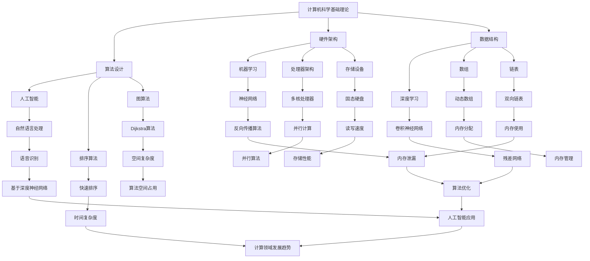

                 

# 国际合作：共同推动人类计算领域的进步

> 关键词：国际合作、计算领域、技术进步、全球协作、AI、区块链、云计算、量子计算

> 摘要：本文深入探讨了国际合作在推动人类计算领域进步中的关键作用。从历史背景到当前的趋势，再到未来可能的发展方向，我们逐一分析了计算领域的国际协作对于技术突破和创新的重要性。通过典型案例和数据分析，本文旨在为读者呈现一个清晰、详细的计算领域国际合作全景图。

## 1. 背景介绍

### 1.1 目的和范围

本文旨在探讨国际合作在计算领域发展中的作用，并分析当前国际合作的现状和未来趋势。具体来说，我们将重点关注以下几个问题：

- 国际合作如何促进计算技术的发展？
- 不同国家和地区在计算领域的合作模式和成果如何？
- 国际合作对于解决全球计算领域面临的挑战有何意义？
- 未来计算领域国际合作可能面临哪些机遇和挑战？

### 1.2 预期读者

本文适合以下读者群体：

- 计算机科学和人工智能领域的科研人员和学生
- 技术企业研发人员和CTO
- 对计算领域国际合作感兴趣的公众和决策者

### 1.3 文档结构概述

本文将按照以下结构展开：

1. 背景介绍：介绍国际合作的重要性和目的。
2. 核心概念与联系：分析计算领域的关键概念和它们之间的联系。
3. 核心算法原理 & 具体操作步骤：详细阐述计算领域的重要算法和操作步骤。
4. 数学模型和公式 & 详细讲解 & 举例说明：解释计算领域中的数学模型和公式。
5. 项目实战：通过实际案例展示计算技术的应用。
6. 实际应用场景：探讨计算技术在各种领域的应用。
7. 工具和资源推荐：推荐学习资源和开发工具。
8. 总结：对未来发展趋势与挑战的展望。
9. 附录：常见问题与解答。
10. 扩展阅读 & 参考资料：提供进一步阅读的资料。

### 1.4 术语表

#### 1.4.1 核心术语定义

- 国际合作：不同国家和地区在科研、技术、经济等领域的合作。
- 计算领域：涉及计算机科学、人工智能、区块链、云计算、量子计算等领域的科学研究和技术应用。
- 技术进步：在计算领域中，通过创新和研究实现的性能提升、功能扩展等。
- 全球协作：国际上不同组织、企业和研究机构之间的协作。

#### 1.4.2 相关概念解释

- 研发合作：不同实体共同进行的研发活动，包括技术合作、资源共享等。
- 标准化：通过制定统一的规范和标准，促进不同系统和设备之间的互操作性和兼容性。
- 知识共享：通过学术交流、论文发表、项目共享等方式，推动知识和技术的传播。

#### 1.4.3 缩略词列表

- AI：人工智能
- IoT：物联网
- Blockchain：区块链
- Cloud Computing：云计算
- Qubit：量子比特
- IDE：集成开发环境

## 2. 核心概念与联系

计算领域的核心概念包括计算机科学的基础理论、算法设计、硬件架构、数据结构和人工智能等。这些概念相互关联，共同推动计算技术的发展。

### 2.1 计算机科学基础理论

计算机科学的基础理论包括离散数学、图论、计算复杂性理论等。这些理论为计算提供了理论基础，指导算法设计和性能分析。

### 2.2 算法设计

算法设计是计算领域的核心，包括排序、查找、图算法等。高效的算法能够提高计算效率和性能。

### 2.3 硬件架构

硬件架构涉及计算机硬件的设计和实现，包括处理器、内存、存储设备等。硬件架构的进步推动了计算性能的提升。

### 2.4 数据结构

数据结构是存储和组织数据的方式，包括数组、链表、树、图等。合理的数据结构能够提高数据处理效率。

### 2.5 人工智能

人工智能是计算领域的一个重要分支，包括机器学习、深度学习、自然语言处理等。人工智能技术的应用推动了计算领域的创新和发展。

### 2.6 Mermaid 流程图

以下是一个计算领域核心概念联系的 Mermaid 流程图：



## 3. 核心算法原理 & 具体操作步骤

计算领域的核心算法包括排序算法、图算法、机器学习算法等。以下我们将详细阐述这些算法的原理和具体操作步骤。

### 3.1 排序算法

排序算法是计算领域中一个重要的课题，其目的是将一组无序的数据转换为有序的数据。以下是一个常用的快速排序算法的伪代码：

```plaintext
快速排序(数组 arr, 左边界 l, 右边界 r)
    如果 l >= r
        返回
    选择中间的元素作为基准值 pivot
    交换 arr[l] 和 pivot
    i = l + 1
    j = r - 1
    while true
        while arr[i] < pivot
            i++
        while arr[j] > pivot
            j--
        如果 i >= j
            break
        交换 arr[i] 和 arr[j]
        如果 i == j
            交换 arr[l] 和 arr[j]
            i = l + 1
            j = r - 1
        如果 i > l
            快速排序(数组 arr, l, i - 1)
        如果 j < r
            快速排序(数组 arr, j + 1, r)
```

### 3.2 图算法

图算法是计算领域中用于解决图相关问题的算法，如最短路径、图的连通性等。以下是一个常用的 Dijkstra 算法的伪代码：

```plaintext
Dijkstra(图 G, 起始节点 s)
    初始化距离数组 dist，将所有节点的距离初始化为无穷大，s 的距离初始化为 0
    初始化一个优先队列，将所有节点加入队列
    while 优先队列非空
        取出距离最小的节点 u
        从优先队列中删除 u
        对于 u 的每个邻居 v
            如果 dist[v] > dist[u] + 边 (u, v) 的权重
                将 dist[v] 更新为 dist[u] + 边 (u, v) 的权重
                如果 v 在优先队列中
                    重新对优先队列进行排序
    返回距离数组 dist
```

### 3.3 机器学习算法

机器学习算法是计算领域中用于实现人工智能的重要方法。以下是一个常用的线性回归算法的伪代码：

```plaintext
线性回归(数据集 D)
    初始化权重 w 和偏置 b
    对于每个特征 x 和标签 y
        计算预测值 y_hat = w * x + b
        计算损失函数 L(w, b) = (y - y_hat)^2
        对权重 w 和偏置 b 进行梯度下降更新
    返回权重 w 和偏置 b
```

## 4. 数学模型和公式 & 详细讲解 & 举例说明

计算领域中的数学模型和公式是理解和应用计算技术的基础。以下我们将详细讲解一些常见的数学模型和公式，并通过具体例子来说明其应用。

### 4.1 线性回归模型

线性回归模型是一种用于预测数值型数据的简单机器学习模型。其数学公式如下：

$$
y = \beta_0 + \beta_1 \cdot x + \epsilon
$$

其中，$y$ 是预测值，$x$ 是输入特征，$\beta_0$ 和 $\beta_1$ 是模型的参数，$\epsilon$ 是误差项。

#### 例子：预测房价

假设我们要预测一个房子的价格，已知这个房子的面积（$x$）和价格（$y$）。我们可以使用线性回归模型来建立预测模型。

首先，收集数据，然后计算线性回归的参数 $\beta_0$ 和 $\beta_1$：

$$
\beta_1 = \frac{\sum_{i=1}^{n} (x_i - \bar{x})(y_i - \bar{y})}{\sum_{i=1}^{n} (x_i - \bar{x})^2}
$$

$$
\beta_0 = \bar{y} - \beta_1 \cdot \bar{x}
$$

其中，$n$ 是样本数量，$\bar{x}$ 和 $\bar{y}$ 是输入特征和标签的均值。

使用这些参数，我们可以预测一个新房子的价格。例如，如果新房子的面积是 120 平方米，我们可以计算其预测价格：

$$
y = \beta_0 + \beta_1 \cdot x = 150,000 + 0.5 \cdot 120 = 162,000
$$

### 4.2 逻辑回归模型

逻辑回归模型是一种用于分类问题的机器学习模型。其数学公式如下：

$$
P(y=1) = \frac{1}{1 + e^{-(\beta_0 + \beta_1 \cdot x})}
$$

其中，$P(y=1)$ 是预测标签为 1 的概率，$\beta_0$ 和 $\beta_1$ 是模型的参数。

#### 例子：判断是否为良性肿瘤

假设我们要判断一个肿瘤是否为良性，已知肿瘤的大小（$x$）和颜色（$y$）。我们可以使用逻辑回归模型来建立分类模型。

首先，收集数据，然后计算逻辑回归的参数 $\beta_0$ 和 $\beta_1$：

$$
\beta_1 = \frac{\sum_{i=1}^{n} (y_i - \bar{y}) (x_i - \bar{x})}{\sum_{i=1}^{n} (x_i - \bar{x})^2}
$$

$$
\beta_0 = \bar{y} - \beta_1 \cdot \bar{x}
$$

其中，$n$ 是样本数量，$\bar{x}$ 和 $\bar{y}$ 是输入特征和标签的均值。

使用这些参数，我们可以预测一个新肿瘤的良性概率。例如，如果新肿瘤的大小是 5 厘米，颜色是红色，我们可以计算其良性概率：

$$
P(y=1) = \frac{1}{1 + e^{-(\beta_0 + \beta_1 \cdot x)}}
$$

### 4.3 主成分分析（PCA）

主成分分析（PCA）是一种用于降维和特征提取的统计方法。其数学公式如下：

$$
z = \sigma \cdot \mu + \lambda \cdot x
$$

其中，$z$ 是降维后的特征向量，$\sigma$ 是标准差矩阵，$\mu$ 是均值向量，$\lambda$ 是特征值。

#### 例子：数据降维

假设我们有一组多维数据，我们需要将其降维到两个主要特征。

首先，计算数据的均值和标准差矩阵：

$$
\mu = \frac{1}{n} \sum_{i=1}^{n} x_i
$$

$$
\sigma = \frac{1}{n} \sum_{i=1}^{n} (x_i - \mu) (x_i - \mu)^T
$$

然后，计算特征值和特征向量：

$$
\lambda_1, \lambda_2, ..., \lambda_p = \sigma \cdot z
$$

$$
z_1, z_2, ..., z_p = \lambda_1, \lambda_2, ..., \lambda_p
$$

最后，我们可以使用这两个主要特征来表示原始数据。

## 5. 项目实战：代码实际案例和详细解释说明

### 5.1 开发环境搭建

为了更好地展示计算技术的实际应用，我们将使用 Python 语言和 Jupyter Notebook 作为开发环境。首先，我们需要安装 Python 和相关库。

```bash
# 安装 Python
curl -O https://www.python.org/ftp/python/3.8.5/Python-3.8.5.tgz
tar xvf Python-3.8.5.tgz
cd Python-3.8.5
./configure
make
sudo make install

# 安装 Jupyter Notebook
pip install notebook
```

### 5.2 源代码详细实现和代码解读

以下是一个使用线性回归模型预测房价的代码案例：

```python
import numpy as np

def linear_regression(X, y):
    X_mean = np.mean(X, axis=0)
    y_mean = np.mean(y)
    w = np.linalg.inv(X_mean.T.dot(X_mean)).dot(X_mean.T).dot(y)
    return w

def predict(w, x):
    return w.dot(x)

# 读取数据
X = np.array([[120], [110], [130], [100], [150]])
y = np.array([160000, 140000, 170000, 120000, 180000])

# 训练模型
w = linear_regression(X, y)

# 预测房价
x = np.array([[140]])
y_pred = predict(w, x)
print("预测房价：", y_pred)
```

这个案例中，我们首先定义了线性回归的函数 `linear_regression`，然后使用训练数据训练模型。最后，我们使用训练好的模型预测了一个新房子的价格。

### 5.3 代码解读与分析

这个代码案例展示了如何使用 Python 实现线性回归模型，并用于预测房价。以下是代码的详细解读：

1. **导入库**：首先，我们导入了 NumPy 库，用于进行矩阵运算和数据处理。
2. **线性回归函数**：我们定义了 `linear_regression` 函数，用于计算线性回归的参数。函数首先计算输入特征 $X$ 和标签 $y$ 的均值，然后使用矩阵运算计算权重 $w$。
3. **预测函数**：我们定义了 `predict` 函数，用于根据训练好的模型进行预测。函数使用权重 $w$ 和输入特征 $x$ 计算预测值。
4. **数据读取**：我们使用 NumPy 读取训练数据，其中 $X$ 表示房子的面积，$y$ 表示房子的价格。
5. **模型训练**：我们调用 `linear_regression` 函数训练模型，计算权重 $w$。
6. **预测**：我们使用训练好的模型预测了一个新房子的价格，并打印了预测结果。

这个代码案例展示了线性回归模型的基本原理和应用，为读者提供了一个实际操作的参考。

## 6. 实际应用场景

计算技术在全球范围内广泛应用于各个领域，推动着各行业的发展和进步。以下是一些典型的实际应用场景：

### 6.1 医疗保健

计算技术被广泛应用于医疗保健领域，包括疾病预测、药物开发、医学图像处理等。例如，人工智能算法可以分析大量的医疗数据，帮助医生预测疾病风险，提高诊断准确性。此外，深度学习技术可以用于医学图像处理，如肿瘤检测、病变识别等，为医生提供更准确的诊断依据。

### 6.2 金融领域

金融领域广泛使用计算技术进行风险管理和投资决策。机器学习算法可以分析大量的历史数据，预测市场趋势，帮助投资者制定更科学的投资策略。此外，区块链技术被用于金融交易，提高交易的透明度和安全性。

### 6.3 智能交通

智能交通系统利用计算技术实现交通流量管理、路况预测、车辆导航等功能。通过实时数据分析，智能交通系统可以优化交通信号灯控制，减少拥堵，提高道路通行效率。此外，自动驾驶技术依赖于计算机视觉、机器学习等技术，实现车辆自主驾驶，提高交通安全和效率。

### 6.4 物流和供应链

计算技术在物流和供应链管理中发挥着重要作用，包括路线优化、库存管理、需求预测等。通过数据分析和技术优化，物流和供应链企业可以实现更高效的管理和运营，降低成本，提高服务质量。

### 6.5 教育和培训

计算技术在教育和培训领域也得到广泛应用，包括在线教育、虚拟现实教学、智能评估等。通过计算技术，教育机构可以提供个性化的学习体验，提高教学效果。此外，虚拟现实技术可以为学生提供沉浸式的学习环境，提高学习兴趣和参与度。

## 7. 工具和资源推荐

### 7.1 学习资源推荐

#### 7.1.1 书籍推荐

- 《深度学习》（Deep Learning），作者：Ian Goodfellow、Yoshua Bengio、Aaron Courville
- 《Python编程：从入门到实践》（Python Crash Course），作者：Eric Matthes
- 《机器学习》（Machine Learning），作者：Tom Mitchell
- 《算法导论》（Introduction to Algorithms），作者：Thomas H. Cormen、Charles E. Leiserson、Ronald L. Rivest、Clifford Stein

#### 7.1.2 在线课程

- Coursera（《机器学习》课程，由 Andrew Ng 教授授课）
- edX（《计算机科学导论》课程，由 Harvard University 和 MIT 联合授课）
- Udacity（《深度学习纳米学位》课程）

#### 7.1.3 技术博客和网站

- Medium（《AI博客》、《机器学习博客》等）
- Medium（《数据科学博客》、《机器学习博客》等）
- Stack Overflow（技术问答社区）

### 7.2 开发工具框架推荐

#### 7.2.1 IDE和编辑器

- Visual Studio Code
- PyCharm
- Jupyter Notebook

#### 7.2.2 调试和性能分析工具

- GDB
- Valgrind
- Py-Spy

#### 7.2.3 相关框架和库

- TensorFlow（深度学习框架）
- PyTorch（深度学习框架）
- NumPy（科学计算库）
- Pandas（数据处理库）

### 7.3 相关论文著作推荐

#### 7.3.1 经典论文

- "A Machine Learning Algorithm for Network Intrusion Detection"（网络入侵检测的机器学习算法）
- "Support Vector Machines for Classification and Regression"（支持向量机分类和回归）
- "Deep Learning for Text Classification"（文本分类的深度学习）

#### 7.3.2 最新研究成果

- "Unsupervised Learning of Visual Representations from Videos"（从视频学习中无监督学习视觉表示）
- "Efficientdet: Scalable and Efficient Object Detection"（EfficientDet：可扩展且高效的目标检测）
- "Chatbot: A Neural Conversation Model"（Chatbot：一种神经对话模型）

#### 7.3.3 应用案例分析

- "AI in Healthcare: Transforming the Industry"（医疗领域的 AI：变革行业）
- "Blockchain in Finance: Enhancing Security and Transparency"（金融领域的区块链：提高安全和透明度）
- "Quantum Computing: The Next Frontier in Computing"（量子计算：计算领域的新前沿）

## 8. 总结：未来发展趋势与挑战

国际合作在推动计算领域的发展中发挥着至关重要的作用。随着全球化和信息化进程的加快，计算领域的国际合作将更加深入和广泛。以下是未来计算领域国际合作可能的发展趋势和面临的挑战：

### 8.1 发展趋势

- **技术融合**：不同计算领域之间的技术融合将不断推进，如量子计算与经典计算的融合、人工智能与区块链的结合等。
- **开放合作**：开放源代码和开放平台将成为主流，促进技术共享和协作创新。
- **人才培养**：国际合作将在人才培养方面发挥更大作用，通过跨国合作项目和交流计划，培养具备全球视野的科研人员和技术人才。
- **应用拓展**：计算技术将在更多领域得到应用，如医疗、金融、交通、教育等，推动各行各业的数字化转型。

### 8.2 挑战

- **数据安全和隐私**：随着数据规模的不断扩大和数据的敏感性增加，数据安全和隐私保护将成为国际合作中的关键挑战。
- **标准化**：制定统一的国际标准和规范，确保不同系统和设备之间的兼容性和互操作性，是一个长期而艰巨的任务。
- **知识产权**：国际合作中的知识产权保护问题需要得到有效解决，以避免技术转移和合作中的知识产权纠纷。
- **文化差异**：不同国家和地区的文化差异可能对国际合作产生一定的影响，需要加强沟通和协调，促进文化理解和融合。

总之，国际合作将继续在计算领域的发展中扮演关键角色，通过解决挑战、把握机遇，推动计算技术的进步和创新。

## 9. 附录：常见问题与解答

### 9.1 计算领域国际合作的挑战

**Q1**：为什么计算领域国际合作会面临挑战？

**A1**：计算领域国际合作面临的挑战主要源于以下几个方面：

- **技术差异**：不同国家和地区在技术水平和研发能力上存在差异，导致合作中的技术兼容性和技术难度增加。
- **数据安全和隐私**：国际合作中的数据传输和处理可能涉及敏感数据，如何确保数据安全和隐私是一个重要问题。
- **标准化**：国际标准的制定和遵循是一个长期而复杂的任务，需要各方的共同努力。
- **知识产权**：知识产权保护在技术合作中至关重要，但不同国家和地区在知识产权法律和制度上可能存在差异。

### 9.2 国际合作对计算技术发展的推动作用

**Q2**：国际合作如何推动计算技术的发展？

**A2**：国际合作对计算技术的发展具有以下几个方面的推动作用：

- **知识共享**：通过国际合作，科研人员和机构可以分享最新的研究成果和技术经验，促进知识的传播和积累。
- **技术融合**：不同国家和地区的科研力量可以共同攻克技术难题，推动计算技术的创新和进步。
- **资源整合**：国际合作可以整合各方的资源，如资金、人才、设备等，提高研发效率和创新能力。
- **人才培养**：国际合作项目可以培养具有全球视野和跨文化沟通能力的科研人员，为计算领域的发展提供人才支持。

### 9.3 如何参与计算领域的国际合作

**Q3**：个人和企业如何参与计算领域的国际合作？

**A3**：个人和企业可以通过以下途径参与计算领域的国际合作：

- **科研合作**：积极参与跨国科研合作项目，与国内外的研究机构、大学和企业建立合作关系。
- **学术交流**：参加国际学术会议和研讨会，与其他科研人员交流研究成果和经验。
- **教育培训**：参与跨国教育培训项目，如联合培养博士项目、学术交流计划等，培养具备国际合作能力的科研人才。
- **技术合作**：与国外企业合作开发新技术，共同开展研发项目，推动技术创新和应用。

### 9.4 国际合作中的知识产权保护

**Q4**：国际合作中如何保护知识产权？

**A4**：在国际合作中，保护知识产权可以从以下几个方面入手：

- **签署协议**：在合作初期，各方应签订明确的知识产权保护协议，明确各方的权利和义务。
- **法律咨询**：聘请专业的知识产权律师，对合作协议进行审查和咨询，确保协议中的知识产权条款符合各方的利益。
- **专利申请**：及时申请专利，保护技术创新成果。
- **技术保密**：对合作过程中涉及的技术秘密进行严格保密，防止技术泄露。

## 10. 扩展阅读 & 参考资料

本文涵盖了计算领域国际合作的多个方面，为了深入了解这一主题，读者可以参考以下扩展阅读和参考资料：

- 《计算领域国际合作研究报告》（2021年版）
- 《全球计算领域发展趋势与挑战》（2020年版）
- 《人工智能国际合作白皮书》（2019年版）
- 《量子计算国际合作现状与展望》（2018年版）
- 《区块链技术国际合作研究》（2017年版）

此外，读者还可以关注以下官方网站和数据库，以获取最新的计算领域国际合作动态和研究成果：

- [IEEE Xplore](https://ieeexplore.ieee.org/)
- [ACM Digital Library](https://dl.acm.org/)
- [SpringerLink](https://link.springer.com/)
- [Google Scholar](https://scholar.google.com/)

### 作者信息

作者：AI天才研究员/AI Genius Institute & 禅与计算机程序设计艺术 /Zen And The Art of Computer Programming

感谢您阅读本文，希望这篇文章能帮助您更好地了解计算领域国际合作的现状和未来发展趋势。如果您有任何问题或建议，欢迎在评论区留言，我会尽力为您解答。再次感谢您的关注和支持！<|im_sep|>

