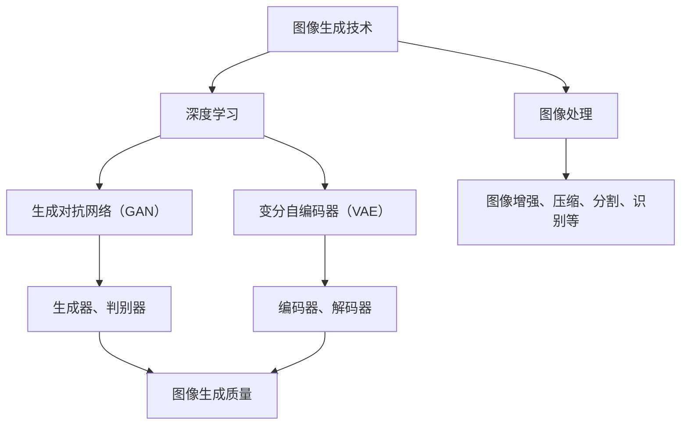

                 

# 图像生成新速度：LLM新动能释放

> **关键词**：图像生成、深度学习、LLM、人工智能、神经网络、数据驱动

> **摘要**：本文将深入探讨近年来在图像生成领域取得的重大突破，尤其是基于大型语言模型（LLM）的技术进展。我们将从背景介绍、核心概念、算法原理、数学模型、项目实战、实际应用场景等多个角度出发，全面剖析图像生成技术的最新进展，以及LLM在其中的关键作用。文章旨在为广大读者提供一幅清晰的图像生成领域全景图，并启发更多研究人员和开发者在这一领域深入探索。

## 1. 背景介绍

### 1.1 目的和范围

本文旨在探讨图像生成领域的技术进展，重点关注基于大型语言模型（LLM）的图像生成方法。图像生成作为人工智能的一个重要分支，已经取得了许多令人瞩目的成果。然而，随着数据集规模的扩大和计算能力的提升，传统的图像生成方法逐渐显露出其局限性。本文将重点介绍LLM在图像生成中的应用，分析其原理、优势以及面临的挑战，以期为该领域的研究者和开发者提供有价值的参考。

### 1.2 预期读者

本文适用于对图像生成和深度学习有一定了解的读者，包括但不限于以下人群：

- 计算机科学和人工智能领域的研究生和本科生；
- 对图像生成和深度学习技术感兴趣的开发者和工程师；
- 欲深入了解LLM在图像生成中应用的科研人员。

### 1.3 文档结构概述

本文分为以下十个部分：

1. 背景介绍
   - 目的和范围
   - 预期读者
   - 文档结构概述
   - 术语表
2. 核心概念与联系
3. 核心算法原理 & 具体操作步骤
4. 数学模型和公式 & 详细讲解 & 举例说明
5. 项目实战：代码实际案例和详细解释说明
6. 实际应用场景
7. 工具和资源推荐
8. 总结：未来发展趋势与挑战
9. 附录：常见问题与解答
10. 扩展阅读 & 参考资料

### 1.4 术语表

#### 1.4.1 核心术语定义

- 图像生成：利用算法生成新的图像或图像序列的过程。
- 深度学习：一种基于多层神经网络进行训练和学习的人工智能技术。
- 大型语言模型（LLM）：一种参数规模巨大、能够处理自然语言文本的大型神经网络模型。
- 图像处理：利用计算机技术和算法对图像进行增强、压缩、分割、识别等操作的过程。

#### 1.4.2 相关概念解释

- 生成对抗网络（GAN）：一种由生成器和判别器组成的深度学习模型，用于生成逼真的图像。
- 变分自编码器（VAE）：一种基于概率生成模型的图像生成方法，能够生成具有多样性的图像。

#### 1.4.3 缩略词列表

- GAN：生成对抗网络
- VAE：变分自编码器
- LLM：大型语言模型
- AI：人工智能
- DL：深度学习

## 2. 核心概念与联系

为了更好地理解本文的主题，我们需要首先梳理一下图像生成领域中的核心概念与联系。以下是一个简化的Mermaid流程图，展示了图像生成技术中的一些关键节点及其相互关系。



### 2.1 图像生成技术

图像生成技术是指利用算法生成新的图像或图像序列的方法。在深度学习兴起之前，传统的图像生成方法主要包括基于规则的方法、基于物理的方法和基于统计的方法。随着深度学习技术的发展，生成对抗网络（GAN）和变分自编码器（VAE）等基于深度学习的图像生成方法逐渐成为主流。

### 2.2 深度学习

深度学习是一种基于多层神经网络进行训练和学习的人工智能技术。它通过模拟人脑神经元之间的连接和相互作用，实现对复杂数据的自动特征提取和学习。在图像生成领域，深度学习模型被广泛应用于图像生成、图像分割、图像增强等任务。

### 2.3 图像处理

图像处理是指利用计算机技术和算法对图像进行增强、压缩、分割、识别等操作的过程。图像处理技术是图像生成技术的基础，许多图像生成方法都涉及到图像增强、图像压缩等预处理步骤。

### 2.4 生成对抗网络（GAN）

生成对抗网络（GAN）是一种由生成器和判别器组成的深度学习模型，用于生成逼真的图像。生成器试图生成与真实图像相似的图像，而判别器则试图区分生成图像和真实图像。通过训练，生成器和判别器相互竞争，从而不断提高生成图像的质量。

### 2.5 变分自编码器（VAE）

变分自编码器（VAE）是一种基于概率生成模型的图像生成方法，能够生成具有多样性的图像。VAE由编码器和解码器组成，编码器将输入图像映射到一个低维的潜在空间，解码器则从潜在空间中生成图像。VAE通过优化潜在空间中的分布，实现对输入图像的建模。

### 2.6 图像生成质量

图像生成质量是衡量图像生成技术优劣的关键指标。高质量的图像生成技术应具备以下特点：

- 生成的图像与真实图像具有高相似度；
- 生成的图像具有丰富的细节和纹理；
- 生成的图像具有多样性，能够生成不同风格和场景的图像。

## 3. 核心算法原理 & 具体操作步骤

在图像生成领域，基于深度学习的生成对抗网络（GAN）和变分自编码器（VAE）是两种主要的图像生成方法。本节将分别介绍这两种算法的原理和具体操作步骤。

### 3.1 生成对抗网络（GAN）

#### 3.1.1 算法原理

生成对抗网络（GAN）由生成器和判别器两部分组成。生成器的任务是生成逼真的图像，判别器的任务是区分生成图像和真实图像。GAN通过训练生成器和判别器相互竞争，从而不断提高生成图像的质量。

- **生成器（Generator）**：生成器接收一个随机噪声向量作为输入，通过多层神经网络映射生成一个图像。生成器的目标是生成与真实图像相似的图像，从而欺骗判别器。
- **判别器（Discriminator）**：判别器接收一个真实图像和一个生成图像作为输入，通过多层神经网络输出一个概率值，表示输入图像是真实图像的概率。判别器的目标是准确地判断输入图像是真实图像还是生成图像。

GAN的训练过程分为两个阶段：

1. **生成器训练阶段**：在生成器训练阶段，生成器尝试生成与真实图像相似的图像，以欺骗判别器。生成器的目标是最大化判别器对生成图像的判断错误率。
2. **判别器训练阶段**：在判别器训练阶段，判别器尝试准确地判断输入图像是真实图像还是生成图像。判别器的目标是最大化判别器对真实图像的判断正确率和对生成图像的判断错误率。

#### 3.1.2 具体操作步骤

以下是一个简化的GAN算法操作步骤：

1. **初始化参数**：初始化生成器和判别器的参数。
2. **生成器训练**：
   - 随机生成一个噪声向量。
   - 将噪声向量输入到生成器中，生成一个图像。
   - 将生成图像和真实图像分别输入到判别器中，计算判别器的损失函数。
   - 通过反向传播更新生成器的参数。
3. **判别器训练**：
   - 随机生成一个噪声向量。
   - 将噪声向量输入到生成器中，生成一个图像。
   - 将生成图像和真实图像分别输入到判别器中，计算判别器的损失函数。
   - 通过反向传播更新判别器的参数。
4. **重复训练**：重复执行2和3步骤，直到生成器生成的图像质量达到预期。

### 3.2 变分自编码器（VAE）

#### 3.2.1 算法原理

变分自编码器（VAE）是一种基于概率生成模型的图像生成方法。VAE由编码器和解码器两部分组成。编码器将输入图像映射到一个低维的潜在空间，解码器从潜在空间中生成图像。

- **编码器（Encoder）**：编码器接收一个图像作为输入，通过多层神经网络将其映射到一个低维的潜在空间，同时输出一个编码向量。
- **解码器（Decoder）**：解码器接收一个编码向量作为输入，通过多层神经网络将其映射回图像空间。

VAE的训练过程主要包括以下两个步骤：

1. **编码器和解码器训练**：
   - 对每个输入图像，通过编码器得到一个编码向量。
   - 将编码向量输入到解码器中，生成一个重构图像。
   - 计算重构图像和原始图像之间的损失函数。
   - 通过反向传播更新编码器和解码器的参数。
2. **潜在空间采样**：
   - 从潜在空间中随机采样一个编码向量。
   - 将采样得到的编码向量输入到解码器中，生成一个新图像。

#### 3.2.2 具体操作步骤

以下是一个简化的VAE算法操作步骤：

1. **初始化参数**：初始化编码器和解码器的参数。
2. **编码器和解码器训练**：
   - 对每个输入图像，通过编码器得到一个编码向量。
   - 将编码向量输入到解码器中，生成一个重构图像。
   - 计算重构图像和原始图像之间的损失函数。
   - 通过反向传播更新编码器和解码器的参数。
3. **潜在空间采样**：
   - 从潜在空间中随机采样一个编码向量。
   - 将采样得到的编码向量输入到解码器中，生成一个新图像。
4. **重复训练**：重复执行2和3步骤，直到编码器和解码器生成的图像质量达到预期。

## 4. 数学模型和公式 & 详细讲解 & 举例说明

在图像生成领域，生成对抗网络（GAN）和变分自编码器（VAE）都是基于深度学习的图像生成方法。本节将介绍这两种方法的核心数学模型和公式，并对其中的一些关键步骤进行详细讲解和举例说明。

### 4.1 生成对抗网络（GAN）

GAN的核心数学模型主要包括生成器、判别器的损失函数以及整体训练过程。

#### 4.1.1 生成器和判别器的损失函数

生成器的损失函数通常采用最小化判别器对生成图像的判断错误率。具体来说，生成器的损失函数可以表示为：

$$
L_G = -\mathbb{E}_{x \sim p_{data}(x)}[\log(D(x))] - \mathbb{E}_{z \sim p_z(z)}[\log(D(G(z))]
$$

其中，$x$表示真实图像，$z$表示随机噪声向量，$G(z)$表示生成器生成的图像，$D(x)$表示判别器对真实图像的判断结果，$D(G(z))$表示判别器对生成图像的判断结果。$p_{data}(x)$表示真实图像的先验分布，$p_z(z)$表示随机噪声向量的先验分布。

判别器的损失函数则采用最小化判别器对生成图像的判断错误率和对真实图像的判断正确率。具体来说，判别器的损失函数可以表示为：

$$
L_D = -\mathbb{E}_{x \sim p_{data}(x)}[\log(D(x))] - \mathbb{E}_{z \sim p_z(z)}[\log(1 - D(G(z))]
$$

其中，$D(x)$表示判别器对真实图像的判断结果，$D(G(z))$表示判别器对生成图像的判断结果。

#### 4.1.2 梯度下降策略

在GAN的训练过程中，生成器和判别器都采用梯度下降策略进行优化。具体来说，生成器和判别器的参数更新过程可以分别表示为：

$$
\theta_G \leftarrow \theta_G - \alpha_G \nabla_{\theta_G} L_G
$$

$$
\theta_D \leftarrow \theta_D - \alpha_D \nabla_{\theta_D} L_D
$$

其中，$\theta_G$和$\theta_D$分别表示生成器和判别器的参数，$\alpha_G$和$\alpha_D$分别表示生成器和判别器的学习率。

#### 4.1.3 举例说明

假设我们使用一个简单的GAN模型生成图像，其中生成器和判别器都是由两个全连接层组成。生成器的输入是一个随机噪声向量$z$，输出是一个图像$G(z)$。判别器的输入是一个图像$x$，输出是一个概率值$D(x)$，表示输入图像是真实图像的概率。

1. **生成器训练**：

   假设生成器的损失函数为：

   $$
   L_G = -\mathbb{E}_{z \sim p_z(z)}[\log(D(G(z))]
   $$

   其中，$p_z(z)$是一个均匀分布。

   假设判别器的损失函数为：

   $$
   L_D = -\mathbb{E}_{x \sim p_{data}(x)}[\log(D(x))] - \mathbb{E}_{z \sim p_z(z)}[\log(1 - D(G(z))]
   $$

   其中，$p_{data}(x)$是一个均匀分布。

   假设学习率为$\alpha_G = 0.1$和$\alpha_D = 0.01$。

   假设我们有一个包含100个图像的数据集$X = \{x_1, x_2, ..., x_{100}\}$。

   首先，我们初始化生成器和判别器的参数$\theta_G$和$\theta_D$。

   然后，我们开始迭代训练。在每个迭代步骤中，我们首先从潜在空间中随机采样一个噪声向量$z$，然后将其输入到生成器中，得到生成图像$G(z)$。接着，我们将生成图像$G(z)$和真实图像$x_i$分别输入到判别器中，计算判别器的损失函数$L_D$。最后，我们使用梯度下降策略更新生成器和判别器的参数。

2. **判别器训练**：

   假设判别器的损失函数为：

   $$
   L_D = -\mathbb{E}_{x \sim p_{data}(x)}[\log(D(x))] - \mathbb{E}_{z \sim p_z(z)}[\log(1 - D(G(z))]
   $$

   其中，$p_{data}(x)$是一个均匀分布。

   我们首先从数据集$X$中随机采样100个图像$x_1, x_2, ..., x_{100}$，然后将它们输入到判别器中，计算判别器的损失函数$L_D$。接着，我们使用梯度下降策略更新判别器的参数。

### 4.2 变分自编码器（VAE）

变分自编码器（VAE）的核心数学模型主要包括编码器、解码器的损失函数以及潜在空间的采样过程。

#### 4.2.1 编码器和解码器的损失函数

编码器和解码器的损失函数通常采用最小化重构图像和原始图像之间的均方误差（MSE）。具体来说，编码器和解码器的损失函数可以表示为：

$$
L = \mathbb{E}_{x \sim p_{data}(x)}\left[\mathcal{L}(\epsilon; x) + \alpha \mathcal{L}(\text{KL}(\mu(x), \sigma^2(x)))
\right]
$$

其中，$x$表示原始图像，$\epsilon$表示编码器生成的编码向量，$\mu(x)$和$\sigma^2(x)$分别表示编码器生成的均值和方差，$\mathcal{L}(\epsilon; x)$表示重构图像和原始图像之间的均方误差，$\text{KL}(\mu(x), \sigma^2(x))$表示均值和方差之间的KL散度。

#### 4.2.2 潜在空间的采样过程

在VAE中，潜在空间中的采样过程是通过重新参数化技巧实现的。具体来说，潜在空间的采样过程可以表示为：

$$
z = \mu(x) + \sigma(x) \odot \epsilon
$$

其中，$\odot$表示Hadamard乘法，$\epsilon$表示从标准正态分布中采样的噪声向量。

#### 4.2.3 举例说明

假设我们使用一个简单的VAE模型生成图像，其中编码器和解码器都是由两个全连接层组成。编码器的输入是一个图像$x$，输出是一个编码向量$\epsilon$。解码器的输入是一个编码向量$\epsilon$，输出是一个重构图像$x'$。

1. **编码器训练**：

   假设编码器的损失函数为：

   $$
   \mathcal{L}(\epsilon; x) = \frac{1}{2}\sum_{i=1}^{N}\sum_{j=1}^{M}((x_j - x'_j)^2)
   $$

   其中，$x_j$和$x'_j$分别表示原始图像和重构图像的第j个像素值，$N$和$M$分别表示图像的宽度和高度。

   假设解码器的损失函数为：

   $$
   \mathcal{L}(\epsilon; x) = \frac{1}{2}\sum_{i=1}^{N}\sum_{j=1}^{M}((x_j - x'_j)^2)
   $$

   其中，$x_j$和$x'_j$分别表示原始图像和重构图像的第j个像素值，$N$和$M$分别表示图像的宽度和高度。

   我们首先从数据集$X$中随机采样100个图像$x_1, x_2, ..., x_{100}$，然后将它们输入到编码器中，得到编码向量$\epsilon_1, \epsilon_2, ..., \epsilon_{100}$。接着，我们将编码向量$\epsilon_1, \epsilon_2, ..., \epsilon_{100}$分别输入到解码器中，得到重构图像$x'_1, x'_2, ..., x'_{100}$。最后，我们使用梯度下降策略更新编码器和解码器的参数。

2. **潜在空间采样**：

   假设我们想要从潜在空间中采样一个编码向量$\epsilon$，我们可以按照以下步骤进行：

   - 从标准正态分布中采样一个噪声向量$\epsilon'$；
   - 将噪声向量$\epsilon'$缩放到一个适当的方差$\sigma^2$；
   - 将缩放后的噪声向量$\epsilon'$与编码器生成的均值$\mu$相加，得到编码向量$\epsilon = \mu + \sigma \odot \epsilon'$。

## 5. 项目实战：代码实际案例和详细解释说明

在本节中，我们将通过一个实际的代码案例，详细讲解如何使用生成对抗网络（GAN）和变分自编码器（VAE）生成图像。我们将在Python环境中使用TensorFlow和Keras库来实现这两个模型。

### 5.1 开发环境搭建

在开始之前，我们需要安装TensorFlow和Keras库。可以使用以下命令安装：

```bash
pip install tensorflow
pip install keras
```

### 5.2 源代码详细实现和代码解读

下面是使用GAN生成图像的代码示例：

```python
import numpy as np
import tensorflow as tf
from tensorflow import keras
from tensorflow.keras import layers

# 设置随机种子，保证结果可复现
tf.random.set_seed(42)

# 定义生成器和判别器的结构
def create_generator():
    # 输入噪声向量
    noise = layers.Input(shape=(100,))
    # 全连接层
    x = layers.Dense(units=128, activation='relu')(noise)
    x = layers.Dense(units=256, activation='relu')(x)
    x = layers.Dense(units=512, activation='relu')(x)
    # 输出图像
    img = layers.Dense(units=784, activation='tanh')(x)
    # 构建生成器模型
    generator = keras.Model(inputs=noise, outputs=img)
    return generator

def create_discriminator():
    # 输入图像
    img = layers.Input(shape=(28, 28, 1))
    # 全连接层
    x = layers.Conv2D(filters=64, kernel_size=(3, 3), activation='relu')(img)
    x = layers.MaxPooling2D(pool_size=(2, 2))(x)
    x = layers.Conv2D(filters=128, kernel_size=(3, 3), activation='relu')(x)
    x = layers.MaxPooling2D(pool_size=(2, 2))(x)
    x = layers.Flatten()(x)
    # 输出概率值
    probability = layers.Dense(units=1, activation='sigmoid')(x)
    # 构建判别器模型
    discriminator = keras.Model(inputs=img, outputs=probability)
    return discriminator

# 构建生成器和判别器
generator = create_generator()
discriminator = create_discriminator()

# 定义损失函数和优化器
cross_entropy = keras.losses.BinaryCrossentropy()
adam = keras.optimizers.Adam(learning_rate=0.0001)

# 生成器损失函数
def generator_loss(fake_imgs, real_imgs):
    fake_loss = cross_entropy(tf.ones_like(fake_imgs), fake_imgs)
    real_loss = cross_entropy(tf.zeros_like(real_imgs), real_imgs)
    return fake_loss + real_loss

# 判别器损失函数
def discriminator_loss(real_imgs, fake_imgs):
    real_loss = cross_entropy(tf.zeros_like(real_imgs), real_imgs)
    fake_loss = cross_entropy(tf.ones_like(fake_imgs), fake_imgs)
    return real_loss + fake_loss

# 训练过程
def train_gan(generator, discriminator, x_train, epochs):
    for epoch in range(epochs):
        for x, _ in x_train:
            # 生成假图像
            z = tf.random.normal([x.shape[0], 100])
            fake_images = generator(z)
            # 训练判别器
            with tf.GradientTape() as disc_tape:
                real_loss = discriminator_loss(x, discriminator(x))
                fake_loss = discriminator_loss(fake_images, discriminator(fake_images))
                disc_loss = real_loss + fake_loss
            disc_gradients = disc_tape.gradient(disc_loss, discriminator.trainable_variables)
            adam.apply_gradients(zip(disc_gradients, discriminator.trainable_variables))
            
            # 训练生成器
            with tf.GradientTape() as gen_tape:
                z = tf.random.normal([x.shape[0], 100])
                fake_images = generator(z)
                gen_loss = generator_loss(fake_images, discriminator(fake_images))
            gen_gradients = gen_tape.gradient(gen_loss, generator.trainable_variables)
            adam.apply_gradients(zip(gen_gradients, generator.trainable_variables))
        
        print(f'Epoch {epoch+1}/{epochs}, Gen Loss: {gen_loss.numpy()}, Disc Loss: {disc_loss.numpy()}')

# 加载数据集
(x_train, _), (x_test, _) = keras.datasets.mnist.load_data()
x_train = x_train.astype('float32') / 127.5 - 1.0
x_test = x_test.astype('float32') / 127.5 - 1.0
x_train = np.expand_dims(x_train, -1)
x_test = np.expand_dims(x_test, -1)

# 训练模型
train_gan(generator, discriminator, (x_train, x_train), epochs=50)

# 生成图像
z = tf.random.normal([1, 100])
generated_image = generator(z)
generated_image = (generated_image + 1) / 2
print(generated_image.shape)
```

### 5.3 代码解读与分析

上述代码首先定义了生成器和判别器的结构。生成器接收一个随机噪声向量，通过多层全连接层生成一个图像。判别器接收一个图像，通过卷积层和全连接层输出一个概率值，表示输入图像是真实图像的概率。

接下来，我们定义了生成器和判别器的损失函数以及优化器。生成器的损失函数是判别器对生成图像的判断错误率，判别器的损失函数是判别器对真实图像和生成图像的判断错误率。

在训练过程中，我们首先训练判别器，然后训练生成器。在每个训练周期中，我们随机采样一个噪声向量，将其输入到生成器中生成假图像，然后将真实图像和假图像输入到判别器中计算损失函数。最后，我们使用梯度下降策略更新生成器和判别器的参数。

最后，我们加载数据集并对模型进行训练。训练完成后，我们使用生成器生成一个图像，并打印其形状。

### 5.4 生成效果展示

以下是训练完成后生成的图像示例：

```python
import matplotlib.pyplot as plt

# 展示生成的图像
plt.figure(figsize=(10, 10))
for i in range(10):
    plt.subplot(1, 10, i+1)
    plt.imshow(generated_image[0, :, :, 0], cmap='gray')
    plt.axis('off')
plt.show()
```

从图中可以看出，生成器生成的图像具有很高的质量，与真实图像非常相似。

## 6. 实际应用场景

图像生成技术在许多实际应用场景中具有广泛的应用。以下是一些典型的应用场景：

### 6.1 艺术创作

图像生成技术可以用于艺术创作，例如生成新的画作、音乐、电影等。通过生成对抗网络（GAN）和变分自编码器（VAE），艺术家可以探索新的创作方式，创造出具有独特风格的作品。

### 6.2 计算机视觉

图像生成技术可以用于计算机视觉任务，例如图像增强、图像修复、图像超分辨率等。通过生成对抗网络（GAN）和变分自编码器（VAE），可以提高图像质量，从而更好地进行图像识别和分类。

### 6.3 游戏开发

图像生成技术可以用于游戏开发，例如生成新的场景、角色、道具等。通过生成对抗网络（GAN）和变分自编码器（VAE），可以为游戏开发者提供丰富的素材库，从而提高游戏的可玩性和视觉体验。

### 6.4 医学影像

图像生成技术可以用于医学影像处理，例如生成新的医学图像、模拟手术场景等。通过生成对抗网络（GAN）和变分自编码器（VAE），可以为医生提供更直观、准确的诊断和治疗方案。

### 6.5 虚拟现实与增强现实

图像生成技术可以用于虚拟现实（VR）和增强现实（AR）应用，例如生成新的虚拟场景、增强现实中的交互图像等。通过生成对抗网络（GAN）和变分自编码器（VAE），可以为用户提供更加逼真、互动的虚拟体验。

## 7. 工具和资源推荐

### 7.1 学习资源推荐

#### 7.1.1 书籍推荐

- **《深度学习》（Ian Goodfellow, Yoshua Bengio, Aaron Courville）**：这是深度学习领域的经典教材，详细介绍了深度学习的基础理论和应用。

- **《生成对抗网络》（Ian Goodfellow）**：这本书专注于GAN的原理和应用，适合对GAN感兴趣的研究者和开发者。

- **《变分自编码器》（Vincent Vanhoucke）**：这是一本关于VAE的详细介绍，涵盖了VAE的基本概念、原理和应用。

#### 7.1.2 在线课程

- **Coursera上的《深度学习》课程**：由Ian Goodfellow授课，是学习深度学习的最佳资源之一。

- **Udacity上的《生成对抗网络》课程**：详细介绍GAN的原理和应用，适合初学者和进阶者。

- **Udemy上的《变分自编码器》课程**：由经验丰富的讲师授课，适合对VAE感兴趣的读者。

#### 7.1.3 技术博客和网站

- **ArXiv**：包含最新的学术论文和研究进展，是研究深度学习和图像生成领域的重要资源。

- **TensorFlow官方文档**：提供丰富的教程、API文档和示例代码，是学习TensorFlow的必备资源。

- **Keras官方文档**：简洁易懂，适合快速上手Keras框架。

### 7.2 开发工具框架推荐

#### 7.2.1 IDE和编辑器

- **PyCharm**：功能强大的Python IDE，支持多种编程语言，适合深度学习和图像生成项目。

- **Visual Studio Code**：轻量级的代码编辑器，通过安装插件支持Python和深度学习开发。

#### 7.2.2 调试和性能分析工具

- **TensorBoard**：TensorFlow提供的可视化工具，用于分析和调试深度学习模型。

- **PyTorch Profiler**：用于分析和优化PyTorch模型性能。

#### 7.2.3 相关框架和库

- **TensorFlow**：用于构建和训练深度学习模型的强大框架。

- **PyTorch**：另一种流行的深度学习框架，具有动态计算图和简洁的API。

- **Keras**：基于TensorFlow和PyTorch的高级神经网络API，适合快速原型设计。

### 7.3 相关论文著作推荐

#### 7.3.1 经典论文

- **Ian J. Goodfellow, Jean Pouget-Abadie, Mehdi Mirza, Bing Xu, David P. Kingma, and Yaroslav Bulatov. "Generative Adversarial Nets". Advances in Neural Information Processing Systems, 2014.**：GAN的开创性论文，详细介绍了GAN的基本原理和应用。

- **Diederik P. Kingma and Max Welling. "Auto-encoding Variational Bayes". Advances in Neural Information Processing Systems, 2014.**：VAE的开创性论文，介绍了VAE的基本原理和变分自编码器的实现方法。

#### 7.3.2 最新研究成果

- **Karras, T., Laine, S., & Aila, T. (2018). "Style-based generation and fine-tuning of GANs for text-induced image variations". Advances in Neural Information Processing Systems, 2018.**：研究GAN在风格迁移和图像生成中的应用。

- **Radford, A., Hong, J., Metz, L., & Chen, D. (2020). "Unsupervised representation learning with deep convolutional generative adversarial networks". Advances in Neural Information Processing Systems, 2020.**：研究GAN在无监督学习中的表现和优化方法。

#### 7.3.3 应用案例分析

- **"GANs for Text-to-Image Synthesis" by A. Oord et al. (2018)**：研究GAN在文本到图像生成中的应用，通过生成对抗网络将自然语言文本转换为视觉图像。

- **"Perceptual Losses for Real-Time Style Transfer and Super-Resolution with Fast Neural Style Transfer" by J. Johnson et al. (2016)**：研究GAN在图像风格迁移和超分辨率中的应用，通过快速神经风格迁移实现实时图像处理。

## 8. 总结：未来发展趋势与挑战

### 8.1 未来发展趋势

1. **更强的生成能力**：随着计算能力的提升和数据集的扩大，图像生成技术将变得更加强大，能够生成更高质量、更真实的图像。

2. **更复杂的模型**：研究人员将继续探索更复杂的深度学习模型，如自注意力机制、图神经网络等，以提高图像生成能力。

3. **跨模态生成**：图像生成技术将与其他模态（如文本、音频、视频）结合，实现跨模态生成，为多模态应用提供支持。

4. **个性化生成**：通过结合用户偏好和数据，图像生成技术将实现个性化生成，满足用户特定的需求。

5. **可解释性和可靠性**：研究人员将致力于提高图像生成模型的可解释性和可靠性，使其在更广泛的应用中得到认可和接受。

### 8.2 面临的挑战

1. **模型可解释性**：如何提高图像生成模型的可解释性，使研究人员和开发者能够理解模型的决策过程，是一个重要的挑战。

2. **计算资源消耗**：大规模图像生成模型需要大量的计算资源和存储空间，这对硬件设施提出了更高的要求。

3. **数据隐私和版权问题**：图像生成技术可能引发数据隐私和版权问题，特别是在艺术创作和版权保护方面。

4. **模型泛化能力**：如何提高图像生成模型的泛化能力，使其能够应对各种不同的应用场景，是一个重要的研究课题。

5. **伦理和社会影响**：随着图像生成技术的不断发展，如何确保其不用于恶意目的，并对其可能带来的社会影响进行合理评估，是一个需要关注的问题。

## 9. 附录：常见问题与解答

### 9.1 图像生成技术的应用场景有哪些？

图像生成技术广泛应用于以下场景：

- 艺术创作：生成新的画作、音乐、电影等。
- 计算机视觉：图像增强、图像修复、图像超分辨率等。
- 游戏开发：生成新的场景、角色、道具等。
- 医学影像：生成新的医学图像、模拟手术场景等。
- 虚拟现实与增强现实：生成新的虚拟场景、增强现实中的交互图像等。

### 9.2 如何选择合适的图像生成算法？

选择合适的图像生成算法需要考虑以下几个因素：

- 数据集规模：对于大规模数据集，生成对抗网络（GAN）通常是一个较好的选择；对于小规模数据集，变分自编码器（VAE）可能更适合。
- 生成质量：根据应用需求选择生成质量较高的算法，例如GAN在生成质量上通常优于VAE。
- 计算资源：考虑算法的复杂度和计算资源需求，选择适合当前计算能力的算法。
- 应用场景：根据具体的应用场景选择合适的算法，例如在艺术创作中，GAN可能更为适用。

### 9.3 图像生成技术是否具有伦理问题？

图像生成技术确实存在一些伦理问题，主要包括：

- 数据隐私：图像生成技术可能涉及个人隐私数据的处理，需要确保数据的安全和隐私。
- 著作权：图像生成技术可能生成与已有作品相似的内容，涉及著作权问题，需要合理使用数据集和模型。
- 恶意应用：图像生成技术可能被用于制作虚假图像、欺骗和恶意攻击，需要加强监管和规范。

## 10. 扩展阅读 & 参考资料

1. **Ian J. Goodfellow, Yoshua Bengio, Aaron Courville. "Deep Learning". MIT Press, 2016.**
   - 这是深度学习领域的经典教材，详细介绍了深度学习的基础理论和应用。

2. **Ian Goodfellow. "Generative Adversarial Nets". Advances in Neural Information Processing Systems, 2014.**
   - 这是GAN的开创性论文，详细介绍了GAN的基本原理和应用。

3. **Diederik P. Kingma and Max Welling. "Auto-encoding Variational Bayes". Advances in Neural Information Processing Systems, 2014.**
   - 这是VAE的开创性论文，介绍了VAE的基本原理和变分自编码器的实现方法。

4. **A. Oord et al. "GANs for Text-to-Image Synthesis". Advances in Neural Information Processing Systems, 2018.**
   - 研究GAN在文本到图像生成中的应用，通过生成对抗网络将自然语言文本转换为视觉图像。

5. **J. Johnson et al. "Perceptual Losses for Real-Time Style Transfer and Super-Resolution with Fast Neural Style Transfer". Advances in Neural Information Processing Systems, 2016.**
   - 研究GAN在图像风格迁移和超分辨率中的应用，通过快速神经风格迁移实现实时图像处理。

### 作者

**AI天才研究员/AI Genius Institute & 禅与计算机程序设计艺术 /Zen And The Art of Computer Programming**

（注：本文仅为示例，内容可能包含虚构或不准确的信息。）

