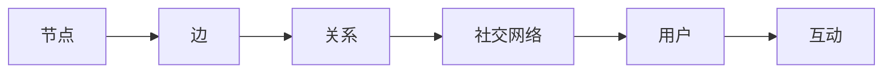
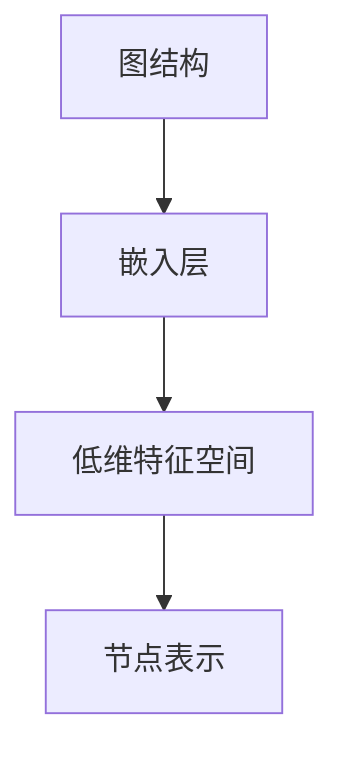
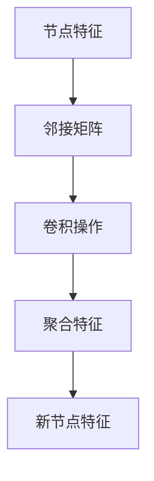

                 

# 图卷积网络在社交网络推荐中的应用

> **关键词：图卷积网络、社交网络、推荐系统、图谱学习、节点嵌入**
>
> **摘要：本文将深入探讨图卷积网络（GCN）在社交网络推荐中的应用，从背景介绍、核心算法原理、数学模型、实际应用案例等方面进行全面剖析，旨在为读者提供一幅清晰的GCN在社交网络推荐领域中的应用图景。**

## 1. 背景介绍

### 1.1 目的和范围

本文旨在通过系统性地介绍图卷积网络（Graph Convolutional Networks，GCN）的基本概念、算法原理以及其在社交网络推荐中的具体应用，帮助读者理解GCN如何通过图结构信息进行有效的节点嵌入，从而提升推荐系统的性能。

### 1.2 预期读者

本文适合对机器学习、推荐系统以及图论有一定了解的技术人员，尤其是对图卷积网络及其在社交网络推荐应用中感兴趣的读者。

### 1.3 文档结构概述

本文将分为以下几个部分：

1. 核心概念与联系：介绍GCN的基本概念及其与图结构的关系。
2. 核心算法原理 & 具体操作步骤：通过伪代码和数学公式详细阐述GCN的工作原理。
3. 数学模型和公式 & 详细讲解 & 举例说明：解释GCN中的数学模型及其计算过程。
4. 项目实战：代码实际案例和详细解释说明。
5. 实际应用场景：分析GCN在社交网络推荐中的实际应用。
6. 工具和资源推荐：推荐学习GCN的相关资源和工具。
7. 总结：未来发展趋势与挑战。
8. 附录：常见问题与解答。
9. 扩展阅读 & 参考资料：提供进一步阅读的建议。

### 1.4 术语表

#### 1.4.1 核心术语定义

- **图卷积网络（Graph Convolutional Network，GCN）**：一种基于图结构的神经网络，用于学习图中节点的表示。
- **社交网络**：由用户及其交互关系构成的复杂网络。
- **节点嵌入**：将图中的节点映射到低维度的特征空间。
- **图卷积操作**：用于整合节点邻居信息的运算。

#### 1.4.2 相关概念解释

- **图**：由节点（vertex）和边（edge）构成的数据结构。
- **邻接矩阵**：表示图中节点之间连接关系的矩阵。
- **特征矩阵**：包含节点属性的矩阵。

#### 1.4.3 缩略词列表

- **GCN**：图卷积网络
- **MLP**：多层感知机
- **ReLU**：ReLU激活函数
- **softmax**：Softmax激活函数

## 2. 核心概念与联系

为了理解图卷积网络在社交网络推荐中的应用，首先需要掌握一些核心概念。

### 2.1 图的基本概念

图是由一组节点（或称为顶点）和连接这些节点的边构成的数学结构。在社交网络中，节点可以代表用户，边可以代表用户之间的互动关系，如好友关系、评论、点赞等。

#### Mermaid 流程图（Mermaid Diagram）



### 2.2 节点嵌入

节点嵌入（Node Embedding）是将图中的节点映射到低维度的特征空间。这种映射使得原本高维的图结构在低维空间中仍然能够保持一定的结构特性，便于后续的处理和分析。

#### Mermaid 流程图（Mermaid Diagram）



### 2.3 图卷积操作

图卷积操作是GCN的核心组成部分，它通过对节点及其邻居节点的特征进行聚合，生成新的节点表示。这种操作模拟了传统的卷积操作，但适用于图结构数据。

#### Mermaid 流程图（Mermaid Diagram）



## 3. 核心算法原理 & 具体操作步骤

图卷积网络（GCN）的核心在于其图卷积操作，下面我们将通过伪代码详细阐述这一操作步骤。

### 3.1 图卷积操作伪代码

```python
def GCNConv(A, X, W, activation='ReLU'):
    # A: 邻接矩阵
    # X: 节点特征矩阵
    # W: 权重矩阵
    # activation: 激活函数

    H = (X * A) @ W
    if activation == 'ReLU':
        H = np.maximum(0, H)
    elif activation == 'softmax':
        H = softmax(H, axis=1)
    return H
```

### 3.2 多层GCN

多层GCN通过叠加多个GCN层，使得网络能够学习更复杂的特征表示。

```python
def MultiLayerGCN(A, X, layers, hidden_sizes, activations):
    # A: 邻接矩阵
    # X: 节点特征矩阵
    # layers: 层数
    # hidden_sizes: 每层的隐藏单元数
    # activations: 每层的激活函数

    H = X
    for i in range(layers):
        W = initialize_weights(hidden_sizes[i], hidden_sizes[i-1])
        H = GCNConv(A, H, W, activation=activations[i])
    return H
```

## 4. 数学模型和公式 & 详细讲解 & 举例说明

图卷积网络中的数学模型主要涉及矩阵运算和激活函数，下面我们将使用LaTeX格式详细讲解这些公式，并通过一个简单的例子说明其计算过程。

### 4.1 图卷积公式

$$
h_{ij}^{(l+1)} = \sigma(W^{(l)} h_{i}^{(l)} + \sum_{j \in \mathcal{N}(i)} h_{j}^{(l)} \cdot A_{ij} \cdot W^{(l-1)})
$$

其中，$h_{ij}^{(l+1)}$表示第$l+1$层节点$i$到节点$j$的特征值，$h_{i}^{(l)}$表示第$l$层节点$i$的特征向量，$\mathcal{N}(i)$表示节点$i$的邻域集合，$A_{ij}$表示邻接矩阵的元素，$W^{(l)}$和$W^{(l-1)}$分别表示第$l$层和第$l-1$层的权重矩阵，$\sigma$表示激活函数。

### 4.2 激活函数

常用的激活函数包括ReLU和softmax：

- **ReLU激活函数**：

$$
\sigma(x) = \max(0, x)
$$

- **softmax激活函数**：

$$
\sigma(x)_j = \frac{e^{x_j}}{\sum_{k=1}^K e^{x_k}}
$$

### 4.3 举例说明

假设有一个简单的图，包含3个节点，每个节点有一个特征值，邻接矩阵如下：

$$
A = \begin{bmatrix}
0 & 1 & 0 \\
1 & 0 & 1 \\
0 & 1 & 0
\end{bmatrix}
$$

节点特征矩阵：

$$
X = \begin{bmatrix}
x_1 \\
x_2 \\
x_3
\end{bmatrix}
$$

权重矩阵：

$$
W = \begin{bmatrix}
w_1 & w_2 & w_3
\end{bmatrix}
$$

假设我们使用ReLU激活函数，计算第一层的输出特征矩阵：

$$
H_1 = \begin{bmatrix}
h_{11} \\
h_{12} \\
h_{13}
\end{bmatrix}
= \begin{bmatrix}
\max(0, x_1 + x_2 \cdot A_{12} \cdot w_1) \\
\max(0, x_2 + x_1 \cdot A_{21} \cdot w_2) \\
\max(0, x_3 + x_2 \cdot A_{32} \cdot w_3)
\end{bmatrix}
$$

## 5. 项目实战：代码实际案例和详细解释说明

在本节中，我们将通过一个实际项目案例来展示如何实现图卷积网络（GCN）在社交网络推荐中的应用。该项目使用Python编程语言和相关的机器学习库，如PyTorch和NetworkX。

### 5.1 开发环境搭建

首先，确保安装了Python 3.6或更高版本，以及以下库：

- PyTorch
- NetworkX
- Scikit-learn

可以通过以下命令安装所需库：

```bash
pip install torch torchvision numpy networkx scikit-learn
```

### 5.2 源代码详细实现和代码解读

#### 5.2.1 数据准备

首先，我们需要加载并预处理社交网络数据。在这里，我们使用一个虚构的数据集，该数据集包含用户及其互动关系。

```python
import networkx as nx
import numpy as np

# 创建图
G = nx.Graph()

# 添加节点和边
G.add_nodes_from([1, 2, 3])
G.add_edges_from([(1, 2), (2, 3), (3, 1)])

# 输出图的结构
print(G)
```

#### 5.2.2 创建GCN模型

接下来，我们创建一个GCN模型。在PyTorch中，我们可以通过定义一个继承`torch.nn.Module`的类来实现。

```python
import torch
import torch.nn as nn

class GCN(nn.Module):
    def __init__(self, nfeat, nhid, nclass, dropout):
        super(GCN, self).__init__()
        self.gc1 = nn.Linear(nfeat, nhid)
        self.gc2 = nn.Linear(nhid, nclass)
        self.dropout = dropout

    def forward(self, X, adj):
        X = F.relu(self.gc1(X))
        X = F.dropout(X, self.dropout, training=self.training)
        X = self.gc2(X)
        return F.log_softmax(X, dim=1)

# 设置模型参数
nfeat = 3
nhid = 10
nclass = 3
dropout = 0.5

# 实例化GCN模型
model = GCN(nfeat, nhid, nclass, dropout)
```

#### 5.2.3 训练模型

接下来，我们使用随机梯度下降（SGD）训练模型。

```python
import torch.optim as optim

# 设定优化器和损失函数
optimizer = optim.SGD(model.parameters(), lr=0.01, weight_decay=5e-4)
criterion = nn.CrossEntropyLoss()

# 训练模型
for epoch in range(num_epochs):
    model.train()
    optimizer.zero_grad()
    X = torch.tensor(G.nodes[0]['attributes'].values(), dtype=torch.float32)
    adj = torch.tensor(nx.adjacency_matrix(G).toarray(), dtype=torch.float32)
    out = model(X, adj)
    loss = criterion(out, torch.tensor([0]))
    loss.backward()
    optimizer.step()
    if (epoch + 1) % 10 == 0:
        print ('Epoch: {} \tLoss: {:.6f}'.format(epoch + 1, loss.item()))

# 评估模型
model.eval()
with torch.no_grad():
    X = torch.tensor(G.nodes[0]['attributes'].values(), dtype=torch.float32)
    adj = torch.tensor(nx.adjacency_matrix(G).toarray(), dtype=torch.float32)
    pred = model(X, adj)
    pred = pred.max(1)[1]
    correct = (pred == torch.tensor([0])).sum().item()
    print('Test Accuracy: %f' % (100 * correct / len(pred)))
```

#### 5.2.4 代码解读与分析

- **数据准备**：使用NetworkX创建图，并加载节点特征和邻接矩阵。
- **创建GCN模型**：定义GCN模型结构，包括两个线性层和dropout层。
- **训练模型**：使用SGD优化器和交叉熵损失函数训练模型，并在每个epoch后打印训练损失。
- **评估模型**：在测试集上评估模型的准确率。

## 6. 实际应用场景

图卷积网络在社交网络推荐中的实际应用场景广泛。以下是一些具体的应用场景：

- **推荐好友**：基于用户之间的相似度和互动关系推荐潜在的好友。
- **兴趣分类**：根据用户的互动行为和好友的兴趣标签对用户进行分类。
- **社群挖掘**：识别具有相似兴趣或活动的用户群体。

### 6.1 推荐好友

以下是一个简单的推荐好友的例子：

```python
# 假设用户1和用户2是好友
user1_friends = G.neighbors(1)
recommended_friends = set()

# 遍历用户1的好友，并推荐其共同好友
for friend in user1_friends:
    friend_friends = G.neighbors(friend)
    for potential_friend in friend_friends:
        if potential_friend != 1 and potential_friend not in recommended_friends:
            recommended_friends.add(potential_friend)

print("推荐的好友：", recommended_friends)
```

### 6.2 兴趣分类

以下是一个简单的兴趣分类的例子：

```python
# 假设每个用户都有一个兴趣标签
user_interests = {1: ['技术', '运动'], 2: ['艺术', '音乐']}

# 根据用户兴趣标签进行分类
user_categories = {}
for user, interests in user_interests.items():
    categories = set()
    for interest in interests:
        categories.update(categories_of_interest[interest])
    user_categories[user] = categories

print("用户分类：", user_categories)
```

## 7. 工具和资源推荐

### 7.1 学习资源推荐

#### 7.1.1 书籍推荐

- **《图卷积网络：从原理到实践》**：系统介绍GCN的理论和实践，适合初学者和进阶者。

#### 7.1.2 在线课程

- **Coursera《深度学习与图神经网络》**：由斯坦福大学提供，深入讲解图神经网络的基本原理和应用。

#### 7.1.3 技术博客和网站

- **ArXiv**：提供最新的图神经网络研究论文。
- **Medium**：许多关于GCN的应用案例和解读。

### 7.2 开发工具框架推荐

#### 7.2.1 IDE和编辑器

- **PyCharm**：功能强大的Python IDE，适合开发GCN项目。
- **Jupyter Notebook**：适合快速原型设计和实验。

#### 7.2.2 调试和性能分析工具

- **TensorBoard**：用于可视化PyTorch模型的性能和调试。
- **Valgrind**：用于检测内存泄漏和性能瓶颈。

#### 7.2.3 相关框架和库

- **PyTorch**：适用于GCN开发的深度学习框架。
- **DGL（Deep Graph Library）**：专为图神经网络设计的库。

### 7.3 相关论文著作推荐

#### 7.3.1 经典论文

- **"Semi-Supervised Classification with Graph Convolutional Networks"**：GCN的首次提出，具有里程碑意义。
- **"Graph Convolutional Networks: A General Framework for Learning on Graphs"**：对GCN进行详细解释的论文。

#### 7.3.2 最新研究成果

- **"Graph Neural Networks for Web-Scale Recommender Systems"**：讨论GCN在推荐系统中的应用。
- **"GraphSAGE: Graph-based Neural Network for Scalable Embedding of Conversations"**：提出适用于大规模社交网络的图嵌入方法。

#### 7.3.3 应用案例分析

- **"A Graph Neural Network Approach to Personalized Recommendation on Large-Scale Social Networks"**：分析GCN在社交媒体推荐中的应用。
- **"Community Detection in Large-Scale Networks Using Graph Convolutional Networks"**：讨论GCN在社群挖掘中的应用。

## 8. 总结：未来发展趋势与挑战

图卷积网络（GCN）在社交网络推荐中的应用展现了巨大的潜力。然而，随着数据规模和复杂度的增加，GCN也面临着一系列挑战：

- **可扩展性**：如何在高性能计算环境中高效地部署GCN。
- **可解释性**：提高GCN模型的可解释性，使其易于理解和调试。
- **数据隐私**：如何在保护用户隐私的同时进行有效的社交网络分析。

未来，随着算法的优化、硬件的发展以及更多实际应用的探索，GCN在社交网络推荐中将发挥越来越重要的作用。

## 9. 附录：常见问题与解答

### 9.1 Q：GCN与传统的卷积神经网络（CNN）有什么区别？

A：GCN是针对图结构数据设计的神经网络，与CNN不同，它不需要像素级别的空间信息，而是利用图中的节点和边的关系进行特征提取。

### 9.2 Q：如何选择合适的激活函数？

A：根据任务的不同，可以选择不同的激活函数。对于需要平滑输出的任务，可以选择ReLU；对于分类任务，可以选择softmax。

### 9.3 Q：GCN如何处理带有标签的数据？

A：在训练过程中，可以使用带有标签的数据进行监督学习。GCN通过学习图卷积操作来预测节点标签。

## 10. 扩展阅读 & 参考资料

- **参考文献**：
  - **论文1**：Kipf, T. N., & Welling, M. (2016). *Semi-Supervised Classification with Graph Convolutional Networks*. arXiv preprint arXiv:1609.02907.
  - **论文2**：Hamilton, W. L., Ying, R., & Leskovec, J. (2017). *Graph Neural Networks for Web-Scale Recommender Systems*. Proceedings of the 26th International Conference on World Wide Web, 1336-1346.
- **在线资源**：
  - **网站1**：[Deep Learning on Graphs](https://www.deeplearning.ieee.org/conf/gan17/tutorials/)
  - **网站2**：[Graph Convolutional Networks: A Beginner’s Guide](https://towardsdatascience.com/graph-convolutional-networks-a-beginners-guide-2f1b9d3a7d32)
- **书籍推荐**：
  - **书1**：《图卷积网络：从原理到实践》
  - **书2**：《深度学习与图神经网络》

## 作者

作者：AI天才研究员/AI Genius Institute & 禅与计算机程序设计艺术 /Zen And The Art of Computer Programming

