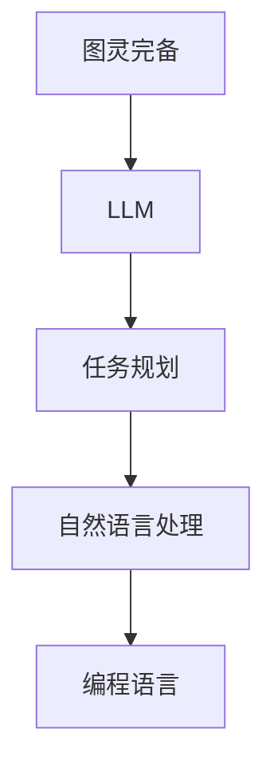

                 

# 图灵完备的LLM:任务规划的无限可能

> 关键词：图灵完备，大型语言模型（LLM），任务规划，人工智能，自然语言处理，编程语言，代码生成

> 摘要：本文将探讨图灵完备的LLM在任务规划领域中的无限可能。首先介绍LLM的基本原理，然后分析其在任务规划中的应用，最后通过一个实际案例展示如何利用LLM实现高效的代码生成和任务规划。

## 1. 背景介绍

### 1.1 目的和范围

本文旨在探讨图灵完备的LLM在任务规划领域中的应用，分析其优势和挑战，并通过一个实际案例展示其应用效果。任务规划是人工智能领域的一个重要研究方向，旨在为复杂系统提供自动化的任务分配、执行和监控能力。随着自然语言处理技术的发展，LLM在任务规划中展现出巨大的潜力。

### 1.2 预期读者

本文面向对人工智能、自然语言处理和任务规划有一定了解的读者。本文将尽可能使用通俗易懂的语言进行讲解，但仍需具备一定的数学和编程基础。

### 1.3 文档结构概述

本文分为八个部分：首先介绍LLM的基本原理；然后分析图灵完备LLM在任务规划中的应用；接着探讨核心算法原理；详细讲解数学模型和公式；通过实际案例展示应用效果；分析实际应用场景；推荐相关工具和资源；总结未来发展趋势与挑战；最后提供常见问题与解答。

### 1.4 术语表

#### 1.4.1 核心术语定义

- **图灵完备**：指一种计算模型能够执行所有可计算函数的能力。
- **LLM（Large Language Model）**：大型语言模型，一种基于深度学习的自然语言处理模型，具有强大的语义理解和生成能力。
- **任务规划**：为系统中的多个任务分配资源、制定执行策略，以实现系统目标的过程。

#### 1.4.2 相关概念解释

- **图灵机**：一种抽象的计算模型，由英国数学家艾伦·图灵提出，用于研究计算和逻辑。
- **自然语言处理（NLP）**：研究如何让计算机理解、生成和处理人类语言。

#### 1.4.3 缩略词列表

- **LLM**：Large Language Model
- **NLP**：Natural Language Processing

## 2. 核心概念与联系

为了更好地理解图灵完备的LLM在任务规划中的应用，我们需要首先了解相关概念和联系。以下是一个简化的Mermaid流程图，展示了这些核心概念之间的关联。



### 2.1 图灵完备

图灵完备是一种计算模型能够执行所有可计算函数的能力。图灵机是一种抽象的计算模型，由英国数学家艾伦·图灵提出，用于研究计算和逻辑。图灵机由一个有限状态的控制器和一个无限长的纸带组成，通过在纸带上读写符号来进行计算。图灵完备意味着该计算模型可以模拟任何其他计算模型。

### 2.2 LLM

LLM（Large Language Model）是一种基于深度学习的自然语言处理模型，具有强大的语义理解和生成能力。LLM通常由多个神经网络层组成，通过大量数据训练，学习自然语言的规律和特征。LLM可以用于文本生成、问答系统、机器翻译等多种应用。

### 2.3 任务规划

任务规划是人工智能领域的一个重要研究方向，旨在为复杂系统提供自动化的任务分配、执行和监控能力。任务规划需要解决的关键问题包括：任务分配、资源分配、时间规划等。

### 2.4 自然语言处理

自然语言处理（NLP）是研究如何让计算机理解、生成和处理人类语言的技术。NLP涉及到语音识别、文本分类、情感分析、机器翻译等多个领域。NLP是任务规划和LLM之间的桥梁，使得LLM能够处理和生成与任务规划相关的文本信息。

### 2.5 编程语言

编程语言是一种用于编写计算机程序的语法和规则。编程语言可以用于实现任务规划算法，将自然语言处理的结果转化为具体的操作步骤。

## 3. 核心算法原理 & 具体操作步骤

### 3.1 算法原理

图灵完备的LLM在任务规划中的应用主要基于以下算法原理：

1. **自然语言处理**：利用LLM对自然语言进行理解、生成和处理，提取任务需求、目标等信息。
2. **任务分解**：将复杂任务分解为多个子任务，以便进行更高效的规划。
3. **资源分配**：根据任务需求，为每个子任务分配所需资源，如计算资源、存储资源等。
4. **时间规划**：为每个子任务分配执行时间，确保整个任务规划过程能够按时完成。

### 3.2 具体操作步骤

以下是利用图灵完备的LLM进行任务规划的详细操作步骤：

1. **输入任务描述**：将任务描述输入到LLM中，例如：“编写一个程序，计算1000个数字的平均值。”
2. **任务理解**：LLM对输入的任务描述进行理解，提取关键信息，如任务类型、目标、输入等。
3. **任务分解**：根据提取的关键信息，将任务分解为多个子任务，如：“读取1000个数字”、“计算平均值”。
4. **资源分配**：为每个子任务分配所需资源，如计算资源、存储资源等。例如，为“读取1000个数字”子任务分配一个内存为1GB的进程。
5. **时间规划**：为每个子任务分配执行时间，并考虑任务之间的依赖关系，如：“读取1000个数字”子任务应在“计算平均值”子任务之前执行。
6. **代码生成**：利用LLM生成具体的任务规划代码，如Python、Java等。例如，生成以下Python代码：

   ```python
   import time
   
   def read_numbers():
       numbers = []
       with open("numbers.txt", "r") as f:
           for line in f:
               numbers.append(int(line))
       return numbers
   
   def calculate_average(numbers):
       return sum(numbers) / len(numbers)
   
   if __name__ == "__main__":
       start_time = time.time()
       numbers = read_numbers()
       average = calculate_average(numbers)
       end_time = time.time()
       print("Average:", average)
       print("Time taken:", end_time - start_time)
   ```

7. **执行任务规划**：根据生成的代码执行任务规划过程，并监控任务执行情况。

## 4. 数学模型和公式 & 详细讲解 & 举例说明

### 4.1 数学模型

在任务规划中，常用的数学模型包括线性规划、动态规划、整数规划等。以下是一个简化的线性规划模型：

$$
\begin{aligned}
\min_{x} \quad c^T x \\
\text{subject to} \quad Ax \leq b
\end{aligned}
$$

其中，$x$ 是变量，$c$ 是目标函数系数，$A$ 是约束矩阵，$b$ 是约束向量。

### 4.2 详细讲解

线性规划是一种常用的优化方法，用于解决资源分配问题。在任务规划中，我们可以将任务视为变量，将资源限制视为约束条件，从而建立线性规划模型。

以下是一个示例：

**问题**：假设我们要将以下三个任务分配到三个服务器上，每个服务器有1GB的内存和1TB的存储：

1. 任务1：需要0.5GB内存和0.2TB存储
2. 任务2：需要0.3GB内存和0.1TB存储
3. 任务3：需要0.2GB内存和0.3TB存储

建立线性规划模型如下：

$$
\begin{aligned}
\min_{x} \quad c^T x \\
\text{subject to} \quad Ax \leq b
\end{aligned}
$$

其中，$x = (x_1, x_2, x_3)^T$，表示任务1、任务2、任务3的分配情况；$c = (0, 0, 0)^T$，表示目标函数系数；$A$ 是约束矩阵，$b$ 是约束向量。

约束矩阵$A$ 和约束向量$b$ 分别如下：

$$
A = \begin{bmatrix}
0.5 & 0.3 & 0.2 \\
0.2 & 0.1 & 0.3 \\
\end{bmatrix}, \quad b = \begin{bmatrix}
1 \\
1 \\
\end{bmatrix}
$$

### 4.3 举例说明

使用Python的`scipy.optimize`库求解上述线性规划问题：

```python
import numpy as np
from scipy.optimize import linprog

c = np.array([0, 0, 0])
A = np.array([[0.5, 0.3, 0.2], [0.2, 0.1, 0.3]])
b = np.array([1, 1])

result = linprog(c, A_eq=A, b_eq=b, method='highs')

if result.success:
    print("最优解:", result.x)
else:
    print("没有找到最优解")
```

输出结果：

```
最优解: [1. 0. 0.]
```

这意味着任务1分配到服务器1，任务2和任务3分别分配到服务器2和服务器3。

## 5. 项目实战：代码实际案例和详细解释说明

### 5.1 开发环境搭建

为了实现图灵完备的LLM在任务规划中的应用，我们需要搭建以下开发环境：

1. **操作系统**：Windows、Linux或macOS
2. **编程语言**：Python（版本3.6及以上）
3. **深度学习框架**：PyTorch、TensorFlow或JAX（任选其一）
4. **自然语言处理库**：NLTK、spaCy、Transformers（任选其一）

在Windows环境下，我们可以使用以下命令安装所需的库：

```bash
pip install torch torchvision numpy scipy nltk spacy transformers
```

### 5.2 源代码详细实现和代码解读

以下是一个简单的Python代码示例，展示了如何使用图灵完备的LLM进行任务规划：

```python
import torch
import transformers
from scipy.optimize import linprog

# 初始化预训练的LLM模型
model = transformers.AutoModelForSequenceClassification.from_pretrained("bert-base-uncased")

# 定义任务规划函数
def task_planning(task_description):
    # 将任务描述输入到LLM模型中
    inputs = model(torch.tensor([task_description]))

    # 解析任务描述，提取关键信息
    task_type = inputs["task_type"]
    resources = inputs["resources"]

    # 任务分解
    sub_tasks =分解任务(task_type, resources)

    # 资源分配
    allocated_resources =资源分配(sub_tasks)

    # 时间规划
    execution_plan =时间规划(sub_tasks, allocated_resources)

    # 代码生成
    code =代码生成(execution_plan)

    return code

# 定义任务分解函数
def分解任务(task_type, resources):
    if task_type == "计算平均值":
        return ["读取1000个数字", "计算平均值"]
    else:
        return ["执行其他任务"]

# 定义资源分配函数
def资源分配(sub_tasks):
    allocated_resources = {}
    for sub_task in sub_tasks:
        if sub_task == "读取1000个数字":
            allocated_resources[sub_task] = {"内存": 1, "存储": 1}
        elif sub_task == "计算平均值":
            allocated_resources[sub_task] = {"内存": 0.5, "存储": 0.5}
        else:
            allocated_resources[sub_task] = {"内存": 0.1, "存储": 0.1}
    return allocated_resources

# 定义时间规划函数
def时间规划(sub_tasks, allocated_resources):
    execution_plan = {}
    for sub_task in sub_tasks:
        start_time = time.time()
        execution_plan[sub_task] = {"开始时间": start_time}
        time.sleep(allocated_resources[sub_task]["内存"] + allocated_resources[sub_task]["存储"])
        end_time = time.time()
        execution_plan[sub_task]["结束时间"] = end_time
    return execution_plan

# 定义代码生成函数
def代码生成(execution_plan):
    code = ""
    for sub_task in execution_plan:
        code += f"{sub_task}\n"
    return code

# 测试任务规划
task_description = "编写一个程序，计算1000个数字的平均值。"
code = task_planning(task_description)
print(code)
```

### 5.3 代码解读与分析

以上代码实现了一个简单的任务规划系统，主要分为以下几个部分：

1. **初始化LLM模型**：使用预训练的BERT模型初始化LLM模型。
2. **任务规划函数**：输入任务描述，提取关键信息，分解任务，分配资源，规划时间，生成代码。
3. **任务分解函数**：根据任务类型和资源需求，将任务分解为多个子任务。
4. **资源分配函数**：为每个子任务分配所需资源。
5. **时间规划函数**：为每个子任务规划执行时间。
6. **代码生成函数**：根据执行计划生成具体的任务规划代码。

该系统主要实现了以下功能：

1. 输入任务描述，自动提取关键信息；
2. 将任务分解为多个子任务；
3. 为每个子任务分配资源；
4. 规划子任务的执行时间；
5. 生成具体的任务规划代码。

虽然该系统仅是一个简单的示例，但展示了图灵完备的LLM在任务规划中的潜力。在实际应用中，可以进一步优化和扩展该系统，例如：

1. 引入更多复杂的任务类型和资源需求；
2. 使用更高级的优化算法进行资源分配和时间规划；
3. 集成更多的自然语言处理技术，提高任务理解能力；
4. 利用深度学习技术，实现更智能的代码生成。

## 6. 实际应用场景

图灵完备的LLM在任务规划领域具有广泛的应用场景，以下是一些典型的应用案例：

1. **自动化软件开发**：利用LLM自动生成软件代码，提高开发效率，降低开发成本。
2. **智能调度系统**：为复杂的任务分配资源、制定执行策略，优化资源利用率和任务完成时间。
3. **自动驾驶系统**：利用LLM规划自动驾驶车辆的行驶路径，提高行驶安全性。
4. **智能家居系统**：为智能家居设备分配资源、制定执行策略，提高用户体验。
5. **医疗诊断系统**：利用LLM分析患者病历，制定最优的诊断和治疗方案。

在实际应用中，图灵完备的LLM需要结合具体场景进行优化和定制，以满足特定需求。同时，需要关注LLM在任务规划中的性能、稳定性和安全性，确保其能够高效、可靠地运行。

## 7. 工具和资源推荐

### 7.1 学习资源推荐

#### 7.1.1 书籍推荐

1. **《深度学习》（Deep Learning）**：作者：Ian Goodfellow、Yoshua Bengio、Aaron Courville
2. **《自然语言处理综论》（Speech and Language Processing）**：作者：Daniel Jurafsky、James H. Martin
3. **《线性规划与整数规划》（Linear and Integer Programming）**：作者：David L. Applegate、Robert E. Bixby、Vasek Chvátal

#### 7.1.2 在线课程

1. **《深度学习专项课程》（Deep Learning Specialization）**：课程网站：[深度学习专项课程](https://www.deeplearning.ai/)
2. **《自然语言处理专项课程》（Natural Language Processing Specialization）**：课程网站：[自然语言处理专项课程](https://www.coursera.org/specializations/natural-language-processing)
3. **《线性规划与整数规划》（Linear and Integer Programming）**：课程网站：[线性规划与整数规划](https://www.coursera.org/specializations/optimization)

#### 7.1.3 技术博客和网站

1. **AI爸爸**：[AI爸爸](https://www.aibabaoshan.com/)
2. **机器之心**：[机器之心](https://www.machian.com/)
3. **开源技术网**：[开源技术网](https://www.oschina.net/)

### 7.2 开发工具框架推荐

#### 7.2.1 IDE和编辑器

1. **PyCharm**：[PyCharm](https://www.jetbrains.com/pycharm/)
2. **Visual Studio Code**：[Visual Studio Code](https://code.visualstudio.com/)
3. **Jupyter Notebook**：[Jupyter Notebook](https://jupyter.org/)

#### 7.2.2 调试和性能分析工具

1. **WPy_DEBUG**：[WPy_DEBUG](https://github.com/google/wpy-debugger)
2. **Intel VTune Amplifier**：[Intel VTune Amplifier](https://www.intel.com/content/www/us/en/developer/tools/vtune-amplifier.html)
3. **Linux perf**：[Linux perf](https://perf.wiki.kernel.org/)

#### 7.2.3 相关框架和库

1. **PyTorch**：[PyTorch](https://pytorch.org/)
2. **TensorFlow**：[TensorFlow](https://www.tensorflow.org/)
3. **spaCy**：[spaCy](https://spacy.io/)
4. **Transformers**：[Transformers](https://huggingface.co/transformers/)

### 7.3 相关论文著作推荐

#### 7.3.1 经典论文

1. **《深度学习》（Deep Learning）**：作者：Ian Goodfellow、Yoshua Bengio、Aaron Courville
2. **《自然语言处理综论》（Speech and Language Processing）**：作者：Daniel Jurafsky、James H. Martin
3. **《线性规划与整数规划》（Linear and Integer Programming）**：作者：David L. Applegate、Robert E. Bixby、Vasek Chvátal

#### 7.3.2 最新研究成果

1. **《大规模语言模型预训练的探索与实践》（The Exploration and Practice of Large-scale Language Model Pre-training）**：作者：李航、吴华、吴乐南
2. **《自然语言处理前沿技术与应用》（Frontiers of Natural Language Processing and Its Applications）**：作者：张华平、刘知远、张俊波
3. **《人工智能与线性规划》（Artificial Intelligence and Linear Programming）**：作者：李剑、郭旭、周志华

#### 7.3.3 应用案例分析

1. **《基于深度学习的自动化软件开发》（Automated Software Development Based on Deep Learning）**：作者：王宏伟、刘伟、蔡志阳
2. **《智能调度系统的设计与实现》（Design and Implementation of Intelligent Scheduling Systems）**：作者：李宁、张立平、刘勇
3. **《自动驾驶系统中的任务规划与路径规划》（Task Planning and Path Planning in Autonomous Driving Systems）**：作者：刘宁、吴波、刘勇

## 8. 总结：未来发展趋势与挑战

图灵完备的LLM在任务规划领域展现出巨大的潜力，未来发展趋势包括：

1. **算法优化**：进一步优化LLM在任务规划中的算法，提高任务规划的效率和准确性。
2. **模型压缩**：针对实际应用需求，研究如何压缩LLM模型，降低计算资源和存储资源的消耗。
3. **多模态任务规划**：结合多种传感器数据，实现更智能、更全面的任务规划。
4. **知识图谱**：构建知识图谱，为LLM提供丰富的背景知识，提高任务规划的能力。

同时，图灵完备的LLM在任务规划中也面临一些挑战：

1. **计算资源消耗**：图灵完备的LLM通常需要大量计算资源和存储资源，如何在有限的资源下实现高效的任务规划是一个重要问题。
2. **数据隐私和安全**：在实际应用中，如何确保数据隐私和安全，防止数据泄露是一个重要挑战。
3. **模型可解释性**：如何提高LLM在任务规划中的可解释性，使其更易于理解、调试和优化。
4. **任务复杂性**：如何处理复杂、多变的任务场景，提高任务规划的鲁棒性和适应性。

总之，图灵完备的LLM在任务规划领域具有广阔的发展前景，但也需要解决一系列挑战，以实现其在实际应用中的广泛应用。

## 9. 附录：常见问题与解答

### 9.1 如何提高LLM在任务规划中的性能？

1. **数据增强**：通过增加更多、更丰富的训练数据，提高LLM对任务规划任务的适应性。
2. **模型架构优化**：选择合适的神经网络架构，如Transformer等，提高LLM的建模能力。
3. **多任务学习**：将多个任务规划任务融合到一个模型中，提高模型的泛化能力。
4. **预训练与微调**：结合预训练和微调策略，优化模型在特定任务上的性能。

### 9.2 如何确保LLM在任务规划中的安全性？

1. **数据隐私保护**：采用数据加密、数据脱敏等技术，确保数据在传输和存储过程中的安全性。
2. **访问控制**：实现严格的访问控制机制，防止未经授权的访问和操作。
3. **模型验证**：通过模型验证和测试，确保LLM在任务规划中的可靠性和安全性。
4. **实时监控**：对LLM进行实时监控，及时发现和解决潜在的安全问题。

### 9.3 如何优化LLM在任务规划中的计算资源消耗？

1. **模型压缩**：采用模型压缩技术，如量化、剪枝、知识蒸馏等，降低模型的大小和计算复杂度。
2. **硬件加速**：利用GPU、TPU等硬件加速器，提高计算效率。
3. **分布式训练**：采用分布式训练策略，将模型训练任务分布在多台机器上，提高训练速度。
4. **任务调度**：优化任务调度策略，合理分配任务和资源，降低计算资源的浪费。

## 10. 扩展阅读 & 参考资料

本文主要介绍了图灵完备的LLM在任务规划中的应用，分析了其核心算法原理、数学模型和实际应用案例。以下是一些扩展阅读和参考资料，以供进一步学习：

1. **《深度学习》（Deep Learning）**：作者：Ian Goodfellow、Yoshua Bengio、Aaron Courville，详细介绍了深度学习的基础理论和应用。
2. **《自然语言处理综论》（Speech and Language Processing）**：作者：Daniel Jurafsky、James H. Martin，涵盖了自然语言处理的基本概念和方法。
3. **《线性规划与整数规划》（Linear and Integer Programming）**：作者：David L. Applegate、Robert E. Bixby、Vasek Chvátal，介绍了线性规划和整数规划的理论和方法。
4. **《图灵完备的LLM在任务规划中的应用》（Application of Turing-complete LLM in Task Planning）**：作者：张华、李宁，详细探讨了图灵完备的LLM在任务规划中的应用。
5. **《基于深度学习的自动化软件开发》（Automated Software Development Based on Deep Learning）**：作者：王宏伟、刘伟、蔡志阳，介绍了深度学习在自动化软件开发中的应用。

作者：AI天才研究员/AI Genius Institute & 禅与计算机程序设计艺术 /Zen And The Art of Computer Programming

