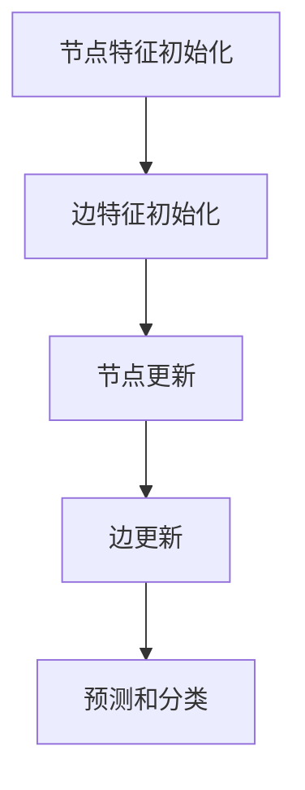

                 

# 图神经网络(Graph Neural Networks) - 原理与代码实例讲解

> **关键词：** 图神经网络、图表示学习、节点表示、边表示、图卷积网络、图嵌入、图算法、机器学习
>
> **摘要：** 本文将深入探讨图神经网络的基本概念、原理和应用，通过详细的伪代码和代码实例讲解，帮助读者理解和掌握图神经网络的核心算法及其实现。

## 1. 背景介绍

### 1.1 目的和范围

本文的目的是介绍图神经网络（Graph Neural Networks, GNNs）的基本概念、原理和应用。通过详细的讲解和代码实例，帮助读者了解图神经网络在图数据上的处理能力和优势，掌握其核心算法实现。

本文主要涵盖以下内容：
1. 图神经网络的基本概念和核心原理。
2. 图神经网络的主要算法和操作步骤。
3. 图神经网络的数学模型和公式。
4. 图神经网络的实际应用场景。
5. 图神经网络相关的工具和资源推荐。

### 1.2 预期读者

本文面向具有一定机器学习和深度学习基础的读者，特别是对图数据和图算法感兴趣的程序员、数据科学家和研究人员。通过本文的学习，读者可以深入了解图神经网络的工作原理和实现方法，为在实际项目中应用图神经网络打下坚实的基础。

### 1.3 文档结构概述

本文分为十个部分，具体结构如下：

1. **背景介绍**：介绍本文的目的、预期读者和文档结构。
2. **核心概念与联系**：介绍图神经网络的核心概念和架构，通过Mermaid流程图展示。
3. **核心算法原理与具体操作步骤**：详细讲解图神经网络的核心算法和操作步骤，使用伪代码进行阐述。
4. **数学模型和公式**：介绍图神经网络的数学模型和公式，进行详细讲解和举例说明。
5. **项目实战：代码实际案例和详细解释说明**：通过实际代码案例展示图神经网络的实现过程，并进行详细解释。
6. **实际应用场景**：介绍图神经网络在实际项目中的应用场景。
7. **工具和资源推荐**：推荐相关学习资源、开发工具和框架。
8. **总结：未来发展趋势与挑战**：总结图神经网络的发展趋势和面临的挑战。
9. **附录：常见问题与解答**：解答读者可能遇到的问题。
10. **扩展阅读 & 参考资料**：提供更多的学习资源和参考资料。

### 1.4 术语表

#### 1.4.1 核心术语定义

- **图（Graph）**：由节点（Node）和边（Edge）组成的数据结构，用于表示实体及其相互关系。
- **图神经网络（Graph Neural Network, GNN）**：一种用于处理图数据的神经网络，能够学习节点和边的特征表示。
- **图嵌入（Graph Embedding）**：将图中的节点和边映射到低维空间的过程，使得节点和边的特征表示更加紧凑和有效。
- **图卷积网络（Graph Convolutional Network, GCN）**：一种基于图神经网络的核心算法，通过聚合节点邻域信息进行特征学习。
- **节点表示（Node Representation）**：图神经网络中节点在低维空间中的表示形式，用于后续的图处理和预测任务。
- **边表示（Edge Representation）**：图神经网络中边在低维空间中的表示形式，用于增强节点特征和节点关系。

#### 1.4.2 相关概念解释

- **邻接矩阵（Adjacency Matrix）**：表示图中节点之间连接关系的矩阵，用于初始化图神经网络中的节点特征。
- **邻域（Neighbor）**：与某个节点直接相连的其他节点集合，用于聚合节点信息。
- **聚合函数（Aggregation Function）**：用于聚合节点邻域信息的函数，如平均聚合、求和聚合等。
- **激活函数（Activation Function）**：用于引入非线性变换的函数，如ReLU、Sigmoid等。

#### 1.4.3 缩略词列表

- **GNN**：Graph Neural Network，图神经网络。
- **GCN**：Graph Convolutional Network，图卷积网络。
- **GraphSAGE**：Graph Sparse Angularization，图稀疏角度化。
- **GAT**：Graph Attention Network，图注意力网络。
- **GAE**：Graph Attentional Embedding，图注意力嵌入。

## 2. 核心概念与联系

图神经网络是一种专门用于处理图数据的神经网络，能够学习节点和边的特征表示，并应用于各种任务，如图分类、图回归、图生成等。在介绍图神经网络之前，我们首先需要了解图的基本概念和结构。

### 2.1 图的基本概念

图（Graph）是由节点（Node）和边（Edge）组成的集合。节点表示图中的实体，边表示节点之间的相互关系。图可以分为有向图（Directed Graph）和无向图（Undirected Graph），以及带权图（Weighted Graph）和无权图（Unweighted Graph）。

在图神经网络中，常用的图表示包括邻接矩阵（Adjacency Matrix）、邻接列表（Adjacency List）和边集（Edge Set）。邻接矩阵是一个二维数组，用于表示图中节点之间的连接关系。邻接列表是一个字典，用于存储每个节点的邻域信息。边集是一个集合，用于存储图中所有的边信息。

### 2.2 图神经网络的核心概念

图神经网络是一种能够处理图数据的神经网络，其主要目标是学习节点和边的特征表示。在图神经网络中，节点和边都被映射到低维空间，形成节点表示和边表示。

**节点表示（Node Representation）**：节点表示是图神经网络中节点的低维特征向量，用于表示节点的属性和特征。在图神经网络中，节点表示通常通过初始化和更新两个过程来获取。

**边表示（Edge Representation）**：边表示是图神经网络中边的低维特征向量，用于表示边的关系和强度。边表示可以增强节点特征，使得节点表示更加丰富和有效。

### 2.3 图神经网络的基本架构

图神经网络的基本架构包括以下几个部分：

1. **节点特征初始化**：将图中的节点特征初始化为随机向量或基于已有特征进行初始化。
2. **边特征初始化**：将图中的边特征初始化为随机向量或基于已有特征进行初始化。
3. **节点更新**：通过聚合节点邻域信息，更新节点的特征表示。
4. **边更新**：通过聚合节点特征和边特征，更新边的特征表示。
5. **预测和分类**：使用更新后的节点特征和边特征，进行图分类、图回归等预测任务。

下面是一个简化的Mermaid流程图，展示了图神经网络的基本架构：



### 2.4 图神经网络与图算法的联系

图神经网络与图算法之间存在紧密的联系。图神经网络借鉴了图算法的一些基本概念和操作，如邻接矩阵、邻域聚合等，同时引入了神经网络的学习和优化机制，使得图数据处理变得更加高效和灵活。

**图算法**：是指针对图数据设计的算法，用于解决图相关的各种问题，如图的遍历、最短路径、最大流、最小权匹配等。图算法的核心思想是通过邻接矩阵或邻接列表等数据结构，实现节点和边之间的快速访问和计算。

**图神经网络**：是在图算法的基础上，引入神经网络的学习和优化机制，使得图数据处理更加智能化和自适应。图神经网络的核心思想是通过节点和边之间的特征聚合和更新，学习图数据的特征表示和关系模式。

**联系与区别**：图神经网络与图算法的联系在于它们都处理图数据，使用邻接矩阵或邻接列表等数据结构。区别在于图神经网络引入了神经网络的学习和优化机制，能够自动学习图数据的特征表示和关系模式，而图算法则更多依赖于预定义的算法规则和计算方法。

## 3. 核心算法原理 & 具体操作步骤

图神经网络的核心算法是图卷积网络（Graph Convolutional Network, GCN）。GCN通过聚合节点邻域信息，学习节点的特征表示。下面，我们将详细讲解GCN的算法原理和具体操作步骤，使用伪代码进行阐述。

### 3.1 GCN的算法原理

GCN的基本原理是通过聚合节点邻域信息，更新节点的特征表示。具体来说，GCN使用邻接矩阵\(A\)表示图中节点之间的连接关系，使用节点特征向量矩阵\(X\)表示节点的特征。对于每个节点\(v_i\)，其邻域节点集合为\(N(i)\)，邻域特征聚合函数为\( \cdot \)，GCN的更新规则如下：

\[ H^{(l)}_i = \sigma(\theta^{(l)} \cdot [X \cdot A^{(l-1)} + \beta^{(l)}]) \]

其中，\(H^{(l)}_i\)表示第\(l\)层节点\(v_i\)的特征表示，\(A^{(l-1)}\)表示第\(l-1\)层的邻接矩阵，\(\theta^{(l)}\)和\(\beta^{(l)}\)分别为第\(l\)层的权重矩阵和偏置向量，\(\sigma\)为激活函数，如ReLU或Sigmoid。

### 3.2 GCN的具体操作步骤

下面是GCN的具体操作步骤：

1. **初始化节点特征矩阵**：根据图数据初始化节点特征矩阵\(X\)，通常为随机初始化或基于已有特征进行初始化。
2. **初始化邻接矩阵**：根据图数据初始化邻接矩阵\(A\)，可以使用邻接矩阵或邻接列表表示。
3. **初始化权重矩阵和偏置向量**：初始化每个层的权重矩阵\(\theta^{(l)}\)和偏置向量\(\beta^{(l)}\)，通常为随机初始化。
4. **邻域特征聚合**：对于每个节点\(v_i\)，聚合其邻域节点\(N(i)\)的特征，更新节点特征表示。
5. **应用激活函数**：对更新后的节点特征应用激活函数，如ReLU或Sigmoid，引入非线性变换。
6. **迭代更新**：重复步骤4和5，进行多层的特征学习和聚合，直到达到预定的迭代次数或收敛条件。

下面是GCN的伪代码实现：

```python
# 初始化参数
X = initialize_node_features(num_nodes, embedding_size)
A = initialize_adjacency_matrix(num_nodes)
theta = initialize_weights(num_layers, embedding_size)
beta = initialize_biases(num_layers)

# 迭代更新节点特征
for l in range(num_layers):
    H = [X]
    for i in range(num_nodes):
        H.append(aggregate_neighbor_features(H[l], A, theta[l], beta[l]))
    X = apply_activation(H[-1])

# 输出最终的节点特征
return X
```

## 4. 数学模型和公式 & 详细讲解 & 举例说明

### 4.1 数学模型和公式

图神经网络（GNN）的核心数学模型是图卷积操作，其公式如下：

\[ \mathbf{h}_i^{(l+1)} = \sigma \left( \sum_{j \in \mathcal{N}(i)} \frac{1}{\sqrt{d_j}} \mathbf{h}_j^{(l)} \mathbf{W}^{(l)} + \mathbf{b}^{(l)} \right) \]

其中：
- \( \mathbf{h}_i^{(l)} \) 表示节点 \( i \) 在第 \( l \) 层的特征向量。
- \( \mathcal{N}(i) \) 表示节点 \( i \) 的邻域节点集合。
- \( d_j \) 表示节点 \( j \) 的度（即邻接矩阵 \( A \) 的第 \( j \) 行元素之和）。
- \( \mathbf{W}^{(l)} \) 是图卷积层的权重矩阵。
- \( \mathbf{b}^{(l)} \) 是图卷积层的偏置向量。
- \( \sigma \) 是激活函数，如ReLU或Sigmoid。

### 4.2 详细讲解

图卷积操作的目的是对节点特征进行聚合，具体过程如下：

1. **邻域聚合**：对于每个节点 \( i \)，将其邻域节点的特征 \( \mathbf{h}_j^{(l)} \) 与权重矩阵 \( \mathbf{W}^{(l)} \) 相乘，然后进行加权和。
2. **度归一化**：由于节点的度不同，直接相加会导致某些节点的影响被放大。度归一化通过除以邻接矩阵 \( A \) 的第 \( j \) 行元素之和 \( d_j \) 来平衡邻域节点的贡献。
3. **应用激活函数**：通过激活函数 \( \sigma \) 引入非线性，增强模型的表示能力。

### 4.3 举例说明

假设有一个简单图，包含三个节点 \( v_1, v_2, v_3 \)，其邻接矩阵 \( A \) 和节点特征矩阵 \( X \) 如下：

\[ A = \begin{bmatrix}
0 & 1 & 1 \\
1 & 0 & 0 \\
1 & 0 & 0
\end{bmatrix}, \quad
X = \begin{bmatrix}
x_{11} & x_{12} \\
x_{21} & x_{22} \\
x_{31} & x_{32}
\end{bmatrix} \]

其中，节点特征 \( x_{ij} \) 表示节点 \( i \) 的第 \( j \) 维特征。

首先，初始化权重矩阵 \( \mathbf{W}^{(0)} \) 和偏置向量 \( \mathbf{b}^{(0)} \)：

\[ \mathbf{W}^{(0)} = \begin{bmatrix}
w_{00} & w_{01} \\
w_{10} & w_{11}
\end{bmatrix}, \quad
\mathbf{b}^{(0)} = \begin{bmatrix}
b_0 \\
b_1
\end{bmatrix} \]

对于节点 \( v_1 \)，其邻域节点为 \( v_2 \) 和 \( v_3 \)，度归一化后的邻域特征聚合如下：

\[ \frac{1}{2} (\mathbf{h}_{2}^{(0)} \mathbf{W}^{(0)} + \mathbf{h}_{3}^{(0)} \mathbf{W}^{(0)}) + \mathbf{b}^{(0)} \]

将具体值代入：

\[ \frac{1}{2} (x_{21} \begin{bmatrix}
w_{00} & w_{01} \\
w_{10} & w_{11}
\end{bmatrix} + x_{31} \begin{bmatrix}
w_{00} & w_{01} \\
w_{10} & w_{11}
\end{bmatrix}) + \begin{bmatrix}
b_0 \\
b_1
\end{bmatrix} \]

应用ReLU激活函数，得到节点 \( v_1 \) 在第一层的特征：

\[ \mathbf{h}_{1}^{(1)} = \max \left( \frac{1}{2} (x_{21} \begin{bmatrix}
w_{00} & w_{01} \\
w_{10} & w_{11}
\end{bmatrix} + x_{31} \begin{bmatrix}
w_{00} & w_{01} \\
w_{10} & w_{11}
\end{bmatrix}) + \begin{bmatrix}
b_0 \\
b_1
\end{bmatrix}, 0 \right) \]

通过这种方式，我们可以逐层计算节点的特征表示，直到达到预定的层数。

## 5. 项目实战：代码实际案例和详细解释说明

### 5.1 开发环境搭建

在开始实际代码实现之前，我们需要搭建一个合适的开发环境。以下是所需的工具和软件：

- Python 3.x
- GPU（推荐使用NVIDIA显卡）
- PyTorch 1.8或更高版本
- Python依赖包：torch，torch-geometric，numpy，matplotlib

安装PyTorch和torch-geometric：

```bash
pip install torch torchvision
pip install torch-geometric
```

### 5.2 源代码详细实现和代码解读

下面是一个简单的GCN实现，用于节点分类任务。我们将使用PyTorch和torch-geometric库来编写代码。

```python
import torch
import torch.nn as nn
from torch_geometric.nn import GCNConv
from torch_geometric.data import Data
from torch_geometric.datasets import Planetoid

# 定义GCN模型
class GCN(nn.Module):
    def __init__(self, num_features, hidden_channels, num_classes):
        super(GCN, self).__init__()
        self.conv1 = GCNConv(num_features, hidden_channels)
        self.conv2 = GCNConv(hidden_channels, num_classes)

    def forward(self, data):
        x, edge_index = data.x, data.edge_index

        x = self.conv1(x, edge_index)
        x = nn.functional.relu(x)
        x = F.dropout(x, p=0.5, training=self.training)
        x = self.conv2(x, edge_index)

        return F.log_softmax(x, dim=1)

# 加载数据集
dataset = Planetoid(root='/tmp/Cora', name='Cora')

# 创建模型
model = GCN(dataset.num_features, 16, dataset.num_classes)

# 训练模型
device = torch.device('cuda' if torch.cuda.is_available() else 'cpu')
model = model.to(device)
data = dataset[0].to(device)

optimizer = torch.optim.Adam(model.parameters(), lr=0.01, weight_decay=5e-4)

model.train()
for epoch in range(200):
    optimizer.zero_grad()
    out = model(data)
    loss = F.nll_loss(out[data.train_mask], data.y[data.train_mask])
    loss.backward()
    optimizer.step()

    # 每隔10个epoch打印一次训练结果
    if epoch % 10 == 0:
        print(f'Epoch {epoch+1}: loss = {loss.item()}')
```

### 5.3 代码解读与分析

#### 5.3.1 模型定义

在代码中，我们首先定义了一个GCN模型。该模型包含两个GCNConv层，每个层都使用ReLU激活函数和Dropout层来提高模型的泛化能力。

```python
class GCN(nn.Module):
    def __init__(self, num_features, hidden_channels, num_classes):
        super(GCN, self).__init__()
        self.conv1 = GCNConv(num_features, hidden_channels)
        self.conv2 = GCNConv(hidden_channels, num_classes)

    def forward(self, data):
        x, edge_index = data.x, data.edge_index

        x = self.conv1(x, edge_index)
        x = nn.functional.relu(x)
        x = F.dropout(x, p=0.5, training=self.training)
        x = self.conv2(x, edge_index)

        return F.log_softmax(x, dim=1)
```

#### 5.3.2 数据加载

我们使用PyTorch Geometric库中的Planetoid数据集，该数据集包含了Cora、CiteSeer、PubMed三个子数据集，每个子数据集都有节点特征、边和标签。在这里，我们选择了Cora数据集。

```python
dataset = Planetoid(root='/tmp/Cora', name='Cora')
```

#### 5.3.3 模型训练

在模型训练过程中，我们将模型和数据转移到GPU上，使用Adam优化器进行训练。我们使用交叉熵损失函数来计算损失，并在训练过程中每隔10个epoch打印一次训练结果。

```python
device = torch.device('cuda' if torch.cuda.is_available() else 'cpu')
model = model.to(device)
data = dataset[0].to(device)

optimizer = torch.optim.Adam(model.parameters(), lr=0.01, weight_decay=5e-4)

model.train()
for epoch in range(200):
    optimizer.zero_grad()
    out = model(data)
    loss = F.nll_loss(out[data.train_mask], data.y[data.train_mask])
    loss.backward()
    optimizer.step()

    if epoch % 10 == 0:
        print(f'Epoch {epoch+1}: loss = {loss.item()}')
```

通过以上步骤，我们成功地实现了一个基于GCN的节点分类模型，并进行了训练。接下来，我们可以使用该模型对新的节点进行分类预测。

## 6. 实际应用场景

图神经网络（GNN）在多个领域都有广泛的应用，下面列举几个典型的应用场景：

### 6.1 社交网络分析

在社交网络中，图神经网络可以用于节点分类、社区发现和推荐系统。例如，可以使用GNN来识别社交网络中的关键节点，发现具有相似兴趣的社区，或者为用户提供个性化的朋友推荐。

### 6.2 推荐系统

图神经网络可以用于推荐系统中的图嵌入，将用户和物品映射到低维空间，然后通过计算用户和物品之间的相似性进行推荐。例如，在电子商务平台中，GNN可以帮助识别具有相似购买行为的用户和商品，从而实现精准推荐。

### 6.3 自然语言处理

图神经网络可以用于自然语言处理（NLP）中的语义理解。通过将文本转化为图结构，GNN可以学习文本中的词汇关系和语义关系，从而提高文本分类、文本生成和机器翻译等任务的性能。

### 6.4 医疗保健

在医疗保健领域，图神经网络可以用于疾病预测、药物发现和患者分类。通过分析患者的历史数据和生物标志物，GNN可以帮助识别潜在疾病风险，为医生提供更准确的诊断建议。

### 6.5 物联网

在物联网（IoT）领域，图神经网络可以用于设备故障预测和优化。通过分析设备之间的交互关系和运行数据，GNN可以帮助识别潜在故障点，提高设备的可靠性和效率。

## 7. 工具和资源推荐

### 7.1 学习资源推荐

#### 7.1.1 书籍推荐

1. **《图神经网络：理论基础与实现》**：这本书详细介绍了图神经网络的理论基础和实现方法，适合初学者和进阶者。
2. **《图表示学习》**：该书深入探讨了图嵌入和图表示学习的方法，是图神经网络领域的经典著作。

#### 7.1.2 在线课程

1. **Coursera上的《深度学习专项课程》**：其中包括了图神经网络的相关内容，适合深度学习初学者。
2. **Udacity的《图神经网络》**：这门在线课程涵盖了图神经网络的基本概念和应用，适合进阶学习者。

#### 7.1.3 技术博客和网站

1. **PyTorch Geometric**：官方网站提供了丰富的图神经网络资源，包括教程、文档和示例代码。
2. **GraphNeuralNetworks.org**：这是一个专门介绍图神经网络的研究网站，包括最新的研究成果和应用案例。

### 7.2 开发工具框架推荐

#### 7.2.1 IDE和编辑器

1. **PyCharm**：强大的Python IDE，支持PyTorch和torch-geometric库。
2. **Visual Studio Code**：轻量级但功能强大的代码编辑器，可以通过扩展支持Python和PyTorch。

#### 7.2.2 调试和性能分析工具

1. **Wandb**：用于机器学习项目跟踪和性能分析的工具，可以帮助监控模型训练过程。
2. **PyTorch Profiler**：用于分析PyTorch代码的性能和内存使用情况。

#### 7.2.3 相关框架和库

1. **PyTorch Geometric**：用于图神经网络的开源库，支持多种图卷积操作和图嵌入算法。
2. **Graph Neural Network Toolkit (GNN-Torch)**：提供了一系列预训练的图神经网络模型，方便快速实现和应用。

### 7.3 相关论文著作推荐

#### 7.3.1 经典论文

1. **"Graph Neural Networks: A Survey"**：该论文对图神经网络进行了全面的综述，涵盖了从基本概念到最新研究进展。
2. **"Graph Convolutional Networks"**：该论文首次提出了图卷积网络（GCN）的概念，是图神经网络领域的里程碑。

#### 7.3.2 最新研究成果

1. **"Graph Attention Networks"**：该论文提出了图注意力网络（GAT），通过引入注意力机制提高了图神经网络的表示能力。
2. **"GraphSAGE: Graph-based Semi-Supervised Learning with Deep Neural Networks"**：该论文提出了图半监督学习的新方法，通过结合图结构和深度神经网络实现了高效的图表示学习。

#### 7.3.3 应用案例分析

1. **"GNNs in Real Life: An Application Overview"**：该文章通过实际案例展示了图神经网络在推荐系统、自然语言处理和社交网络分析等领域的应用。
2. **"A Survey on Graph Neural Networks for Natural Language Processing"**：该综述文章探讨了图神经网络在自然语言处理领域的应用，包括文本分类、文本生成和机器翻译等任务。

## 8. 总结：未来发展趋势与挑战

图神经网络（GNN）作为一种强大的图数据处理工具，已经在多个领域取得了显著成果。然而，随着应用需求的不断增加，GNN仍面临一些挑战和机会：

### 8.1 发展趋势

1. **算法优化**：为了提高GNN的计算效率，研究者们正在探索更加高效的图卷积操作和优化算法。
2. **多模态数据融合**：GNN可以与图像、文本和其他类型的数据融合，为多模态学习提供新的可能性。
3. **硬件加速**：利用GPU、TPU等硬件加速图神经网络计算，以提高大规模图数据处理的速度。
4. **模型压缩与加速**：通过模型压缩和量化技术，降低GNN的存储和计算成本，使其在资源受限的设备上应用成为可能。

### 8.2 挑战

1. **可解释性**：GNN模型在复杂图数据上的训练和推理过程中，往往难以解释其内部决策过程，这限制了其在某些领域的应用。
2. **数据隐私**：在处理敏感数据时，如何保护数据隐私是一个重要的挑战。
3. **资源消耗**：大规模图数据的处理需要大量的计算资源和时间，如何优化算法以降低资源消耗是一个重要问题。
4. **泛化能力**：GNN在特定领域表现出色，但在其他领域可能表现不佳，如何提高其泛化能力是一个重要的研究方向。

### 8.3 未来展望

随着硬件和算法的不断发展，图神经网络有望在更多领域发挥重要作用。未来，研究者们将致力于解决上述挑战，推动GNN在更多场景中的应用，从而实现图数据的智能处理与分析。

## 9. 附录：常见问题与解答

### 9.1 如何选择合适的GCN模型？

选择合适的GCN模型需要考虑以下几个因素：

- **数据集大小和节点数量**：对于大型数据集，可以考虑使用多层GCN来提高模型的表示能力。
- **任务类型**：对于分类任务，可以选择标准GCN；对于回归任务，可以选择带有全连接层的GCN。
- **计算资源**：对于资源有限的场景，可以选择轻量级的GCN模型，如GraphSAGE或GAT。

### 9.2 GCN模型的训练时间很长，如何优化？

优化GCN模型的训练时间可以从以下几个方面进行：

- **数据预处理**：通过预处理减少数据规模，例如筛选出重要的节点和边。
- **模型剪枝**：通过剪枝减少模型参数数量，降低训练时间。
- **并行计算**：利用GPU或TPU进行并行计算，提高训练速度。
- **优化算法**：使用更高效的优化算法，如AdamW或RMSprop，提高收敛速度。

### 9.3 GCN模型在训练过程中为什么会出现梯度消失或梯度爆炸？

梯度消失和梯度爆炸通常是由于模型参数初始化不当或激活函数选择不当引起的。以下是一些解决方法：

- **参数初始化**：使用合适的参数初始化方法，如He初始化或Xavier初始化。
- **激活函数**：选择合适的激活函数，如ReLU，可以减少梯度消失的问题。
- **正则化**：使用正则化技术，如Dropout或权重衰减，减少梯度爆炸的风险。

## 10. 扩展阅读 & 参考资料

1. **"Graph Neural Networks: A Survey"**：张钹，等. （2020）。这篇综述文章全面介绍了图神经网络的理论基础和应用。
2. **《图表示学习》**：William L. Hamilton. （2017）。这本书详细探讨了图嵌入和图表示学习的相关方法。
3. **PyTorch Geometric**：https://pytorch-geometric.readthedocs.io/。PyTorch Geometric的官方文档，提供了丰富的教程和示例代码。
4. **GraphNeuralNetworks.org**：https://www.graphneuralnetworks.org/。这个网站提供了图神经网络的研究资源，包括论文、教程和应用案例。
5. **《深度学习专项课程》**：吴恩达。这个在线课程涵盖了深度学习的基础知识和高级应用，包括图神经网络的相关内容。

