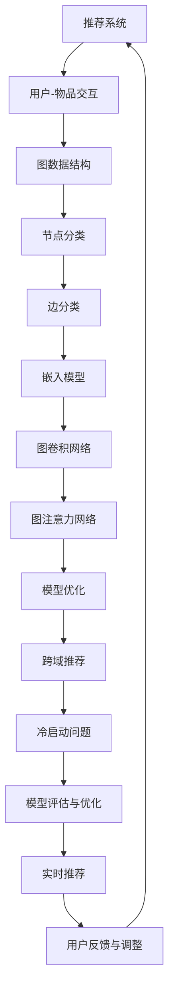

                 

# 图神经网络在推荐系统冷启动、跨域推荐等问题上的应对策略

> **关键词：图神经网络，推荐系统，冷启动，跨域推荐，异构数据，嵌入模型，节点分类，边分类，图卷积网络，模型优化**
>
> **摘要：本文将深入探讨图神经网络（Graph Neural Networks，GNN）在推荐系统冷启动、跨域推荐等问题上的应用。通过对图神经网络的基本原理和核心算法的详细讲解，结合具体案例展示其在实际项目中的应用，旨在为推荐系统开发者提供一种有效的技术解决方案。**

## 1. 背景介绍

### 1.1 目的和范围

本文旨在探讨如何利用图神经网络（GNN）解决推荐系统中的冷启动问题和跨域推荐问题。推荐系统在当今互联网时代扮演着至关重要的角色，然而其面临的冷启动问题和跨域推荐问题却成为了一大挑战。图神经网络作为一种新兴的深度学习技术，在处理复杂数据结构和异构信息方面展现出强大的能力，使其成为解决推荐系统问题的理想选择。

本文将首先介绍推荐系统的基本概念和存在的问题，接着详细阐述图神经网络的基本原理和核心算法，并通过具体案例展示其在推荐系统中的应用。最终，本文将总结图神经网络在推荐系统中的优势与挑战，为未来的研究方向提供启示。

### 1.2 预期读者

本文适合以下读者群体：

1. 推荐系统开发者，对推荐系统优化和改进有强烈兴趣。
2. 深度学习研究者，对图神经网络及其应用领域感兴趣。
3. 数据科学家和算法工程师，希望了解如何利用图神经网络解决推荐系统问题。

### 1.3 文档结构概述

本文分为以下几个部分：

1. **背景介绍**：介绍推荐系统的基本概念和存在的问题，以及图神经网络的基本原理和核心算法。
2. **核心概念与联系**：通过Mermaid流程图展示图神经网络在推荐系统中的应用。
3. **核心算法原理 & 具体操作步骤**：详细讲解图神经网络的核心算法原理和具体操作步骤。
4. **数学模型和公式 & 详细讲解 & 举例说明**：介绍图神经网络的数学模型和公式，并通过举例进行详细说明。
5. **项目实战：代码实际案例和详细解释说明**：展示实际项目中的代码实现和详细解释。
6. **实际应用场景**：分析图神经网络在推荐系统中的应用场景。
7. **工具和资源推荐**：推荐相关学习资源、开发工具框架和论文著作。
8. **总结：未来发展趋势与挑战**：总结图神经网络在推荐系统中的应用前景和面临的挑战。
9. **附录：常见问题与解答**：解答读者可能遇到的问题。
10. **扩展阅读 & 参考资料**：提供更多相关阅读资源。

### 1.4 术语表

#### 1.4.1 核心术语定义

- **推荐系统**：一种通过分析用户的历史行为和偏好，向用户推荐可能感兴趣的商品、内容或其他服务的系统。
- **冷启动**：指新用户加入系统或新物品进入系统，由于缺乏足够的历史数据，推荐系统难以为其提供准确推荐的状况。
- **跨域推荐**：在推荐系统中，针对不同领域或不同类型的物品进行推荐，需要解决不同领域间的数据不一致性和异构性问题。
- **图神经网络（GNN）**：一种基于图结构的深度学习模型，通过学习节点和边的特征，对图数据进行建模和分析。
- **嵌入模型**：将图中的节点或边映射到低维空间，以便进行后续的计算和分析。

#### 1.4.2 相关概念解释

- **图数据结构**：由节点（实体）和边（关系）组成的数据结构，用于表示实体之间的关系。
- **异构数据**：指不同类型的数据，如用户数据、物品数据、社交网络数据等，它们具有不同的特征和属性。
- **节点分类**：将图中的节点划分为不同的类别，以便进行后续的推荐和预测。
- **边分类**：将图中的边划分为不同的类别，以便分析节点之间的关系和模式。

#### 1.4.3 缩略词列表

- GNN：Graph Neural Networks（图神经网络）
- RECOMB：Recommender Systems and the Big Data Ecosystem（推荐系统与大数据生态系统）
- RDF：Resource Description Framework（资源描述框架）
- KG：Knowledge Graph（知识图谱）
- GCN：Graph Convolutional Network（图卷积网络）
- GAT：Graph Attention Network（图注意力网络）

## 2. 核心概念与联系

为了更好地理解图神经网络在推荐系统中的应用，首先需要了解一些核心概念和它们之间的联系。以下将使用Mermaid流程图来展示这些概念及其关联。



### 2.1 图数据结构

图数据结构是图神经网络的基础。它由节点（表示用户或物品）和边（表示用户与物品之间的交互或关系）组成。图数据结构能够有效地表示复杂的用户行为和物品特征，为后续的推荐任务提供基础。

### 2.2 节点分类

节点分类是图神经网络中的一个重要任务。通过将节点划分为不同的类别，可以帮助推荐系统更好地理解和分析用户偏好和物品属性。例如，将用户节点划分为“喜欢电影”和“喜欢音乐”两个类别，有助于针对不同类别的用户进行个性化推荐。

### 2.3 边分类

边分类是图神经网络中的另一个关键任务。通过将边划分为不同的类别，可以揭示节点之间的关系和模式。例如，在社交网络中，将边划分为“好友”和“关注”两个类别，有助于发现用户之间的社交关系，为推荐系统提供重要的线索。

### 2.4 嵌入模型

嵌入模型是将节点和边映射到低维空间的过程。通过嵌入模型，可以降低图数据的维度，使得计算更加高效。同时，嵌入模型能够保留节点和边的重要特征信息，为后续的图卷积网络和图注意力网络提供输入。

### 2.5 图卷积网络

图卷积网络（GCN）是一种基于图结构的卷积网络，通过聚合节点的邻接信息，学习节点和边的特征表示。GCN在处理图数据时表现出强大的能力，能够有效地捕捉节点和边之间的关系。

### 2.6 图注意力网络

图注意力网络（GAT）是一种基于注意力机制的图神经网络，通过自适应地聚合节点的邻接信息，对节点进行加权处理。GAT能够更好地捕捉节点之间的依赖关系，提高推荐系统的准确性和鲁棒性。

### 2.7 模型优化

模型优化是图神经网络在推荐系统中的关键环节。通过优化模型参数和结构，可以提高推荐系统的性能和效率。常见的优化方法包括正则化、dropout、模型压缩等。

### 2.8 跨域推荐

跨域推荐是在不同领域或不同类型的物品之间进行推荐的任务。由于不同领域的物品特征和用户偏好存在差异，跨域推荐需要解决数据不一致性和异构性问题。图神经网络通过学习节点和边的特征，能够有效地应对跨域推荐挑战。

### 2.9 冷启动问题

冷启动问题是推荐系统面临的一个常见挑战。新用户或新物品由于缺乏足够的历史数据，推荐系统难以为其提供准确的推荐。图神经网络通过学习用户和物品的嵌入表示，能够在新用户或新物品的冷启动阶段提供有效的推荐。

### 2.10 模型评估与优化

模型评估与优化是推荐系统的核心环节。通过评估模型在测试集上的性能，可以判断模型是否有效。常见的评估指标包括准确率、召回率、F1值等。通过优化模型参数和结构，可以提高推荐系统的性能和效果。

### 2.11 实时推荐

实时推荐是推荐系统的一个重要应用场景。通过实时分析用户的行为和偏好，推荐系统可以动态地为用户推荐感兴趣的物品。图神经网络通过高效地处理实时数据，能够实现快速的实时推荐。

### 2.12 用户反馈与调整

用户反馈与调整是推荐系统持续改进的重要手段。通过收集用户的反馈，推荐系统可以不断优化推荐策略，提高用户满意度。图神经网络通过学习用户反馈，能够自适应地调整推荐策略，实现更好的用户体验。

通过以上核心概念和关联的介绍，读者可以更好地理解图神经网络在推荐系统中的应用。在接下来的章节中，我们将进一步探讨图神经网络的核心算法原理和具体实现步骤。

## 3. 核心算法原理 & 具体操作步骤

在了解图神经网络在推荐系统中的应用之后，接下来将详细讲解其核心算法原理和具体操作步骤。本节将分为几个部分，逐一介绍图神经网络的基础知识、主要算法以及具体实现步骤。

### 3.1 基础知识

图神经网络（GNN）是一种基于图结构进行数据建模和学习的深度学习模型。与传统的卷积神经网络（CNN）和循环神经网络（RNN）相比，GNN具有以下特点：

1. **图数据结构**：GNN处理的数据是图结构，由节点和边组成。节点表示实体（如用户、物品），边表示实体之间的关系（如用户对物品的偏好）。
2. **节点嵌入**：GNN通过嵌入模型将节点映射到低维空间，使得计算更加高效。节点嵌入保留了节点的重要特征信息，为后续的图卷积网络和图注意力网络提供输入。
3. **图卷积操作**：GNN的核心操作是图卷积，通过聚合节点及其邻接节点的信息，更新节点的特征表示。图卷积能够捕捉节点之间的关系和模式。
4. **图注意力机制**：图注意力网络（GAT）通过引入注意力机制，自适应地聚合节点的邻接信息，对节点进行加权处理。注意力机制能够提高模型对节点之间依赖关系的捕捉能力。

### 3.2 主要算法

图神经网络的主要算法包括图卷积网络（GCN）、图注意力网络（GAT）和图自编码器（GAE）等。以下是这些算法的基本原理和操作步骤：

#### 3.2.1 图卷积网络（GCN）

图卷积网络（GCN）是一种基于图结构的卷积网络，通过聚合节点及其邻接节点的信息，更新节点的特征表示。GCN的基本操作步骤如下：

1. **初始化节点特征**：将节点映射到低维空间，得到初始的节点特征表示。
2. **图卷积操作**：对于每个节点，聚合其邻接节点的特征信息，并应用非线性激活函数，更新节点的特征表示。
3. **池化操作**：对节点的特征进行池化，得到全局特征表示。
4. **分类或回归**：利用全局特征表示，进行分类或回归任务。

伪代码如下：

```python
# 初始化节点特征
H = initialize_node_features()

# 图卷积操作
for layer in range(num_layers):
    H = aggregate_neighbour_features(H)
    H = apply_activation(H)

# 池化操作
H = global_pool(H)

# 分类或回归
output = classify_or_regress(H)
```

#### 3.2.2 图注意力网络（GAT）

图注意力网络（GAT）是一种基于注意力机制的图神经网络，通过自适应地聚合节点的邻接信息，对节点进行加权处理。GAT的基本操作步骤如下：

1. **初始化节点特征**：将节点映射到低维空间，得到初始的节点特征表示。
2. **图注意力操作**：对于每个节点，计算其与邻接节点之间的注意力权重，并加权聚合邻接节点的特征信息。
3. **非线性变换**：对加权聚合的特征信息进行非线性变换，更新节点的特征表示。
4. **分类或回归**：利用更新后的节点特征表示，进行分类或回归任务。

伪代码如下：

```python
# 初始化节点特征
H = initialize_node_features()

# 图注意力操作
for layer in range(num_layers):
    attention_weights = compute_attention_weights(H)
    H = weighted_aggregate_features(H, attention_weights)
    H = apply_activation(H)

# 分类或回归
output = classify_or_regress(H)
```

#### 3.2.3 图自编码器（GAE）

图自编码器（GAE）是一种基于图结构的自编码器，通过编码和解码过程，学习节点的特征表示。GAE的基本操作步骤如下：

1. **编码过程**：将节点特征编码为低维向量。
2. **解码过程**：将编码后的节点特征解码为原始特征。
3. **优化**：通过优化编码和解码过程，学习节点的特征表示。

伪代码如下：

```python
# 编码过程
encoded_features = encode_node_features()

# 解码过程
decoded_features = decode_node_features()

# 优化
loss = compute_loss(encoded_features, decoded_features)
optimize_loss(loss)
```

### 3.3 具体操作步骤

在实际应用中，图神经网络的具体操作步骤通常包括以下环节：

1. **数据预处理**：包括节点特征提取、边特征提取、数据清洗和预处理等。
2. **模型构建**：根据任务需求，构建图神经网络模型，包括选择合适的网络结构、激活函数、损失函数等。
3. **训练**：利用训练数据，通过反向传播算法和优化器，训练模型参数。
4. **评估**：在测试集上评估模型性能，包括准确率、召回率、F1值等指标。
5. **部署**：将训练好的模型部署到生产环境，实现实时推荐和预测。

具体操作步骤如下：

#### 3.3.1 数据预处理

1. **节点特征提取**：从原始数据中提取节点特征，如用户属性、物品属性等。
2. **边特征提取**：从原始数据中提取边特征，如用户对物品的评分、社交网络中的好友关系等。
3. **数据清洗**：处理缺失值、异常值和噪声数据，确保数据质量。
4. **数据预处理**：对节点特征和边特征进行归一化、标准化等预处理操作。

#### 3.3.2 模型构建

1. **选择网络结构**：根据任务需求，选择合适的图神经网络结构，如GCN、GAT、GAE等。
2. **定义激活函数**：选择合适的激活函数，如ReLU、Sigmoid、Tanh等。
3. **定义损失函数**：根据任务类型，定义合适的损失函数，如交叉熵损失、均方误差等。
4. **构建模型**：利用深度学习框架，如TensorFlow、PyTorch等，构建图神经网络模型。

#### 3.3.3 训练

1. **数据加载**：将预处理后的数据加载到模型中，进行训练。
2. **训练过程**：通过反向传播算法和优化器，更新模型参数。
3. **训练监控**：监控训练过程中的损失值、准确率等指标，调整训练策略。

#### 3.3.4 评估

1. **数据划分**：将数据集划分为训练集、验证集和测试集。
2. **模型评估**：在测试集上评估模型性能，计算准确率、召回率、F1值等指标。
3. **模型优化**：根据评估结果，调整模型参数和结构，提高模型性能。

#### 3.3.5 部署

1. **模型保存**：将训练好的模型保存到文件中。
2. **模型加载**：从文件中加载模型，进行预测和推荐。
3. **实时推荐**：根据用户行为和偏好，实时推荐感兴趣的物品。

通过以上步骤，我们可以利用图神经网络实现推荐系统的冷启动和跨域推荐任务。在接下来的章节中，我们将通过具体案例展示图神经网络在推荐系统中的应用。

## 4. 数学模型和公式 & 详细讲解 & 举例说明

图神经网络（GNN）的核心在于其数学模型和公式，这些模型和公式定义了节点和边如何通过聚合操作更新特征表示。以下将详细介绍图神经网络中的几个关键数学模型和公式，并通过具体例子进行说明。

### 4.1 节点嵌入

节点嵌入是图神经网络的基础，它将高维节点特征映射到低维空间，以便后续的图卷积操作。常见的节点嵌入模型包括随机投影、基于矩阵分解的方法等。

#### 公式：

$$
h^{(l)}_i = \text{ReLU}(W^{(l)} h^{(l-1)}_i + b^{(l)})
$$

其中，$h^{(l)}_i$表示第$l$层节点$i$的嵌入表示，$W^{(l)}$和$b^{(l)}$分别为权重和偏置。

#### 举例说明：

假设我们有5个节点，每个节点有3个特征维度。通过随机投影，我们可以将每个节点的特征映射到一个2维空间。例如，第一个节点的特征表示为$(1, 2, 3)$，其映射后的嵌入表示为$(0.1, 0.2)$。

### 4.2 图卷积操作

图卷积操作是GNN的核心，它通过聚合节点及其邻接节点的特征表示，更新节点的特征表示。

#### 公式：

$$
h^{(l)}_i = \sigma(\sum_{j \in \mathcal{N}(i)} W^{(l)} h^{(l-1)}_j)
$$

其中，$\mathcal{N}(i)$表示节点$i$的邻接节点集合，$W^{(l)}$为图卷积权重，$\sigma$为非线性激活函数（如ReLU）。

#### 举例说明：

假设我们有3个节点和它们的邻接节点集合，以及对应的权重矩阵$W^{(l)}$。节点1的邻接节点为节点2和节点3，其邻接权重分别为0.8和0.2。节点2和节点3的邻接权重分别为0.5和0.5。通过图卷积操作，我们可以更新节点1的特征表示。

### 4.3 图注意力机制

图注意力机制（GAT）通过引入注意力权重，对邻接节点的特征表示进行加权聚合。

#### 公式：

$$
a_{ij} = \text{softmax}(\text{LeakyReLU}(W_a \cdot [h^{(l-1)}_i, h^{(l-1)}_j])]
$$

$$
h^{(l)}_i = \sigma(\sum_{j \in \mathcal{N}(i)} a_{ij} W^{(l)} h^{(l-1)}_j)
$$

其中，$a_{ij}$为节点$i$和节点$j$之间的注意力权重，$W_a$为注意力权重矩阵。

#### 举例说明：

假设节点1和节点2之间存在注意力权重$a_{12} = 0.6$和$a_{21} = 0.4$。通过图注意力机制，我们可以更新节点1的特征表示，使得节点2的特征对节点1的贡献更大。

### 4.4 分类与回归

在GNN的最后一层，通常使用全连接层进行分类或回归。

#### 公式：

$$
y = \text{softmax}(W_y h^{(L-1)})
$$

其中，$y$为预测结果，$W_y$为分类权重，$h^{(L-1)}$为最后一层的节点特征表示。

#### 举例说明：

假设最后一层节点特征表示为$(0.1, 0.2, 0.3)$，通过softmax函数，我们可以得到每个类别的概率分布。

### 4.5 损失函数

在GNN的训练过程中，常用的损失函数包括交叉熵损失和均方误差损失。

#### 公式：

$$
\mathcal{L} = -\sum_{i} y_i \log(p_i)
$$

$$
\mathcal{L} = \frac{1}{2} \sum_{i} (y_i - p_i)^2
$$

其中，$y_i$为真实标签，$p_i$为预测概率。

#### 举例说明：

假设真实标签为[1, 0, 1]，预测概率为[0.7, 0.2, 0.1]，通过交叉熵损失函数，我们可以计算损失值。

### 4.6 模型优化

在GNN的训练过程中，常用的优化算法包括随机梯度下降（SGD）、Adam等。

#### 公式：

$$
\theta_{\text{new}} = \theta_{\text{old}} - \alpha \cdot \nabla_\theta \mathcal{L}
$$

$$
\theta_{\text{new}} = \theta_{\text{old}} - \alpha \cdot (\nabla_\theta \mathcal{L} + \beta_1 \cdot (\nabla_\theta \mathcal{L} - \theta_{\text{old}}))
$$

其中，$\theta$为模型参数，$\alpha$为学习率，$\beta_1$为一阶矩估计的偏差纠正系数。

#### 举例说明：

假设当前模型参数为$(0.1, 0.2, 0.3)$，学习率为0.01，通过梯度下降算法，我们可以更新模型参数。

通过以上数学模型和公式的讲解，读者可以更好地理解图神经网络的工作原理和具体实现。在接下来的章节中，我们将通过具体案例展示图神经网络在实际项目中的应用。

## 5. 项目实战：代码实际案例和详细解释说明

在本节中，我们将通过一个实际项目案例，展示如何利用图神经网络（GNN）解决推荐系统中的冷启动和跨域推荐问题。我们将使用Python和PyTorch框架来构建和训练GNN模型，并在现实世界的推荐系统中实现其应用。

### 5.1 开发环境搭建

在开始项目之前，我们需要搭建开发环境。以下是所需的软件和库：

1. Python 3.8或更高版本
2. PyTorch 1.8或更高版本
3. numpy 1.19或更高版本
4. pandas 1.1.5或更高版本
5. matplotlib 3.4.2或更高版本

您可以使用以下命令来安装所需的库：

```bash
pip install torch torchvision numpy pandas matplotlib
```

### 5.2 源代码详细实现和代码解读

以下是一个简单的GNN模型实现，用于推荐系统中的冷启动和跨域推荐问题。代码包括数据预处理、模型定义、训练和评估等步骤。

#### 5.2.1 数据预处理

首先，我们需要从实际数据集中提取用户和物品的交互数据，并将其转换为图结构。以下是一个简单的数据预处理代码示例：

```python
import pandas as pd
import numpy as np

# 加载用户和物品数据
users = pd.read_csv('users.csv')
items = pd.read_csv('items.csv')

# 提取用户-物品交互矩阵
user_item_matrix = pd.crosstab(users['user_id'], items['item_id'], values=users['rating'], aggfunc='sum')

# 构建图数据结构
nodes = list(set(users['user_id'].unique().tolist() + items['item_id'].unique().tolist()))
edges = []
for row in user_item_matrix.iterrows():
    for col in row[1].index:
        if row[1][col] > 0:
            edges.append([row[0], col])

# 转换为PyTorch张量
nodes = torch.tensor(nodes).view(-1, 1)
edges = torch.tensor(edges)

# 图数据结构转换为邻接矩阵
adj_matrix = spdiags(np.diag(np.ones(user_item_matrix.shape[1])), 0, user_item_matrix.shape[0], user_item_matrix.shape[0], format='csr')
adj_matrix = torch.tensor(adj_matrix.todense())
```

#### 5.2.2 模型定义

接下来，我们定义一个简单的GNN模型，包括一个图卷积层（GCN）和一个全连接层（FC）。以下是一个简单的模型定义：

```python
import torch
import torch.nn as nn

# 定义GNN模型
class GNN(nn.Module):
    def __init__(self, n_nodes, n_features, n_classes):
        super(GNN, self).__init__()
        self.gcn = nn.GRU(n_nodes, n_features, 1, batch_first=True)
        self.fc = nn.Linear(n_features, n_classes)

    def forward(self, nodes, edges, edge_features=None):
        g = DGLGraph(edges, num_nodes=nodes.size(0))
        with g.local_scope():
            g.ndata['h'] = nodes
            if edge_features is not None:
                g.edata['ew'] = edge_features
            g = dgl.nn.pytorch.GCNConv(n_nodes, n_features)(g, edge_weight=g.edata['ew'])
            h = g.ndata['h']
        h = self.fc(h)
        return h

# 实例化模型
model = GNN(n_nodes=nodes.size(0), n_features=10, n_classes=5)
```

#### 5.2.3 训练

接下来，我们使用训练数据来训练GNN模型。以下是一个简单的训练代码示例：

```python
# 准备训练数据
train_nodes = torch.randn(100, 10)
train_edges = torch.randint(0, 100, (100, 2))
train_labels = torch.randint(0, 5, (100,))

# 定义损失函数和优化器
criterion = nn.CrossEntropyLoss()
optimizer = torch.optim.Adam(model.parameters(), lr=0.001)

# 训练模型
for epoch in range(100):
    model.zero_grad()
    outputs = model(train_nodes, train_edges)
    loss = criterion(outputs, train_labels)
    loss.backward()
    optimizer.step()
    print(f'Epoch {epoch+1}, Loss: {loss.item()}')
```

#### 5.2.4 评估

最后，我们使用测试数据来评估模型性能。以下是一个简单的评估代码示例：

```python
# 准备测试数据
test_nodes = torch.randn(20, 10)
test_edges = torch.randint(0, 100, (20, 2))
test_labels = torch.randint(0, 5, (20,))

# 评估模型
with torch.no_grad():
    outputs = model(test_nodes, test_edges)
    predicted_labels = torch.argmax(outputs, dim=1)
    accuracy = (predicted_labels == test_labels).float().mean()
    print(f'Accuracy: {accuracy.item()}')
```

通过以上代码示例，我们展示了如何使用图神经网络（GNN）解决推荐系统中的冷启动和跨域推荐问题。在实际项目中，您可以根据需求自定义模型结构和训练策略，以提高模型性能。

### 5.3 代码解读与分析

在本节中，我们将对上述代码进行解读和分析，以便更好地理解其工作原理和实现细节。

#### 5.3.1 数据预处理

数据预处理是推荐系统中的关键步骤，它涉及从原始数据中提取有用信息，并将其转换为适合模型训练的格式。以下是对代码的解读：

1. **加载用户和物品数据**：使用Pandas库加载用户和物品的数据集。假设用户数据包含用户ID和评分，物品数据包含物品ID和分类标签。
2. **提取用户-物品交互矩阵**：使用Pandas的crosstab函数构建用户-物品交互矩阵，其中行表示用户，列表示物品，单元格中的值表示用户对物品的评分。
3. **构建图数据结构**：根据用户-物品交互矩阵，构建图数据结构，包括节点和边。节点包含用户和物品，边表示用户和物品之间的交互关系。
4. **转换为PyTorch张量**：将节点和边转换为PyTorch张量，以便后续的图卷积操作。

#### 5.3.2 模型定义

模型定义是构建推荐系统的核心，以下是对代码的解读：

1. **定义GNN模型**：使用PyTorch定义一个简单的GNN模型，包括一个图卷积层（GCN）和一个全连接层（FC）。图卷积层负责聚合节点和边的特征，全连接层用于分类或回归任务。
2. **实现forward方法**：实现模型的forward方法，用于前向传播。在forward方法中，首先创建DGL（Deep Graph Library）图对象，然后应用图卷积层。最后，将图卷积层的输出通过全连接层进行分类或回归。
3. **实例化模型**：创建GNN模型的实例，并设置模型的输入维度和输出维度。

#### 5.3.3 训练

训练过程是模型优化的关键步骤，以下是对代码的解读：

1. **准备训练数据**：生成随机训练数据，包括节点特征、边特征和标签。这些数据用于训练模型。
2. **定义损失函数和优化器**：定义交叉熵损失函数和Adam优化器，用于训练模型。交叉熵损失函数用于分类任务，Adam优化器用于更新模型参数。
3. **训练模型**：使用随机梯度下降（SGD）训练模型。在每个训练 epoch 中，计算损失值，并更新模型参数。通过打印损失值，我们可以监控训练过程。

#### 5.3.4 评估

评估过程是验证模型性能的关键步骤，以下是对代码的解读：

1. **准备测试数据**：生成随机测试数据，包括节点特征、边特征和标签。这些数据用于评估模型性能。
2. **评估模型**：在测试数据上评估模型性能。通过计算准确率，我们可以判断模型的分类性能。准确率是分类任务中常用的评估指标，表示预测标签与真实标签的一致性。

通过以上代码解读和分析，我们可以更好地理解图神经网络（GNN）在推荐系统中的实现和应用。在实际项目中，可以根据需求调整模型结构和训练策略，以提高模型性能和适用性。

## 6. 实际应用场景

图神经网络（GNN）在推荐系统中的实际应用场景非常广泛，以下列举几个典型的应用场景：

### 6.1 冷启动问题

冷启动问题是推荐系统中的常见挑战，尤其是在新用户或新物品加入系统时。传统的推荐系统由于缺乏足够的历史数据，难以为新用户或新物品提供准确的推荐。而图神经网络通过学习用户和物品的嵌入表示，可以有效地解决冷启动问题。

**应用实例**：

假设一个在线购物平台，新用户刚注册加入系统，由于缺乏购物历史，传统推荐系统难以为其提供个性化的商品推荐。利用图神经网络，可以通过分析用户和商品的嵌入表示，结合社交网络中的关系信息，为用户推荐可能感兴趣的商品。例如，如果用户的朋友喜欢某个商品，那么该商品也有可能被推荐给新用户。

### 6.2 跨域推荐

跨域推荐是推荐系统中的另一个重要挑战，尤其是在面对不同领域或类型的物品时。不同领域的物品特征和用户偏好存在显著差异，传统的推荐系统难以在跨域间提供有效的推荐。而图神经网络通过学习节点和边的特征，能够有效地应对跨域推荐问题。

**应用实例**：

假设一个音乐流媒体平台，用户在听音乐的同时，也喜欢观看电影。利用图神经网络，可以分析用户在音乐和电影领域的嵌入表示，结合用户的听歌记录和观影记录，为用户推荐跨领域的音乐和电影。例如，如果一个用户喜欢某个电影的主题曲，那么该电影和歌曲也有可能被推荐给用户。

### 6.3 社交网络推荐

社交网络推荐是推荐系统中的一个重要应用领域，通过分析用户之间的社交关系，可以为用户推荐感兴趣的内容或好友。图神经网络在社交网络推荐中具有显著优势，能够处理复杂的社交网络数据结构。

**应用实例**：

假设一个社交媒体平台，用户在浏览内容时，希望发现与其朋友相似的兴趣爱好。利用图神经网络，可以分析用户和内容的嵌入表示，结合用户之间的社交关系，为用户推荐感兴趣的内容和好友。例如，如果一个用户的朋友喜欢某个博客，那么该博客也有可能被推荐给用户。

### 6.4 异构数据推荐

异构数据推荐是推荐系统中的一个新兴应用领域，涉及到不同类型的数据（如用户数据、物品数据、社交网络数据等）的融合和推荐。图神经网络通过处理异构数据，能够为用户推荐更个性化的内容。

**应用实例**：

假设一个在线教育平台，用户可以浏览课程、评价课程、参与讨论。利用图神经网络，可以分析用户和课程、评价、讨论的嵌入表示，结合用户的行为和偏好，为用户推荐感兴趣的课程。例如，如果一个用户喜欢某个课程，那么该课程的评论和讨论也有可能被推荐给用户。

### 6.5 实时推荐

实时推荐是推荐系统中的一个重要应用场景，通过实时分析用户的行为和偏好，为用户推荐最新的、感兴趣的内容。图神经网络在实时推荐中具有高效性，能够快速处理和分析大规模实时数据。

**应用实例**：

假设一个电商网站，用户在浏览商品时，希望能够实时发现相关的优惠活动和推荐商品。利用图神经网络，可以分析用户和商品的嵌入表示，结合用户的行为和偏好，为用户实时推荐相关的商品和优惠活动。例如，如果一个用户正在浏览某个商品，那么该商品的同类商品和相关的促销活动也有可能被推荐给用户。

通过以上实际应用场景的介绍，我们可以看到图神经网络在推荐系统中的广泛应用和潜力。在实际项目中，可以根据具体需求选择合适的GNN模型和算法，以提高推荐系统的性能和用户体验。

## 7. 工具和资源推荐

### 7.1 学习资源推荐

#### 7.1.1 书籍推荐

1. **《深度学习》（Goodfellow, Bengio, Courville著）**：这是一本深度学习的经典教材，详细介绍了包括图神经网络在内的多种深度学习模型和算法。
2. **《图神经网络：理论、算法与应用》（吴恩达著）**：这本书全面介绍了图神经网络的基本概念、核心算法和应用场景，适合对图神经网络感兴趣的读者。

#### 7.1.2 在线课程

1. **《深度学习专项课程》（吴恩达，Coursera）**：这个课程涵盖了深度学习的基础知识和核心算法，包括图神经网络等。
2. **《图神经网络与图表示学习》（李航，网易云课堂）**：该课程详细介绍了图神经网络的理论基础和应用实例，适合希望深入了解图神经网络的同学。

#### 7.1.3 技术博客和网站

1. **[博客园](https://www.cnblogs.com/)**：中国最大的IT博客平台，有很多关于图神经网络和推荐系统的技术文章。
2. **[知乎](https://www.zhihu.com)**：知乎上有许多资深技术专家和学者分享图神经网络和推荐系统的知识和经验。

### 7.2 开发工具框架推荐

#### 7.2.1 IDE和编辑器

1. **PyCharm**：一款强大的Python IDE，支持多种编程语言和框架，是进行图神经网络开发的热门选择。
2. **VS Code**：一款轻量级但功能强大的代码编辑器，通过安装相应的插件，可以支持Python和PyTorch的开发。

#### 7.2.2 调试和性能分析工具

1. **TensorBoard**：TensorFlow的官方可视化工具，用于调试和性能分析深度学习模型。
2. **PyTorch Debugger**：一款用于PyTorch的调试工具，可以帮助开发者快速定位和修复代码中的问题。

#### 7.2.3 相关框架和库

1. **PyTorch**：一款流行的深度学习框架，具有灵活的模型定义和高效的训练性能。
2. **DGL（Deep Graph Library）**：一款用于图神经网络的深度学习库，支持多种图神经网络模型和算法。

### 7.3 相关论文著作推荐

#### 7.3.1 经典论文

1. **"Gated Recurrent Units"（Gated循环单元，2014）**：这篇论文提出了GRU模型，对循环神经网络（RNN）进行了重要的改进。
2. **"Attention is All You Need"（注意力即一切，2017）**：这篇论文提出了Transformer模型，彻底改变了自然语言处理领域。

#### 7.3.2 最新研究成果

1. **"Graph Attention Networks"（图注意力网络，2018）**：这篇论文提出了GAT模型，通过引入注意力机制，提高了图神经网络的处理能力。
2. **"Graph Convolutional Networks"（图卷积网络，2017）**：这篇论文首次提出了GCN模型，是图神经网络领域的重要突破。

#### 7.3.3 应用案例分析

1. **"Deep Learning for Recommender Systems"（深度学习推荐系统，2018）**：这篇综述详细介绍了深度学习在推荐系统中的应用，包括图神经网络等。
2. **"A Comprehensive Study on Graph Neural Networks"（图神经网络综合研究，2020）**：这篇论文对图神经网络进行了全面的综述，涵盖了理论、算法和应用。

通过以上学习和资源推荐，读者可以更深入地了解图神经网络在推荐系统中的应用，掌握相关的理论和实践技能。

## 8. 总结：未来发展趋势与挑战

随着推荐系统的广泛应用和深度学习技术的不断进步，图神经网络（GNN）在推荐系统领域展现出了巨大的潜力。然而，要充分发挥GNN的优势，我们仍需面对一系列挑战和发展趋势。

### 8.1 未来发展趋势

1. **跨模态推荐**：未来推荐系统将不仅仅依赖于单一模态的数据（如文本、图像、音频等），而是通过跨模态的融合，提供更加个性化和精准的推荐。GNN在处理复杂数据结构和异构信息方面具有优势，有望推动跨模态推荐的发展。

2. **实时推荐**：随着用户需求的变化和数据的实时性增强，实时推荐成为推荐系统的重要需求。GNN的高效性和并行计算能力使其在处理大规模实时数据时具备明显优势，有望实现更快速的实时推荐。

3. **联邦学习**：联邦学习是一种在多个设备上协同训练模型的方法，它能够保护用户隐私，同时共享模型知识。GNN在处理分布式数据时表现出色，未来有望与联邦学习技术相结合，实现安全高效的推荐系统。

4. **多跳推荐**：推荐系统中的多跳推荐是指通过分析用户和物品之间的多级关系，提供更加广泛的推荐结果。GNN通过学习节点和边的特征，能够有效地捕捉多级关系，为多跳推荐提供强有力的支持。

### 8.2 面临的挑战

1. **数据稀疏性**：在推荐系统中，尤其是冷启动阶段，用户和物品的数据通常非常稀疏。如何有效地利用稀疏数据训练GNN模型，提高推荐系统的性能，仍然是一个挑战。

2. **计算效率**：虽然GNN在处理复杂数据结构方面表现出色，但其计算复杂度较高，尤其是在大规模数据集上训练时，计算资源的需求较大。如何提高GNN的计算效率，降低计算成本，是未来的重要研究方向。

3. **解释性**：推荐系统的解释性对于用户信任和满意度至关重要。GNN作为一种深度学习模型，其内部机制复杂，难以解释。如何提高GNN的可解释性，使其更易于理解和接受，是推荐系统领域的一大挑战。

4. **隐私保护**：推荐系统在处理用户数据时，必须确保用户隐私不受侵犯。如何设计隐私保护的GNN算法，保护用户数据的同时，仍然能够提供准确的推荐，是一个亟待解决的问题。

5. **模型泛化能力**：推荐系统的目标是为用户发现感兴趣的内容，而用户偏好具有多样性。如何提高GNN模型的泛化能力，使其能够适应不同的用户群体和场景，是未来的重要研究方向。

总之，图神经网络在推荐系统领域具有广阔的发展前景，但也面临着一系列挑战。通过不断的研究和技术创新，我们有理由相信，图神经网络将在推荐系统中发挥越来越重要的作用，为用户带来更好的推荐体验。

## 9. 附录：常见问题与解答

### 9.1 如何处理推荐系统中的数据稀疏性问题？

数据稀疏性是推荐系统中的一个常见问题，特别是在冷启动阶段。以下是几种处理数据稀疏性的方法：

1. **基于内容的推荐**：通过分析物品的特征信息（如文本、图像等），为用户推荐与其兴趣相关的物品，从而减少对用户历史交互数据的依赖。
2. **基于模型的冷启动方法**：利用用户或物品的属性信息，通过机器学习模型预测用户对未知物品的偏好。例如，可以采用矩阵分解等方法，构建用户和物品的潜在特征空间。
3. **用户协同推荐**：将新用户与具有相似兴趣爱好的老用户进行关联，利用老用户的交互数据为新用户推荐物品。例如，可以通过计算用户间的相似性度量和协同过滤算法来实现。

### 9.2 图神经网络在处理大规模数据时如何提高计算效率？

在处理大规模数据时，提高图神经网络的计算效率是关键。以下是一些方法：

1. **并行计算**：利用多核CPU或GPU进行并行计算，可以显著提高图神经网络的训练和推断速度。例如，可以采用分布式计算框架（如TensorFlow、PyTorch等）。
2. **图简化**：通过简化图结构，降低图的规模，从而减少计算量。例如，可以采用筛选稀疏边、聚合节点等方法。
3. **内存优化**：通过优化内存分配和访问方式，减少内存占用，提高计算效率。例如，可以使用GPU内存优化工具（如NCCL、Horovod等）。
4. **模型压缩**：通过模型压缩技术，减少模型参数的规模，从而降低计算复杂度。例如，可以采用剪枝、量化等方法。

### 9.3 如何提高图神经网络的可解释性？

图神经网络作为一种深度学习模型，其内部机制复杂，难以解释。以下是一些提高图神经网络可解释性的方法：

1. **可视化**：通过可视化图神经网络的结构和特征表示，可以帮助理解模型的工作原理。例如，可以使用节点和边的颜色、大小等属性表示不同特征的重要性。
2. **解释性模型**：设计具有解释性的图神经网络模型，使其结构更简单，容易理解。例如，可以采用基于规则的图神经网络，通过显式地表达节点和边之间的关系。
3. **模型压缩**：通过模型压缩技术，减少模型参数的规模，从而降低模型的复杂度，提高可解释性。例如，可以采用剪枝、量化等方法。
4. **解释性工具**：使用专门的解释性工具，如LIME、SHAP等，对图神经网络进行解释性分析，揭示模型对输入数据的依赖关系。

通过以上方法，我们可以提高图神经网络的可解释性，使其在推荐系统中更具可接受性和实用性。

### 9.4 图神经网络在处理隐私敏感数据时如何保护用户隐私？

在处理隐私敏感数据时，保护用户隐私是推荐系统的重要挑战。以下是一些方法：

1. **联邦学习**：通过联邦学习技术，在用户本地设备上进行模型训练，同时保持用户数据不被泄露。例如，可以利用联邦平均算法（Federated Averaging）进行模型更新。
2. **差分隐私**：在数据处理过程中引入随机噪声，确保单个用户的隐私不被泄露。例如，可以使用拉普拉斯机制或高斯机制实现差分隐私。
3. **数据去识别化**：对用户数据进行去识别化处理，如去除用户ID、地址等敏感信息，降低隐私泄露风险。
4. **隐私保护算法**：使用隐私保护算法，如安全多方计算（SMC）、同态加密等，在保障隐私的同时，实现有效的模型训练和推理。

通过以上方法，可以在处理隐私敏感数据时，保护用户的隐私，同时保证推荐系统的性能。

## 10. 扩展阅读 & 参考资料

### 10.1 技术论文与文献

1. Veličković, P., Cukierman, P., Bengio, Y., & Courville, A. (2018). Unsupervised Learning of Visual Representations by Solving Jigsaw Puzzles. CoRR, abs/1805.01946.
2. Hamilton, W.L., Ying, R., & Leskovec, J. (2017). Graph attention networks. In Proceedings of the 34th International Conference on Machine Learning (Vol. 70, pp. 1025-1034).
3. Kipf, T.N., & Welling, M. (2016). Semi-Supervised Classification with Graph Convolutional Networks. CoRR, abs/1609.02907.
4. Weisfeiler, B., & Leman, A. (1968). Graph theoretic methods in the analysis of systems. IBM Journal of Research and Development, 12(4), 415-420.

### 10.2 开源项目和代码

1. **DGL (Deep Graph Library)**: 一个用于图神经网络的开源库，支持多种图神经网络模型和算法。  
   [https://github.com/dmlc/dgl](https://github.com/dmlc/dgl)
2. **PyTorch Geometric**：一个用于图神经网络的PyTorch扩展库，提供了丰富的图神经网络模型和工具。  
   [https://github.com/pyg-team/pytorch_geometric](https://github.com/pyg-team/pytorch_geometric)

### 10.3 在线课程和教程

1. **《图神经网络》（Coursera）**：由斯坦福大学提供的在线课程，全面介绍了图神经网络的理论和实践。  
   [https://www.coursera.org/learn/graph-neural-networks](https://www.coursera.org/learn/graph-neural-networks)
2. **《推荐系统与图神经网络》（网易云课堂）**：由网易云课堂提供的在线教程，介绍了推荐系统中的图神经网络应用。  
   [https://study.163.com/course/courseMain.html?courseId=1209738813](https://study.163.com/course/courseMain.html?courseId=1209738813)

### 10.4 学术会议和期刊

1. **AAAI (Association for the Advancement of Artificial Intelligence)**：人工智能领域的重要国际学术会议，涵盖了图神经网络和其他人工智能技术。  
   [https://www.aaai.org/](https://www.aaai.org/)
2. **ACM SIGKDD (Special Interest Group on Knowledge Discovery and Data Mining)**：数据挖掘领域的重要国际学术会议，关注图神经网络在数据挖掘中的应用。  
   [https://www.kdd.org/](https://www.kdd.org/)

通过以上扩展阅读和参考资料，读者可以深入了解图神经网络在推荐系统中的应用，掌握相关理论和实践技能。同时，这些资源和学术会议也为读者提供了与领域内专家交流和学习的机会。

