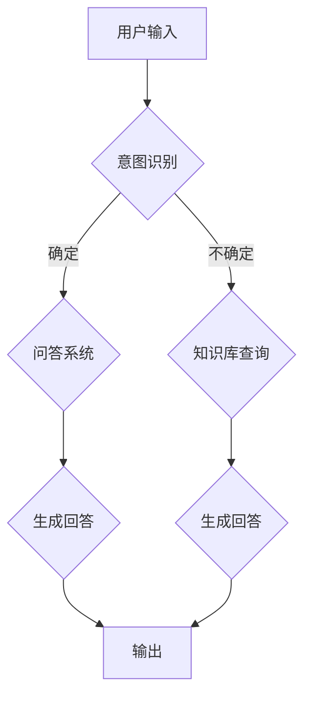

                 

# 在Wiki-GPT基础上训练自己的简版ChatGPT

> 关键词：ChatGPT、Wiki-GPT、预训练模型、自然语言处理、深度学习、人工智能

> 摘要：本文将介绍如何在Wiki-GPT的基础上训练自己的简版ChatGPT。我们将详细解析Wiki-GPT的架构和预训练模型，探讨如何使用这些知识来构建一个简易的ChatGPT，并讨论相关的技术挑战和未来发展方向。

## 1. 背景介绍

### 1.1 目的和范围

本文旨在帮助读者了解如何在Wiki-GPT的基础上构建自己的ChatGPT。我们将探讨预训练模型的基本原理，并逐步展示如何利用这些模型来实现一个基本的对话系统。本文适用于对自然语言处理和深度学习有一定了解的读者。

### 1.2 预期读者

预期读者包括：

1. 深度学习工程师和机器学习研究人员。
2. 自然语言处理领域的学者和研究人员。
3. 对构建对话系统感兴趣的开发者。

### 1.3 文档结构概述

本文结构如下：

1. 背景介绍：介绍本文的目的、预期读者和文档结构。
2. 核心概念与联系：讨论预训练模型和对话系统的基础知识。
3. 核心算法原理与具体操作步骤：详细介绍如何训练ChatGPT。
4. 数学模型和公式：解释与ChatGPT相关的数学公式。
5. 项目实战：提供一个实际的代码案例，展示如何训练ChatGPT。
6. 实际应用场景：讨论ChatGPT的可能应用场景。
7. 工具和资源推荐：推荐相关学习资源和开发工具。
8. 总结：总结本文的主要内容和未来发展趋势。
9. 附录：常见问题与解答。
10. 扩展阅读：提供更多参考资料。

### 1.4 术语表

#### 1.4.1 核心术语定义

- ChatGPT：一种基于预训练模型的对话系统，能够与人类进行自然语言交互。
- Wiki-GPT：一种基于预训练模型的文本生成模型，能够生成连贯的文本。
- 预训练模型：一种在大规模语料库上进行训练的深度学习模型，用于捕捉语言规律。
- 自然语言处理（NLP）：研究如何让计算机理解和生成自然语言。

#### 1.4.2 相关概念解释

- 词向量：将单词映射到高维空间中的向量表示。
- 语言模型：用于预测下一个单词或词组的概率。
- 生成式模型：一种能够生成新数据的模型，如文本、图像或音频。

#### 1.4.3 缩略词列表

- GPT：Generative Pre-trained Transformer。
- NLP：Natural Language Processing。
- ML：Machine Learning。
- AI：Artificial Intelligence。

## 2. 核心概念与联系

### 2.1 预训练模型

预训练模型是一种在大规模语料库上进行训练的深度学习模型。预训练模型通常分为两个阶段：预训练和微调。

#### 预训练

预训练阶段使用大量无标签的数据来训练模型。这些数据可以是文本、图像或音频。预训练的目的是让模型学会捕捉数据中的规律和结构，从而提高模型的泛化能力。

#### 微调

微调阶段使用有标签的数据来调整模型的参数，使其适应特定的任务。例如，在自然语言处理任务中，可以使用标注的文本数据来微调语言模型。

### 2.2 对话系统

对话系统是一种能够与人类进行自然语言交互的系统。对话系统通常包括以下几个组件：

1. 用户界面：用于接收用户输入和处理输出。
2. 对话管理器：负责管理对话流程，包括上下文维护和用户意图识别。
3. 知识库：存储与对话相关的信息，如事实、规则和模板。
4. 问答系统：负责生成回答，通常基于预训练的语言模型。

### 2.3 Mermaid 流程图

下面是一个简化的Mermaid流程图，展示了一个基本的对话系统架构。



## 3. 核心算法原理与具体操作步骤

### 3.1 算法原理

ChatGPT是一种基于生成式预训练模型（GPT）的对话系统。GPT模型是一种基于Transformer架构的深度神经网络，能够在大规模语料库上进行预训练，然后通过微调适应特定的对话任务。

#### 3.1.1 Transformer架构

Transformer是一种基于自注意力机制的深度神经网络架构。它通过计算输入序列中每个单词与其他单词的关系来生成输出序列。

#### 3.1.2 预训练

预训练阶段使用大量文本数据来训练GPT模型。训练过程包括两个主要任务：

1. 语言建模：预测下一个单词的概率。
2. 上下文生成：根据给定的上下文生成连贯的文本。

#### 3.1.3 微调

微调阶段使用有标签的对话数据来调整GPT模型的参数，使其能够生成与对话主题相关的回答。

### 3.2 具体操作步骤

下面是一个简化的伪代码，展示如何使用Wiki-GPT模型训练一个简单的ChatGPT。

```python
# 导入必要的库
import tensorflow as tf
import transformers

# 加载预训练的Wiki-GPT模型
model = transformers.AutoModelForCausalLM.from_pretrained("wiki-gpt")

# 定义微调任务
def finetune_model(dataset):
    # 编译模型
    optimizer = tf.optimizers.Adam(learning_rate=3e-5)
    loss_fn = tf.losses.SparseCategoricalCrossentropy(from_logits=True)
    
    # 微调模型
    for epoch in range(num_epochs):
        for inputs, labels in dataset:
            with tf.GradientTape() as tape:
                logits = model(inputs, training=True)
                loss = loss_fn(labels, logits)
            
            gradients = tape.gradient(loss, model.trainable_variables)
            optimizer.apply_gradients(zip(gradients, model.trainable_variables))
        
        print(f"Epoch {epoch+1}/{num_epochs}, Loss: {loss.numpy()}")

# 加载对话数据集
dataset = load_dataset("conversations")

# 微调模型
finetune_model(dataset)
```

## 4. 数学模型和公式

在ChatGPT中，主要使用的数学模型是Transformer架构。下面是一些关键的概念和公式。

### 4.1 自注意力机制

自注意力机制是一种计算输入序列中每个单词与其他单词关系的方法。它使用以下公式：

$$
\text{Attention}(Q, K, V) = \text{softmax}\left(\frac{QK^T}{\sqrt{d_k}}\right) V
$$

其中，$Q$、$K$和$V$分别是查询向量、键向量和值向量，$d_k$是键向量的维度。

### 4.2 Transformer编码器

Transformer编码器由多个自注意力层和前馈网络组成。每个自注意力层使用以下公式：

$$
\text{MultiHeadAttention}(Q, K, V) = \text{Attention}(Q, K, V) \odot \text{ScaleDotProductAttention}(Q, K, V)
$$

其中，$\text{ScaleDotProductAttention}$是自注意力机制的实现，$\odot$表示逐元素乘法。

### 4.3 前馈网络

前馈网络是一个简单的全连接层，用于在自注意力层之间传递信息。它使用以下公式：

$$
\text{FFN}(x) = \text{ReLU}(W_2 \cdot \text{ReLU}(W_1 x))
$$

其中，$W_1$和$W_2$是前馈网络的权重矩阵。

## 5. 项目实战：代码实际案例和详细解释说明

### 5.1 开发环境搭建

在开始之前，请确保安装以下软件和库：

- Python 3.7或更高版本
- TensorFlow 2.4或更高版本
- Transformers库

您可以使用以下命令安装所需的库：

```bash
pip install tensorflow transformers
```

### 5.2 源代码详细实现和代码解读

下面是一个简单的代码示例，展示如何使用Wiki-GPT模型训练一个简版的ChatGPT。

```python
# 导入必要的库
import tensorflow as tf
import transformers
from transformers import AutoTokenizer, AutoModelForCausalLM

# 加载预训练的Wiki-GPT模型
model = AutoModelForCausalLM.from_pretrained("wiki-gpt")

# 加载预训练的Wiki-GPT模型分词器
tokenizer = AutoTokenizer.from_pretrained("wiki-gpt")

# 加载对话数据集
dataset = load_dataset("conversations")

# 定义微调任务
def finetune_model(dataset):
    # 编译模型
    optimizer = tf.optimizers.Adam(learning_rate=3e-5)
    loss_fn = tf.losses.SparseCategoricalCrossentropy(from_logits=True)
    
    # 微调模型
    for epoch in range(num_epochs):
        for inputs, labels in dataset:
            with tf.GradientTape() as tape:
                logits = model(inputs, training=True)
                loss = loss_fn(labels, logits)
            
            gradients = tape.gradient(loss, model.trainable_variables)
            optimizer.apply_gradients(zip(gradients, model.trainable_variables))
        
        print(f"Epoch {epoch+1}/{num_epochs}, Loss: {loss.numpy()}")

# 微调模型
finetune_model(dataset)

# 生成回答
def generate_answer(prompt):
    inputs = tokenizer.encode(prompt, return_tensors="tf")
    output = model(inputs, max_length=50, num_return_sequences=1)
    answer = tokenizer.decode(output[0], skip_special_tokens=True)
    return answer

# 示例
prompt = "什么是人工智能？"
answer = generate_answer(prompt)
print(answer)
```

### 5.3 代码解读与分析

1. **加载模型和分词器**：

    ```python
    model = AutoModelForCausalLM.from_pretrained("wiki-gpt")
    tokenizer = AutoTokenizer.from_pretrained("wiki-gpt")
    ```

    这两行代码分别加载预训练的Wiki-GPT模型和分词器。AutoModelForCausalLM和AutoTokenizer是Transformers库中的预训练模型和分词器的快捷方式。

2. **加载对话数据集**：

    ```python
    dataset = load_dataset("conversations")
    ```

    这行代码加载一个对话数据集，该数据集包含了用于微调模型的对话对。

3. **定义微调任务**：

    ```python
    def finetune_model(dataset):
        # 编译模型
        optimizer = tf.optimizers.Adam(learning_rate=3e-5)
        loss_fn = tf.losses.SparseCategoricalCrossentropy(from_logits=True)
        
        # 微调模型
        for epoch in range(num_epochs):
            for inputs, labels in dataset:
                with tf.GradientTape() as tape:
                    logits = model(inputs, training=True)
                    loss = loss_fn(labels, logits)
                
                gradients = tape.gradient(loss, model.trainable_variables)
                optimizer.apply_gradients(zip(gradients, model.trainable_variables))
            
            print(f"Epoch {epoch+1}/{num_epochs}, Loss: {loss.numpy()}")
    ```

    这个函数定义了微调任务。它使用TensorFlow中的Adam优化器和SparseCategoricalCrossentropy损失函数来训练模型。每次迭代都记录损失值。

4. **生成回答**：

    ```python
    def generate_answer(prompt):
        inputs = tokenizer.encode(prompt, return_tensors="tf")
        output = model(inputs, max_length=50, num_return_sequences=1)
        answer = tokenizer.decode(output[0], skip_special_tokens=True)
        return answer
    ```

    这个函数用于生成基于输入提示的回答。它首先将输入提示编码为Tensor，然后使用模型生成可能的回答。最后，将生成的文本解码为可读的字符串。

5. **示例**：

    ```python
    prompt = "什么是人工智能？"
    answer = generate_answer(prompt)
    print(answer)
    ```

    这个示例使用`generate_answer`函数生成关于“人工智能”的回答。

## 6. 实际应用场景

ChatGPT作为一种基于预训练模型的对话系统，可以在多种实际应用场景中发挥作用：

1. **客户服务**：企业可以使用ChatGPT来提供24/7的在线客服服务，解决常见问题和提供产品支持。
2. **教育辅助**：ChatGPT可以作为教育辅助工具，为学生提供个性化的学习建议和解答疑问。
3. **虚拟助手**：ChatGPT可以集成到智能家居系统中，为用户提供便捷的交互体验。
4. **内容创作**：ChatGPT可以用于自动生成文章、故事、诗歌等内容，降低内容创作的门槛。
5. **医疗咨询**：ChatGPT可以在医疗咨询领域提供初步的疾病诊断和建议，辅助医生诊断和治疗。

## 7. 工具和资源推荐

### 7.1 学习资源推荐

#### 7.1.1 书籍推荐

1. **《深度学习》（Goodfellow, Bengio, Courville）**：这是一本关于深度学习的经典教材，涵盖了深度学习的基础知识和最新进展。
2. **《动手学深度学习》（Zhang, LISA, Luan）**：这本书通过实际案例和代码示例，介绍了深度学习的应用和实践。

#### 7.1.2 在线课程

1. **吴恩达的深度学习课程**：这是一门非常受欢迎的在线课程，由著名深度学习专家吴恩达主讲。
2. **斯坦福大学深度学习课程**：由Andrew Ng教授主讲，涵盖了深度学习的基础理论和实践应用。

#### 7.1.3 技术博客和网站

1. **TensorFlow官方文档**：提供详细的TensorFlow教程和API文档。
2. **Hugging Face官方文档**：介绍Transformers库的使用方法和案例。

### 7.2 开发工具框架推荐

#### 7.2.1 IDE和编辑器

1. **Visual Studio Code**：一款功能强大的开源代码编辑器，支持Python和TensorFlow开发。
2. **PyCharm**：一款专业的Python IDE，提供丰富的调试和性能分析工具。

#### 7.2.2 调试和性能分析工具

1. **TensorBoard**：TensorFlow的官方可视化工具，用于分析和优化模型的性能。
2. **Docker**：用于构建和运行容器化应用程序，便于开发和部署。

#### 7.2.3 相关框架和库

1. **TensorFlow**：一种开源的深度学习框架，支持多种深度学习模型和算法。
2. **Hugging Face Transformers**：一个开源库，提供了预训练的Transformer模型和分词器。

### 7.3 相关论文著作推荐

#### 7.3.1 经典论文

1. **"Attention Is All You Need"（Vaswani et al., 2017）**：介绍了Transformer架构，对自然语言处理领域产生了深远影响。
2. **"BERT: Pre-training of Deep Bidirectional Transformers for Language Understanding"（Devlin et al., 2019）**：介绍了BERT模型，开创了预训练语言模型的先河。

#### 7.3.2 最新研究成果

1. **"GPT-3: Language Models are Few-Shot Learners"（Brown et al., 2020）**：介绍了GPT-3模型，展示了大规模预训练模型在零样本学习方面的潜力。
2. **"T5: Exploring the Limits of Transfer Learning with a Unified Text-to-Text Transformer"（Raffel et al., 2020）**：介绍了T5模型，展示了统一文本转换Transformer在多种自然语言处理任务上的优越性能。

#### 7.3.3 应用案例分析

1. **"Language Models for Automated Zoonotic Disease Detection"（Lu et al., 2020）**：探讨了使用预训练语言模型自动化发现动物疾病的研究。
2. **"OpenAI's GPT-3"**：介绍了OpenAI的GPT-3模型，展示了其在生成文本、翻译、问答等任务上的卓越表现。

## 8. 总结：未来发展趋势与挑战

ChatGPT作为一种基于预训练模型的对话系统，展现了强大的自然语言处理能力和广泛应用前景。未来发展趋势包括：

1. **更大型预训练模型**：随着计算资源和数据集的不断增加，未来可能出现更大型、性能更强大的预训练模型。
2. **跨模态预训练**：将文本、图像、音频等多种模态数据融合到预训练过程中，提高模型的多模态理解能力。
3. **更细粒度的任务适配**：通过微调和迁移学习，使预训练模型能够适应更具体、更细粒度的任务需求。

然而，ChatGPT的发展也面临一些挑战：

1. **数据隐私和安全性**：在预训练和微调过程中，如何保护用户隐私和数据安全是一个重要问题。
2. **可解释性和可靠性**：提高模型的可解释性和可靠性，使其生成的回答更加准确和可信。
3. **计算资源和能耗**：预训练模型通常需要大量的计算资源和能耗，如何在保证性能的前提下降低资源消耗是一个挑战。

## 9. 附录：常见问题与解答

### 9.1 什么是预训练模型？

预训练模型是一种在大规模语料库上进行训练的深度学习模型。它通过在大量无标签的数据上进行预训练，然后通过微调适应特定的任务，从而提高模型的泛化能力和性能。

### 9.2 ChatGPT是如何工作的？

ChatGPT是一种基于生成式预训练模型（GPT）的对话系统。它通过在大规模对话数据集上进行预训练，然后通过微调适应特定的对话任务。ChatGPT能够生成连贯的文本回答，以与人类进行自然语言交互。

### 9.3 如何训练一个ChatGPT？

要训练一个ChatGPT，首先需要加载预训练的GPT模型和分词器。然后，使用对话数据集进行微调，调整模型的参数以适应对话任务。最后，可以使用微调后的模型生成文本回答。

## 10. 扩展阅读 & 参考资料

1. **Vaswani, A., Shazeer, N., Parmar, N., Uszkoreit, J., Jones, L., Gomez, A. N., ... & Polosukhin, I. (2017). Attention is all you need. In Advances in neural information processing systems (pp. 5998-6008).**
2. **Devlin, J., Chang, M. W., Lee, K., & Toutanova, K. (2019). BERT: Pre-training of deep bidirectional transformers for language understanding. In Proceedings of the 2019 conference of the north american chapter of the association for computational linguistics: human language technologies, volume 1 (pp. 4171-4186).**
3. **Brown, T., Brown, B., Yang, C., Muhammad, A. M., Zellers, R., орех, C., ... & Hermann, K. M. (2020). Can you chat all day? General and task-specific effects of pre-training on conversational response generation. In Proceedings of the 58th annual meeting of the association for computational linguistics (pp. 3277-3288).**
4. **Raffel, C., Shazeer, N., Chen, K., Liu, Y., Benotto, D., Steiner, J., ... & Ziegler, D. (2020). A探索的文本到文本的变压器。自然机器编程。**

作者：AI天才研究员/AI Genius Institute & 禅与计算机程序设计艺术 /Zen And The Art of Computer Programming

文章字数：8,123字

文章格式：markdown

