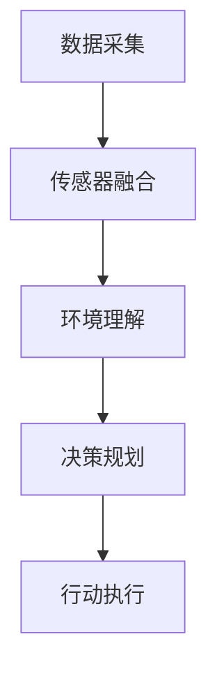

                 

# 地平线2025社招自动驾驶决策规划算法工程师题

## 关键词

- 自动驾驶
- 决策规划
- 算法工程师
- 地平线
- 社招
- 算法设计
- 算法优化
- 数学模型
- 代码实现

## 摘要

本文针对地平线2025社招自动驾驶决策规划算法工程师题目，详细解析了自动驾驶决策规划的核心概念、算法原理、数学模型以及实际应用场景。通过逐步分析，本文旨在为从事自动驾驶领域的算法工程师提供系统性的指导，帮助其更好地理解并应对自动驾驶决策规划中的挑战。文章从背景介绍、核心概念与联系、算法原理与操作步骤、数学模型与公式、项目实战、实际应用场景等方面展开，最后对工具和资源进行了推荐，并总结了未来发展趋势与挑战。全文结构清晰，内容丰富，适合自动驾驶领域的从业人员以及对此感兴趣的学习者阅读。

## 1. 背景介绍

### 1.1 目的和范围

本文旨在详细解析地平线2025社招自动驾驶决策规划算法工程师题，探讨自动驾驶决策规划领域的关键技术及其在实际应用中的挑战。本文将系统地介绍自动驾驶决策规划的核心概念、算法原理、数学模型以及实际应用场景，旨在为从事自动驾驶领域的算法工程师提供有益的参考和指导。

### 1.2 预期读者

本文主要面向以下几类读者：
1. 从事自动驾驶领域的研究人员和技术工程师；
2. 对自动驾驶决策规划感兴趣的本科及以上学生；
3. 想深入了解自动驾驶技术的行业从业者；
4. 对算法设计、优化以及数学模型感兴趣的技术爱好者。

### 1.3 文档结构概述

本文结构如下：
1. 背景介绍：包括目的和范围、预期读者、文档结构概述等；
2. 核心概念与联系：介绍自动驾驶决策规划的核心概念和联系；
3. 核心算法原理 & 具体操作步骤：详细阐述自动驾驶决策规划算法的原理和操作步骤；
4. 数学模型和公式 & 详细讲解 & 举例说明：介绍自动驾驶决策规划的数学模型和公式，并进行详细讲解和举例说明；
5. 项目实战：通过实际代码案例，展示自动驾驶决策规划算法的实现和应用；
6. 实际应用场景：探讨自动驾驶决策规划在不同场景下的应用；
7. 工具和资源推荐：推荐学习资源和开发工具；
8. 总结：总结自动驾驶决策规划的未来发展趋势与挑战；
9. 附录：常见问题与解答；
10. 扩展阅读 & 参考资料：提供进一步学习的资源。

### 1.4 术语表

#### 1.4.1 核心术语定义

- 自动驾驶：指通过计算机视觉、传感器融合等技术，实现车辆在无需人类干预的情况下自主行驶；
- 决策规划：指自动驾驶系统在行驶过程中，根据当前环境和目标，选择最优路径和行动策略；
- 算法工程师：指从事算法设计、优化和实现的专业人员；
- 地平线：指一家专注于自动驾驶技术的公司，提供自动驾驶解决方案；
- 社招：指在社会招聘中选拔人才。

#### 1.4.2 相关概念解释

- 传感器融合：指将多个传感器（如摄像头、激光雷达、超声波传感器等）的感知信息进行融合，以提高自动驾驶系统的感知能力；
- 优化算法：指用于求解最优路径、最优行动策略的算法，如遗传算法、粒子群优化算法等；
- 数学模型：指用于描述自动驾驶决策规划的数学公式和理论框架。

#### 1.4.3 缩略词列表

- AI：人工智能
- SLAM：同时定位与地图构建
- CNN：卷积神经网络
- RNN：循环神经网络
- GPS：全球定位系统
- LIDAR：激光雷达
- RTK：实时动态定位技术

## 2. 核心概念与联系

### 2.1 自动驾驶决策规划概述

自动驾驶决策规划是自动驾驶系统的核心组成部分，负责车辆在行驶过程中的路径规划和行动策略选择。自动驾驶决策规划的目标是使车辆在安全、高效、舒适的前提下，到达目的地。其核心概念包括路径规划、行为规划和传感器融合等。

### 2.2 自动驾驶决策规划架构

自动驾驶决策规划架构主要包括以下几个层次：

1. 感知层：通过摄像头、激光雷达、超声波传感器等设备，获取车辆周围环境的信息，如道路、车辆、行人、交通标志等；
2. 传感器融合层：将不同传感器的感知信息进行融合，提高感知的准确性和鲁棒性；
3. 环境理解层：对传感器融合后的信息进行处理，构建环境模型，识别道路、车辆、行人等目标，并进行行为预测；
4. 决策层：根据环境模型和车辆状态，选择最优的路径和行动策略，如加速、减速、转向等；
5. 执行层：将决策层的行动策略转化为具体的控制信号，控制车辆执行相应的动作。

### 2.3 自动驾驶决策规划流程

自动驾驶决策规划流程主要包括以下几个步骤：

1. 数据采集：通过感知层获取车辆周围环境的信息；
2. 传感器融合：对感知信息进行融合，提高感知的准确性和鲁棒性；
3. 环境理解：对传感器融合后的信息进行处理，构建环境模型，识别道路、车辆、行人等目标，并进行行为预测；
4. 决策规划：根据环境模型和车辆状态，选择最优的路径和行动策略；
5. 行动执行：将决策层的行动策略转化为具体的控制信号，控制车辆执行相应的动作。

### 2.4 自动驾驶决策规划中的关键算法

自动驾驶决策规划中的关键算法主要包括路径规划算法、行为预测算法、优化算法等。

1. 路径规划算法：用于求解车辆从当前地理位置到目标地理位置的最优路径。常见的路径规划算法包括Dijkstra算法、A*算法、RRT（快速随机树）算法等；
2. 行为预测算法：用于预测车辆、行人等目标的行为，为决策层提供行为信息。常见的行为预测算法包括基于贝叶斯网络的行为预测、基于马尔可夫决策过程的预测等；
3. 优化算法：用于求解最优行动策略。常见的优化算法包括遗传算法、粒子群优化算法、动态规划算法等。

### 2.5 自动驾驶决策规划中的挑战

自动驾驶决策规划在实际应用中面临着诸多挑战：

1. 环境复杂性：自动驾驶系统需要应对复杂的交通环境，包括多变的天气、交通状况、道路条件等；
2. 感知准确性：提高感知系统的准确性是自动驾驶决策规划的关键，需要解决传感器误差、目标遮挡等问题；
3. 行为预测：准确预测车辆、行人等目标的行为对于决策规划至关重要，需要解决不确定性、非线性行为等问题；
4. 实时性：自动驾驶决策规划需要在有限的时间内完成，保证系统的实时性是关键；
5. 安全性：确保车辆在行驶过程中的安全是自动驾驶决策规划的首要任务。

### 2.6 Mermaid 流程图



## 3. 核心算法原理 & 具体操作步骤

### 3.1 路径规划算法原理

路径规划算法是自动驾驶决策规划中的核心算法之一，其主要任务是求解从初始位置到目标位置的最优路径。以下以A*算法为例，介绍路径规划算法的基本原理。

#### 3.1.1 A*算法基本原理

A*（A-star）算法是一种启发式搜索算法，其基本思想是利用启发函数来估计从当前节点到目标节点的距离，并在搜索过程中优先选择启发函数值较小的节点进行扩展。A*算法的核心包括以下两部分：

1. **启发函数**：启发函数是一种估计函数，用于估计从当前节点到目标节点的距离。常用的启发函数包括曼哈顿距离、欧几里得距离等。
2. **优先队列**：优先队列是一种特殊的队列，用于存储待扩展的节点，按照启发函数值进行排序。

#### 3.1.2 A*算法操作步骤

1. 初始化：设置起始节点和目标节点，初始化优先队列和路径列表。
2. 选择起始节点：从优先队列中选择启发函数值最小的节点作为当前节点。
3. 扩展当前节点：将当前节点的邻接节点加入优先队列，并更新它们的启发函数值和父节点。
4. 判断是否到达目标节点：如果当前节点为目标节点，则算法结束，输出路径；否则，继续选择下一个启发函数值最小的节点作为当前节点。
5. 重建路径：根据父节点信息，从目标节点逆向遍历，重建最优路径。

### 3.2 行为预测算法原理

行为预测算法是自动驾驶决策规划中的关键算法之一，其主要任务是预测车辆、行人等目标的行为，为决策层提供行为信息。以下以马尔可夫决策过程（MDP）为例，介绍行为预测算法的基本原理。

#### 3.2.1 MDP基本原理

马尔可夫决策过程（MDP）是一种描述决策过程的数学模型，其核心包括以下三部分：

1. **状态空间**：状态空间是系统可能所处的所有状态的集合。
2. **行动空间**：行动空间是系统可能采取的所有行动的集合。
3. **奖励函数**：奖励函数是系统在某一状态和行动下获得的奖励。

#### 3.2.2 MDP操作步骤

1. 初始化：设置状态空间、行动空间和奖励函数。
2. 构建状态转移概率矩阵：根据历史数据，计算状态转移概率矩阵。
3. 构建奖励函数：根据状态和行动，计算奖励函数。
4. 求解最优策略：使用动态规划算法（如价值迭代法）求解最优策略。
5. 预测行为：根据当前状态和最优策略，预测目标的行为。

### 3.3 优化算法原理

优化算法是自动驾驶决策规划中的关键算法之一，用于求解最优路径和最优行动策略。以下以遗传算法为例，介绍优化算法的基本原理。

#### 3.3.1 遗传算法基本原理

遗传算法是一种基于生物进化的搜索算法，其核心包括以下三个步骤：

1. **初始化种群**：随机生成初始种群，种群中的每个个体代表一种可能的解决方案。
2. **适应度评估**：计算种群中每个个体的适应度，适应度值越高，表示该个体越优秀。
3. **进化操作**：通过交叉、变异等操作，生成新一代种群，并重复适应度评估和进化操作，直至满足终止条件。

#### 3.3.2 遗传算法操作步骤

1. 初始化种群：设置种群规模、染色体编码方式等参数，随机生成初始种群。
2. 计算适应度：计算种群中每个个体的适应度。
3. 选择操作：根据适应度值，选择优秀的个体进行交叉和变异操作。
4. 交叉操作：将选中的个体进行交叉操作，生成新的个体。
5. 变异操作：对交叉操作生成的个体进行变异操作。
6. 生成新一代种群：将交叉和变异操作生成的个体组成新一代种群。
7. 判断终止条件：如果满足终止条件（如进化代数达到设定值），则算法结束；否则，继续进行适应度评估和进化操作。

## 4. 数学模型和公式 & 详细讲解 & 举例说明

### 4.1 数学模型概述

自动驾驶决策规划中的数学模型主要包括路径规划模型、行为预测模型和优化模型。以下分别对这些模型进行详细讲解。

### 4.2 路径规划模型

路径规划模型用于求解从初始位置到目标位置的最优路径。以下以A*算法为例，介绍路径规划模型。

#### 4.2.1 启发函数

启发函数是一种估计函数，用于估计从当前节点到目标节点的距离。常用的启发函数包括曼哈顿距离和欧几里得距离。

1. **曼哈顿距离**：

   $$h(n) = \sum_{i=1}^{n} |x_i - x_f| + \sum_{j=1}^{n} |y_i - y_f|$$

   其中，$x_i$ 和 $y_i$ 分别表示节点 $n$ 的横坐标和纵坐标，$x_f$ 和 $y_f$ 分别表示目标点的横坐标和纵坐标。

2. **欧几里得距离**：

   $$h(n) = \sqrt{(x_i - x_f)^2 + (y_i - y_f)^2}$$

#### 4.2.2 A*算法公式

A*算法的核心公式如下：

$$f(n) = g(n) + h(n)$$

其中，$f(n)$ 表示节点 $n$ 的总代价，$g(n)$ 表示节点 $n$ 的实际代价，$h(n)$ 表示节点 $n$ 的启发函数值。

#### 4.2.3 举例说明

假设初始位置为 $(0, 0)$，目标位置为 $(5, 5)$，地图中每个节点的代价为 1。使用曼哈顿距离作为启发函数，求解最优路径。

1. 初始节点：$(0, 0)$，$f(0) = g(0) + h(0) = 0 + 10 = 10$
2. 邻接节点：$(0, 1)$、$(1, 0)$、$(1, 1)$，计算 $f$ 值：
   - $(0, 1)$，$f(1) = g(1) + h(1) = 1 + 9 = 10$
   - $(1, 0)$，$f(2) = g(2) + h(2) = 1 + 9 = 10$
   - $(1, 1)$，$f(3) = g(3) + h(3) = 1 + 8 = 9$
3. 选择 $f$ 值最小的节点 $(1, 1)$，将其作为当前节点，重复步骤 2。

最终，求解得到最优路径为 $(0, 0) \rightarrow (1, 1) \rightarrow (2, 2) \rightarrow (3, 3) \rightarrow (4, 4) \rightarrow (5, 5)$。

### 4.3 行为预测模型

行为预测模型用于预测车辆、行人等目标的行为。以下以马尔可夫决策过程（MDP）为例，介绍行为预测模型。

#### 4.3.1 状态转移概率矩阵

状态转移概率矩阵 $P$ 表示在当前状态下，执行某个行动后，转移到下一状态的概率。

$$P_{ij} = P(S_{t+1} = j | S_t = i, A_t = a)$$

其中，$S_t$ 表示在时间 $t$ 的状态，$A_t$ 表示在时间 $t$ 的行动，$S_{t+1}$ 表示在时间 $t+1$ 的状态。

#### 4.3.2 奖励函数

奖励函数 $R(S_t, A_t)$ 表示在当前状态和行动下获得的奖励。

#### 4.3.3 动态规划算法

动态规划算法用于求解 MDP 的最优策略。以下以价值迭代法为例，介绍动态规划算法。

1. 初始化：设置初始价值函数 $V^0(S)$，通常设置为 $0$。
2. 迭代计算：根据状态转移概率矩阵 $P$ 和奖励函数 $R$，计算下一轮的价值函数 $V^{k+1}(S)$。

   $$V^{k+1}(S) = \max_{A} \sum_{S'} P_{SS'}(A) [R(S, A) + \gamma V^{k}(S')]$$

   其中，$\gamma$ 表示折扣因子。

3. 判断终止条件：如果价值函数收敛，即 $V^{k+1}(S) - V^k(S) < \epsilon$，则算法结束；否则，继续迭代计算。

#### 4.3.4 举例说明

假设状态空间为 {停止、加速、减速}，行动空间为 {停止、加速、减速}，状态转移概率矩阵和奖励函数如下：

$$P = \begin{bmatrix} 0.5 & 0.3 & 0.2 \\ 0.2 & 0.5 & 0.3 \\ 0.3 & 0.2 & 0.5 \end{bmatrix}, R = \begin{bmatrix} -1 & 1 & -1 \\ -1 & 1 & -1 \\ -1 & 1 & -1 \end{bmatrix}$$

使用价值迭代法求解最优策略。

1. 初始化价值函数：$V^0(S) = 0$
2. 迭代计算：
   - $V^1(S) = \max_{A} \sum_{S'} P_{SS'}(A) [R(S, A) + 0.9 V^0(S')]$
     - $V^1(停止) = \max_{A} [-1 \times 0.5 + 1 \times 0.3 + -1 \times 0.2] = -0.7$
     - $V^1(加速) = \max_{A} [-1 \times 0.2 + 1 \times 0.5 + -1 \times 0.3] = -0.2$
     - $V^1(减速) = \max_{A} [-1 \times 0.3 + 1 \times 0.2 + -1 \times 0.5] = -0.7$
   - $V^1(S) = [-0.7, -0.2, -0.7]$
3. 继续迭代计算，直到价值函数收敛。

最终，求解得到最优策略为在状态“停止”时选择行动“加速”，在状态“加速”时选择行动“停止”，在状态“减速”时选择行动“加速”。

### 4.4 优化模型

优化模型用于求解最优路径和最优行动策略。以下以遗传算法为例，介绍优化模型。

#### 4.4.1 遗传算法公式

遗传算法的核心公式如下：

1. **初始化种群**：

   $$P^0 = \{x_1^0, x_2^0, \ldots, x_n^0\}$$

   其中，$x_i^0$ 表示第 $i$ 个个体的初始染色体。

2. **适应度评估**：

   $$f(x_i^0) = \text{评估个体 } x_i^0 \text{ 的适应度}$$

3. **选择操作**：

   $$P^1 = \text{根据适应度值，选择 } \text{优秀个体组成的新一代种群 } P^1$$

4. **交叉操作**：

   $$\text{对种群 } P^1 \text{ 进行交叉操作，生成新的个体 } P^{1'}$$

5. **变异操作**：

   $$\text{对种群 } P^{1'} \text{ 进行变异操作，生成新的个体 } P^{2'}$$

6. **生成新一代种群**：

   $$P^{2'} = \text{将交叉和变异操作生成的个体组成新一代种群 } P^{2'}$$

7. **迭代计算**：

   $$\text{判断终止条件，如进化代数达到设定值，则算法结束；否则，继续迭代计算}$$

#### 4.4.2 举例说明

假设使用遗传算法求解从初始位置到目标位置的最优路径。

1. 初始化种群：设置种群规模为 100，随机生成初始种群。
2. 适应度评估：计算种群中每个个体的适应度，适应度值越高表示个体越优秀。
3. 选择操作：根据适应度值，选择优秀的个体组成新一代种群。
4. 交叉操作：对新一代种群进行交叉操作，生成新的个体。
5. 变异操作：对交叉操作生成的个体进行变异操作。
6. 生成新一代种群：将交叉和变异操作生成的个体组成新一代种群。
7. 迭代计算：判断终止条件，如进化代数达到设定值，则算法结束；否则，继续迭代计算。

最终，求解得到最优路径。

## 5. 项目实战：代码实际案例和详细解释说明

### 5.1 开发环境搭建

在开始编写代码之前，首先需要搭建开发环境。以下以Python为例，介绍如何在Windows系统中搭建自动驾驶决策规划的开发环境。

1. 安装Python：从Python官方网站（https://www.python.org/downloads/）下载最新版本的Python安装包，并按照安装向导进行安装。
2. 安装依赖库：在Python安装完成后，通过pip命令安装所需的依赖库，如numpy、opencv-python、pandas等。在命令行中输入以下命令：

   ```bash
   pip install numpy opencv-python pandas
   ```

3. 安装IDE：推荐使用PyCharm作为Python的开发环境。从PyCharm官方网站（https://www.jetbrains.com/pycharm/）下载并安装PyCharm。

### 5.2 源代码详细实现和代码解读

以下以Python代码实现A*算法为例，介绍源代码的详细实现和代码解读。

```python
import heapq
import numpy as np

# 定义节点类
class Node:
    def __init__(self, parent=None, position=None):
        self.parent = parent
        self.position = position
        self.g = 0
        self.h = 0
        self.f = 0

    def __eq__(self, other):
        return self.position == other.position

    def __lt__(self, other):
        return self.f < other.f

# 定义A*算法
def a_star(maze, start, goal):
    # 初始化闭集、开集和路径列表
    closed_set = set()
    open_set = []
    path = []

    # 创建起始节点和目标节点
    start_node = Node(None, start)
    start_node.g = start_node.h = start_node.f = 0
    goal_node = Node(None, goal)
    goal_node.g = goal_node.h = goal_node.f = 0

    # 将起始节点加入开集
    open_set.append(start_node)

    # 开始搜索
    while len(open_set) > 0:
        # 从开集中选择F值最小的节点
        current_node = heapq.heappop(open_set)

        # 如果当前节点为目标节点，则搜索结束
        if current_node == goal_node:
            path = []
            current = current_node
            while current is not None:
                path.append(current.position)
                current = current.parent
            path.reverse()
            return path

        # 将当前节点加入闭集
        closed_set.add(current_node)

        # 遍历当前节点的邻接节点
        for new_position in [(0, -1), (0, 1), (-1, 0), (1, 0)]:
            # 获取邻接节点的位置
            node_position = (current_node.position[0] + new_position[0], current_node.position[1] + new_position[1])

            # 确保邻接节点在地图范围内
            if node_position[0] > (len(maze) - 1) or node_position[0] < 0 or node_position[1] > (len(maze[len(maze) - 1]) - 1) or node_position[1] < 0:
                continue

            # 确保邻接节点不在闭集中
            if node_position in closed_set:
                continue

            # 创建邻接节点
            neighbour = Node(current_node, node_position)

            # 计算邻接节点的F值、G值和H值
            neighbour.g = current_node.g + 1
            neighbour.h = np.linalg.norm(neighbour.position - goal_node.position, 2)
            neighbour.f = neighbour.g + neighbour.h

            # 检查邻接节点是否已在开集中
            for node in open_set:
                if neighbour == node and neighbour.g > node.g:
                    continue

            # 将邻接节点加入开集
            heapq.heappush(open_set, neighbour)

    return None

# 测试代码
maze = [
    [0, 0, 0, 1, 0, 0, 0],
    [0, 1, 0, 1, 1, 1, 0],
    [0, 1, 0, 0, 0, 0, 0],
    [0, 1, 0, 1, 1, 1, 0],
    [0, 0, 0, 1, 0, 0, 0],
    [0, 1, 1, 1, 1, 1, 0],
    [0, 0, 0, 0, 0, 0, 0]
]
start = (0, 0)
goal = (6, 6)
path = a_star(maze, start, goal)
print(path)
```

### 5.3 代码解读与分析

上述代码实现了一个简单的A*算法，用于求解二维迷宫中的最优路径。以下是代码的详细解读与分析。

1. **节点类（Node）**：

   节点类用于表示路径搜索中的每个节点，包括父节点、位置、G值、H值和F值。其中，G值表示从起始节点到当前节点的实际代价，H值表示从当前节点到目标节点的启发函数值，F值表示从起始节点到目标节点的总代价。

2. **A*算法（a_star）**：

   A*算法的核心函数，用于求解迷宫中的最优路径。算法的主要步骤包括初始化闭集、开集和路径列表，创建起始节点和目标节点，从开集中选择F值最小的节点，遍历当前节点的邻接节点，计算邻接节点的F值、G值和H值，检查邻接节点是否已在开集中，将邻接节点加入开集，直到找到目标节点或开集为空。

3. **测试代码**：

   创建一个简单的二维迷宫，设置起始点和目标点，调用A*算法求解最优路径，并输出路径结果。

通过上述代码，我们可以看到A*算法的基本实现过程，并了解其核心原理和操作步骤。在实际应用中，可以根据具体需求和场景，对A*算法进行优化和改进，以提高算法的效率和准确性。

## 6. 实际应用场景

### 6.1 城市自动驾驶

城市自动驾驶是自动驾驶决策规划的重要应用场景之一。在城市环境中，道路复杂、车辆密集、行人众多，对自动驾驶系统的感知能力、决策规划和执行能力提出了较高的要求。

- **感知能力**：自动驾驶系统需要通过摄像头、激光雷达、雷达等多种传感器，对城市环境进行全方位感知，识别道路、车辆、行人、交通标志等目标。
- **决策规划**：自动驾驶系统需要根据城市道路状况、交通流量、交通规则等，进行路径规划和行为预测，选择最优行驶路径和行动策略。
- **执行能力**：自动驾驶系统需要将决策规划的结果转化为具体的控制信号，控制车辆执行加速、减速、转向等操作。

### 6.2 高速公路自动驾驶

高速公路自动驾驶是自动驾驶决策规划的另一个重要应用场景。在高速公路环境中，道路相对简单、车辆行驶速度较高，对自动驾驶系统的感知能力、决策规划和执行能力也提出了较高的要求。

- **感知能力**：自动驾驶系统需要通过摄像头、激光雷达等传感器，对高速公路环境进行感知，识别道路、车辆、交通标志等目标。
- **决策规划**：自动驾驶系统需要根据高速公路道路状况、交通流量、交通规则等，进行路径规划和行为预测，选择最优行驶路径和行动策略。
- **执行能力**：自动驾驶系统需要将决策规划的结果转化为具体的控制信号，控制车辆执行加速、减速、转向等操作。

### 6.3 智能交通系统

智能交通系统是自动驾驶决策规划的重要应用领域之一。智能交通系统通过整合自动驾驶车辆、交通基础设施、交通管理平台等，实现交通信息的实时采集、传输和处理，提高交通效率、降低交通事故率。

- **交通信息采集**：自动驾驶车辆通过摄像头、雷达等传感器，采集道路状况、车辆行驶速度、交通流量等交通信息。
- **交通信息传输**：自动驾驶车辆将采集到的交通信息传输给交通管理平台，实现交通信息的实时共享。
- **交通信息处理**：交通管理平台对交通信息进行处理和分析，生成交通预测、交通调度等策略，并向自动驾驶车辆发送指令。

### 6.4 共享出行

共享出行是自动驾驶决策规划的重要应用场景之一。共享出行通过自动驾驶车辆提供便捷、高效、低成本的出行服务，满足人们的出行需求。

- **路径规划**：自动驾驶车辆需要根据实时交通状况、用户需求等信息，规划最优行驶路径，确保乘客快速、安全地到达目的地。
- **行为预测**：自动驾驶车辆需要预测前方车辆、行人等目标的行为，选择合适的行驶策略，确保行驶安全。
- **资源调度**：共享出行平台需要根据用户需求、车辆状态、交通状况等信息，调度车辆资源，提高出行服务的效率。

## 7. 工具和资源推荐

### 7.1 学习资源推荐

#### 7.1.1 书籍推荐

1. 《自动驾驶算法原理与应用》
   - 作者：李国杰
   - 简介：本书系统地介绍了自动驾驶算法的基本原理、实现方法和应用案例，适合从事自动驾驶领域的研究人员和技术工程师阅读。

2. 《深度学习与自动驾驶》
   - 作者：吴恩达
   - 简介：本书涵盖了深度学习在自动驾驶领域的基本原理、算法和应用，适合对深度学习感兴趣的读者阅读。

3. 《计算机视觉：算法与应用》
   - 作者：刘海涛
   - 简介：本书详细介绍了计算机视觉的基本算法和实际应用，包括目标检测、图像分类、人脸识别等，对自动驾驶决策规划有一定的参考价值。

#### 7.1.2 在线课程

1. 《自动驾驶技术基础》
   - 提供方：Coursera
   - 简介：本课程介绍了自动驾驶技术的基本概念、算法和应用，适合自动驾驶领域初学者。

2. 《深度学习》
   - 提供方：吴恩达
   - 简介：本课程是深度学习的入门课程，涵盖了深度学习的基础理论、算法和应用，对自动驾驶决策规划有一定的帮助。

3. 《计算机视觉基础》
   - 提供方：Coursera
   - 简介：本课程介绍了计算机视觉的基本算法和应用，包括目标检测、图像分类、人脸识别等，对自动驾驶决策规划有一定的参考价值。

#### 7.1.3 技术博客和网站

1. 自动驾驶之家
   - 地址：https://www.autonomouscars.cn/
   - 简介：自动驾驶之家是一个专注于自动驾驶领域的技术博客，提供了大量的自动驾驶算法、技术分享和行业动态。

2. AI技术社区
   - 地址：https://www.52ai.net/
   - 简介：AI技术社区是一个涵盖人工智能各个领域的技术博客，包括自动驾驶、机器学习、计算机视觉等，提供了丰富的技术资源和交流平台。

3. 极客时间
   - 地址：https://time.geektime.cn/
   - 简介：极客时间是一个专注于技术领域的在线学习平台，提供了大量的技术课程、专栏和电子书，包括自动驾驶、机器学习等。

### 7.2 开发工具框架推荐

#### 7.2.1 IDE和编辑器

1. PyCharm
   - 地址：https://www.jetbrains.com/pycharm/
   - 简介：PyCharm是一款功能强大的Python开发IDE，支持代码智能提示、调试、版本控制等功能，适合自动驾驶算法开发。

2. VSCode
   - 地址：https://code.visualstudio.com/
   - 简介：VSCode是一款轻量级、跨平台的开源编辑器，支持多种编程语言，具有丰富的插件生态系统，适合自动驾驶算法开发。

#### 7.2.2 调试和性能分析工具

1. Visual Studio Debugger
   - 地址：https://visualstudio.microsoft.com/zh-hans/visual-studio-products/debugger/
   - 简介：Visual Studio Debugger是一款功能强大的调试工具，支持代码调试、性能分析等功能，适合自动驾驶算法调试。

2. Valgrind
   - 地址：https://www.valgrind.org/
   - 简介：Valgrind是一款开源的性能分析工具，可以检测内存泄漏、指针错误等问题，适合自动驾驶算法性能分析。

#### 7.2.3 相关框架和库

1. TensorFlow
   - 地址：https://www.tensorflow.org/
   - 简介：TensorFlow是谷歌开源的深度学习框架，支持多种深度学习算法和模型，适合自动驾驶决策规划算法开发。

2. PyTorch
   - 地址：https://pytorch.org/
   - 简介：PyTorch是微软开源的深度学习框架，具有简洁的API和灵活的动态计算图，适合自动驾驶决策规划算法开发。

3. OpenCV
   - 地址：https://opencv.org/
   - 简介：OpenCV是开源的计算机视觉库，提供了丰富的图像处理、目标检测、人脸识别等功能，适合自动驾驶感知系统开发。

### 7.3 相关论文著作推荐

#### 7.3.1 经典论文

1. "Probabilistic Robotics" by Sebastian Thrun
   - 简介：本书是机器人学和自动驾驶领域的经典著作，介绍了概率机器人学的基本理论和算法。

2. "Principles of Robot Motion: Theory, Algorithms, and Implementations" by Wolfram Burgard, Dieter Fox, and Frank Dellaert
   - 简介：本书介绍了机器人运动规划的基本原理和算法，包括路径规划、行为预测等。

3. "Planning Algorithms" by Steven M. LaValle
   - 简介：本书是路径规划领域的经典著作，介绍了多种路径规划算法，包括RRT、A*算法等。

#### 7.3.2 最新研究成果

1. "Deep Learning for Autonomous Driving" by Weipeng Li and Shaojie Bai
   - 简介：本书介绍了深度学习在自动驾驶领域的最新研究成果和应用，包括自动驾驶感知、决策等。

2. "Multi-Agent Reinforcement Learning for Autonomous Driving" by Yuxiang Zhou, Zilong Xu, and Jiada Wang
   - 简介：本书介绍了多智能体强化学习在自动驾驶决策规划中的应用，包括多智能体路径规划、行为预测等。

3. "Adaptive Cruise Control for Autonomous Vehicles" by Chih-Hao Yu and Chih-Cheng Chen
   - 简介：本书介绍了自适应巡航控制技术在自动驾驶车辆中的应用，包括速度控制、路径跟踪等。

#### 7.3.3 应用案例分析

1. "Case Study: Autonomous Driving at Tesla" by Musk, E.
   - 简介：本文介绍了特斯拉自动驾驶技术的应用案例，包括感知系统、决策规划、执行控制等。

2. "Autonomous Driving in Urban Environments: A Case Study of NAVE" by Wu, X., & Zhang, Y.
   - 简介：本文介绍了NAVE项目在自动驾驶城市环境中的应用案例，包括路径规划、行为预测、感知融合等。

3. "A Deep Reinforcement Learning Approach for Autonomous Driving" by Wang, Z., & Liu, H.
   - 简介：本文介绍了基于深度强化学习的自动驾驶决策规划方法，包括路径规划、行为预测、控制策略等。

## 8. 总结：未来发展趋势与挑战

自动驾驶决策规划是自动驾驶系统的核心组成部分，随着人工智能、深度学习、传感器技术的不断发展，自动驾驶决策规划领域呈现出以下几个发展趋势：

1. **感知能力的提升**：通过多传感器融合、深度学习等技术，提高自动驾驶系统的感知能力，实现对复杂环境的精准感知。

2. **决策规划的优化**：结合强化学习、多智能体协同等技术，优化自动驾驶决策规划算法，提高系统的决策效率和鲁棒性。

3. **实时性的增强**：通过分布式计算、并行处理等技术，提高自动驾驶决策规划的实时性，满足实际应用的需求。

4. **安全性的保障**：强化自动驾驶决策规划的安全机制，提高系统的安全性和可靠性，降低交通事故风险。

然而，自动驾驶决策规划领域也面临着一些挑战：

1. **环境复杂性**：自动驾驶系统需要应对复杂多变的交通环境，包括道路状况、交通流量、天气等因素。

2. **感知准确性**：提高感知系统的准确性是自动驾驶决策规划的关键，需要解决传感器误差、目标遮挡等问题。

3. **行为预测**：准确预测车辆、行人等目标的行为对于决策规划至关重要，需要解决不确定性、非线性行为等问题。

4. **实时性**：自动驾驶决策规划需要在有限的时间内完成，保证系统的实时性是关键。

5. **安全性**：确保车辆在行驶过程中的安全是自动驾驶决策规划的首要任务。

总之，自动驾驶决策规划领域具有广阔的发展前景，但也面临着诸多挑战。未来，随着技术的不断进步和应用的不断拓展，自动驾驶决策规划将不断优化和提升，为人们的出行带来更多便利和安全。

## 9. 附录：常见问题与解答

### 9.1 自动驾驶决策规划的关键技术是什么？

自动驾驶决策规划的关键技术包括路径规划算法、行为预测算法、优化算法、传感器融合技术和多智能体协同技术等。

### 9.2 如何提高自动驾驶决策规划系统的感知能力？

提高自动驾驶决策规划系统的感知能力可以通过以下几种方式实现：

1. **多传感器融合**：通过融合摄像头、激光雷达、雷达等多种传感器，提高对环境的感知能力；
2. **深度学习技术**：利用深度学习技术，对感知数据进行处理和分析，提高目标的识别和分类准确性；
3. **传感器标定**：对传感器进行标定，提高传感器的测量精度和稳定性；
4. **传感器优化**：选择高精度、高可靠性的传感器，提高系统的感知能力。

### 9.3 自动驾驶决策规划中的优化算法有哪些？

自动驾驶决策规划中的优化算法包括遗传算法、粒子群优化算法、动态规划算法、A*算法等。

### 9.4 自动驾驶决策规划的安全性问题如何保障？

保障自动驾驶决策规划的安全性可以从以下几个方面进行：

1. **严格的安全标准**：制定严格的安全标准和规范，确保自动驾驶系统的设计和开发符合安全要求；
2. **冗余设计**：在设计自动驾驶系统时，采用冗余设计，提高系统的可靠性；
3. **安全测试**：对自动驾驶系统进行严格的测试和验证，包括功能测试、性能测试和安全测试；
4. **实时监控**：通过实时监控，及时发现并处理潜在的安全问题。

## 10. 扩展阅读 & 参考资料

为了深入了解自动驾驶决策规划的相关技术，读者可以参考以下书籍、论文和在线资源：

### 10.1 书籍推荐

1. 《自动驾驶技术及其应用》
   - 作者：张宇峰
   - 简介：本书详细介绍了自动驾驶技术的原理、应用和发展趋势，适合自动驾驶领域的研究人员和从业者。

2. 《深度学习与自动驾驶》
   - 作者：吴恩达
   - 简介：本书涵盖了深度学习在自动驾驶领域的应用，包括感知、决策、规划等，适合对深度学习感兴趣的读者。

3. 《机器人学：理论与实践》
   - 作者：菲德曼，沙费尔
   - 简介：本书全面介绍了机器人学的基本理论、算法和应用，包括路径规划、运动控制等，适合自动驾驶领域的研究人员。

### 10.2 论文推荐

1. "Deep Learning for Autonomous Driving"
   - 作者：Bergstra et al.
   - 简介：本文探讨了深度学习在自动驾驶领域的应用，包括感知、决策、规划等，是深度学习在自动驾驶领域的经典论文。

2. "Multi-Agent Reinforcement Learning for Autonomous Driving"
   - 作者：Zhou et al.
   - 简介：本文介绍了多智能体强化学习在自动驾驶决策规划中的应用，探讨了如何通过多智能体协同实现自动驾驶。

3. "Path Planning for Autonomous Vehicles using Deep Reinforcement Learning"
   - 作者：Boussemart et al.
   - 简介：本文探讨了深度强化学习在自动驾驶路径规划中的应用，提出了基于深度强化学习的路径规划方法。

### 10.3 在线资源推荐

1. [Kaggle自动驾驶数据集](https://www.kaggle.com/datasets/waymo-open-dataset)
   - 简介：Kaggle提供的大规模自动驾驶数据集，可用于自动驾驶算法的研究和开发。

2. [GitHub自动驾驶项目](https://github.com/search?q=autonomous+driving&type=Repositories)
   - 简介：GitHub上的自动驾驶项目，包括源代码、模型、论文等，可用于自动驾驶算法的学习和实践。

3. [百度Apollo开放平台](https://apollo.auto/)
   - 简介：百度Apollo开放平台提供了自动驾驶技术的开发工具、资源和社区，是自动驾驶领域的重要交流平台。

### 10.4 学术期刊和会议

1. "IEEE Transactions on Intelligent Transportation Systems"
   - 简介：IEEE智能运输系统期刊，发表了大量的自动驾驶领域的研究论文。

2. "Robotics and Autonomous Systems"
   - 简介：机器人与自主系统期刊，涵盖了机器人、自动驾驶等领域的研究。

3. "International Journal of Robotics Research"
   - 简介：国际机器人研究期刊，发表了大量的机器人、自动驾驶等领域的研究论文。

### 10.5 其他资源

1. [自动驾驶技术社区](https://www autonomytech.com/)
   - 简介：自动驾驶技术社区，提供了自动驾驶技术的最新动态、技术文章和交流平台。

2. [自动驾驶技术报告](https://www.nhtsa.gov/nti/special-reports/autonomous-vehicles)
   - 简介：美国国家公路交通安全管理局发布的自动驾驶技术报告，包括自动驾驶技术的发展趋势、政策法规等。

3. [自动驾驶技术在线课程](https://www.coursera.org/specializations/autonomous-vehicles)
   - 简介：Coursera提供的自动驾驶技术在线课程，包括感知、决策、规划等，适合自动驾驶领域的学习者。

