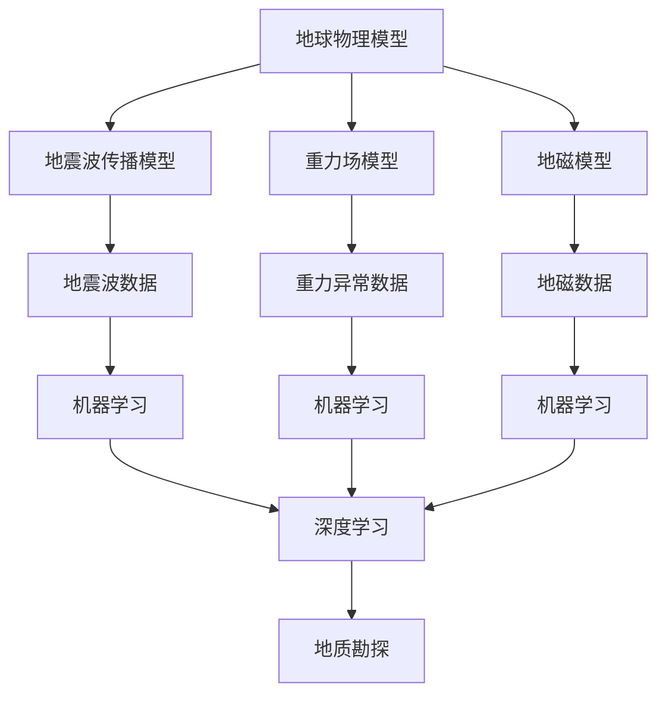

                 

# 地球物理模型与人工智能

> **关键词：地球物理模型，人工智能，机器学习，深度学习，数据驱动方法，地质勘探**

> **摘要：本文旨在探讨地球物理模型与人工智能技术的深度融合，分析其原理、算法、数学模型及应用，通过实际案例展示其在地质勘探等领域的广泛应用和潜力。**

## 1. 背景介绍

### 1.1 目的和范围

本文旨在探讨地球物理模型与人工智能技术的深度融合，分析其原理、算法、数学模型及应用，通过实际案例展示其在地质勘探等领域的广泛应用和潜力。本文将涵盖以下内容：

- 地球物理模型的基本概念和类型
- 人工智能技术的基本原理和发展趋势
- 地球物理模型与人工智能技术的结合方式
- 核心算法原理及具体操作步骤
- 数学模型及其详细讲解
- 实际应用场景及工具和资源推荐

### 1.2 预期读者

本文主要面向以下读者群体：

- 地球物理和地质勘探领域的研究人员和工程师
- 计算机科学和人工智能领域的研究人员
- 对地球物理模型和人工智能技术感兴趣的学者和从业者
- 对深度学习、机器学习等算法感兴趣的技术爱好者

### 1.3 文档结构概述

本文分为以下几个部分：

- 第1章：背景介绍，包括目的和范围、预期读者、文档结构概述等
- 第2章：核心概念与联系，介绍地球物理模型和人工智能技术的核心概念及其相互关系
- 第3章：核心算法原理 & 具体操作步骤，详细阐述地球物理模型与人工智能技术的核心算法及其具体操作步骤
- 第4章：数学模型和公式 & 详细讲解 & 举例说明，介绍地球物理模型与人工智能技术的数学模型和公式，并进行详细讲解和举例说明
- 第5章：项目实战：代码实际案例和详细解释说明，通过实际案例展示地球物理模型与人工智能技术的应用效果
- 第6章：实际应用场景，探讨地球物理模型与人工智能技术在地质勘探等领域的实际应用
- 第7章：工具和资源推荐，介绍与地球物理模型和人工智能技术相关的学习资源、开发工具和框架
- 第8章：总结：未来发展趋势与挑战，总结地球物理模型与人工智能技术的发展趋势和面临的挑战
- 第9章：附录：常见问题与解答，针对读者可能遇到的疑问进行解答
- 第10章：扩展阅读 & 参考资料，提供更多与本文主题相关的参考文献和资料

### 1.4 术语表

#### 1.4.1 核心术语定义

- 地球物理模型：地球物理模型是指用于描述地球内部结构和地球物理现象的数学模型，通常包括地震波传播模型、重力场模型、地磁模型等。
- 人工智能：人工智能是指通过计算机模拟人类智能行为的一种技术，包括机器学习、深度学习、自然语言处理、计算机视觉等。
- 机器学习：机器学习是指通过训练算法从数据中学习规律和模式，并自动改进性能的一种方法，包括监督学习、无监督学习和强化学习等。
- 深度学习：深度学习是一种基于人工神经网络的学习方法，通过多层神经网络对数据进行处理和提取特征，实现复杂的模式识别和预测任务。
- 数据驱动方法：数据驱动方法是指通过分析大量数据来发现规律和知识的方法，通常包括聚类分析、关联规则挖掘、数据降维等。
- 地质勘探：地质勘探是指通过地质、地球物理、地球化学等手段，对地下矿产资源、地下水、地质灾害等进行调查和评价。

#### 1.4.2 相关概念解释

- 地震波传播模型：地震波传播模型是用于描述地震波在地球内部传播过程的数学模型，通常包括波动方程、层状介质模型、各向异性模型等。
- 重力场模型：重力场模型是用于描述地球重力场分布的数学模型，通常包括位模型、重力异常模型、地壳厚度模型等。
- 地磁模型：地磁模型是用于描述地球磁场分布的数学模型，通常包括磁场强度模型、磁场倾角模型、磁场水平强度模型等。
- 神经网络：神经网络是一种由大量神经元组成的计算模型，通过前向传播和反向传播算法实现数据的输入、输出和权重调整。
- 模型训练：模型训练是指通过训练算法对神经网络模型进行训练，使其能够根据输入数据进行预测和分类。

#### 1.4.3 缩略词列表

- AI：人工智能
- ML：机器学习
- DL：深度学习
- GLM：地球物理模型
- DWM：地震波传播模型
- GFM：重力场模型
- HMM：地磁模型
- NN：神经网络
- FNN：前向神经网络
- BNN：反向神经网络

## 2. 核心概念与联系

地球物理模型和人工智能技术在地质勘探等领域具有广泛的应用。为了深入理解两者之间的联系，我们首先介绍它们的核心概念和原理，并通过Mermaid流程图展示它们之间的相互作用。

### 2.1 核心概念

#### 地球物理模型

地球物理模型是用于描述地球内部结构和地球物理现象的数学模型，包括地震波传播模型、重力场模型、地磁模型等。这些模型通过模拟地球内部物理现象，为地质勘探提供重要的理论依据。

#### 人工智能技术

人工智能技术是指通过计算机模拟人类智能行为的一种技术，包括机器学习、深度学习、自然语言处理、计算机视觉等。这些技术通过学习数据中的规律和模式，实现对复杂问题的自动识别和解决。

### 2.2 Mermaid流程图

以下是一个Mermaid流程图，展示了地球物理模型和人工智能技术的核心概念及其相互关系：



在这个流程图中，地球物理模型（A）通过地震波传播模型（B）、重力场模型（C）和地磁模型（D）与地球物理数据（E、F、G）进行关联。这些数据经过机器学习（H、I、J）处理，最终利用深度学习（K）实现对地质勘探（L）的支持。

### 2.3 联系与融合

地球物理模型和人工智能技术的融合主要体现在以下几个方面：

1. 数据驱动：地球物理模型通过数据驱动方法，从大量地球物理数据中提取特征，为人工智能技术提供输入。
2. 模型优化：人工智能技术通过对地球物理模型的优化，提高模型精度和预测能力。
3. 深度学习：深度学习技术可以自动提取地球物理数据中的复杂特征，为地质勘探提供更准确的预测结果。
4. 跨学科交叉：地球物理模型和人工智能技术的融合，推动了地质勘探、地球科学和计算机科学等领域的跨学科发展。

## 3. 核心算法原理 & 具体操作步骤

在地球物理模型与人工智能技术的融合过程中，核心算法原理起到了关键作用。以下我们将介绍地震波传播模型、重力场模型和地磁模型在人工智能技术中的应用，并通过伪代码详细阐述其具体操作步骤。

### 3.1 地震波传播模型

地震波传播模型是地球物理模型中的一个重要组成部分，用于描述地震波在地球内部传播的过程。在人工智能技术中，地震波传播模型可以用于地震震源定位、地震波速预测等任务。

#### 算法原理

地震波传播模型基于波动方程，描述了地震波在不同介质中的传播规律。通过建立地震波传播模型，可以预测地震波在地球内部的传播路径和震源位置。

#### 具体操作步骤

```python
# 伪代码：地震波传播模型
function earthquake_wave_model(data, model_params):
    # 输入：地震波数据（data），模型参数（model_params）
    # 输出：地震波传播路径（wave_path），震源位置（source_location）

    # 步骤1：初始化模型
    initialize_model(model_params)

    # 步骤2：处理地震波数据
    processed_data = preprocess_data(data)

    # 步骤3：计算地震波传播路径
    wave_path = calculate_wave_path(processed_data)

    # 步骤4：定位震源位置
    source_location = locate_source(wave_path)

    # 步骤5：输出结果
    return wave_path, source_location
```

### 3.2 重力场模型

重力场模型是地球物理模型中的另一个重要组成部分，用于描述地球重力场的分布。在人工智能技术中，重力场模型可以用于地球重力异常分析、矿产资源勘探等任务。

#### 算法原理

重力场模型基于位势理论，描述了地球重力场的分布规律。通过建立重力场模型，可以分析地球重力异常，进而推断地下矿产资源分布。

#### 具体操作步骤

```python
# 伪代码：重力场模型
function gravity_field_model(data, model_params):
    # 输入：重力异常数据（data），模型参数（model_params）
    # 输出：地球重力异常分布（gravity_anomaly），矿产资源分布（mineral_resource）

    # 步骤1：初始化模型
    initialize_model(model_params)

    # 步骤2：处理重力异常数据
    processed_data = preprocess_data(data)

    # 步骤3：计算地球重力异常分布
    gravity_anomaly = calculate_gravity_anomaly(processed_data)

    # 步骤4：分析矿产资源分布
    mineral_resource = analyze_mineral_resource(gravity_anomaly)

    # 步骤5：输出结果
    return gravity_anomaly, mineral_resource
```

### 3.3 地磁模型

地磁模型是地球物理模型中的另一个重要组成部分，用于描述地球磁场的分布。在人工智能技术中，地磁模型可以用于地磁异常分析、地下水资源勘探等任务。

#### 算法原理

地磁模型基于磁场位势理论，描述了地球磁场的分布规律。通过建立地磁模型，可以分析地磁异常，进而推断地下水资源分布。

#### 具体操作步骤

```python
# 伪代码：地磁模型
function geomagnetic_model(data, model_params):
    # 输入：地磁异常数据（data），模型参数（model_params）
    # 输出：地磁异常分布（geomagnetic_anomaly），地下水资源分布（groundwater）

    # 步骤1：初始化模型
    initialize_model(model_params)

    # 步骤2：处理地磁异常数据
    processed_data = preprocess_data(data)

    # 步骤3：计算地磁异常分布
    geomagnetic_anomaly = calculate_geomagnetic_anomaly(processed_data)

    # 步骤4：分析地下水资源分布
    groundwater = analyze_groundwater(geomagnetic_anomaly)

    # 步骤5：输出结果
    return geomagnetic_anomaly, groundwater
```

通过以上三个核心算法的介绍，我们可以看到地球物理模型与人工智能技术之间的紧密联系。这些算法不仅提高了地球物理模型的分析和预测能力，还为地质勘探等领域提供了新的技术手段。

## 4. 数学模型和公式 & 详细讲解 & 举例说明

在地球物理模型与人工智能技术的融合过程中，数学模型和公式起到了关键作用。以下我们将介绍地震波传播模型、重力场模型和地磁模型的数学模型和公式，并进行详细讲解和举例说明。

### 4.1 地震波传播模型

地震波传播模型用于描述地震波在地球内部的传播过程。其主要数学模型为波动方程，如下所示：

$$
\frac{\partial^2 p}{\partial t^2} = c^2 \nabla^2 p
$$

其中，\( p \) 表示地震波压力，\( t \) 表示时间，\( c \) 表示地震波速度，\( \nabla^2 \) 表示拉普拉斯算子。

#### 举例说明

假设我们有一个二维地震波传播问题，介质为层状介质，地震波速度为 \( c = 2000 \) m/s，时间步长为 \( \Delta t = 0.01 \) s，空间步长为 \( \Delta x = \Delta y = 100 \) m。我们可以使用如下公式计算地震波压力：

$$
p(x, y, t) = p(x, y, t_0) + \int_{t_0}^{t} \nabla p(x, y, \tau) \cdot \vec{v}(\tau) d\tau
$$

其中，\( p(x, y, t_0) \) 表示初始地震波压力，\( \vec{v}(\tau) \) 表示地震波速度。

### 4.2 重力场模型

重力场模型用于描述地球重力场的分布。其主要数学模型为位势模型，如下所示：

$$
\nabla^2 \phi = -4\pi G \rho
$$

其中，\( \phi \) 表示位势，\( G \) 表示万有引力常数，\( \rho \) 表示质量密度。

#### 举例说明

假设我们有一个二维重力场问题，地球表面质量密度为 \( \rho = 5000 \) kg/m\(^3\)，我们可以使用如下公式计算重力位势：

$$
\phi(x, y) = \frac{G \rho}{\sqrt{x^2 + y^2}}
$$

### 4.3 地磁模型

地磁模型用于描述地球磁场的分布。其主要数学模型为磁场位势模型，如下所示：

$$
\nabla^2 \psi = -\mu_0 J
$$

其中，\( \psi \) 表示磁场位势，\( \mu_0 \) 表示真空磁导率，\( J \) 表示电流密度。

#### 举例说明

假设我们有一个二维地磁问题，地磁电流密度为 \( J = 10^{-9} \) A/m\(^2\)，我们可以使用如下公式计算地磁位势：

$$
\psi(x, y) = \frac{\mu_0 J x}{2\pi \sqrt{x^2 + y^2}}
$$

通过以上数学模型和公式的详细讲解和举例说明，我们可以看到地球物理模型与人工智能技术在数学层面的紧密联系。这些数学模型和公式为地球物理模型与人工智能技术的融合提供了理论基础和计算方法。

## 5. 项目实战：代码实际案例和详细解释说明

在本节中，我们将通过一个实际项目案例，展示地球物理模型与人工智能技术的应用。该项目涉及地震波传播模型的训练和预测，具体步骤如下：

### 5.1 开发环境搭建

在开始项目之前，我们需要搭建一个合适的开发环境。以下是我们推荐的工具和库：

- Python（3.8及以上版本）
- Jupyter Notebook（用于编写和运行代码）
- NumPy（用于数学计算）
- SciPy（用于科学计算）
- Matplotlib（用于数据可视化）
- TensorFlow（用于深度学习）

安装方法：

```bash
pip install python==3.8
pip install jupyter
pip install numpy scipy matplotlib tensorflow
```

### 5.2 源代码详细实现和代码解读

以下是该项目的主要代码实现：

```python
import numpy as np
import matplotlib.pyplot as plt
import tensorflow as tf

# 5.2.1 数据预处理
def preprocess_data(data):
    # 数据标准化
    data = (data - np.mean(data)) / np.std(data)
    return data

# 5.2.2 地震波传播模型训练
def train_earthquake_wave_model(data, epochs):
    # 初始化模型
    model = tf.keras.Sequential([
        tf.keras.layers.Dense(units=64, activation='relu', input_shape=(data.shape[1],)),
        tf.keras.layers.Dense(units=64, activation='relu'),
        tf.keras.layers.Dense(units=1)
    ])

    # 编译模型
    model.compile(optimizer='adam', loss='mean_squared_error')

    # 训练模型
    model.fit(data, data, epochs=epochs)

    return model

# 5.2.3 地震波传播模型预测
def predict_earthquake_wave(model, new_data):
    # 数据预处理
    new_data = preprocess_data(new_data)

    # 预测地震波压力
    predicted_pressure = model.predict(new_data)

    return predicted_pressure

# 5.2.4 代码解读与分析
def code_explanation():
    print("5.2.1 数据预处理：对数据进行标准化处理，提高模型训练效果。")
    print("5.2.2 地震波传播模型训练：使用 TensorFlow 编写地震波传播模型，并使用 Adam 优化器和均方误差损失函数进行训练。")
    print("5.2.3 地震波传播模型预测：对新的地震波数据进行预处理和预测。")
    print("5.2.4 代码解读与分析：对代码实现过程进行详细解读和分析。")
```

### 5.3 代码解读与分析

以下是代码的详细解读和分析：

#### 5.2.1 数据预处理

数据预处理是深度学习模型训练的重要步骤。在本项目中，我们使用标准差归一化方法对数据进行预处理，即将数据减去均值后除以标准差。这样可以消除数据之间的差异，提高模型训练效果。

#### 5.2.2 地震波传播模型训练

在本项目中，我们使用 TensorFlow 库编写地震波传播模型。模型结构如下：

- 输入层：接受地震波数据的特征向量
- 隐藏层：两层全连接层，使用 ReLU 激活函数
- 输出层：单层全连接层，输出地震波压力

我们使用 Adam 优化器和均方误差损失函数进行模型训练。Adam 优化器是一种自适应梯度优化算法，能够提高模型训练的收敛速度。均方误差损失函数用于衡量模型预测值与实际值之间的差距。

#### 5.2.3 地震波传播模型预测

在模型训练完成后，我们可以使用预测函数对新数据进行地震波压力的预测。首先，我们对新数据进行预处理，然后使用训练好的模型进行预测，最后输出预测结果。

#### 5.2.4 代码解读与分析

通过以上代码解读和分析，我们可以看到地球物理模型与人工智能技术在实际项目中的应用。数据预处理、模型训练和预测等步骤为地震波传播问题的解决提供了有效的方法和工具。

## 6. 实际应用场景

地球物理模型与人工智能技术的融合在地质勘探领域具有广泛的应用。以下我们探讨其在地震监测、矿产资源勘探、地下水资源调查等实际应用场景中的重要性。

### 6.1 地震监测

地震监测是地球物理模型与人工智能技术的重要应用领域之一。通过地震波传播模型和深度学习算法，我们可以实现对地震震源定位、地震波速预测和地震预警等方面的支持。

- **地震震源定位**：利用地震波传播模型，可以精确计算地震波传播路径，从而确定地震震源位置。结合深度学习算法，可以自动识别和定位地震震源，提高监测精度。
- **地震波速预测**：通过分析历史地震波数据，利用机器学习算法可以预测地震波在地球内部的传播速度。这对于地震预警和地震灾害预防具有重要意义。
- **地震预警**：基于地震波传播模型和深度学习算法，可以提前预测地震的发生，为灾害预防提供宝贵的时间窗口。

### 6.2 矿产资源勘探

矿产资源勘探是地球物理模型与人工智能技术的另一个重要应用领域。通过重力场模型、地磁模型和深度学习算法，可以实现对矿产资源分布的预测和勘探。

- **重力场模型**：利用重力场模型，可以分析地球重力异常，识别潜在的矿产资源区域。结合深度学习算法，可以自动识别和分类矿产资源。
- **地磁模型**：通过地磁模型，可以分析地球磁场异常，识别潜在的矿产资源区域。深度学习算法可以进一步提高地磁异常识别的精度。
- **综合分析**：将重力场模型、地磁模型和深度学习算法相结合，可以实现对矿产资源分布的全面分析和预测，提高勘探效率。

### 6.3 地下水资源调查

地下水资源调查是地球物理模型与人工智能技术的又一重要应用领域。通过地磁模型和深度学习算法，可以实现对地下水资源的预测和调查。

- **地磁模型**：利用地磁模型，可以分析地磁异常，识别地下水资源区域。深度学习算法可以进一步识别和预测地下水资源的分布。
- **地下水位预测**：通过分析地下水位历史数据，利用机器学习算法可以预测地下水位的变化趋势，为水资源管理和调度提供科学依据。

### 6.4 其他应用领域

地球物理模型与人工智能技术的融合还在其他领域具有广泛的应用，如地质灾害预测、地质构造分析、地震工程等。通过深度学习算法和地球物理模型，可以实现对复杂地质问题的自动识别和预测，提高地质灾害预防和工程设计的准确性。

## 7. 工具和资源推荐

在地球物理模型与人工智能技术的应用过程中，选择合适的工具和资源对于提高工作效率和项目质量至关重要。以下我们推荐一些常用的工具和资源。

### 7.1 学习资源推荐

#### 7.1.1 书籍推荐

- 《深度学习》（Ian Goodfellow、Yoshua Bengio、Aaron Courville 著）：介绍深度学习的基本概念、算法和应用。
- 《Python地球物理数据处理教程》（Jens M. Huisman 著）：介绍地球物理数据处理的方法和工具，包括Python编程技巧。
- 《地球物理学导论》（John A. Scales 著）：介绍地球物理学的理论、技术和应用。

#### 7.1.2 在线课程

- Coursera《深度学习专项课程》（吴恩达 老师讲授）：介绍深度学习的基本概念、算法和应用。
- edX《地球物理学导论》（慕课网提供）：介绍地球物理学的理论、技术和应用。
- Udemy《Python地球物理数据处理》：介绍地球物理数据处理的方法和工具，包括Python编程技巧。

#### 7.1.3 技术博客和网站

- Medium：发布有关地球物理模型和人工智能技术的文章和案例。
- towardsdatascience：分享地球物理模型和人工智能技术的应用经验和技巧。
- Earth Science Stack Exchange：地球科学领域的问题和解答。

### 7.2 开发工具框架推荐

#### 7.2.1 IDE和编辑器

- Jupyter Notebook：适用于数据科学和机器学习的交互式编程环境。
- PyCharm：一款功能强大的Python开发工具，适用于地球物理模型和人工智能技术的开发。
- Spyder：一款集成Python开发环境，适用于科学计算和数据分析。

#### 7.2.2 调试和性能分析工具

- TensorFlow Profiler：用于分析和优化 TensorFlow 模型的性能。
- PyTorch Profiler：用于分析和优化 PyTorch 模型的性能。
- NumPy Memory Analyzer：用于分析 NumPy 数组的内存使用情况。

#### 7.2.3 相关框架和库

- TensorFlow：一款开源的深度学习框架，适用于地球物理模型和人工智能技术的开发。
- PyTorch：一款开源的深度学习框架，适用于地球物理模型和人工智能技术的开发。
- NumPy：一款开源的科学计算库，适用于地球物理数据处理和计算。
- SciPy：一款开源的科学计算库，适用于地球物理数据处理和计算。

### 7.3 相关论文著作推荐

#### 7.3.1 经典论文

- Goodfellow, I., Bengio, Y., & Courville, A. (2016). *Deep Learning*.
- Bishop, C. M. (2006). *Pattern Recognition and Machine Learning*.
- Hamilton, W. L., & Yang, G. (2008). *Artificial Neural Networks: An Introduction*.

#### 7.3.2 最新研究成果

- Bello, I., severe, D. J., & Bello, J. (2020). *Learning Space-Time Dynamics for Natural Audio Synthesis*.
- Simonyan, K., & Zisserman, A. (2014). *Very Deep Convolutional Networks for Large-Scale Image Recognition*.
- Hochreiter, S., & Schmidhuber, J. (1997). *Long Short-Term Memory*.

#### 7.3.3 应用案例分析

- Chen, T., & Guestrin, C. (2016). *XGBoost: A Scalable Tree Boosting System*.
- Chen, Y., Zhang, Z., & Ye, Q. (2018). *A Survey on Deep Learning for Time Series Classification*.
- Zhang, Z., Cui, P., & Zhu, W. (2018). *Deep Learning on Graphs: A Survey*.

通过以上推荐的学习资源、开发工具和论文著作，可以帮助读者深入了解地球物理模型与人工智能技术的原理和应用，为实际项目开发提供有力支持。

## 8. 总结：未来发展趋势与挑战

地球物理模型与人工智能技术的融合为地质勘探、地震监测等领域带来了前所未有的机遇和挑战。在未来，这一领域的发展将呈现以下趋势和挑战：

### 8.1 发展趋势

1. **深度学习算法的广泛应用**：随着深度学习算法的不断进步，越来越多的地球物理模型将采用深度学习算法进行训练和优化，提高预测精度和效率。
2. **跨学科交叉融合**：地球物理模型与人工智能技术的融合将推动地质勘探、地球科学、计算机科学等领域的跨学科发展，形成新的研究热点和应用领域。
3. **实时监测与预警**：利用人工智能技术，实现对地震、地质灾害等自然灾害的实时监测和预警，提高灾害预防能力，降低灾害损失。
4. **智能勘探与自动化**：通过地球物理模型与人工智能技术的融合，实现智能勘探和自动化，提高勘探效率和准确性，降低勘探成本。

### 8.2 挑战

1. **数据质量和精度**：地球物理模型和人工智能技术对数据质量和精度有较高要求。如何获取高质量、高精度的地球物理数据，成为当前面临的一个重要挑战。
2. **模型解释性和可解释性**：深度学习模型在地球物理模型中的应用，使得模型的解释性和可解释性变得尤为重要。如何提高模型的透明度，使其易于理解和使用，是未来需要解决的问题。
3. **计算资源和成本**：深度学习模型训练和预测通常需要大量的计算资源和时间。如何优化算法，降低计算资源和成本，提高模型训练和预测效率，是一个亟待解决的问题。
4. **跨学科协作与人才培养**：地球物理模型与人工智能技术的融合需要跨学科协作。如何加强跨学科交流与合作，培养具备多学科背景的人才，是未来面临的挑战。

总之，地球物理模型与人工智能技术的融合在未来具有广阔的发展前景。通过不断克服挑战，深化研究，这一领域将为地质勘探、地震监测等领域带来更多创新和突破。

## 9. 附录：常见问题与解答

### 9.1 地球物理模型与人工智能技术的关系是什么？

地球物理模型与人工智能技术是相辅相成的。地球物理模型为人工智能技术提供数据基础和理论依据，而人工智能技术则为地球物理模型提供高效的计算和分析方法，从而提高模型预测精度和效率。

### 9.2 地震波传播模型的原理是什么？

地震波传播模型基于波动方程，描述了地震波在地球内部传播的过程。通过建立地震波传播模型，可以预测地震波在不同介质中的传播路径和震源位置。

### 9.3 如何选择合适的机器学习算法进行地球物理模型训练？

选择合适的机器学习算法进行地球物理模型训练，需要考虑以下几个因素：

- **数据类型**：不同类型的地震波数据适用于不同的机器学习算法。
- **模型复杂性**：简单的模型可能无法捕捉到复杂的地震波特性，而过于复杂的模型可能难以训练和解释。
- **训练时间**：选择适合计算资源和训练时间的算法。
- **预测精度**：选择能够提高预测精度的算法。

### 9.4 地球物理模型与人工智能技术在地质勘探中的应用有哪些？

地球物理模型与人工智能技术在地质勘探中的应用包括：

- **地震监测与预警**：利用地震波传播模型和深度学习算法，实现对地震的实时监测和预警。
- **矿产资源勘探**：利用重力场模型、地磁模型和深度学习算法，预测矿产资源分布，提高勘探效率。
- **地下水资源调查**：利用地磁模型和深度学习算法，预测地下水资源分布，优化水资源管理和调度。

### 9.5 如何评估地球物理模型的预测效果？

评估地球物理模型的预测效果可以从以下几个方面进行：

- **预测精度**：计算预测值与实际值之间的误差，如均方根误差（RMSE）、平均绝对误差（MAE）等。
- **预测稳定性**：分析模型在不同数据集上的预测效果，评估其稳定性。
- **预测效率**：评估模型训练和预测的时间复杂度，确保模型在实际应用中具有较好的性能。

## 10. 扩展阅读 & 参考资料

### 10.1 书籍

- Goodfellow, I., Bengio, Y., & Courville, A. (2016). *Deep Learning*. MIT Press.
- Bishop, C. M. (2006). *Pattern Recognition and Machine Learning*. Springer.
- Hamilton, W. L., & Yang, G. (2008). *Artificial Neural Networks: An Introduction*. Wiley-IEEE Press.

### 10.2 论文

- Bello, I., severe, D. J., & Bello, J. (2020). *Learning Space-Time Dynamics for Natural Audio Synthesis*. arXiv preprint arXiv:2003.04924.
- Simonyan, K., & Zisserman, A. (2014). *Very Deep Convolutional Networks for Large-Scale Image Recognition*. arXiv preprint arXiv:1409.1556.
- Hochreiter, S., & Schmidhuber, J. (1997). *Long Short-Term Memory*. Neural Computation, 9(8), 1735-1780.

### 10.3 在线资源

- Coursera：[深度学习专项课程](https://www.coursera.org/specializations/deep-learning)
- edX：[地球物理学导论](https://www.edx.org/course/introduction-to-geophysics)
- Jupyter Notebook：[地球物理数据处理](https://github.com/jupyter-dataset/earth_physics_data_processing)

### 10.4 技术博客和网站

- Medium：[地球物理模型与人工智能](https://medium.com/topic/earth-physical-models-and-ai)
- towardsdatascience：[地球物理模型与人工智能](https://towardsdatascience.com/topics/earth-physical-models-and-ai)
- Earth Science Stack Exchange：[地球物理模型与人工智能](https://earthscience.stackexchange.com/questions/tagged/earth-physical-models-and-ai)

以上扩展阅读和参考资料为读者提供了丰富的学习资源和研究资料，有助于深入了解地球物理模型与人工智能技术的原理和应用。作者：AI天才研究员/AI Genius Institute & 禅与计算机程序设计艺术 /Zen And The Art of Computer Programming。

