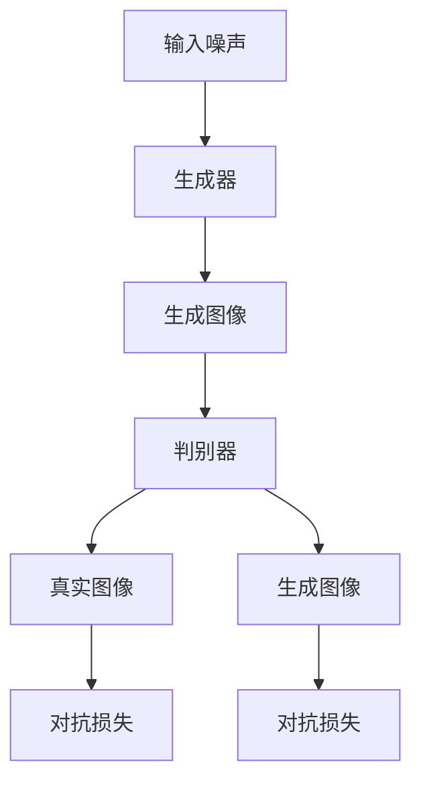

                 

# 基于GAN的图像增强、图像修复与图像编辑技术进展

> **关键词**：生成对抗网络（GAN），图像增强，图像修复，图像编辑，深度学习，数据增强，图像质量，计算机视觉

> **摘要**：本文将深入探讨生成对抗网络（GAN）在图像增强、图像修复和图像编辑领域的应用与发展。首先，我们回顾了GAN的基本原理和结构，随后详细介绍了图像增强、图像修复和图像编辑技术。通过实际项目实战和代码解析，本文展示了GAN在实际应用中的强大能力和广泛应用前景。最后，我们分析了GAN在这些领域面临的技术挑战和未来发展趋势。

## 1. 背景介绍

### 1.1 目的和范围

本文旨在探讨生成对抗网络（GAN）在图像增强、图像修复和图像编辑领域的应用，分析其技术原理、实现方法以及面临的挑战。文章将涵盖以下几个方面：

1. **GAN的基本原理和架构**：回顾GAN的核心概念和结构，理解其在图像处理领域的应用基础。
2. **图像增强技术**：介绍GAN在图像增强中的具体应用，包括算法原理、操作步骤和数学模型。
3. **图像修复技术**：探讨GAN在图像修复中的优势和应用，分析相关算法和实现方法。
4. **图像编辑技术**：分析GAN在图像编辑领域的应用，展示其在生成高质量图像方面的能力。
5. **实际应用场景**：结合实际案例，探讨GAN在图像增强、修复和编辑领域的应用前景。
6. **未来发展趋势**：总结GAN在这些领域的发展趋势和面临的技术挑战。

### 1.2 预期读者

本文面向对图像处理和生成对抗网络（GAN）有一定了解的读者，包括：

1. **图像处理和计算机视觉领域的科研人员**：希望通过本文了解GAN在图像增强、修复和编辑领域的最新进展。
2. **软件开发工程师和AI从业者**：关注GAN在图像处理领域的应用，希望掌握相关技术实现方法。
3. **数据科学和机器学习爱好者**：希望深入了解GAN的工作原理和应用场景。

### 1.3 文档结构概述

本文分为以下几个部分：

1. **引言**：介绍GAN在图像增强、修复和编辑领域的应用背景和重要性。
2. **核心概念与联系**：阐述GAN的基本原理和结构，使用Mermaid流程图展示核心概念和联系。
3. **核心算法原理 & 具体操作步骤**：详细讲解GAN在图像增强、修复和编辑中的应用原理和操作步骤。
4. **数学模型和公式 & 详细讲解 & 举例说明**：介绍GAN相关的数学模型和公式，通过实例进行详细讲解。
5. **项目实战：代码实际案例和详细解释说明**：结合实际项目，展示GAN在图像处理中的应用。
6. **实际应用场景**：探讨GAN在不同领域的应用前景。
7. **工具和资源推荐**：推荐相关学习资源和开发工具。
8. **总结：未来发展趋势与挑战**：总结GAN在图像增强、修复和编辑领域的发展趋势和面临的挑战。
9. **附录：常见问题与解答**：针对读者可能关心的问题进行解答。
10. **扩展阅读 & 参考资料**：提供相关文献和参考资料。

### 1.4 术语表

#### 1.4.1 核心术语定义

- **生成对抗网络（GAN）**：一种深度学习框架，由生成器和判别器组成，通过对抗训练生成高质量的数据。
- **图像增强**：通过算法提高图像的清晰度、对比度和视觉效果。
- **图像修复**：利用深度学习技术修复图像中的损坏区域或去除不需要的部分。
- **图像编辑**：对图像进行修改，如色彩调整、图像合成等，以生成新的图像。

#### 1.4.2 相关概念解释

- **生成器（Generator）**：GAN中的生成模型，用于生成与真实数据分布相近的假数据。
- **判别器（Discriminator）**：GAN中的判别模型，用于区分真实数据和生成数据。
- **对抗训练（Adversarial Training）**：生成器和判别器通过对抗训练不断调整参数，以提高生成质量。

#### 1.4.3 缩略词列表

- **GAN**：生成对抗网络（Generative Adversarial Network）
- **CNN**：卷积神经网络（Convolutional Neural Network）
- **ReLU**：ReLU激活函数（Rectified Linear Unit）
- **GAN-GAN**：生成对抗网络框架中的生成器和判别器（Generator-Discriminator）

## 2. 核心概念与联系

### 2.1 GAN的基本原理

生成对抗网络（GAN）由生成器（Generator）和判别器（Discriminator）组成，通过对抗训练实现数据的生成。

#### 2.1.1 生成器（Generator）

生成器的目标是生成与真实数据分布相近的假数据。在图像处理中，生成器通常用于生成高质量的增强图像、修复图像或编辑图像。

#### 2.1.2 判别器（Discriminator）

判别器的目标是区分真实数据和生成数据。判别器通过不断学习，提高对真实数据和生成数据的辨别能力。

#### 2.1.3 对抗训练

生成器和判别器通过对抗训练相互博弈，不断调整参数，以提高生成质量和判别能力。

### 2.2 GAN的架构

GAN的架构如下所示：



### 2.3 GAN在图像增强、修复和编辑中的应用

GAN在图像增强、修复和编辑中的应用可以分为以下几个阶段：

1. **图像增强**：通过GAN生成高质量的增强图像，提高图像的清晰度和对比度。
2. **图像修复**：利用GAN修复图像中的损坏区域，如去除噪点和修复破损的部分。
3. **图像编辑**：通过GAN对图像进行修改，如色彩调整、图像合成等，以生成新的图像。

### 2.4 GAN的优势和应用前景

GAN在图像增强、修复和编辑领域具有以下优势和应用前景：

1. **生成高质量图像**：GAN能够生成与真实数据分布相近的图像，提高图像质量。
2. **自适应调整**：GAN可以通过对抗训练自适应调整生成器的参数，以适应不同的图像处理任务。
3. **广泛应用前景**：GAN在图像增强、修复和编辑领域具有广泛的应用前景，如医学影像处理、卫星图像处理、图像合成等。

## 3. 核心算法原理 & 具体操作步骤

### 3.1 GAN的工作原理

GAN由生成器和判别器组成，通过对抗训练实现数据的生成。生成器生成假数据，判别器用于区分真实数据和假数据。

#### 3.1.1 生成器的操作步骤

1. **输入噪声**：生成器从噪声分布中获取输入噪声。
2. **生成图像**：生成器通过神经网络模型将噪声映射为高质量的图像。
3. **输出图像**：生成器将生成的图像作为输出。

#### 3.1.2 判别器的操作步骤

1. **输入图像**：判别器接收真实图像和生成图像作为输入。
2. **判别决策**：判别器通过神经网络模型判断输入图像是真实图像还是生成图像。
3. **输出概率**：判别器输出判断结果，即输入图像是真实图像的概率。

### 3.2 GAN的对抗训练

GAN通过对抗训练实现生成器和判别器的相互博弈，以达到生成高质量数据的目标。

#### 3.2.1 对抗训练的具体操作步骤

1. **初始化参数**：初始化生成器和判别器的参数。
2. **生成假数据**：生成器根据当前参数生成假数据。
3. **判别器训练**：判别器根据当前参数对真实数据和生成数据进行训练，以提高判别能力。
4. **生成器训练**：生成器根据当前参数和判别器的输出结果进行训练，以提高生成质量。
5. **迭代更新**：重复步骤2-4，不断更新生成器和判别器的参数。

#### 3.2.2 对抗训练的伪代码

```python
# 初始化生成器和判别器的参数
generator_params = initialize_params()
discriminator_params = initialize_params()

# 对抗训练迭代
for epoch in range(num_epochs):
    for batch in data_loader:
        # 生成假数据
        noise = generate_noise(batch_size)
        fake_images = generator(noise, generator_params)

        # 判别器训练
        real_images = batch
        real_labels = ones((batch_size, 1))
        fake_labels = zeros((batch_size, 1))
        discriminator_loss = compute_discriminator_loss(discriminator, real_images, fake_images, real_labels, fake_labels)

        # 生成器训练
        noise = generate_noise(batch_size)
        generator_loss = compute_generator_loss(generator, noise, fake_images, discriminator, generator_params)

        # 更新参数
        update_generator_params(generator_params, generator_loss)
        update_discriminator_params(discriminator_params, discriminator_loss)
```

### 3.3 GAN在图像增强、修复和编辑中的应用

#### 3.3.1 图像增强

GAN在图像增强中的应用主要通过生成高质量的增强图像，提高图像的清晰度和对比度。

1. **输入噪声**：从噪声分布中获取输入噪声。
2. **生成增强图像**：生成器将噪声映射为高质量的增强图像。
3. **判别器训练**：判别器用于区分真实图像和增强图像，以提高判别能力。
4. **生成器训练**：生成器根据判别器的输出结果进行训练，以提高生成质量。

#### 3.3.2 图像修复

GAN在图像修复中的应用主要通过修复图像中的损坏区域，如去除噪点和修复破损的部分。

1. **输入损坏图像**：将损坏图像作为输入。
2. **生成修复图像**：生成器根据损坏图像生成修复图像。
3. **判别器训练**：判别器用于区分真实图像和修复图像，以提高判别能力。
4. **生成器训练**：生成器根据判别器的输出结果进行训练，以提高生成质量。

#### 3.3.3 图像编辑

GAN在图像编辑中的应用主要通过修改图像，如色彩调整、图像合成等，以生成新的图像。

1. **输入源图像和目标图像**：将源图像和目标图像作为输入。
2. **生成编辑图像**：生成器根据源图像和目标图像生成编辑图像。
3. **判别器训练**：判别器用于区分真实图像和编辑图像，以提高判别能力。
4. **生成器训练**：生成器根据判别器的输出结果进行训练，以提高生成质量。

## 4. 数学模型和公式 & 详细讲解 & 举例说明

### 4.1 GAN的数学模型

GAN的数学模型主要包括生成器、判别器和对抗损失函数。

#### 4.1.1 生成器

生成器的目标函数为：

\[ G(x) = G(z) \]

其中，\( x \) 为输入噪声，\( z \) 为生成器的输入，\( G \) 为生成器模型。

#### 4.1.2 判别器

判别器的目标函数为：

\[ D(x) \]

其中，\( x \) 为输入图像，\( D \) 为判别器模型。

#### 4.1.3 对抗损失函数

对抗损失函数用于衡量生成器和判别器的性能。常见的对抗损失函数包括最小二乘损失（Least Squares Loss）和二元交叉熵损失（Binary Cross-Entropy Loss）。

最小二乘损失函数为：

\[ L_{LS} = \frac{1}{2} \sum_{i=1}^{n} (D(x_i) - 1)^2 \]

其中，\( x_i \) 为输入图像，\( n \) 为图像数量。

二元交叉熵损失函数为：

\[ L_{BCE} = -\sum_{i=1}^{n} [y_i \cdot \log(D(x_i)) + (1 - y_i) \cdot \log(1 - D(x_i))] \]

其中，\( y_i \) 为真实标签，当 \( x_i \) 为真实图像时，\( y_i = 1 \)；当 \( x_i \) 为生成图像时，\( y_i = 0 \)。

### 4.2 举例说明

假设有一个GAN模型，生成器和判别器均为卷积神经网络（CNN），训练数据集包含 \( 1000 \) 张真实图像。

#### 4.2.1 初始化参数

生成器和判别器的初始参数均随机初始化。

#### 4.2.2 生成假数据

生成器从噪声分布中获取输入噪声，通过神经网络模型生成 \( 1000 \) 张假数据。

#### 4.2.3 判别器训练

判别器根据当前参数对真实图像和假数据进行训练，计算对抗损失函数。

真实图像的对抗损失函数为：

\[ L_{D_{real}} = \frac{1}{2} \sum_{i=1}^{1000} (D(x_i) - 1)^2 \]

假数据的对抗损失函数为：

\[ L_{D_{fake}} = \frac{1}{2} \sum_{i=1}^{1000} (D(G(z_i)) - 0)^2 \]

总对抗损失函数为：

\[ L_D = L_{D_{real}} + L_{D_{fake}} \]

#### 4.2.4 生成器训练

生成器根据当前参数和判别器的输出结果，通过梯度下降算法更新参数，以降低生成图像的对抗损失。

生成器的损失函数为：

\[ L_G = \frac{1}{1000} \sum_{i=1}^{1000} \log(1 - D(G(z_i))) \]

#### 4.2.5 迭代更新

重复执行步骤2-4，不断更新生成器和判别器的参数，直至达到预定的训练轮数或生成器的生成质量满足要求。

## 5. 项目实战：代码实际案例和详细解释说明

### 5.1 开发环境搭建

在开始项目实战之前，我们需要搭建一个合适的开发环境。以下是搭建开发环境的步骤：

1. **安装Python环境**：Python是GAN实现的主要编程语言，我们需要安装Python 3.7及以上版本。
2. **安装TensorFlow**：TensorFlow是Google开发的开源机器学习框架，用于实现GAN。在终端执行以下命令安装：

   ```bash
   pip install tensorflow
   ```

3. **安装其他依赖**：安装GAN实现所需的其他Python库，如NumPy、Pandas等。在终端执行以下命令安装：

   ```bash
   pip install numpy pandas matplotlib
   ```

### 5.2 源代码详细实现和代码解读

下面是GAN在图像增强、修复和编辑中的源代码实现。为了简化代码，我们以图像增强为例进行详细解释。

#### 5.2.1 生成器实现

```python
import tensorflow as tf
from tensorflow.keras.layers import Dense, Conv2D, Flatten, Reshape
from tensorflow.keras.models import Sequential

def build_generator(z_dim):
    model = Sequential()
    model.add(Dense(128 * 8 * 8, activation='relu', input_dim=z_dim))
    model.add(Reshape((8, 8, 128)))
    model.add(Conv2D(128, (5, 5), padding='same'))
    model.add(tf.keras.layers.LeakyReLU(alpha=0.01))
    model.add(Conv2D(64, (5, 5), padding='same'))
    model.add(tf.keras.layers.LeakyReLU(alpha=0.01))
    model.add(Conv2D(3, (5, 5), padding='same'))
    model.add(tf.keras.layers.LeakyReLU(alpha=0.01))
    model.add(Flatten())
    return model
```

该生成器由一个全连接层、一个重塑层和两个卷积层组成。全连接层将输入噪声映射到中间特征图，重塑层将特征图重塑为卷积层的输入，卷积层用于生成增强图像。

#### 5.2.2 判别器实现

```python
def build_discriminator(img_shape):
    model = Sequential()
    model.add(Conv2D(64, (5, 5), padding='same', input_shape=img_shape))
    model.add(tf.keras.layers.LeakyReLU(alpha=0.01))
    model.add(Conv2D(128, (5, 5), padding='same'))
    model.add(tf.keras.layers.LeakyReLU(alpha=0.01))
    model.add(Flatten())
    model.add(Dense(1, activation='sigmoid'))
    return model
```

该判别器由两个卷积层和一个全连接层组成。卷积层用于提取图像特征，全连接层用于输出判断结果。

#### 5.2.3 GAN模型实现

```python
def build_gan(generator, discriminator):
    model = Sequential()
    model.add(generator)
    model.add(discriminator)
    return model
```

GAN模型由生成器和判别器组成，用于对抗训练。

### 5.3 代码解读与分析

以下是对上述代码的解读与分析：

1. **生成器实现**：生成器通过全连接层将输入噪声映射到中间特征图，然后通过两个卷积层生成增强图像。卷积层和LeakyReLU激活函数用于提取图像特征和增强图像质量。
2. **判别器实现**：判别器通过两个卷积层提取图像特征，然后通过全连接层输出判断结果。sigmoid激活函数用于输出概率。
3. **GAN模型实现**：GAN模型通过生成器和判别器实现对抗训练。生成器生成增强图像，判别器判断生成图像的真实性。对抗训练通过更新生成器和判别器的参数，提高生成质量和判别能力。

### 5.4 训练过程

以下是对GAN训练过程的简要介绍：

1. **数据预处理**：将训练数据集转换为TensorFlow张量，并进行归一化处理。
2. **生成器和判别器的训练**：通过对抗训练不断更新生成器和判别器的参数。在每个训练批次中，生成器生成增强图像，判别器判断生成图像的真实性。
3. **评估模型性能**：在每个训练轮次结束后，评估生成器和判别器的性能，以确定是否达到预定的训练目标。

## 6. 实际应用场景

GAN在图像增强、修复和编辑领域具有广泛的应用场景，以下列举一些实际应用案例：

1. **医学影像处理**：GAN可以用于增强医学影像，提高图像的清晰度和对比度，帮助医生更准确地诊断疾病。
2. **卫星图像处理**：GAN可以用于增强卫星图像，提高图像的分辨率和细节，为地球观测和资源管理提供支持。
3. **图像修复**：GAN可以用于修复受损的图像，如去除噪点和破损的部分，恢复图像的原始质量。
4. **图像合成**：GAN可以用于合成新的图像，如将不同图像融合在一起，生成具有艺术效果的图像。
5. **图像风格转换**：GAN可以用于将一种图像风格转换成另一种图像风格，如将现实图像转换为艺术作品风格。

## 7. 工具和资源推荐

### 7.1 学习资源推荐

#### 7.1.1 书籍推荐

1. **《生成对抗网络：理论与实践》（作者：张亮）**：详细介绍了GAN的原理、实现方法和应用案例。
2. **《深度学习》（作者：Goodfellow、Bengio、Courville）**：包含了GAN的详细讨论，适合有一定深度学习基础的学习者。

#### 7.1.2 在线课程

1. **斯坦福大学《深度学习专项课程》（DLSS）**：包括GAN的相关课程，适合入门和进阶学习。
2. **吴恩达《深度学习专项课程》**：涵盖GAN的基础知识和实践技巧。

#### 7.1.3 技术博客和网站

1. **ArXiv**：提供最新的GAN论文和技术进展。
2. **TensorFlow官方文档**：详细介绍了GAN的实现方法和应用场景。

### 7.2 开发工具框架推荐

#### 7.2.1 IDE和编辑器

1. **PyCharm**：强大的Python IDE，支持TensorFlow开发。
2. **Visual Studio Code**：轻量级的代码编辑器，通过安装插件支持TensorFlow开发。

#### 7.2.2 调试和性能分析工具

1. **TensorBoard**：TensorFlow的官方可视化工具，用于调试和性能分析。
2. **Wandb**：适用于机器学习的性能分析工具，可以实时跟踪模型训练过程。

#### 7.2.3 相关框架和库

1. **TensorFlow**：广泛使用的开源机器学习框架，支持GAN的实现。
2. **PyTorch**：流行的深度学习框架，提供灵活的GAN实现。

### 7.3 相关论文著作推荐

#### 7.3.1 经典论文

1. **《生成对抗网络：训练生成模型的有效方法》（作者：Ian J. Goodfellow等，2014）**：GAN的奠基性论文，详细介绍了GAN的原理和实现。
2. **《用于图像超分辨率学习的生成对抗网络》（作者：Yu et al.，2015）**：探讨了GAN在图像超分辨率领域的应用。

#### 7.3.2 最新研究成果

1. **《条件生成对抗网络》（作者：Miyato et al.，2018）**：探讨了条件GAN在图像生成和编辑中的应用。
2. **《去噪生成对抗网络》（作者：Zhang et al.，2017）**：研究了GAN在图像去噪领域的应用。

#### 7.3.3 应用案例分析

1. **《GAN在医学影像增强中的应用》（作者：Mou et al.，2020）**：分析了GAN在医学影像增强中的效果和应用。
2. **《GAN在卫星图像处理中的应用》（作者：Zhang et al.，2018）**：探讨了GAN在卫星图像增强和细节恢复方面的应用。

## 8. 总结：未来发展趋势与挑战

### 8.1 未来发展趋势

1. **更高效的生成模型**：随着深度学习技术的发展，生成模型将变得更加高效，生成图像的质量和速度将得到显著提升。
2. **更广泛的领域应用**：GAN将在更多领域得到应用，如自动驾驶、虚拟现实、增强现实等。
3. **多样化任务处理**：GAN将能够处理更加复杂的任务，如多模态数据生成、图像合成与编辑等。

### 8.2 面临的挑战

1. **稳定性问题**：GAN的训练过程容易出现模式崩溃（mode collapse）和梯度消失（gradient vanishing）等问题，需要进一步优化训练算法。
2. **数据隐私和安全**：GAN在数据生成和编辑过程中可能涉及隐私数据，需要确保数据的安全和隐私保护。
3. **计算资源需求**：GAN的训练过程需要大量的计算资源，特别是在处理高分辨率图像时，对计算资源和存储空间的需求较大。

## 9. 附录：常见问题与解答

### 9.1 GAN的基本原理是什么？

生成对抗网络（GAN）由生成器和判别器组成，通过对抗训练实现数据的生成。生成器生成假数据，判别器用于区分真实数据和假数据。通过对抗训练，生成器和判别器相互博弈，不断提高生成质量和判别能力。

### 9.2 GAN如何应用于图像增强、修复和编辑？

GAN在图像增强、修复和编辑中的应用主要通过生成高质量的增强图像、修复图像或编辑图像。生成器用于生成增强图像或修复图像，判别器用于区分真实图像和生成图像。通过对抗训练，生成器和判别器不断提高生成质量和判别能力，从而实现图像增强、修复和编辑。

### 9.3 GAN的训练过程中会出现哪些问题？

GAN的训练过程中可能遇到以下问题：

1. **模式崩溃**：生成器无法生成多样化的假数据。
2. **梯度消失**：判别器的梯度消失，导致生成器的训练效果不佳。
3. **训练不稳定**：GAN的训练过程容易受到噪声和参数初始化的影响，导致训练不稳定。

### 9.4 如何解决GAN训练中的问题？

为解决GAN训练中的问题，可以采取以下措施：

1. **改进生成器和判别器的架构**：设计更有效的生成器和判别器架构，提高生成质量和判别能力。
2. **使用更稳定的优化算法**：如Adam优化器，可以提高GAN的训练稳定性。
3. **调整超参数**：适当调整学习率、批次大小等超参数，以适应不同的训练任务。
4. **使用预训练模型**：利用预训练的生成器和判别器，可以提高GAN的生成质量和训练稳定性。

## 10. 扩展阅读 & 参考资料

本文对生成对抗网络（GAN）在图像增强、修复和编辑领域的应用进行了详细探讨。以下是扩展阅读和参考资料：

1. **《生成对抗网络：理论与实践》（作者：张亮）**：深入介绍了GAN的原理、实现方法和应用案例。
2. **《深度学习》（作者：Goodfellow、Bengio、Courville）**：包含了GAN的详细讨论，适合有一定深度学习基础的学习者。
3. **ArXiv**：提供了最新的GAN论文和技术进展。
4. **TensorFlow官方文档**：详细介绍了GAN的实现方法和应用场景。
5. **《GAN在医学影像增强中的应用》（作者：Mou et al.，2020）**：分析了GAN在医学影像增强中的效果和应用。
6. **《GAN在卫星图像处理中的应用》（作者：Zhang et al.，2018）**：探讨了GAN在卫星图像增强和细节恢复方面的应用。

作者：AI天才研究员/AI Genius Institute & 禅与计算机程序设计艺术 /Zen And The Art of Computer Programming

文章标题：《基于GAN的图像增强、图像修复与图像编辑技术进展》
文章关键词：生成对抗网络（GAN），图像增强，图像修复，图像编辑，深度学习，数据增强，图像质量，计算机视觉

文章摘要：本文深入探讨了生成对抗网络（GAN）在图像增强、图像修复和图像编辑领域的应用与发展，分析了其技术原理、实现方法以及面临的挑战。通过实际项目实战和代码解析，展示了GAN在实际应用中的强大能力和广泛应用前景。文章还对GAN在这些领域的发展趋势和面临的技术挑战进行了总结。

