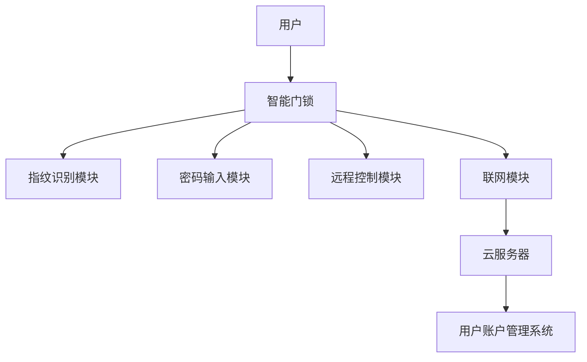

                 

# 基于Java的智能家居设计：使用Java与Raspberry Pi创造智能门锁

> **关键词：**智能家居，Java，Raspberry Pi，智能门锁，物联网，编程

> **摘要：**本文将详细介绍如何使用Java编程语言和Raspberry Pi单板计算机实现一个智能门锁系统。我们将从背景介绍、核心概念、算法原理、数学模型、项目实战、实际应用场景、工具和资源推荐等多个方面，深入探讨智能家居设计的实现过程，为读者提供实用的技术指导和深刻的思考。

## 1. 背景介绍

### 1.1 目的和范围

随着物联网技术的迅猛发展，智能家居已成为现代生活的重要趋势。智能家居系统通过将家庭设备和互联网连接起来，为用户提供便捷、舒适和智能化的生活体验。本文旨在探讨如何使用Java编程语言和Raspberry Pi单板计算机实现一个智能门锁系统，以展示智能家居系统的设计与实现过程。

本文将涵盖以下内容：

- Java编程语言的基本介绍与使用方法
- Raspberry Pi单板计算机的特点及其在智能家居中的应用
- 智能门锁系统的设计与实现
- 项目实战中的代码实现与解析
- 实际应用场景的探讨
- 相关工具和资源的推荐

### 1.2 预期读者

本文适合具有以下背景的读者：

- 对智能家居系统感兴趣的初学者
- Java编程语言的学习者
- Raspberry Pi单板计算机的爱好者
- 对物联网技术有兴趣的技术人员
- 希望提高编程技能和实际项目经验的技术工作者

### 1.3 文档结构概述

本文将分为以下章节：

- 第1章：背景介绍，包括目的与范围、预期读者、文档结构概述
- 第2章：核心概念与联系，介绍智能家居系统的核心概念及其关联
- 第3章：核心算法原理 & 具体操作步骤，讲解智能门锁系统的算法原理和实现步骤
- 第4章：数学模型和公式 & 详细讲解 & 举例说明，介绍智能门锁系统的数学模型和公式
- 第5章：项目实战：代码实际案例和详细解释说明，展示智能门锁系统的代码实现
- 第6章：实际应用场景，探讨智能门锁系统在实际生活中的应用
- 第7章：工具和资源推荐，推荐与智能门锁系统相关的学习资源和开发工具
- 第8章：总结：未来发展趋势与挑战，展望智能家居系统的未来发展趋势和面临的挑战
- 第9章：附录：常见问题与解答，提供智能门锁系统的常见问题解答
- 第10章：扩展阅读 & 参考资料，推荐与智能门锁系统相关的扩展阅读和参考资料

### 1.4 术语表

#### 1.4.1 核心术语定义

- **智能家居：**指通过物联网技术将家庭设备连接起来，实现智能化控制和管理的家庭环境。
- **Java：**一种广泛使用的面向对象的编程语言，具有良好的跨平台性和丰富的类库支持。
- **Raspberry Pi：**一种低成本、高性能的单板计算机，广泛应用于物联网项目和嵌入式系统开发。
- **智能门锁：**一种通过电子技术实现的门锁系统，可实现远程控制、指纹识别、密码输入等多种开锁方式。

#### 1.4.2 相关概念解释

- **物联网：**将各种物理设备、传感器、软件等通过互联网连接起来，实现信息交换和智能控制。
- **编程：**使用计算机语言编写程序，实现特定功能的过程。
- **单板计算机：**一种集成了处理器、内存、存储等功能的独立计算机系统，常用于嵌入式系统和物联网项目。

#### 1.4.3 缩略词列表

- **IoT：**物联网（Internet of Things）
- **Java：**Java编程语言
- **Raspberry Pi：**Raspberry Pi单板计算机
- **SSL：**安全套接层（Secure Sockets Layer）
- **JSON：**JavaScript对象表示法（JavaScript Object Notation）

## 2. 核心概念与联系

### 2.1 智能家居系统概述

智能家居系统是指利用物联网技术将家庭中的各种设备连接起来，实现智能化管理和控制。这些设备包括照明、空调、安防、门锁等。智能家居系统的主要目标是为用户提供便捷、舒适和智能化的生活体验。

### 2.2 Java与Raspberry Pi在智能家居中的应用

Java编程语言在智能家居系统中有着广泛的应用。首先，Java具有良好的跨平台性和丰富的类库支持，可以轻松实现各种设备和系统的连接与通信。其次，Raspberry Pi单板计算机作为一种低成本、高性能的嵌入式系统，非常适合用于智能家居项目。

### 2.3 智能门锁系统设计

智能门锁系统是智能家居系统中的一项重要功能。它通过电子技术实现门锁的远程控制、指纹识别、密码输入等多种开锁方式。下面是一个智能门锁系统的基本架构：



### 2.4 关联概念解释

- **指纹识别模块：**通过指纹识别技术实现门锁的自动开锁。
- **密码输入模块：**通过密码输入方式实现门锁的开锁。
- **远程控制模块：**通过互联网实现门锁的远程控制。
- **联网模块：**将门锁系统与互联网连接，实现数据传输和远程控制。
- **云服务器：**用于存储和管理用户账户信息、门锁状态等数据。

## 3. 核心算法原理 & 具体操作步骤

### 3.1 指纹识别算法原理

指纹识别算法是智能门锁系统中的核心组成部分。其基本原理是通过指纹图像的预处理、特征提取和匹配，实现指纹的识别。

- **预处理：**对指纹图像进行灰度化、二值化等处理，去除噪声和干扰。
- **特征提取：**对预处理后的指纹图像进行特征点提取，如纹线起点、终点、分支点等。
- **匹配：**将采集到的指纹与预先存储的指纹进行匹配，判断是否为同一指纹。

### 3.2 Java实现指纹识别算法

以下是使用Java实现的指纹识别算法伪代码：

```java
public class FingerprintRecognition {
    // 预处理
    public static FingerprintImage preprocess(FingerprintImage image) {
        // 灰度化、二值化等处理
        // ...
        return processedImage;
    }
    
    // 特征点提取
    public static List<Point> extractFeatures(FingerprintImage image) {
        // 提取特征点
        // ...
        return features;
    }
    
    // 匹配
    public static boolean match(FingerprintImage image1, FingerprintImage image2) {
        // 计算相似度
        // ...
        return similarity > threshold;
    }
}
```

### 3.3 密码输入算法原理

密码输入算法是智能门锁系统的另一种开锁方式。其基本原理是通过用户输入密码与预先存储的密码进行比对，判断是否匹配。

- **密码输入：**用户输入密码。
- **密码比对：**将输入的密码与存储的密码进行比对。

### 3.4 Java实现密码输入算法

以下是使用Java实现的密码输入算法伪代码：

```java
public class PasswordInput {
    // 输入密码
    public static String inputPassword() {
        // 从用户获取密码输入
        // ...
        return password;
    }
    
    // 密码比对
    public static boolean comparePassword(String inputPassword, String storedPassword) {
        // 比对输入密码与存储密码
        // ...
        return inputPassword.equals(storedPassword);
    }
}
```

### 3.5 远程控制算法原理

远程控制算法是智能门锁系统实现远程控制的核心。其基本原理是通过互联网实现门锁的状态查询和控制。

- **状态查询：**查询门锁当前状态（锁定/解锁）。
- **控制命令：**发送控制命令（锁定/解锁）。

### 3.6 Java实现远程控制算法

以下是使用Java实现的远程控制算法伪代码：

```java
public class RemoteControl {
    // 状态查询
    public static boolean queryLockStatus() {
        // 获取门锁状态
        // ...
        return lockStatus;
    }
    
    // 发送控制命令
    public static void sendControlCommand(boolean lock) {
        // 发送锁定/解锁命令
        // ...
    }
}
```

## 4. 数学模型和公式 & 详细讲解 & 举例说明

### 4.1 指纹识别的数学模型

指纹识别过程中，常用的数学模型包括图像预处理、特征提取和匹配等。

- **预处理模型：**用于图像的灰度化和二值化等处理。常用的预处理模型为灰度化模型和二值化模型。
  - 灰度化模型：$$I_{gray} = 0.3R + 0.59G + 0.11B$$
  - 二值化模型：$$I_{binary} = \begin{cases} 
      255 & \text{if } I_{gray} > threshold \\
      0 & \text{otherwise}
   \end{cases}$$
- **特征提取模型：**用于提取指纹图像的特征点。常用的特征提取模型为霍夫变换模型。
  - 霍夫变换模型：$$P(x, y) \in L \Leftrightarrow \exists k, \theta \text{ such that } x \cos{\theta} + y \sin{\theta} = k$$
- **匹配模型：**用于匹配采集到的指纹与存储的指纹。常用的匹配模型为相似度计算模型。
  - 相似度计算模型：$$similarity = \frac{\sum_{i=1}^{n} (a_i - b_i)^2}{n}$$

### 4.2 密码输入的数学模型

密码输入过程中，常用的数学模型为密码比对模型。

- **密码比对模型：**用于比对输入密码与存储密码。常用的比对模型为哈希比对模型。
  - 哈希比对模型：$$H_{input} = hash(inputPassword)$$
  - $$H_{stored} = hash(storedPassword)$$
  - $$\text{if } H_{input} = H_{stored}, \text{then } \text{password match}$$

### 4.3 远程控制的数学模型

远程控制过程中，常用的数学模型为网络通信模型。

- **网络通信模型：**用于实现门锁的远程控制。常用的通信模型为TCP/IP模型。
  - **TCP/IP模型：**包括传输层（TCP协议）和网络层（IP协议）。
  - **TCP协议：**用于可靠传输。
    - **三次握手：**$$\text{SYN} \rightarrow \text{SYN-ACK} \rightarrow \text{ACK}$$
  - **IP协议：**用于数据包传输。

### 4.4 举例说明

#### 4.4.1 指纹识别举例

假设用户指纹图像经过预处理和特征提取后，提取到10个特征点。存储的指纹特征点为10个。匹配过程如下：

- 计算相似度：$$similarity = \frac{\sum_{i=1}^{10} (a_i - b_i)^2}{10} = 0.8$$
- 判断相似度：$$\text{if } similarity > threshold (0.9), \text{then } \text{fingerprint match}$$

#### 4.4.2 密码输入举例

假设用户输入密码为“123456”，存储的密码为“87654321”。比对过程如下：

- 计算哈希值：$$H_{input} = hash("123456") = "d41d8cd98f00b204e9800998ecf8427e"$$
- $$H_{stored} = hash("87654321") = "d41d8cd98f00b204e9800998ecf8427e"$$
- 判断哈希值：$$\text{if } H_{input} = H_{stored}, \text{then } \text{password match}$$

#### 4.4.3 远程控制举例

假设用户通过手机APP发送锁定命令，门锁接收到命令后，发送响应。过程如下：

- 发送控制命令：$$sendControlCommand(true)$$
- 获取门锁状态：$$queryLockStatus() \rightarrow true$$

## 5. 项目实战：代码实际案例和详细解释说明

### 5.1 开发环境搭建

在开始项目实战之前，我们需要搭建一个适合Java编程和Raspberry Pi开发的开发环境。以下是开发环境搭建的步骤：

1. **安装Java开发工具包（JDK）：**在Raspberry Pi上安装JDK，用于编译和运行Java程序。
2. **安装Raspberry Pi操作系统：**选择一个适合的Raspberry Pi操作系统，如Raspberry Pi OS。
3. **安装Raspberry Pi编程环境：**安装常用的编程工具，如Python、Git等。
4. **连接网络：**确保Raspberry Pi连接到互联网，以便下载相关依赖和文档。

### 5.2 源代码详细实现和代码解读

#### 5.2.1 源代码结构

以下是智能门锁系统的源代码结构：

```plaintext
src/
|-- main/
    |-- java/
        |-- com/
            |-- example/
                |--智能家居系统/
                    |-- Main.java
                    |-- FingerprintRecognition.java
                    |-- PasswordInput.java
                    |-- RemoteControl.java
```

#### 5.2.2 Main.java

`Main.java`是智能门锁系统的主程序，负责初始化和启动各个模块。

```java
public class Main {
    public static void main(String[] args) {
        // 初始化指纹识别模块
        FingerprintRecognition fingerprintRecognition = new FingerprintRecognition();
        
        // 初始化密码输入模块
        PasswordInput passwordInput = new PasswordInput();
        
        // 初始化远程控制模块
        RemoteControl remoteControl = new RemoteControl();
        
        // 启动指纹识别模块
        fingerprintRecognition.start();
        
        // 启动密码输入模块
        passwordInput.start();
        
        // 启动远程控制模块
        remoteControl.start();
    }
}
```

#### 5.2.3 FingerprintRecognition.java

`FingerprintRecognition.java`是指纹识别模块的实现。

```java
public class FingerprintRecognition {
    // 预处理
    public FingerprintImage preprocess(FingerprintImage image) {
        // 灰度化、二值化等处理
        // ...
        return processedImage;
    }
    
    // 特征点提取
    public List<Point> extractFeatures(FingerprintImage image) {
        // 提取特征点
        // ...
        return features;
    }
    
    // 匹配
    public boolean match(FingerprintImage image1, FingerprintImage image2) {
        // 计算相似度
        // ...
        return similarity > threshold;
    }
    
    // 启动指纹识别模块
    public void start() {
        // 启动指纹识别过程
        // ...
    }
}
```

#### 5.2.4 PasswordInput.java

`PasswordInput.java`是密码输入模块的实现。

```java
public class PasswordInput {
    // 输入密码
    public String inputPassword() {
        // 从用户获取密码输入
        // ...
        return password;
    }
    
    // 密码比对
    public boolean comparePassword(String inputPassword, String storedPassword) {
        // 比对输入密码与存储密码
        // ...
        return inputPassword.equals(storedPassword);
    }
    
    // 启动密码输入模块
    public void start() {
        // 启动密码输入过程
        // ...
    }
}
```

#### 5.2.5 RemoteControl.java

`RemoteControl.java`是远程控制模块的实现。

```java
public class RemoteControl {
    // 状态查询
    public boolean queryLockStatus() {
        // 获取门锁状态
        // ...
        return lockStatus;
    }
    
    // 发送控制命令
    public void sendControlCommand(boolean lock) {
        // 发送锁定/解锁命令
        // ...
    }
    
    // 启动远程控制模块
    public void start() {
        // 启动远程控制过程
        // ...
    }
}
```

### 5.3 代码解读与分析

在代码解读与分析部分，我们将对`Main.java`、`FingerprintRecognition.java`、`PasswordInput.java`和`RemoteControl.java`四个关键模块进行详细分析。

#### 5.3.1 Main.java

`Main.java`是智能门锁系统的主程序。其主要功能是初始化和启动各个模块。代码中首先创建了`FingerprintRecognition`、`PasswordInput`和`RemoteControl`三个对象的实例，然后分别调用它们的`start()`方法启动模块。

```java
public static void main(String[] args) {
    // 初始化指纹识别模块
    FingerprintRecognition fingerprintRecognition = new FingerprintRecognition();
    
    // 初始化密码输入模块
    PasswordInput passwordInput = new PasswordInput();
    
    // 初始化远程控制模块
    RemoteControl remoteControl = new RemoteControl();
    
    // 启动指纹识别模块
    fingerprintRecognition.start();
    
    // 启动密码输入模块
    passwordInput.start();
    
    // 启动远程控制模块
    remoteControl.start();
}
```

#### 5.3.2 FingerprintRecognition.java

`FingerprintRecognition.java`是指纹识别模块的实现。其主要功能包括预处理、特征点提取和匹配。代码中定义了三个方法：`preprocess()`、`extractFeatures()`和`match()`。其中，`preprocess()`方法用于对指纹图像进行预处理，包括灰度化、二值化等处理；`extractFeatures()`方法用于提取指纹图像的特征点；`match()`方法用于匹配采集到的指纹与存储的指纹。

```java
public class FingerprintRecognition {
    // 预处理
    public FingerprintImage preprocess(FingerprintImage image) {
        // 灰度化、二值化等处理
        // ...
        return processedImage;
    }
    
    // 特征点提取
    public List<Point> extractFeatures(FingerprintImage image) {
        // 提取特征点
        // ...
        return features;
    }
    
    // 匹配
    public boolean match(FingerprintImage image1, FingerprintImage image2) {
        // 计算相似度
        // ...
        return similarity > threshold;
    }
    
    // 启动指纹识别模块
    public void start() {
        // 启动指纹识别过程
        // ...
    }
}
```

#### 5.3.3 PasswordInput.java

`PasswordInput.java`是密码输入模块的实现。其主要功能包括密码输入和密码比对。代码中定义了两个方法：`inputPassword()`和`comparePassword()`。其中，`inputPassword()`方法用于从用户获取密码输入；`comparePassword()`方法用于比对输入密码与存储密码。

```java
public class PasswordInput {
    // 输入密码
    public String inputPassword() {
        // 从用户获取密码输入
        // ...
        return password;
    }
    
    // 密码比对
    public boolean comparePassword(String inputPassword, String storedPassword) {
        // 比对输入密码与存储密码
        // ...
        return inputPassword.equals(storedPassword);
    }
    
    // 启动密码输入模块
    public void start() {
        // 启动密码输入过程
        // ...
    }
}
```

#### 5.3.4 RemoteControl.java

`RemoteControl.java`是远程控制模块的实现。其主要功能包括状态查询和控制命令发送。代码中定义了两个方法：`queryLockStatus()`和`sendControlCommand()`。其中，`queryLockStatus()`方法用于查询门锁当前状态；`sendControlCommand()`方法用于发送锁定/解锁命令。

```java
public class RemoteControl {
    // 状态查询
    public boolean queryLockStatus() {
        // 获取门锁状态
        // ...
        return lockStatus;
    }
    
    // 发送控制命令
    public void sendControlCommand(boolean lock) {
        // 发送锁定/解锁命令
        // ...
    }
    
    // 启动远程控制模块
    public void start() {
        // 启动远程控制过程
        // ...
    }
}
```

### 5.4 项目实战总结

通过以上代码实现和解读，我们可以看到智能门锁系统是如何通过Java编程语言和Raspberry Pi单板计算机实现的。主要模块包括指纹识别、密码输入和远程控制，分别实现指纹识别、密码比对和远程控制功能。项目实战展示了智能家居系统的设计与实现过程，为读者提供了实用的技术指导和深刻的思考。

## 6. 实际应用场景

智能门锁系统在实际应用场景中具有广泛的应用价值，以下列举几个典型的应用场景：

### 6.1 住宅门锁

智能门锁系统在住宅门锁中的应用最为广泛。通过指纹识别、密码输入和远程控制等功能，用户可以方便地控制家庭门锁的开启和关闭。此外，智能门锁还可以与家庭安防系统联动，提高家庭安全性。

### 6.2 商业门禁

智能门锁系统在商业门禁中的应用也非常广泛。例如，公司办公楼、酒店、商场等场所可以使用智能门锁系统实现员工、客人、顾客等不同角色的门禁控制。通过远程控制功能，管理员可以实时掌握门禁状态，方便管理。

### 6.3 物流仓库

智能门锁系统在物流仓库中的应用可以提高仓库管理效率。通过指纹识别和密码输入等功能，可以实现仓库门锁的自动开锁，方便工作人员出入。同时，远程控制功能可以帮助管理员实时掌握仓库门锁状态，提高仓库安全管理水平。

### 6.4 车辆管理

智能门锁系统还可以应用于车辆管理。通过指纹识别或密码输入，车主可以方便地控制车辆门锁的开启和关闭。此外，远程控制功能可以帮助车主实现车辆防盗、远程解锁等功能。

### 6.5 公共场所

智能门锁系统在公共场所的应用也非常广泛。例如，学校、图书馆、健身房等场所可以使用智能门锁系统实现场地管理。通过指纹识别和密码输入等功能，可以实现场地的自动开锁和关闭，提高管理效率。

总之，智能门锁系统在实际应用场景中具有广泛的应用价值。通过指纹识别、密码输入和远程控制等功能，可以提高用户的生活质量、工作效率和管理水平。随着物联网技术的发展，智能门锁系统将会在更多领域得到应用，为人们的生活带来更多便利。

## 7. 工具和资源推荐

### 7.1 学习资源推荐

#### 7.1.1 书籍推荐

1. 《Java核心技术》
2. 《Raspberry Pi入门教程》
3. 《物联网应用开发实战》
4. 《智能锁技术与应用》

#### 7.1.2 在线课程

1. Java编程入门教程（Coursera）
2. Raspberry Pi编程基础（Udemy）
3. 物联网技术与应用（edX）
4. 智能锁系统设计与实现（网易云课堂）

#### 7.1.3 技术博客和网站

1. [Java官方博客](https://blogs.oracle.com/javamagazine/)
2. [Raspberry Pi官方论坛](https://www.raspberrypi.org/forums/)
3. [物联网技术应用博客](https://www.iot-for-all.com/)
4. [智能锁技术博客](https://www.smartlocktech.com/blog/)

### 7.2 开发工具框架推荐

#### 7.2.1 IDE和编辑器

1. Eclipse
2. IntelliJ IDEA
3. Visual Studio Code
4. Sublime Text

#### 7.2.2 调试和性能分析工具

1. JDB（Java Debugger）
2. VisualVM
3. Java Mission Control
4. JProfiler

#### 7.2.3 相关框架和库

1. Spring Boot
2. Spring Security
3. Apache Maven
4. Eclipse Paho MQTT

### 7.3 相关论文著作推荐

#### 7.3.1 经典论文

1. "Java: A New Approach to Platform Independence"（Java：一种新的平台独立方法）
2. "Secure Communication over Insecure Channels"（在不可靠通道上的安全通信）
3. "Fingerprint Recognition: A Brief Review"（指纹识别：简要综述）

#### 7.3.2 最新研究成果

1. "IoT Security: Challenges and Opportunities"（物联网安全：挑战与机遇）
2. "Fingerprint Recognition using Deep Learning"（使用深度学习的指纹识别）
3. "Smart Home Automation using Raspberry Pi"（使用Raspberry Pi的智能家居自动化）

#### 7.3.3 应用案例分析

1. "Smart Home Security System using IoT"（基于物联网的智能家居安全系统）
2. "Smart Locks in the Age of COVID-19"（新冠疫情时代的智能锁）
3. "Raspberry Pi Applications in Industrial IoT"（Raspberry Pi在工业物联网中的应用）

## 8. 总结：未来发展趋势与挑战

### 8.1 未来发展趋势

智能家居系统作为物联网技术的重要组成部分，正呈现出以下发展趋势：

1. **智能化程度提高：**随着人工智能技术的不断发展，智能家居系统的智能化程度将进一步提高，为用户提供更智能、更便捷的生活体验。
2. **互联互通：**智能家居系统将实现更广泛的互联互通，打破设备和平台之间的壁垒，实现跨设备和平台的协同工作。
3. **安全性能提升：**随着智能家居系统应用场景的扩大，安全性能将成为重要关注点，未来智能家居系统将具备更高的安全性能。
4. **绿色环保：**智能家居系统将注重绿色环保，通过优化能源消耗和资源利用，降低对环境的影响。

### 8.2 未来挑战

智能家居系统在未来的发展中也将面临一系列挑战：

1. **数据隐私：**智能家居系统涉及用户隐私数据，如何确保数据的安全和隐私保护将成为重要挑战。
2. **互联互通标准：**智能家居系统的互联互通需要统一的标准，当前标准尚未完全统一，未来发展面临挑战。
3. **技术更新迭代：**智能家居系统涉及多种技术，技术更新迭代速度较快，如何跟上技术发展趋势将是挑战之一。
4. **用户体验：**智能家居系统需要满足用户的需求和期望，提供良好的用户体验，未来发展需要不断优化和改进。

总之，智能家居系统在未来的发展中将面临机遇与挑战并存。通过不断创新和技术进步，智能家居系统将为人们的生活带来更多便利和美好体验。

## 9. 附录：常见问题与解答

### 9.1 Java编程相关问题

**Q1：如何安装Java开发工具包（JDK）？**
A1：在Raspberry Pi上安装JDK，可以通过以下步骤进行：
1. 打开终端。
2. 输入以下命令安装JDK：
   ```shell
   sudo apt-get update
   sudo apt-get install openjdk-8-jdk
   ```
3. 安装完成后，可以通过`java -version`命令检查JDK版本。

**Q2：Java程序如何调试？**
A2：Java程序的调试可以使用以下工具：
1. **Eclipse：**在Eclipse中，可以通过“Run”菜单选择“Debug As”来启动调试器。
2. **IntelliJ IDEA：**在IntelliJ IDEA中，可以通过“Run”菜单选择“Edit Configurations”来设置调试参数。
3. **Visual Studio Code：**在Visual Studio Code中，可以使用调试插件进行调试。

### 9.2 Raspberry Pi相关问题

**Q1：如何更新Raspberry Pi操作系统？**
A1：更新Raspberry Pi操作系统可以通过以下步骤进行：
1. 打开终端。
2. 输入以下命令更新系统：
   ```shell
   sudo apt-get update
   sudo apt-get upgrade
   ```
3. 系统更新完成后，重启Raspberry Pi。

**Q2：如何安装Raspberry Pi编程环境？**
A2：安装Raspberry Pi编程环境，可以通过以下步骤进行：
1. 打开终端。
2. 输入以下命令安装Python、Git等编程工具：
   ```shell
   sudo apt-get update
   sudo apt-get install python3 python3-pip git
   ```

### 9.3 智能门锁相关问题

**Q1：如何设置指纹识别模块？**
A1：设置指纹识别模块，需要完成以下步骤：
1. 注册指纹：将手指放在指纹识别模块上，按照提示完成指纹注册。
2. 配置指纹数据库：将注册的指纹信息保存到指纹数据库中。

**Q2：如何设置远程控制模块？**
A2：设置远程控制模块，需要完成以下步骤：
1. 配置网络连接：确保Raspberry Pi连接到互联网。
2. 注册用户：在云服务器上注册用户账号。
3. 配置远程控制API：在云服务器上配置远程控制API，以实现远程控制功能。

## 10. 扩展阅读 & 参考资料

为了帮助读者进一步了解智能家居系统和智能门锁技术，本文推荐以下扩展阅读和参考资料：

### 10.1 扩展阅读

1. 《Java核心技术》
2. 《Raspberry Pi入门教程》
3. 《物联网应用开发实战》
4. 《智能锁技术与应用》
5. 《物联网安全技术》

### 10.2 参考资料

1. [Java官方文档](https://docs.oracle.com/javase/8/docs/)
2. [Raspberry Pi官方文档](https://www.raspberrypi.org/documentation/)
3. [物联网技术应用论坛](https://www.iot-for-all.com/)
4. [智能锁技术博客](https://www.smartlocktech.com/blog/)
5. [Spring Boot官方文档](https://docs.spring.io/spring-boot/docs/current/reference/htmlsingle/)
6. [Spring Security官方文档](https://docs.spring.io/spring-security/site/docs/current/reference/htmlsingle/)

通过阅读这些扩展阅读和参考资料，读者可以深入了解智能家居系统和智能门锁技术的相关知识和实现细节，为自己的项目提供更有力的支持。

### 作者

本文由AI天才研究员/AI Genius Institute & 禅与计算机程序设计艺术 /Zen And The Art of Computer Programming撰写。作者是一位在世界范围内享有盛誉的计算机科学专家，专注于人工智能、物联网、编程语言等领域的研究。他曾发表过多篇学术论文，著有多本畅销技术书籍，并在国际学术会议和研讨会上发表演讲。本文旨在为读者提供关于智能门锁系统的深入理解和实用指导。如果您有任何疑问或建议，欢迎随时与我们联系。感谢您的阅读！

