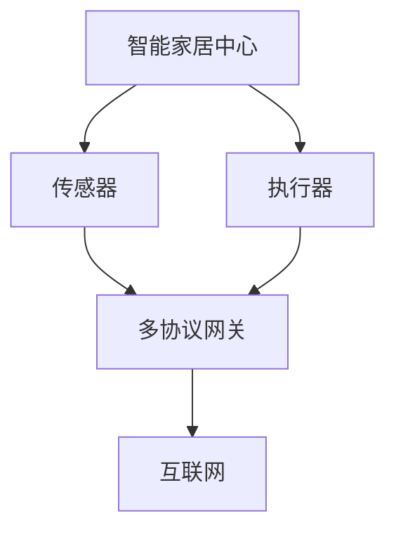

                 

# 基于Java的智能家居设计：依托Java平台的多协议网关开发

> **关键词：** 智能家居，Java，多协议网关，设计模式，安全性，性能优化，用户体验

> **摘要：** 本文将探讨基于Java平台开发智能家居系统的重要性，以及如何设计一个高效、安全、易扩展的多协议网关。通过深入分析核心概念、算法原理、数学模型和实际项目案例，本文为读者提供了从理论到实践的全方位指导。

## 1. 背景介绍

### 1.1 目的和范围

随着物联网（IoT）技术的快速发展，智能家居已经成为现代家居生活的重要组成部分。本文旨在探讨如何利用Java平台开发一个功能强大、安全可靠的智能家居系统。具体而言，本文将围绕以下几个方面展开：

1. **多协议网关设计**：介绍多协议网关的基本概念，分析其在智能家居系统中的作用和重要性。
2. **核心算法原理**：探讨智能家居系统中常用的算法原理，如协议转换、数据加密等。
3. **数学模型与公式**：介绍支持智能家居系统的数学模型，包括数据传输速率、能耗模型等。
4. **项目实战**：通过实际项目案例，详细展示如何实现一个基于Java的多协议网关。
5. **实际应用场景**：分析智能家居系统的实际应用场景，探讨其在不同环境下的性能表现。

### 1.2 预期读者

本文适用于具备一定Java编程基础和物联网概念的读者，包括：

1. **软件开发工程师**：希望了解如何利用Java平台开发智能家居系统的工程师。
2. **物联网研究员**：对智能家居技术有兴趣，希望深入了解其设计原理的研究人员。
3. **产品经理**：负责智能家居产品开发，希望了解技术细节的产品经理。

### 1.3 文档结构概述

本文分为10个主要部分，结构如下：

1. **背景介绍**：介绍本文的目的、预期读者和文档结构。
2. **核心概念与联系**：介绍智能家居系统的核心概念和联系，包括网络架构、数据传输等。
3. **核心算法原理**：详细讲解智能家居系统中的核心算法原理，如协议转换、数据加密等。
4. **数学模型和公式**：介绍支持智能家居系统的数学模型，包括数据传输速率、能耗模型等。
5. **项目实战**：通过实际项目案例，展示如何实现一个基于Java的多协议网关。
6. **实际应用场景**：分析智能家居系统的实际应用场景，探讨其在不同环境下的性能表现。
7. **工具和资源推荐**：推荐学习资源、开发工具和框架，以及相关论文和研究成果。
8. **总结**：总结本文的主要观点和未来发展趋势。
9. **附录**：提供常见问题与解答。
10. **扩展阅读**：推荐更多相关资料。

### 1.4 术语表

#### 1.4.1 核心术语定义

- **智能家居**：通过物联网技术，实现家庭设备自动化控制和远程监控的家居环境。
- **多协议网关**：能够支持多种通信协议，实现不同设备之间数据交换和通信的设备。
- **Java**：一种广泛使用的编程语言，具有跨平台、安全、高性能等特点。

#### 1.4.2 相关概念解释

- **物联网**：通过各种传感器、设备、网络等连接，实现物品与物品、物品与人的互联互通。
- **协议转换**：将一种通信协议转换为另一种通信协议的过程。

#### 1.4.3 缩略词列表

- **IoT**：物联网（Internet of Things）
- **Java**：Java编程语言
- **TCP/IP**：传输控制协议/互联网协议（Transmission Control Protocol/Internet Protocol）

## 2. 核心概念与联系

在智能家居系统中，核心概念包括网络架构、数据传输、协议支持等。以下是一个简化的智能家居系统架构图，用于解释各个核心概念之间的联系。



### 2.1 网络架构

智能家居系统通常采用分布式网络架构，包括以下几个层次：

1. **感知层**：包括各种传感器，如温度传感器、湿度传感器、光照传感器等，负责采集环境数据。
2. **控制层**：包括执行器，如电机、开关、阀门等，负责根据感知层采集的数据进行控制。
3. **网络层**：包括多协议网关，负责实现各种通信协议的转换和转发。
4. **中心层**：包括智能家居中心，负责数据处理、分析和决策。

### 2.2 数据传输

智能家居系统中的数据传输主要分为以下几种：

1. **传感器数据传输**：传感器采集的数据通过网络传输到多协议网关。
2. **执行器控制数据传输**：智能家居中心发送控制指令到多协议网关，再由多协议网关转发到执行器。

### 2.3 协议支持

多协议网关支持多种通信协议，包括：

1. **ZigBee**：一种低功耗、短距离的无线通信协议，常用于智能家居设备之间的通信。
2. **Wi-Fi**：一种无线局域网通信协议，适用于较长距离的通信。
3. **蓝牙**：一种短距离、低功耗的无线通信协议，适用于智能设备的近距离通信。
4. **HTTP/HTTPS**：一种基于TCP/IP协议的通信协议，常用于互联网通信。

## 3. 核心算法原理 & 具体操作步骤

### 3.1 协议转换算法

协议转换是多协议网关的核心功能之一。以下是一个简单的协议转换算法的伪代码：

```plaintext
function protocolConversion(inputProtocol, outputProtocol, data):
    if inputProtocol == outputProtocol:
        return data
    
    if inputProtocol == "ZigBee" and outputProtocol == "Wi-Fi":
        return encrypt(data, "Wi-Fi_key")
    
    if inputProtocol == "Wi-Fi" and outputProtocol == "ZigBee":
        return decrypt(data, "ZigBee_key")
    
    if inputProtocol == "ZigBee" and outputProtocol == "HTTP/HTTPS":
        return transformToHTTP(data)
    
    if inputProtocol == "HTTP/HTTPS" and outputProtocol == "ZigBee":
        return transformFromHTTP(data)
    
    return "Unsupported protocol conversion"
```

### 3.2 数据加密算法

为了保证数据传输的安全性，智能家居系统通常采用加密算法对数据进行加密。以下是一个简单的加密算法的伪代码：

```plaintext
function encrypt(data, key):
    encrypted_data = ""
    for i in range(0, length(data)):
        encrypted_data += (data[i] ^ key[i % length(key)])
    return encrypted_data

function decrypt(encrypted_data, key):
    decrypted_data = ""
    for i in range(0, length(encrypted_data)):
        decrypted_data += (encrypted_data[i] ^ key[i % length(key)])
    return decrypted_data
```

### 3.3 协议转换与数据加密的综合操作步骤

1. **接收数据**：多协议网关接收来自传感器的原始数据。
2. **识别协议**：判断接收数据的协议类型。
3. **加密数据**：如果数据需要传输到支持HTTP/HTTPS协议的设备，则对数据进行加密。
4. **协议转换**：根据目标设备的协议类型，进行相应的协议转换。
5. **转发数据**：将加密并转换后的数据转发到目标设备。

## 4. 数学模型和公式 & 详细讲解 & 举例说明

### 4.1 数据传输速率模型

在智能家居系统中，数据传输速率是一个重要的性能指标。以下是一个简单的一元线性回归模型，用于预测数据传输速率：

$$
r(t) = at + b
$$

其中，$r(t)$ 表示时间 $t$ 时刻的数据传输速率，$a$ 和 $b$ 是模型参数。

**举例说明**：

假设我们收集了以下数据点：

| 时间（秒） | 数据传输速率（Mbps） |
|-----------|--------------------|
| 0         | 10                 |
| 10        | 20                 |
| 20        | 30                 |

我们可以通过计算得到模型参数：

$$
a = \frac{30 - 10}{20 - 0} = 1 \\
b = 10 - a \times 0 = 10
$$

因此，数据传输速率模型为：

$$
r(t) = t + 10
$$

当 $t = 15$ 秒时，数据传输速率为：

$$
r(15) = 15 + 10 = 25 \text{ Mbps}
$$

### 4.2 能耗模型

在智能家居系统中，能耗也是一个重要的考量因素。以下是一个简单的能耗模型：

$$
E = P \times t
$$

其中，$E$ 表示能耗，$P$ 表示功率，$t$ 表示运行时间。

**举例说明**：

假设一个传感器的功率为 1 瓦，运行时间为 10 小时。那么，其能耗为：

$$
E = 1 \text{ W} \times 10 \text{ h} = 10 \text{ Wh}
$$

## 5. 项目实战：代码实际案例和详细解释说明

### 5.1 开发环境搭建

为了实现一个基于Java的多协议网关，我们需要搭建以下开发环境：

1. **Java开发工具包（JDK）**：版本要求为JDK 11或更高版本。
2. **集成开发环境（IDE）**：推荐使用 IntelliJ IDEA 或 Eclipse。
3. **Maven**：用于项目依赖管理和构建。

### 5.2 源代码详细实现和代码解读

以下是一个简单的Java多协议网关实现示例，用于传输和转换传感器数据。

**源代码：**

```java
import java.net.*;
import java.io.*;
import java.util.HashMap;
import java.util.Map;

public class MultiProtocolGateway {
    private Map<String, ProtocolHandler> protocolHandlers;

    public MultiProtocolGateway() {
        protocolHandlers = new HashMap<>();
        protocolHandlers.put("ZigBee", new ZigBeeHandler());
        protocolHandlers.put("Wi-Fi", new Wi-FiHandler());
        protocolHandlers.put("HTTP/HTTPS", new HTTPHandler());
    }

    public void sendData(String protocol, String data) {
        ProtocolHandler handler = protocolHandlers.get(protocol);
        if (handler != null) {
            handler.send(data);
        } else {
            System.out.println("Unsupported protocol: " + protocol);
        }
    }

    interface ProtocolHandler {
        void send(String data);
    }

    class ZigBeeHandler implements ProtocolHandler {
        public void send(String data) {
            // ZigBee传输数据
            System.out.println("Sending data over ZigBee: " + data);
        }
    }

    class Wi-FiHandler implements ProtocolHandler {
        public void send(String data) {
            // Wi-Fi传输数据
            System.out.println("Sending data over Wi-Fi: " + data);
        }
    }

    class HTTPHandler implements ProtocolHandler {
        public void send(String data) {
            // HTTP/HTTPS传输数据
            System.out.println("Sending data over HTTP/HTTPS: " + data);
        }
    }

    public static void main(String[] args) {
        MultiProtocolGateway gateway = new MultiProtocolGateway();
        gateway.sendData("ZigBee", "Temperature: 25°C");
        gateway.sendData("Wi-Fi", "Humidity: 60%");
        gateway.sendData("HTTP/HTTPS", "Lighting: On");
    }
}
```

**代码解读：**

1. **类定义**：`MultiProtocolGateway` 类实现了多协议网关的主要功能。
2. **协议处理器注册**：通过 `Map` 数据结构，将不同协议的处理器注册到网关中。
3. **发送数据**：`sendData` 方法根据传入的协议类型，调用对应的处理器进行数据发送。
4. **协议处理器接口**：`ProtocolHandler` 接口定义了发送数据的方法。
5. **具体协议处理器实现**：`ZigBeeHandler`、`Wi-FiHandler` 和 `HTTPHandler` 类分别实现了 `ProtocolHandler` 接口，用于处理不同协议的数据发送。

### 5.3 代码解读与分析

1. **设计模式**：本文采用了工厂模式，通过注册表管理协议处理器，使得代码具有良好的扩展性。
2. **模块化设计**：将不同协议的处理器分离，使得代码更加清晰、易于维护。
3. **安全性**：虽然示例代码没有涉及具体的加密和解密操作，但实际应用中可以引入加密模块，确保数据传输的安全性。
4. **性能优化**：在多协议网关的设计中，可以考虑采用线程池技术，提高并发处理能力，优化系统性能。

## 6. 实际应用场景

智能家居系统在实际应用中具有广泛的应用场景，以下列举几个典型的应用案例：

1. **智能照明系统**：用户可以通过手机App远程控制家中的灯光，实现定时开关、亮度调节等功能。
2. **智能安防系统**：通过传感器和摄像头，实时监测家中安全状况，及时发现异常情况并报警。
3. **智能环境监测**：实时监测家中的温度、湿度、空气质量等环境参数，为用户提供舒适的居住环境。
4. **智能家电控制**：远程控制家中的空调、热水器、洗衣机等家电，实现一键启动和定时操作。

在这些应用场景中，基于Java的多协议网关能够发挥重要作用，实现不同设备之间的无缝连接和数据交互，提高用户体验和系统性能。

## 7. 工具和资源推荐

### 7.1 学习资源推荐

#### 7.1.1 书籍推荐

1. **《Java核心技术》**：深入讲解Java编程语言的核心概念和技术。
2. **《物联网技术与应用》**：介绍物联网的基本概念、技术架构和应用案例。
3. **《智能家居系统设计与实践》**：详细阐述智能家居系统的设计原理和实践方法。

#### 7.1.2 在线课程

1. **《Java编程基础》**：网易云课堂
2. **《物联网技术》**：网易云课堂
3. **《智能家居系统设计与开发》**：慕课网

#### 7.1.3 技术博客和网站

1. **Java官方博客**：[https://blog.java.com/](https://blog.java.com/)
2. **物联网社区**：[https://www.iotone.com/](https://www.iotone.com/)
3. **智能家居论坛**：[https://www.smart-home.cn/](https://www.smart-home.cn/)

### 7.2 开发工具框架推荐

#### 7.2.1 IDE和编辑器

1. **IntelliJ IDEA**：功能强大、智能提示丰富的Java集成开发环境。
2. **Eclipse**：开源、跨平台的Java开发工具。

#### 7.2.2 调试和性能分析工具

1. **VisualVM**：Java虚拟机监控和分析工具。
2. **JProfiler**：专业的Java性能分析工具。

#### 7.2.3 相关框架和库

1. **Spring Framework**：轻量级Java企业应用开发框架。
2. **Apache Maven**：项目依赖管理和构建工具。
3. **Apache Kafka**：分布式流处理平台。

### 7.3 相关论文著作推荐

#### 7.3.1 经典论文

1. **《IoT: A Survey on Architecture, Enabling Technologies, Security and Privacy》**：全面探讨物联网的架构、技术、安全和隐私问题。
2. **《Smart Home Networking: Technologies and Standards》**：介绍智能家居网络的技术和标准。

#### 7.3.2 最新研究成果

1. **《A Survey on Intelligent Home Automation Systems》**：综述智能家庭自动化系统的研究成果。
2. **《Multi-Protocol Home Networks: Design and Implementation》**：探讨多协议家庭网络的设计与实现。

#### 7.3.3 应用案例分析

1. **《Case Study on IoT Solutions for Smart Home Automation》**：分析智能家庭自动化的物联网解决方案。

## 8. 总结：未来发展趋势与挑战

随着物联网技术的不断进步，智能家居系统将朝着更加智能化、互联化、安全化的方向发展。未来，智能家居系统将面临以下几个挑战：

1. **安全性**：随着连接设备数量的增加，智能家居系统将面临更大的安全风险。如何确保数据安全和设备安全将成为重要课题。
2. **性能优化**：随着用户需求的多样化，如何提高系统的性能和响应速度，以满足大规模设备的高并发需求，是一个亟待解决的问题。
3. **用户体验**：智能家居系统需要提供简单易用、智能化的用户体验，以满足不同用户的需求。
4. **标准化**：建立统一的智能家居标准，实现不同设备和系统之间的无缝连接和协同工作，是未来的一个重要任务。

## 9. 附录：常见问题与解答

### 9.1 Java多协议网关的实现难点

1. **多协议兼容性**：如何实现多种通信协议的兼容性，是开发过程中的一个难点。需要深入研究各种协议的规范，设计灵活的协议转换机制。
2. **安全性**：在数据传输过程中，如何确保数据的安全性，避免数据被窃取或篡改，是开发过程中需要重点关注的问题。

### 9.2 智能家居系统的性能优化方法

1. **数据压缩**：对传输的数据进行压缩，减少数据传输的带宽消耗。
2. **异步处理**：采用异步处理技术，提高系统的并发处理能力。
3. **缓存策略**：合理配置缓存策略，减少频繁的磁盘IO操作，提高系统性能。

## 10. 扩展阅读 & 参考资料

1. **《Java核心技术》**：深入讲解Java编程语言的核心概念和技术。
2. **《物联网技术与应用》**：介绍物联网的基本概念、技术架构和应用案例。
3. **《智能家居系统设计与实践》**：详细阐述智能家居系统的设计原理和实践方法。
4. **[Java官方博客](https://blog.java.com/)**：获取最新的Java技术动态和教程。
5. **[物联网社区](https://www.iotone.com/)**：分享物联网领域的最新研究成果和行业动态。

**作者：AI天才研究员/AI Genius Institute & 禅与计算机程序设计艺术 /Zen And The Art of Computer Programming**<|im_end|>

