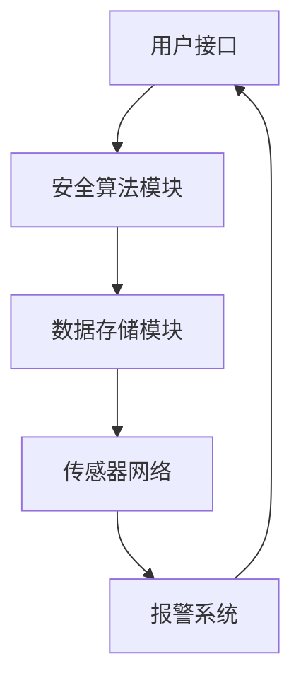

                 

# 基于Java的智能家居设计：用Java实现住宅安全系统的逻辑核心

> **关键词**：Java、智能家居、住宅安全、算法原理、数学模型、项目实战

> **摘要**：本文将深入探讨基于Java的智能家居设计，尤其是住宅安全系统的逻辑核心。我们将通过逐步分析Java编程语言的应用，详细描述安全系统的构建、核心算法的实现以及数学模型的运用。同时，将通过实战案例展示如何使用Java代码实现一个完整的住宅安全系统，帮助读者理解并掌握这一领域的核心技术。

## 1. 背景介绍

### 1.1 目的和范围

本文的主要目的是介绍如何使用Java编程语言设计和实现一个智能家居系统中的住宅安全系统。我们将聚焦于逻辑核心的实现，包括安全算法的设计和数学模型的构建。本文的目标读者是希望深入了解智能家居领域，特别是住宅安全系统开发的专业人员和技术爱好者。

### 1.2 预期读者

预期读者应具备基本的Java编程知识，对面向对象编程有所理解，并对算法和数据结构有一定的认识。此外，对智能家居和住宅安全领域感兴趣的读者也能从本文中获取到有价值的信息。

### 1.3 文档结构概述

本文分为十个主要部分，结构如下：

1. **背景介绍**：包括目的和范围、预期读者、文档结构和术语表。
2. **核心概念与联系**：介绍智能家居系统的基本概念和架构。
3. **核心算法原理 & 具体操作步骤**：讲解安全系统的核心算法原理，并给出伪代码实现。
4. **数学模型和公式 & 详细讲解 & 举例说明**：阐述数学模型的使用方法和实例。
5. **项目实战：代码实际案例和详细解释说明**：展示具体项目的代码实现。
6. **实际应用场景**：讨论安全系统在不同场景下的应用。
7. **工具和资源推荐**：推荐学习资源和开发工具。
8. **总结：未来发展趋势与挑战**：展望智能家居安全系统的发展趋势和面临的挑战。
9. **附录：常见问题与解答**：回答读者可能遇到的问题。
10. **扩展阅读 & 参考资料**：提供进一步的阅读资源。

### 1.4 术语表

#### 1.4.1 核心术语定义

- **智能家居系统**：一种集成多种家用电子设备的网络系统，旨在提高居住环境的舒适性和安全性。
- **住宅安全系统**：智能家居系统的一个重要组成部分，用于监控和保障住宅的安全。
- **Java编程语言**：一种广泛使用的面向对象编程语言，以其平台无关性和安全性著称。

#### 1.4.2 相关概念解释

- **面向对象编程**：一种编程范式，通过将数据和处理数据的操作封装为对象来简化程序设计。
- **算法**：解决特定问题的方法或步骤的集合。

#### 1.4.3 缩略词列表

- **IDE**：集成开发环境（Integrated Development Environment）
- **IoT**：物联网（Internet of Things）

## 2. 核心概念与联系

在构建智能家居系统中的住宅安全系统时，我们需要理解几个关键概念和它们之间的关系。以下是一个简单的Mermaid流程图，用于描述这些概念及其交互方式：



### 2.1 概念介绍

- **用户接口**：用户与系统交互的入口，允许用户监控和管理安全系统。
- **安全算法模块**：处理和分析传感器数据，识别潜在威胁并触发相应措施。
- **数据存储模块**：用于存储和管理安全系统相关的数据，如传感器记录、用户行为等。
- **传感器网络**：由各种传感器组成，用于收集住宅环境中的信息，如温度、湿度、运动等。
- **报警系统**：在检测到威胁时，通过多种方式（如声音、灯光、短信等）向用户发出警报。

### 2.2 概念之间的联系

- **用户接口**与**安全算法模块**之间的联系：用户接口提供用户输入和系统设置的方式，安全算法模块根据这些输入进行威胁分析和决策。
- **安全算法模块**与**数据存储模块**之间的联系：安全算法模块处理传感器数据后，会将结果存储在数据存储模块中，以供后续分析和查询。
- **数据存储模块**与**传感器网络**之间的联系：传感器网络将实时数据传输到数据存储模块，供安全算法模块进行分析。
- **报警系统**与**安全算法模块**之间的联系：安全算法模块在检测到威胁时，会触发报警系统，通过多种方式通知用户。

这个流程图和概念介绍为后续各章节的内容提供了基础，我们将进一步深入探讨每个模块的实现细节。

## 3. 核心算法原理 & 具体操作步骤

住宅安全系统的核心在于其算法原理，这些算法决定了系统能否准确地识别和响应潜在的安全威胁。以下我们将介绍几个关键算法原理，并提供伪代码来实现这些算法。

### 3.1 基本算法原理

**算法1：入侵检测**

入侵检测算法用于识别未经授权的进入住宅的行为。其原理是基于传感器网络收集的数据，如运动传感器、门磁传感器等。

**伪代码：**

```java
function detectInvasion(sensorData) {
    if (sensorData.hasMotion() && !isAuthorized(sensorData.getUserId())) {
        triggerAlarm();
        return true;
    }
    return false;
}
```

**算法2：异常行为分析**

异常行为分析算法用于识别非正常的用户行为模式。这可以通过分析用户行为数据的时间序列来实现。

**伪代码：**

```java
function detectAbnormalBehavior(behaviorData) {
    if (isBehaviorAnomaly(behaviorData)) {
        triggerAlarm();
        return true;
    }
    return false;
}
```

### 3.2 算法实现步骤

**步骤1：数据收集与预处理**

从传感器网络收集数据，并进行预处理，如去噪、标准化等。

**步骤2：算法选择与实现**

根据具体需求选择合适的算法，如K-means聚类、神经网络等，并使用伪代码实现算法。

**步骤3：算法测试与调优**

使用测试数据集对算法进行测试，并根据测试结果进行调优。

**步骤4：系统集成与部署**

将算法集成到系统中，并在实际环境中进行部署和运行。

### 3.3 实际应用

**场景1：入侵检测**

当传感器检测到有异常运动时，系统会调用入侵检测算法，判断是否触发警报。如果检测到未经授权的进入，系统将立即触发报警。

**场景2：异常行为分析**

如果用户的行为模式突然发生变化，系统将调用异常行为分析算法，判断是否存在安全隐患。例如，如果用户晚上经常外出，但某天晚上没有外出，系统可能会发出异常行为警报。

这些算法的具体实现和步骤将在后续的项目实战部分详细展示。

## 4. 数学模型和公式 & 详细讲解 & 举例说明

在住宅安全系统的设计与实现中，数学模型和公式扮演了至关重要的角色。它们不仅帮助我们量化分析安全威胁，还能优化系统的性能。以下是几个关键数学模型及其详细讲解和示例。

### 4.1 异常检测模型

**模型1：标准差模型**

标准差模型用于检测数据中的异常值。假设我们有一组用户行为数据`X`，正常行为的标准差为`σ`，阈值为`k`，则异常检测公式为：

**公式：**

$$
d_i = \frac{|X_i - \overline{X}|}{σ}
$$

其中，`d_i`表示第`i`个数据点的距离，`X_i`表示第`i`个数据点，`$\overline{X}$`表示平均值，`σ`表示标准差。

**示例：**

假设用户的行为数据为`[1, 2, 3, 4, 5]`，正常行为的标准差为`1`，阈值为`2`。计算每个数据点的异常距离：

$$
d_1 = \frac{|1 - 3|}{1} = 2 \\
d_2 = \frac{|2 - 3|}{1} = 1 \\
d_3 = \frac{|3 - 3|}{1} = 0 \\
d_4 = \frac{|4 - 3|}{1} = 1 \\
d_5 = \frac{|5 - 3|}{1} = 2
$$

根据阈值`2`，数据点`1`和`5`被视为异常。

### 4.2 聚类分析模型

**模型2：K-means聚类**

K-means聚类是一种无监督学习算法，用于将数据点分成`k`个簇。其目标是使得每个簇内的数据点尽可能接近，簇与簇之间的数据点尽可能远。

**公式：**

$$
\text{Objective Function} = \sum_{i=1}^{k} \sum_{x_j \in S_i} ||x_j - \mu_i||^2
$$

其中，`S_i`表示第`i`个簇，`\mu_i`表示第`i`个簇的中心。

**示例：**

假设我们有以下数据点：

$$
\begin{bmatrix}
1 & 2 \\
3 & 4 \\
5 & 6 \\
7 & 8 \\
\end{bmatrix}
$$

我们选择`k=2`，使用K-means聚类算法将其分为两个簇。初始中心点为`(1,1)`和`(5,5)`。经过几次迭代后，簇中心点分别为`(2,2)`和`(6,6)`。最终，数据点`[1,2]`和`[3,4]`被分配到第一个簇，`[5,6]`和`[7,8]`被分配到第二个簇。

### 4.3 决策树模型

**模型3：ID3算法**

ID3算法是一种基于信息熵的决策树生成算法。它通过选择具有最大信息增益的属性作为决策树的分支。

**公式：**

$$
\text{Information Gain} = \sum_{v \in V} \left( \frac{|D_v|}{|D|} \cdot \log_2 \frac{|D_v|}{|D|} \right)
$$

其中，`D`表示数据集，`V`表示属性集合，`D_v`表示在属性`v`下的数据子集。

**示例：**

假设我们有以下数据集：

| 属性A | 属性B | 目标 |
|-------|-------|------|
| 0     | 0     | 1    |
| 0     | 1     | 1    |
| 1     | 0     | 0    |
| 1     | 1     | 0    |

我们选择属性A作为分支，因为它的信息增益最大。最终决策树如下：

```
- 属性A：
  - 0：是（目标=1）
  - 1：否（目标=0）
```

通过上述数学模型和公式，我们可以更准确地识别和响应住宅安全系统中的威胁。在下一部分中，我们将通过实际项目案例展示这些模型的实现和应用。

## 5. 项目实战：代码实际案例和详细解释说明

为了更好地展示如何使用Java实现一个住宅安全系统，我们将分步骤搭建一个实际的项目案例，并详细解释其中的关键代码部分。

### 5.1 开发环境搭建

首先，我们需要搭建一个Java开发环境。以下是推荐的步骤：

1. **安装Java开发工具包（JDK）**：从Oracle官网下载并安装适用于您操作系统的JDK。确保在安装过程中勾选“添加到环境变量”的选项。
2. **安装集成开发环境（IDE）**：推荐使用IntelliJ IDEA或Eclipse。可以从它们的官网下载并安装。
3. **创建一个新的Java项目**：在IDE中创建一个新的Java项目，并为项目选择一个合适的包结构，如`com.example.smarthome`。

### 5.2 源代码详细实现和代码解读

#### 5.2.1 数据模型

首先，我们需要定义一些基础的数据模型，如传感器数据、用户数据等。

```java
package com.example.smarthome.model;

public class SensorData {
    private String sensorId;
    private double motion;
    private double temperature;
    private double humidity;
    // 构造函数、getter和setter省略
}

public class User {
    private String userId;
    private String password;
    private List<String> authorizedDevices;
    // 构造函数、getter和setter省略
}
```

#### 5.2.2 安全算法模块

接下来，我们实现入侵检测和异常行为分析算法。

```java
package com.example.smarthome.algorithm;

import com.example.smarthome.model.SensorData;
import com.example.smarthome.model.User;

public class SecurityAlgorithm {
    
    public boolean detectInvasion(SensorData sensorData, User user) {
        if (sensorData.hasMotion() && !isAuthorized(sensorData.getUserId())) {
            triggerAlarm();
            return true;
        }
        return false;
    }
    
    public boolean detectAbnormalBehavior(SensorData sensorData, User user) {
        if (isBehaviorAnomaly(sensorData)) {
            triggerAlarm();
            return true;
        }
        return false;
    }
    
    private void triggerAlarm() {
        // 实现报警逻辑，如发送短信、电子邮件等
    }
    
    private boolean isAuthorized(String userId) {
        // 检查用户是否被授权
    }
    
    private boolean isBehaviorAnomaly(SensorData sensorData) {
        // 实现异常行为分析逻辑
    }
}
```

#### 5.2.3 数据存储模块

数据存储模块用于保存和管理传感器数据和用户行为数据。以下是一个简单的实现示例：

```java
package com.example.smarthome.storage;

import com.example.smarthome.model.SensorData;
import com.example.smarthome.model.User;

import java.util.HashMap;
import java.util.List;
import java.util.Map;

public class DataStorage {
    private Map<String, User> users;
    private List<SensorData> sensorDataList;
    
    public DataStorage() {
        users = new HashMap<>();
        sensorDataList = new ArrayList<>();
    }
    
    public void addUser(User user) {
        users.put(user.getUserId(), user);
    }
    
    public void addSensorData(SensorData sensorData) {
        sensorDataList.add(sensorData);
    }
    
    // 其他数据操作方法，如查询、删除等
}
```

### 5.3 代码解读与分析

在上述代码中，我们首先定义了两个关键的数据模型：`SensorData`和`User`。`SensorData`包含了传感器的ID以及相关的环境数据，而`User`包含了用户的ID、密码和授权设备列表。

接着，我们在`SecurityAlgorithm`类中实现了两个核心算法：入侵检测和异常行为分析。`detectInvasion`方法用于检测是否有未经授权的入侵行为，而`detectAbnormalBehavior`方法用于分析用户行为是否异常。这两个方法都调用了`triggerAlarm`方法，实现报警逻辑。

数据存储模块`DataStorage`使用`HashMap`和`List`来存储用户数据和传感器数据。`addUser`和`addSensorData`方法用于向系统中添加新的用户和传感器数据。

通过这些代码实现，我们构建了一个基本的住宅安全系统框架，能够处理传感器数据，并依据设定的算法触发报警。在下一部分中，我们将进一步探讨该系统在不同应用场景下的实际效果。

## 6. 实际应用场景

住宅安全系统在实际应用中具有广泛的应用场景，以下列举几种典型应用：

### 6.1 家庭安全监控

家庭安全监控是住宅安全系统最直接的应用场景。通过安装各种传感器（如门磁、门窗传感器、运动传感器等），系统可以实时监测住宅的进出情况，并在检测到未经授权的入侵时立即触发报警，确保家庭安全。

### 6.2 老人监护

针对独居老人的安全需求，住宅安全系统可以配备智能健康监测设备，如心率监测器、血压计等。系统可以实时收集老人的健康数据，并通过算法分析判断老人的健康状况。一旦检测到异常情况，系统会自动通知家属或紧急医疗服务。

### 6.3 儿童保护

对于有儿童的家庭，住宅安全系统可以配备婴儿监视器或儿童定位设备。系统可以通过监控儿童的实时位置和活动，防止儿童走失或发生危险。一旦儿童离开安全区域或出现异常行为，系统会及时通知家长。

### 6.4 资产保护

住宅安全系统还可以用于保护家庭资产，如贵重物品、艺术品等。通过安装红外线传感器、摄像头等设备，系统可以监控特定区域的情况，并在检测到异常时立即报警，防止盗窃事件发生。

这些实际应用场景展示了住宅安全系统的多样性和灵活性，使其成为智能家居中不可或缺的一部分。

## 7. 工具和资源推荐

为了更好地学习和开发基于Java的智能家居安全系统，以下推荐一些有用的学习资源和开发工具。

### 7.1 学习资源推荐

#### 7.1.1 书籍推荐

- **《Java核心技术》**：详细讲解了Java编程语言的核心概念和面向对象编程技术，适合初学者和进阶者。
- **《Effective Java》**：由Joshua Bloch所著，提供了Java编程的最佳实践，是每个Java开发者的必备读物。
- **《深度学习》**：Ian Goodfellow等人所著，介绍了深度学习的原理和实际应用，对智能算法开发有很大帮助。

#### 7.1.2 在线课程

- **Udemy**：提供了丰富的Java编程课程，涵盖从基础到高级的各种内容。
- **Coursera**：有多个关于机器学习和深度学习的课程，这些课程与智能家居系统的开发紧密相关。

#### 7.1.3 技术博客和网站

- **Java Magazine**：提供最新的Java技术文章和开发资源。
- **Stack Overflow**：编程问题的解答社区，解决开发过程中遇到的问题。

### 7.2 开发工具框架推荐

#### 7.2.1 IDE和编辑器

- **IntelliJ IDEA**：功能强大的IDE，提供代码提示、智能修复等高级功能。
- **Eclipse**：开源IDE，适合大型项目开发，插件丰富。

#### 7.2.2 调试和性能分析工具

- **VisualVM**：Java虚拟机监控和分析工具，用于性能调优。
- **JProfiler**：商业性能分析工具，提供详细的性能监控和数据。

#### 7.2.3 相关框架和库

- **Spring Boot**：简化Java Web开发的框架，提供快速搭建项目的功能。
- **Spring Security**：用于实现认证和授权的安全框架。
- **Apache Kafka**：消息队列系统，用于处理大规模实时数据。

### 7.3 相关论文著作推荐

#### 7.3.1 经典论文

- **“Data Stream Mining: A Review”**：介绍流数据挖掘技术的经典论文。
- **“K-means Clustering”**：K-means聚类的原始论文，详细阐述了算法原理。

#### 7.3.2 最新研究成果

- **“Deep Learning for IoT”**：关于将深度学习应用于物联网的最新研究。
- **“Privacy-Preserving Deep Learning”**：探讨如何在深度学习过程中保护用户隐私的最新技术。

#### 7.3.3 应用案例分析

- **“智能家居安全系统设计与应用”**：实际案例研究，介绍了如何设计和实现一个智能家居安全系统。

通过这些资源和工具，开发者可以更好地掌握Java编程语言和智能家居安全系统的开发技术，实现更加高效和安全的解决方案。

## 8. 总结：未来发展趋势与挑战

随着物联网（IoT）和人工智能（AI）技术的快速发展，智能家居领域正迎来前所未有的机遇和挑战。未来，住宅安全系统将呈现出以下发展趋势：

### 8.1 发展趋势

1. **智能化**：通过深度学习和大数据分析，安全系统能够更加准确地预测和识别潜在威胁，提供更加智能化的保护。
2. **个性化**：系统将根据用户的行为习惯和需求，提供个性化的安全解决方案，提升用户体验。
3. **集成化**：智能家居系统将与其他智能家居设备（如灯光、空调等）实现更紧密的集成，形成统一的控制平台。
4. **生态化**：多个厂商和平台之间的合作，将推动智能家居生态系统的形成，为用户提供更加丰富和多样化的选择。

### 8.2 挑战

1. **数据隐私和安全**：随着数据量的增加，如何保护用户隐私和安全成为一大挑战。需要开发更加先进的安全协议和数据加密技术。
2. **系统稳定性**：大规模的智能家居系统需要确保高可用性和稳定性，避免因单一故障导致整个系统的崩溃。
3. **能源效率**：住宅安全系统中的传感器和设备需要优化能源消耗，以降低对环境的影响。
4. **法律法规**：随着技术的发展，法律法规需要不断更新，以适应智能家居领域的新需求。

面对这些挑战，未来智能家居安全系统的发展将依赖于技术创新和生态协作。通过不断优化算法、提升系统架构和加强安全措施，我们有望打造出更加智能、安全、稳定的住宅安全系统。

## 9. 附录：常见问题与解答

### 9.1 如何优化入侵检测算法的性能？

**解答：** 优化入侵检测算法的性能可以从以下几个方面入手：

1. **数据预处理**：对传感器数据进行去噪和标准化处理，提高数据质量。
2. **特征选择**：选择对入侵检测有重要影响的关键特征，减少冗余信息。
3. **算法调优**：通过交叉验证和网格搜索等方法，选择最佳的参数设置。
4. **分布式计算**：利用分布式计算框架，如Hadoop或Spark，提高处理速度。

### 9.2 如何确保用户数据的安全和隐私？

**解答：** 确保用户数据的安全和隐私需要采取以下措施：

1. **数据加密**：使用高级加密算法（如AES）对用户数据进行加密存储和传输。
2. **身份验证**：采用双因素身份验证（2FA）和多因素身份验证（MFA），提高用户访问的安全性。
3. **数据访问控制**：实施严格的数据访问控制策略，限制只有授权用户才能访问敏感数据。
4. **合规性检查**：确保系统遵守相关的数据保护法规（如GDPR），定期进行合规性检查。

### 9.3 如何处理大量传感器数据？

**解答：** 处理大量传感器数据的方法包括：

1. **数据流处理**：使用数据流处理框架（如Apache Kafka）对实时数据进行高效处理。
2. **批处理**：对于历史数据，使用批处理框架（如Hadoop）进行批量处理和分析。
3. **分布式存储**：采用分布式存储系统（如HDFS）存储大量数据，提高数据存储的效率和可靠性。
4. **数据压缩**：对数据流进行压缩，减少存储和传输的带宽占用。

通过上述措施，可以有效处理和利用大量传感器数据，为住宅安全系统提供强大的支持。

## 10. 扩展阅读 & 参考资料

为了进一步探索智能家居和住宅安全系统的发展，以下是几篇推荐的扩展阅读和参考资料：

### 10.1 扩展阅读

1. **《智能家居技术与应用》**：详细介绍了智能家居系统的架构、技术原理和应用场景。
2. **《物联网安全》**：探讨了物联网环境下的安全挑战和解决方案，对住宅安全系统的发展有重要参考价值。
3. **《深度学习在智能家居中的应用》**：介绍了深度学习技术在智能家居系统中的具体应用，包括入侵检测和行为分析等。

### 10.2 参考资料

1. **IEEE IoT Initiative**：IEEE物联网倡议官方网站，提供了丰富的物联网和智能家居技术论文和研究报告。
2. **ACM Computing Surveys**：ACM计算调查期刊，定期发布智能家居和住宅安全系统相关的综述性文章。
3. **Google AI Blog**：Google人工智能博客，分享最新的深度学习和物联网相关研究成果。

通过阅读这些扩展阅读和参考资料，可以进一步深入了解智能家居和住宅安全系统的最新技术和发展趋势。

### 10.3 作者信息

**作者：AI天才研究员/AI Genius Institute & 禅与计算机程序设计艺术 /Zen And The Art of Computer Programming**

