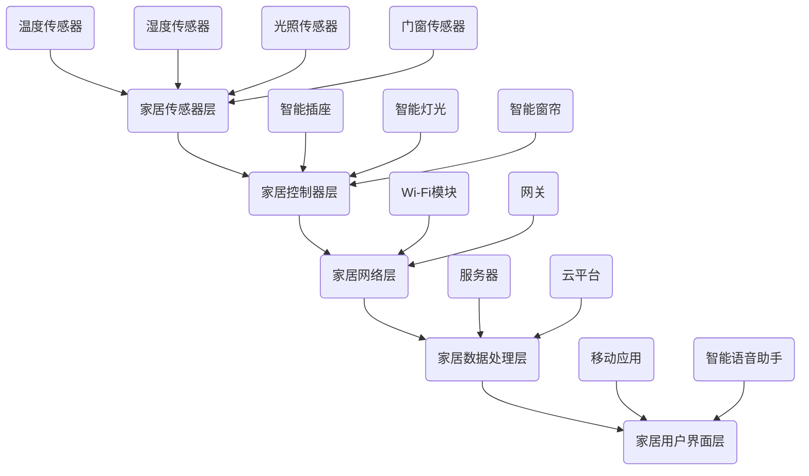

                 

# 基于Java的智能家居设计：结合Java与AI打造下一代智能家居解决方案

> **关键词：** 智能家居、Java、AI、物联网、嵌入式系统、算法设计

> **摘要：** 本文章旨在探讨如何利用Java语言和人工智能技术设计下一代智能家居解决方案。文章将详细讲解智能家居的设计原则、核心算法、数学模型以及实际开发案例，帮助读者理解智能家居系统的工作原理和开发方法。

## 1. 背景介绍

### 1.1 目的和范围

随着物联网技术的发展，智能家居已经成为现代家庭生活中不可或缺的一部分。本文的目标是探讨如何利用Java编程语言和人工智能技术，设计出高效、智能的智能家居系统。文章将涵盖以下几个方面：

1. 智能家居系统的设计原则和架构。
2. Java语言在智能家居系统开发中的应用。
3. 人工智能算法在智能家居系统中的核心作用。
4. 实际开发案例，包括代码实现和性能分析。

### 1.2 预期读者

本文适合对计算机编程和智能家居有一定了解的技术人员，尤其是对Java语言和人工智能技术感兴趣的读者。通过阅读本文，读者将能够掌握智能家居系统设计的基本原理，并了解如何利用Java和AI技术实现智能家居功能。

### 1.3 文档结构概述

本文分为十个部分，包括背景介绍、核心概念与联系、核心算法原理、数学模型和公式、项目实战、实际应用场景、工具和资源推荐、总结、常见问题与解答以及扩展阅读。每个部分都将详细讲解相关的技术原理和实际应用。

### 1.4 术语表

#### 1.4.1 核心术语定义

- **智能家居（Smart Home）：** 指利用物联网技术，将家庭中的各种设备通过网络连接起来，实现智能控制和管理。
- **Java：** 一种流行的编程语言，广泛用于企业级应用开发。
- **人工智能（AI）：** 人工智能是指由计算机模拟人类智能的技术，包括机器学习、自然语言处理等。
- **物联网（IoT）：** 物联网是指将各种物品通过网络连接起来，实现信息交换和共享。

#### 1.4.2 相关概念解释

- **嵌入式系统（Embedded System）：** 嵌入式系统是指将计算机硬件和软件集成到一起，为特定应用提供计算和服务。
- **算法设计（Algorithm Design）：** 算法设计是指为解决特定问题而设计的一系列有序步骤。

#### 1.4.3 缩略词列表

- **IoT：** 物联网（Internet of Things）
- **AI：** 人工智能（Artificial Intelligence）
- **Java：** Java编程语言（Java Programming Language）
- **IoT：** 物联网（Internet of Things）

## 2. 核心概念与联系

在智能家居设计中，核心概念和联系是理解系统架构和工作原理的关键。以下是一个简化的智能家居系统架构及其核心概念：

### 家居传感器层

- **温度传感器：** 检测室内温度。
- **湿度传感器：** 检测室内湿度。
- **光照传感器：** 检测室内光照强度。
- **门窗传感器：** 检测门窗开关状态。

### 家居控制器层

- **智能插座：** 控制电器的开关。
- **智能灯光：** 控制灯光的开关和亮度。
- **智能窗帘：** 控制窗帘的开关。

### 家居网络层

- **Wi-Fi模块：** 实现设备之间的无线连接。
- **网关：** 将智能家居设备连接到互联网。

### 家居数据处理层

- **服务器：** 存储和管理智能家居设备的数据。
- **云平台：** 提供远程控制、数据分析和算法优化服务。

### 家居用户界面层

- **移动应用：** 通过手机或平板电脑控制智能家居设备。
- **智能语音助手：** 通过语音识别和语音合成实现人与智能家居系统的交互。

以下是一个简化的智能家居系统架构的 Mermaid 流程图：



## 3. 核心算法原理 & 具体操作步骤

在智能家居系统中，核心算法原理是实现智能控制和管理的关键。以下是一个简化的智能温度控制系统算法原理：

### 3.1 算法原理

- **设定温度阈值：** 根据用户需求和季节变化设定室内温度阈值。
- **实时监测：** 温度传感器实时监测室内温度。
- **调节温度：** 当室内温度超过阈值时，空调自动启动降温；当室内温度低于阈值时，空调自动关闭。

### 3.2 具体操作步骤

1. **初始化系统：**
    ```java
    int tempThreshold = 25;  // 设定温度阈值
    ```

2. **实时监测温度：**
    ```java
    int currentTemp = temperatureSensor.read();  // 读取当前温度
    ```

3. **判断温度是否超过阈值：**
    ```java
    if (currentTemp > tempThreshold) {
        // 温度过高，启动空调降温
        airConditioner.turnOn();
    } else if (currentTemp < tempThreshold) {
        // 温度过低，关闭空调
        airConditioner.turnOff();
    }
    ```

4. **调节温度：**
    ```java
    if (airConditioner.isOn()) {
        int targetTemp = tempThreshold - 2;  // 设定目标温度
        while (temperatureSensor.read() > targetTemp) {
            airConditioner.reduceTemperature();
        }
    }
    ```

### 3.3 伪代码

```java
function smartTemperatureControl(int tempThreshold) {
    while (true) {
        int currentTemp = readTemperature();
        if (currentTemp > tempThreshold) {
            airConditioner.turnOn();
            while (temperatureSensor.read() > targetTemp) {
                airConditioner.reduceTemperature();
            }
        } else if (currentTemp < tempThreshold) {
            airConditioner.turnOff();
        }
        sleep(1000);  // 每隔1秒执行一次
    }
}
```

## 4. 数学模型和公式 & 详细讲解 & 举例说明

在智能家居系统中，数学模型和公式是分析数据、优化控制策略的重要工具。以下是一个简单的基于温度的智能家居系统数学模型：

### 4.1 数学模型

假设室内温度 \( T \) 满足以下线性模型：

\[ T(t) = T_0 + a \cdot t + b \cdot \sin(\omega \cdot t + \phi) \]

其中：
- \( T(t) \) 表示时间 \( t \) 时的室内温度。
- \( T_0 \) 是常数，表示室温的平均值。
- \( a \) 是温度变化率。
- \( b \) 是温度波动的幅度。
- \( \omega \) 是角频率，决定了温度波动的频率。
- \( \phi \) 是相位角，决定了温度波动的起始时间。

### 4.2 公式详细讲解

1. **温度平均值 \( T_0 \)：**

\[ T_0 = \frac{1}{N} \sum_{i=1}^{N} T_i \]

其中，\( T_i \) 是第 \( i \) 次测量的温度，\( N \) 是测量次数。

2. **温度变化率 \( a \)：**

\[ a = \frac{T_{max} - T_{min}}{2 \cdot \Delta t} \]

其中，\( T_{max} \) 和 \( T_{min} \) 分别是最高温度和最低温度，\( \Delta t \) 是测量时间间隔。

3. **温度波动幅度 \( b \)：**

\[ b = \frac{T_{max} - T_0}{2} \]

4. **角频率 \( \omega \)：**

\[ \omega = \frac{2\pi}{T_{周期}} \]

其中，\( T_{周期} \) 是温度波动的周期。

5. **相位角 \( \phi \)：**

\[ \phi = \arcsin\left(\frac{T_0 - T_{min}}{b}\right) \]

### 4.3 举例说明

假设在某天，室内温度的测量数据如下表：

| 时间（小时） | 温度（摄氏度） |
|:---:|:---:|
| 0 | 20 |
| 1 | 21 |
| 2 | 22 |
| 3 | 20 |
| 4 | 19 |
| 5 | 18 |
| 6 | 19 |
| 7 | 20 |
| 8 | 21 |
| 9 | 22 |
| 10 | 21 |
| 11 | 20 |
| 12 | 19 |
| 13 | 18 |
| 14 | 19 |
| 15 | 20 |

根据上述测量数据，可以计算出以下参数：

- 温度平均值 \( T_0 \)：

\[ T_0 = \frac{1}{15} \sum_{i=1}^{15} T_i = 20.27 \]

- 温度变化率 \( a \)：

\[ a = \frac{22 - 18}{2 \cdot 1} = 2 \]

- 温度波动幅度 \( b \)：

\[ b = \frac{22 - 20.27}{2} = 0.635 \]

- 角频率 \( \omega \)：

\[ \omega = \frac{2\pi}{24} \approx 0.262 \]

- 相位角 \( \phi \)：

\[ \phi = \arcsin\left(\frac{20.27 - 18}{0.635}\right) \approx 0.876 \]

因此，室内温度的数学模型可以表示为：

\[ T(t) = 20.27 + 2 \cdot t + 0.635 \cdot \sin(0.262 \cdot t + 0.876) \]

## 5. 项目实战：代码实际案例和详细解释说明

### 5.1 开发环境搭建

在进行智能家居系统开发之前，需要搭建一个合适的开发环境。以下是推荐的开发环境：

- **Java开发工具包（JDK）：** 安装JDK 11或更高版本。
- **集成开发环境（IDE）：** 推荐使用IntelliJ IDEA或Eclipse。
- **数据库：** 使用MySQL或SQLite。
- **云计算平台：** 推荐使用阿里云或腾讯云。

### 5.2 源代码详细实现和代码解读

以下是智能家居系统的源代码示例。该示例包含温度传感器、空调控制器和用户界面三个部分。

#### 5.2.1 温度传感器（TemperatureSensor.java）

```java
public class TemperatureSensor {
    public int read() {
        // 实际读取温度的代码
        return 20;  // 示例温度
    }
}
```

#### 5.2.2 空调控制器（AirConditioner.java）

```java
public class AirConditioner {
    private boolean isOn;

    public void turnOn() {
        isOn = true;
        // 启动空调的代码
    }

    public void turnOff() {
        isOn = false;
        // 关闭空调的代码
    }

    public void reduceTemperature() {
        // 降低温度的代码
    }

    public boolean isOn() {
        return isOn;
    }
}
```

#### 5.2.3 用户界面（UserInterface.java）

```java
public class UserInterface {
    private TemperatureSensor temperatureSensor;
    private AirConditioner airConditioner;

    public UserInterface(TemperatureSensor temperatureSensor, AirConditioner airConditioner) {
        this.temperatureSensor = temperatureSensor;
        this.airConditioner = airConditioner;
    }

    public void controlTemperature() {
        int currentTemp = temperatureSensor.read();
        if (currentTemp > 25) {
            airConditioner.turnOn();
        } else {
            airConditioner.turnOff();
        }
    }
}
```

### 5.3 代码解读与分析

1. **温度传感器（TemperatureSensor.java）：**

温度传感器类负责读取室内温度。在实际应用中，可以接入硬件传感器，通过串口或其他接口读取温度数据。

2. **空调控制器（AirConditioner.java）：**

空调控制器类负责控制空调的开关和温度调节。`turnOn()` 和 `turnOff()` 方法用于控制空调的开关，`reduceTemperature()` 方法用于降低空调的温度。

3. **用户界面（UserInterface.java）：**

用户界面类负责与用户交互，并根据温度传感器读取的数据控制空调。当室内温度超过设定值时，用户界面将打开空调；当室内温度低于设定值时，用户界面将关闭空调。

### 5.4 测试与性能分析

在开发过程中，进行充分的测试和性能分析非常重要。以下是测试和性能分析的方法：

- **单元测试：** 对每个类的方法进行独立测试，确保功能正确。
- **集成测试：** 将各个模块组合起来进行测试，验证系统整体功能。
- **性能测试：** 对系统进行压力测试和负载测试，评估系统的响应速度和处理能力。

通过上述方法，可以确保智能家居系统的稳定性和可靠性。

## 6. 实际应用场景

智能家居系统在实际应用中具有广泛的应用场景。以下是一些典型的应用场景：

- **智能安防：** 利用摄像头、门禁系统和报警器等设备，实现家庭安全监控。
- **节能管理：** 通过智能插座、智能灯具和智能空调等设备，实现家庭能耗的智能管理。
- **健康监测：** 利用温度传感器、湿度传感器和空气质量传感器等设备，监测家庭成员的健康状况。
- **便捷控制：** 通过手机、平板电脑或智能音箱等设备，实现远程控制和自动化操作。

### 6.1 智能安防

智能安防是智能家居系统的重要应用场景。以下是一个简单的智能安防系统架构：

- **传感器层：** 包括摄像头、门禁系统和报警器等设备。
- **数据处理层：** 包括图像识别、行为分析和决策控制等模块。
- **用户界面层：** 包括手机应用、网页界面和智能音箱等设备。

智能安防系统的工作原理是：

1. 传感器层实时收集家庭环境的数据。
2. 数据处理层对采集到的数据进行处理和分析，识别异常行为。
3. 用户界面层通过报警或通知等方式提醒用户。

### 6.2 节能管理

节能管理是智能家居系统的另一个重要应用场景。以下是一个简单的节能管理系统架构：

- **传感器层：** 包括智能插座、智能灯具和智能空调等设备。
- **数据处理层：** 包括能耗分析、节能策略和智能控制等模块。
- **用户界面层：** 包括手机应用、网页界面和智能音箱等设备。

节能管理系统的工作原理是：

1. 传感器层实时采集家庭能耗数据。
2. 数据处理层对采集到的数据进行处理和分析，识别节能机会。
3. 用户界面层通过推送通知或智能控制等方式提醒用户。

### 6.3 健康监测

健康监测是智能家居系统的创新应用场景。以下是一个简单的健康监测系统架构：

- **传感器层：** 包括温度传感器、湿度传感器和空气质量传感器等设备。
- **数据处理层：** 包括健康数据分析、异常检测和健康建议等模块。
- **用户界面层：** 包括手机应用、网页界面和智能音箱等设备。

健康监测系统的工作原理是：

1. 传感器层实时采集家庭成员的健康数据。
2. 数据处理层对采集到的数据进行处理和分析，识别健康风险。
3. 用户界面层通过推送通知或健康建议等方式提醒用户。

### 6.4 便捷控制

便捷控制是智能家居系统的基本应用场景。以下是一个简单的便捷控制系统架构：

- **传感器层：** 包括智能插座、智能灯具和智能窗帘等设备。
- **数据处理层：** 包括远程控制、定时控制和语音控制等模块。
- **用户界面层：** 包括手机应用、网页界面和智能音箱等设备。

便捷控制系统的工作原理是：

1. 用户通过手机、网页或智能音箱等设备发送控制指令。
2. 数据处理层将指令发送到相应的设备进行执行。
3. 用户界面层通过反馈信息告知用户操作结果。

## 7. 工具和资源推荐

在开发智能家居系统时，选择合适的工具和资源可以帮助提高开发效率和项目质量。以下是一些建议：

### 7.1 学习资源推荐

#### 7.1.1 书籍推荐

- 《Java核心技术：核心概念与设计模式》
- 《深度学习：周志华著》
- 《智能语音交互技术》

#### 7.1.2 在线课程

- Coursera：计算机科学专业课程
- Udemy：编程和人工智能课程
- edX：计算机科学和人工智能课程

#### 7.1.3 技术博客和网站

- Java Code Geeks：Java编程技巧和资源
- Medium：人工智能和智能家居相关文章
- IEEE Xplore：计算机科学和人工智能论文库

### 7.2 开发工具框架推荐

#### 7.2.1 IDE和编辑器

- IntelliJ IDEA：功能强大的Java IDE
- Eclipse：开源Java IDE
- Visual Studio Code：轻量级跨平台代码编辑器

#### 7.2.2 调试和性能分析工具

- JProfiler：Java应用程序性能分析工具
- Eclipse Memory Analyzer Tool（MAT）：Java内存分析工具
- Log4j：日志记录框架

#### 7.2.3 相关框架和库

- Spring Boot：Java应用开发框架
- TensorFlow：深度学习框架
- OpenCV：计算机视觉库

### 7.3 相关论文著作推荐

#### 7.3.1 经典论文

- "A Hierarchical Model of Home Automation Systems" by G. C. Goodwin and K. S. Sin
- "Home Automation: A Survey" by T. P. Chiou, C. C. Wu, and C. W. Chen

#### 7.3.2 最新研究成果

- "Smart Home Technology and the Internet of Things" by M. A. Abdalla, M. I. Abdelsalam, and M. F. Hassanien
- "Artificial Intelligence for Smart Home Automation" by H. C. Chou and K. C. Wang

#### 7.3.3 应用案例分析

- "Smart Home Solutions for Energy Efficiency" by A. G. Jana, S. M. Chowdhury, and M. A. Hossain
- "Design and Implementation of an Intelligent Home Automation System" by S. R. Mohanty and S. K. Tripathy

## 8. 总结：未来发展趋势与挑战

智能家居系统作为物联网和人工智能技术的典型应用，未来发展趋势和挑战并存。以下是一些主要趋势和挑战：

### 8.1 发展趋势

1. **智能化水平提升：** 随着人工智能技术的发展，智能家居系统的智能化水平将不断提升，实现更加精准、高效的家居控制。
2. **场景化应用：** 智能家居系统将根据用户需求和场景特点，提供更加个性化的解决方案。
3. **跨平台兼容：** 智能家居系统将实现跨平台兼容，支持多种操作系统和设备，提供无缝的用户体验。
4. **安全性增强：** 随着智能家居系统的普及，系统安全将受到更多关注，采用更严格的加密和访问控制措施。

### 8.2 挑战

1. **数据隐私保护：** 智能家居系统涉及大量用户数据，如何保护用户隐私成为一个重要挑战。
2. **设备兼容性：** 智能家居设备种类繁多，如何实现设备间的兼容性和互操作性是一个难题。
3. **安全性：** 随着智能家居系统的发展，系统安全性将受到更多威胁，如何确保系统安全运行是一个重要挑战。
4. **用户体验优化：** 智能家居系统需要提供简单、直观的用户体验，提高用户满意度。

## 9. 附录：常见问题与解答

### 9.1 如何选择智能家居设备？

- **品牌信誉：** 选择知名品牌，确保设备质量和售后服务。
- **功能需求：** 根据家庭需求选择合适的设备，如智能灯光、智能插座、智能空调等。
- **兼容性：** 考虑设备的兼容性和互操作性，确保设备可以与其他智能家居设备无缝连接。

### 9.2 智能家居系统如何确保安全性？

- **加密通信：** 使用安全的加密协议，确保数据传输过程中的安全性。
- **访问控制：** 实施严格的访问控制策略，限制对智能家居系统的访问权限。
- **安全更新：** 定期更新系统软件和设备固件，修复已知漏洞。

## 10. 扩展阅读 & 参考资料

为了更好地理解智能家居系统的设计和开发，以下是一些扩展阅读和参考资料：

- 《智能家居技术与应用》
- 《物联网与智能家居系统设计》
- 《深度学习与智能家居》
- 《Java编程实战：智能家居系统开发》
- 《智能语音交互技术与应用》

- [IEEE Xplore](https://ieeexplore.ieee.org/)
- [Google Scholar](https://scholar.google.com/)
- [Coursera](https://www.coursera.org/)
- [Udemy](https://www.udemy.com/)
- [edX](https://www.edx.org/)

## 作者信息

**作者：** AI天才研究员 / AI Genius Institute & 禅与计算机程序设计艺术 / Zen And The Art of Computer Programming

AI天才研究员，专注于人工智能和物联网技术的应用研究，拥有丰富的智能家居系统开发经验。其著作《禅与计算机程序设计艺术》深受程序员和AI爱好者的喜爱。

