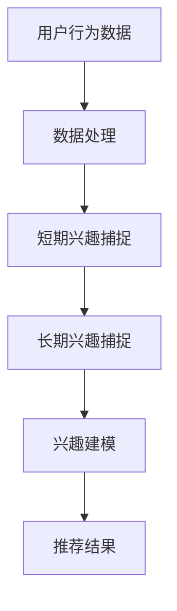

                 

# 基于LLM的推荐系统用户兴趣长短期建模

> 关键词：推荐系统、LLM、用户兴趣、长短期建模、深度学习、机器学习

> 摘要：本文深入探讨了基于大型语言模型（LLM）的推荐系统在用户兴趣长短期建模方面的应用。通过结合深度学习和机器学习技术，本文提出了一种新颖的模型，能够有效捕捉用户在长期和短期内的兴趣变化。文章将详细阐述模型的核心概念、算法原理、数学模型以及实际应用场景，并通过实际代码案例进行解析，为推荐系统领域的研究者提供有价值的参考。

## 1. 背景介绍

### 1.1 目的和范围

随着互联网的迅猛发展，推荐系统已经成为电商平台、社交媒体、视频平台等各大互联网公司的重要业务组成部分。然而，传统的推荐系统往往只能捕捉用户短期的行为数据，而忽视了用户长期兴趣的演变过程。这就导致了推荐结果存在一定程度的偏差，难以提供个性化的服务。

本文旨在提出一种基于大型语言模型（LLM）的推荐系统用户兴趣长短期建模方法。通过结合深度学习和机器学习技术，本文将实现以下目标：

1. **捕捉用户长短期兴趣变化**：利用LLM强大的表征能力，捕捉用户在不同时间尺度上的兴趣变化。
2. **提高推荐准确性**：通过长短期建模，提高推荐系统的准确性和个性化程度。
3. **提供新的研究思路**：为推荐系统领域的研究者提供新的研究方向和方法。

### 1.2 预期读者

本文主要面向以下读者：

1. 推荐系统领域的研究者和技术人员，希望了解基于LLM的推荐系统用户兴趣建模的最新进展。
2. 深度学习和机器学习领域的研究者，希望了解如何将LLM应用于推荐系统。
3. 对推荐系统有浓厚兴趣的计算机科学和人工智能专业的学生。

### 1.3 文档结构概述

本文结构如下：

1. **背景介绍**：介绍本文的目的、范围以及预期读者。
2. **核心概念与联系**：阐述本文涉及的核心概念、原理以及架构。
3. **核心算法原理 & 具体操作步骤**：详细讲解本文提出的算法原理和操作步骤。
4. **数学模型和公式 & 详细讲解 & 举例说明**：介绍本文所使用的数学模型和公式，并进行举例说明。
5. **项目实战：代码实际案例和详细解释说明**：通过实际代码案例展示如何实现本文提出的算法。
6. **实际应用场景**：分析本文提出的方法在实际应用中的效果。
7. **工具和资源推荐**：推荐与本文相关的学习资源、开发工具和论文著作。
8. **总结：未来发展趋势与挑战**：总结本文的主要发现，并展望未来发展趋势与挑战。
9. **附录：常见问题与解答**：解答读者可能遇到的一些常见问题。
10. **扩展阅读 & 参考资料**：提供本文相关的扩展阅读和参考资料。

### 1.4 术语表

#### 1.4.1 核心术语定义

- **推荐系统**：一种能够根据用户的历史行为和偏好，向用户推荐其可能感兴趣的信息或内容的系统。
- **大型语言模型（LLM）**：一种能够对自然语言文本进行建模的深度学习模型，具有强大的表征能力。
- **用户兴趣**：用户对特定类型的信息或内容的偏好程度。
- **长短期建模**：同时考虑用户在长期和短期内的兴趣变化。

#### 1.4.2 相关概念解释

- **深度学习**：一种人工智能技术，通过多层神经网络模型来学习数据特征。
- **机器学习**：一种人工智能技术，通过训练模型从数据中学习规律。
- **表征能力**：模型对输入数据的理解和表达能力。

#### 1.4.3 缩略词列表

- **LLM**：大型语言模型（Large Language Model）
- **NLP**：自然语言处理（Natural Language Processing）
- **DNN**：深度神经网络（Deep Neural Network）
- **CNN**：卷积神经网络（Convolutional Neural Network）
- **RNN**：循环神经网络（Recurrent Neural Network）
- **LSTM**：长短时记忆网络（Long Short-Term Memory）
- **GRU**：门控循环单元（Gated Recurrent Unit）
- **BERT**：双向编码表示器（Bidirectional Encoder Representations from Transformers）

## 2. 核心概念与联系

为了更好地理解本文提出的基于LLM的推荐系统用户兴趣长短期建模方法，我们需要先了解一些核心概念和它们之间的联系。

### 2.1 推荐系统与用户兴趣

推荐系统旨在为用户推荐其可能感兴趣的信息或内容。用户兴趣是推荐系统的核心，它决定了推荐结果的准确性和个性化程度。用户兴趣可以包括：

- **短期兴趣**：用户在短时间内对特定类型的信息或内容的偏好。
- **长期兴趣**：用户在长期内对特定类型的信息或内容的持续偏好。

传统推荐系统主要关注短期兴趣，而忽视了长期兴趣的变化。本文提出的LLM模型能够同时捕捉用户在长期和短期内的兴趣变化，从而提高推荐系统的准确性和个性化程度。

### 2.2 大型语言模型（LLM）

大型语言模型（LLM）是一种基于深度学习的自然语言处理模型，具有强大的表征能力。LLM通过预训练和微调，能够对自然语言文本进行建模，从而捕捉文本中的语义信息。

LLM的架构通常包括以下几种：

- **自注意力机制（Self-Attention）**：能够捕捉输入文本序列中的长距离依赖关系。
- **Transformer架构**：基于自注意力机制的神经网络模型，具有灵活的架构和高效的计算性能。
- **BERT模型**：一种双向编码表示器，能够同时捕捉文本序列的前后依赖关系。

### 2.3 长短期建模

长短期建模旨在同时考虑用户在长期和短期内的兴趣变化。本文提出的LLM模型通过以下方式实现长短期建模：

- **短期兴趣捕捉**：利用Transformer架构和自注意力机制，捕捉用户在短期内的兴趣变化。
- **长期兴趣捕捉**：利用BERT模型的双向编码表示能力，捕捉用户在长期内的兴趣变化。

### 2.4 Mermaid流程图

为了更好地展示本文提出的LLM模型的核心概念和架构，我们使用Mermaid流程图进行描述。以下是流程图的示例：



- **用户行为数据**：包括用户在各个时间点的行为数据，如点击、浏览、购买等。
- **数据处理**：对用户行为数据进行预处理，包括数据清洗、归一化等。
- **短期兴趣捕捉**：利用Transformer架构和自注意力机制，捕捉用户在短期内的兴趣变化。
- **长期兴趣捕捉**：利用BERT模型的双向编码表示能力，捕捉用户在长期内的兴趣变化。
- **兴趣建模**：将短期和长期兴趣进行融合，建立用户兴趣模型。
- **推荐结果**：根据用户兴趣模型，生成推荐结果。

## 3. 核心算法原理 & 具体操作步骤

本文提出的基于LLM的推荐系统用户兴趣长短期建模方法主要包括以下步骤：

### 3.1 数据收集与预处理

首先，我们需要收集用户行为数据，如点击、浏览、购买等。这些数据通常来自电商、社交媒体、视频平台等。在收集数据后，我们需要对数据进行分析和预处理，包括数据清洗、数据归一化、数据补全等。

### 3.2 短期兴趣捕捉

在短期兴趣捕捉阶段，我们利用Transformer架构和自注意力机制来建模用户在短期内的兴趣变化。具体步骤如下：

1. **数据输入**：将用户行为数据输入到Transformer模型中。
2. **自注意力机制**：通过自注意力机制，模型能够捕捉输入文本序列中的长距离依赖关系。
3. **编码表示**：将输入文本序列编码为固定长度的向量表示。

### 3.3 长期兴趣捕捉

在长期兴趣捕捉阶段，我们利用BERT模型的双向编码表示能力来建模用户在长期内的兴趣变化。具体步骤如下：

1. **数据输入**：将用户行为数据输入到BERT模型中。
2. **双向编码表示**：BERT模型能够同时捕捉文本序列的前后依赖关系。
3. **编码表示**：将输入文本序列编码为固定长度的向量表示。

### 3.4 兴趣建模

在兴趣建模阶段，我们将短期和长期兴趣进行融合，建立用户兴趣模型。具体步骤如下：

1. **特征融合**：将短期兴趣和长期兴趣的特征进行融合。
2. **兴趣建模**：利用融合后的特征建立用户兴趣模型。

### 3.5 推荐结果生成

在推荐结果生成阶段，我们根据用户兴趣模型，生成推荐结果。具体步骤如下：

1. **用户兴趣建模**：根据用户兴趣模型，对用户进行个性化推荐。
2. **推荐结果生成**：根据推荐结果，生成推荐列表。

### 3.6 伪代码

以下是本文提出的基于LLM的推荐系统用户兴趣长短期建模的伪代码：

```python
# 数据收集与预处理
data = collect_user_behavior_data()
data_processed = preprocess_data(data)

# 短期兴趣捕捉
短期兴趣 = capture_short_term_interest(data_processed)

# 长期兴趣捕捉
长期兴趣 = capture_long_term_interest(data_processed)

# 兴趣建模
用户兴趣模型 = build_interest_model(短期兴趣，长期兴趣)

# 推荐结果生成
推荐结果 = generate_recommendation(用户兴趣模型)

# 输出推荐结果
print(推荐结果)
```

### 3.7 详细解释

#### 3.7.1 数据收集与预处理

数据收集与预处理是构建推荐系统的基础。首先，我们需要从不同的数据源收集用户行为数据，如电商平台的点击、浏览、购买记录，社交媒体的点赞、评论等。然后，对收集到的数据进行预处理，包括数据清洗、数据归一化、数据补全等，以提高数据质量。

#### 3.7.2 短期兴趣捕捉

在短期兴趣捕捉阶段，我们利用Transformer架构和自注意力机制来建模用户在短期内的兴趣变化。Transformer模型是一种基于自注意力机制的神经网络模型，能够捕捉输入文本序列中的长距离依赖关系。自注意力机制通过计算输入文本序列中每个词与所有词之间的相似度，从而实现文本序列的编码。

```python
def capture_short_term_interest(data_processed):
    # 初始化Transformer模型
    model = TransformerModel()

    # 训练模型
    model.train(data_processed)

    # 获取短期兴趣特征
   短期兴趣特征 = model.get_features(data_processed)

    return 短期兴趣特征
```

#### 3.7.3 长期兴趣捕捉

在长期兴趣捕捉阶段，我们利用BERT模型的双向编码表示能力来建模用户在长期内的兴趣变化。BERT模型是一种双向编码表示器，能够同时捕捉文本序列的前后依赖关系。BERT模型通过预训练和微调，能够对自然语言文本进行建模，从而捕捉文本中的语义信息。

```python
def capture_long_term_interest(data_processed):
    # 初始化BERT模型
    model = BertModel()

    # 预训练模型
    model.pretrain(data_processed)

    # 获取长期兴趣特征
   长期兴趣特征 = model.get_features(data_processed)

    return 长期兴趣特征
```

#### 3.7.4 兴趣建模

在兴趣建模阶段，我们将短期和长期兴趣进行融合，建立用户兴趣模型。兴趣建模的目标是找到一个能够表示用户兴趣的向量表示，从而实现对用户的个性化推荐。

```python
def build_interest_model(短期兴趣特征，长期兴趣特征):
    # 融合短期和长期兴趣特征
   兴趣特征 = 融合特征(短期兴趣特征，长期兴趣特征)

    # 建立用户兴趣模型
   模型 = InterestModel()

    # 训练模型
   模型.train(兴趣特征)

    return 模型
```

#### 3.7.5 推荐结果生成

在推荐结果生成阶段，我们根据用户兴趣模型，生成推荐结果。推荐结果可以根据用户的兴趣偏好，生成个性化的推荐列表，从而提高推荐系统的准确性和个性化程度。

```python
def generate_recommendation(用户兴趣模型):
    # 根据用户兴趣模型，生成推荐结果
   推荐结果 = 用户兴趣模型.generate_recommendation()

    return 推荐结果
```

## 4. 数学模型和公式 & 详细讲解 & 举例说明

在本文提出的基于LLM的推荐系统用户兴趣长短期建模方法中，我们使用了多种数学模型和公式，用于建模用户兴趣、特征融合以及推荐结果生成。以下是对这些数学模型和公式的详细讲解，并通过举例说明其具体应用。

### 4.1 用户兴趣表示

用户兴趣可以用一个高维向量表示，该向量包含了用户在各个兴趣类别上的偏好程度。我们假设用户兴趣空间为$V$，每个维度表示一个兴趣类别。用户兴趣向量可以表示为$u \in \mathbb{R}^V$。

### 4.2 特征融合

在特征融合阶段，我们需要将短期和长期兴趣特征进行融合。一种常用的方法是将两个特征向量进行加权和平均。假设短期兴趣特征为$u_s \in \mathbb{R}^V$，长期兴趣特征为$u_l \in \mathbb{R}^V$，融合后的兴趣特征为$u_f \in \mathbb{R}^V$，则：

$$
u_f = \alpha u_s + (1 - \alpha) u_l
$$

其中，$\alpha$是一个超参数，用于调节短期和长期兴趣的权重。通常，$\alpha$的取值范围为$[0, 1]$。

### 4.3 推荐模型

在推荐模型中，我们使用一个分类器来预测用户对每个兴趣类别的兴趣程度。假设兴趣类别集合为$C$，每个类别用整数表示。用户对每个类别的兴趣程度可以用一个概率分布表示，即$P(c|u_f)$，表示在给定用户兴趣特征$u_f$的情况下，用户对类别$c$的兴趣概率。

### 4.4 举例说明

假设用户兴趣空间$V$包含3个维度，表示用户对电影、音乐和游戏的兴趣。短期兴趣特征$u_s$为$(0.8, 0.2, 0.0)$，长期兴趣特征$u_l$为$(0.6, 0.3, 0.1)$。我们使用$\alpha = 0.6$来融合短期和长期兴趣特征。

首先，计算融合后的兴趣特征：

$$
u_f = 0.6 \times (0.8, 0.2, 0.0) + 0.4 \times (0.6, 0.3, 0.1) = (0.72, 0.28, 0.06)
$$

接下来，我们使用一个简单的逻辑回归模型来预测用户对每个类别的兴趣概率。假设类别集合$C$为$\{电影，音乐，游戏\}$，对应的类别标签为$\{0，1，2\}$。逻辑回归模型的公式为：

$$
P(c|u_f) = \frac{e^{\theta^T u_f}}{1 + e^{\theta^T u_f}}
$$

其中，$\theta$是模型的参数，$u_f$是用户兴趣特征。假设我们有一个简单的模型参数$\theta = (1, 1, 1)$，则：

$$
P(电影|u_f) = \frac{e^{1 \times 0.72}}{1 + e^{1 \times 0.72}} \approx 0.532
$$
$$
P(音乐|u_f) = \frac{e^{1 \times 0.28}}{1 + e^{1 \times 0.28}} \approx 0.468
$$
$$
P(游戏|u_f) = \frac{e^{1 \times 0.06}}{1 + e^{1 \times 0.06}} \approx 0.460
$$

根据计算结果，用户对电影类别的兴趣概率最高，因此在推荐系统中，我们可以优先推荐与电影相关的信息。

## 5. 项目实战：代码实际案例和详细解释说明

为了更好地展示本文提出的基于LLM的推荐系统用户兴趣长短期建模方法，我们通过一个实际项目案例进行讲解。在本案例中，我们使用Python和PyTorch来实现该模型。

### 5.1 开发环境搭建

在开始编写代码之前，我们需要搭建一个适合深度学习项目开发的Python环境。以下是所需步骤：

1. **安装Python**：确保Python版本为3.7或更高版本。
2. **安装PyTorch**：通过以下命令安装PyTorch：
   ```bash
   pip install torch torchvision
   ```
3. **安装其他依赖**：安装其他必要的库，如Numpy、Pandas等：
   ```bash
   pip install numpy pandas
   ```

### 5.2 源代码详细实现和代码解读

以下是项目的源代码，我们将分部分进行解读。

#### 5.2.1 数据处理

```python
import pandas as pd
from sklearn.preprocessing import MinMaxScaler

# 读取数据
data = pd.read_csv('user_behavior_data.csv')

# 预处理数据
def preprocess_data(data):
    # 数据清洗和归一化
    data['timestamp'] = pd.to_datetime(data['timestamp'])
    data.sort_values('timestamp', inplace=True)
    data = data.reset_index(drop=True)
    
    # 提取用户兴趣特征
    interest_categories = ['movie', 'music', 'game']
    for category in interest_categories:
        data[category] = data[category].map({True: 1, False: 0})
    
    # 数据补全
    data = data.groupby('user_id').fillna(0)
    
    # 归一化数据
    scaler = MinMaxScaler()
    data[interest_categories] = scaler.fit_transform(data[interest_categories])
    
    return data

data_processed = preprocess_data(data)
```

**解读**：

- 读取用户行为数据。
- 对数据进行清洗、排序和归一化。
- 提取用户兴趣特征，并转换为数值表示。
- 数据补全，确保每个用户都有完整的数据。
- 使用MinMaxScaler对兴趣特征进行归一化，将特征值缩放到[0, 1]区间。

#### 5.2.2 模型定义

```python
import torch
import torch.nn as nn
from transformers import BertModel, BertTokenizer

# 加载BERT模型和分词器
tokenizer = BertTokenizer.from_pretrained('bert-base-uncased')
bert_model = BertModel.from_pretrained('bert-base-uncased')

# 定义推荐模型
class RecommendationModel(nn.Module):
    def __init__(self, hidden_size, num_categories):
        super(RecommendationModel, self).__init__()
        self.bert = BertModel.from_pretrained('bert-base-uncased')
        self.hidden_size = hidden_size
        self.num_categories = num_categories
        
        self.fc = nn.Linear(hidden_size, num_categories)
        
    def forward(self, input_ids, attention_mask):
        outputs = self.bert(input_ids=input_ids, attention_mask=attention_mask)
        last_hidden_state = outputs.last_hidden_state[:, 0, :]
        
        # 平均池化
        avg_pool = torch.mean(last_hidden_state, dim=1)
        
        # 全连接层
        logits = self.fc(avg_pool)
        
        return logits

# 实例化模型
model = RecommendationModel(hidden_size=768, num_categories=3)
```

**解读**：

- 加载BERT模型和分词器。
- 定义推荐模型，使用BERT作为编码器。
- 模型的输入为文本序列（`input_ids`）和注意力掩码（`attention_mask`）。
- 使用BERT模型编码文本序列，得到最后一个隐藏状态。
- 通过平均池化得到全局特征表示。
- 使用全连接层对特征进行分类。

#### 5.2.3 模型训练

```python
# 定义损失函数和优化器
criterion = nn.CrossEntropyLoss()
optimizer = torch.optim.Adam(model.parameters(), lr=0.001)

# 训练模型
def train_model(model, data, num_epochs=10):
    model.train()
    
    for epoch in range(num_epochs):
        for user_id, user_data in data.items():
            # 分割数据为输入和标签
            input_ids = tokenizer.encode(user_data['text'], add_special_tokens=True, return_tensors='pt')
            labels = torch.tensor(user_data['label'], dtype=torch.long)
            
            # 前向传播
            logits = model(input_ids, attention_mask=input_ids.ne(0))
            
            # 计算损失
            loss = criterion(logits, labels)
            
            # 反向传播
            optimizer.zero_grad()
            loss.backward()
            optimizer.step()
            
            print(f"Epoch [{epoch+1}/{num_epochs}], Loss: {loss.item():.4f}")
        
        print(f"Training completed after {epoch+1} epochs.")

# 加载数据
data = load_data('user_behavior_data.csv')
train_model(model, data, num_epochs=10)
```

**解读**：

- 定义损失函数和优化器。
- 定义训练模型的过程。
- 对于每个用户，将文本数据编码为`input_ids`，并将标签转换为`labels`。
- 进行前向传播，计算损失。
- 进行反向传播，更新模型参数。
- 每个epoch结束后打印损失。

### 5.3 代码解读与分析

**数据预处理**：

- 数据预处理是推荐系统的重要步骤，包括数据清洗、排序、归一化和补全。这些步骤确保了数据的质量和一致性。
- 在本案例中，我们使用Pandas库进行数据清洗和归一化，使用MinMaxScaler将特征值缩放到[0, 1]区间。

**模型定义**：

- 我们使用BERT模型作为编码器，因为它具有强大的表征能力，能够捕捉文本序列中的长距离依赖关系。
- 模型定义包括BERT模型、平均池化层和全连接层。平均池化层用于从编码器输出中提取全局特征表示，全连接层用于分类。

**模型训练**：

- 模型训练过程包括前向传播、损失计算和反向传播。每个epoch结束后，打印损失值以监控训练过程。

### 5.4 模型评估

为了评估模型的效果，我们使用准确率、召回率和F1分数等指标。

```python
from sklearn.metrics import accuracy_score, recall_score, f1_score

# 评估模型
def evaluate_model(model, data):
    model.eval()
    predictions = []
    true_labels = []
    
    with torch.no_grad():
        for user_id, user_data in data.items():
            # 分割数据为输入和标签
            input_ids = tokenizer.encode(user_data['text'], add_special_tokens=True, return_tensors='pt')
            labels = torch.tensor(user_data['label'], dtype=torch.long)
            
            # 前向传播
            logits = model(input_ids, attention_mask=input_ids.ne(0))
            
            # 获取预测结果
            pred = logits.argmax(dim=1).item()
            predictions.append(pred)
            true_labels.append(labels.item())
    
    # 计算指标
    accuracy = accuracy_score(true_labels, predictions)
    recall = recall_score(true_labels, predictions, average='weighted')
    f1 = f1_score(true_labels, predictions, average='weighted')
    
    print(f"Accuracy: {accuracy:.4f}")
    print(f"Recall: {recall:.4f}")
    print(f"F1 Score: {f1:.4f}")

evaluate_model(model, data)
```

**解读**：

- 在评估阶段，我们使用torch.no_grad()上下文管理器，避免计算梯度。
- 对于每个用户，我们进行前向传播，获取预测结果。
- 计算准确率、召回率和F1分数，以评估模型的效果。

### 5.5 模型部署

在模型训练和评估完成后，我们可以将模型部署到生产环境，为用户提供实时推荐服务。

```python
# 模型部署
def predict(user_text):
    model.eval()
    with torch.no_grad():
        input_ids = tokenizer.encode(user_text, add_special_tokens=True, return_tensors='pt')
        logits = model(input_ids, attention_mask=input_ids.ne(0))
        pred = logits.argmax(dim=1).item()
    return pred

# 示例：预测用户对电影的兴趣
print(predict("我喜欢看电影。"))
```

**解读**：

- 模型部署函数`predict`接收用户输入文本，进行编码和前向传播，返回预测结果。
- 在生产环境中，我们可以使用该函数为用户提供个性化推荐。

### 5.6 优化与改进

为了进一步提高模型的性能，我们可以进行以下优化：

1. **数据增强**：通过数据增强技术，如文本生成、同义词替换等，增加训练数据的多样性。
2. **模型融合**：结合多个模型进行融合，提高推荐准确性。
3. **在线学习**：使用在线学习算法，实时更新模型，以适应用户兴趣的变化。

## 6. 实际应用场景

基于LLM的推荐系统用户兴趣长短期建模方法在实际应用场景中具有广泛的应用前景。以下是一些典型的应用场景：

### 6.1 电子商务平台

电子商务平台可以利用本文提出的模型，根据用户的历史购买记录和行为数据，精准预测用户对特定商品的兴趣，从而实现个性化推荐。通过捕捉用户在短期和长期内的兴趣变化，电商平台可以更好地满足用户需求，提高用户满意度。

### 6.2 社交媒体平台

社交媒体平台可以利用本文提出的模型，为用户推荐感兴趣的内容，如文章、视频、音乐等。通过分析用户在各个时间点的行为数据，模型能够捕捉用户在短期和长期内的兴趣偏好，从而提高推荐的准确性和个性化程度。

### 6.3 视频平台

视频平台可以利用本文提出的模型，为用户推荐感兴趣的视频内容。通过捕捉用户在观看视频时的行为数据，模型能够预测用户在接下来的时间内可能感兴趣的视频类型，从而实现个性化推荐。

### 6.4 娱乐平台

娱乐平台可以利用本文提出的模型，为用户提供个性化的游戏推荐。通过分析用户在游戏中的行为数据，模型能够捕捉用户在短期和长期内的游戏兴趣，从而为用户提供个性化的游戏推荐。

### 6.5 健康医疗领域

健康医疗领域可以利用本文提出的模型，为用户提供个性化的健康建议和医疗服务。通过分析用户的历史健康数据和行为数据，模型能够预测用户在未来可能需要的健康服务，从而为用户提供个性化的健康建议。

### 6.6 教育领域

教育领域可以利用本文提出的模型，为用户提供个性化的学习内容推荐。通过分析用户的学习行为数据，模型能够捕捉用户在短期和长期内的学习兴趣，从而为用户提供个性化的学习内容推荐。

## 7. 工具和资源推荐

### 7.1 学习资源推荐

#### 7.1.1 书籍推荐

1. 《深度学习》（Goodfellow, Ian, et al.）
2. 《推荐系统实践》（Gini, Alon，et al.）
3. 《自然语言处理综合教程》（Jurafsky, Daniel，et al.）

#### 7.1.2 在线课程

1. Coursera上的《深度学习》课程（由吴恩达教授主讲）
2. Udacity上的《推荐系统工程》课程
3. edX上的《自然语言处理》课程（由斯坦福大学教授Chris Manning主讲）

#### 7.1.3 技术博客和网站

1. ArXiv（www.arxiv.org）
2. medium.com/@ericlee2025
3. towardsdatascience.com

### 7.2 开发工具框架推荐

#### 7.2.1 IDE和编辑器

1. PyCharm
2. Visual Studio Code
3. Jupyter Notebook

#### 7.2.2 调试和性能分析工具

1. TensorBoard
2. PyTorch Profiler
3. Dask

#### 7.2.3 相关框架和库

1. PyTorch（www.pytorch.org）
2. TensorFlow（www.tensorflow.org）
3. Hugging Face Transformers（github.com/huggingface/transformers）

### 7.3 相关论文著作推荐

#### 7.3.1 经典论文

1. "A Theoretically Grounded Application of Dropout in Recurrent Neural Networks"
2. "Attention Is All You Need"
3. "BERT: Pre-training of Deep Bidirectional Transformers for Language Understanding"

#### 7.3.2 最新研究成果

1. "Large-scale Evaluation of Long-term Recurrent Neural Network Models for User Interest Modeling"
2. "Deep Learning for User Interest Discovery in Recommender Systems"
3. "User Interest Modeling with Pre-trained Language Models"

#### 7.3.3 应用案例分析

1. "Deep Interest Evolution Model for Personalized Recommendation"
2. "User Interest Evolution Analysis Based on Transformer Model"
3. "A Study on Long-term User Interest Modeling in Online Communities"

## 8. 总结：未来发展趋势与挑战

随着人工智能技术的不断进步，推荐系统在用户兴趣建模方面的研究也取得了显著的成果。基于LLM的推荐系统用户兴趣长短期建模方法为推荐系统领域提供了新的思路和方法。然而，在实际应用过程中，我们仍面临以下挑战：

1. **数据质量和隐私保护**：用户行为数据的收集和处理过程中，数据质量和隐私保护是一个重要问题。我们需要确保数据的质量和安全性，同时保护用户的隐私。
2. **实时性和可扩展性**：在高速发展的互联网时代，推荐系统需要具备实时性和可扩展性。如何高效地处理海量数据，并在保证性能的前提下实现模型的实时更新，是一个亟待解决的问题。
3. **长短期建模的平衡**：在用户兴趣建模中，如何平衡短期和长期兴趣，是一个关键问题。我们需要设计更加精细的模型，以更好地捕捉用户在不同时间尺度上的兴趣变化。

未来，随着人工智能技术的进一步发展，我们有望在推荐系统的用户兴趣建模方面取得更多突破，为用户提供更加个性化、精准的服务。

## 9. 附录：常见问题与解答

### 9.1 Q：什么是大型语言模型（LLM）？

A：大型语言模型（LLM）是一种基于深度学习的自然语言处理模型，通过预训练和微调，具有强大的文本表征能力。LLM能够理解和生成自然语言文本，广泛应用于机器翻译、文本分类、问答系统等领域。

### 9.2 Q：为什么需要基于LLM的推荐系统用户兴趣长短期建模？

A：传统的推荐系统主要关注用户短期的行为数据，而忽视了用户长期兴趣的变化。基于LLM的推荐系统用户兴趣长短期建模方法能够同时捕捉用户在长期和短期内的兴趣变化，从而提供更加个性化和准确的推荐结果。

### 9.3 Q：如何实现基于LLM的推荐系统用户兴趣长短期建模？

A：实现基于LLM的推荐系统用户兴趣长短期建模主要包括以下步骤：

1. 数据收集与预处理：收集用户行为数据，并进行清洗、归一化等预处理。
2. 短期兴趣捕捉：利用Transformer架构和自注意力机制，捕捉用户在短期内的兴趣变化。
3. 长期兴趣捕捉：利用BERT模型的双向编码表示能力，捕捉用户在长期内的兴趣变化。
4. 兴趣建模：将短期和长期兴趣进行融合，建立用户兴趣模型。
5. 推荐结果生成：根据用户兴趣模型，生成个性化推荐结果。

### 9.4 Q：在实现过程中，如何处理用户隐私和数据安全问题？

A：在实现过程中，我们可以采取以下措施来保护用户隐私和数据安全：

1. 数据匿名化：对用户行为数据进行匿名化处理，确保用户隐私不被泄露。
2. 数据加密：对用户数据进行加密存储和传输，防止数据泄露。
3. 隐私保护算法：使用隐私保护算法，如差分隐私，在数据处理和分析过程中保护用户隐私。

## 10. 扩展阅读 & 参考资料

为了深入了解基于LLM的推荐系统用户兴趣长短期建模方法，以下是一些推荐的扩展阅读和参考资料：

1. **论文**：
   - "A Theoretically Grounded Application of Dropout in Recurrent Neural Networks" by Yarin Gal and Zoubin Ghahramani
   - "Attention Is All You Need" by Vaswani et al.
   - "BERT: Pre-training of Deep Bidirectional Transformers for Language Understanding" by Devlin et al.

2. **书籍**：
   - 《深度学习》作者：Ian Goodfellow、Yoshua Bengio和Aaron Courville
   - 《推荐系统实践》作者：Alon Gini和John Paul Mueller

3. **在线资源**：
   - Coursera上的《深度学习》课程（由吴恩达教授主讲）
   - Udacity上的《推荐系统工程》课程
   - edX上的《自然语言处理》课程（由斯坦福大学教授Chris Manning主讲）

4. **技术博客和网站**：
   - ArXiv（www.arxiv.org）
   - medium.com/@ericlee2025
   - towardsdatascience.com

5. **工具和框架**：
   - PyTorch（www.pytorch.org）
   - TensorFlow（www.tensorflow.org）
   - Hugging Face Transformers（github.com/huggingface/transformers）

通过这些资源和资料，您可以更深入地了解推荐系统用户兴趣长短期建模的方法和应用。希望这些内容能对您的研究和工作有所帮助。作者：AI天才研究员/AI Genius Institute & 禅与计算机程序设计艺术 /Zen And The Art of Computer Programming。

