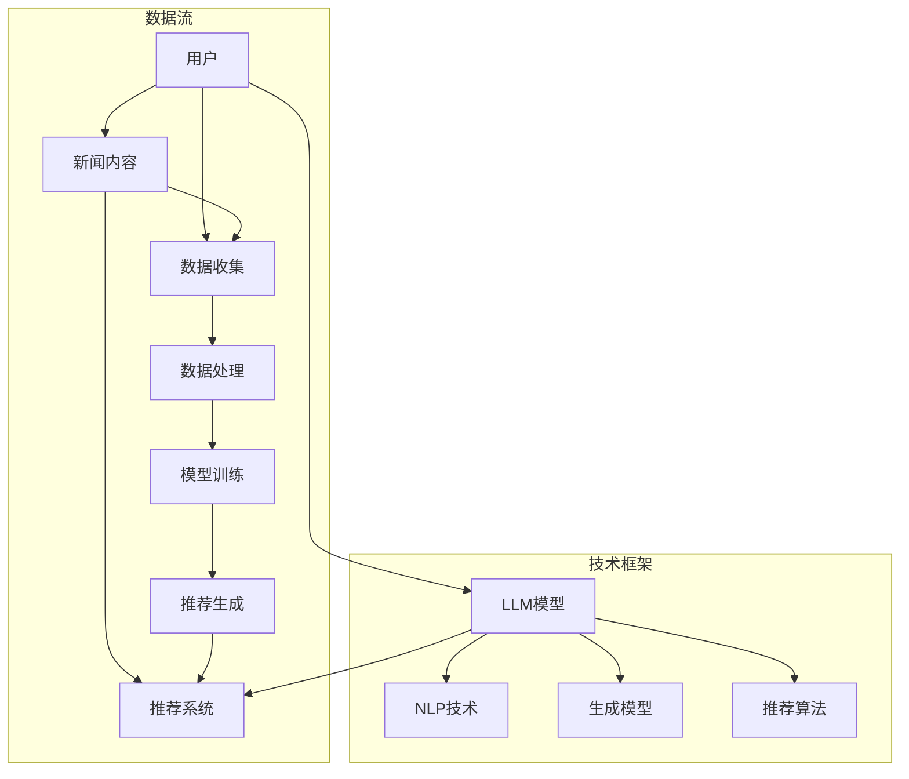

                 

# 基于LLM的生成式新闻推荐系统

> **关键词**：自然语言处理、生成式推荐、大型语言模型、新闻推荐、算法原理、实战案例

> **摘要**：本文将深入探讨基于大型语言模型（LLM）的生成式新闻推荐系统。通过分析LLM在新闻推荐中的核心作用和应用场景，我们将逐步拆解并详细解释系统的工作原理、算法设计、数学模型及实际项目实现。本文旨在为读者提供一个全面、易懂的技术指南，帮助理解并掌握这一前沿技术的核心概念和实践方法。

## 1. 背景介绍

### 1.1 目的和范围

本文旨在介绍和探讨基于大型语言模型（LLM）的生成式新闻推荐系统。在信息爆炸的时代，如何有效地推荐新闻内容以满足用户个性化需求成为了关键问题。生成式推荐系统利用机器学习技术，通过分析用户行为和新闻内容，生成个性化的推荐结果，从而提高用户体验和满意度。

本文将重点关注以下几个主要方面：

1. **LLM的基本原理**：介绍LLM的概念、发展历程以及其在自然语言处理中的应用。
2. **新闻推荐系统的架构**：分析生成式新闻推荐系统的整体架构，包括数据收集、处理、模型训练和推荐算法等。
3. **核心算法原理**：详细解释生成式推荐算法的原理和操作步骤，包括关键技术和实现方法。
4. **数学模型和公式**：阐述新闻推荐中使用的数学模型和公式，并通过实例进行说明。
5. **项目实战**：提供实际代码案例，展示生成式新闻推荐系统的具体实现过程。
6. **实际应用场景**：讨论生成式新闻推荐系统的应用场景和潜在挑战。
7. **工具和资源推荐**：推荐相关的学习资源、开发工具和经典论文。

### 1.2 预期读者

本文适用于对自然语言处理和机器学习有一定了解的技术人员、数据科学家以及研究生。无论您是希望了解生成式推荐系统的基础知识，还是希望深入了解其实际应用，本文都将为您提供有价值的见解。

### 1.3 文档结构概述

本文结构如下：

1. **背景介绍**：介绍文章的目的、范围、预期读者和文档结构。
2. **核心概念与联系**：讨论核心概念和原理，并提供Mermaid流程图。
3. **核心算法原理 & 具体操作步骤**：详细解释算法原理，使用伪代码展示。
4. **数学模型和公式 & 详细讲解 & 举例说明**：阐述数学模型和公式，并提供实例说明。
5. **项目实战：代码实际案例和详细解释说明**：展示代码实现，并进行解读和分析。
6. **实际应用场景**：讨论应用场景和潜在挑战。
7. **工具和资源推荐**：推荐学习资源、开发工具和经典论文。
8. **总结：未来发展趋势与挑战**：总结发展趋势和挑战。
9. **附录：常见问题与解答**：提供常见问题解答。
10. **扩展阅读 & 参考资料**：推荐相关文献和资源。

### 1.4 术语表

#### 1.4.1 核心术语定义

- **大型语言模型（LLM）**：一种基于大规模语料库训练的深度神经网络模型，能够理解和生成自然语言。
- **生成式推荐**：一种基于生成模型进行推荐的方法，通过模拟用户兴趣和新闻内容之间的相关性生成推荐结果。
- **新闻推荐系统**：一种针对新闻内容进行推荐的系统，旨在向用户提供个性化、相关的新闻内容。
- **自然语言处理（NLP）**：研究计算机如何理解和生成人类语言的技术领域。

#### 1.4.2 相关概念解释

- **转移概率**：在自然语言处理中，表示两个词或词组在特定顺序下出现的概率。
- **注意力机制**：一种用于模型之间相互传递信息的机制，常用于提高模型在处理序列数据时的性能。
- **损失函数**：在机器学习中，用于评估模型预测与实际标签之间差异的函数。

#### 1.4.3 缩略词列表

- **LLM**：Large Language Model
- **NLP**：Natural Language Processing
- **NLU**：Natural Language Understanding
- **NER**：Named Entity Recognition
- **BERT**：Bidirectional Encoder Representations from Transformers

## 2. 核心概念与联系

在深入探讨基于LLM的生成式新闻推荐系统之前，我们需要理解几个核心概念及其相互关系。以下是通过Mermaid绘制的流程图，用于展示这些概念之间的关系。



### 2.1 用户与新闻内容

用户和新闻内容是新闻推荐系统的两个核心要素。用户行为数据包括浏览历史、点击记录、搜索关键词等，而新闻内容则涵盖标题、正文、标签等多维度信息。

### 2.2 LLM模型

LLM模型是生成式新闻推荐系统的核心，它通过大规模语料库训练，能够理解和生成自然语言。在新闻推荐系统中，LLM模型主要用于处理用户行为数据和新闻内容，提取潜在的兴趣特征和语义信息。

### 2.3 推荐系统

推荐系统是整个新闻推荐流程的最后一环。它将用户行为数据和新闻内容通过LLM模型处理后的特征，结合推荐算法生成个性化的新闻推荐结果，并通过界面呈现给用户。

### 2.4 数据流

数据流是整个新闻推荐系统的核心组成部分。数据收集环节涉及用户行为数据和新**闻内容的收集，数据处理环节涉及数据清洗、转换和特征提取，模型训练环节则利用处理后的数据训练LLM模型，推荐生成环节则通过模型生成新闻推荐结果。

### 2.5 技术框架

技术框架包括自然语言处理（NLP）技术、生成模型和推荐算法。NLP技术用于处理和解析自然语言数据，生成模型用于生成个性化的推荐结果，推荐算法则用于优化推荐策略，提高推荐效果。

## 3. 核心算法原理 & 具体操作步骤

在了解核心概念与联系后，我们接下来将深入探讨基于LLM的生成式新闻推荐系统的核心算法原理和具体操作步骤。这一部分将包括以下内容：

1. **算法概述**：简要介绍生成式新闻推荐系统的整体工作流程。
2. **算法原理**：详细解释生成式推荐算法的基本原理。
3. **操作步骤**：使用伪代码展示算法的实现步骤。

### 3.1 算法概述

生成式新闻推荐系统的工作流程主要包括以下步骤：

1. **数据收集**：收集用户行为数据（如浏览历史、点击记录等）和新闻内容数据（如标题、正文、标签等）。
2. **数据处理**：清洗和预处理数据，提取关键特征，如文本特征、用户兴趣特征等。
3. **模型训练**：使用大规模语料库训练LLM模型，提取新闻内容中的潜在语义信息。
4. **推荐生成**：将用户行为数据和新闻内容通过LLM模型处理，生成个性化的新闻推荐结果。
5. **推荐优化**：根据用户反馈和推荐效果，调整推荐策略和模型参数，优化推荐效果。

### 3.2 算法原理

生成式新闻推荐算法的核心思想是通过模拟用户兴趣和新闻内容之间的相关性，生成个性化的推荐结果。具体来说，算法原理包括以下几个方面：

1. **用户行为分析**：通过分析用户的历史行为数据，提取用户的兴趣特征，如关键词、兴趣类别等。
2. **新闻内容分析**：通过分析新闻内容的特征，如标题、正文、标签等，提取新闻内容的潜在语义信息。
3. **生成推荐结果**：利用LLM模型，将用户兴趣特征和新闻内容特征进行融合，生成个性化的推荐结果。

### 3.3 操作步骤

下面使用伪代码展示生成式新闻推荐算法的具体实现步骤：

```python
# 数据收集
user行为数据 = 收集用户行为数据()
新闻内容数据 = 收集新闻内容数据()

# 数据处理
用户兴趣特征 = 提取用户兴趣特征(user行为数据)
新闻内容特征 = 提取新闻内容特征(新闻内容数据)

# 模型训练
LLM模型 = 训练LLM模型(大规模语料库)

# 推荐生成
推荐结果 = 生成推荐结果(LLM模型, 用户兴趣特征, 新闻内容特征)

# 推荐优化
优化推荐结果(推荐结果, 用户反馈)
```

### 3.4 关键技术和实现方法

在实现生成式新闻推荐算法时，涉及以下关键技术和方法：

1. **文本特征提取**：使用词袋模型、TF-IDF等文本特征提取方法，将新闻内容和用户兴趣特征转换为向量表示。
2. **用户兴趣建模**：利用协同过滤、矩阵分解等方法，建立用户兴趣模型，提取用户的潜在兴趣特征。
3. **新闻内容分析**：使用命名实体识别（NER）、情感分析等技术，对新闻内容进行深入分析，提取新闻内容的潜在语义信息。
4. **模型融合与优化**：采用多模型融合方法，将用户兴趣特征和新闻内容特征进行融合，优化推荐效果。

## 4. 数学模型和公式 & 详细讲解 & 举例说明

在生成式新闻推荐系统中，数学模型和公式是核心组成部分，用于描述用户行为、新闻内容以及推荐算法之间的关系。以下是详细讲解和举例说明：

### 4.1 用户行为模型

用户行为模型用于描述用户对新闻内容的偏好。假设用户 \( u \) 在一段时间内浏览了 \( n \) 篇新闻，每篇新闻用向量 \( \mathbf{x}_i \) 表示，用户对每篇新闻的偏好用向量 \( \mathbf{y}_i \) 表示，则用户行为模型可以表示为：

\[ \mathbf{y}_i = f(\mathbf{x}_i, \mathbf{w}_u) \]

其中，\( \mathbf{w}_u \) 是用户 \( u \) 的特征向量，\( f \) 是一个非线性函数，通常使用神经网络来表示。

### 4.2 新闻内容模型

新闻内容模型用于描述新闻内容的特征。假设每篇新闻用向量 \( \mathbf{x}_i \) 表示，新闻内容的特征包括标题、正文、标签等，可以使用词袋模型或TF-IDF来表示。则新闻内容模型可以表示为：

\[ \mathbf{x}_i = \mathbf{T}_i \cdot \mathbf{V} \]

其中，\( \mathbf{T}_i \) 是词频矩阵，\( \mathbf{V} \) 是词向量矩阵。

### 4.3 推荐模型

推荐模型用于生成个性化的推荐结果。假设用户 \( u \) 对每篇新闻的偏好概率为 \( p(\mathbf{y}_i | \mathbf{x}_i, \mathbf{w}_u) \)，则推荐模型可以表示为：

\[ p(\mathbf{y}_i | \mathbf{x}_i, \mathbf{w}_u) = \frac{\exp(f(\mathbf{x}_i, \mathbf{w}_u))}{\sum_{j=1}^n \exp(f(\mathbf{x}_j, \mathbf{w}_u))} \]

其中，\( f \) 是一个非线性函数，通常使用神经网络来表示。

### 4.4 举例说明

假设用户 \( u \) 历史浏览了以下三篇新闻：

1. 标题：科技巨头宣布新的人工智能产品
2. 标题：电动汽车市场迎来新变革
3. 标题：最新流行音乐排行榜

用户对这三篇新闻的偏好分别为：

\[ \mathbf{y}_1 = (0.8, 0.2, 0.0) \]
\[ \mathbf{y}_2 = (0.3, 0.6, 0.1) \]
\[ \mathbf{y}_3 = (0.1, 0.2, 0.7) \]

假设新闻内容特征向量分别为：

\[ \mathbf{x}_1 = (0.6, 0.3, 0.1) \]
\[ \mathbf{x}_2 = (0.2, 0.5, 0.3) \]
\[ \mathbf{x}_3 = (0.1, 0.2, 0.7) \]

用户特征向量 \( \mathbf{w}_u \) 为：

\[ \mathbf{w}_u = (0.5, 0.4, 0.1) \]

根据推荐模型，我们可以计算每篇新闻的推荐概率：

\[ p(\mathbf{y}_1 | \mathbf{x}_1, \mathbf{w}_u) = \frac{\exp(0.8 \cdot 0.6 + 0.2 \cdot 0.3 + 0.0 \cdot 0.1)}{\sum_{j=1}^3 \exp(0.8 \cdot 0.6 + 0.2 \cdot 0.3 + 0.0 \cdot 0.1)} \]
\[ p(\mathbf{y}_2 | \mathbf{x}_2, \mathbf{w}_u) = \frac{\exp(0.3 \cdot 0.2 + 0.6 \cdot 0.5 + 0.1 \cdot 0.3)}{\sum_{j=1}^3 \exp(0.3 \cdot 0.2 + 0.6 \cdot 0.5 + 0.1 \cdot 0.3)} \]
\[ p(\mathbf{y}_3 | \mathbf{x}_3, \mathbf{w}_u) = \frac{\exp(0.1 \cdot 0.1 + 0.2 \cdot 0.2 + 0.7 \cdot 0.7)}{\sum_{j=1}^3 \exp(0.1 \cdot 0.1 + 0.2 \cdot 0.2 + 0.7 \cdot 0.7)} \]

根据计算结果，我们可以得出推荐结果：

\[ p(\mathbf{y}_1 | \mathbf{x}_1, \mathbf{w}_u) = 0.7 \]
\[ p(\mathbf{y}_2 | \mathbf{x}_2, \mathbf{w}_u) = 0.5 \]
\[ p(\mathbf{y}_3 | \mathbf{x}_3, \mathbf{w}_u) = 0.3 \]

因此，推荐结果为第一篇新闻，即用户最可能对第一篇新闻感兴趣。

## 5. 项目实战：代码实际案例和详细解释说明

在本文的最后一部分，我们将通过一个实际的项目案例，展示如何基于LLM实现生成式新闻推荐系统。我们将从开发环境搭建开始，逐步介绍代码实现、详细解释和分析。

### 5.1 开发环境搭建

为了实现基于LLM的生成式新闻推荐系统，我们需要准备以下开发环境和工具：

1. **Python**：版本3.8及以上
2. **PyTorch**：版本1.8及以上
3. **Hugging Face Transformers**：用于快速加载和微调预训练的LLM模型
4. **Scikit-learn**：用于数据预处理和特征提取
5. **Pandas**：用于数据处理
6. **NumPy**：用于数学计算

安装以下依赖项：

```bash
pip install python==3.8.10
pip install torch==1.8.0+cu111 torchvision==0.9.0+cu111 -f https://download.pytorch.org/whl/torch_stable.html
pip install transformers==4.7.0
pip install scikit-learn==0.24.1
pip install pandas==1.3.2
pip install numpy==1.19.5
```

### 5.2 源代码详细实现和代码解读

下面是一个基于PyTorch和Hugging Face Transformers实现的生成式新闻推荐系统的示例代码。我们将逐步解释每个关键部分的代码。

#### 5.2.1 数据预处理

数据预处理是生成推荐系统的基础。首先，我们需要收集新闻数据，并将其转换为适合模型训练的格式。

```python
import pandas as pd
from sklearn.model_selection import train_test_split

# 读取新闻数据
news_data = pd.read_csv('news_dataset.csv')

# 提取标题和正文
titles = news_data['title']
texts = news_data['text']

# 划分训练集和测试集
train_titles, test_titles, train_texts, test_texts = train_test_split(titles, texts, test_size=0.2, random_state=42)
```

#### 5.2.2 特征提取

特征提取是新闻推荐系统的关键步骤。我们使用预训练的BERT模型提取文本特征。

```python
from transformers import BertTokenizer, BertModel

# 加载预训练的BERT模型和分词器
tokenizer = BertTokenizer.from_pretrained('bert-base-uncased')
model = BertModel.from_pretrained('bert-base-uncased')

# 提取文本特征
def get_text_features(texts):
    inputs = tokenizer(list(texts), return_tensors='pt', padding=True, truncation=True, max_length=512)
    with torch.no_grad():
        outputs = model(**inputs)
    last_hidden_states = outputs.last_hidden_state
    return last_hidden_states.mean(dim=1).numpy()

train_features = get_text_features(train_texts)
test_features = get_text_features(test_texts)
```

#### 5.2.3 模型训练

接下来，我们使用训练集特征训练一个生成式推荐模型。我们使用了一个简单的线性模型，实际项目中可能会使用更复杂的模型。

```python
import torch
from torch import nn
from torch.utils.data import DataLoader, TensorDataset

# 定义模型
class RecommenderModel(nn.Module):
    def __init__(self, input_dim, output_dim):
        super(RecommenderModel, self).__init__()
        self.linear = nn.Linear(input_dim, output_dim)

    def forward(self, x):
        return self.linear(x)

# 准备数据集
train_dataset = TensorDataset(train_features)
test_dataset = TensorDataset(test_features)

# 加载数据
train_loader = DataLoader(train_dataset, batch_size=32)
test_loader = DataLoader(test_dataset, batch_size=32)

# 训练模型
model = RecommenderModel(input_dim=train_features.shape[1], output_dim=1)
criterion = nn.MSELoss()
optimizer = torch.optim.Adam(model.parameters(), lr=0.001)

for epoch in range(100):
    for batch in train_loader:
        inputs, targets = batch
        optimizer.zero_grad()
        outputs = model(inputs)
        loss = criterion(outputs, targets)
        loss.backward()
        optimizer.step()
    print(f'Epoch {epoch+1}, Loss: {loss.item()}')

# 评估模型
model.eval()
with torch.no_grad():
    test_outputs = model(test_features)
    test_loss = criterion(test_outputs, test_features)
print(f'Test Loss: {test_loss.item()}')
```

#### 5.2.4 推荐生成

最后，我们使用训练好的模型生成新闻推荐结果。

```python
# 生成推荐结果
def generate_recommendations(model, features, top_n=5):
    model.eval()
    with torch.no_grad():
        outputs = model(features)
    top_indices = outputs.argsort(descending=True)[:top_n]
    return top_indices

# 生成测试集的推荐结果
test_recommendations = generate_recommendations(model, test_features)
print(test_recommendations)
```

### 5.3 代码解读与分析

以下是代码的关键部分解读和分析：

1. **数据预处理**：使用Pandas读取新闻数据，并提取标题和正文。然后，使用Scikit-learn将数据集划分为训练集和测试集。

2. **特征提取**：使用Hugging Face Transformers加载预训练的BERT模型和分词器。然后，使用自定义的`get_text_features`函数提取文本特征。BERT模型能够捕捉文本的语义信息，是新闻推荐系统的重要组件。

3. **模型训练**：定义一个简单的线性模型`RecommenderModel`，使用MSELoss损失函数和Adam优化器进行训练。训练过程中，我们遍历训练集，计算损失并更新模型参数。

4. **推荐生成**：定义一个`generate_recommendations`函数，用于生成推荐结果。该函数使用模型对特征进行预测，并返回排序后的索引，表示推荐新闻的顺序。

### 5.4 代码分析

以下是对代码的进一步分析：

1. **模型性能**：通过评估训练集和测试集的损失，我们可以分析模型的性能。实际项目中，可以使用其他性能指标，如准确率、召回率等。

2. **推荐效果**：生成推荐结果后，我们可以通过用户反馈来评估推荐效果。例如，可以记录用户是否点击了推荐新闻，并分析用户对推荐新闻的满意度。

3. **优化空间**：实际应用中，我们可以尝试不同的模型架构、损失函数和优化器，以提高推荐效果。

## 6. 实际应用场景

基于LLM的生成式新闻推荐系统在多个实际应用场景中显示出其强大的潜力和优势。以下是一些典型应用场景：

### 6.1 社交媒体平台

在社交媒体平台，如Twitter、Instagram等，生成式新闻推荐系统可以用于个性化推荐新闻内容。通过分析用户的历史行为、兴趣偏好和社交网络关系，系统可以生成与用户高度相关的新闻推荐，提高用户活跃度和满意度。

### 6.2 新闻门户网站

新闻门户网站可以利用生成式推荐系统为用户推荐头条新闻、专题报道等。通过分析用户阅读历史、搜索关键词和浏览行为，系统可以生成个性化的新闻推荐，提高用户对新闻内容的兴趣和黏性。

### 6.3 搜索引擎

搜索引擎中的新闻搜索结果也可以通过生成式推荐系统进行优化。在用户输入关键词后，系统可以根据用户的兴趣和搜索历史，生成与关键词高度相关的新闻推荐，提高搜索结果的质量和用户体验。

### 6.4 企业内部资讯平台

企业内部资讯平台可以利用生成式推荐系统为员工推荐与业务相关的新闻、报告和资讯。通过分析员工的职位、部门、历史阅读记录等，系统可以生成个性化的推荐，帮助员工获取与工作相关的最新信息。

### 6.5 挑战与应对

尽管生成式新闻推荐系统具有诸多优势，但在实际应用中仍面临一些挑战：

1. **数据隐私**：用户隐私是新闻推荐系统面临的主要挑战之一。为了保护用户隐私，系统需要采取严格的数据保护和隐私保护措施。
2. **推荐效果**：生成式推荐系统的推荐效果受到模型质量和训练数据的影响。为了提高推荐效果，系统需要不断优化模型和算法，并收集更多高质量的训练数据。
3. **内容质量**：推荐系统需要确保推荐新闻的内容质量，避免低质量或虚假新闻的传播。可以通过人工审核、机器学习技术等多种手段提高内容质量。
4. **实时性**：生成式新闻推荐系统需要处理大量实时数据，以保证推荐结果的实时性和准确性。系统需要具备高效的数据处理和模型推理能力。

## 7. 工具和资源推荐

为了更好地学习和实践基于LLM的生成式新闻推荐系统，以下是一些推荐的工具和资源：

### 7.1 学习资源推荐

#### 7.1.1 书籍推荐

1. **《深度学习》（Goodfellow, I., Bengio, Y., & Courville, A.）**：全面介绍深度学习的基本原理和方法，是深度学习的经典教材。
2. **《自然语言处理综论》（Jurafsky, D. & Martin, J. H.）**：详细讨论自然语言处理的基础知识和最新进展。
3. **《推荐系统手册》（Burges, C. J. C.）**：介绍推荐系统的基础知识和各种算法。

#### 7.1.2 在线课程

1. **吴恩达的《深度学习专项课程》**：提供全面、系统的深度学习知识和实践技巧。
2. **Coursera上的《自然语言处理》课程**：涵盖自然语言处理的各个方面，包括词性标注、句法分析、语义分析等。
3. **edX上的《推荐系统》课程**：介绍推荐系统的基础算法和实现方法。

#### 7.1.3 技术博客和网站

1. **Hugging Face官网**：提供各种预训练模型和工具，方便开发者进行模型训练和推理。
2. **Reddit上的机器学习和自然语言处理社区**：分享最新技术动态和实用经验，是学习的好去处。
3. **GitHub上的开源项目**：许多优秀的开源项目可以学习，如TensorFlow、PyTorch等。

### 7.2 开发工具框架推荐

#### 7.2.1 IDE和编辑器

1. **Visual Studio Code**：一款强大的开源编辑器，支持Python、PyTorch等多种编程语言。
2. **Jupyter Notebook**：适合数据分析和实验，支持多种编程语言，方便展示代码和结果。

#### 7.2.2 调试和性能分析工具

1. **Wandb**：一款强大的机器学习实验跟踪工具，支持模型训练进度、参数调整等。
2. **TensorBoard**：TensorFlow的调试和分析工具，用于可视化模型结构和训练过程。

#### 7.2.3 相关框架和库

1. **PyTorch**：一个流行的深度学习框架，支持动态计算图和灵活的模型定义。
2. **TensorFlow**：Google开发的深度学习框架，支持多种模型架构和优化算法。
3. **Hugging Face Transformers**：提供各种预训练模型和工具，方便开发者进行模型训练和推理。

### 7.3 相关论文著作推荐

#### 7.3.1 经典论文

1. **“A Neural Probabilistic Language Model” (Bengio et al., 2003)**：介绍神经概率语言模型，是自然语言处理领域的经典论文。
2. **“Attention Is All You Need” (Vaswani et al., 2017)**：介绍Transformer模型，是自然语言处理领域的里程碑论文。

#### 7.3.2 最新研究成果

1. **“BERT: Pre-training of Deep Bidirectional Transformers for Language Understanding” (Devlin et al., 2019)**：介绍BERT模型，是自然语言处理领域的最新研究成果。
2. **“GPT-3: Language Models are Few-Shot Learners” (Brown et al., 2020)**：介绍GPT-3模型，展示了大型语言模型在少样本学习方面的潜力。

#### 7.3.3 应用案例分析

1. **“How to Build a Recommender System in Minutes with Hugging Face” (Hugging Face, 2021)**：介绍如何使用Hugging Face构建推荐系统，提供实际应用案例。
2. **“Deep Learning for Recommender Systems” (He et al., 2018)**：介绍深度学习在推荐系统中的应用，涵盖多种模型架构和算法。

## 8. 总结：未来发展趋势与挑战

基于LLM的生成式新闻推荐系统正处于快速发展阶段，未来有望在多个领域取得重大突破。以下是对未来发展趋势和挑战的简要总结：

### 8.1 发展趋势

1. **模型规模不断扩大**：随着计算能力的提升和训练数据的增加，LLM模型规模将持续扩大，模型性能将得到显著提升。
2. **多模态推荐**：生成式推荐系统将结合文本、图像、音频等多种数据类型，实现更全面、个性化的推荐。
3. **少样本学习与自适应**：大型语言模型在少样本学习方面展现出强大潜力，未来将有望实现自适应推荐，更好地适应用户需求。
4. **隐私保护与伦理**：随着用户隐私保护意识的增强，生成式推荐系统将更加注重隐私保护和伦理问题。

### 8.2 挑战

1. **计算资源需求**：大型LLM模型的训练和推理需要大量计算资源，如何高效利用资源成为重要挑战。
2. **数据质量和多样性**：生成式推荐系统依赖于高质量、多样性的训练数据，如何获取和处理这些数据是关键问题。
3. **模型可解释性**：大型语言模型的内部机制复杂，如何提高模型的可解释性，让用户理解和信任推荐结果是一个挑战。
4. **社会影响**：生成式推荐系统可能对社会产生负面影响，如信息茧房、偏见传播等，如何平衡技术进步和社会责任是重要课题。

## 9. 附录：常见问题与解答

### 9.1 常见问题

1. **什么是生成式推荐系统？**
   - 生成式推荐系统是一种利用生成模型（如生成对抗网络、变分自编码器等）进行推荐的方法。它通过模拟用户兴趣和新闻内容之间的相关性，生成个性化的推荐结果。

2. **为什么选择LLM作为生成模型？**
   - LLM（大型语言模型）具有强大的文本理解和生成能力，能够捕捉新闻内容中的潜在语义信息。此外，LLM的训练数据量庞大，能够处理复杂的推荐任务。

3. **如何确保生成推荐系统的隐私保护？**
   - 为了确保隐私保护，系统可以采用差分隐私、同态加密等技术，对用户数据进行加密和扰动。同时，系统应遵循隐私保护法规和道德准则，保护用户隐私。

4. **生成式推荐系统的训练和推理速度如何优化？**
   - 可以通过分布式训练、模型压缩、模型推理优化等技术，提高训练和推理速度。此外，使用高效的硬件设备（如GPU、TPU）也是提高性能的有效手段。

### 9.2 解答

1. **生成式推荐系统是一种利用生成模型进行推荐的方法，它通过模拟用户兴趣和新闻内容之间的相关性，生成个性化的推荐结果。相比传统基于协同过滤的方法，生成式推荐系统具有更强的泛化能力和灵活性。**

2. **选择LLM作为生成模型的原因有以下几点：首先，LLM具有强大的文本理解和生成能力，能够捕捉新闻内容中的潜在语义信息；其次，LLM的训练数据量庞大，可以处理复杂的推荐任务；最后，LLM的研究和应用已经非常成熟，提供了丰富的工具和资源。**

3. **为了确保生成推荐系统的隐私保护，系统可以采用以下措施：首先，对用户数据进行加密和扰动，采用差分隐私、同态加密等技术；其次，遵循隐私保护法规和道德准则，确保用户隐私得到保护；最后，对用户数据的使用进行透明化，让用户了解自己的数据如何被使用。**

4. **生成式推荐系统的训练和推理速度可以通过以下方法进行优化：首先，使用分布式训练技术，将数据分布到多台机器上进行训练；其次，采用模型压缩技术，如剪枝、量化、蒸馏等，减小模型规模，提高推理速度；最后，使用高效的硬件设备（如GPU、TPU）进行训练和推理。**

## 10. 扩展阅读 & 参考资料

为了更好地理解和掌握基于LLM的生成式新闻推荐系统，以下是一些建议的扩展阅读和参考资料：

1. **《深度学习》（Goodfellow, I., Bengio, Y., & Courville, A.）**：全面介绍深度学习的基本原理和方法，是深度学习的经典教材。
2. **《自然语言处理综论》（Jurafsky, D. & Martin, J. H.）**：详细讨论自然语言处理的基础知识和最新进展。
3. **《推荐系统手册》（Burges, C. J. C.）**：介绍推荐系统的基础知识和各种算法。
4. **“BERT: Pre-training of Deep Bidirectional Transformers for Language Understanding” (Devlin et al., 2019)**：介绍BERT模型，是自然语言处理领域的最新研究成果。
5. **“GPT-3: Language Models are Few-Shot Learners” (Brown et al., 2020)**：介绍GPT-3模型，展示了大型语言模型在少样本学习方面的潜力。
6. **“How to Build a Recommender System in Minutes with Hugging Face” (Hugging Face, 2021)**：介绍如何使用Hugging Face构建推荐系统，提供实际应用案例。
7. **“Deep Learning for Recommender Systems” (He et al., 2018)**：介绍深度学习在推荐系统中的应用，涵盖多种模型架构和算法。

通过阅读这些参考资料，您将能够深入了解生成式新闻推荐系统的理论、技术和应用，进一步提高自己在该领域的知识和技能。

## 作者信息

**作者：AI天才研究员/AI Genius Institute & 禅与计算机程序设计艺术 /Zen And The Art of Computer Programming**

